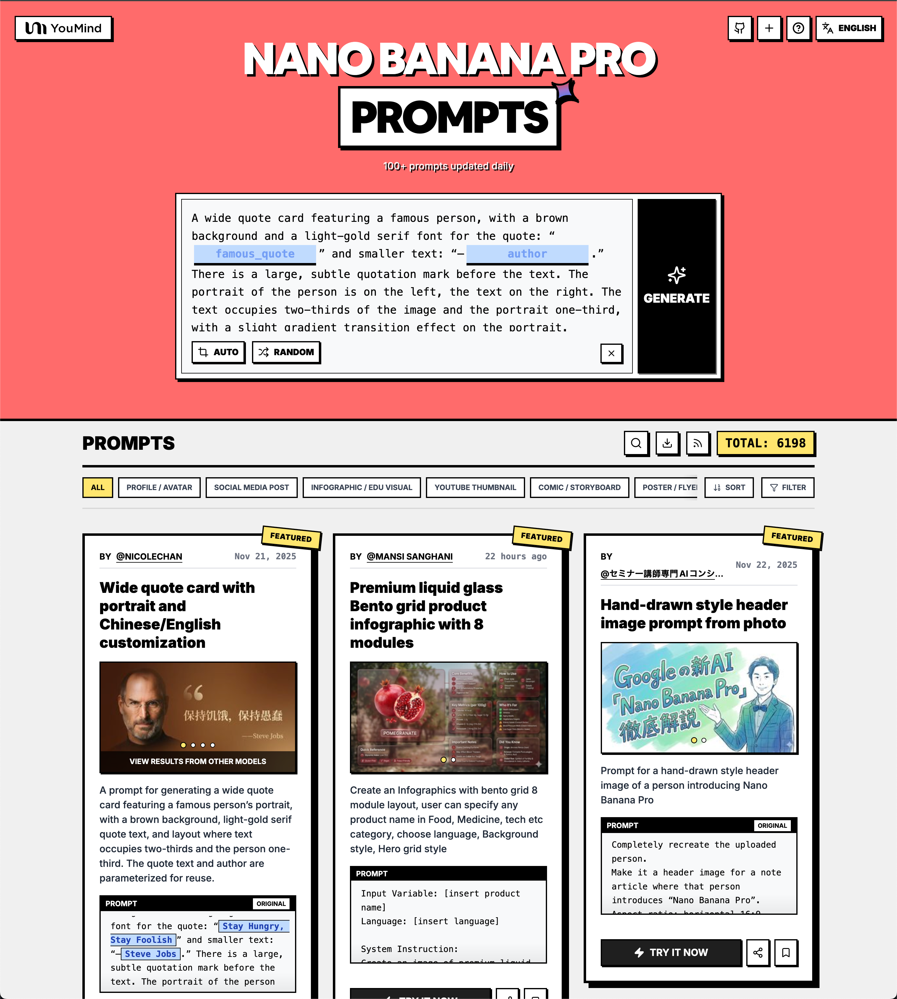

# AI Image Prompt Recommender — 10,000+ Nano Banana Pro Prompts

[](https://youmind.com/nano-banana-pro-prompts)
[](https://clawhub.com/skill/nano-banana-pro-prompts-recommend)
[](https://github.com/YouMind-OpenLab/nano-banana-pro-prompts-recommend-skill)
[]()
[]()
[](LICENSE)

> **Stop spending hours hunting for the right AI image prompt.** Tell your AI assistant what you need in one sentence — it searches 10,000+ curated Nano Banana Pro prompts and returns the top 3 matches with sample images, ready to use.
>
> 🖼️ [Browse the Prompt Gallery →](https://youmind.com/nano-banana-pro-prompts)



## What Is This?

An **AI agent skill** that gives Claude, OpenClaw, Cursor, and other AI assistants the ability to intelligently search a curated library of **10,000+ Nano Banana Pro (Gemini image model) prompts**, recommend the best matches for your use case, and even customize prompts based on your content.

**Nano Banana Pro** is Google's Gemini image generation model — one of the most capable AI image generators available today. High-quality prompts are the key to great results.

## Why Use This Skill?

- ✅ **10,000+ prompts, organized by use case** — not a random dump, but professionally categorized
- ✅ **Every prompt includes sample images** — see the result before you copy
- ✅ **Smart semantic search** — describe what you need, the AI finds the match
- ✅ **Content remix mode** — paste your article or video script, get a custom prompt
- ✅ **Updated twice daily** — always reflects the latest viral prompts from the community
- ✅ **Multi-language** — responds in your language, always provides English prompt for generation

---

## Installation

### OpenClaw (Recommended)

```bash
clawhub install nano-banana-pro-prompts-recommend
```

Or search inside OpenClaw chat:

> "Install the nano banana pro prompts skill from clawhub"

### Claude Code

```bash
npx skills i YouMind-OpenLab/nano-banana-pro-prompts-recommend-skill
```

### Other AI Assistants (Cursor, Codex, Gemini CLI, Windsurf)

```bash
# Universal installer — auto-detects your AI assistant
npx skills i YouMind-OpenLab/nano-banana-pro-prompts-recommend-skill
```

### Manual / openskills

```bash
npx openskills install YouMind-OpenLab/nano-banana-pro-prompts-recommend-skill
```

---

## How to Use

### Mode 1: Direct Search

Just describe what you need:

```
"Find me a cyberpunk-style avatar prompt"
"I need prompts for travel blog article covers"
"Looking for a product photo on white background"
"Help me find a YouTube thumbnail for a tech review video"
```

You'll get up to 3 recommendations with:
- Translated title & description (in your language)
- The exact English prompt to copy
- Sample images to preview the style
- Whether reference images are needed

### Mode 2: Content Illustration (Remix)

Paste your content and ask for a matching illustration:

```
"Here's my article about startup failure — help me create a cover image:
[paste article text]"

"I need a thumbnail for this video script: [paste script]"

"Generate an illustration for this podcast episode about AI: [paste notes]"
```

The skill will:
1. Recommend matching style templates
2. Ask a few questions to personalize (gender, mood, setting)
3. Generate a customized prompt tailored to your content

---

## Prompt Categories

| Category | Count | Use Cases |
|----------|-------|-----------|
| Social Media Post | 10,000+ | Instagram, Twitter/X, Facebook, viral content |
| Product Marketing | 3600+ | Ads, campaigns, promotional materials |
| Profile / Avatar | 1000+ | Headshots, profile pictures, character portraits |
| Others / Mixed | 900+ | Uncategorized creative prompts |
| Poster / Flyer | 470+ | Events, announcements, banners |
| Infographic | 450+ | Data visualization, educational content |
| E-commerce | 370+ | Product photos, listings, white background |
| Game Asset | 370+ | Sprites, characters, items |
| Comic / Storyboard | 280+ | Manga, panels, sequential art |
| YouTube Thumbnail | 170+ | Click-worthy video covers |
| App / Web Design | 160+ | UI mockups, interface designs |

---

## How It Works

```
User describes need
      ↓
Skill identifies category from keyword signals
      ↓
Searches matching JSON file (token-efficient grep, never loads full file)
      ↓
Returns top 3 prompts with images + translated descriptions
      ↓
[Optional] User picks one → Skill remixes it to match their content
```

**Token-efficient by design**: The skill never loads full category files. It uses grep-style search to extract only matching prompts, keeping token usage minimal even with 10,000+ prompts in the library.

---

## Data Source

Prompts are curated from viral posts by top AI artists on Twitter/X, automatically synced to this repository **twice daily** via GitHub Actions. The library grows continuously.

*提示词由 [YouMind.com](https://youmind.com) 通过公开社区搜集 ❤️*
*Prompts curated from the open community by [YouMind.com](https://youmind.com)*

---

## Frequently Asked Questions

**Q: What is Nano Banana Pro?**
Nano Banana Pro is Google's Gemini image generation model (model ID: `gemini-3-pro-image-preview`). It produces high-quality, photorealistic and artistic images from text prompts. [Try it on YouMind →](https://youmind.com/nano-banana-pro-prompts)

**Q: Do I need a YouMind account to use this skill?**
No. The skill is completely free and works with any AI assistant that supports custom skills (OpenClaw, Claude Code, Cursor, Codex, Gemini CLI). You only need a YouMind account if you want to generate images directly on youmind.com.

**Q: How is this different from just searching Twitter for prompts?**
The library is pre-curated and categorized by use case — you don't have to scroll through noise. Every prompt includes sample images so you know what you're getting. The remix mode lets you personalize a template to match your specific content.

**Q: Can I contribute prompts?**
Yes! The prompts are sourced from the public YouMind community. Share your Nano Banana Pro creations on [YouMind](https://youmind.com/nano-banana-pro-prompts) and they'll be picked up in the next sync.

**Q: How often is the library updated?**
Twice daily (00:00 and 12:00 UTC) via automated GitHub Actions.

**Q: Does this work with other image generation models?**
The prompts are optimized for Nano Banana Pro (Gemini), but many work well with other models like GPT Image, Seedream, and DALL-E with minor adjustments.

**Q: What's the difference between OpenClaw and Claude Code installation?**
OpenClaw uses the `clawhub install` command and integrates directly into your OpenClaw agent workspace. Claude Code uses `npx skills i` and installs into your Claude project context. Both use the same SKILL.md and prompt library.

---

## Project Structure

```
nano-banana-pro-prompts-recommend-skill/
├── SKILL.md                 # Skill instructions (works with OpenClaw, Claude Code, Cursor, etc.)
├── README.md
├── package.json
├── scripts/
│   └── generate-references.ts   # Fetches & categorizes prompts from CMS
├── references/              # Auto-generated prompt data (updated twice daily)
│   ├── social-media-post.json
│   ├── product-marketing.json
│   ├── profile-avatar.json
│   ├── {other-categories}.json
│   └── others.json
└── .github/workflows/
    └── generate-references.yml  # Scheduled sync job
```

---

## Development

### Prerequisites

- Node.js 20+
- pnpm

### Setup

```bash
pnpm install

# Create .env with CMS credentials
echo "CMS_HOST=your_host" >> .env
echo "CMS_API_KEY=your_key" >> .env

# Generate references
pnpm run generate
```

### GitHub Actions Secrets

| Secret | Description |
|--------|-------------|
| `CMS_HOST` | PayloadCMS API host |
| `CMS_API_KEY` | PayloadCMS API key |

---

## Related Projects

- 🍌 [awesome-nano-banana-pro-prompts](https://github.com/YouMind-OpenLab/awesome-nano-banana-pro-prompts) — Full prompt gallery with 10,000+ entries, 16 languages
- 🎬 [awesome-seedance-2-prompts](https://github.com/YouMind-OpenLab/awesome-seedance-2-prompts) — Curated video generation prompts for Seedance 2.0
- 🖼️ [YouMind Nano Banana Pro Gallery](https://youmind.com/nano-banana-pro-prompts) — Browse and generate online

## Related Tools

- [OpenClaw](https://openclaw.ai) — AI agent platform with skill ecosystem
- [ClawHub](https://clawhub.com) — Skill marketplace for OpenClaw
- [skills CLI](https://www.npmjs.com/package/skills) — Universal AI skills installer
- [openskills](https://github.com/nicepkg/openskills) — Multi-agent skills loader

---

## License

MIT © [YouMind](https://youmind.com)
