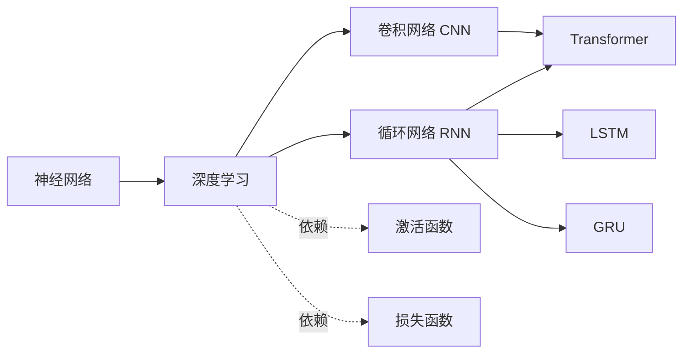

# 神经网络与深度学习

这是整个系列承上启下的一组：上承[机器学习基础](./01-ml-basics.md) 的监督学习范式，
下接 [Transformer 与 LLM 核心](./03-transformer-llm.md)。六篇原文可以分成两组：

- **网络结构组**：[神经网络](../entities/04-neural-network.md) →
  [深度学习](../entities/05-deep-learning.md) →
  [CNN](../entities/06-cnn.md) / [RNN](../entities/09-rnn.md)（两种典型深度网络分支）
- **训练机制组**：[激活函数](../entities/07-activation-function.md)、
  [损失函数](../entities/08-loss-function.md)（神经网络能训练起来的两大数学基石）

## 结构脉络

## 关键要点串联

- 神经网络的训练四步（`daily/04`）：神经元计算 → 激活函数 → 损失函数 → 迭代收敛，
  这四步是理解后续 CNN/RNN/Transformer 一切变体的基础公式 `y' = f(w·x+b)`。
- CNN 解决的是"空间局部性"（图像），RNN 解决的是"时间序列性"（文本/语音），
  两者是 Transformer 出现之前的两条并行技术路线，Transformer（`daily/10`）本质上是同时超越了两者。
- RNN 的 LSTM/GRU 门控机制思想，与后来 [Agent 设计模式](./05-agent-patterns.md) 中
  [Orchestrator-Workers](../entities/27-orchestrator-workers.md) 的"动态调度"思路有相似的工程哲学：
  都是"选择性保留/传递信息，而非全盘处理"。

## 关联聚类

- 上游：[机器学习基础](./01-ml-basics.md)
- 下游：[Transformer 与 LLM 核心](./03-transformer-llm.md)
