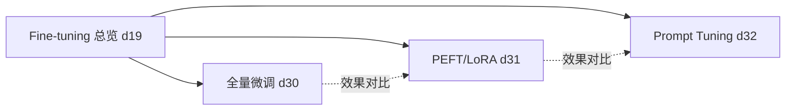

# 模型微调技术

四篇文章构成一个完整的"微调方法谱系"，是系列后期（2026-02~04）的收官主题，与
[AI Agent 设计模式](./05-agent-patterns.md) 一起构成"用好 LLM 的两条路径"：一条靠"训练"（本聚类），
一条靠"编排"（Agent 模式）。

## 谱系关系

## 四种方法完整对比（跨 4 篇原文数据汇总）

| 维度 | 全量微调 | PEFT/LoRA | Prompt Tuning | Prompt Engineering（对照组） |
|---|---|---|---|---|
| 可训练参数比例 | 100% | 0.1%~1% | 0.001%~0.01% | 0% |
| 显存需求（7B 模型） | 140GB+ | 16~24GB | 极小 | 无需训练 |
| 训练时间 | 几天 | 几小时 | 极快 | 无|
| 效果 | 最好（天花板） | 接近全量的 90~95% | 一般 | 不稳定 |
| 适用场景 | 数据>10万条、算力充足 | 资源受限、追求性价比 | 多任务快速切换 | 快速验证想法 |

## 关键洞察串联

- daily/19 提出的 4 种方法总对比表（Prompt Engineering / RAG / Fine-tuning）与本聚类的谱系是
  "横向-纵向"两个维度：daily/19 横向对比"要不要微调"，daily/30~32 纵向展开"怎么微调"。
- 灾难性遗忘（Catastrophic Forgetting）是贯穿 4 篇文章的共同风险点：全量微调最严重，
  PEFT较轻微，Prompt Tuning 因为完全冻结模型参数几乎不存在此问题——这是理解"为什么 PEFT
  成为主流选择"的关键线索。
- LoRA 的核心公式 `h = Wx + BAx`（daily/31）与 [自我注意力机制](../entities/20-self-attention.md)
  的 QKV 矩阵运算（daily/20）都属于"低秩/线性变换"思想的应用，但目的不同：一个是压缩可训练参数，
  一个是计算元素间关联权重。

## 关联聚类

- 上游：[Transformer 与 LLM 核心](./03-transformer-llm.md)（微调对象即该聚类中的 LLM）
- 平行：[AI Agent 与设计模式](./05-agent-patterns.md)
