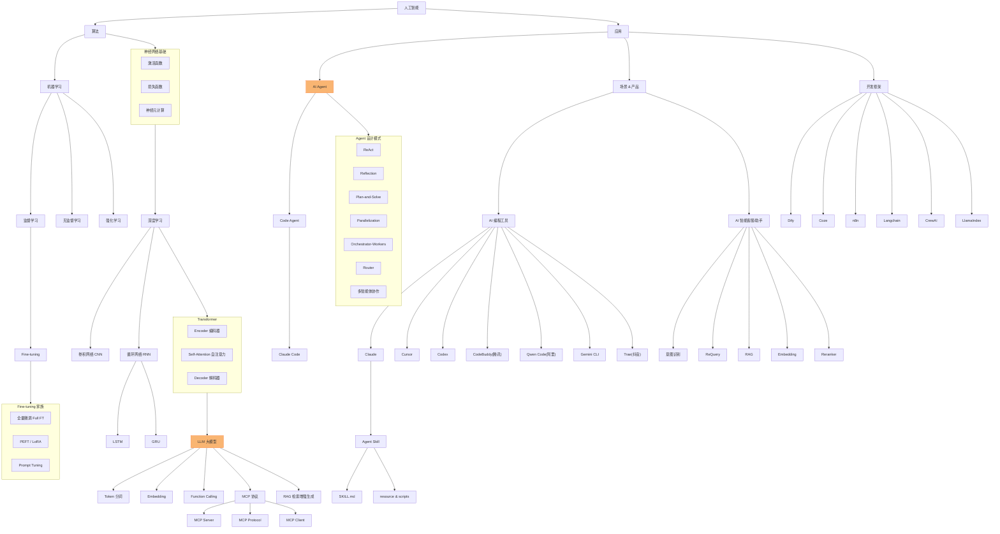

# AILearn Daily · 主知识网络图

> 说明：`daily/18.md`、`19.md`、`30.md` 中已经各自内嵌了一份逐步演进的 Mermaid 知识图（作者本人在系列写作过程中手工维护）。
> 但这份图**并未覆盖 `daily/09`（LSTM/GRU）、`daily/17,20-29`（AI Agent 设计模式全家族）、`daily/32`（Prompt Tuning）**等内容。
> 本文件是对既有图的一次 **Lint + 合并 + 补全**，作为 Wiki 层持续维护的"单一主图"。

## 全景图（合并版）

## 图谱阅读指南

- **左半边（算法脉络）**：机器学习三分支 → 深度学习→ CNN/RNN/Transformer → LLM → Token/Embedding/工具协议，对应
  `daily/01~15、18~20` 的算法演进线。
- **Fine-tuning 家族**：独立成subgraph，串联 `daily/19（总览）→ 30（全量）→ 31（PEFT/LoRA）→ 32（Prompt Tuning）`，
  四篇文章构成一个完整的"微调方法谱系"。
- **右半边（应用脉络）**：AI Agent → 七大设计模式（`daily/23~29`）+ Code Agent/Claude Code（`daily/21,22`），
  对应从"能说"到"能做"再到"能协作"的 Agent 能力演进。
- **场景&产品 / 开发框架**：来自 `daily/17` 中提及的产品生态，属于应用层的横向扩展，暂未展开为独立实体页
  （详见 `../SCHEMA.md` Lint 规则中"原文提到但未建专属页"一项，留作后续 ingest 候选）。

## 与原文内嵌图的差异（Lint 结果）

| 差异点 | 原文内嵌图（daily/30） | 本合并图 | 处理方式 |
|---|---|---|---|
| RNN 未展开 | 只有节点，无 LSTM/GRU | 补充 `RNN --> LSTM & GRU` | 依据 `daily/09.md` 补全 |
| Agent 设计模式家族缺失 | 完全没有 | 新增 `AP` subgraph 七个节点 | 依据 `daily/17,23~29.md` 新增 |
| Code Agent / Claude Code 缺失 | 完全没有 | 新增 `CODEAGENT --> CLAUDECODE` | 依据 `daily/21,22.md` 新增 |
| RAG 位置 | 只出现在 AI 智能客服分支下 | 同时挂在 LLM 主干下+ 客服分支下 | RAG 既是通用 LLM 能力也是客服场景应用，双挂更准确 |
| PEFT 子节点未展开 | `b112["参数高效微调 PEFT/LoRA"]` 单节点 | 独立为 `FT2` 并保留家族关系 | 依据 `daily/31.md` |
| Prompt Tuning 缺失 | 完全没有 | 新增 `FT3` | 依据 `daily/32.md`（当时原文图尚未更新到 32） |

> 建议：若作者后续继续在 `daily/33.md` 等新文章中手工维护内嵌图，可参考本文件同步补全，
> 避免"原文图"与"Wiki 主图"逐渐分叉。
