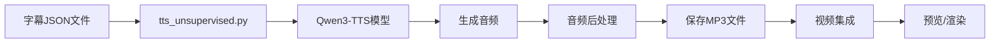

# 无监督学习视频 - 音频旁白系统

## 📋 概述

为无监督学习视频的8个场景自动生成高质量音频旁白的完整解决方案。

## ✨ 特点

- 🤖 **自动化**：自动读取字幕文件，生成对应音频
- 🎯 **高质量**：使用Qwen3-TTS 1.7B模型，生成自然流畅的中文语音
- 🎨 **统一音色**：所有场景使用相同的语音角色
- ⚡ **智能优化**：自动控制时长、标准化音量、提高清晰度
- 🔄 **重试机制**：自动重试失败任务，提高成功率
- 🕐 **时间同步**：自动更新字幕时间戳，与音频时长完美同步

## 🚀 快速开始

### 1. 安装依赖

```bash
pip install torch transformers accelerate qwen-tts soundfile librosa numpy tqdm
```

### 2. 下载模型（首次使用）

```bash
git lfs install
git clone https://huggingface.co/Qwen/Qwen3-TTS-12Hz-1.7B-Base
```

### 3. 生成音频

```bash
python3 tts_unsupervised.py
```

### 4. 预览视频

```bash
npm start
# 访问 http://localhost:3001
```

## 📁 文件结构

```
remotion-videos/
├── tts_unsupervised.py              # 音频生成脚本
├── AUDIO_QUICKSTART.md              # 快速开始指南
├── AUDIO_GENERATION_UNSUPERVISED.md # 完整使用文档
├── CAPTIONS_UNSUPERVISED.md         # 字幕说明文档
├── QUICKSTART_UNSUPERVISED.md       # 视频快速开始
├── Qwen3-TTS-12Hz-1.7B-Base/        # TTS模型目录
├── borfy.mp3                        # 参考音频（可选）
├── public/UnsupervisedLearningVideo/
│   ├── scene1-captions.json         # 字幕文件
│   ├── scene1-audio.mp3             # 生成的音频
│   ├── scene2-captions.json
│   ├── scene2-audio.mp3
│   └── ... (scene3-8)
└── src/
    └── UnsupervisedLearningVideo.tsx # 视频主文件
```

## 🎬 工作流程



## 📊 场景配置

| 场景 | 名称 | 字幕文件 | 音频文件 | 时长 |
|------|------|----------|----------|------|
| Scene 1 | 介绍 | scene1-captions.json | scene1-audio.mp3 | 6秒 |
| Scene 2 | 定义 | scene2-captions.json | scene2-audio.mp3 | 8秒 |
| Scene 3 | 三种方法 | scene3-captions.json | scene3-audio.mp3 | 6秒 |
| Scene 4 | 聚类详解 | scene4-captions.json | scene4-audio.mp3 | 10秒 |
| Scene 5 | 降维详解 | scene5-captions.json | scene5-audio.mp3 | 10秒 |
| Scene 6 | 关联详解 | scene6-captions.json | scene6-audio.mp3 | 10秒 |
| Scene 7 | 动手实验 | scene7-captions.json | scene7-audio.mp3 | 8秒 |
| Scene 8 | 实际案例 | scene8-captions.json | scene8-audio.mp3 | 8秒 |

## 🔧 技术细节

### TTS模型参数

```python
{
    "max_new_tokens": 512,        # 控制最大生成长度
    "temperature": 0.3,           # 提高语音稳定性
    "top_k": 10,                  # 严格采样策略
    "top_p": 0.7,                 # 保守采样
    "repetition_penalty": 1.5,    # 避免重复
}
```

### 音频后处理

- ✅ 时长检查：自动裁剪超过30秒的音频
- ✅ 音量标准化：标准化到-3dB
- ✅ 低通滤波：提高语音清晰度
- ✅ 质量检查：验证音频时长和质量

## 📚 文档导航

### 快速开始
- [音频生成快速指南](./AUDIO_QUICKSTART.md) - 3步完成音频生成
- [视频快速开始](./QUICKSTART_UNSUPERVISED.md) - 视频项目快速开始

### 详细文档
- [完整音频生成指南](./AUDIO_GENERATION_UNSUPERVISED.md) - 详细使用说明
- [字幕使用说明](./CAPTIONS_UNSUPERVISED.md) - 字幕系统文档

### 技术参考
- [Qwen3-TTS文档](https://github.com/QwenLM/Qwen-TTS)
- [Remotion音频指南](https://www.remotion.dev/docs/audio)

## 🎯 使用场景

### 场景1：首次生成音频

```bash
# 1. 安装依赖
pip install -r requirement.txt

# 2. 下载模型
git clone https://huggingface.co/Qwen/Qwen3-TTS-12Hz-1.7B-Base

# 3. 生成所有音频
python3 tts_unsupervised.py

# 4. 预览效果
npm start
```

### 场景2：更新字幕后重新生成

```bash
# 1. 修改字幕JSON文件
vim public/UnsupervisedLearningVideo/scene1-captions.json

# 2. 重新生成音频
python3 tts_unsupervised.py

# 3. 预览更新
npm start
```

### 场景3：只生成特定场景

```python
# 编辑 tts_unsupervised.py
SCENE_CONFIG = {
    "scene1": {...},  # 保留需要的场景
    # "scene2": {...},  # 注释掉不需要的场景
}
```

## 🔍 故障排除

### 常见问题

| 问题 | 原因 | 解决方案 |
|------|------|----------|
| 模型加载失败 | 模型未下载 | 运行 `git clone` 下载模型 |
| GPU内存不足 | 显存不够 | 修改为CPU模式 |
| 音频过长/过短 | 文本长度问题 | 调整字幕文本或参数 |
| 语音质量差 | 参数设置 | 降低temperature |
| 依赖包缺失 | 未安装 | `pip install -r requirement.txt` |

详细解决方案请查看：[完整音频生成指南](./AUDIO_GENERATION_UNSUPERVISED.md#故障排除)

## 💡 最佳实践

1. **字幕优化**
   - 保持文本简洁
   - 使用标点符号控制停顿
   - 避免过长句子

2. **质量检查**
   - 生成后试听每个音频
   - 检查音量一致性
   - 确认时长匹配

3. **性能优化**
   - 使用GPU加速（快10倍）
   - 批量生成所有场景
   - 缓存模型避免重复加载

4. **版本控制**
   - 备份原始音频
   - 记录生成参数
   - 便于后续调整

## 🎉 完成后

音频生成完成后：

1. ✅ 运行 `npm start` 预览视频
2. ✅ 检查音频与字幕同步
3. ✅ 调整音量和时长（如需要）
4. ✅ 运行 `npm run build:unsupervised` 渲染最终视频

## 📞 支持

如有问题，请查看：
- [完整文档](./AUDIO_GENERATION_UNSUPERVISED.md)
- [常见问题](./AUDIO_GENERATION_UNSUPERVISED.md#故障排除)
- [Qwen3-TTS GitHub](https://github.com/QwenLM/Qwen-TTS)

## 📄 许可

本项目使用的 Qwen3-TTS 模型遵循其原始许可协议。
