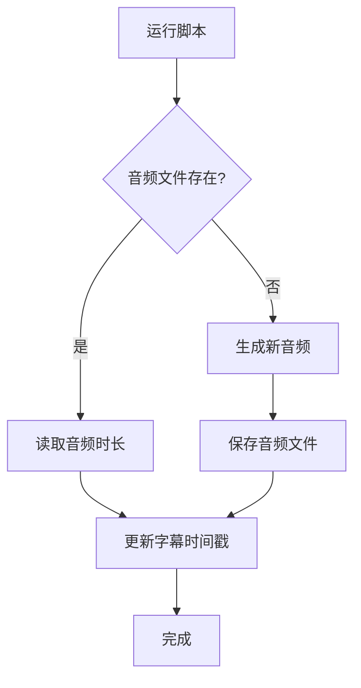

# 🎉 音频旁白系统 - 更新说明

## ✅ 新增功能（2026-02-10）

### 智能音频检测

脚本现在会自动检测音频文件是否已存在：

- ✅ **如果音频已存在**：直接读取音频时长，更新字幕时间戳，跳过生成
- ✅ **如果音频不存在**：使用TTS模型生成新音频
- ✅ **自动同步**：确保字幕时长与音频时长一致

### 使用方法

#### 1. 检测当前状态

运行测试脚本查看音频和字幕状态：

```bash
python3 test_audio_detection.py
```

输出示例：
```
场景         音频文件       音频时长         字幕时长         差异         状态
--------------------------------------------------------------------------------
介绍         ✓            3.82秒      6.00秒     2.18秒 (57.0%)  ⚠️  需更新
定义         ✓            4.78秒      8.00秒     3.22秒 (67.3%)  ⚠️  需更新
...
```

#### 2. 更新字幕时间戳

如果音频已存在但字幕需要更新，运行：

```bash
python3 tts_unsupervised.py
```

脚本会：
- ✅ 检测到音频已存在
- ✅ 读取音频实际时长
- ✅ 自动更新字幕时间戳
- ✅ 跳过音频生成（节省时间）

输出示例：
```
📝 处理场景: scene1 - 介绍
✓ 音频文件已存在: public/UnsupervisedLearningVideo/scene1-audio.mp3
📊 音频时长: 3.82秒
🔄 更新字幕时间戳...
   原始时长: 6000ms, 音频时长: 3820ms, 缩放比例: 0.64
✓ 字幕时间戳已更新: public/UnsupervisedLearningVideo/scene1-captions.json
✅ 场景处理完成（使用已存在音频）
```

#### 3. 重新生成特定音频

如果需要重新生成某个场景的音频：

```bash
# 删除音频文件
rm public/UnsupervisedLearningVideo/scene1-audio.mp3

# 运行脚本重新生成
python3 tts_unsupervised.py
```

## 📊 工作流程



## 🎯 优势

1. **节省时间**：已有音频无需重新生成
2. **自动同步**：字幕时长自动匹配音频
3. **灵活控制**：可选择性重新生成
4. **智能检测**：自动判断是否需要更新

## 📝 字幕时间戳更新逻辑

脚本会根据音频实际时长，按比例调整所有字幕的时间戳：

```python
# 计算缩放比例
scale_ratio = audio_duration_ms / original_duration_ms

# 更新每个字幕的时间戳
for caption in captions:
    caption['startMs'] = int(caption['startMs'] * scale_ratio)
    caption['endMs'] = int(caption['endMs'] * scale_ratio)
    caption['timestampMs'] = int(caption['timestampMs'] * scale_ratio)
```

### 示例

假设：
- 原始字幕时长：6000ms (6秒)
- 实际音频时长：3820ms (3.82秒)
- 缩放比例：3820 / 6000 = 0.637

字幕更新：
- 原始：`startMs: 0, endMs: 2000` → 更新：`startMs: 0, endMs: 1274`
- 原始：`startMs: 2000, endMs: 4000` → 更新：`startMs: 1274, endMs: 2548`
- 原始：`startMs: 4000, endMs: 6000` → 更新：`startMs: 2548, endMs: 3822`

## 🔧 配置说明

### 跳过更新阈值

如果音频时长与字幕时长差异小于10%，则不更新：

```python
duration_diff_ratio = abs(audio_duration_ms - original_duration_ms) / original_duration_ms
if duration_diff_ratio < 0.1:
    print("字幕时长与音频时长接近，无需更新")
    return True
```

可以修改这个阈值（当前10%）来调整更新策略。

## 📚 相关文件

- **tts_unsupervised.py** - 主脚本（已更新）
- **test_audio_detection.py** - 测试脚本（新增）
- **AUDIO_UPDATE_GUIDE.md** - 本文档（新增）

## 💡 使用建议

1. **首次使用**：运行 `python3 tts_unsupervised.py` 生成所有音频
2. **后续更新**：
   - 先运行 `python3 test_audio_detection.py` 检查状态
   - 如果需要更新字幕，运行 `python3 tts_unsupervised.py`
   - 如果需要重新生成音频，先删除对应的MP3文件
3. **预览效果**：运行 `npm start` 查看视频效果

## 🎉 总结

现在你可以：
- ✅ 自动检测已存在的音频文件
- ✅ 读取音频实际时长
- ✅ 自动更新字幕时间戳
- ✅ 跳过不必要的音频生成
- ✅ 节省大量时间和计算资源

完美的音频和字幕同步系统！🚀
