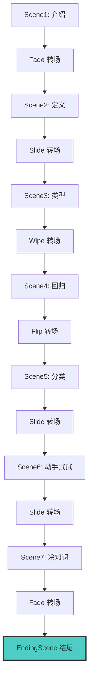
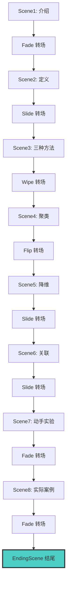

# 视频项目架构

## 组件结构

```
remotion-videos/
├── src/
│   ├── components/
│   │   ├── CaptionComponent.tsx      # 字幕组件
│   │   ├── EndingScene.tsx           # 🆕 公共结尾场景组件
│   │   └── Transition.tsx            # 转场组件
│   │
│   ├── scenes/
│   │   ├── Scene1_Introduction.tsx   # 监督学习场景
│   │   ├── Scene2_Definition.tsx
│   │   ├── Scene3_Types.tsx
│   │   ├── Scene4_Regression.tsx
│   │   ├── Scene5_Classification.tsx
│   │   ├── Scene6_HandsOn.tsx
│   │   ├── Scene7_FunFact.tsx
│   │   └── unsupervised/
│   │       ├── Scene1_Introduction.tsx
│   │       ├── Scene2_Definition.tsx
│   │       ├── Scene3_Methods.tsx
│   │       ├── Scene4_Clustering.tsx
│   │       ├── Scene5_Dimensionality.tsx
│   │       ├── Scene6_Association.tsx
│   │       ├── Scene7_HandsOn.tsx
│   │       └── Scene8_Cases.tsx
│   │
│   ├── SupervisedLearningVideo.tsx   # 监督学习主视频
│   ├── UnsupervisedLearningVideo.tsx # 无监督学习主视频
│   └── Root.tsx                      # 根组件
│
├── public/
│   ├── scene8-ending.mp3             # 结尾音频（共用）
│   ├── scene8-ending-captions.json   # 结尾字幕（共用）
│   └── UnsupervisedLearningVideo/
│       ├── scene1-audio.mp3
│       ├── scene1-captions.json
│       └── ...
│
└── docs/
    └── EndingScene.md                # EndingScene 使用文档
```

## 视频结构流程图

### SupervisedLearningVideo（监督学习）



### UnsupervisedLearningVideo（无监督学习）



## EndingScene 组件特性

### 动画效果
1. **淡入效果**（0-30帧）：从透明到完全显示
2. **缩放效果**（最后30帧）：从1.0缩放到1.2

### 可配置属性
- `mainTitle`: 主标题（默认："感谢观看"）
- `subtitle`: 副标题（默认："若喜欢请关注"）
- `description`: 描述文本（默认："每天5分钟，轻松学AI"）

### 视觉样式
- 渐变色标题（#ff6b6b → #4ecdc4）
- 深色背景（#1a1a1a）
- 文字阴影和发光效果
- 响应式文字大小

## 使用模式

所有视频都应该遵循以下模式来添加结尾场景：

```tsx
{/* 最后一个内容场景 */}
<TransitionSeries.Sequence durationInFrames={240}>
  <LastContentScene />
  {/* 音频和字幕 */}
</TransitionSeries.Sequence>

{/* 转场到结尾 */}
<TransitionSeries.Transition
  presentation={fade()}
  timing={linearTiming({ durationInFrames: 30 })}
/>

{/* 结尾场景 */}
<TransitionSeries.Sequence durationInFrames={180}>
  <EndingScene />
  <Html5Audio src={staticFile("scene8-ending.mp3")} volume={0.8} />
  <CaptionComponent
    audioFile="scene8-ending.mp3"
    captionFile="scene8-ending-captions.json"
    startTimeMs={0}
  />
</TransitionSeries.Sequence>
```

## 帧数计算

添加 EndingScene 需要增加的总帧数：
- 转场：30 帧（1秒）
- 场景：180 帧（6秒）
- **总计：210 帧（7秒）**

## 已应用视频

| 视频 | 原始帧数 | 新增帧数 | 最终帧数 | 时长 |
|------|---------|---------|---------|------|
| SupervisedLearningVideo | 1892 | 0（已有） | 1892 | 63.07秒 |
| UnsupervisedLearningVideo | 1787 | +210 | 1997 | 66.6秒 |

## 后续视频开发指南

1. **创建场景组件**：在 `src/scenes/` 下创建各个场景
2. **准备资源**：音频和字幕文件放在 `public/` 目录
3. **组装视频**：在主视频文件中使用 `TransitionSeries` 组装场景
4. **添加结尾**：使用 `EndingScene` 组件作为最后一个场景
5. **更新配置**：在 `Root.tsx` 中注册新视频并设置正确的帧数
