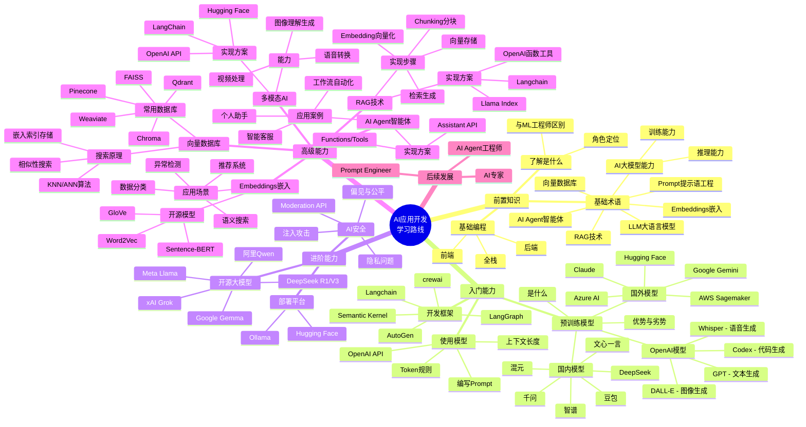

> 做一个有温度和有干货的技术分享作者 —— [Qborfy](https://qborfy.com)

> 本文参考 [roadmap.sh](https://roadmap.sh/) [AI Engineer(AI应用开发工程师)RoadMap](https://roadmap.sh/ai-engineer)整理，如有侵权，请联系删除。

学习一门技能最重要的是**目标**和**路线**：

- 有了目标，才能知道自己所学可以用到哪里
- 有了路线，才能知道自己该学什么，怎么学

<!-- more -->

# 2025年AI应用开发最佳学习路线

## AI学习路线思维导图

## 学习路线详解

### 前置知识

#### 了解是什么
- 角色和工作职责定位：专门设计、开发和实施人工智能 (AI) 系统
- 与ML(机器学习)工程师的区别
#### 了解是什么
- 角色和工作职责定位：专门设计、开发和实施人工智能 (AI) 系统
- 与ML(机器学习)工程师的区别

#### 基础知识与术语
- 人工智能与通用人工智能
- LLM大语言模型
- AI大模型能力
    - 推理能力
    - 训练能力
- Embeddings 嵌入大模型
- 向量数据库
- RAG 技术
- AI Agent智能体
- Prompt 提示语工程

#### 基础编程技能
- 前端
- 后端
### 入门能力

#### 了解预训练模型

**是什么**
- 是指已在大型数据集上训练过的机器学习 (ML) 模型，用于解决特定任务或任务集
- 常见的预训练模型是：OpenAI 的 GPT-4、DeepSeek R1等

**优势**
- 显著减少开发时间和计算资源
- 可针对特定任务进行微调，从而能够以更少的数据实现更快的部署和更佳的性能
- 在不同任务中表现出更高的准确性、泛化能力和鲁棒性

**劣势**
- 带有训练数据中存在的偏差
- 基于通用数据进行训练，因此如果不进行进一步微调，它们可能无法在特定领域或特定任务上表现良好
- "黑箱"特性，这使得它们的决策过程难以解读和解释

**OpenAI预训练模型**
- GPT模型：文本生成、对话
- Codex模型：代码生成
- DALL-E模型：图像生成
- Whisper模型：语音生成

**其他主流预训练 AI 模型**

| 国内 | 国外 |
|------|------|
| DeepSeek | Claude |
| 智谱 | Google's Gemini |
| 文心一言 | Azure AI |
| 混元 | AWS Sagemaker |
| 千问 | Hugging Face Models |
| 豆包 | Mistral AI / Cohere / Replicate |

#### 使用预训练模型
- **Token的规则**：限制长度、价格规则
- **上下文长度**：一次可以处理的输入文本量
- **截止日期**：训练数据最后更新时间
- **编写Prompt**
- **OpenAI API**：Playground API在线调试、微调能力

#### 主流开发框架
- Langchain
- LangGraph（Langchain的高级抽象）
- crewai
- Semantic Kernel
### 进阶能力

#### 了解开源AI大模型
- 源代码和架构公开开放，可供使用、修改和分发的模型

**2024年最佳开源大模型**
- DeepSeek R1/V3模型
- Meta Llama模型
- Google Gemma模型
- Hugging Face BLOOM模型
- 阿里 Qwen模型
- xAI Grok模型

#### 使用和部署开源AI大模型

**Hugging Face平台**
- Hub平台安装部署
- 浏览器中 Transformers.js
- SDK使用

**Ollama平台**
- 安装部署
- SDK使用

#### AI 安全相关

**常见的AI安全问题**
- 即时注入攻击
- 安全和隐私问题
- AI模型中的偏见与公平

**安全预防措施**
- OpenAI提供的 Moderation API检查
- 提示语中添加最终用户 ID
- 对抗性测试
- 完整的prompt
### 高级能力

#### Embeddings嵌入模型

**是什么**
- 通过将数据转换为固定长度的向量，嵌入使机器学习模型能够更有效地处理和理解数据

**应用场景**
- 语义搜索
- 数据分类
- 推荐系统
- 异常检测

**使用**
- OpenAI Embedding API（注意价格因素）
- 使用开源模型
    - Hugging Face Hub
    - Ollama平台
    - 常见开源Embedding模型
        - 单词向量：Word2Vec、GloVe 和 FastText
        - 句子和图像向量：Sentence-BERT 和 CLIP

#### Vector Databases 向量数据库

**是什么**
- 存储、管理和检索由 AI 模型生成的高维向量（嵌入向量），执行快速高效的相似性搜索

**常用向量数据库**
- Chroma
- Pinecone
- Weaviate
- FAISS
- LanceDB
- Qdrant
- Supabase
- MongoDB Atlas

**嵌入搜索实现原理**
1. **Indexing Embeddings（嵌入索引存储）**：将数据（例如文本、图像或音频）转换为高维向量，每个嵌入都会与其相关的元数据编入索引
2. **Performing Similarity Search（相似性搜索）**：将用户的查询转换为向量嵌入，与数据库中存储的向量进行比较，得出最相似的嵌入数据
    - 常见相似算法：K 最近邻算法、近似最近邻算法

#### RAG检索增强生成技术方案

**是什么**
将信息检索与语言生成相结合，以生成更准确、更情境感知的响应：
- 检索器：用于搜索数据库以查找相关信息
- 生成器：用于根据检索到的数据生成响应

**RAG 对比 模型微调**
| 方案 | 适用场景 |
|------|----------|
| 微调 | 专门的静态任务 |
| RAG | 需要实时、基于事实的响应的动态任务 |

**实现步骤**
1. **Chunking 分块**：将文本、图片、视频分块
2. **Embedding 模型**：将分块文本转换为向量
3. **向量数据库**：将分块向量存入
4. **检索器**：通过Embedding 模型将用户输入转换为向量到数据库中搜索对比
5. **生成答案**：将用户输入与搜索答案给到AI大模型进行推理回答

**实现方案**
- 直接使用 AI大模型能力（如：OpenAI 函数和工具）
- Langchain开发框架
- Llama Index工具

#### AI Agent智能体开发

**是什么**
- 让AI大模型能与外部系统、用户或其他代理交互以执行复杂的任务

**应用案例**
- 智能客服
- 工作流自动化
- 个人助手

**可实现方案**
- 手动实施，利用AI SDK本身提供的能力（如：OpenAI的函数与Vercel 的API）
- AI大模型提供 Functions / Tools 能力，集成外部 API 和功能来扩展语言模型的功能
- Assistant API，利用多轮对话实现与用户的交互

#### 多模态人工智能

**是什么**
- 图像、视频、音频理解和生成
- 文本转语音、语音转文本

**应用场景**
- 视觉问答
- 内容审核
- 增强型搜索引擎
- AR应用

**实现多模态的方案**

*AI大模型提供的能力*
- OpenAI API
    - Vision API
    - DALL-E API
    - Whisper API
- 开源模型：Hugging Face提供 BERT、GPT、T5 和 CLIP 等热门模型

*开发框架*
- LangChain开发框架
- Llamaindex开发框架

#### AI开发工具

| 类型 | 代表工具 |
|------|----------|
| AI 代码编辑器 | Cursor |
| 代码补全工具 | GitHub Copilot、Tabnine |

### 后续发展路线

#### Prompt Engineering 提示语工程师
> [学习路线](https://roadmap.sh/prompt-engineering)

#### AI Agent智能体开发工程师
> [学习路线](https://roadmap.sh/ai-agents)

#### AI专家
> [学习路线](https://roadmap.sh/ai-data-scientist)

---

# 参考资料
- [AI Engineer RoadMap (AI应用开发工程师学习路线图)](https://roadmap.sh/ai-engineer)
- [如何选择AI Agent框架？五种主流AI Agent框架对比](https://zhuanlan.zhihu.com/p/717978798)