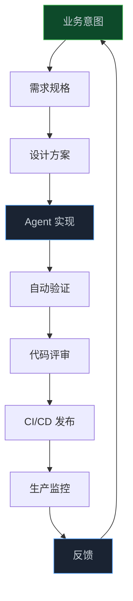
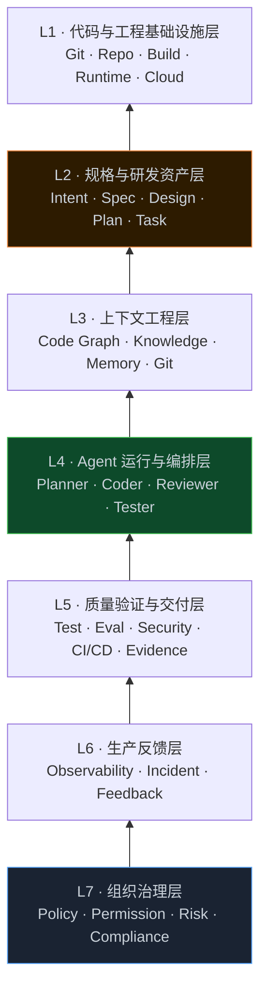
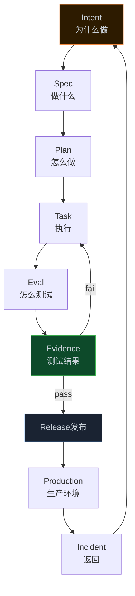
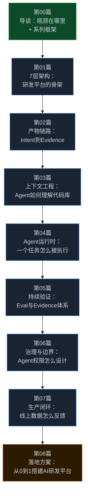

> **📖 系列难度说明**：本篇为**入门导读**，适合所有对 AI 研发感兴趣的读者。无需前置知识。
> **🎁 核心收获**：读完本篇你将能够理解 AI Native SDLC 的本质，知道它和"AI 写代码"的区别，以及这个系列完整的路线图——包括 7 层架构、产物链路、测试验证体系和完整研发闭环。

你用 Cursor 或者 Claude Code 写代码，感觉效率提升了不少。但有一天你突然发现，代码写得更快了，需求评审还是那么慢，测试还是那么久，上线还是那么麻烦。

快了一步，卡在了下一步。

这不是工具的问题。这是流程的问题。

<!-- more -->

---

## 一个让我想了很久的问题

Anthropic 在 2026 年发布了一篇文章，标题叫《The AI-Native SDLC Playbook》。里面有一句话我反复读了好几遍：

> **Code is no longer the bottleneck.**

代码不再是瓶颈。

这句话乍一看很正常，但仔细想想，它其实在说一件很颠覆的事：我们过去几十年优化的那个东西——写代码的速度、代码质量、代码复用——已经不是最慢的那个环节了。

那最慢的是什么？

是需求怎么变成清晰的任务，是 Agent 怎么理解你的代码库，是生成的代码怎么被验证，是改动怎么安全地上线，是线上问题怎么反馈回来触发下一轮修改。

换句话说，**瓶颈从"写"转移到了"写之前"和"写之后"**。

这就是 AI Native SDLC 想解决的问题。

---

## AI 写代码 vs AI Native 研发流程

很多人把这两件事混在一起，但它们差得很远。

**AI 写代码**是这样的：

```
你 → 写 Prompt → AI 生成代码 → 你 Review → 你提交
```

整个流程里，AI 只是一个更聪明的代码补全工具。你还是主角，AI 是助手。研发流程本身没有变。

**AI Native 研发流程**是这样的：



注意这里的变化：

- 不是你写 Prompt，而是**意图变成了机器可读的规格文档**
- 不是 AI 帮你写代码，而是**Agent 贯穿整个研发流程**
- 不是你手动测试，而是**验证本身也是自动化的**
- 不是发布完就结束，而是**生产数据会反馈回来触发下一轮**

这是两种完全不同的研发模式。前者是"AI 辅助"，后者是"AI Native"。

---

## 研发范式正在分层

如果把现在的 AI 研发能力按成熟度排列，大概是这样：

| 层级 | 模式           | 核心特征                                  |
| ---- | -------------- | ----------------------------------------- |
| L1   | AI 助手        | AI 帮人写代码，人是主角                   |
| L2   | AI 编码        | AI 大量生成代码，人做 Review              |
| L3   | Coding Agent   | AI 自主完成一个完整任务                   |
| L4   | Agentic SDLC   | Agent 贯穿研发流程多个环节                |
| L5   | AI Native SDLC | **整个研发流程围绕 Agent 重新设计** |
| L6   | 自主工程       | Agent 自主运行研发闭环                    |

大多数团队现在在 L1-L2，少数在 L3。真正值得研究的是 L4 到 L5 的跨越。这个跨越不是换一个更好的 AI 工具，而是**重新思考研发流程的每一个环节**。

---

## 这个系列的核心框架：7 层架构

在深入每个话题之前，我想先把整个系列的底层框架说清楚。

基于对 Anthropic、OpenAI、GitHub、AWS Kiro 等主流方案的研究，我把 AI Native 研发平台抽象成 **7 层架构**：



用一句话记住这 7 层：

- L1 是 Agent 工作的工程环境；
- L2 定义 Agent 要做什么；
- L3 告诉 Agent 需要知道什么；
- L4 负责 Agent 怎么做；
- L5 证明它做对了；
- L6 判断线上是否真的工作；
- L7 决定 Agent 在什么边界内可以自主行动。

这 7 层不是简单的上下调用关系，而是一个**双向闭环**：

- L6 的生产数据会反馈回 L2 触发新一轮研发，

- L7 横切所有层做治理控制。

---

## 另一个核心框架：产物链路 Event-driven SDLC

光有架构层次还不够。AI Native SDLC 和传统研发最大的区别之一，是**研发过程中的中间状态全部变成了可版本控制的产物（Artifact）**。

这条产物链路是：



每个产物都有 ID、版本、状态、来源、上下游关系的标准规范，不是普通markdown文档，而是 **Agent 可以读取、生成、修改、验证、关联和消费的工程对象**。

传统研发的需求文档写完就扔，AI Native 的 `intent.md` 会触发 `spec.md`，`spec.md` 批准后触发 `plan.md`，`plan.md` 分解成 Task 交给 Agent 执行，执行结果产生 Evidence，Evidence 通过 Policy Gate 才能发布。

这就是 **Event-driven SDLC**。

---

## 还有一个关键变化：测试变成了验证

传统测试回答的是：代码运行时有没有失败？

AI Native 的 Eval 回答的是：Agent 是否完成了正确的工程任务？

Evidence 回答的是：我们有什么可验证、可追溯的事实证明它完成了？

这三层组合起来，才是真正意义上的 AI Native 代码质量体系。一个 PR 不应该只有 Diff，而应该是：

```
PR
├── Spec（做什么）
├── Plan（怎么做）
├── Diff（改了什么）
├── Unit Tests（功能测试）
├── E2E（端到端测试）
├── Agent Eval（Agent 行为验证）
├── Security Scan（安全扫描）
├── Review（代码评审）
└── Evidence（可追溯证明）
```

---

## 这个系列会讲什么

基于以上三个核心框架（7 层架构 + 产物链路 + 验证体系），我把这个系列设计成 **9 篇**，覆盖从入门到落地的完整路径：



每篇的核心问题：

| 篇号 | 核心问题                             | 你能获得什么                                         |
| ---- | ------------------------------------ | ---------------------------------------------------- |
| 00   | AI Native SDLC 到底是什么            | 全局视角 + 三大框架概览 + 系列路线图                 |
| 01   | AI Native新研发流程的 7 层架构是什么 | 7 层定义 + 各层职责 + 与主流方案的对应关系           |
| 02   | 产物链路怎么设计                     | Intent/Spec/Plan/Task/Eval/Evidence Schema + Lineage |
| 03   | Agent 怎么理解一个真实的代码库       | Context Engineering + Code Graph 原理与实践          |
| 04   | 一个 Agent 怎么完成完整的工程任务    | Agent Harness + 工具系统 + 多 Agent 协作             |
| 05   | 怎么证明 Agent 做的东西是对的        | Eval vs Test + Evidence 体系 + Change Quality        |
| 06   | Agent 的权限边界怎么设计             | Governance + Permission + 审批机制                   |
| 07   | 生产数据怎么触发下一轮研发           | 闭环设计 + Production Feedback Loop                  |
| 08   | 怎么从 0 到 1 搭建 AI 研发平台       | MVP 方案 + 技术选型 + 分阶段落地路径                 |

### 你适合从哪里开始？

| 你的情况                         | 建议读法             |
| -------------------------------- | -------------------- |
| 刚接触 AI 研发，想了解全貌       | 从第 00 篇顺序读     |
| 已经在用 AI 写代码，想进一步提效 | 第 00、01、02 篇     |
| 在搭建 AI 研发平台或工具链       | 第 01、02、03、04 篇 |
| 关注 AI 代码质量和安全           | 第 05、06 篇         |
| 做研发效能或 DevOps 方向         | 第 06、07 篇         |
| 想直接看落地方案                 | 直接看第 08 篇       |

---

## 附录：全球大厂都在做什么

这不是某一家公司的想法。2026 年，几乎所有主要的科技公司都在往这个方向走，只是切入点不同。

Anthropic 给出了最完整的方法论，把研发流程拆成六个阶段，每个阶段都有对应的 AI 能力和产出物。他们最重要的判断是：研发过程中的中间状态，应该全部变成可版本控制的文档——`intent.md`、`spec.md`、`plan.md`，这些不只是给人看的，更是 Agent 之间传递信息的载体。

OpenAI 的思路不太一样，他们更关注 Agent 的运行环境。他们做了一个叫 Harness 的实验，让 Codex 从一个空的代码仓库开始，自己生成代码、测试、CI 配置、文档，人类只负责设定方向和最终审批。他们发现，限制 Agent 的不是模型能力，而是**环境有没有给 Agent 足够的工具、上下文和反馈**。

GitHub 的角度更实际——它本来就拥有 Issue、PR、Actions、Security 这些研发基础设施，所以它在做的是让 Agent 成为这套工作流的原生参与者。一个 Issue 进来，Agent 自动领取、实现、测试、提 PR，人类只需要做最终的 Review 和合并。

AWS 的 Kiro 则专注在研发流程的最前端：先把需求变成结构化的规格，再让 Agent 去实现。这解决了一个很实际的问题——Agent 不知道"做到什么程度算完成"，有了 Spec 就有了明确的验收标准。

这些公司的切入点不同，但方向高度一致：

**研发流程本身需要被重新设计，而不只是在原有流程里加一个 AI 工具**。

---

## 一个值得提前说的判断

在正式开始之前，有一件事我想先说清楚。

Meta 在 2026 年推动了一个叫 Project OT 的计划，想通过 AI Native 的方式大幅压缩研发团队规模，目标是某些团队减少最多 60%。结果呢？因为 AI 生产力没达到预期、可靠性问题、员工阻力等原因，计划大幅缩水。

Google 引用的 DORA 研究也发现，AI 使用率提升并不会自动转化成系统级的交付性能提升，甚至在某些指标上出现了反直觉的结果。

这说明一件事：**Agent 能力提升 ≠ 研发效率自动提升**。

真正需要优化的不只是 AI 工具，而是：

```
AI 能力 + 流程设计 + 上下文管理 + 架构质量 + 验证体系 + 治理机制 + 组织协作
```

这个系列不是在告诉你"用了这些工具你就能提效 50%"。而是帮你理解，当 AI 真正深入研发流程之后，哪些环节会成为新的瓶颈，以及怎么系统性地解决它们。

---

## 📝 小结

- AI Native SDLC 不是"AI 写代码"，而是**整个研发流程围绕 Agent 重新设计**
- 瓶颈已经从"写代码"转移到了需求规格、上下文管理、验证体系、治理机制和生产反馈
- 这个系列围绕三个核心框架展开：**7 层架构**（研发平台的骨架）、**产物链路**（Intent → Evidence 的完整链条）、**验证体系**（从 Test 到 Eval 到 Evidence）
- 真正的 AI Native 是一个闭环：意图 → 规格 → 上下文 → Agent → 验证 → 发布 → 生产 → 反馈 → 意图
- Agent 能力提升不等于效率自动提升，流程、架构、治理同样重要

---

## 🔮 下一篇预告

说了这么多，第一步从哪里开始？

下一篇，我们从整体架构入手——**AI Native 研发平台的 7 层架构到底是什么，每一层解决什么问题，和 Anthropic、OpenAI、GitHub、Kiro 的方案分别怎么对应**。这是整个系列的地图，先把地图看清楚，后面每篇才不会迷路。

---

> 📚 **系列导航**
>
> - **第 00 篇：代码不再是瓶颈，那瓶颈在哪？** ⬅️ 你在这里
> - 第 01 篇：7 层架构——AI Native 研发平台的骨架
> - 第 02 篇：产物链路——从 Intent 到 Evidence 的完整链条
> - 第 03 篇：上下文工程——让 Agent 真正理解你的代码库
> - 第 04 篇：Agent 运行时——一个任务怎么被 Agent 完整执行
> - 第 05 篇：持续验证——从 Test 到 Eval 到 Evidence
> - 第 06 篇：治理与边界——Agent 能做什么，不能做什么
> - 第 07 篇：生产闭环——线上数据怎么反馈回研发流程
> - 第 08 篇：落地方案——从 0 到 1 搭建 AI Native 研发平台
