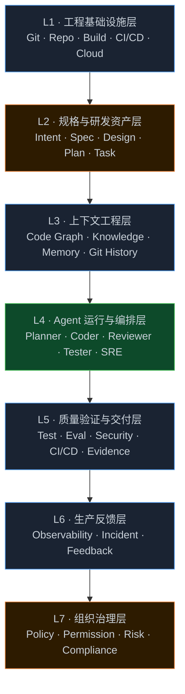
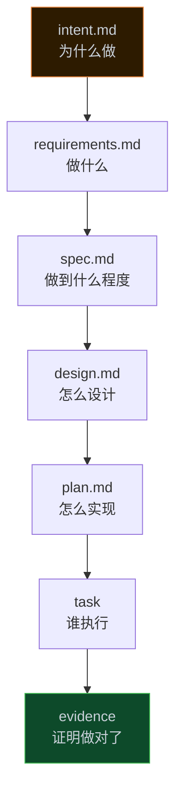
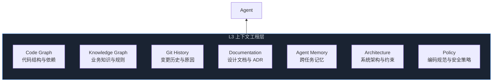
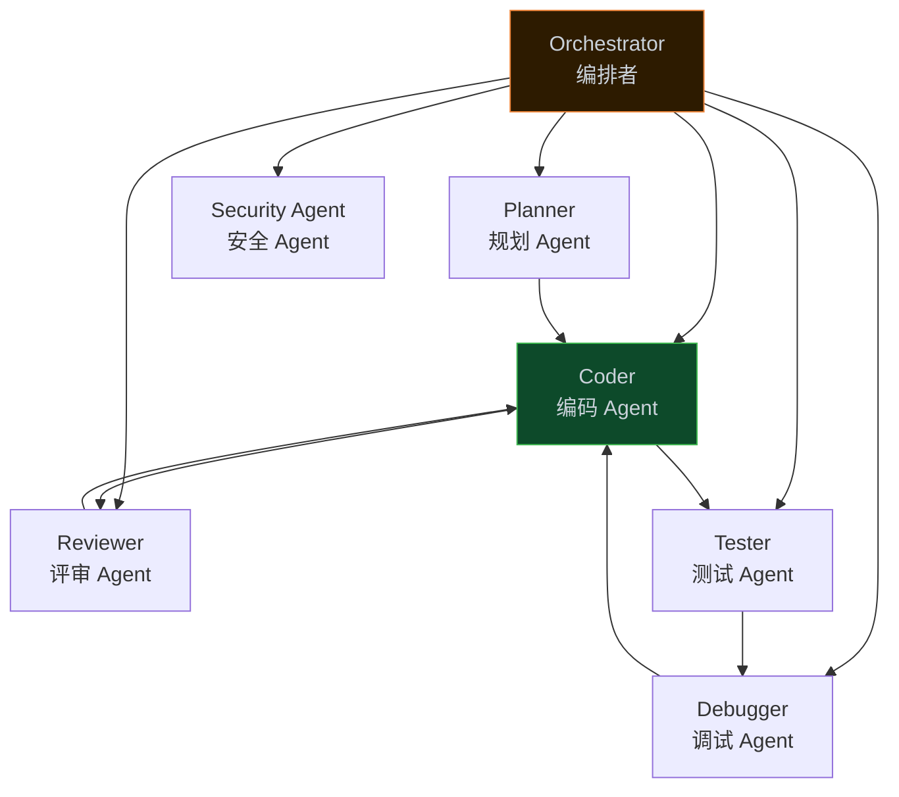
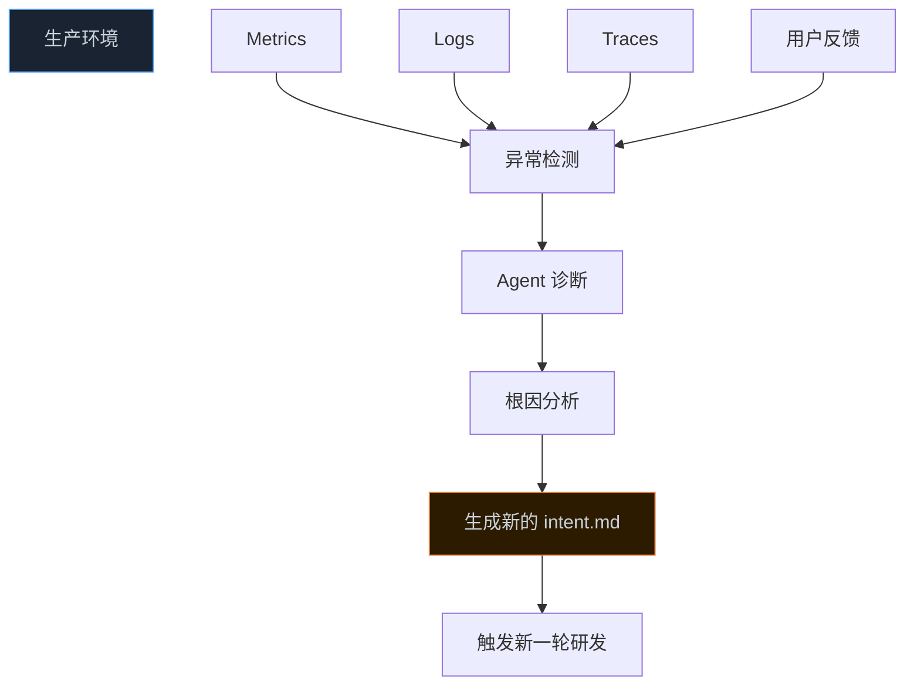
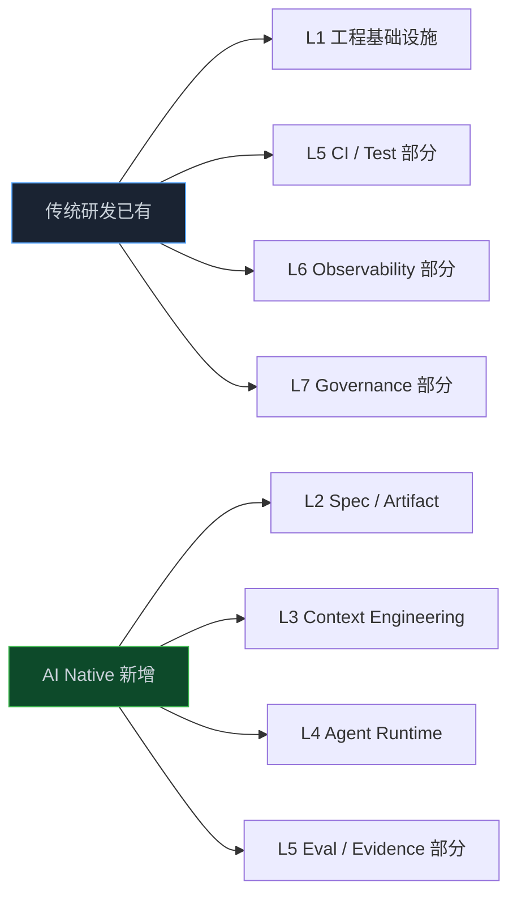

> **📖 系列难度说明**：本篇为**架构概览**，适合想系统理解 AI Native 研发平台的读者。有一定研发经验会更容易理解，但不是必须。
> **🎁 核心收获**：读完本篇你将能够理解 AI Native 研发平台的 7 层架构，知道每一层解决什么问题，以及 Anthropic、OpenAI、GitHub、Kiro 各自在哪一层最强。

有人问我：AI Native 研发平台和普通的 AI 编码工具，到底差在哪？

我想了一下，给了个比较直接的回答：**差在有没有架构**。

用 Cursor 写代码，是在用一个工具。搭一套 AI Native 研发平台，是在设计一个系统。工具解决单点问题，系统解决流程问题。

这篇就来讲这个系统长什么样。

<!-- more -->

---

## 先说一个让我困惑了很久的问题

我研究 Anthropic、OpenAI、GitHub、AWS Kiro 这几家的方案时，发现一件有意思的事：他们讲的东西好像都不一样。

Anthropic 讲的是 `intent.md`、`spec.md`、Plan Mode、Continuous Evals。

OpenAI 讲的是 Harness、Repository Context、Agent 工作环境。

GitHub 讲的是 Issue → Agent → PR → Actions → Merge。

Kiro 讲的是 Requirement → Design → Spec → Tasks → Code。

这四家到底在说同一件事吗？

说是，但切入点完全不同。Anthropic 在重构整个研发流程，OpenAI 在构建 Agent 的运行环境，GitHub 在把 Agent 嵌入工程控制面，Kiro 在解决需求到代码的转化问题。

**他们不是竞争关系，而是在解决同一个大问题的不同层次。**

这就是为什么我觉得需要一个统一的架构框架——把这些分散的方案放到同一张地图上，才能看清楚全貌。

---

## 7 层架构：一张地图看清全貌

基于对这几家方案的研究，我把 AI Native 研发平台抽象成 7 层：



先说一个重要的事：**这不是 Anthropic 或 OpenAI 官方提出的模型**。这是我基于这几家公开实践抽象出来的参考架构，目的是把分散的方案统一到一张图里。

另外，这 7 层不是简单的上下调用关系。实际上它是一个双向闭环——L6 的生产数据会反馈回 L2 触发新一轮研发，L7 横切所有层做治理控制。

用一句话记住这 7 层：

- L1 是 Agent 工作的工程环境；
- L2 定义 Agent 要做什么；
- L3 告诉 Agent 需要知道什么；
- L4 负责 Agent 怎么做；
- L5 证明它做对了；
- L6 判断线上是否真的工作；
- L7 决定 Agent 在什么边界内可以自主行动。

或者更简洁：`Where · What · Know · How · Prove · Observe · Govern`。

---

## L1：工程基础设施层——Agent 工作的地方

L1 是整个系统的底座。Git、代码仓库、构建系统、CI/CD、云基础设施——这些东西在 AI 出现之前就有了，AI 出现之后也没消失，反而更重要了。

为什么更重要？因为以前这些基础设施是给人用的，现在 **Agent 也要直接用它们**。

这个变化听起来简单，但影响很深。一个 Agent 要完成一个工程任务，它需要能够：

```
git diff          # 看改了什么
git log           # 看历史
git worktree      # 并行工作
pnpm test         # 跑测试
docker build      # 构建镜像
kubectl apply     # 部署
gh pr create      # 提 PR
```

这些命令，Agent 要能直接调用，就像工程师在终端里操作一样。OpenAI 在 Harness 实验里明确说过：真正限制 Agent 的不是模型能力，而是**环境有没有给 Agent 足够的工具、上下文和反馈**。

所以 L1 的核心变化是：从"工程师使用的基础设施"变成"**Agent 可访问的工程基础设施**"。

对大多数团队来说，L1 不需要从头搭——你已经有 Git、有 CI、有云环境了。需要做的是**让这些基础设施对 Agent 可访问**，比如提供标准化的工具接口、沙箱环境、权限控制。

---

## L2：规格与研发资产层——Agent 要做什么

这是 AI Native SDLC 和传统研发差异最大的一层，也是最容易被忽视的一层。

传统研发里，需求信息散落在各处：

```
需求管理系统 里有 User Story
Git系统 里有 PRD
Wiki文档 里有 讨论
会议记录里有决策
产品经理脑子里有背景
```

人能靠上下文和沟通把这些信息拼起来。Agent 不行。Agent 需要**结构化的、机器可读的输入**，才能可靠地执行任务。

这就是 L2 要解决的问题：**把研发过程中的中间状态，全部变成可版本控制的产物（Artifact）**。

Anthropic 的方案里，这条产物链是这样的：



每个产物都有明确的职责：

| 产物                | 回答的问题                |
| ------------------- | ------------------------- |
| `intent.md`       | 为什么要做这件事          |
| `requirements.md` | 要做什么                  |
| `spec.md`         | 做到什么程度算完成        |
| `design.md`       | 技术上怎么设计            |
| `plan.md`         | 具体怎么实现              |
| `task`            | 哪个 Agent 执行哪个子任务 |
| `evidence`        | 有什么可追溯的证明        |

这些产物进入版本控制，形成审计链。更重要的是，**它们是 Agent 之间传递信息的载体**——`intent.md` 批准后触发 `spec.md` 的生成，`spec.md` 批准后触发 Plan Mode，Plan Mode 完成后分解成 Task 交给 Agent 执行。

这就是 Anthropic 说的 Event-driven SDLC：**下一阶段由上一阶段的 Artifact 自动触发**，而不是靠人工推动。

AWS Kiro 的核心思想也在这里——先把需求变成结构化的 Spec，再让 Agent 去实现。这解决了一个很实际的问题：没有 Spec，Agent 不知道"做到什么程度算完成"，容易做多或做少。

---

## L3：上下文工程层——Agent 需要知道什么

这是我认为 AI 研发平台**技术壁垒最高的一层**，也是最容易被低估的一层。

很多人以为给 Agent 加个 RAG 就够了。但对于真实的软件工程任务，RAG 远远不够。

举个例子。Agent 接到一个任务："修改用户登录逻辑，增加失败次数限制"。

普通 RAG 的做法：

```
search("login")
→ 返回 login.ts、auth.ts、user.ts 的片段
```

这些片段告诉 Agent 登录相关的代码在哪，但没告诉它：

- `AuthService` 被哪些地方调用？
- 修改它会影响哪些 API？
- 最近有没有人改过这块？
- 有没有相关的测试？
- 这个改动会不会破坏 OAuth 流程？

这些问题，需要的不是"文本相似度搜索"，而是**对代码库结构的深度理解**。

这就是 Code Graph 的价值所在。Code Graph 可以回答：

```
LoginController
   ↓ 调用
AuthService
   ↓ 依赖
TokenService + UserRepository
   ↓ 被以下 API 使用
/api/login, /api/refresh, /api/oauth/callback
   ↓ 相关测试
auth.test.ts, login.e2e.ts
   ↓ 最近修改
Commit abc123 (3天前, 修复了 token 过期问题)
```

这才是 Agent 真正需要的上下文。

L3 的完整内容不只是 Code Graph，还包括：



OpenAI 在 Harness 实验里把这个概念叫做"Repository as System of Record"——代码仓库不只是存代码的地方，而是 Agent 理解整个软件系统的知识来源。

字节跳动的 TRAE 把自己定位为"Context Engineer"而不是"Coding Assistant"，核心思路也在这里：**Agent 的能力上限，取决于它能获取多少高质量的上下文**。

---

## L4：Agent 运行与编排层——Agent 怎么做

到了这一层，才真正进入 Agent 本身。但这里有一个很重要的认知：**一个 Agent 通常不够用**。

真实的工程任务往往需要多个专业角色协作。一个功能从需求到上线，需要：规划、编码、测试、代码评审、安全检查、部署……这些事情，让一个 Agent 全干，效果往往不如让专门的 Agent 各司其职。



不过，多 Agent 只是 L4 的一部分。更准确的概念是 OpenAI 提出的 **Harness**——把 Agent 放进一个能够提供上下文、工具、权限和反馈的可控执行环境。

Harness 包含五个子系统：

**Agent Runtime**：模型 + 上下文 + 工具调用 + 记忆 + 状态管理

**Orchestrator**：任务分解 → Planner → Subagents → 依赖管理

**Tool System**：Git、GitHub、文件系统、终端、浏览器、数据库、MCP

**Workspace**：Git Worktree、沙箱容器、隔离环境

**Recovery**：失败诊断 → 重试 → 回滚 → 升级人工处理

OpenAI 的 Harness 实验里，Codex 可以修改代码、运行测试、启动应用、操作浏览器、查看截图、查询日志、创建 PR、处理 Review、修复 CI，最终 Merge。这些能力组合在一起，才是一个真正能完成工程任务的 Agent。

---

## L5：质量验证与交付层——证明它做对了

这是 AI Native SDLC 和传统 DevOps 差异最大的地方之一。

传统的质量保障是这样的：

```
代码 → 单元测试 → E2E → Code Review → CI → 发布
```

AI Native 的质量保障多了一个维度：

```
Agent 生成代码 → 自测 → Agent Review → Eval → 安全扫描 → CI → Human Gate → 发布
```

多出来的那个 **Eval**，是关键。

传统测试回答的是：**代码运行时有没有失败？**

AI Eval 回答的是：**Agent 是否完成了正确的工程任务？**

这两个问题不一样。一个 Agent 可能把所有测试都跑过了，但它改了不该改的地方，或者没改该改的地方。Eval 就是用来发现这类问题的。

Anthropic 把 Continuous Evals 定义为"AI Native 版本的 stage-gate QA"，并建议把真实研发任务转换成 Eval Case，生产事故也应该反向加入 Eval Suite。

L5 最终产生的不是"测试通过"，而是 **Evidence**——一份可追溯的证明，说明这个改动满足了哪些需求、通过了哪些验证、有哪些风险。

一个 AI Native 的 PR，应该长这样：

```
PR #1234
├── Spec（做什么）
├── Plan（怎么做）
├── Diff（改了什么）
├── Unit Tests（功能测试结果）
├── E2E（端到端测试结果）
├── Agent Eval（Agent 行为验证结果）
├── Security Scan（安全扫描结果）
├── Review（代码评审意见）
└── Evidence（可追溯证明）
```

这不是在增加流程负担，而是**把原来散落在各处的信息，结构化地聚合在一起**，让 Human Gate 的审批更高效、更有依据。

---

## L6：生产反馈层——判断线上是否真的工作

L6 是传统 DevOps 里已经存在的东西——监控、日志、告警。但 AI Native 会把它进一步自动化，而且会改变它的定位。

传统的生产反馈是这样的：

```
告警触发 → SRE 看 Dashboard → 分析 → 修复 → 发 Ticket → 开发处理
```

AI Native 的生产反馈是这样的：



Anthropic 的 Playbook 里明确提到：生产环境的 Control Band 被突破后，Agent 可以自动诊断，把结果写成新的 `intent.md`，重新进入整个研发流程。

这就是真正的闭环——**生产问题自动触发研发任务**，而不是靠人工发现、人工创建 Ticket、人工分配。

L6 还有一个有意思的趋势：**Code Graph 和 Observability Graph 会逐渐融合**。

未来的 SRE Agent 不只是知道"A 调用了 B"，还应该知道：

```
A → B → Database → Latency ↑ → Error Rate ↑ → Deployment #123 → Commit abc123
```

把代码结构、调用链路、性能指标、部署历史串在一起，才能真正做到快速定位根因。

---

## L7：组织治理层——Agent 在什么边界内行动

这是最容易被忽略，但企业最终一定要面对的一层。

Agent 越来越强以后，有几个问题绕不开：

- Agent 能读哪些代码？能改哪些？
- 谁有权限让 Agent 部署到生产环境？
- Agent 做了什么，有没有审计记录？
- 出了问题，谁负责？

这些问题，不是技术问题，是治理问题。

L7 的核心是**把权限体系从"人"扩展到"Agent"**。

传统的权限是这样的：

```
Developer → Git Permission → 可以 push 到 main
```

AI Native 的权限需要更细粒度：

```
Planner Agent    → 只读 Repo + 只读 Spec，不能写代码
Coder Agent      → 读 Repo + 写 Worktree + 运行测试
Reviewer Agent   → 读 Diff + 读测试结果，不能改代码
Deploy Agent     → 读 CI 结果 + 部署到 Staging，生产需要人工审批
```

GitHub Agentic Workflows 已经在做这件事——默认只读权限，写操作通过声明式 `safe-outputs`，结合沙箱、网络隔离、工具白名单和人工审批。

L7 还包括：审计日志（Agent 做了什么）、风险分类（哪些操作需要审批）、成本控制（Agent 调用了多少 API）、合规检查（生成的代码有没有安全问题）。

---

## 四大厂商各自在哪一层最强？

把这 7 层和四家主流方案对应起来，会发现一个很有意思的规律：

| 层        | Anthropic                  | OpenAI                             | GitHub                               | AWS Kiro                            |
| --------- | -------------------------- | ---------------------------------- | ------------------------------------ | ----------------------------------- |
| L1 基础   | Git / CI / Runtime         | Repo / CI / DevTools               | **GitHub**                     | AWS / Git                           |
| L2 规格   | **intent/spec/plan** | Intent / Exec Plans                | Issue / PR                           | **Requirements/Design/Tasks** |
| L3 上下文 | CLAUDE.md / Skills         | **Repo as System of Record** | Repo Context                         | Steering                            |
| L4 Agent  | Claude Code / Subagents    | **Codex / Harness**          | Coding Agent                         | Kiro Agent                          |
| L5 验证   | **Continuous Evals** | Feedback Loop                      | Actions / Checks                     | Tests / Validation                  |
| L6 生产   | **Closing Loop**     | Observability                      | Actions / Events                     | AWS Operations                      |
| L7 治理   | Hooks / Human Gates        | Harness Policy                     | **Permissions / Safe Outputs** | Steering / Controls                 |

简单说：

- **Anthropic 最强在 L2 + L5 + L6**：Spec 体系 + Eval + 生产闭环
- **OpenAI 最强在 L3 + L4**：Context Engineering + Agent Harness
- **GitHub 最强在 L1 + L5 + L7**：工程控制面 + CI + 治理
- **Kiro 最强在 L2**：Spec-driven Engineering

这四家不是竞争关系，而是互补的。如果要搭一套完整的 AI Native 研发平台，可以参考：

```
研发流程设计  → Anthropic
Agent Runtime → OpenAI Harness
工程控制面    → GitHub
Spec 方法论   → Kiro
上下文基础设施 → Code Graph
```

---

## 哪些是新的，哪些是已有的？

这里有一个很重要的认知：**AI Native SDLC 不是推翻 DevOps，而是在 DevOps 上面加了新的层**。



L1 你已经有了。L5 的 CI/Test 你已经有了。L6 的监控你已经有了。L7 的权限管理你已经有了。

真正需要新建的是 **L2（Spec 体系）、L3（Context Engineering）、L4（Agent Runtime）**，以及 L5 里新增的 **Eval 和 Evidence** 部分。

这意味着，从传统研发迁移到 AI Native，不需要推倒重来，而是**在现有基础上逐层叠加**。

---

## 一个判断标准：你现在在哪一层？

如果你的团队现在是这样的：

```
Jira → Developer → Cursor/Claude → Code → Jenkins
```

那你在 L1 + 部分 L4，属于 AI-Assisted，不是 AI Native。

真正的 AI Native 应该是：

```
Intent → Spec → Context → Agent → Eval → Evidence → Gate → Deploy → Production → Feedback → Intent
```

并且**每个阶段由上一阶段的 Artifact 自动触发**，不需要人工推动。

从现在的状态到 AI Native，不是一步到位的事。我建议的路径是：

1. **先建 L2**：把需求文档结构化，从写 Jira 改成写 `intent.md` + `spec.md`
2. **再建 L3**：给 Agent 提供 Code Graph 和 Repository Context
3. **然后 L4**：引入 Coding Agent，让它能完成完整的工程任务
4. **接着 L5**：建立 Eval 体系，让 Agent 的输出可验证
5. **最后 L6 + L7**：打通生产反馈，建立治理机制

每一步都有实际价值，不需要等全部建好才能用。

---

## 📝 小结

- AI Native 研发平台是一个 7 层系统，不是一个工具
- 7 层的记忆口诀：`Where · What · Know · How · Prove · Observe · Govern`
- Anthropic、OpenAI、GitHub、Kiro 各自在不同层最强，是互补关系
- AI Native 不是推翻 DevOps，而是在现有基础上叠加 L2（Spec）、L3（Context）、L4（Agent）、L5 新增部分
- 从现在到 AI Native，建议按 L2 → L3 → L4 → L5 → L6/L7 的顺序逐步推进

---

## 🔮 下一篇预告

7 层架构里，L2 是最容易被忽视但影响最大的一层。

下一篇，我们深入 L2——**产物链路怎么设计**。从 `intent.md` 到 `evidence`，每个产物的 Schema 是什么，它们之间怎么触发，以及怎么让这条链路真正跑起来。

---

> 📚 **系列导航**
>
> - 第 00 篇：代码不再是瓶颈，那瓶颈在哪？
> - **第 01 篇：7 层架构——AI Native 研发平台的骨架** ⬅️ 你在这里
> - 第 02 篇：产物链路——从 Intent 到 Evidence 的完整链条
> - 第 03 篇：上下文工程——让 Agent 真正理解你的代码库
> - 第 04 篇：Agent 运行时——一个任务怎么被 Agent 完整执行
> - 第 05 篇：持续验证——从 Test 到 Eval 到 Evidence
> - 第 06 篇：治理与边界——Agent 能做什么，不能做什么
> - 第 07 篇：生产闭环——线上数据怎么反馈回研发流程
> - 第 08 篇：落地方案——从 0 到 1 搭建 AI Native 研发平台
