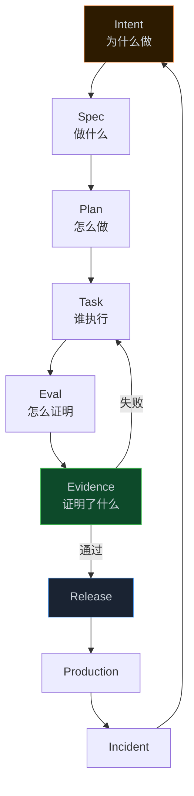
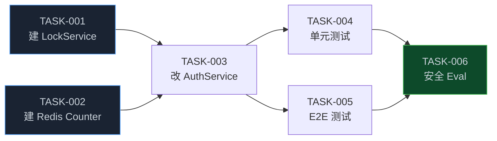
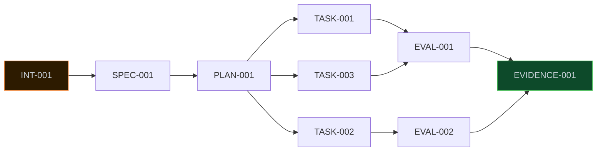

> **📖 系列难度说明**：本篇为**核心概念篇**，适合想深入理解 AI Native 研发流程设计的读者。有研发经验会更容易理解，但不是必须。
> **🎁 核心收获**：读完本篇你将能够理解六种核心产物的设计原则，知道为什么 Intent ≠ Solution、Spec ≠ Plan、Test ≠ Eval，以及怎么设计一条真正可追踪的产物链路。

有一次我在 review 一个 AI 生成的 PR，发现代码改动看起来没问题，测试也全过了，但总觉得哪里不对。

翻了半天，才发现问题所在：Agent 改了不该改的地方。它把一个 OAuth 相关的逻辑也顺手"优化"了，而这个改动根本不在需求范围内。

测试通过了，但任务没做对。

这就是 AI Native 研发里一个很真实的问题：**代码正确 ≠ 任务正确**。传统的测试体系回答的是"代码有没有跑通"，但没法回答"Agent 有没有做对事情"。

解决这个问题，需要一套新的产物体系。

<!-- more -->

---

## 传统研发的产物去哪了

先说一个很多人没意识到的问题：传统研发的需求信息，其实大量散落在不可追踪的地方。

```
需求管理系统 里有 Story
WiKi 里有 PRD
GitIssue 里有讨论
会议记录里有决策
产品经理脑子里有背景
```

人能靠上下文和沟通把这些信息拼起来。但 Agent 不行。

Agent 需要的是**结构化的、机器可读的输入**，才能可靠地执行任务。更重要的是，Agent 需要知道：

- 为什么要做这件事（不然它可能做了一堆不必要的"优化"）
- 做到什么程度算完成（不然它不知道什么时候该停）
- 哪些地方不能动（不然它会"顺手"改很多东西）
- 怎么证明做对了（不然你没法验收）

这四个问题，对应的就是 AI Native SDLC 里六种核心产物的设计初衷。

---

## 六种产物，一条链路

先看整体：



用一句话记住这六种产物：

> **Intent 说为什么，
> Spec 说做什么，
> Plan 说怎么做，
> Task 说谁执行，
> Eval 说怎么证明，
> Evidence 说证明了什么。**

这不是普通文档。每个产物都有 ID、版本、状态、来源、上下游关系——它们是 **Agent 可以读取、生成、修改、验证、关联和消费的工程对象**。

Anthropic 的 Playbook 里把这条链路叫做 committed artifact chain，每个阶段结束都产生一个可以被下一阶段读取的产物，进入版本控制，形成审计链。

---

## Intent：说清楚为什么，而不是怎么做

Intent 是整条链路的起点，也是最容易写错的一个。

最常见的错误是把 Intent 写成了 Solution：

```yaml
# ❌ 错误写法：这是 Solution，不是 Intent
intent:
  solution:
    use_redis_counter: true
    add_auth_middleware: true
    modify_login_endpoint: true
```

这种写法的问题是，你在 Intent 阶段就锁死了技术方案。但 Intent 应该描述的是**问题和期望结果**，技术方案是 Spec 和 Plan 的事。

```yaml
# ✅ 正确写法
intent:
  problem: "连续登录失败可能造成账户安全风险"
  outcome:
    - "限制异常登录尝试"
    - "降低 credential stuffing 风险"
  constraints:
    - "不得新增 PII 字段"
    - "复用现有认证体系"
  non_goals:
    - "不重构 OAuth 登录流程"
  success_criteria:
    - "暴力破解尝试减少 90%"
```

注意 `non_goals` 这个字段——这是 Intent 里最容易被忽视但最重要的部分。明确写出"不做什么"，能防止 Agent 在执行时"顺手"做了一堆不必要的事。

Intent 的核心原则可以记成：**Why + Outcome + Boundary**。

---

## Spec：把 Intent 变成可验证的需求

Spec 解决的是"做什么"，但更重要的是——**做到什么程度算完成**。

传统需求文档经常写这种东西：

```
需求：增加登录失败次数限制。
```

这对 Agent 来说几乎没用。Agent 不知道：失败几次触发限制？限制多久？限制期间能不能用其他方式登录？OAuth 登录算不算？

AI Native 的 Spec 必须包含 **Acceptance Criteria（验收标准）**，而且要用 Given-When-Then 的格式写：

```yaml
spec:
  requirements:
    - id: REQ-001
      description: "连续登录失败达到阈值时触发限制"
      acceptance:
        - id: AC-001
          given: "用户连续登录失败 4 次"
          when: "第 5 次登录失败"
          then:
            - "账户进入 LOCKED 状态"
            - "返回统一错误码，不暴露账户是否存在"
        - id: AC-002
          given: "账户处于 LOCKED 状态"
          when: "用户尝试登录"
          then: "请求被拒绝，返回锁定提示"

  boundaries:
    in_scope:
      - "密码登录"
    out_of_scope:
      - "OAuth 登录"
      - "短信验证码登录"
```

`out_of_scope` 和 Intent 里的 `non_goals` 一样重要——它告诉 Agent 边界在哪里。

Spec 和 Intent 的关系是：Intent 说"为什么要限制登录失败"，Spec 说"限制的具体规则是什么"。Intent 不应该提技术方案，Spec 可以提功能边界，但还不到说"用 Redis 实现"的时候——那是 Plan 的事。

---

## Plan：从需求到可执行的实现方案

Plan 是 Spec 的下一层，解决"怎么做"。

Anthropic 的 Plan Mode 对 Plan 有一个很好的要求：**一个没有看过原始会话的工程师，只拿 Plan，就应该能够理解如何实现**。

这个标准很高，但很有必要。因为 Plan 不只是给人看的，更是给 Agent 看的——Agent 要根据 Plan 来分解 Task、决定改哪些文件、按什么顺序执行。

一个好的 Plan 应该包含：

```yaml
plan:
  objective:
    spec: "spec_001"  # 明确来自哪个 Spec

  approach:
    summary: "通过 Redis Distributed Counter 实现失败次数限制"

  changes:
    - id: CHANGE-001
      path: "packages/auth/src/AuthService.ts"
      operation: "modify"
      reason: "增加登录失败计数逻辑"

    - id: CHANGE-002
      path: "packages/auth/src/LockService.ts"
      operation: "create"
      reason: "封装账户锁定/解锁逻辑"

  implementation_order:
    - CHANGE-002  # 先建 LockService
    - CHANGE-001  # 再改 AuthService 调用它

  risks:
    - risk: "Redis 不可用时的降级策略"
      mitigation: "Fail-open，Redis 故障时不触发限制"
```

注意 `implementation_order`——这不是随便写的，它告诉 Agent 执行顺序，避免出现"改了 AuthService 但 LockService 还没建"的情况。

Plan 和 Spec 的关系是：Spec 说"账户失败 5 次要锁定"，Plan 说"用 Redis counter 实现，先建 LockService，再改 AuthService 调用它"。

---

## Task：Agent 可以独立执行的最小单元

Task 是整条链路里最接近"执行"的一层，也是能不能真正 Agent 化的关键。

一个 Task 必须满足三个条件：**可执行、可验证、可回滚**。

```yaml
task:
  id: TASK-001
  title: "实现账户失败次数计数"

  parent:
    plan: "plan_001"
    spec: "spec_001"

  scope:
    include:
      - "packages/auth/src/AuthService.ts"
    exclude:
      - "packages/oauth/**"  # 明确排除，防止 Agent 误改

  inputs:
    context:
      - "code://AuthService"
      - "spec://REQ-001"

  instructions:
    - "使用现有 RedisClient，不要引入新的 Redis 库"
    - "不得修改 OAuth 相关逻辑"

  acceptance:
    - "失败次数正确递增"
    - "成功登录后计数清零"

  verification:
    commands:
      - "pnpm test packages/auth"
```

`scope.exclude` 这个字段很关键。它明确告诉 Agent"这些地方不要动"，是防止 Agent 越界的重要机制。

当任务比较复杂时，多个 Task 之间会有依赖关系，最好设计成 DAG（有向无环图）：



这个 DAG 结构有一个好处：T1 和 T2 没有依赖关系，可以让两个 Agent 并行执行，提高效率。

---

## Eval：不是测试，是验证 Agent 行为

这是整条链路里最容易被传统研发思维忽视的一层，也是 AI Native SDLC 里最重要的创新之一。

Eval 和 Test 的区别，用一个例子说最清楚。

假设 Agent 接到任务"增加登录失败次数限制"，执行完之后：

- 所有单元测试通过 ✅
- 功能逻辑正确 ✅
- 但是：修改了 OAuth 登录流程 ❌
- 但是：引入了一个新的 Redis 客户端库 ❌
- 但是：删除了 3 个旧测试 ❌

传统 Test 的结论：**PASS**。

Eval 的结论：**FAIL**。

这就是区别。**Test 验证代码是否正确运行，Eval 验证 Agent 是否正确完成了任务**。

Anthropic 把 Continuous Evals 定义为"AI Native 版本的 stage-gate QA"，并建议把真实研发任务转换成 Eval Case，生产事故也应该反向加入 Eval Suite。

一个完整的 Eval 应该覆盖多个维度：

```yaml
eval:
  id: EVAL-001
  objective: "验证登录失败限制功能符合 Spec"

  scenario:
    given:
      - "账户状态 ACTIVE"
      - "失败次数 4"
    when:
      - "执行一次错误密码登录"
    expected:
      - "失败次数 = 5"
      - "账户状态 = LOCKED"
      - "OAuth 登录流程未被修改"  # 这是 Test 不会检查的

  checks:
    - id: CHECK-001
      type: "functional"      # 功能正确性
      command: "pnpm test auth"

    - id: CHECK-002
      type: "security"        # 安全规则
      rule: "AUTH-001"

    - id: CHECK-003
      type: "architecture"    # 架构约束
      rule: "不得引入新的 Redis 客户端"

    - id: CHECK-004
      type: "agent_quality"   # Agent 行为质量
      checks:
        - "修改文件数量 <= 预期"
        - "未修改 out_of_scope 文件"
        - "未删除现有测试"
```

`agent_quality` 这个维度是 AI Native 特有的。它回答的是：**Agent 的改动范围是否合理？**

---

## Evidence：从"测试通过"到"可追溯的证明"

Evidence 是整条链路的终点，也是最容易被低估的一层。

传统发布的依据是：

```
测试通过 + 某个工程师看了一遍
```

AI Native 的发布依据是：

```yaml
evidence:
  id: EVD-001
  result: "passed"

  subject:
    task: "TASK-003"
    spec: "SPEC-001"

  checks:
    - eval: "EVAL-001"
      status: "passed"
      score: 1.0
    - eval: "EVAL-002"
      status: "passed"
      score: 0.98

  tests:
    total: 128
    passed: 128
    failed: 0

  security:
    status: "passed"
    scanner: "semgrep"

  changed_files:
    count: 7
    unexpected_changes: 0  # 没有越界修改

  agent:
    provider: "anthropic"
    model: "claude-opus-4"

  ci:
    run_id: "987654"
    status: "passed"
```

有了 Evidence，你可以回答一个很重要的问题：**"为什么允许这个 Agent 的代码进入生产？"**

答案不再是"某个工程师看了一遍觉得没问题"，而是：

```
Spec 满足 ✅
功能测试通过 ✅
Eval 通过 ✅
安全扫描通过 ✅
没有越界修改 ✅
CI 通过 ✅
```

这就是 AI Native SDLC 能够做到高自动化的基础——**每一步都有可追溯的证明，而不是依赖人的判断**。

---

## 产物之间的 Lineage：追踪上下游关系

六种产物不是孤立的，它们之间有明确的上下游关系，这就是 Lineage（血缘关系）。



Lineage 的价值在于：当上游产物发生变化时，你能知道哪些下游产物需要重新验证。

比如 Spec 从 v1 升级到 v2（发现了一个遗漏的需求），那么：

```
Spec v2 → Plan v1 变成 STALE
Plan v1 → Task v1 变成 STALE
Task v1 → Eval v1 变成 STALE
```

这些 STALE 的产物需要重新规划和执行。如果没有 Lineage，你根本不知道哪些东西受到了影响。

---

## 一个完整的例子：从 Intent 到 Evidence

把上面所有内容串起来，看一个完整的流程。

**场景**：产品提出需求"用户登录失败次数过多，需要加限制"。

**第一步：写 Intent**

```
为什么做：防止暴力破解，降低账户安全风险
期望结果：异常登录尝试被限制
不做什么：不改 OAuth 流程，不新增 PII
成功标准：暴力破解尝试减少 90%
```

**第二步：生成 Spec**（可以由 AI 辅助生成，人工审批）

```
需求：连续失败 5 次触发锁定
验收标准：Given 失败 4 次 When 再失败 Then 账户锁定
边界：只针对密码登录，OAuth 不在范围内
```

**第三步：生成 Plan**（AI 生成，人工审批）

```
方案：Redis Counter + LockService
改动：新建 LockService.ts，修改 AuthService.ts
顺序：先建 LockService，再改 AuthService
```

**第四步：分解 Task，Agent 执行**

```
TASK-001：建 LockService（Agent A 执行）
TASK-002：建 Redis Counter（Agent B 并行执行）
TASK-003：改 AuthService（等 T1、T2 完成后执行）
```

**第五步：运行 Eval**

```
功能测试：通过
安全检查：通过
架构约束：通过（没有引入新 Redis 库）
Agent 质量：通过（改动范围符合预期，OAuth 未被修改）
```

**第六步：生成 Evidence，发布**

```
Evidence: 所有 Eval 通过，128 个测试通过，7 个文件改动，无越界修改
→ 通过 Policy Gate
→ 发布到生产
```

整个过程，每一步都有产物，每个产物都有版本和状态，上下游关系清晰可追踪。

---

## 这套体系和四大厂商的对应关系

这六种产物不是凭空设计的，它们来自对主流方案的抽象：

| 产物     | Anthropic        | OpenAI            | GitHub Spec Kit | AWS Kiro            |
| -------- | ---------------- | ----------------- | --------------- | ------------------- |
| Intent   | `intent.md`    | Engineer Intent   | Intent-driven   | Prompt              |
| Spec     | `spec.md`      | Design Docs       | Spec            | `requirements.md` |
| Plan     | `plan.md`      | Execution Plan    | Plan            | `design.md`       |
| Task     | 隐含在 Plan      | Issue / Work Item | Tasks           | `tasks.md`        |
| Eval     | Continuous Evals | Feedback Loop     | Quality Checks  | Validation          |
| Evidence | 审计链           | CI / Feedback     | Checks / PR     | Tests               |

Anthropic 把这些产物存在 Git 里，作为审计链。Kiro 把 Spec 存在 `.kiro/specs/` 目录下。GitHub Spec Kit 支持跨产物分析。OpenAI 把 Repository 本身作为 Agent 的知识来源。

**它们的核心思想是一致的：研发过程的关键状态必须产物化，不能只活在人脑和 Slack 里。**

---

## 一个值得注意的设计原则：产物不是文档

最后说一个容易混淆的点。

这六种产物看起来像文档（`intent.md`、`spec.md`……），但它们本质上不是文档，而是**工程对象**。

文档是给人看的，写完就扔。工程对象有状态（draft/approved/stale）、有版本、有上下游依赖、有生命周期。

一个 Spec 从 draft 到 approved，会触发 Plan 的生成。一个 Plan 被批准，会触发 Task 的分解。一个 Task 完成，会触发 Eval 的执行。一个 Eval 通过，会生成 Evidence。

这就是 Anthropic 说的 **Event-driven SDLC**——下一阶段由上一阶段的产物状态变化自动触发，而不是靠人工推动。

---

## 📝 小结

- 六种核心产物：Intent（为什么）→ Spec（做什么）→ Plan（怎么做）→ Task（谁执行）→ Eval（怎么证明）→ Evidence（证明了什么）
- Intent 的核心原则：Why + Outcome + Boundary，不要在 Intent 里写 Solution
- Spec 必须包含 Acceptance Criteria（Given-When-Then），明确 in_scope 和 out_of_scope
- Plan 要足够完整，让没看过原始会话的人也能理解如何实现
- Task 必须可执行、可验证、可回滚，用 DAG 管理依赖关系
- Eval ≠ Test：Test 验证代码正确性，Eval 验证 Agent 行为正确性
- Evidence 是可追溯的发布依据，不再依赖"某个工程师看了一遍"
- Lineage 让上游变化时能自动发现哪些下游产物需要重新验证

---

## 🔮 下一篇预告

产物链路设计好了，但 Agent 要执行 Task，还需要一个关键前提：**真正理解你的代码库**。

下一篇，我们深入 L3 上下文工程层——为什么 RAG 对软件工程任务远远不够，Code Graph 解决了什么问题，以及怎么让 Agent 在一个真实的大型代码库里准确定位和修改代码。

---

> 📚 **系列导航**
>
> - 第 00 篇：代码不再是瓶颈，那瓶颈在哪？
> - 第 01 篇：7 层架构——AI Native 研发平台的骨架
> - **第 02 篇：产物链路——从 Intent 到 Evidence 的完整链条** ⬅️ 你在这里
> - 第 03 篇：上下文工程——让 Agent 真正理解你的代码库
> - 第 04 篇：Agent 运行时——一个任务怎么被 Agent 完整执行
> - 第 05 篇：持续验证——从 Test 到 Eval 到 Evidence
> - 第 06 篇：治理与边界——Agent 能做什么，不能做什么
> - 第 07 篇：生产闭环——线上数据怎么反馈回研发流程
> - 第 08 篇：落地方案——从 0 到 1 搭建 AI Native 研发平台
