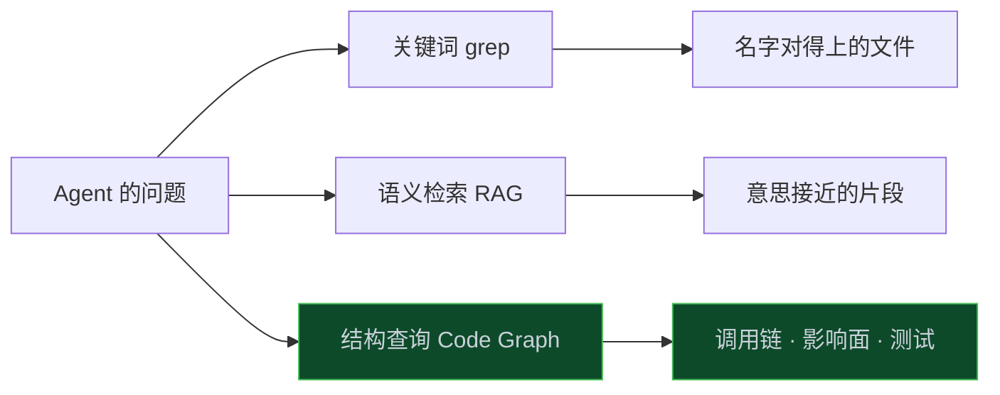
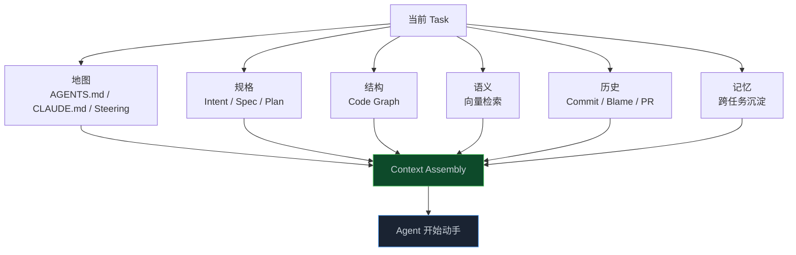

> **📖 系列难度说明**：本篇为**核心实践篇**，适合已经在用 AI 写代码、想搞清楚"Agent 为什么总改错地方"的读者。有大型仓库经验会更有体感，但不是必须。
> **🎁 核心收获**：读完本篇你将理解 Context Engineering 和 RAG 的本质差别，知道 Code Graph 解决了什么、解决不了什么，以及怎么从一份短地图文件开始，把 Agent 的找代码成本压下来。

你对 Agent 说：“加一个微信扫码登录。”

需求只有一句话，Agent 接下来却很忙。它先 `grep login`，读完 `auth.ts` 又去搜 `user.service.ts`。兜了几十轮，才勉强摸清认证体系，真正写代码反而没花多少时间。

小仓库里，这点浪费不算什么。代码涨到 100 万行，情况就变了：Token 大把花在找路上，还不一定找对。

上一篇已经把 Task 写清楚了。可 Agent 进了仓库，连该改哪里都拿不准，Plan 写得再漂亮也落不了地。

<!-- more -->

---

## 上一篇的 Task，进了仓库之后会怎样

还是用登录失败次数限制这个例子。

上一篇里，Task 已经写得很明确：改 `AuthService.ts`，不要动 OAuth，用现有 Redis 客户端。按理说 Agent 不该跑偏。

真实仓库里，事情通常不是这样。

`AuthService` 可能不叫这个名字。登录入口可能散在 `gatekeeper.ts`、`session.ts`、`identity-gateway` 三个包里。OAuth 和密码登录共用同一个 Token 签发函数。三天前刚有人修过 token 过期，改动还没人写进文档。

Agent 看到的不是你脑子里那张架构图。它看到的是几千个文件。

于是它开始"探索"：

```
grep "login"
grep "auth"
grep "fail"
read packages/auth/src/login.ts
read packages/auth/src/AuthService.ts
grep "OAuth" packages/auth
```

有时候它能摸对。有时候它会在第 20 轮工具调用之后，改了一个看起来很像、其实不该动的文件。

这不是模型笨。是**上下文没给对**。

---

## 三种找代码的方式，差的不是速度

Agent 在仓库里找东西，大致就三种办法。

**关键词最直接。** `grep login` 又快又准，前提是代码里真的写了 `login`。如果文件叫 `gatekeeper.ts`，函数叫 `authenticatePrincipal`，它就摸不到了。

**语义检索不那么依赖名字。** 它把代码切成片段、做成向量，再按含义找。GitHub 在 2026 年 3 月给 Copilot Coding Agent 接入 Semantic Code Search。Agent 不知道精确名字时，也能沿着意思找到代码。官方测试中，任务耗时大约少了 2%，质量没有下降。

这已经比关键词强一截。你说"修认证错误处理"，它有机会找到那个压根没出现 `auth` 字样的中间件。

不过语义检索回答的还是同一个问题：**哪段代码看起来跟这句话像？**

软件工程真正难的问题不是像不像。是：

- 谁调用了它？
- 改它会断哪条链路？
- 相关测试在哪？
- 最近有没有人动过这块，为什么动？

这些问题，相似度搜不出来。调用关系、继承、测试覆盖、跨包依赖，都不是"这段文字像那段文字"。

**结构查询问的是另一类问题。** 它先把仓库分析成图：文件、类、函数、接口、测试、API 都是节点，调用、导入、实现、测试则变成节点之间的边。Agent 不必挨个翻文件，可以直接去问这张图。



三种方式不是互相替换。关键词适合你已经知道符号名。语义适合你只知道意图。结构适合你要动手改，而且改完不能把周边弄坏。

很多团队卡在第二种，觉得上了 RAG 就算有上下文了。对问答机器人够用。对"改登录逻辑且别碰 OAuth"这种工程任务，差得远。

> 💡 **来源**：[Copilot coding agent works faster with semantic code search](https://github.blog/changelog/2026-03-17-copilot-coding-agent-works-faster-with-semantic-code-search/) — GitHub 给 Coding Agent 增加按含义检索代码的能力，减少对精确文本匹配的依赖

---

## RAG 为什么会让人误以为上下文够了

来看一种很典型的失败。

任务：修改用户登录逻辑，增加失败次数限制。

RAG 返回：

```
login.ts
auth.ts
user.ts
```

三个文件都跟登录有关，片段也读得通。Agent 很有信心地开始改。

它不知道的是：

```
LoginController
   ↓ 调用
AuthService.lockIfNeeded()
   ↓ 依赖
TokenService + UserRepository
   ↓ 同时被这些入口使用
/api/login
/api/refresh
/api/oauth/callback
   ↓ 相关测试
auth.test.ts
login.e2e.ts
oauth.regression.ts
   ↓ 最近一次相关提交
abc123  三天前  修复 token 过期
```

RAG 给了"相关文本"。工程需要的是"相关结构"。

还有一个更隐蔽的坑：RAG 习惯按 chunk 切。一个函数的调用者在文件开头，实现在中间，测试在另一个包。切完以后，三条信息进了三个互不相干的向量。Agent 拿到的是三块拼图，却以为自己看到了全貌。

所以 L3 不该叫"给 Agent 做个知识库"。它该叫 **Context Engineering**：在有限的上下文窗口里，决定这一刻该让 Agent 看见什么、不看见什么。

第 01 篇把 L3 记成 `Know`——告诉 Agent 它需要知道什么。这篇要把这句话落到仓库里。

---

## 上下文工程在工程什么

这里得先拆掉一个误会：上下文工程不是把文档不停塞进 Prompt。窗口变大，不代表模型更容易抓住重点，成本倒是一定会涨。OpenAI 在 Harness 实验里有个很形象的说法：

> 给 Codex 一张地图，而不是一本 1000 页的说明书。

Agent 的上下文窗口是工作台，不是仓库本身。工作台上同时放太多东西，它就开始局部模式匹配，不再有意识地去翻该翻的地方。

一次靠谱的上下文装配，通常长这样：



地图告诉它从哪进门。规格告诉它这次要做成什么样。结构告诉它改哪里、别改哪里。语义补上那些名字对不上的角落。历史告诉它这块代码为什么长成现在这样。记忆避免每个新会话都从零探索。

缺任何一块，Agent 都会用猜测填空。猜测在聊天里无伤大雅，写进仓库就是事故。

还有条更现实的原则：**仓库里没有的知识，对 Agent 来说近似不存在。** Slack 里聊过的架构约定、Google Doc 里的产品规格、老张脑子里的“这条路已经封了”——只要没有进入 Agent 能稳定访问的地方，下次会话就得重新猜。

所以上下文工程的第一件事，不是上模型，是把人脑子里的东西写成 Agent 进得去的文件。

> 💡 **来源**：[Harness engineering: leveraging Codex in an agent-first world](https://openai.com/index/harness-engineering/) — 把仓库当作 system of record，用短地图加结构化文档做渐进披露

---

## 先给一张地图，别给一本百科全书

各家名字不一样，干的事很像。

| 厂商      | 入口文件                             | 它想解决的问题                                           |
| --------- | ------------------------------------ | -------------------------------------------------------- |
| Anthropic | `CLAUDE.md`                        | 新会话一上来就读到约定、命令、常犯的错                   |
| OpenAI    | `AGENTS.md`                        | 大约 100 行的目录，指向`docs/` 里的真源                |
| AWS Kiro  | `.kiro/steering/`                  | `product.md` / `tech.md` / `structure.md` 持久约束 |
| GitHub    | `AGENTS.md` / Copilot instructions | 仓库级说明，Coding Agent 自动带上                        |
| 字节 TRAE | 定位成 Context Engineer              | 先理解知识架构，再 Think → Plan → Build                |

2025 年底，Linux Foundation 下面的 Agentic AI Foundation 收了 `AGENTS.md`，它正在变成跨工具的公共入口。Claude Code 找不到 `CLAUDE.md` 时，也会去读 `AGENTS.md`。你不必为每个工具各写一份圣经。

地图文件到底写什么？可以按“新同事第一天就得知道”的标准来裁。构建和测试命令要有，关键约定要有，Agent 反复踩过的坑也要有。尽量控制在一页内，因为每次会话都要读，过时内容只会白占窗口。

一份能用的地图，大概是这种密度：

```markdown
# 认证服务

## 怎么跑
- 单测：pnpm test packages/auth
- 集成：pnpm itest packages/auth（需要 docker）

## 从哪进
- 密码登录：packages/auth/src/AuthService.ts
- OAuth：packages/oauth/**  （默认不要动）
- 锁与计数：packages/auth/src/LockService.ts

## 约定
- 金额和计数用整数或 BigDecimal，不用 float
- 错误码统一走 AUTH_*，不要手写字符串
- 禁止新增 Redis 客户端，用现有 RedisClient

## 两次以上犯过的错
- 不要顺手改 OAuth 回调
- 不要升级依赖版本
```

注意最后那一块。Anthropic 有条很实用的规则：**同样的错误犯两次，就把纠正写进 `CLAUDE.md`。** 地图不是一次性写完的，是被 Agent 的失败喂大的。

Kiro 把这件事拆成三份 Steering：产品是什么、技术栈用什么、目录怎么组织。思路一样——持久、进版本库、每个会话都能读到。

这里有个反直觉的研究，值得放在桌上。ETH Zurich 在 2026 年 2 月测过仓库级上下文文件：模型自动生成的 `AGENTS.md` 会让成功率下降约 3%，成本上升约 20%；人写的文件大约只提升 4%。人写的内容更偏具体约束（"必须用 uv"），模型生成的更容易写成"我们有个 docs/ 目录"这种正确但没用的概述。

结论不是"别写地图"。是**别把地图写成百科，也别让模型替你生成一堆正确的废话**。短、具体、可执行。指向更深的文档，而不是把文档抄进来。

> 💡 **来源**：[The AI-Native SDLC playbook](https://claude.com/blog/the-ai-native-sdlc-playbook) — `CLAUDE.md` 提供新入职者级上下文，保持一页，重复错误写进去
>
> 💡 **来源**：[Kiro Steering](https://builder.aws.com/content/3ELQi0SxjCJDdqFRtdLKiaCfcv5/kiro-steering-bringing-infrastructure-level-consistency-to-ai-assisted-development) — 用 `product.md` / `tech.md` / `structure.md` 给 Agent 持久的项目记忆
>
> 💡 **来源**：[Evaluating AGENTS.md](https://arxiv.org/abs/2602.11988) — ETH Zurich：空泛的上下文文件帮不上忙，人写的具体约束才有正收益

---

## 地图之外，还缺一张结构图

地图能告诉 Agent"认证相关看 `packages/auth`"。它不能回答：改 `AuthService.login()` 会牵动哪些 API、哪些测试必须跑、OAuth 是不是共用了同一个锁。

这就是 Code Graph 的位置。

它不是另一个搜索框。它是把仓库编译成可查询的工程对象。节点至少要有文件、类、函数、接口、测试、API；边至少要有 `CALLS`、`IMPORTS`、`IMPLEMENTS`、`TESTS`、`DEPENDS_ON`。

Agent 于是可以问结构问题，而不是文本问题：

```
query:
  symbol: AuthService.login
  ask:
    - callers
    - callees
    - tests
    - impacted_packages
    - recent_commits
```

返回的不是 20 个相似片段，而是一张影响面：

```
AuthService.login
├── 被谁调用
│   ├── LoginController
│   └── AdminImpersonationController
├── 它调用谁
│   ├── LockService
│   ├── TokenService
│   └── UserRepository
├── 测试
│   ├── auth.unit.ts
│   └── login.e2e.ts
├── 共享下游（高风险）
│   └── TokenService ← OAuthController 也在用
└── 最近提交
    └── abc123  修复 token 过期
```

看到 `TokenService` 被 OAuth 共用，Agent 才知道：改签发逻辑会误伤 OAuth；改失败计数，只要不碰 Token 签发，OAuth 可以不动。

这就是第 02 篇里 `scope.exclude: packages/oauth/**` 真正能落地的前提。exclude 写在 Task 上是声明。图能告诉 Agent 为什么要 exclude，以及漏网的共享下游在哪。

有一组公开实现把这件事做成了本地 MCP：提前建图，代码变化时同步更新。Agent 查一次，就能拿到符号、调用路径和变更半径。作者后来的复测中，在限制 CLI 漫无目的翻文件后，平均成本约低 44%，Token 约少 62%。具体数字会跟着仓库和模型变化，不过它点出了一个常被低估的开销：**理解结构，有时比写代码更贵。**

> 💡 **来源**：[colbymchenry/codegraph](https://github.com/colbymchenry/codegraph) — 预索引代码知识图谱，减少 Agent 靠翻文件推导结构的 Token 消耗
>
> 💡 **来源**：[SOLO is All You Need](https://www.trae.ai/blog/product_solo) — TRAE 把自己定位为 Context Engineer：先理解知识架构，再端到端交付功能

---

## 把登录限制这条任务，按上下文跑一遍

把第 02 篇的产物和第 03 篇的上下文接上，看 Agent 动手前到底吃进了什么。

**Task 说：** 在 `AuthService` 里记录密码登录失败次数；不得修改 OAuth；使用现有 RedisClient。

**地图说：** 密码登录进 `packages/auth`，OAuth 在 `packages/oauth`，默认别动。

**Code Graph 说：**

```
要改：AuthService、LockService
会碰到：LoginController
不要碰到：OAuthController（但注意 TokenService 是共享的）
必须跑：auth.unit.ts、login.e2e.ts
建议回归：oauth.regression.ts（因为共享 TokenService）
```

**Git 说：** 三天前 `abc123` 改过 token 过期，锁逻辑如果复用了 token 缓存 key，要小心命名空间。

**Spec 说：** 只针对密码登录；失败 5 次锁定；错误码不得暴露账户是否存在。

装配进窗口的，不该是半个仓库，而该是一份很小的工作包：

```yaml
context_bundle:
  task: TASK-001
  map:
    - "AGENTS.md#认证服务"
  spec:
    - "SPEC-001/REQ-001"
    - "SPEC-001/out_of_scope: OAuth"
  graph:
    primary:
      - "symbol://AuthService"
      - "symbol://LockService"
    callers:
      - "symbol://LoginController"
    shared_risk:
      - "symbol://TokenService"
    tests:
      - "file://auth.unit.ts"
      - "file://login.e2e.ts"
      - "file://oauth.regression.ts"
  git:
    - "commit://abc123"
  constraints:
    - "使用现有 RedisClient"
    - "不得修改 packages/oauth/**"
```

Agent 这时候才像一个刚被带过代码的新同事：知道门在哪，知道不能碰的墙在哪，知道改完跑哪些测试。它不是更聪明了，是**看见的东西对了**。

字节把 SOLO 叫做 Context Engineer，核心判断也在这里：Agent 的能力上限，取决于它能拿到多少高质量上下文。OpenAI 把仓库本身当成 system of record，GitHub 用语义检索加速"找相似"，Kiro 用 Steering 把约定钉死。路径不同，都在补同一块短板。

---

## 装了图，Agent 也不会自动用

基础设施接好了，还有个小坑。

你给仓库接了 Code Graph，接了 MCP，接了语义检索。下一次任务过来，Agent 仍大概率先 `grep`。翻文件是它的本能，查图是后加的工具。工具在列表末尾时，它经常懒得用。

问题已经不是“有没有基础设施”，而是 Agent 会不会在合适的时候用。

不用一上来就做平台，可以一层层补：

**写一条强制规则。** 在 `AGENTS.md` / `CLAUDE.md` 里写清楚：改代码之前，先查图谱，再读文件。没有图谱结果，不准凭文件名开改。这是最便宜、也最立竿见影的一步。

**把高频问题收成命令。** `/impact AuthService.login`、`/why abc123`、`/tests-for LockService`。人可以触发，Agent 也可以触发。命令比"你自己想着去查 MCP"稳定得多。

**把工作流收成 Skill。** 代码理解、影响分析、按图补测试，这三件事几乎每个改动都会用到。Skill 是建议性控制：让 Agent 大概率按这个流程走。必须成立的约束，后面还得靠 Hook 和 Eval——那是第 04、05 篇的事。

一句话记住分工：

> **Spec 决定做什么，Code Graph 决定在哪里做，Agent 决定怎么做。**

地图和规则决定它会不会先问"在哪里"。少了这一问，前面两篇写的 `out_of_scope` 只是一张没人看的告示。

---

## 窗口是预算，不是容量

聊到上下文，很多人的第一反应还是：“窗口再大一点不就好了？”

大窗口当然有用，但不能替代筛选。塞得越多，重点越容易被淹没，延迟和账单也会一起涨。OpenAI 的做法是渐进披露：入口文件大约 100 行，设计文档、执行计划和产品规格放在 `docs/` 里，需要时再取。像开抽屉找资料，不是把整间库房搬上桌。

装配时有几条很实际的预算规则：

当前 Task 的符号和它的一阶调用者，优先保留。二阶、三阶依赖改成摘要或图查询结果，不要把源码全文塞进来。测试文件只留跟这次改动相关的。Git 历史留最近一次相关提交的说明，而不是整段 `git log`。地图文件永远在，但地图只能当目录。

企业仓库还有一条：检索必须带着权限。向量库返回 Top 20，里面混进当前用户根本没权限看的包，这在内部平台里是真实事故。正确顺序是先按身份过滤，再检索，再装配。上下文工程一旦进了组织，它就不是纯检索问题了。

图和产物链也可以连在一起。第 02 篇的 Spec、Plan、Task 不该只活在 YAML 里。它们最终要能指到图上的符号：

```
SPEC-001
  └─ SATISFIED_BY AuthService.login
       ├─ TESTED_BY login.e2e.ts
       └─ MUST_NOT_TOUCH OAuthController
```

这张更大的图有人叫 Engineering Graph：左边是意图和规格，中间是代码结构，右边是测试、Eval 和发布。第 03 篇不需要你把这张大图一次建完。但方向要清楚——Code Graph 不是独立产品，它是 L3 的骨架，往后会接到 Eval 和 CI 的影响面计算上。

---

## 你现在在哪一层？

对照一下自己团队给 Agent 的上下文，大多能对上其中一档。

```
L0  纯聊天
    打开 Cursor，把文件拖进去，靠人点选上下文

L1  有地图
    仓库根目录有 AGENTS.md / CLAUDE.md，内容还算具体

L2  有检索
    语义搜索或 RAG，能按意思找到文件

L3  有结构
    Code Graph 能回答谁调用谁、影响哪些测试

L4  有装配
    Task 触发时自动打包：地图 + Spec + 图 + 历史 + 权限
```

L0 到 L1，今天下午就能做。写一页地图，把构建命令和"不要动的目录"写进去，重复踩过的坑补进去。

L1 到 L2，看你用的工具。Copilot Coding Agent 已经自带语义检索；Claude Code、Cursor 也可以接代码搜索类 MCP。

L2 到 L3，才是壁垒。要静态分析、增量更新、按符号查询，还得让 Agent 真的先查图再翻文件。大仓、Monorepo、跨包调用越多，这一档的回报越高。

L3 到 L4，是平台活：把第 02 篇的产物和第 03 篇的图接成一次请求里的工作包。做到这一档，Agent 才像在你们的研发系统里工作，而不是在一个巨大的文本堆里碰运气。

第 01 篇说过，从传统研发迁到 AI Native，建议按 L2 Spec → L3 Context → L4 Agent 往前推。上下文这一层之所以排在 Agent 运行时前面，原因很简单：运行时再强，看见的是错的，就会很快把错的东西做完。

---

## 📝 小结

- 大型仓库里，Agent 的瓶颈经常不是写代码，是找代码、理解改动半径
- 关键词找名字，语义找相似，结构找调用和影响面；工程任务缺了第三种就会改错地方
- 上下文工程是在有限窗口里装配"这一刻该看见什么"，不是把文档堆进 Prompt
- 地图文件要短、要具体、要进 Git；空泛概述帮不上忙，重复犯过的错才该写进去
- Code Graph 让 Agent 问"谁调用了它、测试在哪、别碰什么"，这是 RAG 给不了的
- 有图不等于会用；规则、命令、Skill 要强迫 Agent 先查结构再动手
- Spec 决定做什么，Code Graph 决定在哪里做，下一篇才轮到 Agent 决定怎么做

---

## 🔮 下一篇预告

上下文齐了，Agent 终于可以动手。可一个真实的工程任务很少是"改一个文件就结束"。它要规划、调用工具、跑测试、失败了再修，有时候还得几个角色一起干。

下一篇进入 L4——**Agent 运行时：一个任务怎么被 Agent 完整执行**。Harness 里到底有哪些子系统，工具和沙箱怎么接，多 Agent 什么时候该上、什么时候不该上。

---

> 📚 **系列导航**
>
> - 第 00 篇：代码不再是瓶颈，那瓶颈在哪？
> - 第 01 篇：7 层架构——AI Native 研发平台的骨架
> - 第 02 篇：产物链路——从 Intent 到 Evidence 的完整链条
> - **第 03 篇：上下文工程——让 Agent 真正理解你的代码库** ⬅️ 你在这里
> - 第 04 篇：Agent 运行时——一个任务怎么被 Agent 完整执行
> - 第 05 篇：持续验证——从 Test 到 Eval 到 Evidence
> - 第 06 篇：治理与边界——Agent 能做什么，不能做什么
> - 第 07 篇：生产闭环——线上数据怎么反馈回研发流程
> - 第 08 篇：落地方案——从 0 到 1 搭建 AI Native 研发平台
