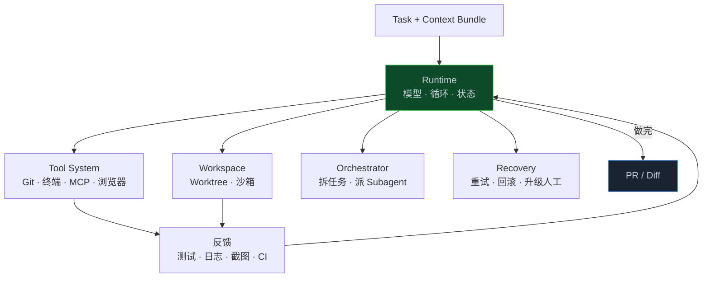
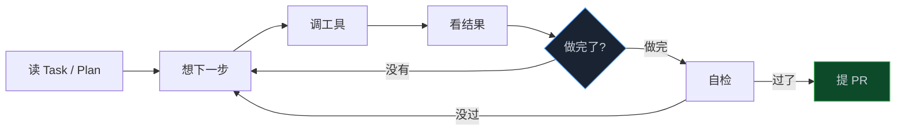

> **📖 系列难度说明**：本篇为**核心实践篇**，适合已经能让 Agent 改几个文件、但还没把握让它独立跑完一个工程任务的读者。用过 Claude Code / Cursor / Codex 会更有体感。
> **🎁 核心收获**：读完本篇你将理解 Harness 不是另一套 Prompt，而是 Agent 的工作现场；知道一个 Task 怎么在运行时里被执行完，以及什么时候该拆多 Agent、什么时候不该拆。

Task 写清楚了，上下文也装好了。Agent 很快改完 `AuthService.ts`，乍看没什么问题。

然后，就没有然后了。测试没跑，PR 没提，OAuth 回归也得你自己记着。真跑出错误，它还会停在原地，等你再催一句。

问题不在写代码，而在它只能写到这里。后面的活，没有一个能接着跑下去的现场。

OpenAI 把这个现场叫做 **Harness**。说白了，就是把工具、反馈和边界都接好，让 Agent 不只会交一段代码，而是能把任务做完。

<!-- more -->

---

## 写代码，只是任务的中间一段

上一篇把登录失败限制这条任务，装配成了一份工作包：改 `AuthService` 和 `LockService`，别碰 OAuth，跑这几个测试。Agent 已经"看见该看见的了"。

可一个工程师接到同样的活，不会改完文件就起身走人。他会：

```
看计划 → 开分支 → 改代码 → 跑测试 → 失败了再改
→ 自己先看一遍 diff → 提 PR → 处理评论
```

Agent 如果只能做到"改代码"，你得到的是半成品。后面那些步骤，才是工程任务真正耗人的部分。第 00 篇说代码不再是瓶颈，指的就是这个：生成 diff 很快，把 diff 变成可合并的变更很慢。

所以 L4 要回答的不是"怎么让模型写出函数"，而是：

> **一个已经写清楚的 Task，怎么被 Agent 从头执行到可以交给下一层验证？**

答案不是再写一个更长的 Prompt。是给它一套工作环境。

---

## Harness：不是马，是马具

Harness 这个词，OpenAI 用得很直白。马再快，没有马具也拉不了车。模型再强，没有运行时也完不成工程任务。

他们内部做过一次很彻底的实验：从空仓库开始，让 Codex 负责代码、测试、CI、文档和可观测性，人几乎不手写源码。项目早期却比预想中慢。卡点不是 Codex 不会写，而是 **环境没说明白**：工具不全、结构不清、仓库知识缺失，反馈也接不上。

工程师于是开始修环境，而不只是继续调 Prompt。环境能被 Agent 理解、执行和验证，后面的速度才真正起来。

一套能干活的 Harness，至少得把这五件事接上：



Runtime 让循环转起来，工具负责动手，Workspace 提供隔离工位，Orchestrator 拆活，Recovery 处理失败。少一块，Agent 都可能卡在中途，再把半成品扔回来。

> 💡 **来源**：[Harness engineering: leveraging Codex in an agent-first world](https://openai.com/index/harness-engineering/) — Humans steer, Agents execute；早期瓶颈是环境 underspecified，不是模型不会写代码
>
> 💡 **来源**：[Codex as a platform](https://developers.openai.com/blog/codex-as-a-platform) — Harness 负责会话状态、工具调用、沙箱与审批边界，并把工作跨轮次接住

---

## 一次任务在运行时里怎么走

还是登录失败限制。Task 已经批准，上下文包也打好了。运行时不会一上来就改文件。

Anthropic 把默认起点放在 **Plan Mode**：只读仓库，不改东西。把 `intent.md` 和 `spec.md` 扔进去，逼它先交出一份计划——改哪些文件、什么顺序、用什么测试证明。计划要狠到：一个没看过这场对话的人，只拿 `plan.md` 也能动手。你在代码写出来之前先把计划拷问一遍，返工会少很多。

计划过了，循环才开始转：



这就是 Agent Loop。第 02 篇的 Task 是它的输入，第 03 篇的上下文包是它桌上的材料，循环本身决定它会不会停在半路。

放到登录限制这条任务里，大致会这样跑：

1. 按 Plan 建 `LockService.ts`（Task DAG 里它排在前面）
2. 改 `AuthService`，接上计数和锁定
3. 跑 `pnpm test packages/auth`
4. 红了？读失败信息，改代码，再跑。不是改测试让它变绿
5. 再跑 `oauth.regression.ts`，确认共享的 `TokenService` 没被误伤
6. `git diff` 自己先看：有没有进 `packages/oauth`
7. 开 PR，把 Spec、Plan、测试输出贴上

第 4 步很容易被漏掉。Anthropic 把它叫做 **反馈回路**：交给人之前，先让 Agent 自己查错、自己修。验证命令要写进地图文件；失败时必须返回非零退出码；“完成”的定义里也要明确哪些命令跑过。UI 任务可以用截图对比闭环。修 Bug 时，则先写一条会失败的测试，确认它真的红，再让 Agent 修到变绿，同时用 Hook 拦住它偷偷改测试。

没有这条回路，Harness 就只是一个会写文件的聊天窗口。

> 💡 **来源**：[The AI-Native SDLC playbook](https://claude.com/blog/the-ai-native-sdlc-playbook) — Plan Mode 先产出可独立实现的 `plan.md`；每个会话在人看到之前要有自检手段

---

## 工具系统：手伸出去之前，得知道能碰什么

循环能转，是因为每一步都能调用工具。读文件、改文件、跑测试、查 Git、开 PR、看浏览器、查日志——这些对工程师是终端里的日常，对 Agent 必须变成可调用的工具。

MCP 把工具连接这件事标准化了。上一篇用过 USB-C 的类比：桥负责接得上，Skill 负责教它怎么用。到了 L4，还得看桥后面的那只手会不会乱抓。

工具最好按风险分层，别把 `rm -rf` 和 `grep` 放在同一档自动批准里：

| 档       | 例子                         | 运行时默认                |
| -------- | ---------------------------- | ------------------------- |
| 只读     | 搜代码、查图、看 diff        | 自动                      |
| 本地写   | 改 worktree 里的文件、跑单测 | 自动，但要审计            |
| 仓库写   | commit、开 PR                | 自动 + 审计，或按仓库策略 |
| 基础设施 | 触发 CI、部署 staging        | 策略控制                  |
| 生产     | 生产日志、生产发布、迁库     | 人工批准                  |

GitHub 把这个思想做到了 Agentic Workflow 里：Agent 默认只读，真正写 GitHub 的动作走声明式 `safe-outputs`，在隔离环境里校验后再执行。Agent 表达"我想开一个 PR"，不等于它手里已经握着写权限。

这层先讲到风险分档就够。谁批准、出了问题谁负责，是第 06 篇治理要展开的。运行时这边记住一句：**工具不是能力清单，是权限边界。** 给得太少，任务做不完；给得太猛，它会在你没盯着的时候把不该动的地方动掉。

OpenAI 接入的也不只 Git 和测试。应用能按 worktree 拉起实例，再接上浏览器、日志和指标。Agent 可以自己点页面、查 Trace。有的单次任务会跑六个小时，正好发生在人去睡觉的那段时间。到这一步，它做的早就不只是“帮我写个函数”，而是沿着环境里编码好的开发回路往前走。

> 💡 **来源**：[GitHub Agentic Workflows](https://github.blog/changelog/2026-06-11-github-agentic-workflows-is-now-in-public-preview/) — 默认只读，写操作经 sandbox、防火墙和 Safe Outputs
>
> 💡 **来源**：[How Kiro works](https://kiro.dev/docs/how-kiro-works/) — Harness 在各端行为一致：同一套 Steering、权限、沙箱和压缩策略

---

## 工位：Worktree 和沙箱不是可选项

两个 Agent 同时改同一个工作区，结局通常是：A 写的文件被 B 覆盖，分支纠缠，回滚都不知道回谁的。

Git Worktree 把工位拆开。每个会话、每个 Subagent 可以有一份独立的工作树，改动互不踩脚，主分支保持干净。Claude Code 已经把 `--worktree` 和 Subagent 的 `isolation: worktree` 做成一等能力：子任务在临时 worktree 里干，干完没改动就自动清掉，有改动的留下来等人收。

沙箱是另一道墙。文件系统隔离、网络隔离，减少"要不要批准这次命令"的弹窗，也减少 Agent 摸到密钥、扫到内网的机会。生产级运行时里，Workspace 至少要回答三个问题：

- 这份改动落在哪棵树上？
- 这棵树能不能随便出网、随便读密钥？
- 失败了能不能整棵丢掉，而不是在原分支上缝缝补补？

登录限制如果拆成两个 Task——一个建 `LockService`，一个建 Redis 计数——它们不改同一批文件，就可以两个 worktree 并行。等两者都绿了，再在第三个工位上改 `AuthService` 把它们接起来。第 02 篇的 Task DAG，到这里才变成真正的并行，而不只是图画得好看。

---

## 一个不够用的时候，再拆

第 01 篇写过：真实工程任务常常要规划、编码、测试、评审、安全检查。让一个 Agent 全干，不如让专门的角色各干各的。

道理没错，但很容易用过头。

如果改动只落在两三个文件，验收命令也明确，单 Agent 加反馈回路往往更稳。没必要让它一边放开手写代码，一边又换张脸给自己挑刺。多 Agent 会额外带来上下文分散和信息转发，中间丢东西很常见。

再看该拆的信号：

**任务太长，一个窗口装不下。** 迁移、全仓巡检、大重构。拆开，让每个 Agent 只吃一段。

**角色互相打架。** 你没法在同一份系统提示词里，既让它大胆实现，又让它苛刻审查。Coder 和 Reviewer 分开，比在一个脑子里精神分裂有效。

**工作天然能并行。** 第 02 篇里 `TASK-001` 建 LockService、`TASK-002` 建计数器，没有互相依赖。GitHub Copilot CLI 的 `/fleet` 干的就是这个：编排者把目标拆成独立工作项，能并行的就同时派，子 Agent 各有窗口、共享文件系统、彼此不直接聊天，由编排者收口。

Anthropic 把并行分成两种，别混：

- **并行会话**：另一个完整实例，自己的 worktree，彼此不知道对方。适合完全独立的任务。
- **子智能体**：长在同一个会话里，自己有窗口和工具限制，干完把结果交回。适合"去验证一下应用是不是真的起来了"这种重复活。

实际协作时，有条规则很管用：Subagent 应该共享 **Artifact + Context + Policy**，而不是整段聊天记录。父会话的流水账塞给 Reviewer，只会把噪声一起带过去。给它 Spec、Plan、Diff 和测试输出，评审目标反而更清楚。

登录限制落到角色上，可以很克制：

```
Orchestrator 读 Task DAG
    ├── Coder A：LockService（worktree 1）
    ├── Coder B：Redis Counter（worktree 2）
    └── 两者完成后
            Coder C：改 AuthService
                 └── Tester：跑 auth + oauth 回归
                      └── Reviewer：只看 diff 和越界
```

三个 Coder 不是因为"多就是强"，是因为 DAG 允许并行，且文件边界清楚。Reviewer 单独出来，是因为写代码的人不该给自己打分——第 02 篇里那个"测试过了但 OAuth 被顺手改了"的 PR，就是自己审自己的典型结局。

> 💡 **来源**：[Run multiple agents at once with /fleet](https://github.blog/ai-and-ml/github-copilot/run-multiple-agents-at-once-with-fleet-in-copilot-cli/) — 编排者拆任务、并行派发、子 Agent 不共享对话历史
>
> 💡 **来源**：[Run parallel sessions with worktrees](https://code.claude.com/docs/en/worktrees) — 并行会话用 worktree 隔离文件编辑；Subagent 可单独隔离

---

## 失败了怎么办，比成功路径更重要

演示里的 Agent 总是一遍成功，进了真实仓库就没这么省心了。

运行时如果没有 Recovery，循环就会在失败处空转，或者直接把烂 diff 丢给你。一套能用的恢复策略，按代价从低到高：

**有限地再试一次。** 测试偶发失败、网络抖一下、锁没抢到，都可以重试，但次数必须封顶。

**换条路。** 同一处改了三轮还红，多半不是再改一次就能解决。回到 Plan，看看任务是不是拆错了，或者上下文包漏了共享下游。

**必要时丢掉整个工位。** Worktree 的价值就在这里：失败实验可以直接舍弃，主分支不受影响，比在脏工作区里继续缝补安全得多。

**该停就交给人。** 跑了几轮仍不满足验收，或者必须碰生产、迁库、修改 `packages/oauth` 这类明确禁区，就别再硬闯。Agent 卡住往往也是环境发出的信号：缺的是工具、护栏，还是文档？把缺口补进仓库，再让它重新走一遍。人修环境，Agent 修代码。长期反过来做，Harness 最后还是会退回普通 IDE。

编排规模再往上，人盯会话会先崩。OpenAI 发现一个人舒服地管 3～5 个 Codex 会话，再多就开始忘谁在干什么。他们做了 Symphony：把 Issue Tracker 变成控制面，每个开放任务配一个 Agent 工位，崩了就拉起来，新任务自动领。人不再管理窗口，改为管理队列和结果。

这已经接近"Agent 劳动力调度"。大多数团队现在用不到。但方向要清楚：L4 的终点不是你开十个聊天窗口，是 Task 进入队列之后，运行时自己领、自己跑、自己在失败时按策略恢复。

> 💡 **来源**：[An open-source spec for Codex orchestration: Symphony](https://openai.com/index/open-source-codex-orchestration-symphony/) — 不要让人管理 Agent Session，让 Agent 从工作队列领取任务

---

## 你现在就能接上的，和必须做成平台的

对照自己让 Agent 干活的方式，多半能对上其中一档。

```
L0  对话式改代码
    你催一步，它走一步，测试和 PR 都是你的

L1  有循环、有验证命令
    地图文件里写了 make test；失败了它会自己再改

L2  有工位
    worktree / 沙箱，并行任务互不踩；计划模式是默认入口

L3  有角色
    Coder / Tester / Reviewer 分开，共享的是产物和上下文，不是聊天记录

L4  有队列
    Task 进来自动领工位，崩溃重启，人只看 PR 和升级单
```

L0 到 L1，今天就能做。给仓库一条验证命令，写进 `AGENTS.md`，完成定义里必须跑过它。修 Bug 时先固定失败测试。这是投入最小、体感最明显的一步。

L1 到 L2，打开计划模式当默认，并行任务用 worktree。别在同一个脏目录里让两个 Agent 抢文件。

L2 到 L3，只在 DAG 真的能并行、或者审查必须独立时再拆。两三个文件的小改动，硬上舰队，编排本身比改代码还贵。

L3 到 L4 是平台活：把第 02 篇的 Task 当成队列里的工作项，而不是聊天里的一句话。做到这一档，Agent 才算进入研发系统，而不只是进了你的编辑器。

工程师的日常也会跟着变化：少写一些重复代码，多花时间把意图写成 Task，把环境补到 Agent 真能使用。遇到失败时，也不只是催一句“再试一次”，而是看看工作现场缺了什么。

OpenAI 那句话翻成工作语言，大概就是：**人掌舵，Agent 划桨；桨划不动，先修船，别急着跳下去游。**

---

## 📝 小结

- 完整工程任务不是生成 diff，是从 Task 走到可提交的变更：计划、实现、自检、PR
- Harness 是 Agent 的工作现场：Runtime、工具、工位、编排、恢复，缺一块就会停在半路
- 循环能转，是因为每一步有工具、每一步有反馈；没有非零退出的验证命令，Agent 不知道什么叫做完
- 工具要按风险分档；MCP 是桥，权限才是边界
- Worktree 和沙箱让并行和失败可丢弃；多 Agent 只在任务够长、角色冲突、或能并行时才划算
- Subagent 共享产物和策略，不要共享整段聊天；人最终管的是队列和结果，不是十个会话窗口
- 下一层才证明它做对了——测试绿了不等于任务对了

---

## 🔮 下一篇预告

Agent 把活干完了，测试也绿了。就该合并吗？

不一定。它可能改了不该改的地方，删了旧测试，引入了新的 Redis 客户端。传统测试回答"代码跑起来没有失败"。AI Native 还要回答"Agent 有没有做对这件工程任务"。

下一篇进入 L5——**持续验证：从 Test 到 Eval 到 Evidence**。怎么证明这次变更可信，以及为什么 PR 里不该只剩一个 Diff。

---

> 📚 **系列导航**
>
> - 第 00 篇：代码不再是瓶颈，那瓶颈在哪？
> - 第 01 篇：7 层架构——AI Native 研发平台的骨架
> - 第 02 篇：产物链路——从 Intent 到 Evidence 的完整链条
> - 第 03 篇：上下文工程——让 Agent 真正理解你的代码库
> - **第 04 篇：Agent 运行时——一个任务怎么被 Agent 完整执行** ⬅️ 你在这里
> - 第 05 篇：持续验证——从 Test 到 Eval 到 Evidence
> - 第 06 篇：治理与边界——Agent 能做什么，不能做什么
> - 第 07 篇：生产闭环——线上数据怎么反馈回研发流程
> - 第 08 篇：落地方案——从 0 到 1 搭建 AI Native 研发平台
