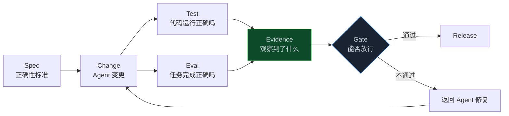
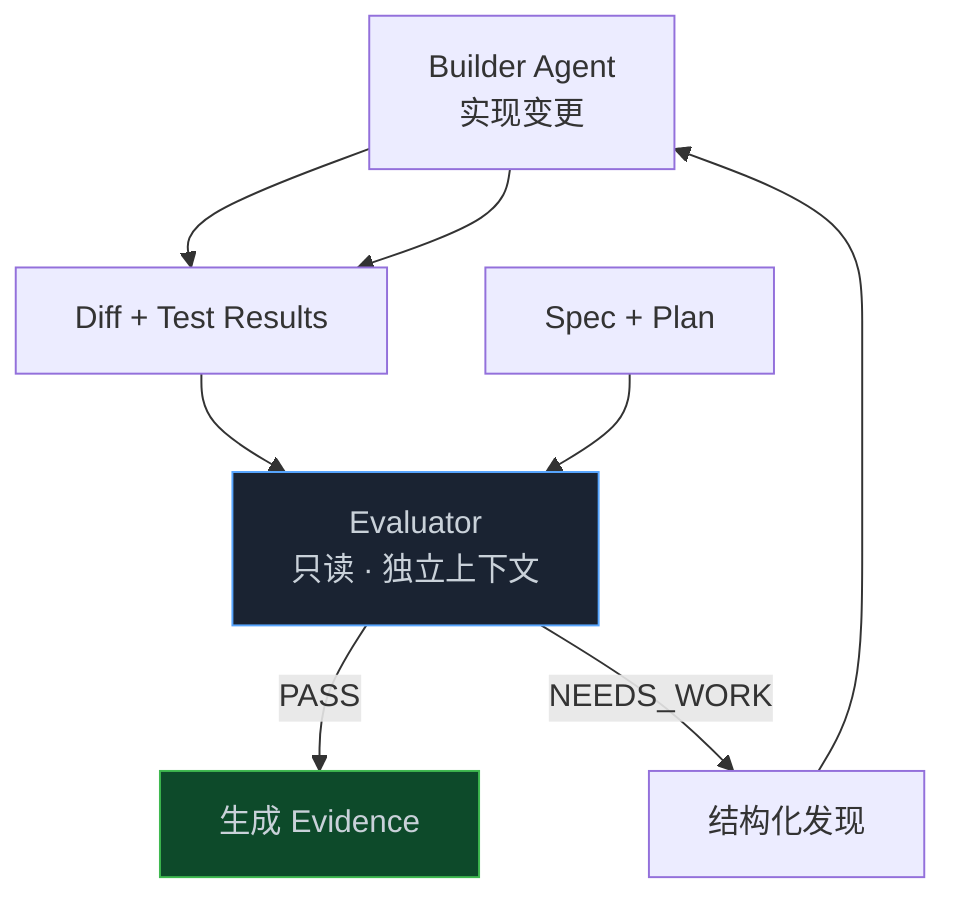
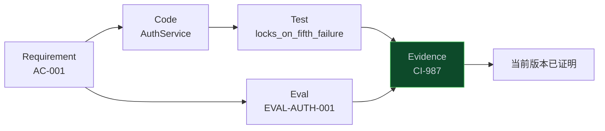
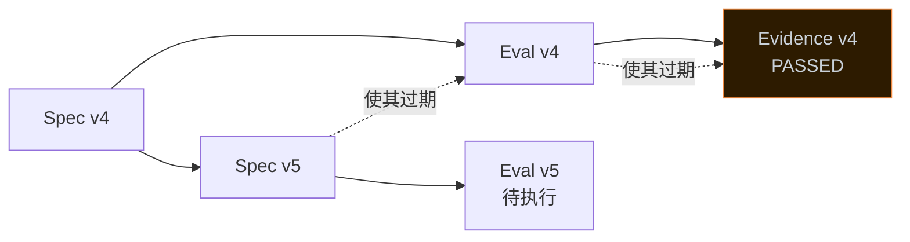
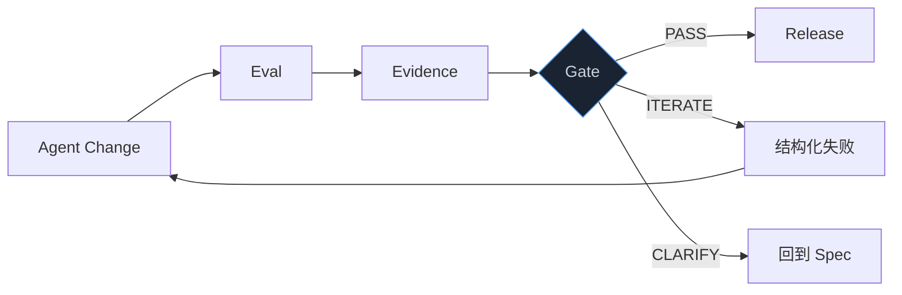

> **📖 系列难度说明**：本篇为**核心实践篇**，适合已经会写测试、但想弄清楚“怎么证明 Agent 没有做错事”的读者。不需要 Eval 平台经验。
> **🎁 核心收获**：读完本篇你将能够区分 Test、Eval 和 Evidence，设计一套针对 Agent 变更的验证矩阵，并知道怎样把分散的测试结果变成可追溯的发布依据。

Agent 做完了登录失败限制。

128 个测试全部通过，CI 绿得很漂亮，PR 也挑不出明显问题。

到了测试环境，麻烦才露出来：密码连续输错 5 次后，OAuth 登录居然也被锁了。

看着意外，其实很常见。现有测试只证明了“新功能能工作”，没人检查它有没有碰坏原本不该动的东西。

上一篇聊的是怎么让 Agent 把活干完。现在得多问一句：

> **它真的做对了吗？拿什么证明？**

<!-- more -->

---

## 测试全绿，为什么还是错的

先回到这条 Spec：

```text
连续输错密码 5 次后，账户锁定 15 分钟。
锁定期间拒绝密码登录。
OAuth 登录不受影响。
不得泄漏账户是否存在。
不得引入新的 Redis 客户端。
```

Agent 写了三个测试：

```text
✓ 第 5 次失败后进入 LOCKED
✓ 锁定期间密码登录被拒绝
✓ 15 分钟后自动解锁
```

它们都过了。可这只能证明三件被写进测试的事。

OAuth 是否被误伤，没测。

错误响应有没有暴露账户存在性，没测。

Agent 有没有为了省事引入第二套 Redis 客户端，也没测。

这就是传统测试在 Agent 时代暴露出的边界：**测试只回答测试问过的问题**。

如果测试题本身写漏了，代码再绿也没用。更麻烦的是，题目还可能写错。

OpenAI 在 2026 年审计 SWE-bench Pro 时发现，这个用于衡量 Coding Agent 的公开任务集中，大约 30% 存在问题。自动分析标记了 27.4%，人工复核标记了 34.1%。有些测试过于严格，会拒绝正确实现；有些需求写得含糊；还有些测试覆盖太低，会让不完整的实现混过去。

这件事给工程团队提了个醒：

> **一把坏尺子，量不出好 Agent。**

所以 AI Native 质量体系不能只靠“再多写几个测试”。需求、行为、改动边界和实际观测，得连成一条能追查的线。

> 💡 **来源**：[Separating signal from noise in coding evaluations](https://openai.com/index/separating-signal-from-noise-coding-evaluations/) — OpenAI 审计 SWE-bench Pro 后估计约 30% 的任务存在测试、需求或覆盖问题

---

## 三个词，分别回答三个问题

Test、Eval、Evidence 经常混在一起说。其实它们各管一件事：

> **Test 问代码有没有按预期运行；Eval 问 Agent 有没有完成正确的工程任务；Evidence 记录我们凭什么得出这个结论。**

画成一条链就是：



拿登录限制来说：

**Test** 会执行错误密码登录，检查第 5 次之后是不是锁定。

**Eval** 还会对照 Spec 检查：OAuth 有没有保持原样、依赖边界有没有变化、Agent 有没有删测试、改动范围是否合理。

**Evidence** 则保存事实：哪个 commit、在哪个环境、执行了什么命令、退出码是多少、报告文件在哪、对应 Spec 的哪个版本。

Test 是检查手段之一，不是最终结论。

Eval 是验证编排，不是换个名字再跑一遍单测。

Evidence 是事实记录，不是 Agent 写的一段“我已经测试过了”。

把这三层拆开后，验证流程才不容易变成一锅粥。

---

## Eval 到底多检查了什么

传统测试通常盯着函数、接口或用户流程。Eval 看得更大，它检查的是**一次完整的工程变更**。

先别急着想平台，这件事可以顺着五个问题往下查。

### 功能真的对吗

这一层大家最熟：单元测试、集成测试、E2E、构建和类型检查。

登录限制至少要验证：

```text
失败次数递增
成功登录后清零
第 5 次触发锁定
15 分钟后解锁
并发请求下计数不丢
Redis 故障时按约定降级
```

这些问题都有相对明确的答案。能写成断言，就交给代码和命令，没必要请 LLM 来猜。

### 是否符合 Spec

功能能跑，不代表需求满足。

比如代码把阈值写死成 3 次，测试也照着 3 次写。测试会全绿，Spec 明明要求 5 次。

所以 Eval 不能只拿代码对测试，还要拿 **Spec 对代码和测试**：

```text
AC-001  第 5 次失败后锁定
  ├── 实现：AuthService.recordFailure()
  ├── 测试：locks_on_fifth_failure
  └── 证据：CI-987 / test-results.xml
```

当 Acceptance Criteria 有稳定 ID，这条追踪关系才能被机器检查。否则“需求已覆盖”只是评审者的感觉。

### 改动有没有越界

这是 Agent 变更最容易出问题的地方。

第 03 篇的 Code Graph 已经算出了影响面。现在它可以反过来生成验证范围：

```text
Diff 修改 AuthService
  ↓
Code Graph 发现共享下游 TokenService
  ↓
必须追加 OAuth Regression
  ↓
Spec 又声明 packages/oauth/** 是 out_of_scope
  ↓
检查 OAuth 文件零改动 + OAuth 行为不变
```

这类检查不一定是传统测试。它可能是一条图查询、一条 `git diff --name-only` 规则，或者架构测试。

### 有没有违反工程约束

“不得引入新的 Redis 客户端”不是功能需求，却直接影响维护成本和系统一致性。

这一层要看：

- 架构边界有没有被穿透；
- 有没有新增未批准的依赖；
- 安全扫描是否出现高危项；
- 日志里有没有 PII；
- 旧测试有没有被删除或削弱；
- 数据迁移是否可回滚。

其中不少检查都能确定性执行。依赖白名单、目录边界、静态扫描、Schema 对比，应该交给程序。只有“实现是不是偏离设计意图”这类难以形式化的问题，才适合让 Reviewer Agent 辅助判断。

### 上线之后真的有用吗

到了这一层，PR 阶段还拿不到最终答案，只能先把性能基线、观测字段、灰度指标和回滚条件准备好。

真正的事实要等生产环境给：

```text
Canary 错误率没有上升
登录 P95 延迟仍在控制带内
OAuth 成功率没有下降
暴力破解流量被有效限制
```

所以 Evidence 不会在 Merge 那一刻结束。生产证据是可信度最高、也最晚到达的一层。第 07 篇会把这条线接回新的 Intent。

---

## 别让写代码的人给自己打分

上一篇提过，Coder 和 Reviewer 最好分开。到了验证阶段，这个分工更有必要。

让同一个 Agent 写实现、写测试、解释测试为什么足够，再宣布自己通过，像是让考生出题、答题、阅卷。

它不一定作弊，但盲区会被完整继承。

更稳的做法是把 Builder 和 Evaluator 拆开：



Evaluator 最好有几个限制：

- 不给写代码权限，只读 Diff、Spec 和执行结果；
- 不继承 Builder 的整段对话，避免被原来的解释带偏；
- 输出结构化结论，不写一篇模棱两可的评审作文；
- 每个发现必须指向证据，不能只说“感觉有风险”；
- 证据不够时返回 `GATHER_EVIDENCE`，别硬猜 PASS 或 FAIL。

Anthropic 的长任务 Harness 示例就用了这种思路：Builder 不能只靠口头声称完成，必须先读取实际结果；独立 Evaluator 没有写权限，从一个没看过构建过程的新上下文里审 Diff 和截图。没过就把发现交回下一轮 Builder。

这里有个小细节很关键：**默认失败**。

如果证据文件不存在、命令没执行、结果版本对不上，状态应该是未证明，而不是“暂时算通过”。自动化程度越高，这条规则越重要。

> 💡 **来源**：[Claude Code long-running agent harness](https://github.com/anthropics/cwc-long-running-agents) — 独立只读 Evaluator、证据读取约束和默认失败的验证循环

---

## Evidence：别把“声称”当成“观察”

Agent 在回复里写：

> 我已经运行全部测试，功能正常。

这叫 Claim，声称。

一份能用的 Evidence 至少要长这样：

```yaml
evidence:
  id: EVD-AUTH-001

  subject:
    spec:
      id: SPEC-AUTH-001
      version: 4
    task: TASK-AUTH-003
    commit: abc123

  observation:
    command: "pnpm test packages/auth"
    environment:
      os: linux
      node: "22.x"
    exit_code: 0

  result:
    passed: 128
    failed: 0

  provenance:
    source: github-actions
    run_id: "987654"
    observed_at: "2026-09-12T03:20:15Z"

  artifacts:
    - "test-results.xml"
    - "coverage.json"
```

有了这些字段，下面的问题才追得下去：

```text
证明的是哪个 Spec 版本？
对应哪次代码提交？
命令真的执行了吗？
在哪个环境执行？
谁记录了结果？
原始报告还能找到吗？
```

只写 `status: passed` 不够。那只是结果，不是证据。

GitHub Spec Kit 社区关于 Evaluator Contract 的讨论也在强调这条边界：要区分“Agent 说测试通过”和“在 revision X 实际观察到命令产生 artifact Y”。还要保留矛盾发现，明确表达证据不足，而不是把多个评审强行平均成一个绿色分数。

> 💡 **来源**：[Standard evaluator contract for evidence, provenance, uncertainty, and recovery](https://github.com/github/spec-kit/issues/4290) — 区分 observed evidence 与 generated assertion，并让评估结果带来源、版本和下一步动作

---

## 证据也分强弱

Evidence 也有强弱，可以把它看成一条逐步加固的链：

```text
L0  Claim
    Agent 说“应该没问题”

L1  Static
    类型检查、Lint、AST、依赖与架构规则

L2  Executed
    构建、单测、集成测试、E2E 真实执行

L3  Independent
    独立 Agent Review、安全扫描、隔离环境复验

L4  Production
    灰度指标、日志、Trace、真实用户行为
```

这个分层不是为了算出一个漂亮的 87 分，而是让审批者看清楚：眼下到底知道了什么。

如果只有 Agent 自述，可信度很低。CI 真跑过命令，才算证明当前提交在指定环境里通过。独立评审再补一层，减少 Builder 自证的盲区。等上线指标回来，我们才知道它不只在测试里工作，也扛得住真实流量。

风险不同，需要的证据强度也不同。改 README，也许静态检查加 Review 就够。修改认证、计费或数据迁移，L2 甚至 L3 只是起点，必须设计生产验证和回滚。

所以质量门禁不该问“分数够不够”，而该问：

> **以这次变更的风险，当前证据够不够？**

---

## 从 Code Coverage 走向 Evidence Coverage

传统项目很爱看代码覆盖率。85% 的确比 70% 让人安心，但这份安心有边界。

代码被执行过，不代表需求已经被证明。

登录限制有 10 条验收标准，代码行覆盖率 95%，但 OAuth 不受影响这一条没有测试。那条需求的证据覆盖率仍然是 0。

所以至少要同时看四种覆盖：

```text
Code Coverage
代码行、分支、函数有没有执行

Requirement Coverage
每条 Spec 是否有实现承载

Eval Coverage
每条 Acceptance Criteria 是否有验证方法

Evidence Coverage
这些验证方法是否在当前 commit 上产生了有效证据
```

它们的关系是：



假设一份 Spec 有 10 条 Acceptance Criteria：

```text
10 条都有实现映射          Requirement Coverage = 100%
9 条有 Eval                Eval Coverage = 90%
8 条在当前提交上有证据      Evidence Coverage = 80%
```

这时候不能因为代码覆盖率 95% 就放行。那两条无证据的 AC 必须变成显式风险：补验证、记录技术债，或者由有权限的人接受。不能悄悄消失。

这也是为什么第 02 篇一直强调 Artifact ID 和 Lineage。如果 Spec、Task、Eval 没有稳定 ID，就没法判断证据覆盖了谁，更没法在 Spec 升级后把旧 Evidence 标成过期。

---

## 上游一变，旧证据就可能作废

很多 CI 报告的问题不是假，而是**过期**。

比如：

```text
SPEC-AUTH-001 v4：锁定 15 分钟
EVD-AUTH-001：基于 v4，全部通过

后来 Spec 升到 v5：不同风险等级使用不同锁定时间
```

旧 Evidence 仍然证明 v4 做对了，却不能证明 v5。

这时不能继续挂着绿色标记。Lineage 应该把上游变化传下去：



所以 Evidence 的状态不该只有 PASS / FAIL，还要有：

```text
VALID       对当前版本有效
STALE       上游已变化，需要重跑
MISSING     应该有，但还没产生
CONFLICTED  多个评估结论冲突
FAILED      已观察到不满足标准
```

这一步看起来偏平台设计，却很实用。你只要问一句：“这个绿色报告对应哪个 commit、哪个 Spec 版本？”很多看似稳固的发布依据就会露出空洞。

---

## Gate 不该只有红和绿

CI 最常见的输出是 PASS / FAIL，可真实工程里的质量决策没这么干脆。

一个 Evaluator 更适合返回有限的下一步动作：

```text
PASS             证据充分，可以进入下一阶段
WARN             有非阻断发现，需要记录
ITERATE          变更不满足标准，交回 Agent 修复
CLARIFY          Spec 含糊，先找人澄清
GATHER_EVIDENCE  暂时无法判断，补跑验证
BLOCK            触碰硬规则，停止推进
```

`CLARIFY` 处理的不是代码问题。比如 Spec 一边要求“Redis 故障时 fail-open”，一边又说“任何暴力破解都必须被阻止”。两条要求互相打架，继续催 Agent 改代码，只会来回摇摆。

`GATHER_EVIDENCE` 则表示现在还不能下结论。没看到 OAuth 回归报告，不等于 OAuth 一定坏了，也不等于它没事。眼下能确定的只有：证据不够。

把未知硬压成红或绿，自动化反而会制造虚假的确定性。

最后的 Gate 应由 Policy 决定，不该由某个 Reviewer Agent 随口拍板：

```yaml
gate:
  hard_rules:
    - "critical_security_findings == 0"
    - "out_of_scope_changes == 0"
    - "required_acceptance_evidence == 100%"

  soft_signals:
    - "line_coverage >= 85%"
    - "review_nits <= 5"

  decision:
    pass: "所有 hard_rules 通过"
    warn: "只有 soft_signals 未达标"
    block: "任一 hard_rule 失败"
```

硬规则和软指标要分开。安全高危不能被“代码风格 98 分”平均掉。关键需求没证据，也不能靠总分 90 放行。

第 06 篇会继续追问：这些 Policy 谁来定，哪些 Gate 能自动过，哪些必须由人批准。

---

## Continuous Evals：测试的不只是代码

这里还有个经常漏测的对象。

代码变了，大家知道要跑回归。可 `AGENTS.md`、Skills、Hooks 甚至模型变了，又该测什么？

这些东西会改变 Agent 的行为，却经常没有回归。

你把一句规则从“禁止修改 OAuth”改成“尽量不要修改 OAuth”，代码一行没变，下一批 Agent 的行为已经变了。模型升级也一样：能力更强，不代表在你们仓库里一定更稳定。

Anthropic 把 Continuous Evals 当作 AI Native 版本的阶段门禁。做起来并不玄乎：

1. 从最近真实研发工作里挑 20～50 个任务；
2. 为每个任务保存输入和可接受结果；
3. 在 CI 里非交互运行 Agent；
4. `CLAUDE.md`、Skills、Hooks 或模型变化时重跑；
5. Pass Rate 降了，配置变更不能直接合并；
6. 每次生产事故都留下一条永久 Eval。

比如仓库里可以有这样一组任务：

```text
AUTH-001  增加失败次数限制，不影响 OAuth
AUTH-002  修复 token 过期，不泄漏账户存在性
PAY-001   新增退款规则，不使用 float
API-001   新端点必须有认证、审计和集成测试
```

这套 Eval 不是测某次 PR 的功能，而是在测：

> **换了模型、改了规则之后，我们的 Agent 还会不会按同样标准干活？**

它更像 Agent 配置的回归测试。

套件也不能一劳永逸。模型越来越强，原来能拉开差距的任务会变得太简单；线上又会出现新的失败方式。Eval Suite 得像测试套件一样生长和修剪。

> 💡 **来源**：[Continuous evals in CI](https://academy.claude.com/courses/ai-native-sdlc-playbook/continuous-evals-in-ci) — 从 20～50 个真实任务起步，在 Agent 配置变化时持续回归，每个生产事故沉淀为永久 Eval

---

## 让失败变成下一轮输入

传统 CI 失败后，常常只留下一句：

```text
Process completed with exit code 1
```

人看了都得继续翻日志，Agent 更不知道下一步该改哪里。

更好的失败结果应该能直接驱动下一轮：

```yaml
outcome: ITERATE

finding:
  type: regression
  requirement: AC-OAUTH-UNCHANGED
  affected_symbol: OAuthController.login

observed:
  evidence: EVD-OAUTH-0098
  result: "password lock also blocks oauth callback"

expected:
  result: "oauth authentication remains available"

next_action:
  target_task: TASK-AUTH-003
  instruction: "修复共享锁状态判断，不得修改 OAuth 测试"
```

这时流程不再是“CI 红了，人去看日志”，而是：



如果是实现错了，回到 Task。

如果是 Spec 自相矛盾，回到 Spec。

如果是证据缺失，补跑验证。

不同失败回到不同层，才是真正的闭环。所有红灯都丢给 Coder，只会让 Agent 在错误问题上反复努力。

---

## 一套可以从今天开始的验证矩阵

不用等 Evidence Engine 建好再开始。先拿一张表，把当前 PR 要证明的事情列出来，已经比盯着一盏绿色 CI 灯靠谱不少。

还是登录限制：

| 验证目标 | 检查方式 | 证据 | 失败动作 |
| -------- | -------- | ---- | -------- |
| 第 5 次失败后锁定 | 单元 + E2E | test-results.xml | ITERATE |
| OAuth 不受影响 | OAuth 回归 | oauth-report.xml | BLOCK |
| 不泄漏账户存在性 | 安全用例 + 响应对比 | security.json | BLOCK |
| 不新增 Redis 客户端 | 依赖规则 | dependency-diff.json | ITERATE |
| 不改 out_of_scope 文件 | Git Diff 规则 | changed-files.json | BLOCK |
| 登录延迟不退化 | Benchmark | perf.json | WARN / BLOCK |
| Spec 每条 AC 有证明 | Lineage 检查 | evidence-map.json | GATHER_EVIDENCE |

小团队甚至可以先把它放在 PR 模板里：

```markdown
## 这次变更证明了什么

- [x] AC-001：第 5 次失败后锁定
  - Evidence: CI-987 / auth.e2e.xml
- [x] AC-002：OAuth 不受影响
  - Evidence: CI-987 / oauth.regression.xml
- [x] ARCH-001：未引入新 Redis 客户端
  - Evidence: CI-987 / dependency-diff.json
- [ ] PERF-001：P95 增量 < 20ms
  - Evidence: missing
  - Decision: 上线前必须补齐
```

先把缺口摆到台面上，再谈自动化。

团队跑顺以后，再把检查方式沉淀成 Eval，把报告收进 Evidence Bundle，最后让 Gate 变成可执行的 Policy。

比较顺手的落地路径大概是：

```text
PR 检查清单
  ↓
Acceptance Criteria 加稳定 ID
  ↓
测试结果绑定 commit 和 Spec
  ↓
加入越界、架构、安全 Eval
  ↓
生成 Evidence Bundle
  ↓
按风险执行 Gate
  ↓
生产事故沉淀成永久 Eval
```

走到哪一步，都能先拿到那一步的收益，没必要开场就造一座大平台。

---

## 📝 小结

- 测试全绿只说明被测试的问题通过，不说明 Agent 完成了正确的工程任务
- Test 验证代码运行，Eval 验证完整变更，Evidence 保存可追溯的观察事实
- Eval 要同时看功能、Spec、改动边界、架构安全和上线准备
- Builder 不该给自己打分；独立只读 Evaluator 能减少同源盲区
- “Agent 说测过”是 Claim；带 commit、环境、命令和原始报告的结果才是 Evidence
- Code Coverage 不等于 Evidence Coverage，每条 Acceptance Criteria 都要能追到当前版本的证明
- Gate 要区分 PASS、ITERATE、CLARIFY、GATHER_EVIDENCE 和 BLOCK，未知不能硬算成通过
- Continuous Evals 测的是 Agent 配置是否退化；每个生产事故都应该留下永久回归用例

---

## 🔮 下一篇预告

Evidence 齐了，Gate 也能自动判断。是不是就可以让 Agent 自己合并、自己发布了？

还不行。

Agent 能读哪些仓库、能调用哪些工具、谁可以让它碰生产、出了问题算谁的——这些不是模型问题，是治理问题。

下一篇进入 L7——**治理与边界：Agent 能做什么，不能做什么**。我们会把权限从“人”扩展到 Agent，再看哪些操作能自动，哪些必须停下来等人。

---

> 📚 **系列导航**
>
> - 第 00 篇：代码不再是瓶颈，那瓶颈在哪？
> - 第 01 篇：7 层架构——AI Native 研发平台的骨架
> - 第 02 篇：产物链路——从 Intent 到 Evidence 的完整链条
> - 第 03 篇：上下文工程——让 Agent 真正理解你的代码库
> - 第 04 篇：Agent 运行时——一个任务怎么被 Agent 完整执行
> - **第 05 篇：持续验证——从 Test 到 Eval 到 Evidence** ⬅️ 你在这里
> - 第 06 篇：治理与边界——Agent 能做什么，不能做什么
> - 第 07 篇：生产闭环——线上数据怎么反馈回研发流程
> - 第 08 篇：落地方案——从 0 到 1 搭建 AI Native 研发平台
