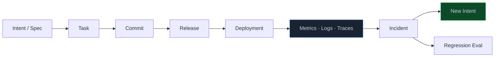
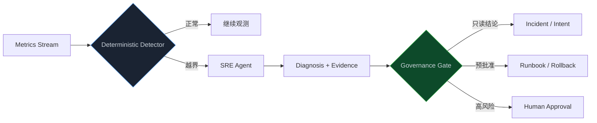
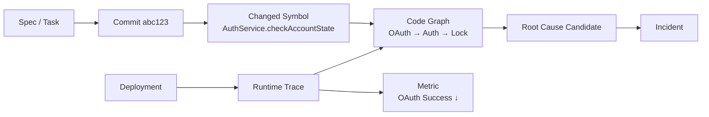
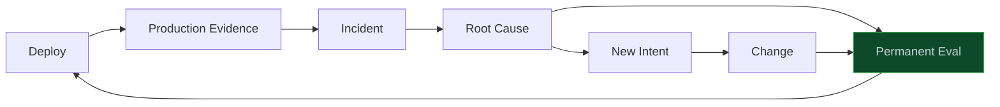

> **📖 系列难度说明**：本篇为**企业实践篇**，适合已经接触 CI/CD 和监控、想把 Agent 接进生产反馈流程的读者。不要求有 SRE 背景。
> **🎁 核心收获**：读完本篇你将知道 Dashboard 为什么不等于反馈闭环，理解 Control Band、SRE Agent 和 Production Evidence 的分工，并能设计一条从线上异常回到新 `intent.md` 的安全路径。

登录失败限制终于发布了。

Canary 跑了半小时，错误率正常，登录 P95 也没变。Release Manager 点下全量发布，大家松了口气。

一个小时后，OAuth 成功率开始缓慢下降。不是突然归零，只是从 98.7% 掉到 97.9%，接着又滑到 97.2%。Dashboard 上确实有这条线，可没人一直盯着。

第 05 篇的测试和 Eval 都过了，第 06 篇的审批也没少。问题还是进了生产。

这并不说明前面的验证白做了。测试环境只能证明我们预先想到的事，生产环境还会回答另一类问题：

> **真实用户、真实流量和真实依赖一起出现时，它到底工作得怎么样？**

<!-- more -->

---

## 发布不是终点，只是事实开始出现

传统研发流程很容易画成一条线：

```text
需求 → 开发 → 测试 → 发布 → 完成
```

“完成”两个字放得太早了。

发布前，我们拿到的主要是推断：测试通过，安全扫描没问题，灰度计划看起来合理。发布后，真实事实才陆续回来：

```text
用户到底有没有用
错误率是否真的稳定
下游依赖是否扛得住
性能有没有在高峰期退化
业务目标有没有改善
原来没想到的边界条件是否出现
```

L6 生产反馈层负责接住这些事实，再送回研发流程。

它不是“再装一个监控平台”。Metrics、Logs、Traces 早就存在。真正缺的是从观测到行动的那一段：

```text
看见异常
→ 判断是不是问题
→ 找到受影响的 Release 和代码
→ 形成可审查的诊断
→ 决定回滚、修复还是忽略
→ 把结论写回 Intent 和 Eval
```

少了后面几步，Dashboard 只是墙上的仪表盘。

---

## Dashboard 不会自己闭环

不少团队已经有几十块 Dashboard、上千条告警。值班同学仍然会在凌晨三点经历熟悉的一幕：

```text
告警响了
→ 打开 Dashboard
→ 翻日志
→ 找最近发布
→ 问群里谁改过
→ 建工单
→ 第二天等开发接手
```

信息都有，只是散在不同系统里。

监控知道 `oauth_success_rate` 下降了，但不知道它跟哪个 Task 有关。部署平台知道刚发了 `release-2026-0918-01`，却不知道这次 Release 改了哪个符号。Git 知道 Commit，Code Graph 知道调用链，Spec 又在另一个目录。

AI Native 的变化，不是把“人看 Dashboard”简单换成“Agent 看 Dashboard”。它要把这些对象连起来：



生产信号不再是孤立曲线，而是某次变更在真实环境里的回声。

---

## 先让遥测知道“这是谁发布的”

OAuth 成功率下降时，最先要回答的不是“哪行代码错了”，而是：

```text
从什么时候开始？
影响哪个环境和区域？
变化前后有哪些 Deployment？
当前实例跑的是哪个 Release 和 Commit？
这个 Commit 来自哪个 Task 与 Spec？
```

如果遥测里没有 Release 标识，Agent 只能靠时间猜。十个服务在同一小时发布过，它很容易把相关性当成因果。

每个 Deployment 至少要带上这组关联信息：

```yaml
deployment:
  id: deploy-2026-0918-008
  environment: production
  service: auth-service
  version: 3.18.0
  commit: abc123
  release: REL-2026-0918-001
  task: TASK-AUTH-003
  spec:
    id: SPEC-AUTH-001
    version: 4
```

服务产生的 Trace、Log 和 Metric 也要能关联其中几个稳定字段：

```text
service.name
service.version
deployment.environment
deployment.id
release.id
trace_id
```

这样查询才会从：

```text
过去一小时 OAuth 为什么变差？
```

收窄成：

```text
REL-2026-0918-001 发布后，
auth-service 3.18.0 在 ap-southeast-1 的 OAuth 回调
为什么比前一个版本多了 1.5% 超时？
```

问题越具体，Agent 胡乱归因的空间越小。

OpenTelemetry 已经为服务遥测提供了通用模型，GenAI 和 MCP 也开始有专门的语义约定。团队没必要另造一套完全封闭的 Trace 协议。可以沿用 OTel，再补企业自己的 `task.id`、`release.id` 和 `evidence.id`。

> 💡 **来源**：[Inside the LLM Call: GenAI Observability with OpenTelemetry](https://opentelemetry.io/blog/2026/genai-observability/) — GenAI Semantic Conventions 统一记录模型、Token、工具等遥测；默认不采集 Prompt 与工具参数正文，避免敏感内容泄漏

---

## Metrics、Logs、Traces 各自知道一部分

这三个词经常被放在一起说，可它们回答的问题不一样。

**Metric 先告诉你“哪里不对劲”。**

```text
oauth_success_rate ↓
login_p95 ↑
redis_timeout_rate ↑
locked_account_ratio ↑
```

它适合做趋势、对比和触发。代价是细节少，你知道错误率涨了，却不知道是哪一次请求出了错。

**Log 补上“当时发生了什么”。**

```json
{
  "event": "oauth_callback_failed",
  "reason": "lock_state_timeout",
  "user_hash": "u_8f21...",
  "trace_id": "4bf92f..."
}
```

日志能看到错误上下文，但一条条翻很容易迷路，还可能夹着 PII。

**Trace 负责“这次请求一路经过了谁”。**

```text
OAuthController.callback
  → AuthService.checkAccountState
    → LockService.get
      → Redis GET auth:lock:...
```

有了 Trace，Agent 才能沿着一次失败请求从 API 走到 Redis，而不是在几百万行日志里搜关键词。

还缺一块：**Deployment Event**。

它告诉系统什么时候换了版本、灰度比例怎么变、谁批准、是否回滚。没有它，Metric 曲线上的波动跟代码变更之间就没有可靠的时间锚点。

四类信息放在一起，顺序通常是：

```text
Metric 发现异常
→ Deployment 判断是否和发布相关
→ Trace 缩小调用路径
→ Log 补充具体错误
→ Code Graph 反查符号与影响面
```

它们不是互相替代，而是一步步把范围压小。

---

## 别让 LLM 盯每一个数据点

一个常见误区是：既然 Agent 会分析，那就把所有指标持续喂给它，让它决定什么时候有问题。

这既贵，也不稳。

“错误率连续 10 分钟超过阈值”“一小时 Error Budget 消耗过快”这类判断，本来就有确定答案。交给 Prometheus、流处理任务或普通脚本更合适。

Anthropic 在 AI-Native SDLC Playbook 里给出的做法也很克制：

```text
确定性程序监测 Control Band
→ 越界后再唤醒 Agent
→ Agent 负责诊断和提出下一步
```

检测和诊断要分开。



模型擅长面对模糊问题：异常可能跟哪次变更有关，还应该查什么，现有证据支持哪些假设。

程序擅长守门：阈值是否越界，窗口是否持续，规则是否匹配。

把两者倒过来，系统会让昂贵又概率化的组件去做一道 `if` 就能完成的工作。

> 💡 **来源**：[Closing the loop on metrics](https://academy.claude.com/courses/ai-native-sdlc-playbook/closing-the-loop-on-metrics) — 用确定性脚本监测 Control Band，越界后无头调用 Agent 诊断，并把结果写成新的 `intent.md`

---

## Control Band 不是拍脑袋阈值

最简单的告警长这样：

```text
如果错误率 > 1%，发告警
```

能用，但噪声往往很大。凌晨流量低，两个失败请求就可能越线；大促期间错误数变多，错误比例却没变。阈值在不同服务、时段和地区也未必通用。

Control Band 更像“正常行为的活动范围”。它可以来自：

- 明确的 SLO 和 Error Budget；
- 过去 30 天的滚动基线；
- 同比时段或同类实例；
- Canary 与 Control 组的差异；
- 均值、标准差和持续时间规则。

登录服务可以从一份版本化配置开始：

```yaml
metric: oauth_success_rate
scope:
  service: auth-service
  environment: production

baseline:
  type: rolling
  window: 30d
  compare: same_region

tiers:
  observe:
    condition: "deviation > 1sigma for 10m"
    action: record

  diagnose:
    condition: "deviation > 2sigma for 10m"
    action: invoke_sre_agent

  contain:
    condition:
      - "slo_burn_rate_1h > 14.4"
      - "slo_burn_rate_5m > 14.4"
    action: request_preapproved_rollback
```

这份配置要进 Git，有 Owner、有版本，也得测试。否则一次手滑把 `1%` 写成 `10%`，闭环就会在最前面失效。

Google SRE 更推荐围绕 SLO Burn Rate 告警。它衡量服务消耗 Error Budget 的速度，比单看某一刻的错误率更接近用户影响。长、短窗口同时越界才触发，可以过滤瞬时抖动；再配上不同燃烧率，快速事故和缓慢退化都能照顾到。

> 💡 **来源**：[Alerting on SLOs](https://sre.google/workbook/alerting-on-slos/) — 用 Error Budget Burn Rate 与多窗口规则提高告警精度，区分快速消耗和持续缓慢退化

---

## SRE Agent 怎么查，而不是怎么猜

Control Band 越界后，SRE Agent 被唤醒。它拿到的不能只有一句：

```text
OAuth 成功率下降，请分析。
```

一个能用的诊断包，至少要带上：

```yaml
diagnosis_context:
  alert:
    id: ALT-0098
    metric: oauth_success_rate
    observed: 0.972
    baseline: 0.987
    started_at: 2026-09-18T11:38:00Z

  scope:
    service: auth-service
    environment: production
    region: ap-southeast-1

  recent_deployments:
    - id: deploy-2026-0918-008
      commit: abc123
      started_at: 2026-09-18T10:30:00Z

  allowed_tools:
    - metrics.query
    - logs.search_redacted
    - traces.read
    - deployment.read
    - code_graph.query
    - git.show
```

注意工具全是只读。

它接下来的工作不是直接修生产，而是沿证据形成假设：

```text
1. 对比发布前后的 OAuth 成功率
2. 按 Region、版本、错误码切分
3. 抽取失败 Trace
4. 找到异常 Span：LockService.get
5. 查询 Code Graph：谁在 OAuth 路径上调用 LockService
6. 对比 abc123 前后的相关符号
7. 检查是否存在同一时间的 Redis 依赖异常
8. 给出已证实、待证实和已排除的原因
```

Anthropic 的 SRE Agent Cookbook 演示了类似过程：Agent 先看健康指标，再查错误率、数据库连接、日志和配置。每一步结果决定下一步查什么。这正是 Agent Loop 在运维里的价值。

> 💡 **来源**：[The site reliability agent](https://platform.claude.com/cookbook/claude-agent-sdk-03-the-site-reliability-agent) — Agent 通过受控 MCP 工具按“观测 → 推理 → 行动”循环关联指标、日志、配置与依赖

---

## Code Graph 和 Observability Graph 会合在一起

第 03 篇的 Code Graph 记录静态关系：

```text
OAuthController.callback
  CALLS AuthService.checkAccountState
  CALLS TokenService.issue
```

生产 Trace 记录真实运行路径：

```text
trace-4bf92f
  OAuthController.callback  12ms
  AuthService.checkAccountState  86ms
  LockService.get  80ms
  Redis GET  timeout
```

Git 和 Deployment 又补上变化：

```text
commit abc123
  CHANGED AuthService.checkAccountState
  DEPLOYED_AS release-2026-0918-001
```

把三类关系连起来，Agent 才能回答更像工程问题的查询：

```text
这次 Release 改过的符号里，
哪些出现在失败 Trace 上？

OAuth P95 上升经过的调用链中，
哪一段只在新版本里出现？

当前 Redis 超时影响哪些 API、Spec 和客户路径？
```



这张图不再只是 Code Graph。它把设计时结构和运行时事实放在了一起，可以叫 Software System Graph 或 Engineering Graph。

对大型系统来说，这比单纯增加日志更有用。日志回答“发生了什么”，图负责把“发生的事”接回代码、需求和负责人。

---

## 诊断结论要区分事实、假设和未知

Agent 很容易写出一段听起来完整的 RCA：

> 本次事故由登录锁定功能引起，建议回滚。

句子很顺，但证据可能只够说明“事故发生在发布后”。

更稳的诊断结果要把置信度拆开：

```yaml
diagnosis:
  incident: INC-AUTH-0098

  observed_facts:
    - "OAuth 成功率在 deploy-008 后 68 分钟开始下降"
    - "失败请求中 83% 停在 LockService.get"
    - "异常只出现在 auth-service 3.18.0"

  hypotheses:
    - id: H1
      statement: "新增锁状态查询放大了 Redis 延迟"
      confidence: high
      evidence:
        - trace-query-118
        - diff-abc123

  ruled_out:
    - "OAuth Provider 故障"
    - "全区域网络异常"

  unknowns:
    - "为什么只在发布 68 分钟后出现"

  recommendation:
    action: rollback_canary
    policy_route: production-change
```

事实可以进入 Evidence，假设要继续验证，未知必须保留。

如果 Agent 把未知补成一个顺滑故事，后续团队会在错误原因上修得很认真。

---

## 先止血，还是先修代码

线上事故最怕 Agent 一看到异常就开改。

诊断路径和处置路径应该分开：

```text
只读诊断
→ 判断用户影响
→ 选择已演练的处置
→ 稳定服务
→ 再进入根因修复
```

处置优先走预先验证过的 Runbook：

```text
停止继续放量
回滚到上一版本
关闭 Feature Flag
隔离故障 Region
切换已批准的降级路径
```

这些动作的权限仍由第 06 篇的 Policy 决定。Agent 可以在低风险范围内自动执行，也可以只发起请求。它不能因为“情况紧急”就绕过生产边界。

```yaml
runbook:
  id: RB-AUTH-ROLLBACK
  trigger:
    - "oauth_success_rate burn rate exceeds policy"
  action:
    type: rollback
    target: previous_healthy_release
  constraints:
    max_scope: canary
    requires:
      - healthy_release_verified
      - rollback_rehearsal_age < 30d
  approval:
    canary: policy
    full_production: incident_commander
```

回滚不是临时拼命令，而是一条平时演练最多的路径。否则 Agent 只是把人类在事故中的手忙脚乱加速了一遍。

---

## Incident 要回到 Intent，不能停在工单里

服务稳住后，传统流程常常停在：

```text
修复完成
→ Incident 关闭
→ 写一份复盘
→ Action Item 留在文档里
```

过两个月，同类问题又来一次。

AI Native 闭环要求 Incident 重新进入产物链。Anthropic 的 Playbook 给了一个很直接的落点：让 Agent 把诊断写成新的 `intent.md`。

```yaml
intent:
  id: INT-AUTH-0098
  source:
    type: production_incident
    incident: INC-AUTH-0098

  problem:
    observed: "OAuth 成功率从 98.7% 降至 97.2%"
    affected_release: REL-2026-0918-001
    affected_users: "ap-southeast-1 OAuth 登录用户"

  evidence:
    - metric-query-442
    - trace-query-118
    - deployment-008

  desired_outcome:
    - "OAuth 成功率恢复至 Control Band"
    - "密码锁定逻辑不得同步阻塞 OAuth"
    - "保留暴力破解防护效果"

  open_questions:
    - "锁状态查询是否应从 OAuth 路径移除"
    - "Redis 超时时采用 fail-open 还是缓存状态"
```

这份 Intent 不是直接告诉 Agent 改哪行。它保存问题、证据、目标和未决问题，再交给 Product Owner、SRE 与 Security 一起确认。

确认后，它会重新走：

```text
Intent → Spec → Plan → Task → Agent
→ Eval → Evidence → Gate → Deploy
```

生产不是旁路，而是下一轮研发的入口。

> 💡 **来源**：[The AI-Native SDLC playbook](https://claude.com/blog/the-ai-native-sdlc-playbook) — Control Band 越界后，Agent 诊断并生成新 `intent.md`，再从 Plan、Build、Test 和 Review 重新进入流程

---

## 每次事故都应该留下一道不会忘的题

修完 Bug 还不够。第 05 篇提过：每个重大生产事故都该变成永久 Eval。

这次 OAuth 事故可以沉淀成：

```yaml
eval:
  id: EVAL-AUTH-PROD-0098
  source_incident: INC-AUTH-0098

  scenario:
    name: oauth-under-redis-latency
    setup:
      redis_latency_p99: 200ms
      password_lock_enabled: true

  expected:
    oauth_success_rate: ">= 98.5%"
    password_lock_effective: true
    account_enumeration_leak: false

  environments:
    - integration
    - pre_release

  permanence: regression
```

下一次有人改 `LockService`、`AuthService` 或 Redis 策略，这道题自动重跑。

这样一来，事故没有只留下“我们以后注意”。它变成了测试数据、Eval、监控规则和 Runbook。系统下一次遇到类似变化，会比这次更早发现。

真正的质量飞轮大概长这样：



系统运行得越久，回归套件应该越了解它真实会怎么坏。

---

## 生产反馈不只有错误率

如果 L6 只盯 5xx 和延迟，我们最多得到一个更会修 Bug 的系统。

研发最终还要回答：最初的 Intent 有没有实现？

登录失败限制的业务目标是降低暴力破解风险，而不是单纯“上线一个计数器”。生产侧还得观察：

```text
暴力破解请求是否下降
异常 IP 的攻击成本是否提高
正常用户误锁率是否可接受
找回账号请求是否突然增加
OAuth 是否保持原有成功率
客服投诉是否变化
```

这时需要把技术指标和业务结果放在一起：

```yaml
production_evidence:
  release: REL-2026-0918-001

  reliability:
    login_p95_delta: "+8ms"
    oauth_success_rate_delta: "-0.1%"

  security:
    brute_force_attempts_blocked: 18420
    suspicious_ip_retry_rate_delta: "-37%"

  user_impact:
    false_lock_rate: "0.03%"
    account_recovery_tickets_delta: "+2.1%"

  conclusion:
    intent_status: partially_met
```

这里的 `partially_met` 很重要。

系统可能很稳定，功能也按 Spec 工作，却没改善业务结果。那不是运维事故，而是 Intent 假设需要调整。反馈应该回到产品和设计，不是硬让 Coder 再改一版。

---

## 不只观察服务，也要观察 Agent

Agent 开始参与诊断和处置后，它自己也成了生产系统的一部分。

传统监控关心：

```text
CPU · Memory · Latency · Error
```

Agent 运行时还要看到：

```text
哪次 Session 被什么触发
用了哪个模型和配置
取了哪些上下文
调用了哪些 Tool 和 MCP Server
哪条 Policy 允许或阻止
花了多少 Token 和时间
输出了哪个 Incident、Intent 或 Runbook 请求
```

一次 Agent Trace 可以这样串：

```text
alert_id
  → agent_session_id
  → model_call
  → metrics.query
  → traces.read
  → code_graph.query
  → policy_decision
  → incident_id
  → intent_id
```

OpenAI 的 Codex 已支持把用户请求、工具审批、工具结果、MCP 使用和网络策略事件导出为 OpenTelemetry 日志。他们也用这些日志区分正常行为、无害误操作和真正需要升级的异常。

不过要小心遥测本身。Prompt、工具参数、日志片段都可能带源码、Token 或 PII。默认记录元数据，需要正文时再明确开启、脱敏并限制访问。为了可观测，把所有敏感上下文复制一份到日志平台，并不划算。

> 💡 **来源**：[Running Codex safely at OpenAI](https://openai.com/index/running-codex-safely/) — 用 Agent-native OTel 日志关联请求、工具、审批、MCP 与网络策略，支持安全分诊和运行时调优

---

## 闭环最怕的不是慢，是噪声

如果每次轻微波动都生成一个 Intent，仓库很快会被自动工单淹没。Agent 忙着修不存在的问题，人忙着关闭 Agent 创建的问题。

所以闭环要有降噪和反馈：

```text
重复告警合并
同一根因关联为一个 Incident
短暂抖动只记录，不唤醒 Agent
证据不足时返回 GATHER_EVIDENCE
低置信度诊断不自动行动
被忽略的异常要反向调优 Control Band
```

还要防止生产数据里的非可信内容进入 Agent 后改变目标。

日志字段、用户输入、工单正文都可能带提示注入。SRE Agent 应把它们当数据，不当指令；工具权限维持只读；所有生产写操作继续经过模型外 Policy。第 06 篇的治理边界到了这里不能失效。

换句话说，闭环不是越自动越好，而是每个阶段都知道何时继续、何时停下：

```text
Detector 判断是否越界
Agent 判断该查什么
Evidence 说明已经知道什么
Policy 决定能做什么
Human 承担高风险判断
```

这几种责任不能全塞给一个模型。

---

## 把 OAuth 事故完整走一遍

现在把开头的事故接回整个系列。

### 生产检测

`oauth_success_rate` 的 Burn Rate 越过诊断带，确定性 Detector 生成 `ALT-0098`，唤醒只读 SRE Agent。

### 关联 Release

Agent 通过 Deployment Event 找到最近发布的 `REL-2026-0918-001`，再关联到 `TASK-AUTH-003` 和 Commit `abc123`。

### 收集证据

Metric 显示异常集中在新版本和一个 Region。Trace 显示失败请求多停在 `LockService.get`。Log 里出现 Redis timeout。Code Graph 证明 OAuth 回调会经过刚改过的 `AuthService.checkAccountState`。

### 形成诊断

Agent 把事实、假设、排除项和未知写进 `INC-AUTH-0098`。结论是高置信度相关，但“为何延迟 68 分钟出现”仍未知。

### 止血

Policy 允许停止继续放量，并请求 Incident Commander 批准全量回滚。系统回到上一份健康 Release，OAuth 成功率恢复。

### 回到研发

Agent 根据 Incident 生成 `INT-AUTH-0098`。Product Owner、SRE 和 Security 确认目标后，重新进入 Spec 和 Plan。

### 留下永久能力

本次 Redis 延迟场景进入 `EVAL-AUTH-PROD-0098`，Control Band 与 Runbook 也根据事故结果更新。

一条完整链路就形成了：

```text
Production Signal
→ Alert
→ Diagnosis
→ Incident
→ Containment
→ New Intent
→ Spec / Task / Change
→ Regression Eval
→ Evidence
→ Redeploy
```

这才叫 Closing the Loop。

---

## 从“有人看告警”到生产闭环

不用一开始就让 Agent 接生产。可以从最安全的只读链路往前走。

```text
L0  有监控
    Dashboard 和告警都在，人手工关联发布

L1  有变更标记
    Metric / Trace 能关联 Deployment、Release、Commit

L2  有诊断包
    告警自动带上基线、发布、Trace 和 Code Graph 上下文

L3  有只读 SRE Agent
    自动查证，输出结构化 Incident，不碰生产写操作

L4  有受控处置
    Agent 只能调用预批准 Runbook，高风险动作走审批

L5  有研发回流
    Incident 自动形成 Intent，并沉淀永久 Eval 和新 Evidence
```

L0 到 L1 最值得先做。部署平台每次发布都写入版本和 Commit 标记，很多“是不是刚才发布导致的”马上就能回答。

L1 到 L2，把告警从一句文字变成诊断包。先帮人减少拼资料的时间，收益已经很明显。

L2 到 L3，再让 Agent 做只读调查。它查 Metric、Trace、Log、Code Graph 和 Git，输出结论，但不自动修。

L3 到 L4 要谨慎。只开放演练过、可回滚、有明确 Policy 的 Runbook。新动作默认仍找人。

到了 L5，生产事故才真正成为研发系统的输入。Intent、Eval、Evidence 都会被线上事实持续更新。

别急着追求“无人值守自动修复”。先做到“无人提醒也能开始调查，人在门禁处拿到足够证据”，通常已经能省下大量等待时间。

---

## 📝 小结

- 发布不是流程终点，生产环境才会给出真实流量、真实依赖和业务结果
- Dashboard 只是信息展示；反馈闭环还要把信号关联到 Deployment、Release、Commit、Task 和 Spec
- Metric 发现异常，Deployment 提供时间锚点，Trace 缩小路径，Log 补细节，Code Graph 接回代码结构
- 检测应尽量确定性执行；Control Band 越界后再唤醒 Agent 做诊断
- Control Band 可以基于滚动基线、Canary 对比或 SLO Burn Rate，不该只是拍脑袋阈值
- SRE Agent 先保持只读，诊断结果要区分事实、假设、已排除项和未知
- 生产处置优先走演练过的 Runbook，Agent 不能借“紧急”绕过治理门禁
- Incident 要生成新的 `intent.md`，重大事故还要变成永久 Regression Eval
- 生产反馈既看可靠性，也要回到最初业务 Intent，判断功能是否真的产生价值
- 服务要被观测，参与诊断的 Agent、工具、Policy 和成本同样要被观测

---

## 🔮 下一篇预告

走到这里，7 层已经接起来了：

```text
Intent → Spec → Context → Agent
→ Eval → Evidence → Governance
→ Deploy → Production → New Intent
```

问题也随之而来：团队不可能一次把 Artifact Store、Code Graph、Agent Runtime、Eval、Policy、MCP Gateway 和 Observability 全部造完。

哪些能力应该先做？哪些可以直接用现成工具？三个人的小团队和企业平台团队，落地顺序有什么不同？

下一篇进入系列收官——**从 0 到 1 搭建 AI Native 研发平台**。我们会把前七篇压成一条可执行路线，从一个仓库、一类任务和一条 Eval 开始，逐步搭出最小闭环。

---

> 📚 **系列导航**
>
> - 第 00 篇：代码不再是瓶颈，那瓶颈在哪？
> - 第 01 篇：7 层架构——AI Native 研发平台的骨架
> - 第 02 篇：产物链路——从 Intent 到 Evidence 的完整链条
> - 第 03 篇：上下文工程——让 Agent 真正理解你的代码库
> - 第 04 篇：Agent 运行时——一个任务怎么被 Agent 完整执行
> - 第 05 篇：持续验证——从 Test 到 Eval 到 Evidence
> - 第 06 篇：治理与边界——Agent 能做什么，不能做什么
> - **第 07 篇：生产闭环——线上数据怎么反馈回研发流程** ⬅️ 你在这里
> - 第 08 篇：落地方案——从 0 到 1 搭建 AI Native 研发平台
