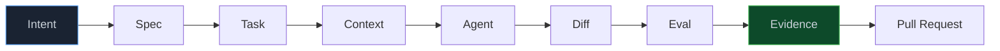
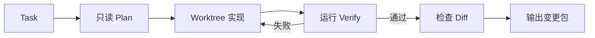
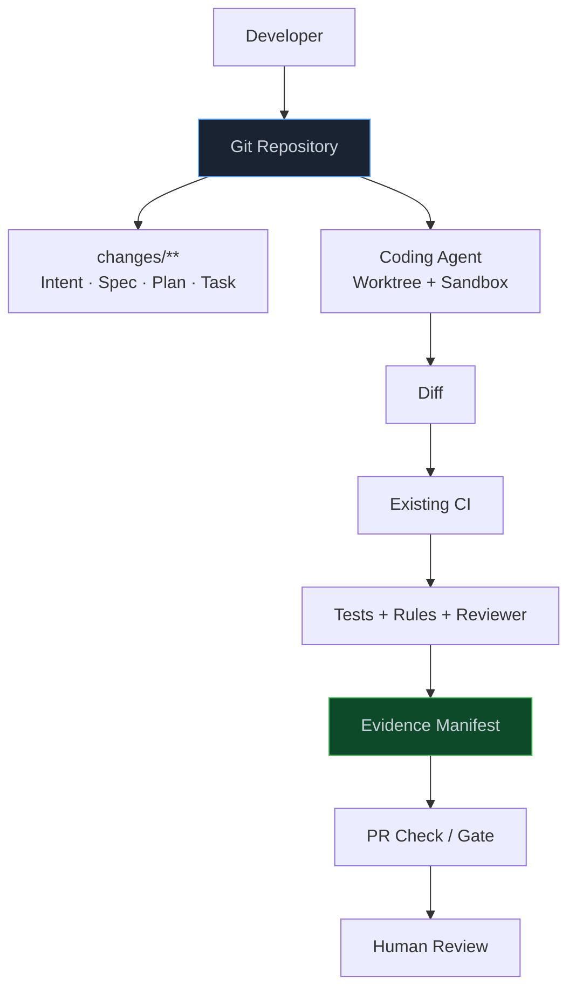
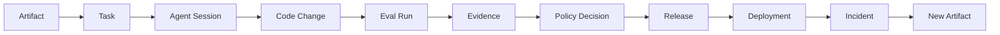
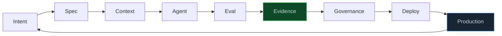

> **📖 系列难度说明**：本篇为**落地收官篇**，适合准备在个人项目、团队或企业里真正接入 AI Native 流程的读者。前半段今天就能照着做，后半段逐步进入平台架构与组织度量。
> **🎁 核心收获**：读完本篇你将拿到一条从单仓库试点到企业控制面的实施路线，知道第一版该做什么、该砍什么，以及怎样判断下一阶段是否值得投入。

读完前七篇，很容易画出这样一张采购清单：

```text
Artifact Store
Code Graph
Vector Database
Agent Runtime
MCP Gateway
Eval Platform
Evidence Engine
Policy Engine
Workflow Engine
OpenTelemetry
```

看着都重要，真要开工却有点头大。

于是团队开始讨论 Kafka 还是 NATS，Neo4j 还是 LadybugDB，Temporal 要不要上。三周过去，Agent 还在聊天窗口里改文件，研发流程一点没变。

问题不在技术选错了，而在起点错了。

AI Native 研发的第一版，不该是一套缩小后的“大平台”。它应该是一条窄窄的、但真的能跑完的闭环。

<!-- more -->

---

## 第一版只回答一个问题

先别问“平台应该有哪些模块”，问一个更实际的问题：

> **能不能让一类真实任务，从 Intent 出发，经过 Agent 实现和独立验证，最后带着 Evidence 进入 PR？**

这条链跑不通，微服务再齐也只是架构图。



第一版甚至不用自动发布。

人可以手工批准 Spec，手工启动 Agent，手工点击 Merge。只要每一步有明确输入和输出，下一步能读懂上一步留下的 Artifact，这条闭环就已经成立。

Anthropic 的 AI-Native SDLC Playbook 也把演进过程分得很清楚：开始时由人逐步触发，最终状态才是“一个被接受的 Artifact 自动启动下一阶段”。自动化是闭环成熟后的结果，不是开工前的门槛。

> 💡 **来源**：[The AI-Native SDLC playbook](https://claude.com/blog/the-ai-native-sdlc-playbook) — 每个阶段提交可读 Artifact，早期由人触发，成熟后再由 Artifact 和 Gate 自动驱动下一阶段

---

## 试点选错，后面全是噪声

不要拿“重写整个支付系统”做第一个任务，也别拿“改 README 一个错字”证明流程有效。

合适的试点通常有这些特征：

```text
业务边界清楚
改动涉及 3～10 个文件
验收结果能被测试或规则判断
有一两条容易漏掉的回归路径
失败可回滚，不直接影响生产核心数据
团队过去做过类似任务，能拿到基线
```

这也是前几篇一直使用“登录失败 5 次后锁定”作为例子的原因。

它不算玩具：会碰认证、Redis、并发和安全。范围又能控制住：只改密码登录，OAuth 明确排除。最关键的是，成功与失败都能写成 Acceptance Criteria。

可以给候选任务打个简单分：

| 维度 | 低分 | 高分 |
| ---- | ---- | ---- |
| 边界 | 涉及整个系统 | 单一业务能力 |
| 可验证性 | 靠主观判断 | 有稳定测试与指标 |
| 风险 | 不可逆生产变更 | 分支内可回滚 |
| 代表性 | 纯文本修改 | 接近团队日常开发 |
| 历史样本 | 从没做过 | 有人工交付基线 |

找一个“够真实、但炸不穿系统”的任务，就可以开始。

---

## 开工前先量一下现在有多慢

没有基线，三个月后很容易只剩一句：“大家感觉 Agent 挺好用。”

试点开始前，先从最近 10～20 个同类任务里记下：

```text
Lead Time
从需求确认到 PR Ready 花多久

Human Touch Time
人真正投入了多少时间

Rework Rate
PR 被打回几轮、返工多少次

Change Failure Rate
合并后产生回滚或事故的比例

Evidence Coverage
多少条 Acceptance Criteria 有当前版本证据

Cost per Accepted Change
模型、CI 和人工复核成本
```

别只看“生成代码用了几分钟”。

Agent 五分钟写完，工程师花两小时找漏测、补上下文、清理越界改动，这个任务并没有变快。AI Native 想优化的是从 Intent 到可信变更的总时间，不是打字速度。

基线不用建数据仓库。第一轮放在一张表里就够。等流程稳定，再接分析平台。

---

## 第 0 步：先把仓库修到 Agent 能工作

很多团队一上来接 Agent，结果它连项目怎么启动都要猜。

动 Agent 之前，仓库至少要过一遍“新同事测试”：

```text
这是个什么系统？
从哪里开始读？
怎么安装依赖？
怎么运行？
怎么验证改动？
哪些目录不能随便碰？
```

开一个全新会话，不给口头提示，只让 Agent 看仓库。如果这六个问题答不上来，问题不是 Prompt 不够长，而是仓库本身不够可读。

先补一份短地图：

```markdown
# AGENTS.md

## 这个仓库做什么
认证服务，负责密码登录、OAuth 与 Token 签发。

## 从哪里开始
- 密码登录：packages/auth/
- OAuth：packages/oauth/
- Redis 封装：packages/shared/redis/

## 怎么验证
- 单元测试：pnpm test
- 认证回归：pnpm test:auth
- OAuth 回归：pnpm test:oauth
- 静态检查：pnpm lint && pnpm typecheck

## 不可妥协的约束
- 不在业务包里创建新 Redis Client
- 不允许直接 Push main
- 认证变更必须跑 OAuth 回归
```

这份文件是地图，不是百科全书。架构设计、接口说明和运行手册放进 `docs/`，由地图按需指过去。

还要把验证命令收口。最好有一条 Agent 能直接跑的命令：

```bash
make verify-auth
```

它应该返回稳定退出码，而不是打印一屏“看起来没问题”的文字。

OpenAI 的 Harness Engineering 实践强调仓库是 system of record。Agent 看不到 Slack 讨论，也猜不到人脑里的约定。知识必须进入版本库，并且能被搜索、检查和更新。

> 💡 **来源**：[Harness engineering: leveraging Codex in an agent-first world](https://openai.com/index/harness-engineering/) — 用短 `AGENTS.md` 做地图，把仓库变成 Agent 可理解、可执行、可验证的事实源

---

## 先用目录把 Artifact 串起来

别急着建 Artifact Service。Git 本身就是一套现成的版本、权限和审计系统。

第一版可以直接用目录：

```text
repo/
├── AGENTS.md
├── docs/
│   ├── architecture/
│   └── runbooks/
├── changes/
│   └── AUTH-003/
│       ├── intent.md
│       ├── spec.md
│       ├── plan.md
│       ├── tasks.md
│       ├── evals/
│       │   ├── acceptance.yaml
│       │   └── regression.yaml
│       └── evidence/
│           └── manifest.json
└── src/
```

文件不需要很长，但 ID 要稳定。

`intent.md` 解释为什么做：

```yaml
id: INT-AUTH-003
problem: "密码登录缺少失败次数限制"
desired_outcome:
  - "降低暴力破解成功率"
  - "不影响 OAuth 登录"
owner: identity-team
```

`spec.md` 定义什么叫做对：

```yaml
id: SPEC-AUTH-003
version: 1
acceptance:
  - id: AC-001
    given: "同一账户连续输入错误密码"
    when: "第 5 次失败"
    then: "锁定密码登录 15 分钟"
  - id: AC-002
    given: "账户处于密码锁定状态"
    when: "使用 OAuth 登录"
    then: "OAuth 流程不受影响"
out_of_scope:
  - "修改 OAuth 协议实现"
```

`plan.md` 说明怎么改，`tasks.md` 再把计划拆成可执行工作项。Eval 引用 AC，Evidence 又引用 Eval、Commit 和 CI Run。

```text
INT-AUTH-003
  → SPEC-AUTH-003
    → TASK-AUTH-003-01
      → COMMIT abc123
        → EVAL-AUTH-003-AC002
          → EVD-CI-987
```

这条引用链就是最早的 Lineage。

GitHub Spec Kit 已经提供 `Spec → Plan → Tasks → Implement` 的现成流程，每一阶段产出 Markdown，再交给下一阶段。团队不想自己设计模板时，可以先拿它起步，而不是另造一套命令系统。

> 💡 **来源**：[GitHub Spec Kit](https://github.github.com/spec-kit/) — 用 `Spec → Plan → Tasks → Implement` 组织结构化 Artifact，并提供模板、检查清单与跨产物分析

---

## 第一个 Agent，只做一类任务

第一版别搭 Agent 军团。

一个 Coder Agent，加一组受控工具，已经够验证主链路：

```text
输入：
Task + Spec + Plan + Repository Map

工具：
read_file
search_code
code_graph_query（有就用）
write_worktree
run_verify_command
git_diff

输出：
Diff + Test Result + Change Summary
```

Agent 只在独立 worktree 里写。不能 Push main，不能碰生产，也不要把所有 Shell 命令一股脑放开。

运行循环可以非常朴素：



这一步最想验证的不是模型写得多漂亮，而是：

```text
它能不能找到正确代码
能不能遵守 out_of_scope
能不能在失败后自己修
能不能停在明确完成条件
输出能不能被下一步机器读取
```

如果单 Agent 连这条路都跑不稳，加 Orchestrator 和五个 Subagent 只会把问题复制五份。

---

## Code Graph 什么时候接

小仓库、文件命名清楚、调用链浅时，关键词和语义搜索可能已经够用。

出现这些信号，再把 Code Graph 提到优先级前面：

```text
Monorepo 跨包调用多
Agent 经常改到“名字像但不是入口”的文件
每次都要重复找调用者和测试
改动影响面靠资深工程师口述
仓库太大，探索消耗超过实现
```

第一版图谱也不用吞下所有工程对象。先解决三个高频查询：

```text
谁调用这个符号？
改它会影响哪些包和 API？
相关测试在哪里？
```

图数据可以只做本地索引，通过 CLI 或 MCP 暴露给 Agent。等索引更新、权限过滤和跨仓查询真的成为瓶颈，再独立成服务。

别因为架构图里有 Code Graph，就在两万行项目里先搭图数据库集群。

---

## Eval 要跟 Agent 同一天上线

很多试点的顺序是：

```text
先让 Agent 写代码
→ 效果不错
→ 扩到十个团队
→ 出了问题
→ 再补 Eval
```

这时已经很难说清楚“效果不错”到底指什么。

第一批 Task 就要带 Eval。数量不用多，先覆盖最容易被骗的地方：

```yaml
evals:
  - id: EVAL-AC-001
    type: functional
    command: "pnpm test:auth"
    proves:
      - AC-001

  - id: EVAL-AC-002
    type: regression
    command: "pnpm test:oauth"
    proves:
      - AC-002

  - id: EVAL-SCOPE-001
    type: change_scope
    rule: "changed_files excludes packages/oauth/**"
    proves:
      - SCOPE-001

  - id: EVAL-ARCH-001
    type: architecture
    rule: "new RedisClient count == 0"
    proves:
      - ARCH-001
```

能写成命令和规则的，先确定性执行。不要为了显得智能，让 LLM 判断单测是否通过。

Reviewer Agent 只处理程序暂时难判断的部分：

```text
实现是否偏离 Spec 意图
改动范围是否异常扩大
Plan 与 Diff 是否明显不一致
有没有可疑但未违反硬规则的设计
```

Reviewer 保持只读，也不继承 Coder 的整段聊天。它拿 Spec、Plan、Diff 和测试结果就够。

Anthropic 建议 Continuous Evals 从 20～50 个真实任务起步。这个数量适合 Agent 配置进入团队级使用之后。第一轮试点不必硬凑 50 条，但每做完一个真实任务，都应该留下可重复运行的检查。

> 💡 **来源**：[Continuous evals in CI](https://academy.claude.com/courses/ai-native-sdlc-playbook/continuous-evals-in-ci) — 从真实任务构建 Eval，在模型、Skills、Hooks 或仓库指令变化时重跑，生产事故永久留在回归套件

---

## Evidence 第一版就是一份 Manifest

Eval 跑完，别只把 PR 状态点绿。

生成一份机器可读的 Evidence Manifest：

```json
{
  "evidence_id": "EVD-AUTH-003-001",
  "spec": {
    "id": "SPEC-AUTH-003",
    "version": 1
  },
  "commit": "abc123",
  "environment": {
    "runner": "github-actions",
    "node": "22.x"
  },
  "results": [
    {
      "eval": "EVAL-AC-001",
      "status": "passed",
      "artifact": "auth-test.xml"
    },
    {
      "eval": "EVAL-AC-002",
      "status": "passed",
      "artifact": "oauth-test.xml"
    },
    {
      "eval": "EVAL-SCOPE-001",
      "status": "passed",
      "artifact": "changed-files.json"
    }
  ],
  "coverage": {
    "acceptance": "2/2",
    "required": "100%"
  },
  "created_at": "2026-09-21T08:20:00Z"
}
```

原始测试报告放 CI Artifact 或对象存储，Manifest 只保留索引和来源。

PR 页面再展示一份给人看的摘要：

```markdown
## Change Evidence

- Spec: SPEC-AUTH-003 v1
- Commit: abc123
- Acceptance Evidence: 2/2
- OAuth Regression: PASS
- Out-of-scope Changes: 0
- Architecture Rules: PASS
```

到这里，第 05 篇的 Evidence Engine 还不需要单独部署。CI 生成 Manifest，GitHub Check 展示 Gate，已经能支撑试点。

---

## Policy 先写成几条硬规则

治理也不用等企业 IAM 平台。

第一版先守住几条底线：

```text
Agent 只能写 worktree
主分支必须走 PR
关键 Eval 缺失时默认不通过
out_of_scope 出现改动直接 BLOCK
Agent 不能读取生产密钥
生产部署继续由现有审批流程负责
```

把规则放进 CI、分支保护和 Agent Hook。不要只写在 Prompt 里提醒。

```yaml
gate:
  hard_rules:
    - acceptance_evidence == 100%
    - oauth_regression == passed
    - out_of_scope_changes == 0
    - critical_security_findings == 0

  decisions:
    all_passed: PASS
    evidence_missing: GATHER_EVIDENCE
    rule_failed: BLOCK
```

如果使用 GitHub Agentic Workflows，可以复用它的只读默认、沙箱和 Safe Outputs。Agent 提议创建 Issue 或 PR，单独的受信 Job 再执行写操作。Secrets 不必直接进 Agent Runtime。

> 💡 **来源**：[About GitHub Agentic Workflows](https://docs.github.com/en/copilot/concepts/agents/about-github-agentic-workflows) — Agent 默认只读并运行在隔离环境，写操作经声明式 Safe Outputs 和独立权限 Job 执行

---

## 一套不用造平台的最小架构

把上面的东西放在一起，第一版可能只有这些现成组件：



对应的技术清单很短：

```text
已有 Git 仓库
Markdown / YAML / JSON
一个 Coding Agent
Worktree 或容器沙箱
现有 CI
现有测试框架
CI Artifact Storage
分支保护
```

PostgreSQL、Kafka、Temporal、向量库、图数据库，一个都不是第一天的硬要求。

这不代表它们没用。只是眼下最难的问题还不是“系统扛不住并发”，而是“Artifact、Eval 和 Gate 到底应该长什么样”。

先用文件跑出正确模型，再把稳定部分服务化。比拿一张未经验证的领域模型直接拆 14 个微服务稳得多。

---

## 什么时候才值得做平台

文件方案跑一阵，会开始出现真实摩擦：

```text
跨仓库找不到同一个 Spec 的所有变更
Evidence 太多，PR 页面装不下
Agent Session 需要统一排队和恢复
不同团队各写一套 Policy
Code Graph 索引权限和更新难管理
MCP Server 越接越多，凭证散落
需要看组织级成本与质量趋势
```

这些才是平台化信号。

平台第一阶段可以保持模块化单体，不必直接微服务：

```text
R&D Platform Backend
├── Project
├── Artifact
├── Workflow
├── Agent
├── Context
├── Eval
├── Evidence
├── Governance
└── Integration
```

数据库也先克制：

```text
PostgreSQL
  Artifact、状态、Lineage、Policy、Agent Session

Object Storage
  测试报告、截图、日志片段、大型 Evidence

Redis
  短期状态、队列、锁

Code Graph Store
  符号、调用、依赖、测试映射
```

只有工作流真的长到跨天、需要恢复、补偿和人工 Gate，再考虑 Temporal 一类引擎。只有事件量和消费方真的上来，再引入 NATS 或 Kafka。

别把“未来可能需要”翻译成“今天必须部署”。

---

## 平台最先稳定的不是 UI，是数据模型

想从文件升级成服务，先固定几类核心对象：

```text
Project
Artifact
ArtifactVersion
Task
AgentSession
CodeChange
EvalRun
Evidence
PolicyDecision
Release
Deployment
Incident
```

它们靠稳定 ID 和关系连接：



状态机也要先说清楚。

```text
DRAFT
→ REVIEW
→ APPROVED
→ EXECUTING
→ EVALUATING
→ READY
→ RELEASED
```

失败不是统一的 `FAILED`：

```text
ITERATE          实现不满足标准，回到 Agent
CLARIFY          需求有歧义，回到 Spec
GATHER_EVIDENCE  缺少事实，补跑验证
BLOCK            违反硬规则，停止推进
```

如果对象、关系和状态还说不清，先别急着做漂亮的 Web 控制台。UI 只会把混乱展示得更整齐。

---

## 30 天：跑通一个仓库

前 30 天不追求规模，只追求一条链稳定。

### 第 1 周：修仓库

```text
选一个仓库和一种任务
记录人工交付基线
补 AGENTS.md
收口 build / test / lint 命令
建立 worktree 和分支保护
```

验收标准很简单：全新 Agent Session 能回答项目怎么运行、改完怎么验证、哪些目录不能碰。

### 第 2 周：建 Artifact

```text
建立 intent / spec / plan / task 模板
给 Acceptance Criteria 稳定 ID
选 3 个历史任务回填
让团队手工走一遍评审
```

这周先不自动写代码。模板在人和 Agent 之间都读不顺，自动化只会放大歧义。

### 第 3 周：接 Agent

```text
一个 Coder Agent
一个隔离 worktree
只开放必要工具
失败自动重试但限制轮次和预算
输出 Diff、测试结果和变更摘要
```

找 3～5 个真实任务跑。每次 Agent 卡住，都记录缺的是文档、工具、上下文还是验证命令。

### 第 4 周：接 Eval 与 Evidence

```text
Acceptance Criteria 映射 Eval
CI 生成 Evidence Manifest
Reviewer Agent 保持只读
分支保护接入硬规则 Gate
对比人工基线
```

30 天结束时，应该能拿出一个真实 PR，回答：

```text
为什么改
改了什么
哪些地方不该改
如何验证
证据在哪
谁批准
花了多少时间和成本
```

答不全就继续补这条链，不急着扩仓库。

---

## 60 天：让流程可重复

第 31～60 天，目标从“跑通一次”变成“每次都能这样跑”。

```text
扩大到 20～50 个真实 Eval
给 Agent 配置变化加回归
接入 Code Graph 或影响分析
把重复上下文沉淀进文档和 Skill
把不可妥协规则搬进 Hook / CI
统一 Evidence Schema
加入 Agent Session、Tool 和成本遥测
```

这时才开始区分角色：

```text
Planner   只读 Spec 和仓库，生成 Plan
Coder     写 worktree，跑验证
Reviewer  只读 Diff 和 Evidence
```

仍然不必追求复杂多 Agent。角色拆分是为了职责和权限，不是为了让架构看起来先进。

60 天时，可以考虑第二个仓库，但要选相似技术栈和相近流程。一下跨到完全不同的移动端、数据平台和嵌入式项目，很难判断失败来自平台还是领域差异。

---

## 90 天：接入治理与生产反馈

第 61～90 天，才把边界扩到组织和生产。

```text
Agent 使用独立身份与短期凭证
MCP 工具进入统一 Registry 和 Gateway
Policy 支持 Allow / Ask / Block
Evidence Gate 与现有发布流程连接
Deployment 带 Release、Commit、Task 标识
生产告警自动附带诊断上下文
SRE Agent 只读分析，输出 Incident / Intent
重大事故进入永久 Eval
```

生产写权限不要因为到了第 90 天就自动开放。

更合理的终点是：

> 告警无需人手工启动调查，Agent 能把证据准备好；到了回滚、迁移和生产发布这些门口，人仍能做清楚的判断。

90 天后再看数据，决定是扩大任务类型、扩大仓库，还是先修当前闭环。

---

## 三种团队，不用走成同一个样子

个人项目或三五人团队，Git 就可以承担绝大多数控制面：

```text
Markdown Artifact
AGENTS.md
Coding Agent
Worktree
GitHub Actions
PR Template + Evidence Manifest
Branch Protection
```

二三十人的产品团队会需要共享能力：

```text
统一 Artifact 模板
Code Graph
Agent 任务队列
Eval Registry
Evidence Dashboard
MCP Tool Registry
团队级 Policy
```

到了多业务线企业，问题才真正变成平台治理：

```text
跨仓 Lineage
Agent Identity
RBAC + ABAC
多租户数据隔离
统一 Model / MCP Gateway
审计与合规
成本配额
生产反馈和组织级度量
```

这不是按人数硬切。只要权限、合规或跨仓关系提前变复杂，就要提前补相应能力。反过来，五百人的公司也没必要把一个试验仓库直接接进全套企业平台。

---

## 哪些直接用，哪些值得自己做

第一版尽量“组装”，不要“发明”。

| 能力 | 先用现成方案 | 什么时候自研 |
| ---- | ------------ | ------------ |
| Spec 流程 | Spec Kit、Kiro、仓库模板 | 组织有独特 Artifact 与审批模型 |
| Coding Agent | Claude Code、Codex、Copilot、Cursor | 通常不自研模型与基础 Loop |
| CI/CD | GitHub Actions、GitLab CI、Jenkins | 已有平台不支持所需 Gate |
| 沙箱 | Worktree、容器、平台沙箱 | 多租户隔离有特殊要求 |
| Observability | OpenTelemetry + 现有后端 | 只扩展研发领域属性 |
| Policy | 分支保护、CI 规则、Hooks | 规则跨工具、跨环境、动态授权 |
| Code Graph | 本地索引、现成 MCP | 大型 Monorepo、跨仓与权限查询 |
| Evidence | CI Artifact + Manifest | 需要跨版本 Lineage 与企业审计 |

最值得自己沉淀的，往往不是模型调用代码，而是这些组织资产：

```text
Artifact Schema
仓库地图和工程约束
真实 Eval Suite
Evidence Lineage
风险 Policy
Code / Runtime / Ownership Graph
生产事故形成的回归知识
```

模型会换，Agent 产品也会换。这些资产留在组织里，迁移成本才可控。

---

## 别用“生成了多少代码”衡量成功

平台上线后，很容易汇报：

```text
Agent 生成 120 万行代码
开了 3000 个 PR
节省 8000 小时
```

数字很大，但不一定代表研发变好了。

更可靠的指标分四组。

**流动效率**

```text
Intent → PR Ready 时间
等待 Gate 的时间
每个 Agent Session 的完成率
人工接管前的平均步骤
```

**变更质量**

```text
一次通过率
返工轮次
Change Failure Rate
生产回滚率
逃逸缺陷
```

**证据与治理**

```text
Acceptance Evidence Coverage
过期 Evidence 比例
越界改动拦截数
高风险动作人工审批率
无法归因的 Agent 行动数
```

**经济性**

```text
Cost per Accepted Change
每个合并 PR 的 Token 与 CI 成本
Human Touch Time
Agent 失败任务的浪费成本
```

真正值得关注的不是 Agent 做了多少，而是团队用更少的人类等待和返工，交付了多少可信变更。

---

## 最常见的五条弯路

### 一上来建全套平台

十四个服务、三种数据库、一个自研 Workflow Engine。半年后还没有一条真实 Artifact 链。

先用文件和 CI 跑通领域模型。稳定后再服务化。

### 把聊天记录当 Artifact

对话里什么都有，却没有稳定 ID、版本和状态。下一阶段只能继续读整段聊天。

把决定写回 Spec、Plan、Task 和 Evidence。聊天是过程，不是事实源。

### 先扩 Agent，后补 Eval

生成速度上来了，质量问题也一起放大。团队只能靠更多人 Review 抵消。

第一类任务、第一天，就要有对应 Eval。

### 所有问题都用 LLM 判断

测试退出码、文件是否越界、依赖是否新增，本来都能确定性计算。交给模型反而贵且不稳定。

让程序检查规则，让 Agent 处理模糊判断。

### 把人的权限原样交给 Agent

共享 Token 省事，审计和损害范围也一起失控。

独立身份、短期凭证、任务范围和 Safe Outputs 要随着自动化一起增长。

---

## 平台团队的工作也会变

过去，研发平台常把重心放在流水线和自助页面：

```text
给人一个按钮
→ 人选择参数
→ 系统执行固定流程
```

Agent 进来后，平台还得提供另一种接口：

```text
给 Agent 可读的 Context
给 Agent 可调用的 Tool
给 Agent 可理解的错误
给 Agent 不可绕过的 Policy
给人可判断的 Evidence
```

错误信息尤其容易被忽略。

```text
Permission denied
```

对人不友好，对 Agent 也没法行动。

```text
BLOCKED by POLICY-OAUTH-002
Reason: packages/oauth/** is outside TASK-AUTH-003 scope
Next: update Spec scope and request Security Owner approval
```

这样的错误才会推动下一步。

工程师也不只是“少写代码”。新的高价值工作会转向：

```text
把模糊问题写成可执行 Intent
把验收标准写成 Eval
把隐性知识放回仓库
设计工具与权限边界
从 Agent 失败里修 Harness
从生产事故里补永久能力
```

人没有离开研发流程，只是从逐行操作，走向设计环境和做关键判断。

---

## 用登录限制验收整套最小闭环

系列走到最后，再把这条任务从头跑一遍。

### Intent

业务希望降低密码暴力破解风险，同时不增加正常用户登录阻力。

### Spec

连续失败 5 次锁定 15 分钟；OAuth 不受影响；错误响应不得泄漏账户是否存在。

### Context

`AGENTS.md` 指向认证入口。Code Graph 标出 `AuthService`、`LockService`、共享的 `TokenService` 和 OAuth 回归测试。

### Plan 与 Task

Plan 设计 Redis 计数和锁状态。Task 按依赖拆分，`packages/oauth/**` 明确排除。

### Agent Runtime

Coder 在 worktree 实现，运行 `make verify-auth`，失败后自修，最后输出 Diff。

### Eval

功能、OAuth 回归、并发、架构依赖、变更范围和安全检查分别执行。

### Evidence

每条 Acceptance Criteria 关联当前 Commit 的测试报告和来源。缺一条就返回 `GATHER_EVIDENCE`。

### Governance

Agent 只能创建 PR 意图，不能 Push main。认证变更需要 Code Owner 与 Security Owner 批准。

### Production

Deployment 带 Release、Commit 和 Task 标识。Control Band 发现 OAuth 成功率异常时，只读 SRE Agent 自动诊断，形成 Incident 和新 Intent。

### Learning

事故场景进入永久 Eval，`AGENTS.md`、Runbook、Policy 和 Code Graph 关系一起更新。



这条环能稳定转一圈，AI Native 研发就不再是概念。

---

## 最后的验收清单

如果准备下周启动试点，可以直接对照这份清单：

### 任务

- [ ] 选定一种边界清楚、可验证、可回滚的真实任务
- [ ] 收集 10～20 个历史任务作为人工基线
- [ ] 明确一个业务 Owner 和一个工程 Owner

### 仓库

- [ ] `AGENTS.md` / `CLAUDE.md` 能回答怎么运行、怎么验证、哪里不能改
- [ ] 构建、测试、Lint 有稳定命令和退出码
- [ ] Agent 使用 worktree 或沙箱
- [ ] 主分支有分支保护

### Artifact

- [ ] Intent、Spec、Plan、Task 有模板
- [ ] Acceptance Criteria 有稳定 ID
- [ ] Artifact 进入 Git 并保留版本
- [ ] Task、Commit、Eval、Evidence 能互相引用

### Agent

- [ ] 第一版只处理一种任务
- [ ] 工具按最小权限开放
- [ ] 有轮次、时间和成本上限
- [ ] 完成条件包含验证命令和 Diff 自检

### Eval 与 Evidence

- [ ] 每条关键 AC 有对应 Eval
- [ ] Coder 与 Reviewer 职责分开
- [ ] Evidence 绑定 Spec 版本、Commit、环境和原始报告
- [ ] 缺证据时默认不通过

### Governance

- [ ] Agent 没有直达 main 和生产的路径
- [ ] 硬规则在 Hook、CI 或 Policy 中执行
- [ ] 高风险动作知道找谁批准
- [ ] Agent 行动可归因、可审计

### 度量

- [ ] 记录 Lead Time 和 Human Touch Time
- [ ] 记录返工、回滚和逃逸缺陷
- [ ] 记录 Evidence Coverage
- [ ] 记录每个可信变更的模型与 CI 成本

如果这份清单一次勾不完，很正常。先把“任务、仓库、Artifact、Agent、Eval”五块跑起来，已经足够开始。

---

## 📝 系列总结

这套流程写了九篇，最后可以压成九句话：

```text
第 00 篇：代码变快后，瓶颈转移到了代码之外
第 01 篇：7 层架构给 Agent 一个完整研发系统
第 02 篇：Artifact 把人的意图变成机器可执行的链
第 03 篇：Context 决定 Agent 能不能找到正确位置
第 04 篇：Harness 让 Agent 不只写代码，还能把任务做完
第 05 篇：Eval 判断任务是否做对，Evidence 说明凭什么
第 06 篇：Governance 决定 Agent 可以在哪些边界内行动
第 07 篇：Production 把真实事实送回 Intent 和 Eval
第 08 篇：落地从一条最小闭环开始，不从一座大平台开始
```

AI Native SDLC 不是把 Jira 接上一个模型，也不是让 Agent 自动写更多代码。

它真正改变的是研发系统的接口：

```text
每个阶段都产出下一阶段可读的 Artifact
每次行动都发生在明确 Context 和 Policy 内
每次变更都用 Eval 检查
每个结论都能追到 Evidence
每次生产反馈都能回到新的 Intent
```

模型会继续变强，今天的工具名字也会过时。但这条主线不会轻易变化：

> **人负责定义意图、边界和判断标准；Agent 在可验证的环境里执行；系统用证据决定下一步。**

真要开始，不用等平台预算，也不用等所有人想明白。

选一个仓库，挑一个真实任务，写下第一份 `intent.md`。然后让这条链先转一圈。

---

> 📚 **系列完整导航**
>
> - 第 00 篇：代码不再是瓶颈，那瓶颈在哪？
> - 第 01 篇：7 层架构——AI Native 研发平台的骨架
> - 第 02 篇：产物链路——从 Intent 到 Evidence 的完整链条
> - 第 03 篇：上下文工程——让 Agent 真正理解你的代码库
> - 第 04 篇：Agent 运行时——一个任务怎么被 Agent 完整执行
> - 第 05 篇：持续验证——从 Test 到 Eval 到 Evidence
> - 第 06 篇：治理与边界——Agent 能做什么，不能做什么
> - 第 07 篇：生产闭环——线上数据怎么反馈回研发流程
> - **第 08 篇：落地方案——从 0 到 1 搭建 AI Native 研发平台** ⬅️ 你在这里
