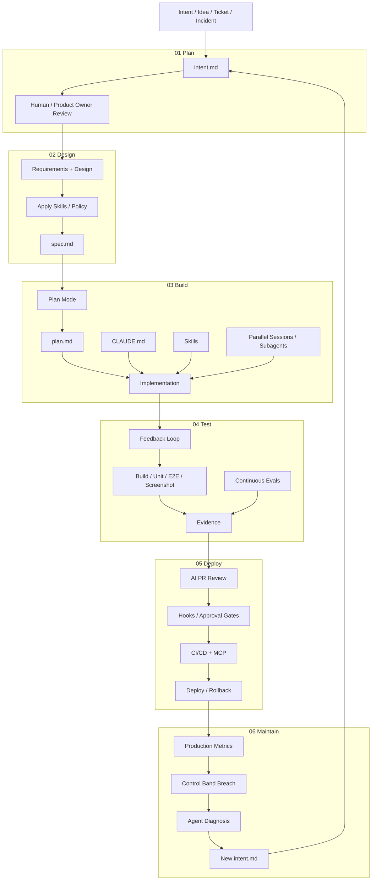
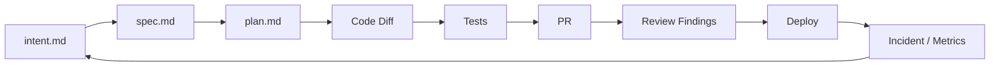
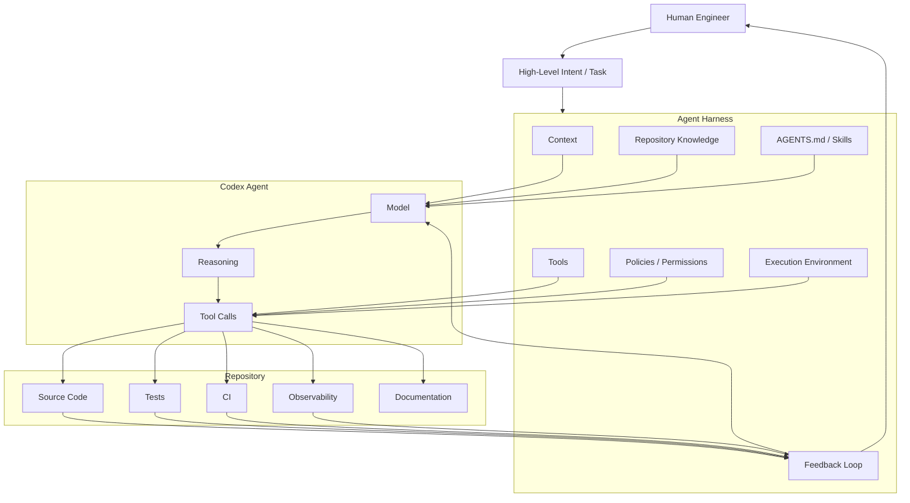
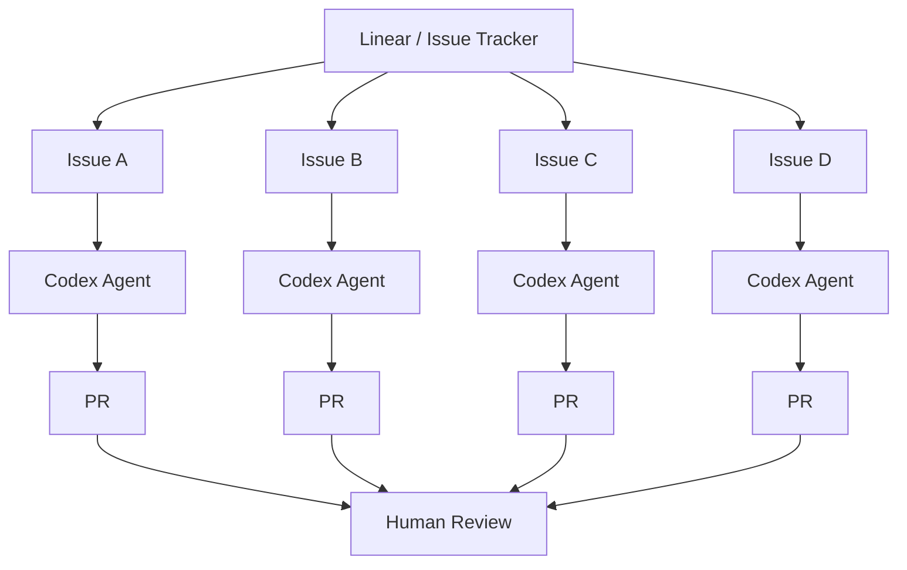
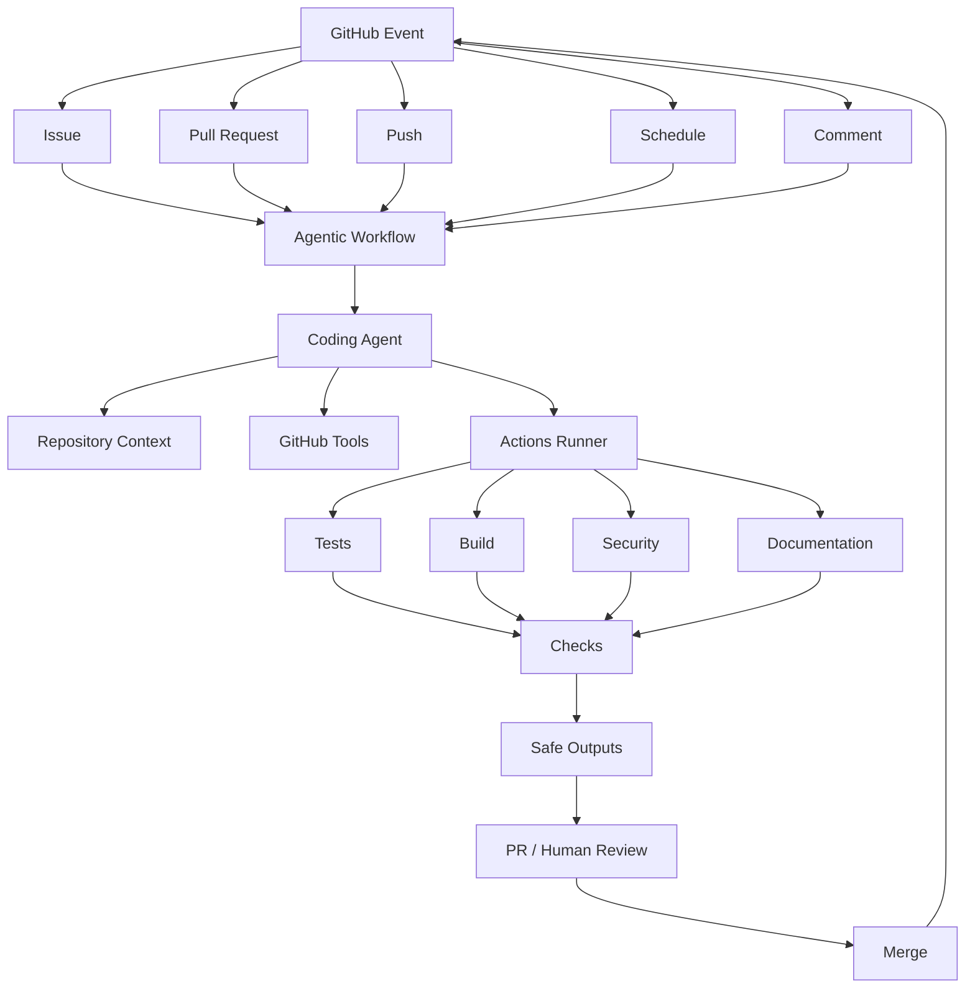
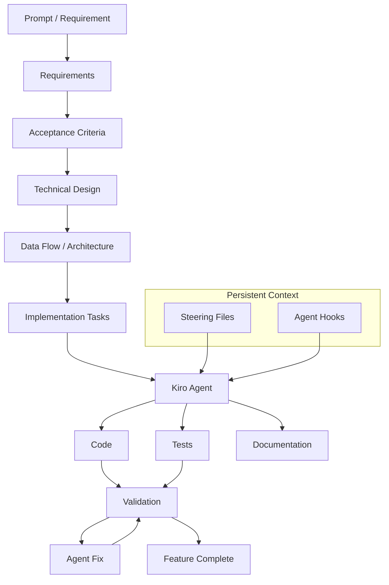
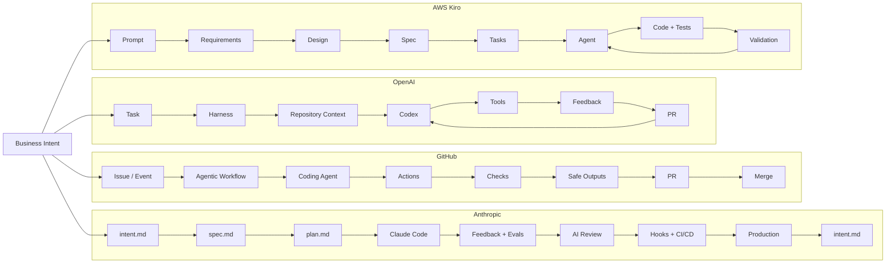
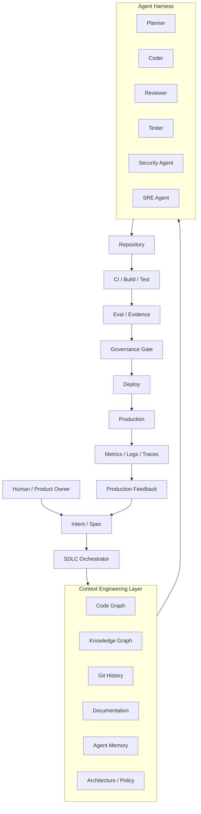

可以。这次我会把四家的方案拆成**同一套 SDLC 坐标系**来比较，而不是简单比较产品功能。

先给一个关键判断：

> **Anthropic 讲的是“怎么重构整个 SDLC”；OpenAI 讲的是“怎么把 Agent 变成可靠工程师”；GitHub 讲的是“怎么把 Agent 嵌入软件交付控制面”；AWS Kiro 讲的是“怎么用 Spec 把需求变成可执行工程任务”。**
>
> 所以四者并不是完全同一层面的竞争关系，而是分别解决 **Process / Runtime / Control Plane / Specification** 四个核心问题。

下面基于截至 **2026-08-31** 的官方资料进行拆解。Anthropic 的 Playbook 明确把完整生命周期分成 Plan、Design、Build、Test、Deploy、Maintain 六个阶段；OpenAI 的 Harness 则重点讨论 Agent 环境、仓库知识、反馈循环和自主程度；GitHub Agentic Workflows 已进入 public preview，把 Agent 放进 GitHub Actions；Kiro 则以 Spec-driven coding 为核心。([Claude][1])

---

# 一、先看四家的定位

| 维度          | Anthropic                      | OpenAI                                    | GitHub                                  | AWS Kiro                  |
| ------------- | ------------------------------ | ----------------------------------------- | --------------------------------------- | ------------------------- |
| 核心对象      | **整个 SDLC**            | **Agent Runtime / Harness**         | **Repository / CI Control Plane** | **Spec → Code**    |
| 核心思想      | AI-Native SDLC                 | Humans steer, Agents execute              | Agentic Workflow                        | Spec-Driven Development   |
| 起点          | Intent                         | Engineer / Task                           | Issue / Event                           | Prompt / Requirement      |
| 核心 Artifact | intent/spec/plan/diff/evidence | Repo knowledge / AGENTS.md / code / tests | Issue/PR/Actions artifacts              | Requirements/Design/Tasks |
| Agent         | Claude Code + Subagents        | Codex                                     | Copilot Coding Agent                    | Kiro Agents               |
| Context       | CLAUDE.md + Skills             | Repo as system of record                  | GitHub Repo + Agent instructions        | Steering + Specs          |
| Test          | Feedback Loop + Evals          | Automated feedback                        | Actions / Checks                        | Tests + validation        |
| Review        | AI Review + Human Gate         | Agent-to-Agent Review                     | PR / Checks / Agentic workflows         | Human / Agent iteration   |
| Deploy        | Agent + MCP + Hooks            | Harness / tooling                         | GitHub Actions                          | AWS ecosystem             |
| Production    | **闭环回 Intent**        | Agent持续迭代                             | Actions / Issues / Events               | 更偏开发阶段              |
| Governance    | **非常完整**             | Harness内建                               | **非常强**                        | Spec + hooks              |
| 最大创新      | **重构 SDLC**            | **重构 Agent 工作环境**             | **Agent 化 GitHub**               | **Spec 化研发**     |

所以如果要做一个企业级 AI Native R&D Platform：

```text
Anthropic
    ↓
Process Model

OpenAI
    ↓
Agent Runtime / Harness

GitHub
    ↓
Engineering Control Plane

AWS Kiro
    ↓
Specification Layer
```

这四个其实是可以组合起来的。

---

# 二、Anthropic：完整的 AI-Native SDLC

Anthropic 的 Playbook 是四个方案里**最接近“研发流程重构蓝图”**的。

官方把 SDLC 定义为：

```text
Plan
 ↓
Design
 ↓
Build
 ↓
Test
 ↓
Deploy
 ↓
Maintain
 ↺
```

而且每个阶段结束都产生一个可以被下一阶段读取的 committed artifact；例如 `intent.md → spec.md → plan.md → diff/tests → PR/review → incident`。([Claude][1])

## Anthropic 完整 Mermaid



这个图里面最重要的不是六个阶段，而是：

```text
Production
    ↓
intent.md
    ↓
Plan
    ↓
Design
    ↓
Build
    ↓
Test
    ↓
Deploy
    ↓
Production
```

即：

> **SDLC 从 Pipeline 变成 Feedback Loop。**

Anthropic 明确提出 production control-band 触发后，Agent 可以诊断并将结果重新写成 `intent.md`，重新进入整个研发流程。([Claude][1])

---

# 三、Anthropic 的 12 个核心 Play 怎么拆

如果把 Playbook 中的核心能力归并成 12 个核心 Play，我建议这样理解：

| Stage    | Play                             | 核心作用             |
| -------- | -------------------------------- | -------------------- |
| Plan     | ①`intent.md`                  | Intent 标准化        |
| Design   | ② Requirements + Design         | Intent → Spec       |
| Build    | ③ Plan Mode                     | 先规划后编码         |
| Build    | ④`CLAUDE.md`                  | Repo Context         |
| Build    | ⑤ Skills                        | 组织知识产品化       |
| Build    | ⑥ Parallel Sessions / Subagents | 并行 Agent           |
| Test     | ⑦ Feedback Loop                 | Agent 自验证         |
| Test     | ⑧ Continuous Evals              | Agent 回归测试       |
| Deploy   | ⑨ AI PR Review                  | Agent Review         |
| Deploy   | ⑩ Hooks / Approval Gates        | Agent Governance     |
| Deploy   | ⑪ CI/CD + MCP                   | Agent 执行交付       |
| Maintain | ⑫ Closing the Loop              | Production → Intent |

这里特别需要说明：Anthropic 页面还进一步介绍了 recurring security scans、Claude on-call 等能力，但它们更像 Maintain 阶段的扩展实践，而不是我上面归纳的 12 个主 Play。官方 Playbook 本身将六阶段作为生命周期主框架。([Claude][1])

---

# 四、Anthropic 最值得借鉴的其实是 Artifact Chain

Anthropic 的真正创新，我认为不是 Claude Code，而是：



这意味着：

> **研发流程的中间状态全部变成可版本控制的 Artifact。**

官方明确把这些 artifact 作为 audit trail：谁提出了什么、Agent 做了什么、谁批准了什么，都进入 Git 历史。([Claude][1])

这点对你之前研究的 **Spec + Code Graph + AI研发平台** 非常重要。

---

# 五、OpenAI：完全不同——核心是 Harness

OpenAI 不像 Anthropic 那样给你一个完整的 SDLC Playbook。

它研究的是：

> **如果 Agent 真正承担大量软件开发工作，研发环境本身应该长什么样？**

OpenAI 的 Harness Engineering 实验非常激进：

* 从空 Git Repository 开始
* Codex 生成代码、测试、CI、文档、Observability 等
* 人类不直接写代码
* 人类负责设计环境、指定意图、建立反馈机制
* Agent 之间进行 Review
* 人类主要负责 Steering 和高层判断

OpenAI 官方称其核心原则：

> **Humans steer. Agents execute.**

并报告该实验中约 1,500 个 PR、约百万行代码，团队从 3 人扩展到 7 人。([OpenAI][2])

---

# 六、OpenAI Harness Mermaid



这个架构和 Anthropic 最大的区别：

### Anthropic

```text
SDLC
 ↓
Agent
```

### OpenAI

```text
Agent
 ↓
Harness
 ↓
Environment
```

OpenAI 明确发现，早期问题并不是 Codex “不会写代码”，而是：

> **Environment was underspecified.**

也就是 Agent 缺少：

* 工具
* 抽象
* 内部结构
* Repository Knowledge
* Feedback

所以工程师的主要工作变成了：

> **让环境对 Agent 可理解、可执行、可验证。** ([OpenAI][2])

---

# 七、OpenAI 的第二阶段：Symphony

这里其实比 Harness 更值得你关注。

OpenAI 后来发现：

```text
一个人
 ↓
3~5 个 Agent Session
 ↓
Context Switching
 ↓
Human Attention 成瓶颈
```

于是做了 **Symphony**。

它把：

> Issue Tracker

直接变成：

> Agent Control Plane。



OpenAI 的结论非常关键：

> **不要让 Human 管理 Agent Session，而应该让 Agent 从 Work Queue 自动领取任务。**

Symphony 的定位就是把 Linear 这类项目管理系统变成 Agent 的控制面，并让每个开放任务拥有一个 Agent workspace；Agent 崩溃或停滞时可以重新启动。([OpenAI][3])

这实际上已经从：

```text
Agent Coding
```

进入：

```text
Agent Workforce Management
```

---

# 八、GitHub：核心不是 Agent，而是 Control Plane

GitHub 的思路完全不同。

它本身已经拥有：

```text
Repository
Issue
PR
Review
Actions
Security
Package
Release
```

所以它的目标是：

> **让 Agent 成为 GitHub Workflow 的一个原生执行者。**

---

# 九、GitHub Agentic Workflow Mermaid



GitHub Agentic Workflows 的一个关键设计是：

> **自然语言 Markdown → 编译成标准 GitHub Actions YAML。**

也就是说：

```text
Human
 ↓
Natural Language Workflow
 ↓
Compiler
 ↓
GitHub Actions
 ↓
Agent
```

而不是：

```text
Human
 ↓
写复杂 YAML
```

GitHub Agentic Workflows 已在 2026 年 6 月进入 public preview，可处理 issue triage、CI failure analysis、documentation updates 等 reasoning-heavy tasks。([The GitHub Blog][4])

---

# 十、GitHub 的最大优势：Security / Governance

这点 GitHub 比很多 Coding Agent 平台成熟。

Agentic Workflow 默认具有多层控制：

```text
Agent
 ↓
Read-only permissions
 ↓
Sandbox
 ↓
Agent Workflow Firewall
 ↓
Safe Outputs
 ↓
Threat Detection
 ↓
Apply Changes
```

官方明确说明：

* 默认 read-only
* sandbox container
* Firewall
* Safe Outputs
* Threat Detection

组合起来控制 Agent 的行为。([The GitHub Blog][4])

所以 GitHub 的思想可以总结成：

> **Agent 不需要拥有整个 Repository 的无限权力。**

而是：

```text
Agent Capability
        ↓
Permission
        ↓
Sandbox
        ↓
Validation
        ↓
Safe Output
        ↓
Human / Policy Gate
```

这对企业落地非常重要。

---

# 十一、AWS Kiro：核心是 Spec

Kiro 和 Anthropic 最容易被混淆。

实际上它们的重点不一样。

Kiro：

> **先把需求变成结构化 Spec，再让 Agent 实现。**

AWS 官方定义非常明确：

> Prompt → detailed specs → working code, docs, tests。

并且 Kiro 提供：

* Spec
* Design
* Tasks
* Agent Hooks
* Steering Files
* Tests
* Documentation

([Amazon Web Services, Inc.][5])

---

# 十二、Kiro Mermaid



Kiro 的 Spec-driven coding 本质是：

```text
Requirement
     ↓
Specification
     ↓
Design
     ↓
Task
     ↓
Code
     ↓
Test
```

官方文档也明确说明 Spec 是一种 structured artifact，用来把高层想法转成详细 implementation plan，并提供 tracking/accountability。([Amazon Web Services, Inc.][5])

---

# 十三、Kiro 与 Anthropic 最大区别

非常值得注意。

### Anthropic

```text
Intent
 ↓
Spec
 ↓
Plan
 ↓
Agent
 ↓
Eval
 ↓
Review
 ↓
Deploy
 ↓
Production
 ↓
Intent
```

### Kiro

```text
Requirement
 ↓
Spec
 ↓
Design
 ↓
Tasks
 ↓
Agent
 ↓
Code
 ↓
Test
```

所以：

> **Kiro 更像“AI-Native Development Workflow”。**

而：

> **Anthropic 更像“AI-Native SDLC”。**

Kiro 官方现在甚至直接使用：

> **Agentic Engineering**

而不再只强调 AI coding。([Kiro][6])

---

# 十四、四家放在一张 Mermaid 里面

这是我认为最有价值的一张对比图。



这张图非常直观地说明了四家的**核心关注点不同**。

---

# 十五、按 SDLC 每一个阶段横向比较

现在把四家拉到同一条时间线上：

| SDLC                   | Anthropic                  | OpenAI                          | GitHub                           | Kiro             |
| ---------------------- | -------------------------- | ------------------------------- | -------------------------------- | ---------------- |
| **Intent**       | `intent.md`              | Engineer Intent                 | Issue                            | Prompt           |
| **Requirements** | AI Requirements            | Harness Context                 | Issue Context                    | Requirements     |
| **Design**       | AI Design                  | Agent-readable architecture     | Repo / PR                        | Technical Design |
| **Plan**         | `plan.md`                | Agent planning                  | Agent task execution             | Tasks            |
| **Context**      | CLAUDE.md + Skills         | **Repo System of Record** | Repo + Instructions              | Steering         |
| **Build**        | Claude Code                | Codex                           | Coding Agent                     | Kiro Agent       |
| **Parallelism**  | Sessions + Subagents       | 多 Codex + Symphony             | 多 Agent / Workflows             | Parallel Agents  |
| **Test**         | Feedback Loop              | Automated feedback              | Actions                          | Tests            |
| **Eval**         | **Continuous Evals** | Feedback loops                  | Checks                           | Validation       |
| **Review**       | **AI Review**        | Agent-to-Agent                  | PR Review                        | Review           |
| **Security**     | Skills + Hooks + Scans     | Harness Controls                | **Firewall / Safe Output** | Policies / Hooks |
| **CI**           | Agent inside CI            | Agent Runtime                   | **GitHub Actions**         | CI integration   |
| **Deploy**       | MCP + Hooks                | Tool execution                  | Actions                          | AWS              |
| **Production**   | **Agent Monitoring** | Feedback                        | Events / Actions                 | 相对弱           |
| **Feedback**     | **→ intent.md**     | → Agent                        | → Issue / Workflow              | → Spec/Task     |
| **Governance**   | **Artifact + Hooks** | Harness                         | GitHub permissions               | Spec + Controls  |

---

# 十六、四家的“核心控制对象”完全不同

这是理解它们最重要的一层。

### Anthropic

控制的是：

```text
SDLC
```

所以：

```text
Intent
 → Spec
 → Plan
 → Code
 → Test
 → Review
 → Deploy
 → Production
```

---

### OpenAI

控制的是：

```text
Agent
```

所以：

```text
Agent
 ↓
Context
 ↓
Tools
 ↓
Environment
 ↓
Feedback
```

---

### GitHub

控制的是：

```text
Engineering Workflow
```

所以：

```text
Issue
 ↓
Agent
 ↓
Actions
 ↓
PR
 ↓
Checks
 ↓
Merge
```

---

### AWS

控制的是：

```text
Specification
```

所以：

```text
Prompt
 ↓
Requirement
 ↓
Design
 ↓
Spec
 ↓
Tasks
 ↓
Code
```

---

# 十七、因此四家可以组合成一个完整架构

这是我认为这次调研最有价值的结论。

不要选择：

> Anthropic OR OpenAI OR GitHub OR Kiro

而应该理解成：

```text
                  AI-Native R&D Platform
                           │
          ┌────────────────┼────────────────┐
          │                │                │
          ▼                ▼                ▼
     Specification     Agent Runtime    Control Plane
       Layer              Layer             Layer
          │                │                │
        Kiro             OpenAI           GitHub
          │             Harness            │
          │                │                │
          └────────────────┼────────────────┘
                           ▼
                    SDLC Orchestrator
                           │
                       Anthropic
                      SDLC Model
                           │
        ┌──────────────────┼──────────────────┐
        ↓                  ↓                  ↓
      Plan               Build              Test
        ↓                  ↓                  ↓
      Deploy ←──────── Maintain ←────── Production
```

换句话说：

> **Anthropic 提供“流程哲学”，Kiro 提供“Spec 方法”，OpenAI 提供“Agent Harness 思想”，GitHub 提供“研发控制平面”。**

---

# 十八、再结合你之前研究的 Code Graph

这里就非常有意思了。

你之前一直在研究：

> Code Graph / Knowledge Graph / Agent / MCP / AI Code Quality / CI/CD

把这四家的方案放进去之后，我认为 **Code Graph 的正确位置已经非常清楚**：



这时候：

> **Code Graph 不应该被设计成一个“代码查询工具”。**

它应该成为：

> **Context Engineering Layer 的核心基础设施。**

---

# 十九、四家的核心差异，我会这样总结

### Anthropic

> **How should software development change when AI writes most of the code?**

答案：

```text
Rebuild the SDLC.
```

---

### OpenAI

> **How can an Agent reliably operate like an engineer?**

答案：

```text
Build the Harness.
```

---

### GitHub

> **How can Agents operate safely at repository and organization scale?**

答案：

```text
Build the Control Plane.
```

---

### AWS Kiro

> **How do we prevent Agents from building the wrong thing?**

答案：

```text
Build the Spec first.
```

---

# 二十、最终形成一个非常清晰的 AI Native SDLC 参考架构

如果让我现在基于这四家的方案重新设计一套企业级架构，我会采用：

```text
                         HUMAN
                           │
                           ▼
                    ┌─────────────┐
                    │    Intent   │
                    └──────┬──────┘
                           │
                           ▼
                 ┌──────────────────┐
                 │ Specification    │
                 │                  │
                 │ Requirements     │
                 │ Design           │
                 │ Acceptance       │
                 │ Plan             │
                 └────────┬─────────┘
                          │
                          ▼
              ┌────────────────────────┐
              │   Context Engineering  │
              │                        │
              │ Code Graph             │
              │ Knowledge Graph        │
              │ Git History            │
              │ Repository Context     │
              │ Architecture           │
              │ Skills / Policies      │
              └───────────┬────────────┘
                          │
                          ▼
              ┌────────────────────────┐
              │      Agent Harness     │
              │                        │
              │ Planner                │
              │ Coder                 │
              │ Reviewer              │
              │ Tester                │
              │ Security              │
              │ SRE                   │
              └───────────┬────────────┘
                          │
                          ▼
                       CODE
                          │
                          ▼
              ┌────────────────────────┐
              │     Eval / CI          │
              │                        │
              │ Unit                   │
              │ E2E                    │
              │ AI Eval                │
              │ Security               │
              │ Quality                │
              └───────────┬────────────┘
                          │
                          ▼
                  ┌──────────────┐
                  │ Governance   │
                  │ Gate         │
                  └──────┬───────┘
                         │
                         ▼
                      Deploy
                         │
                         ▼
                    Production
                         │
                         ▼
                Observability
                         │
                         ▼
                Agent Diagnosis
                         │
                         ▼
                    Intent
                         │
                         └──────────────↺
```

这实际上就是把：

**Anthropic 的 SDLC**

**OpenAI 的 Harness**

**GitHub 的 Control Plane**

**Kiro 的 Spec**

**你之前研究的 Code Graph**

组合成了一套完整的：

> **AI-Native SDLC Reference Architecture**

---

## 最后一个非常重要的判断

如果是为了你之前提到的**企业级 AI 研发效能平台 / ReqStudio**，我不会直接照搬任何一家。

我会采用下面这个组合：

| 层                             | 最佳参考                                   |
| ------------------------------ | ------------------------------------------ |
| **研发流程**             | Anthropic                                  |
| **Intent / Spec / Plan** | Anthropic + Kiro                           |
| **Agent Runtime**        | OpenAI Harness                             |
| **Agent Orchestration**  | OpenAI Symphony                            |
| **Repo Control Plane**   | GitHub                                     |
| **CI/CD**                | GitHub Actions / 企业现有 CI               |
| **Context**              | **Code Graph + Knowledge Graph**     |
| **Agent Knowledge**      | Skills + Steering + Memory                 |
| **Quality**              | Anthropic Continuous Evals                 |
| **Review**               | Agent Review + Human Gate                  |
| **Security**             | GitHub Safe Outputs + Anthropic Hooks      |
| **Production Loop**      | Anthropic Maintain                         |
| **企业治理**             | GitHub Permission + Harness Policy + Hooks |

尤其值得注意的是，Anthropic 已经把 Continuous Evals 定义为 Agent 的“stage-gate QA”，并建议把真实研发任务转成 Eval；生产事故还应该反向沉淀为新的 Eval。([Claude][1]) OpenAI 则把反馈循环和 Agent 可读、可执行的 Repository Environment 作为 Harness 的核心。([OpenAI][2]) GitHub 则把 Agent 放进 Actions，并通过 sandbox、权限、Firewall 和 Safe Outputs 控制风险。([The GitHub Blog][4]) Kiro 则用 Spec、Steering 和 Hooks 把需求、工程知识和自动执行连接起来。([Amazon Web Services, Inc.][5])

**这四家的交集，实际上已经足以定义下一代企业 AI 研发平台的核心模型：**

> **Intent → Spec → Context → Agent → Evidence → Gate → Deploy → Feedback → Intent**

而你之前研究的 **Code Graph**，我认为恰好应该成为这条链路里的 **Context Backbone**，而不是一个孤立的“代码知识图谱产品”。

[1]: https://claude.com/blog/the-ai-native-sdlc-playbook
[2]: https://openai.com/index/harness-engineering/
[3]: https://openai.com/index/open-source-codex-orchestration-symphony/
[4]: https://github.blog/changelog/2026-06-11-github-agentic-workflows-is-now-in-public-preview/
[5]: https://aws.amazon.com/documentation-overview/kiro/
[6]: https://kiro.dev/?utm_source=chatgpt.com
