可以。结合前面调研的 **Anthropic AI-Native SDLC、OpenAI Harness Engineering、GitHub Agentic Workflows、AWS Kiro**，我建议把“AI Native SDLC 7 层”正式定义为一套**企业级 AI 研发平台参考架构**。

先强调一个边界：

> **“7 层”不是 Anthropic、OpenAI 或 AWS 官方统一提出的七层模型，而是基于这些厂商公开实践抽象出来的 Reference Architecture。**

它的价值在于：把目前分散在 **Spec、Context、Agent、Eval、CI/CD、Governance、Production** 中的能力统一到一张架构图里。

Anthropic 官方已经明确把 AI-Native SDLC 从传统线性流程改造成持续循环，并将 Intent、Spec、Plan、Code/Test、Review、Deployment、Production Feedback 作为连续 Artifact 链；OpenAI 则强调 Harness、Repository Context、Tooling 和 Feedback Loop；GitHub 强调 Agent + Workflow + Permission/Sandbox；Kiro 强调 Spec → Design → Tasks → Code。([Claude Academy][1])

---

# 一、先看最终的 7 层模型

我建议正式定义为：

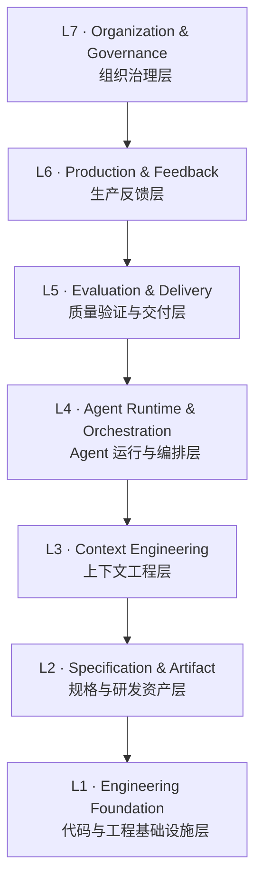

但是不要把它理解成简单的：

> L7 调用 L6，L6 调用 L5……

实际上它应该是一个**双向闭环系统**：

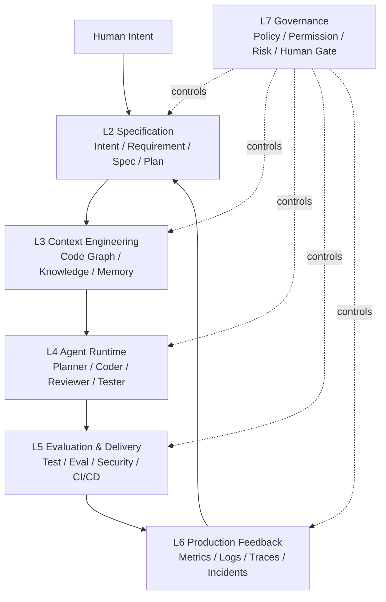

**L1 则是整个系统的底座**：

```text
Git
Repository
Build
CI
Runtime
Cloud
Database
Package
Infrastructure
```

---

# 二、为什么需要 7 层？

传统研发时代，研发效率主要取决于：

```text
Developer
   ↓
IDE
   ↓
Code
   ↓
Build
   ↓
Test
   ↓
Deploy
```

所以大家优化的是：

* IDE
* 编译速度
* CI
* 构建缓存
* Monorepo
* Git
* DevOps

但进入 Agentic Engineering 后，瓶颈发生了转移。

Anthropic 的研究明确指出：当 Agent 可以快速生成大量代码后，**planning、review、testing、deployment 这些原本人工完成的环节会成为新的瓶颈**。([Claude Academy][2])

OpenAI 的 Harness 实践也得到类似结论：真正限制 Agent 的不是单纯的模型 coding 能力，而是环境是否提供了足够的工具、上下文、结构和反馈。([OpenAI][3])

所以新的研发系统实际上变成：

```text
              AI Agent
                  │
                  ↓
        ┌───────────────────┐
        │  Context          │
        ├───────────────────┤
        │  Specification    │
        ├───────────────────┤
        │  Evaluation       │
        ├───────────────────┤
        │  Governance       │
        ├───────────────────┤
        │  Production       │
        └───────────────────┘
```

**Agent 只是中间的一层，而不是整个系统。**

这就是为什么我认为“7 层”比“AI Coding Platform”这个概念更准确。

---

# 三、L1：Engineering Foundation —— 工程基础设施层

这是最底层。

它并没有因为 AI 出现而消失，反而更加重要。

## 主要组成

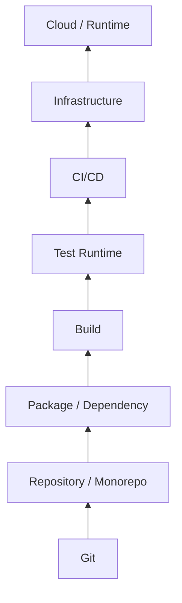

包括：

### Source

* Git
* Repository
* Monorepo
* Branch
* Commit
* PR

### Build

* Compiler
* Bundler
* Package Manager
* Build Cache

### Runtime

* Dev Environment
* Container
* Sandbox
* Cloud
* Database

### Delivery

* CI
* CD
* Artifact Registry
* Deployment

---

## AI Native 后有什么变化？

以前：

> 工程师使用这些基础设施。

现在：

> **Agent 也必须能够直接使用这些基础设施。**

例如：

```text
Agent
 ↓
git diff
git log
git worktree
pnpm test
npm build
docker
kubectl
gh pr
```

所以 L1 必须变成：

> **Agent-accessible Engineering Infrastructure**

这和 OpenAI Harness 的思路直接对应：Agent 通过标准开发工具直接访问 repository、CI、应用、日志和 metrics。([OpenAI][3])

---

# 四、L2：Specification & Artifact —— 规格与研发资产层

这是 AI Native SDLC 最重要的变化之一。

传统研发：

```text
需求
 ↓
PRD
 ↓
Jira
 ↓
开发
```

很多信息实际上存在于：

* Jira
* Confluence
* Slack
* 会议
* 人脑

Agent 很难可靠获取。

AI Native：

```text
Intent
 ↓
Requirement
 ↓
Spec
 ↓
Design
 ↓
Plan
 ↓
Task
 ↓
Evidence
```

全部变成**机器可读 Artifact**。

Anthropic 明确提出：

```text
intent.md
spec.md
plan.md
diff + tests
PR + review findings
incident record
```

这些 Artifact 进入版本控制，并形成审计链。([Claude Academy][1])

---

## L2 可以定义成

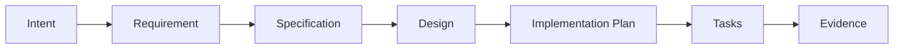

### 关键 Artifact

| Artifact            | 作用               |
| ------------------- | ------------------ |
| `intent.md`       | 为什么做           |
| `requirements.md` | 做什么             |
| `spec.md`         | 做到什么程度       |
| `design.md`       | 怎么设计           |
| `plan.md`         | 怎么实现           |
| `task`            | 谁/哪个 Agent 执行 |
| `eval`            | 怎么证明正确       |
| `evidence`        | 证明做对了         |
| `incident`        | 生产发生了什么     |

---

# 五、L2 为什么特别重要？

因为它解决一个核心问题：

> **Agent 到底在执行什么？**

没有 Spec：

```text
Human
 ↓
Prompt
 ↓
Agent
 ↓
Code
```

问题是：

```text
Agent
不知道：
- 为什么做
- 边界是什么
- 什么算成功
- 哪些不能改
- 如何验证
```

有 Spec：

```text
Human Intent
      ↓
Machine-readable Spec
      ↓
Agent
      ↓
Implementation
      ↓
Evidence
```

AWS Kiro 的核心就是这一思想：把高层 Prompt 转成 Requirements、Design 和 Tasks，再交给 Agent 执行。([Claude Academy][1])

---

# 六、L3：Context Engineering —— 上下文工程层

这是我认为未来 **AI研发平台最有技术壁垒的一层**。

传统 RAG：

```text
Question
 ↓
Vector Search
 ↓
Chunks
 ↓
LLM
```

对于复杂软件工程远远不够。

Agent 真正需要：

```text
Repository
Architecture
Dependencies
Business Rules
Git History
Design
Spec
Tests
Runtime
Observability
Policies
```

所以 L3 应该叫：

> **Context Engineering**

而不是简单的 RAG。

---

# 七、L3 的完整结构

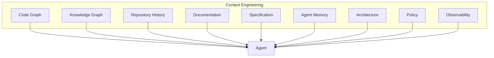

---

## 这里 Code Graph 的位置非常关键

结合你之前研究的 Code Graph，我现在会更加明确地定义：

> **Code Graph = L3 Context Engineering 的核心基础设施之一。**

例如 Agent 接到：

> “修改用户登录逻辑。”

普通 RAG：

```text
search("login")
```

可能得到：

```text
login.ts
auth.ts
user.ts
```

Code Graph 则可以回答：

```text
LoginController
   ↓
AuthService
   ↓
TokenService
   ↓
UserRepository
   ↓
User
```

以及：

```text
谁调用 AuthService？
哪些 API 依赖它？
哪些测试覆盖它？
最近哪些 Commit 修改过？
哪些 package 依赖它？
修改会影响哪些 App？
```

这才是真正的：

> **Agent Context Graph**

---

# 八、L4：Agent Runtime & Orchestration

到了这一层，才真正进入：

> Agent。

但它不应该只有一个 Agent。

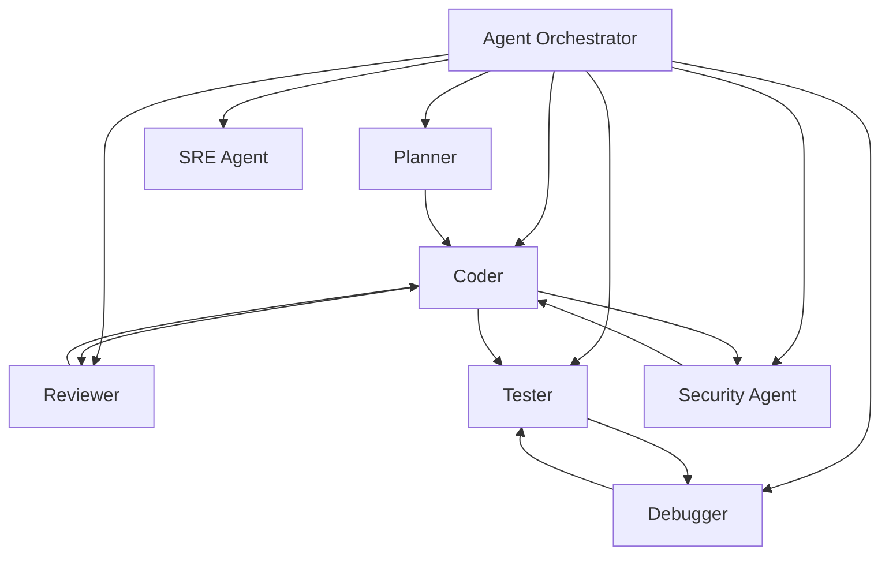

---

# 九、L4 不只是“Multi-Agent”

更准确的概念应该是：

> **Agent Runtime / Harness**

OpenAI 的 Harness Engineering 特别强调：

```text
Agent
+
Tools
+
Context
+
Environment
+
Feedback
+
Constraints
```

而不是：

```text
LLM
+
Prompt
```

OpenAI 的实际实践中，Codex 可以：

* 修改代码
* 运行测试
* 启动应用
* 操作浏览器
* 查看截图
* 查询 logs
* 查询 metrics
* 创建 PR
* 处理 review
* 修复 CI
* 最终 merge

这些能力共同组成 Harness。([OpenAI][3])

---

# 十、L4 可以进一步分成 5 个子系统

### 1. Agent Runtime

```text
Model
Context
Tool Call
Memory
State
```

### 2. Agent Orchestrator

```text
Task
 ↓
Planner
 ↓
Subagents
 ↓
Dependencies
```

### 3. Tool System

```text
Git
GitHub
Filesystem
Terminal
Browser
Database
Cloud
MCP
```

### 4. Workspace

```text
Git Worktree
Sandbox
Container
Environment
```

### 5. Recovery

```text
Failure
 ↓
Diagnose
 ↓
Retry
 ↓
Rollback
 ↓
Escalate
```

这也是为什么现在越来越多方案开始讨论 **Harness Engineering**。Harness 实际上就是把模型放进一个能够提供上下文、工具、权限和反馈的可控执行环境。([The Wall Street Journal][4])

---

# 十一、L5：Evaluation & Delivery —— 质量验证与交付层

这是 AI Native SDLC 和传统 DevOps 最大的变化之一。

传统：

```text
Code
 ↓
Unit Test
 ↓
E2E
 ↓
Code Review
 ↓
CI
```

AI Native：

```text
Agent
 ↓
Self Test
 ↓
Agent Review
 ↓
Eval
 ↓
Security
 ↓
CI
 ↓
Human Gate
```

---

# 十二、为什么 Eval 会成为一级基础设施？

因为传统测试验证：

> **代码是否符合预期。**

AI Eval 还需要验证：

> **Agent 是否能够正确完成任务。**

例如：

```text
Eval Case

Input:
"增加用户登录失败次数限制"

Expected:
- 修改 AuthService
- 新增 Redis counter
- 增加 Unit Test
- 增加 E2E
- 不修改 Billing
- 不破坏 OAuth
```

这实际上测试的是：

```text
Agent Behavior
```

而不是单纯：

```text
Function Output
```

Anthropic 明确提出：

> Continuous Evals 是 AI-native equivalent of stage-gate QA。

并建议把真实研发任务转换为 Eval，且生产事故应该反向加入 Eval Suite。([Claude Academy][5])

---

# 十三、L5 的完整结构

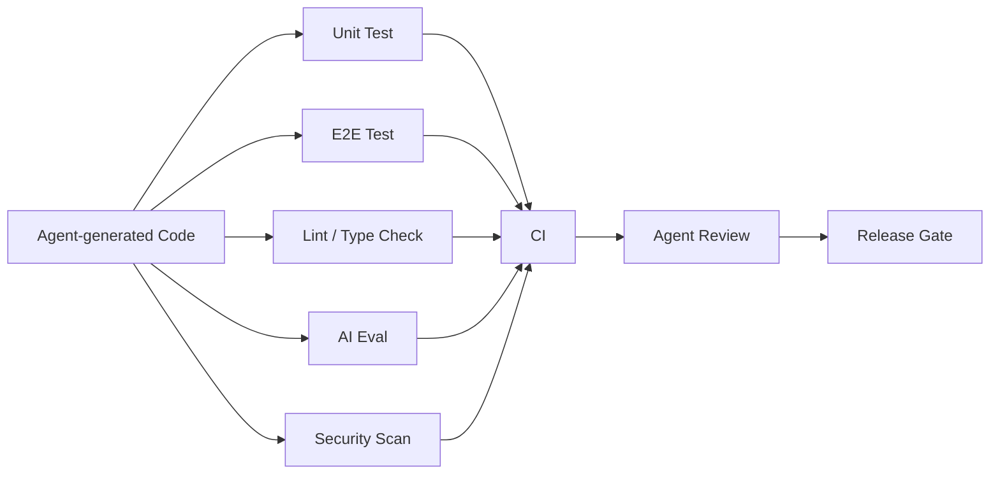

---

# 十四、L5 最终产生的不是“Test Result”，而是 Evidence

这是非常重要的概念。

传统：

```text
Test: PASS
```

AI Native：

```text
Evidence

Requirement
     ↓
Implementation
     ↓
Tests
     ↓
Eval
     ↓
Security
     ↓
Review
     ↓
Evidence
```

所以未来一个 PR 不应该只有：

```text
Diff
```

而应该是：

```text
PR
├── Spec
├── Plan
├── Diff
├── Unit Tests
├── E2E
├── Agent Eval
├── Security Scan
├── Review
├── Risk
└── Evidence
```

这也是 AI Native SDLC 可以做到高自动化的关键。

---

# 十五、L6：Production & Feedback —— 生产反馈层

这是传统 DevOps 已经存在，但 AI Native 会把它进一步自动化的一层。

传统：

```text
Deploy
 ↓
Monitor
 ↓
Alert
 ↓
Human
 ↓
Ticket
 ↓
Developer
```

AI Native：

```text
Deploy
 ↓
Observe
 ↓
Detect
 ↓
Diagnose
 ↓
Generate Intent
 ↓
Agent
 ↓
Fix
 ↓
Eval
 ↓
Deploy
```

Anthropic 的 Playbook 明确提出：

> Production control-band breach → diagnosis → new `intent.md` → restart SDLC loop。([Claude Academy][1])

---

# 十六、L6 Mermaid

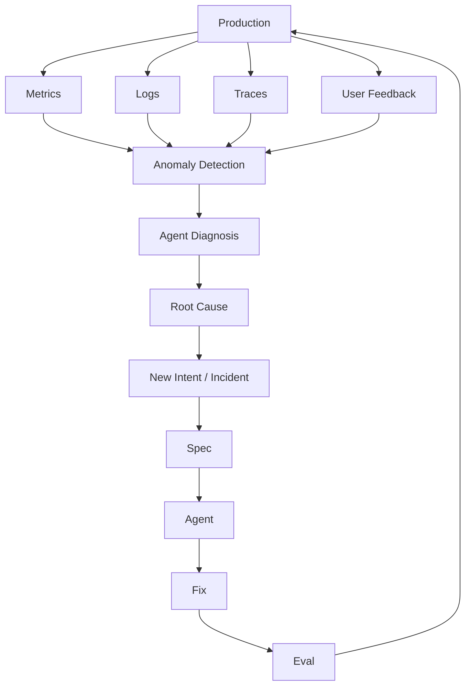

---

# 十七、L6 最终会改变“运维”的定义

传统 SRE：

> 人看 Dashboard。

AI Native SRE：

> **Agent 看 Dashboard。**

传统：

```text
Alert
 ↓
SRE
 ↓
分析
 ↓
修复
```

AI Native：

```text
Alert
 ↓
SRE Agent
 ↓
Logs
 ↓
Metrics
 ↓
Traces
 ↓
Code Graph
 ↓
Git History
 ↓
Root Cause
 ↓
Patch
 ↓
Eval
```

所以：

> **Code Graph + Observability Graph 会逐渐融合。**

未来 Agent 不只是知道：

```text
A 调用了 B
```

还应该知道：

```text
A
 ↓
B
 ↓
Database
 ↓
Latency ↑
 ↓
Error Rate ↑
 ↓
Deployment #123
 ↓
Commit abc123
```

这才是真正的：

> **Software System Graph**

---

# 十八、L7：Organization & Governance

这是最容易被忽略，但企业最终一定要面对的一层。

因为 Agent 越来越强以后：

```text
Agent 能做什么？
Agent 不能做什么？
谁批准？
谁负责？
出了问题谁承担？
```

都必须回答。

---

# 十九、L7 包含什么？

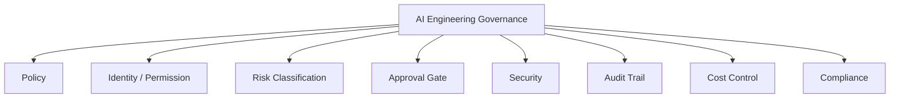

---

# 二十、Permission 必须从“人”扩展到“Agent”

传统：

```text
Developer
 ↓
Git Permission
```

AI Native：

```text
Agent Identity
 ↓
Agent Role
 ↓
Tool Permission
 ↓
Repository Permission
 ↓
Environment Permission
 ↓
Data Permission
```

例如：

```text
Planner Agent
    ├── Read Repo
    ├── Read Spec
    └── No Write

Coder Agent
    ├── Read Repo
    ├── Write Worktree
    └── Run Tests

Reviewer Agent
    ├── Read Diff
    ├── Read Tests
    └── No Code Write

Deploy Agent
    ├── Read CI
    ├── Deploy Staging
    └── Production = Approval Required
```

GitHub Agentic Workflows 已经采用类似思想：默认只读权限，写操作通过声明式 `safe-outputs`，并结合 sandbox、网络隔离、tool allow-list、compile-time validation 和 human approval。([GitHub][6])

---

# 二十一、7 层之间真正的关系

如果把所有层放在一起：

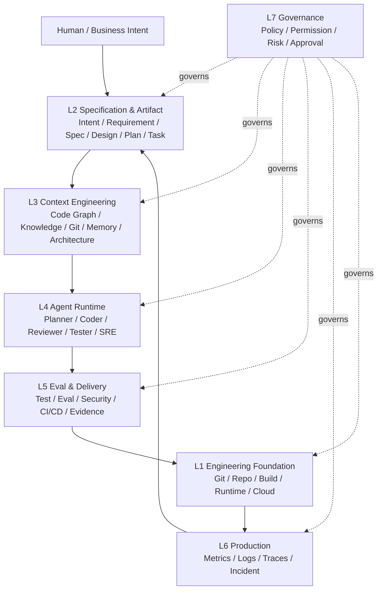

这个模型有一个非常重要的特点：

> **L1-L6 是工程闭环，L7 横切整个系统。**

---

# 二十二、7 层和四大厂商怎么对应？

这就能把我们上一轮的研究彻底统一起来。

| Layer                   | Anthropic                  | OpenAI                             | GitHub                     | AWS Kiro                            |
| ----------------------- | -------------------------- | ---------------------------------- | -------------------------- | ----------------------------------- |
| **L7 Governance** | Hooks / Human Gates        | Harness Policy                     | Permissions / Safe Outputs | Steering / Controls                 |
| **L6 Production** | **Closing Loop**     | Observability                      | Actions / Events           | AWS Operations                      |
| **L5 Eval**       | **Continuous Evals** | Feedback Loop                      | Actions / Checks           | Tests / Validation                  |
| **L4 Agent**      | Claude Code / Subagents    | **Codex / Harness**          | Coding Agent               | Kiro Agent                          |
| **L3 Context**    | CLAUDE.md / Skills         | **Repo as System of Record** | Repo Context               | Steering                            |
| **L2 Spec**       | **intent/spec/plan** | Intent / Exec Plans                | Issue / PR                 | **Requirements/Design/Tasks** |
| **L1 Foundation** | Git / CI / Runtime         | Repo / CI / DevTools               | **GitHub**           | AWS / Git                           |

于是可以很清楚地看到：

### Anthropic 最强

```text
L2 + L5 + L6
```

即：

> **Spec + Eval + Feedback Loop**

### OpenAI 最强

```text
L3 + L4
```

即：

> **Context + Harness + Agent Runtime**

### GitHub 最强

```text
L1 + L5 + L7
```

即：

> **Engineering Control Plane + CI + Governance**

### AWS Kiro 最强

```text
L2
```

即：

> **Specification-driven Engineering**

---

# 二十三、这 7 层中，哪些是传统技术，哪些是新技术？

可以进一步分成：

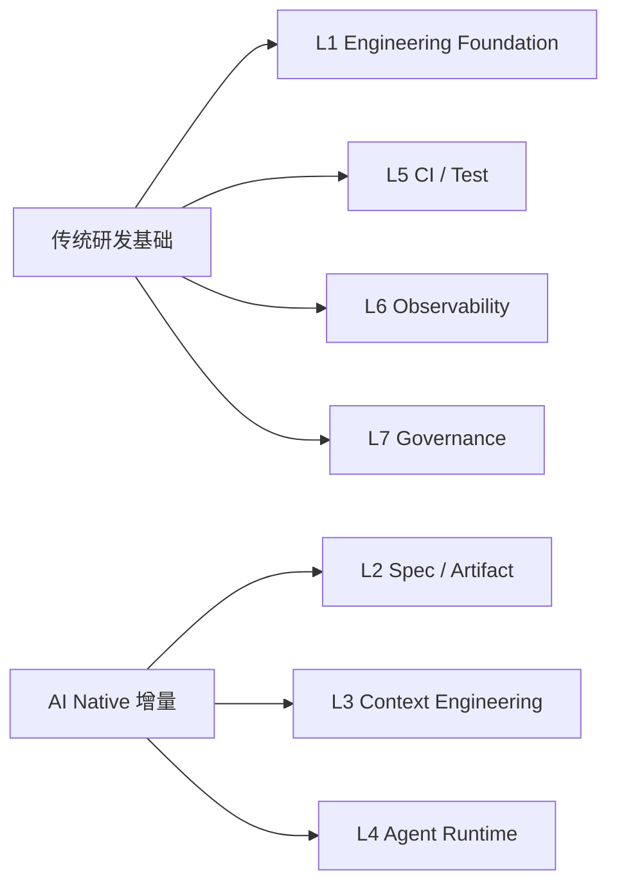

所以：

> **AI Native SDLC 不是推翻 DevOps。**

而是：

```text
Traditional Engineering
          +
Spec
          +
Context Engineering
          +
Agent Runtime
          +
Continuous Eval
          +
Agent Governance
          +
Production Feedback
```

---

# 二十四、真正的“AI Native”不是用了 Agent

这是一个很重要的判断标准。

如果一个企业：

```text
Jira
 ↓
Developer
 ↓
Cursor / Claude
 ↓
Code
 ↓
Jenkins
```

它只是：

> **AI-Assisted SDLC**

而不是 AI Native。

---

真正的 AI Native 应该是：

```text
Intent
 ↓
Spec
 ↓
Context
 ↓
Agent
 ↓
Eval
 ↓
Evidence
 ↓
Governance
 ↓
Deploy
 ↓
Production
 ↓
Feedback
 ↓
Intent
```

并且：

> **下一阶段由上一阶段 Artifact 自动触发。**

Anthropic 官方对此描述得非常明确：接受的 `intent.md` 可以触发 Requirements/Design；批准的 `spec.md` 触发 Plan Mode；Merge 的 PR 触发 Pipeline；生产 Control Band 被突破后生成新的 `intent.md`。([Claude Academy][1])

这就是：

> **Event-driven SDLC。**

---

# 二十五、7 层最终可以浓缩成一句话

如果让我给这个模型一句最简洁的定义：

> **L1 提供 Agent 可以工作的工程环境；L2 定义 Agent 要做什么；L3 告诉 Agent 它需要知道什么；L4 负责 Agent 怎么做；L5 证明它做对了；L6 判断线上是否真的工作；L7 决定 Agent 在什么边界内可以自主行动。**

也就是：

```text
L1 = Where
L2 = What
L3 = Know
L4 = How
L5 = Prove
L6 = Observe
L7 = Govern
```

我认为这是这套 7 层模型最核心的记忆方式。

---

# 二十六、如果进一步落到你现在的 AI 研发平台

结合你之前一直在研究的 **ReqStudio / AI Agent / Code Graph / CI/CD / Monorepo / AI Code Quality**，我会建议不要做成：

```text
AI Coding
```

而是：

```text
                AI-Native R&D Platform
                         │
       ┌─────────────────┼──────────────────┐
       ↓                 ↓                  ↓
   Product Layer    Engineering Layer   Governance
       │                 │                  │
    Intent/Spec       Agent/Harness       Policy
       │                 │                  │
       ↓                 ↓                  ↓
   Requirement       Context Engine       Security
                       │
                  ┌────┴────┐
                  ↓         ↓
              Code Graph   Knowledge
                  │
                  └────┬────┘
                       ↓
                     Agent
                       ↓
                 Code / Change
                       ↓
                Eval / Evidence
                       ↓
                     CI/CD
                       ↓
                   Production
                       ↓
                  Observability
                       ↓
                    Feedback
                       ↓
                    Intent
```

这里我尤其建议你把 **Code Graph 放到 L3，而不是 L4**。

因为：

> **Code Graph 不是 Agent。**

它是：

> **让 Agent 理解软件系统的 Context Infrastructure。**

同理：

> MCP 不是 Agent。

MCP 属于：

> **L3/L4 之间的 Context & Tool Interface。**

而：

> CI 也不是 Agent。

CI 属于：

> **L5 Evaluation & Delivery。**

这样整个架构会非常干净。

---

## 最终的参考模型

```text
┌──────────────────────────────────────────────┐
│ L7  Organization & Governance               │
│     Policy · Permission · Risk · Compliance  │
├──────────────────────────────────────────────┤
│ L6  Production & Feedback                   │
│     Observability · Incident · Feedback     │
├──────────────────────────────────────────────┤
│ L5  Evaluation & Delivery                   │
│     Test · Eval · Security · CI/CD · Evidence│
├──────────────────────────────────────────────┤
│ L4  Agent Runtime & Orchestration            │
│     Planner · Coder · Reviewer · Tester      │
├──────────────────────────────────────────────┤
│ L3  Context Engineering                      │
│     Code Graph · Knowledge · Memory · Git    │
├──────────────────────────────────────────────┤
│ L2  Specification & Artifact                 │
│     Intent · Spec · Design · Plan · Task     │
├──────────────────────────────────────────────┤
│ L1  Engineering Foundation                   │
│     Git · Repo · Build · Runtime · Cloud     │
└──────────────────────────────────────────────┘

                  ↑
             Human Intent

                  ↓

         Autonomous Feedback Loop

 Production → Incident → Intent
     ↑                    ↓
   Deploy ← Eval ← Agent ← Spec
```

**如果把这套模型用于企业研发平台设计，我认为真正的技术核心会集中在 L2、L3、L4、L5 四层：**

> **Spec → Context → Agent → Evidence**

而 L1 是工程底座，L6 是闭环，L7 是企业级安全边界。

这也解释了为什么你之前做的 **Code Graph + Agent + Spec + AI Code Quality + CI/CD**，实际上并不是五个孤立项目，而是天然可以组合成一个完整的 **AI-Native SDLC Platform**。其中最值得深入设计的下一步，就是把这 7 层进一步拆成**模块、服务、数据模型和 Agent Workflow**，最终形成可以直接实现的技术架构。

[1]: https://academy.claude.com/courses/ai-native-sdlc-playbook/introduction?utm_source=chatgpt.com
[2]: https://academy.claude.com/courses/ai-native-sdlc-playbook?utm_source=chatgpt.com
[3]: https://openai.com/index/harness-engineering/?utm_source=chatgpt.com
[4]: https://www.wsj.com/cio-journal/introducing-the-ai-model-harness-a638c65b?utm_source=chatgpt.com
[5]: https://academy.claude.com/courses/ai-native-sdlc-playbook/continuous-evals-in-ci?utm_source=chatgpt.com
[6]: https://github.com/github/gh-aw?utm_source=chatgpt.com
