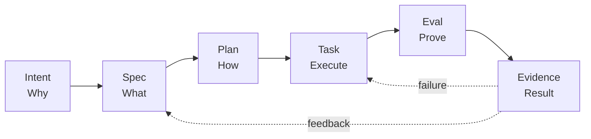
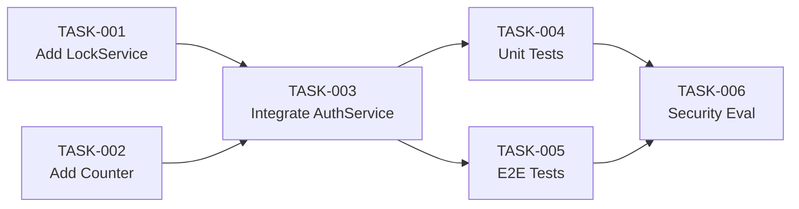
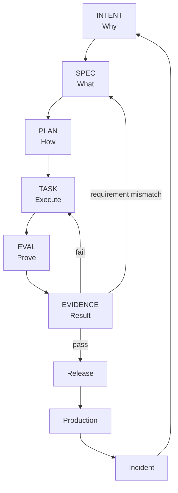
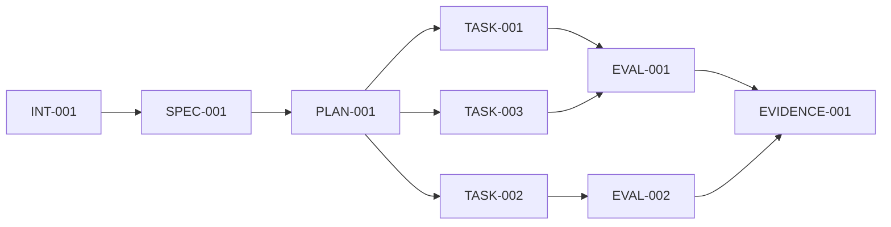
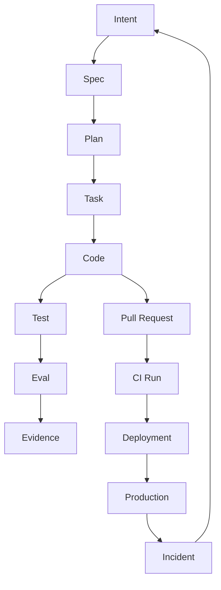
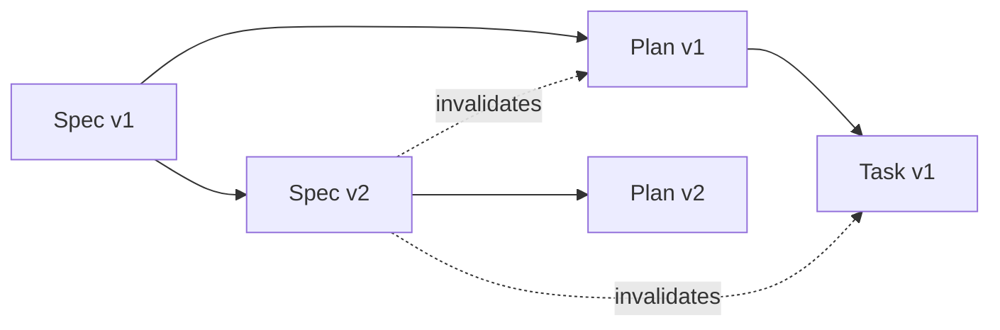

可以。基于刚才对 **Anthropic AI-Native SDLC、OpenAI Harness Engineering、GitHub Spec Kit / Agentic Workflow、AWS Kiro** 的调研，我建议不要直接照搬任何一家 Markdown 模板，而是抽象出一套**跨 Agent、跨平台、可版本化、可追踪、可验证的 AI Native SDLC Artifact Schema**。

先给结论：

> **AI Native SDLC 的核心不是 `intent.md / spec.md / plan.md` 这几个文件，而是一条可机器追踪的 Artifact Chain：**
>
> `Intent → Spec → Plan → Task → Eval → Evidence`
>
> 每个 Artifact 都必须有 **ID、版本、状态、来源、上下游关系、Owner、约束、验证标准、执行结果**。
>
> Markdown / YAML / JSON 只是表现形式；真正重要的是 **Schema + Lineage + State + Evidence**。

Anthropic 官方目前明确采用 `intent.md → spec.md → plan.md → code/tests → PR/review → incident` 的 committed artifact 链，并将 Git history 作为审计轨迹。([Claude Academy][1]) GitHub Spec Kit 则明确采用 `Spec → Plan → Tasks → Implement`，每个阶段产生 Artifact 并作为下一阶段的结构化上下文。([GitHub Docs][2]) Kiro 也采用 `requirements.md → design.md → tasks.md` 的结构。([Kiro][3])

---

# 一、先定义：什么叫 AI Native SDLC Artifact？

我建议正式定义：

```text
SDLC Artifact
=
Intent
+
Specification
+
Execution Plan
+
Task
+
Evaluation
+
Evidence
```

它们不是普通文档，而是：

> **Agent 可以读取、生成、修改、验证、关联和消费的工程对象。**

因此：

```text
传统研发 Artifact
    ↓
Document

AI Native Artifact
    ↓
Executable Knowledge
```

例如传统的需求：

```text
“支持用户登录失败次数限制”
```

AI Native Artifact 应该知道：

```text
为什么做
做什么
不能做什么
影响什么
如何实现
谁执行
怎么验证
验证结果是什么
最终是否满足 Intent
```

---

# 二、最终推荐的 Artifact Chain

我建议采用下面这条标准链：



对应：

| Artifact           | 核心问题             |
| ------------------ | -------------------- |
| **Intent**   | Why                  |
| **Spec**     | What                 |
| **Plan**     | How                  |
| **Task**     | Execute              |
| **Eval**     | How to prove         |
| **Evidence** | Did it actually work |

这是我认为最稳定的一套抽象。

---

# 三、但实际上还缺一个东西：Artifact Envelope

真正落地的时候，不能只设计：

```text
intent
spec
plan
task
eval
evidence
```

因为你马上会遇到：

* 谁创建的？
* Agent 还是人？
* 来自哪个 Intent？
* 哪个 Spec？
* 当前第几个版本？
* 谁批准？
* 是否过期？
* 哪个 Agent 执行？
* 哪个 commit 实现？
* 哪个 CI Run 验证？
* 哪个 Eval 证明？
* 如果 Spec 修改了，Task 是否失效？

因此我建议所有 Artifact 共享一个：

> **Artifact Envelope**

---

# 四、统一 Artifact Envelope

推荐 Schema：

```yaml
artifact:
  id: "art_01J..."
  type: "intent"
  version: 1

  title: "用户登录失败次数限制"

  status: "approved"

  lifecycle:
    created_at: "2026-08-31T10:00:00Z"
    updated_at: "2026-08-31T10:30:00Z"
    created_by:
      type: "human"
      id: "user_123"

  ownership:
    owner: "team-auth"
    reviewers:
      - "team-security"

  source:
    type: "human_request"
    ref: "ticket-1234"

  lineage:
    parent:
      - "intent_001"
    children:
      - "spec_001"

  repository:
    repo: "company/workbuddy"
    branch: "feature/login-rate-limit"
    commit: "abc123"

  context:
    references:
      - type: "code"
        ref: "packages/auth/src/AuthService.ts"
      - type: "code_graph"
        ref: "graph://symbol/AuthService"
      - type: "document"
        ref: "docs/security/auth.md"

  governance:
    risk: "medium"
    policy:
      - "security.auth"
      - "privacy.no-new-pii"

  metadata:
    tags:
      - "auth"
      - "security"
```

这个 Envelope 是整个体系的基础。

---

# 五、第一层：Intent Schema

Intent 是：

> **为什么做这件事。**

Anthropic 的 `intent.md` 正是从 Idea、Ticket 或 Production Incident 进入 SDLC，并要求 Product Owner 修正、批准后提交版本库。([Claude Academy][4])

推荐：

```yaml
type: intent

intent:
  problem:
    statement: "用户无法自行查看订单处理状态"

  motivation:
    business:
      - "降低客服状态查询压力"
    technical:
      - "减少重复 API 查询"

  desired_outcome:
    - "用户可以查看订单当前状态"
    - "用户可以看到预计完成时间"

  affected_users:
    - "customer"
    - "support"

  affected_systems:
    - "order-service"
    - "customer-portal"

  constraints:
    - "不得新增 PII"
    - "复用现有认证体系"

  non_goals:
    - "不重构订单状态系统"

  open_questions:
    - "第三方物流是否需要访问？"

  success:
    - "状态查询 self-service ratio > 70%"
```

---

# 六、Intent 最重要的是：不要写 Solution

这是一个很容易犯的错误。

错误：

```yaml
intent:
  solution:
    use_redis_counter: true
    add_auth_middleware: true
```

这已经不是 Intent。

应该：

```yaml
intent:
  problem:
    statement: "登录失败次数过多可能造成账户安全风险"

  outcome:
    - "限制异常登录尝试"
    - "降低 credential stuffing 风险"
```

然后由 Spec / Design 决定：

```text
Redis？
DB？
Gateway？
WAF？
Rate Limit？
```

---

# 七、Intent 的核心原则

```text
Intent
 ├── Problem
 ├── Motivation
 ├── Outcome
 ├── Scope
 ├── Constraints
 ├── Non-goals
 ├── Open Questions
 └── Success Criteria
```

可以记成：

> **Intent = Why + Outcome + Boundary**

---

# 八、第二层：Spec Schema

Spec 解决：

> **到底要做成什么样。**

这是 Kiro 和 GitHub Spec Kit 特别强调的一层。

Kiro 的标准 Spec 会生成 `requirements.md`、`design.md` 和 `tasks.md`；Requirements 中包含 user stories 和 acceptance criteria，Design 描述技术架构和实现方式。([Kiro][3])

GitHub Spec Kit 则明确采用：

```text
Spec
 ↓
Plan
 ↓
Tasks
 ↓
Implement
```

并要求每个阶段产生结构化 Artifact。([GitHub Docs][2])

---

# 九、推荐的 Spec Schema

```yaml
type: spec

spec:
  summary:
    statement: "限制连续失败登录尝试"

  actors:
    - customer
    - authentication-service

  requirements:

    - id: REQ-001
      description: "连续登录失败达到阈值时必须触发限制"

      acceptance:
        - id: AC-001
          given: "用户连续登录失败"
          when: "失败次数达到 5 次"
          then: "账户进入限制状态"

        - id: AC-002
          given: "账户处于限制状态"
          when: "再次登录"
          then: "请求被拒绝"

  functional:
    - "记录失败次数"
    - "触发账户限制"
    - "限制时间可配置"

  non_functional:
    performance:
      latency_p95: "< 50ms"

    security:
      - "不能暴露账户是否存在"

    availability:
      target: "99.99%"

  boundaries:
    in_scope:
      - "Password Login"

    out_of_scope:
      - "OAuth Login"

  dependencies:
    - "AuthService"
    - "UserRepository"

  risks:
    - "Redis unavailable"
    - "Distributed counter consistency"

  acceptance:
    required:
      - "REQ-001"
      - "AC-001"
      - "AC-002"
```

---

# 十、Spec 最重要的是 Acceptance Criteria

AI Native SDLC 不应该只写：

```text
需求：
增加登录限制。
```

而应该变成：

```text
Given
When
Then
```

例如：

```yaml
acceptance:
  - id: AC-001

    given:
      - "用户连续失败 4 次"

    when:
      - "第五次登录失败"

    then:
      - "账户进入 LOCKED"
      - "返回统一错误码"
      - "不得暴露用户存在性"
```

这样：

```text
Spec
 ↓
Task
 ↓
Eval
```

才能自动生成。

---

# 十一、第三层：Plan Schema

Plan 不应该重复 Spec。

Spec：

> **What**

Plan：

> **How**

Anthropic 官方要求 Claude 在 Plan Mode 中读取批准后的 `intent.md/spec.md`，生成包含修改文件、工作顺序和验证测试的 `plan.md`；批准后的 Plan 进入审计链，如果实现偏离 Plan，也应该同步更新。([Claude Academy][5])

推荐：

```yaml
type: plan

plan:
  objective:
    spec: "spec_001"

  approach:
    summary: "通过 Redis Distributed Counter 实现失败次数限制"

  architecture:
    changes:
      - "AuthService 增加 failure counter"
      - "Redis 增加 account lock state"

  changes:

    - id: CHANGE-001
      path: "packages/auth/src/AuthService.ts"
      operation: "modify"
      reason: "增加登录失败计数"

    - id: CHANGE-002
      path: "packages/auth/src/LockService.ts"
      operation: "create"
      reason: "封装账户锁定逻辑"

  dependencies:
    - "Redis"

  implementation_order:
    - CHANGE-002
    - CHANGE-001
    - CHANGE-003

  risks:
    - risk: "Redis failure"
      mitigation: "Fail-open"

  verification:
    - "unit-test"
    - "integration-test"
    - "security-eval"
```

---

# 十二、Plan 必须做到一个标准

这是非常关键的：

> **一个没有看过 Agent 对话的人，只拿 Plan，就应该能够理解如何实现。**

Anthropic 官方对此要求得非常明确：Plan 应该足够完整，使一个没有看过原始会话的工程师也能够依据 Plan 实现，并且应该明确哪些文件变化、执行顺序和验证方式。([Claude Academy][5])

因此：

```text
Bad Plan

修改 AuthService。
增加测试。
```

不是 AI Native Plan。

应该：

```text
AuthService.ts
 ├── add failure counter
 ├── check lock status
 └── emit auth.failure event

LockService.ts
 ├── lock()
 ├── unlock()
 └── isLocked()

Tests
 ├── 5 failures
 ├── lock expiration
 ├── Redis failure
 └── OAuth unaffected
```

---

# 十三、第四层：Task Schema

Task 是：

> **可以被一个 Agent 执行的最小工程单元。**

这是整个系统能不能真正 Agent 化的关键。

推荐：

```yaml
type: task

task:
  id: TASK-001

  title: "实现账户失败次数计数"

  objective:
    "在 AuthService 中记录密码登录失败次数"

  parent:
    plan: "plan_001"
    spec: "spec_001"

  scope:
    include:
      - "packages/auth/src/AuthService.ts"

    exclude:
      - "packages/oauth/**"

  inputs:
    context:
      - "code://AuthService"
      - "spec://REQ-001"

  instructions:
    - "使用现有 RedisClient"
    - "不得修改 OAuth 流程"

  dependencies:
    - "TASK-000"

  acceptance:
    - "失败次数正确递增"
    - "成功登录清零"

  verification:
    commands:
      - "pnpm test auth"

  risk:
    level: "medium"

  execution:
    agent:
      role: "coder"
    workspace:
      type: "git-worktree"

  status:
    state: "ready"
```

---

# 十四、Task 和 Spec 最大区别

```text
Spec

系统应该是什么样
        ↓
Plan

系统应该怎么实现
        ↓
Task

Agent 现在具体做什么
```

所以 Task 必须：

> **可执行、可验证、可回滚。**

---

# 十五、Task 最好设计成 DAG

不要简单：

```text
Task 1
Task 2
Task 3
Task 4
```

而应该：



这就可以支持：

```text
Agent A → TASK-001
Agent B → TASK-002
Agent C → TASK-004
```

并行执行。

这和 OpenAI Harness / Agent-first development 的方向非常吻合：Agent 的核心价值不再只是一次性生成代码，而是能够在明确的环境、上下文和反馈机制中持续执行任务。([OpenAI][6])

---

# 十六、第五层：Eval Schema

这是整个 Schema 里我认为**最容易被传统研发遗漏的一层**。

Eval 解决：

> **怎么证明 Agent 做对了？**

Anthropic 对 Continuous Evals 的定义非常明确：Eval 是 AI-native 的 stage-gate QA；真实研发任务可以转换为 Eval，并在 Agent 配置、Skills、Hooks 或模型发生变化时持续执行。生产事故还应该加入 Eval Suite 作为回归案例。([Claude Academy][7])

---

# 十七、Eval 不等于 Test

这是一个非常重要的区别。

### Test

```text
输入
 ↓
代码
 ↓
Expected Output
```

### Eval

```text
Intent
 ↓
Agent
 ↓
Action
 ↓
Artifact
 ↓
Behavior
 ↓
Policy
 ↓
Quality
```

所以一个 Eval 可以同时检查：

```text
Functional Correctness
+
Architecture
+
Security
+
Performance
+
Policy
+
Regression
+
Agent Behavior
```

---

# 十八、推荐 Eval Schema

```yaml
type: eval

eval:
  id: EVAL-001

  objective:
    "验证登录失败限制功能符合 Spec"

  target:
    type: "task"
    ref: "TASK-003"

  inputs:
    spec:
      - "REQ-001"
      - "AC-001"

  scenario:

    given:
      - "账户状态 ACTIVE"
      - "失败次数 4"

    when:
      - "执行一次错误密码登录"

    expected:
      - "失败次数 = 5"
      - "账户状态 = LOCKED"

  checks:

    - id: CHECK-001
      type: "functional"
      method: "test"
      command: "pnpm test auth"

    - id: CHECK-002
      type: "security"
      rule: "AUTH-001"

    - id: CHECK-003
      type: "architecture"
      rule: "AUTH-ARCH-001"

  thresholds:
    pass_rate: 1.0

  regression:
    baseline: "eval-suite-auth-v3"

  execution:
    environment: "ci"
```

---

# 十九、Eval 最好分 6 类

我建议：

```text
Functional
Security
Architecture
Performance
UX / Behavioral
Agent Quality
```

例如：

| Eval          | 检查                   |
| ------------- | ---------------------- |
| Functional    | 功能正确               |
| Regression    | 原功能没坏             |
| Security      | 是否违反安全规则       |
| Architecture  | 是否违反架构           |
| Performance   | 性能是否达标           |
| Agent Quality | Agent 是否正确完成任务 |

---

# 二十、Agent Quality Eval 特别重要

例如：

```text
Task:
增加登录失败限制
```

Agent 可能：

```text
✓ 功能能运行
✓ 测试通过

但：

✗ 修改了 OAuth
✗ 引入新的 Redis client
✗ 删除了旧测试
✗ 修改了 37 个无关文件
```

传统 Unit Test：

```text
PASS
```

Agent Eval：

```text
FAIL
```

所以：

> **AI Native SDLC 的质量标准必须从“Code Correctness”扩展到“Change Correctness”。**

---

# 二十一、第六层：Evidence Schema

这是整套设计最容易被低估的东西。

Eval：

> “应该怎么证明？”

Evidence：

> **“已经证明了什么？”**

推荐：

```yaml
type: evidence

evidence:
  id: EVD-001

  subject:
    task: "TASK-003"
    spec: "SPEC-001"

  result:
    status: "passed"

  checks:

    - eval: "EVAL-001"
      status: "passed"
      score: 1.0

    - eval: "EVAL-002"
      status: "passed"
      score: 0.98

  source:
    commit: "abc123"

  ci:
    provider: "github-actions"
    run_id: "987654"

  tests:
    total: 128
    passed: 128
    failed: 0

  security:
    status: "passed"

  changed_files:
    count: 7

  agent:
    provider: "codex"
    model: "gpt-5.x"

  generated_at: "2026-08-31T12:00:00Z"

  artifacts:
    - "test-report.xml"
    - "coverage.html"
    - "security-report.json"
```

---

# 二十二、Evidence 是 AI Native SDLC 的“证明层”

最终 PR 不应该只是：

```text
Changed 12 files
```

而应该：

```text
Evidence

Intent
  ↓
Spec
  ↓
Plan
  ↓
Tasks
  ↓
Implementation
  ↓
Tests
  ↓
Eval
  ↓
Security
  ↓
Review
  ↓
Evidence
```

于是可以回答：

> **“为什么允许这个 Agent 的代码进入生产？”**

答案不再依赖：

> “某个工程师看了一遍。”

而是：

```text
Spec satisfied
AND
Tests passed
AND
Evals passed
AND
Security passed
AND
Policy passed
AND
Review passed
```

---

# 二十三、六种 Artifact 最终形成一张图



这其实已经形成：

> **Artifact-driven SDLC**

---

# 二十四、但是还需要一个非常重要的机制：Lineage

如果只有六种 Artifact：

```text
Intent
Spec
Plan
Task
Eval
Evidence
```

还不够。

必须能够回答：

```text
这个 Evidence 是证明哪个 Eval？

这个 Eval 是验证哪个 Task？

这个 Task 来自哪个 Plan？

这个 Plan 实现哪个 Spec？

这个 Spec 来自哪个 Intent？
```

所以需要：

> **Artifact Lineage Graph**

---

# 二十五、Lineage Graph



---

# 二十六、这时候你之前研究的 Code Graph 就有了非常明确的位置

这也是我认为你之前 Code Graph 方案可以进一步升级的地方。

不要只建立：

```text
Code Graph
```

而应该建立：

```text
AI Engineering Graph
```

即：



这时候 Graph 的节点已经不是单纯：

```text
Class
Function
File
Package
```

而是：

```text
Business Intent
Requirement
Spec
Design
Plan
Task
Agent
Code
Test
Eval
Evidence
PR
CI
Deployment
Incident
```

这会形成一个真正的：

> **Software Engineering Knowledge Graph**

---

# 二十七、Artifact Schema 最好不要全部使用 Markdown

这是一个很重要的工程决策。

我建议：

```text
Human Authoring
        ↓
Markdown / YAML
        ↓
Parser
        ↓
Canonical Artifact Model
        ↓
Artifact Graph
```

也就是说：

### 对人

```markdown
intent.md
spec.md
plan.md
```

### 对机器

```json
{
  "artifact": {
    "id": "...",
    "type": "spec",
    "version": 3,
    "status": "approved"
  }
}
```

---

# 二十八、推荐 Canonical JSON Schema

如果真正做平台，我建议建立统一 Envelope：

```json
{
  "$schema": "https://your-company.dev/schemas/sdlc-artifact/v1.json",

  "id": "art_01JXYZ",
  "type": "spec",
  "version": 3,

  "title": "Login Failure Protection",

  "status": "approved",

  "lineage": {
    "parent": [
      {
        "id": "int_01JXYZ",
        "type": "intent"
      }
    ],
    "children": [
      {
        "id": "plan_01JXYZ",
        "type": "plan"
      }
    ]
  },

  "source": {
    "type": "intent",
    "ref": "int_01JXYZ"
  },

  "ownership": {
    "team": "identity",
    "owner": "user_123"
  },

  "context": {
    "repositories": [
      "company/workbuddy"
    ],
    "code_graph_refs": [
      "symbol://AuthService"
    ]
  },

  "governance": {
    "risk": "medium",
    "policies": [
      "security.auth"
    ],
    "approval_required": true
  },

  "content": {},

  "verification": {},

  "provenance": {
    "created_by": {
      "type": "human",
      "id": "user_123"
    },

    "generator": {
      "type": "agent",
      "provider": "anthropic",
      "model": "claude"
    }
  }
}
```

然后：

```text
content
```

由 Artifact Type 决定。

---

# 二十九、六个 Artifact 的 Canonical Type

最终我建议：

```typescript
type ArtifactType =
  | "intent"
  | "spec"
  | "plan"
  | "task"
  | "eval"
  | "evidence";
```

然后：

```typescript
interface Artifact<T> {

  id: ArtifactId;

  type: ArtifactType;

  version: number;

  title: string;

  status: ArtifactStatus;

  lineage: Lineage;

  source: Source;

  ownership: Ownership;

  context: ContextReference[];

  governance: Governance;

  content: T;

  verification: Verification;

  provenance: Provenance;

  timestamps: {
    createdAt: string;
    updatedAt: string;
  };
}
```

---

# 三十、Artifact Status 也应该标准化

不要每个 Artifact 自己定义状态。

统一：

```text
draft
   ↓
review
   ↓
approved
   ↓
in_progress
   ↓
verified
   ↓
completed
   ↓
superseded
   ↓
archived
```

特殊情况：

```text
rejected
blocked
failed
cancelled
```

---

# 三十一、Version 也不能简单使用 Git Commit

Artifact 自己需要：

```text
artifact.version
```

同时记录：

```text
git.commit
```

例如：

```yaml
artifact:
  id: SPEC-001
  version: 4

provenance:
  git:
    commit: abc123
```

因为：

```text
Spec v1
 ↓
Plan v1
 ↓
Agent 开始 Coding
 ↓
发现 Requirement 问题
 ↓
Spec v2
```

那么：

```text
Task 原来基于 Spec v1
```

就应该进入：

```text
STALE
```

重新规划。

---

# 三十二、因此 Artifact 必须支持 Dependency / Staleness

这是实际平台落地非常重要的机制。



规则：

```text
Spec Version Change
        ↓
Affected Plan
        ↓
Affected Tasks
        ↓
Affected Evals
        ↓
Re-validation
```

这就是：

> **Artifact Dependency Management**

---

# 三十三、因此 Eval 也必须绑定 Artifact Version

例如：

```yaml
eval:
  target:
    spec:
      id: SPEC-001
      version: 4

    task:
      id: TASK-003
      version: 2
```

如果：

```text
SPEC-001 v5
```

产生：

```text
EVAL-001 v1 → stale
```

必须重新跑。

---

# 三十四、Evidence 最终应该形成一个 Release Certificate

这是企业平台非常值得做的能力。

例如：

```yaml
release_certificate:

  artifact:
    release: "release-2026.08.31"

  intent:
    id: INT-001
    status: approved

  spec:
    id: SPEC-001
    version: 4
    status: approved

  plan:
    id: PLAN-001
    version: 2
    status: completed

  tasks:
    total: 12
    completed: 12

  eval:
    total: 38
    passed: 38

  security:
    status: passed

  ci:
    status: passed

  review:
    agent: passed
    human: approved

  deployment:
    environment: production
    status: successful

  evidence:
    completeness: 100
```

于是：

> **Release 不再只是一个 Git Tag，而是一个 Evidence Bundle。**

---

# 三十五、这会让 AI Native SDLC 产生一个非常关键的变化

传统：

```text
Release
 ↓
Version
```

AI Native：

```text
Release
 ↓
Evidence
 ↓
Proof
 ↓
Traceability
```

最终能够做到：

```text
Production Feature
       ↓
Release
       ↓
PR
       ↓
Commit
       ↓
Task
       ↓
Plan
       ↓
Spec
       ↓
Intent
```

反过来也可以：

```text
Intent
 ↓
Spec
 ↓
Plan
 ↓
Task
 ↓
Code
 ↓
Test
 ↓
Evidence
 ↓
Release
 ↓
Production
```

---

# 三十六、这套 Schema 和四家方案的关系

| Artifact | Anthropic          | OpenAI                   | GitHub Spec Kit         | Kiro                            |
| -------- | ------------------ | ------------------------ | ----------------------- | ------------------------------- |
| Intent   | **核心**     | Intent                   | **Intent-driven** | Prompt                          |
| Spec     | **核心**     | Design Docs              | **Spec**          | **Requirements + Design** |
| Plan     | **核心**     | **Execution Plan** | **Plan**          | Tasks 前置                      |
| Task     | Implicit / Plan    | Issue / Work Item        | **Tasks**         | **Tasks**                 |
| Eval     | **核心**     | Feedback Loop            | Quality Checks          | Validation                      |
| Evidence | **核心思想** | CI / Feedback            | Checks / PR             | Tests                           |
| Lineage  | Git history        | Repo history             | Cross-artifact analysis | Spec artifacts                  |

Anthropic 明确把 committed artifacts 和 Git history 作为 SDLC 的审计链；OpenAI 则把 plans、design docs、repository-local knowledge 作为 Agent 可消费的系统记录；GitHub Spec Kit 明确支持跨 Artifact 分析；Kiro 将 Requirements、Design、Tasks 持久化在 `.kiro/specs/` 中。([Claude Academy][1])

---

# 三十七、我最终推荐的“标准 Artifact Schema”

如果要做成你自己的企业级标准，我会定义成下面这个版本：

```text
┌──────────────────────────────────────────────┐
│             Artifact Envelope               │
│                                              │
│ ID / Type / Version / Status                 │
│ Owner / Source / Provenance                  │
│ Lineage / Dependencies                       │
│ Context / Governance                         │
│ Verification / Timestamps                    │
└──────────────────────────────────────────────┘
                     │
        ┌────────────┼────────────┐
        ↓            ↓            ↓
     Intent        Spec          Plan
       Why          What          How
        │            │            │
        └────────────┼────────────┘
                     ↓
                   Task
                 Execute
                     │
                     ↓
                   Eval
                  Prove
                     │
                     ↓
                 Evidence
                  Result
                     │
                     ↓
                  Release
                     │
                     ↓
                Production
                     │
                     ↓
                  Incident
                     │
                     └────→ Intent
```

---

# 三十八、最重要的 8 条设计原则

如果最终要把它做成平台规范，我建议把下面 8 条写进标准：

### ① Artifact First

**研发过程的关键状态必须 Artifact 化。**

不要依赖：

```text
Chat History
Slack
Human Memory
```

OpenAI 的 Harness 实践尤其强调，Agent 无法访问的外部知识对 Agent 来说实际上等于不存在，因此 repository-local、versioned artifacts 应成为 system of record。([OpenAI][6])

---

### ② Intent ≠ Solution

Intent 描述：

```text
Why
Outcome
Boundary
```

不要提前锁死：

```text
Technology
Implementation
Architecture
```

---

### ③ Spec ≠ Plan

```text
Spec = What

Plan = How
```

---

### ④ Task 必须可执行

一个 Task 应该能被：

```text
Agent
```

独立领取、执行、验证。

---

### ⑤ Eval 必须可重复

```text
Same Input
+
Same Environment
+
Same Policy
→
Comparable Result
```

---

### ⑥ Evidence 必须可追溯

每个 Evidence 都必须回答：

```text
证明什么？
依据什么？
哪个版本？
哪个 Commit？
哪个 CI？
哪个 Agent？
什么时候生成？
```

---

### ⑦ Artifact 必须有 Lineage

必须支持：

```text
Intent
 ↓
Spec
 ↓
Plan
 ↓
Task
 ↓
Eval
 ↓
Evidence
```

的完整追踪。

---

### ⑧ Artifact 必须支持 Staleness

任何上游 Artifact 修改，都应该能够自动发现：

```text
哪些下游 Artifact 已过期？
```

这点是普通 Spec Kit / Markdown Workflow 很容易遗漏，但企业级平台必须解决的问题。

---

# 三十九、最终我建议你把它命名为

如果你后面准备在 **ReqStudio / AI Native R&D Platform** 里真正实现，我建议不要叫：

> `AI SDLC Document Schema`

而叫：

# **AI Engineering Artifact Protocol（AEAP）**

或者更直接：

# **AI Native SDLC Artifact Model（ANSAM）**

核心模型：

```text
              AI Native SDLC Artifact Model

        Intent ──────── Why
           │
           ↓
        Spec ───────── What
           │
           ↓
        Plan ───────── How
           │
           ↓
        Task ───────── Execute
           │
           ↓
        Eval ───────── Prove
           │
           ↓
      Evidence ─────── Result
           │
           ↓
        Release
           │
           ↓
      Production
           │
           ↓
       Feedback
           │
           └────────→ Intent
```

而 **Code Graph** 则不属于这六种 Artifact，它应该作为横向基础设施：

```text
                    AI Engineering Graph
                           │
        ┌──────────────────┼──────────────────┐
        ↓                  ↓                  ↓
    Artifact Graph      Code Graph      Runtime Graph
        │                  │                  │
    Intent/Spec          File/Class        Service
    Plan/Task            Function          DB
    Eval/Evidence        Dependency        API
    PR/Release           Git              Metrics
```

这会比单纯做一个 `intent.md/spec.md/plan.md` 模板系统高一个层级。

**如果继续往真正落地走，下一步最值得设计的不是 Markdown 模板，而是：`Artifact Schema + Artifact Graph + State Machine + Lineage + Evidence Model` 五件套。** 这五个东西确定以后，才能真正把 Anthropic 的 SDLC、OpenAI 的 Harness、GitHub Spec Kit、Kiro 和你之前的 Code Graph 合成一个可实现的平台架构。

[1]: https://academy.claude.com/courses/ai-native-sdlc-playbook/introduction?utm_source=chatgpt.com
[2]: https://github.github.com/spec-kit/?utm_source=chatgpt.com
[3]: https://kiro.dev/docs/specs/quick-spec/?utm_source=chatgpt.com
[4]: https://academy.claude.com/courses/ai-native-sdlc-playbook/capture-intent?utm_source=chatgpt.com
[5]: https://academy.claude.com/courses/ai-native-sdlc-playbook/plan-mode?utm_source=chatgpt.com
[6]: https://openai.com/index/harness-engineering/?utm_source=chatgpt.com
[7]: https://academy.claude.com/courses/ai-native-sdlc-playbook/continuous-evals-in-ci?utm_source=chatgpt.com
