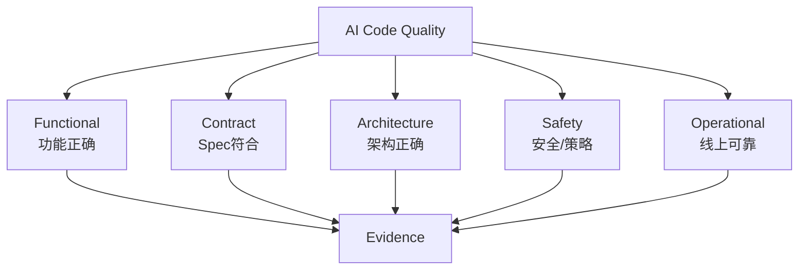
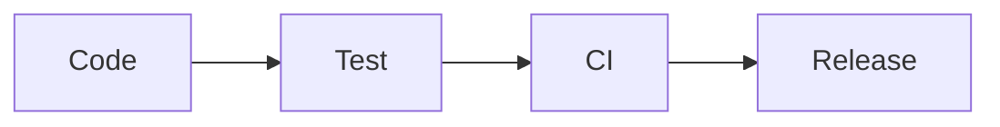
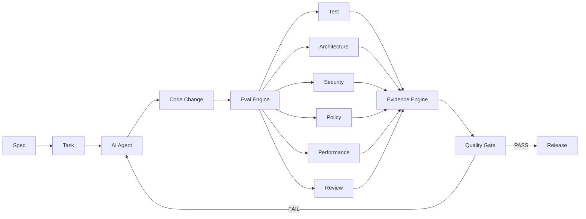
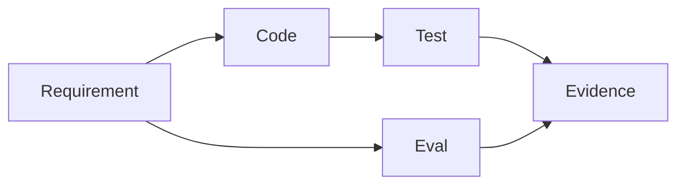
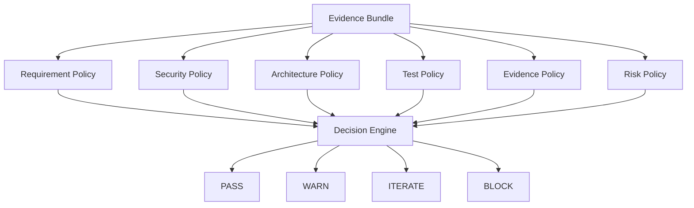
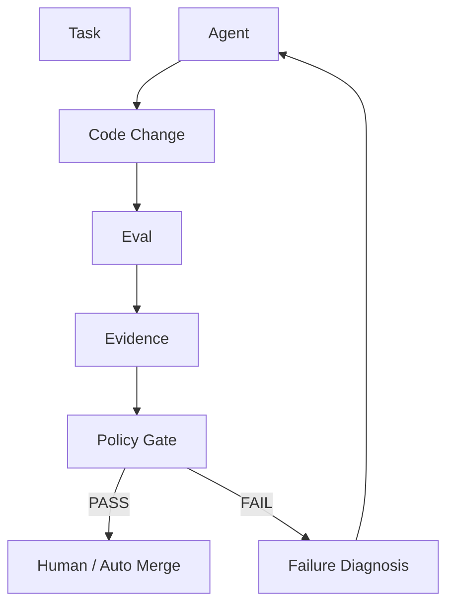
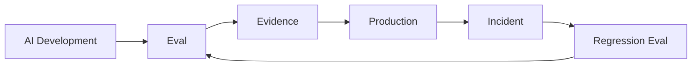
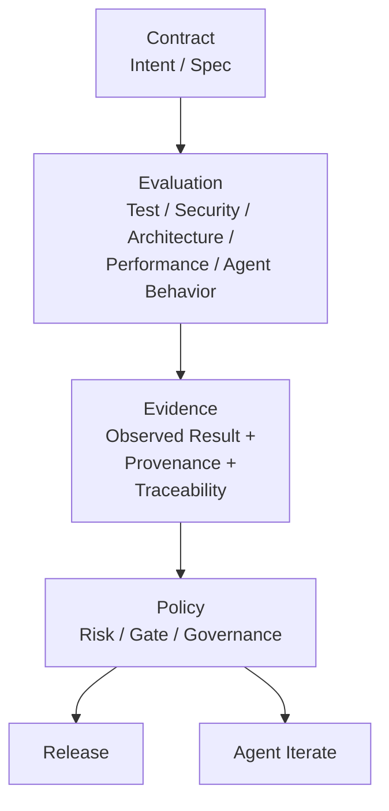

这一步非常关键。结合刚才的 **AI Native SDLC Artifact Schema**，我会把“AI Code Quality”重新定义成：

> **从“代码有没有通过测试”升级为“这次 AI 变更是否有足够 Evidence 证明它满足 Intent / Spec，并且 Agent 的行为本身是否可靠”。**

这不是简单地在 CI 里多加几个检查，而是把**质量对象从 Code 扩展成 Change / Agent / Outcome**。

Anthropic 已经明确把 Continuous Evals 定义为 AI-native 的 stage-gate QA，并建议把真实研发任务转成 Eval、在 Agent 配置变化时持续回归、把生产事故持续加入 Eval Suite。([Claude Academy][1]) OpenAI 的 Harness Engineering 则进一步强调：Agent 产生的不只是代码，还包括测试、CI、评审、Eval harness、Observability 等整个工程系统，并通过持续反馈让 Agent 自主完成更多闭环。([OpenAI][2])

---

# 一、先说结论：Test 只是 Evidence 的一种

传统研发：

```text
Code
  ↓
Test
  ↓
PASS
  ↓
Merge
```

AI Native：

```text
Intent
  ↓
Spec
  ↓
Plan
  ↓
Task
  ↓
Agent Change
  ↓
┌─────────────────────────────┐
│ Evidence                    │
│                             │
│ Test                        │
│ Eval                        │
│ Code Review                 │
│ Security                    │
│ Architecture                │
│ Performance                 │
│ Policy                      │
│ Runtime                     │
└─────────────────────────────┘
  ↓
Quality Decision
  ↓
Merge / Iterate / Block
```

所以：

> **Test = Evidence 的一个子集。**

而：

> **Eval = 生成、组织和判断 Evidence 的机制。**

最终：

> **Evidence = 对质量结论的可追溯证明。**

---

# 二、为什么“Test Passed”已经不够了？

AI Coding 最大的问题不是：

> Agent 不会写代码。

而是：

> **Agent 可以非常快地生成“看起来正确”的代码。**

SWE-bench 本身就是一个很好的例子：它通过真实 GitHub Issue、代码仓库和测试来判断 Agent 是否解决问题。([Swebench][3])

但 2026 年 OpenAI 对 SWE-bench Pro 的审计进一步暴露了一个非常重要的问题：大量任务本身存在测试与需求不一致、测试覆盖不足、需求描述不充分等问题，其中一次审计估计约 30% 的任务存在问题。([OpenAI][4])

这说明：

```text
Test PASS
≠
Requirement PASS
```

甚至：

```text
Test PASS
≠
Correct Implementation
```

这是 AI Code Quality 必须跨过去的一道坎。

---

# 三、一个非常典型的 AI Code Quality 问题

假设 Spec：

```text
用户连续登录失败 5 次后锁定账户。
锁定 15 分钟。
OAuth 登录不受影响。
不得泄漏账户是否存在。
```

Agent 生成：

```text
AuthService.ts
```

然后测试：

```text
✓ 5 次失败 → LOCKED
✓ LOCKED → 拒绝登录
✓ 15 分钟 → 自动恢复
```

CI：

```text
PASS
```

看起来很好。

但实际上 Agent 可能：

```text
❌ OAuth 也被锁了
❌ Redis key 没有 tenant namespace
❌ 用户不存在时响应时间不同
❌ 修改了不应该修改的 Billing Package
❌ 没有增加 distributed environment 测试
```

所以：

```text
                 Test
                  │
                  ↓
              PASS ❌
                  │
        ┌─────────┴─────────┐
        ↓                   ↓
 Functional             System
 Correctness             Correctness
        │                   │
        ↓                   ↓
      PASS                 FAIL
```

传统测试只能看到左边。

AI Native Quality 必须看到整个系统。

---

# 四、所以我建议把 AI Code Quality 定义成 5 个维度



即：

### 1. Functional Correctness

代码运行是否正确？

### 2. Contract Correctness

是否满足 Intent / Spec？

### 3. Architectural Correctness

是否遵守架构约束？

### 4. Safety / Governance

是否违反安全、权限、数据、合规规则？

### 5. Operational Correctness

上线之后是否真的工作？

---

# 五、从 Test 到 Evidence，核心变化是什么？

可以直接这样理解：

| 传统质量            | AI Native Quality     |
| ------------------- | --------------------- |
| Test                | Evidence              |
| Test Case           | Eval Case             |
| Test Result         | Evidence              |
| Code Review         | Agent Review Evidence |
| CI                  | Evidence Pipeline     |
| Coverage            | Evidence Coverage     |
| Bug                 | Failed Evidence       |
| Regression Test     | Regression Eval       |
| Release Gate        | Evidence Gate         |
| Production Incident | New Eval              |

所以真正的升级路线：

```text
Test
 ↓
Test + Review
 ↓
Test + Review + Security
 ↓
Test + Review + Eval
 ↓
Evidence
 ↓
Continuous Evidence
```

---

# 六、Eval 到底和 Test 有什么区别？

这是最容易混淆的地方。

## Test

通常是：

```text
Input
  ↓
Code
  ↓
Expected Output
```

例如：

```typescript
expect(login("wrong-password"))
  .toThrow("ACCOUNT_LOCKED");
```

它非常确定。

---

## Eval

更像：

```text
Task
 ↓
Agent
 ↓
Change
 ↓
Multiple Evaluators
 ↓
Evidence
 ↓
Decision
```

一个 Eval 可以同时调用：

```text
Unit Test
Integration Test
Static Analysis
Code Graph
Security Scanner
LLM Judge
Runtime
Policy Engine
```

所以：

> **Eval 是 Evaluation Orchestration，不是另一种 Test。**

---

# 七、Anthropic 的 Continuous Evals 正好验证了这个方向

Anthropic 给出的实践是：

1. 从最近真实工作中收集 20–50 个任务；
2. 每个任务转成 Eval；
3. Eval 包含 prompt + 可接受结果的 checks；
4. 在 CI 中运行；
5. Agent 配置、Skills、Hooks 或模型变化时重新执行；
6. 生产事故加入 Eval Suite。([Claude Academy][1])

这其实意味着：

```text
真实研发任务
      ↓
Eval Case
      ↓
持续运行
      ↓
Agent / Prompt / Skill / Model Regression
```

这和传统：

```text
代码变更
 ↓
测试
```

已经是两个不同的质量模型。

---

# 八、因此我建议重新设计 AI Code Quality Pipeline

不要：



而是：



---

# 九、这里最重要的是 Evidence Engine

我建议你未来做 AI Code Quality 平台时，把核心服务直接定义为：

> **Evidence Engine**

而不是：

> Test Engine。

因为 Test Engine 已经有很多成熟方案：

* Jest
* Vitest
* Playwright
* Cypress
* pytest
* JUnit
* ESLint
* TypeScript
* SonarQube
* Semgrep

真正缺的是：

> **如何把这些离散结果组织成“这次 AI 变更可信”的证据链。**

---

# 十、Evidence Engine 应该做什么？

输入：

```text
Intent
Spec
Plan
Task
Code Diff
```

调用：

```text
Test
Eval
Code Graph
Static Analysis
Security
Policy
Runtime
LLM Judge
```

输出：

```text
Evidence Bundle
```

例如：

```json
{
  "change": "PR-1234",

  "spec": {
    "id": "SPEC-001",
    "version": 3
  },

  "evidence": [

    {
      "type": "test",
      "status": "passed",
      "source": "ci://run/123"
    },

    {
      "type": "architecture",
      "status": "passed",
      "source": "graph://rule/AUTH-001"
    },

    {
      "type": "security",
      "status": "passed",
      "source": "semgrep://run/456"
    },

    {
      "type": "eval",
      "status": "passed",
      "score": 0.96,
      "source": "eval://AUTH-001"
    }
  ]
}
```

---

# 十一、Evidence 必须区分“Observed”和“Claimed”

这是一个特别重要的设计点。

比如 Agent 说：

> “我已经测试过，全部通过。”

这只是：

```text
Agent Claim
```

不能作为 Evidence。

真正 Evidence：

```text
Command:
pnpm test auth

Commit:
abc123

Environment:
CI-456

Exit Code:
0

Artifact:
test-results.xml
```

即：

```text
Agent Claim
      ≠
Observed Evidence
```

这一点甚至已经出现在当前 Spec Kit 社区关于 evaluator contract 的讨论中：应区分 Agent 声称测试通过和“在 revision X 实际观察到某命令产生某结果”，并要求 evaluator 结果带有 provenance。([GitHub][5])

这是非常值得纳入你前面 Artifact Schema 的。

---

# 十二、因此 Evidence Schema 应该升级

之前：

```yaml
evidence:
  status: passed
```

还不够。

建议：

```yaml
evidence:
  id: EVD-001

  type: test

  subject:
    task: TASK-003
    spec: SPEC-001
    spec_version: 4

  observation:
    command: "pnpm test auth"

    environment:
      os: linux
      node: "22.x"

    revision:
      commit: "abc123"

    exit_code: 0

  result:
    status: passed

  provenance:
    source: "ci"
    run_id: "CI-12345"

  artifacts:
    - "test-results.xml"

  timestamp:
    started_at: "..."
    finished_at: "..."
```

这样才是：

> **Evidence，而不是 Result。**

---

# 十三、Evidence 的可信度也应该分级

我建议：

```text
L0  Claim
L1  Generated
L2  Static
L3  Executed
L4  Independent
L5  Production
```

### L0 — Claim

```text
Agent says:
“应该没问题。”
```

价值最低。

---

### L1 — Generated

```text
Agent generated:
“测试已经覆盖。”
```

仍然不能证明。

---

### L2 — Static

```text
TypeScript
ESLint
AST
Code Graph
Security Rule
```

说明代码结构符合规则。

---

### L3 — Executed

```text
Unit Test
E2E
Integration
Build
```

真正执行过。

---

### L4 — Independent

例如：

```text
Agent A 写代码
        ↓
Agent B Review
        ↓
Independent Eval
```

避免：

> Agent 自己写、自己测、自己说通过。

---

### L5 — Production

```text
Canary
 ↓
Metrics
 ↓
Logs
 ↓
Traces
 ↓
Real User Behavior
```

这是最高等级的实际 Evidence。

---

# 十四、可以形成 Evidence Confidence

例如：

```text
                    Confidence

Claim                  █░░░░
Generated              ██░░░
Static                 ███░░
Executed               ████░
Independent            █████
Production             █████
```

但不要简单把它当成一个数学分数。

更合理的是：

```yaml
confidence:
  level: "L4"

  reasons:
    - "CI executed"
    - "independent security scan"
    - "architecture rule passed"
    - "two independent evals passed"
```

这样更可解释。

---

# 十五、Code Graph 在这里就真正产生价值了

这是与你之前 Code Graph 方案最直接的连接。

传统：

```text
Diff
 ↓
Tests
```

Code Graph 可以增加：

```text
Diff
 ↓
Impact Graph
 ↓
Affected Components
 ↓
Affected Tests
 ↓
Affected Contracts
```

例如 Agent 修改：

```text
AuthService
```

Code Graph 自动发现：

```text
AuthService
├── LoginController
├── OAuthController
├── AdminController
├── UserService
├── 12 Tests
├── 3 Apps
└── 2 External APIs
```

然后自动生成：

```text
Required Evidence
```

例如：

```text
✓ Unit AuthService
✓ Login E2E
✓ OAuth Regression
✓ Admin Regression
✓ API Contract
✓ Security
```

---

# 十六、于是出现一个很重要的概念：Evidence Coverage

传统：

```text
Code Coverage = 82%
```

AI Native：

```text
Evidence Coverage = ?
```

例如：

```text
Spec Requirements:
10

Covered:
9

Evidence:
8

Verified:
7
```

可以计算：

```text
Requirement Coverage
= 9 / 10
= 90%

Evidence Coverage
= 8 / 10
= 80%

Verified Coverage
= 7 / 10
= 70%
```

这比单纯：

```text
Line Coverage = 90%
```

有意义得多。

---

# 十七、建议定义 4 种 Coverage

### 1. Code Coverage

```text
Lines
Branches
Functions
```

### 2. Requirement Coverage

```text
Spec Requirements
      ↓
Implementation
```

### 3. Eval Coverage

```text
Requirement
      ↓
Eval
```

### 4. Evidence Coverage

```text
Requirement
      ↓
Evidence
```

最终：



---

# 十八、AI Code Quality 最终应该看“Change Coverage”

我甚至建议：

> **不要再把 Code Quality 作为核心指标。**

应该逐步转向：

# Change Quality

因为 AI 时代真正的基本单位已经从：

```text
File
```

变成：

```text
Change
```

一个 Change：

```text
PR #123
```

包含：

```text
Intent
Spec
Plan
Task
Diff
Test
Eval
Evidence
```

所以：

```text
Change Quality =
Requirement Satisfaction
+
Impact Safety
+
Evidence Completeness
+
Regression Safety
+
Policy Compliance
```

---

# 十九、可以定义一个 Change Quality Score

例如：

```text
CQ Score

Requirement Satisfaction    30%
Evidence Completeness       20%
Regression Safety            20%
Architecture Compliance      10%
Security                     10%
Performance                  5%
Operational Readiness        5%
```

但这里要特别注意：

> **不要把所有质量压成一个 0–100 分数后就结束。**

企业生产环境更应该：

```text
Hard Gates
+
Soft Scores
```

例如：

```text
Security Critical Failure
→ BLOCK

Requirement Not Covered
→ BLOCK

Evidence Missing
→ WARN / BLOCK

Architecture Violation
→ BLOCK

Test Coverage 85%
→ SCORE

Code Style
→ SCORE
```

---

# 二十、最终 Gate 应该是 Policy Engine



这与当前 Spec Kit 对 evaluator contract 的讨论方向非常一致：Evaluator 不应该只返回 pass/fail，还应支持 warning、iteration、clarification/evidence gathering、block，并携带 evaluator identity、findings、evidence/provenance 和 next action。([GitHub][5])

---

# 二十一、这意味着 AI Agent 会进入一个“验证-修复循环”

以前：

```text
Agent
 ↓
Code
 ↓
Test
 ↓
Human
```

现在：

```text
Agent
 ↓
Code
 ↓
Eval
 ↓
Evidence
 ↓
Policy
 ↓
FAIL
 ↓
Agent
 ↓
Fix
 ↓
Eval
 ↓
Evidence
 ↓
PASS
 ↓
Human
```

甚至：



这才是：

> **Agentic Code Quality Loop**

---

# 二十二、而且 Eval 应该反过来驱动 Agent

这是传统 CI 很少做的。

比如：

```text
Eval:
OAuth regression failed
```

不要只是：

```text
CI FAILED
```

而应该产生：

```json
{
  "failure": {
    "type": "regression",
    "component": "OAuthController",
    "spec": "SPEC-001"
  },

  "action": {
    "type": "iterate",
    "target": "TASK-003"
  }
}
```

Agent 收到：

```text
Your change violates AC-003.

Observed:
OAuth login is now blocked after password login failures.

Evidence:
CI-1234
E2E-0098

Affected:
OAuthController

Expected:
OAuth login must remain unaffected.
```

然后 Agent 自动修复。

---

# 二十三、这就是 Evidence → Agent Feedback

整个系统变成：

```text
                  ┌───────────────┐
                  │     Spec      │
                  └───────┬───────┘
                          ↓
                     ┌─────────┐
                     │  Agent  │
                     └────┬────┘
                          ↓
                       Change
                          ↓
                     ┌─────────┐
                     │  Eval   │
                     └────┬────┘
                          ↓
                   ┌────────────┐
                   │  Evidence  │
                   └─────┬──────┘
                         ↓
                   Policy Engine
                     ↙       ↘
                  PASS       FAIL
                   ↓           ↓
                Release      Agent
                               ↓
                              Fix
                               ↓
                              Eval
```

---

# 二十四、Production Incident 也应该进入 Eval

这是 Anthropic 特别值得借鉴的一点。

如果线上发生：

```text
OAuth unexpectedly locked
```

传统：

```text
Incident
 ↓
Fix
 ↓
Close Ticket
```

AI Native：

```text
Incident
 ↓
Root Cause
 ↓
New Eval
 ↓
Add to Regression Suite
 ↓
Fix
 ↓
Evidence
 ↓
Deploy
```

所以：

> **每一个重大生产事故，都应该产生一个新的 Eval。**

这让质量系统不断学习。

Anthropic 的 Continuous Evals 明确建议每个 production incident 转化为 Eval 并长期留在 suite 中作为 regression case。([Claude Academy][1])

---

# 二十五、最终会形成“质量飞轮”



这意味着：

> **系统每运行一次，质量能力都应该变强。**

而不是传统：

```text
Bug
 ↓
Fix
 ↓
结束
```

---

# 二十六、对你之前“AI代码质量”的方案，我会做一个关键调整

你之前关注的：

```text
AI 生成代码
 ↓
代码质量
 ↓
测试
 ↓
CI
```

我建议升级成：

```text
AI Native Code Quality Platform

                 Intent
                   ↓
                 Spec
                   ↓
                 Plan
                   ↓
                 Task
                   ↓
              AI Agent
                   ↓
              Code Change
                   ↓
        ┌──────────┴──────────┐
        ↓                     ↓
    Code Graph             Diff
        ↓                     ↓
    Impact Analysis      Static Analysis
        │                     │
        └──────────┬──────────┘
                   ↓
               Eval Engine
                   ↓
       ┌───────────┼────────────┐
       ↓           ↓            ↓
     Test       Security    Architecture
       ↓           ↓            ↓
       └───────────┼────────────┘
                   ↓
             Evidence Engine
                   ↓
             Policy Engine
                   ↓
       ┌───────────┴───────────┐
       ↓                       ↓
     PASS                     FAIL
       ↓                       ↓
    Release                  Agent Fix
       ↓                       ↑
 Production ←────────────── Eval
```

---

# 二十七、这里面最值得做的不是“AI Code Review”

我会把优先级排成：

| 能力                                           |     优先级 | 原因               |
| ---------------------------------------------- | ---------: | ------------------ |
| **Requirement → Evidence Traceability** | ⭐⭐⭐⭐⭐ | AI Native 核心     |
| **Eval Engine**                          | ⭐⭐⭐⭐⭐ | Agent 质量核心     |
| **Evidence Engine**                      | ⭐⭐⭐⭐⭐ | 把所有质量信号统一 |
| **Code Graph Impact Analysis**           | ⭐⭐⭐⭐⭐ | 判断变更影响       |
| **Policy Engine**                        | ⭐⭐⭐⭐⭐ | 企业落地关键       |
| Agent Review                                   |   ⭐⭐⭐⭐ | 很有价值           |
| Security                                       |   ⭐⭐⭐⭐ | 必须               |
| Test Generation                                |     ⭐⭐⭐ | 已经比较成熟       |
| Code Coverage                                  |       ⭐⭐ | 只是一个指标       |
| Lint                                           |         ⭐ | 基础设施           |

---

# 二十八、最终可以形成一个新的质量模型

我建议你以后内部不要再说：

> **AI Code Quality = Test + Review**

而定义成：

# **AI Code Quality = Contract + Evaluation + Evidence**

其中：

```text
Contract
    ↓
Intent / Spec

Evaluation
    ↓
Test / Security / Architecture / Performance / Agent Behavior

Evidence
    ↓
Observed Result + Provenance + Traceability

Decision
    ↓
Policy
```

即：



---

# 二十九、最终最重要的一句话

如果只保留一个结论，我建议是：

> **传统测试回答的是：“代码运行时有没有失败？”**
>
> **AI Native Eval 回答的是：“Agent 是否完成了正确的工程任务？”**
>
> **Evidence 回答的是：“我们有什么可验证、可追溯的事实证明它完成了？”**

所以最终：

```text
Test
  ↓
“代码没报错”

Eval
  ↓
“任务满足预期”

Evidence
  ↓
“有事实证明满足预期”

Policy
  ↓
“因此允许进入下一阶段”
```

这四层组合起来，才是真正意义上的 **AI Native Code Quality**。

而且这和你前面设计的 `intent → spec → plan → task → eval → evidence` 是完全闭合的：**Artifact 定义质量目标，Eval 执行质量判断，Evidence 保存质量事实，Policy 决定是否放行。**

对于你之前的 **10GB/90 workspace Monorepo + Code Graph + AI Agent + CI** 场景，我尤其建议下一步把这个模型进一步落成一个 **“AI Code Quality Evidence Matrix”**：把 `Spec Requirement × Code Graph × Test × Eval × Security × CI × Production` 做成可计算的矩阵，这会比传统的代码覆盖率、SonarQube 分数更适合衡量 AI 生成代码的真实质量。

[1]: https://academy.claude.com/courses/ai-native-sdlc-playbook/continuous-evals-in-ci?utm_source=chatgpt.com
[2]: https://openai.com/index/harness-engineering/?utm_source=chatgpt.com
[3]: https://www.swebench.com/SWE-bench/faq/?utm_source=chatgpt.com
[4]: https://openai.com/index/separating-signal-from-noise-coding-evaluations/?utm_source=chatgpt.com
[5]: https://github.com/github/spec-kit/issues/4290?utm_source=chatgpt.com
