可以。结合前面几轮对 **AI Native SDLC、Artifact Schema、Evidence + Eval、Code Graph、Anthropic 12 Plays、OpenAI Harness、GitHub Spec Kit、AWS Kiro** 的分析，我建议最终不要做成一个“AI Coding 平台”，而是做成：

# 企业级 AI Native R&D Platform

核心定位：

> **以 Spec 为研发意图源，以 Code Graph 为代码上下文，以 Agent Harness 为执行系统，以 MCP 为工具协议，以 Eval + Evidence 为质量闭环，以 Governance 为控制平面，以 Observability 为运行时事实系统。**

这比“Copilot + CI + 知识库”高一个层级。

GitHub 当前的 Spec Kit 已经明确把 Spec → Plan → Tasks → Implement 做成可扩展的 Intent-driven Harness，并支持工作流、Extensions、Presets、质量门禁等；OpenAI 的 Harness Engineering 则强调人负责意图和环境，Agent 执行工程工作；Anthropic 的 AI-Native SDLC 则进一步把 Intent、Spec、Plan、Evals、PR、CI/CD 和生产反馈连接成一个持续循环。([GitHub Docs][1])

---

# 一、先给最终架构

我建议最终采用 **“7 层架构 + 3 个横向控制面”**。

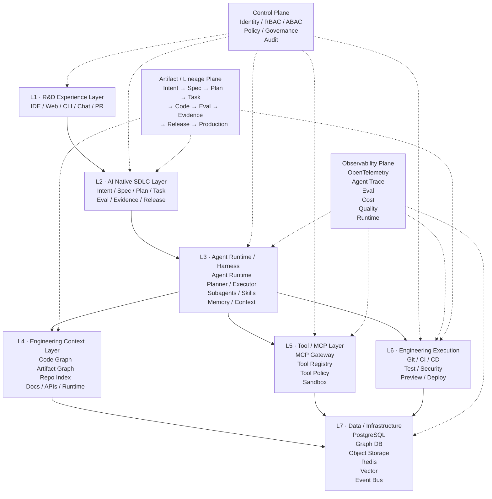

这张图基本可以作为整个产品的 **Top-level Architecture**。

---

# 二、最重要的架构原则

整个系统不要围绕：

```text
LLM
```

设计。

而应该围绕：

```text
Artifact
+
Context
+
Agent
+
Tool
+
Evidence
```

设计。

最终：

```text
                 ┌─────────────┐
                 │   Intent    │
                 └──────┬──────┘
                        ↓
                 ┌─────────────┐
                 │    Spec     │
                 └──────┬──────┘
                        ↓
                 ┌─────────────┐
                 │    Plan     │
                 └──────┬──────┘
                        ↓
                 ┌─────────────┐
                 │    Task     │
                 └──────┬──────┘
                        ↓
              ┌────────────────────┐
              │   Agent Harness    │
              └─────────┬──────────┘
                        ↓
             ┌─────────────────────┐
             │ Context + Tools     │
             │ Code Graph + MCP    │
             └──────────┬──────────┘
                        ↓
                     Change
                        ↓
              ┌─────────────────────┐
              │ Eval + Evidence    │
              └──────────┬──────────┘
                        ↓
                    Governance
                        ↓
                 CI/CD / Release
                        ↓
                    Production
                        ↓
                    Feedback
                        │
                        └────→ Intent
```

---

# 三、L1：R&D Experience Layer

这一层不要自己重新发明 IDE。

应该支持：

```text
IDE
Web
CLI
Git / PR
Chat
API
```

例如：

```text
VS Code
JetBrains
Cursor
Claude Code
Codex
GitHub Copilot
内部 Web IDE
```

平台提供统一的：

```text
Project
Task
Spec
Agent Session
Eval
Evidence
PR
Release
```

而不是要求研发人员必须在你的 Web 平台里面写代码。

这点可以借鉴 GitHub 当前的做法：企业级 Copilot 支持 repository-wide instructions、path-specific instructions、Agent instructions，并且可以在企业层统一管理 Custom Agents 和 MCP。([GitHub Docs][2])

---

# 四、L2：AI Native SDLC Layer

这是整个系统真正的核心。

标准 Artifact：

```text
Intent
  ↓
Spec
  ↓
Plan
  ↓
Task
  ↓
Eval
  ↓
Evidence
  ↓
Release
```

建议平台内部定义：

```typescript
type ArtifactType =
  | "intent"
  | "spec"
  | "plan"
  | "task"
  | "eval"
  | "evidence"
  | "release"
  | "incident";
```

每个 Artifact 都统一：

```typescript
interface Artifact {

  id: string;

  type: ArtifactType;

  version: number;

  status: ArtifactStatus;

  content: unknown;

  lineage: Lineage;

  provenance: Provenance;

  ownership: Ownership;

  governance: Governance;

  context: ContextRef[];

  verification: Verification;
}
```

---

# 五、Artifact 必须成为 System of Record

这是一个非常重要的设计。

不要：

```text
Chat History = Source of Truth
```

应该：

```text
Artifact = Source of Truth
```

Chat 只是：

```text
Artifact Creation Interface
```

例如：

```text
用户：
“增加登录失败限制”

        ↓

Agent

        ↓

Intent

        ↓

Spec

        ↓

Plan

        ↓

Task
```

所有关键决策最终必须沉淀成版本化 Artifact。

GitHub Spec Kit 的核心理念就是让 Specification 成为实现的主要驱动资产，而不是开发结束后被丢弃的文档。([GitHub][3])

---

# 六、L3：Agent Runtime / Harness

这一层是第二个核心。

我建议不要做：

```text
Agent = LLM + Prompt
```

而定义：

```text
Agent Runtime
=
Model
+
Context
+
Planner
+
Tool Runtime
+
Memory
+
Policy
+
Sandbox
+
Feedback
+
Observability
```

架构：

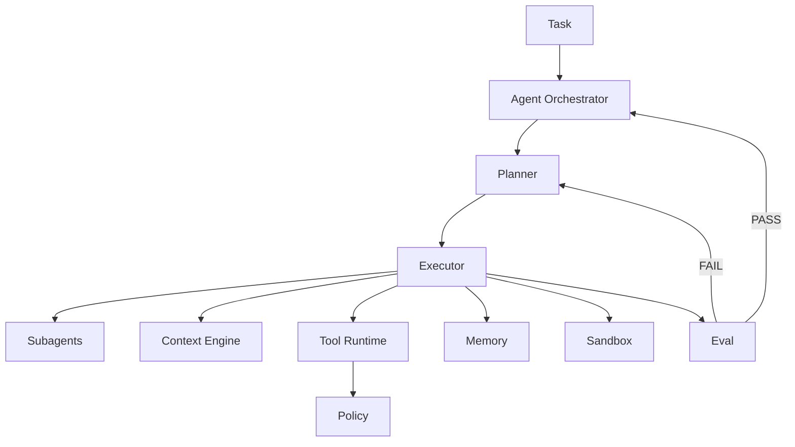

---

# 七、Agent Runtime 不应该绑定某一个模型

必须：

```text
Agent
  ↓
Model Gateway
  ↓
┌────────┬────────┬────────┬────────┐
OpenAI   Claude   Gemini   Qwen
```

否则平台会迅速变成：

> 某一家模型的二次封装。

建议：

```text
Model Gateway
├── Model Registry
├── Routing
├── Fallback
├── Cost Control
├── Rate Limit
├── Context Window
├── Model Policy
└── Provider Adapter
```

---

# 八、Agent 也要标准化

建议：

```yaml
agent:
  id: coding-agent
  version: 3

  capabilities:
    - code.read
    - code.write
    - test.run
    - git.commit
    - pr.create

  tools:
    allow:
      - code.search
      - code.graph
      - terminal
      - git
      - ci

  policies:
    require_approval:
      - production.deploy
      - database.migration

  model:
    routing_policy: coding-balanced
```

于是：

```text
Agent
≠
Prompt
```

而是：

> **Agent = Capability + Policy + Context + Model + Toolset**

---

# 九、Agent Harness 要支持 Subagent

推荐：

```text
                    Orchestrator
                         │
             ┌───────────┼───────────┐
             ↓           ↓           ↓
          Planner      Coder       Reviewer
             │           │           │
             ↓           ↓           ↓
          Analyst       Test       Security
```

例如一个 Feature：

```text
Planner Agent
      ↓
┌─────┼─────┐
↓     ↓     ↓
Code  Test  Security
Agent Agent Agent
└─────┼─────┘
      ↓
 Reviewer
      ↓
 Evidence
```

但要注意：

> Subagent 必须共享 **Artifact + Context + Policy**，而不是共享整个 Chat History。

---

# 十、L4：Engineering Context Layer

这是你之前 **Code Graph** 方案最重要的落点。

我建议这里不要叫：

> Knowledge Base

而叫：

# Engineering Context Engine

因为 Agent 需要的不是“知识”，而是：

```text
代码
依赖
架构
Spec
Task
Git
PR
CI
文档
API
运行时
历史变更
```

---

# 十一、Engineering Context Engine

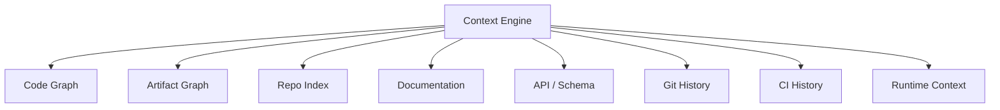

最终 Agent 查询：

```text
“修改 AuthService 需要影响哪些地方？”
```

不应该只做：

```text
grep AuthService
```

而应该：

```text
Code Graph
 ↓
AuthService
 ↓
Incoming Dependencies
 ↓
Outgoing Dependencies
 ↓
API
 ↓
Tests
 ↓
Applications
 ↓
Spec
```

---

# 十二、Code Graph 是整个架构的重要基础设施

建议 Graph 至少包含：

```text
Repository
Workspace
Package
Directory
File
Class
Function
Method
Interface
Type
API
Database
Event
Test
Spec
Task
PR
Commit
Deployment
Incident
```

关系：

```text
IMPORTS
CALLS
EXTENDS
IMPLEMENTS
DEPENDS_ON
EXPOSES
TESTS
MODIFIES
SATISFIES
IMPLEMENTS
GENERATED_BY
VERIFIED_BY
DEPLOYED_AS
CAUSED
```

于是：

```text
Spec
 ↓ SATISFIED_BY
Code
 ↓ TESTED_BY
Test
 ↓ VERIFIED_BY
Eval
 ↓ PRODUCES
Evidence
```

这就是前面讨论的 **AI Engineering Graph**。

---

# 十三、Code Graph + Artifact Graph 必须融合

不要维护两个孤立 Graph。

最终应该：

```text
                    Engineering Graph

        ┌──────────────┬──────────────┐
        ↓              ↓              ↓
   Artifact Graph   Code Graph    Runtime Graph
        │              │              │
 Intent             File           Service
 Spec               Class          API
 Plan               Function       DB
 Task               Dependency     Metric
 Eval               Test           Trace
 Evidence           Commit         Deployment
```

三张图逻辑上统一。

存储层可以不同，但查询层统一。

---

# 十四、L5：MCP / Tool Layer

MCP 不应该成为整个 Agent 平台的核心业务协议。

应该把 MCP 定义成：

> **Tool Interoperability Layer**

也就是说：

```text
Agent Runtime
      ↓
Tool Gateway
      ↓
MCP
      ↓
External / Internal Systems
```

MCP 当前规范已经定义了 HTTP 场景下的授权能力，并采用 OAuth 2.1 / Protected Resource Metadata 等机制；因此企业内部 MCP Gateway 应该把身份、scope、resource audience 等安全属性纳入统一控制。([Model Context Protocol][4])

---

# 十五、MCP Gateway 架构

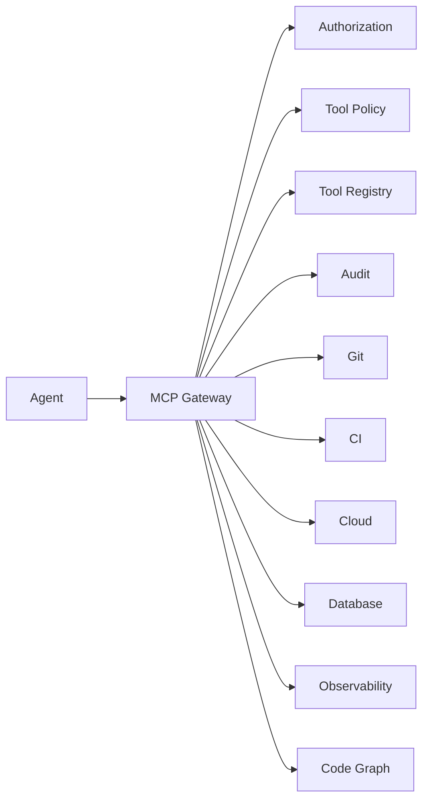

---

# 十六、Tool Registry 必须企业级化

每个 Tool：

```yaml
tool:
  id: git.create_pr

  owner: platform-team

  risk: medium

  permissions:
    required:
      - repo.write

  execution:
    sandbox: false

  approval:
    required: false

  audit:
    required: true
```

然后：

```text
Tool
 ↓
Risk Classification
 ↓
Permission
 ↓
Policy
 ↓
Execution
 ↓
Audit
```

---

# 十七、工具应该有 Risk Level

我建议：

```text
L0 Read Only

L1 Local Write

L2 Repository Write

L3 CI / Infrastructure

L4 Production Read

L5 Production Write
```

例如：

| Tool              | Risk |
| ----------------- | ---: |
| code.search       |   L0 |
| code.graph        |   L0 |
| git.diff          |   L0 |
| test.run          |   L1 |
| file.write        |   L1 |
| git.commit        |   L2 |
| create PR         |   L2 |
| trigger CI        |   L3 |
| deploy staging    |   L3 |
| production logs   |   L4 |
| production deploy |   L5 |
| DB migration      |   L5 |

然后 Governance Engine 决定：

```text
L0-L1 → Agent 自动
L2 → Agent 自动 + Audit
L3 → Policy
L4 → Approval / Policy
L5 → Human Approval
```

---

# 十八、L6：CI/CD 不再只是“跑测试”

CI/CD 应该成为：

# Evidence Execution Plane

也就是说：

```text
PR
 ↓
Build
 ↓
Test
 ↓
Security
 ↓
Architecture
 ↓
Eval
 ↓
Evidence
 ↓
Policy
 ↓
Release
```

---

# 十九、推荐 CI Pipeline

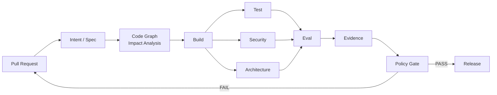

---

# 二十、Code Graph 要直接参与 CI

例如：

```text
PR 修改：
AuthService.ts
```

Graph 自动计算：

```text
Affected:

3 packages
12 services
28 APIs
41 tests
2 applications
1 security boundary
```

然后自动决定：

```text
Required Test Set
```

而不是每次：

```text
90 workspace
全部 test
```

这对你之前 **10GB / 90 workspace Monorepo** 的场景尤其有价值。

---

# 二十一、可以实现 Graph-Based CI

```text
Git Diff
   ↓
Changed Symbols
   ↓
Code Graph
   ↓
Impact Set
   ↓
Affected Packages
   ↓
Affected Tests
   ↓
Affected Evals
   ↓
Minimal Verification Set
```

例如：

```text
Change:
AuthService.login()

Impact:
LoginController
OAuthBoundary
UserService

Tests:
auth.unit
login.e2e
oauth.regression

Evals:
AUTH-001
AUTH-SEC-003
```

这会直接把你之前关注的：

> Monorepo CI 性能优化

和：

> AI Native Code Quality

统一起来。

---

# 二十二、L7：Data Layer

我建议不要一开始搞“万能数据库”。

采用 Polyglot Persistence。

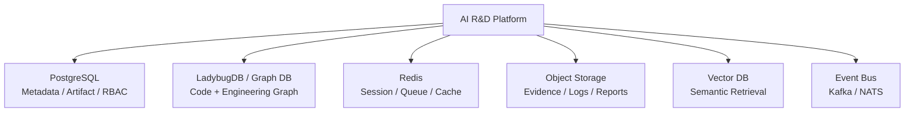

---

# 二十三、结合你之前 Code Graph 的方案，我反而建议直接 LadybugDB

你之前问过：

> AI 生成代码已经很快，是不是可以直接 LadybugDB，跳过迁移？

对于这个最终平台，我仍然倾向：

> **可以直接上 Graph DB，不建议先做一个临时 Graph 层再迁移。**

因为现在 Graph 不再只是：

```text
Code Graph
```

而是：

```text
Engineering Graph
```

如果一开始 Schema 就定义：

```text
Code
+
Artifact
+
Test
+
Eval
+
Evidence
```

迁移成本会非常高。

---

# 二十四、PostgreSQL 和 Graph DB 怎么分工？

非常明确：

### PostgreSQL

负责：

```text
User
Organization
Project
Repository
Agent
Task
Artifact Metadata
Permission
Policy
Workflow
Audit Metadata
```

### Graph DB

负责：

```text
File
Symbol
Dependency
Call
Import
Spec → Code
Task → Code
Code → Test
Test → Eval
Eval → Evidence
PR → Commit
Commit → Deployment
```

### Object Storage

负责：

```text
Evidence
Test Report
Coverage
Screenshot
Trace
Log
Artifact Snapshot
Model Output
```

不要把大对象塞进 PostgreSQL 或 Graph DB。

---

# 二十五、Vector DB 的定位要降低

我建议：

> **Vector Search ≠ Engineering Context**

Vector 只能做：

```text
Semantic Recall
```

例如：

> “找和登录失败限制相关的代码。”

但是最终 Context 必须通过：

```text
Vector
+
Graph
+
Artifact
+
Git
```

组合。

即：

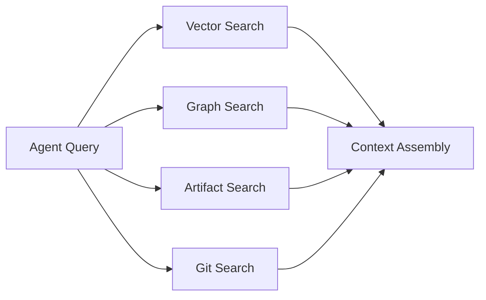

---

# 二十六、Governance：必须是 Control Plane

企业平台和个人 Coding Agent 最大区别就在这里。

Governance 不应该散落在：

```text
Prompt
Agent
MCP
CI
```

里面。

应该独立成：

# Governance Control Plane

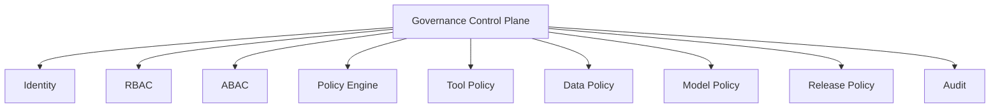

---

# 二十七、权限模型建议 RBAC + ABAC

不要只：

```text
Developer
Admin
```

而应该：

```text
Subject
+
Resource
+
Action
+
Context
```

例如：

```text
User:
Alice

Role:
Developer

Project:
Payment

Action:
production.deploy

Risk:
L5

Environment:
Production

Time:
Business Hours
```

Policy：

```text
ALLOW
IF
developer
AND
payment-team
AND
production.deploy
AND
approval == true
```

---

# 二十八、数据权限必须进入 Context Retrieval

这是很多 RAG 系统最容易犯的错误：

```text
User Query
 ↓
Vector Search
 ↓
Top 20
```

然后发现：

> Top 20 里面包含用户根本没有权限看的项目。

正确：

```text
Identity
 ↓
Authorization Filter
 ↓
Context Retrieval
 ↓
Graph
 ↓
Vector
 ↓
Artifact
```

即：

> **Permission-aware Retrieval**

---

# 二十九、推荐统一 Identity

企业已有：

```text
OIDC
OAuth2
SAML
LDAP
AD
```

平台不要自己创造身份体系。

统一：

```text
Identity Provider
       ↓
OIDC
       ↓
R&D Platform
       ↓
JWT / Session
       ↓
RBAC + ABAC
```

MCP 也走同一套 Identity / Authorization。

---

# 三十、Observability 必须覆盖 Agent，而不只是服务

传统：

```text
CPU
Memory
Latency
Error
```

AI Native：

```text
Agent
 ↓
LLM
 ↓
Prompt
 ↓
Context
 ↓
Tool
 ↓
MCP
 ↓
Code
 ↓
Test
 ↓
Eval
```

每一个都需要 Trace。

OpenTelemetry 已经提供通用 Semantic Conventions，并且 GenAI Semantic Conventions 正在专门覆盖 GenAI、MCP、Provider 等对象，因此建议不要自定义一套完全孤立的 Trace 模型，而是在 OTel 上扩展企业自己的 R&D attributes。([OpenTelemetry][5])

---

# 三十一、推荐 Agent Trace

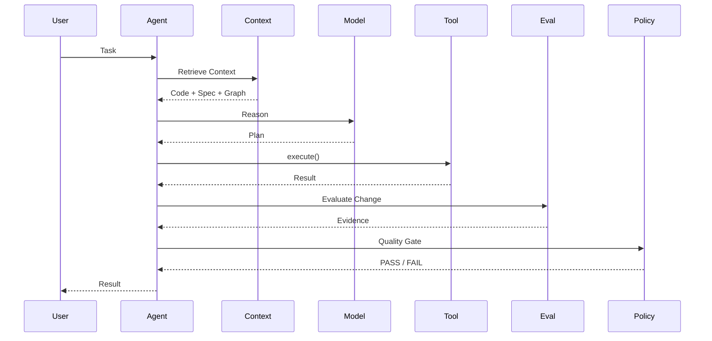

每个 span 应关联：

```text
trace_id
session_id
agent_id
task_id
artifact_id
repo
commit
model
tool
mcp_server
eval_id
evidence_id
user_id
tenant_id
```

---

# 三十二、Observability 数据模型

至少：

```text
AgentSession
AgentTurn
ModelCall
ToolCall
MCPCall
ContextRetrieval
CodeChange
TestRun
EvalRun
PolicyDecision
Evidence
CIJob
Deployment
```

全部通过：

```text
trace_id
```

串起来。

于是：

```text
Agent Session
   ↓
Model Call
   ↓
Tool Call
   ↓
Code Change
   ↓
CI
   ↓
Eval
   ↓
Evidence
   ↓
Release
```

可以完整追踪。

---

# 三十三、Eval Service 是独立平台服务

不要把 Eval 写死在 CI。

架构：

```text
                 Eval Platform

       ┌──────────┬───────────┬──────────┐
       ↓          ↓           ↓          ↓
 Functional   Security   Architecture  Agent
       ↓          ↓           ↓          ↓
       └──────────┼───────────┼──────────┘
                  ↓
             Eval Runner
                  ↓
            Evidence Store
                  ↓
             Policy Engine
```

支持：

```text
Offline Eval
PR Eval
CI Eval
Pre-release Eval
Production Eval
Agent Benchmark
Regression Eval
```

---

# 三十四、Eval Case 本身也是 Artifact

这一点非常重要：

```text
Eval
```

不能只是代码。

它应该：

```text
eval_id
version
target
scenario
input
expected
grader
threshold
environment
provenance
```

例如：

```yaml
eval:
  id: AUTH-SEC-003
  version: 4

  target:
    spec: SPEC-001

  scenario:
    name: oauth-regression

  grader:
    type: deterministic

  threshold:
    pass: true

  regression:
    source: incident-2026-031

  owner:
    team: security
```

---

# 三十五、Evidence Store 是整个质量闭环的事实层

建议：

```text
Evidence
├── TestEvidence
├── EvalEvidence
├── SecurityEvidence
├── ArchitectureEvidence
├── ReviewEvidence
├── RuntimeEvidence
└── DeploymentEvidence
```

所有 Evidence：

```text
Artifact ID
+
Version
+
Commit
+
Environment
+
Timestamp
+
Provenance
```

---

# 三十六、Release 必须是 Evidence-driven

传统：

```text
CI PASS
 ↓
Deploy
```

AI Native：

```text
Spec
 ↓
Evidence Completeness
 ↓
Required Evals
 ↓
Security
 ↓
Architecture
 ↓
Policy
 ↓
Release Certificate
 ↓
Deploy
```

---

# 三十七、Release Certificate

建议作为平台一级对象：

```yaml
release:
  id: REL-2026-0831-001

  source:
    commit: abc123

  spec:
    id: SPEC-001
    version: 4

  evidence:
    required: 12
    passed: 12

  eval:
    required: 8
    passed: 8

  security:
    status: passed

  architecture:
    status: passed

  policy:
    status: passed

  approval:
    status: approved
```

然后：

```text
Release Certificate
       ↓
Production Deployment
```

---

# 三十八、整个数据模型

现在可以把之前讨论的所有东西统一起来。

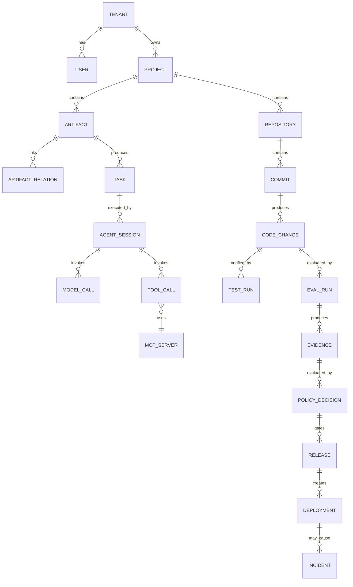

这就是我建议的 **AI R&D Platform Domain Model**。

---

# 三十九、服务拆分

如果真正落地，我建议不要一上来拆 30 个微服务。

第一阶段可以：

```text
                    API Gateway
                         │
              ┌──────────┴──────────┐
              │                     │
        R&D Control Plane      Agent Runtime
              │                     │
       ┌──────┼──────┐        ┌─────┼─────┐
       ↓      ↓      ↓        ↓     ↓     ↓
   Artifact  Policy  Project  Context Tool Eval
```

逻辑服务：

```text
1. Identity Service
2. Project Service
3. Artifact Service
4. Workflow Service
5. Agent Runtime
6. Context Engine
7. Code Graph Service
8. MCP Gateway
9. Eval Service
10. Evidence Service
11. Policy Service
12. CI/CD Adapter
13. Observability Service
14. Notification Service
```

但部署初期可以：

```text
R&D Platform Backend
 ├── Artifact Module
 ├── Workflow Module
 ├── Agent Module
 ├── Eval Module
 ├── Governance Module
 └── Integration Module
```

避免过度微服务化。

---

# 四十、推荐技术栈

结合你之前的技术栈和这个平台定位，我会这样选：

| 层             | 推荐                                 |
| -------------- | ------------------------------------ |
| Frontend       | React / Vue                          |
| API            | NestJS / Go                          |
| Agent Runtime  | TypeScript + Python/Go               |
| Workflow       | Temporal                             |
| MCP            | MCP SDK + Gateway                    |
| Artifact DB    | PostgreSQL                           |
| Code Graph     | **LadybugDB**                  |
| Cache          | Redis                                |
| Event Bus      | NATS / Kafka                         |
| Object Storage | S3 / MinIO                           |
| Vector         | pgvector / Qdrant                    |
| Search         | OpenSearch                           |
| CI             | GitHub Actions / GitLab CI / Jenkins |
| Eval           | 自研 Eval Engine                     |
| Policy         | OPA / Cedar + 自研 Policy            |
| Auth           | OIDC / OAuth2                        |
| Observability  | OpenTelemetry                        |
| Trace          | Tempo / Jaeger                       |
| Metrics        | Prometheus                           |
| Logs           | Loki / OpenSearch                    |
| Dashboard      | Grafana                              |
| Model Gateway  | LiteLLM / 自研 Gateway               |

---

# 四十一、但这里有一个非常重要的取舍

我不建议第一期同时上：

```text
Kafka
Temporal
Kubernetes
Qdrant
OpenSearch
Neo4j
LadybugDB
OPA
Cedar
```

这会直接把项目变成基础设施项目。

第一阶段：

```text
PostgreSQL
LadybugDB
Redis
S3 / MinIO
OpenTelemetry
NATS
```

已经足够。

---

# 四十二、推荐的第一阶段部署

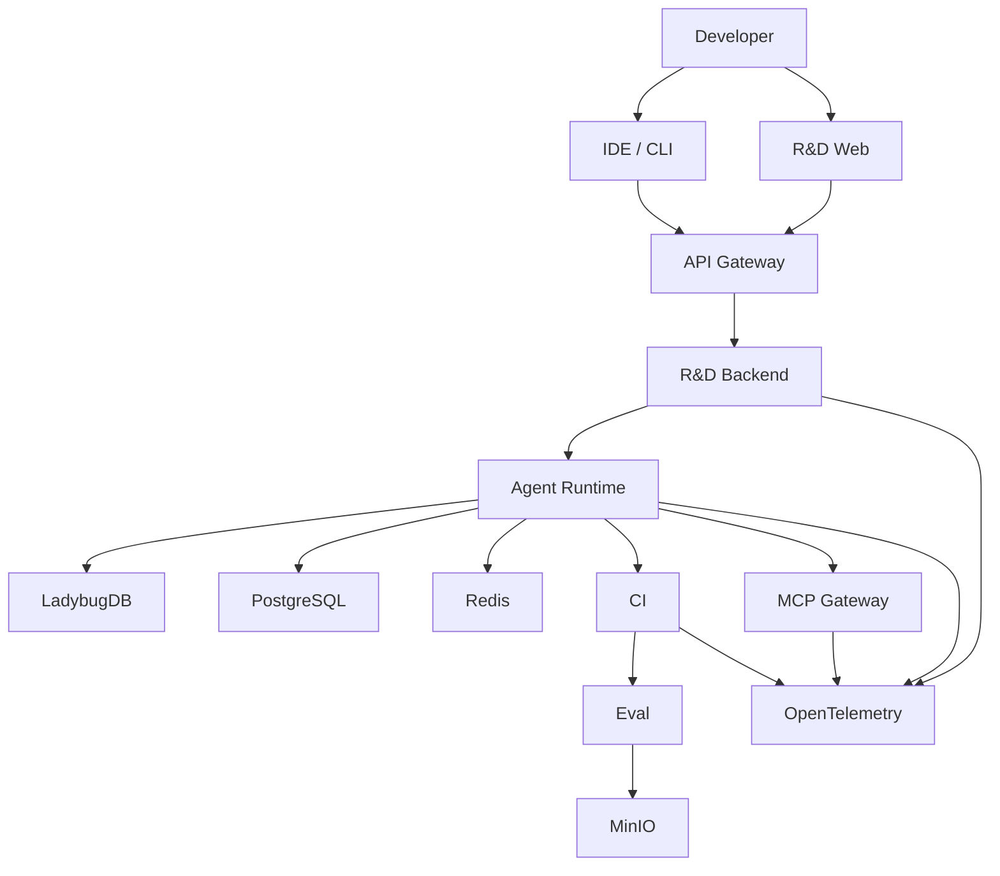

这已经能覆盖 80% 的核心价值。

---

# 四十三、第二阶段再升级

```text
Phase 1
Artifact + Agent + Graph + MCP + Eval

        ↓

Phase 2
Workflow + Policy + Evidence + CI Intelligence

        ↓

Phase 3
Multi-Agent + Autonomous Repair + Production Feedback

        ↓

Phase 4
AI Engineering Operating System
```

---

# 四十四、最终的企业级完整架构

如果把所有东西压缩成一张图，我建议最终采用：

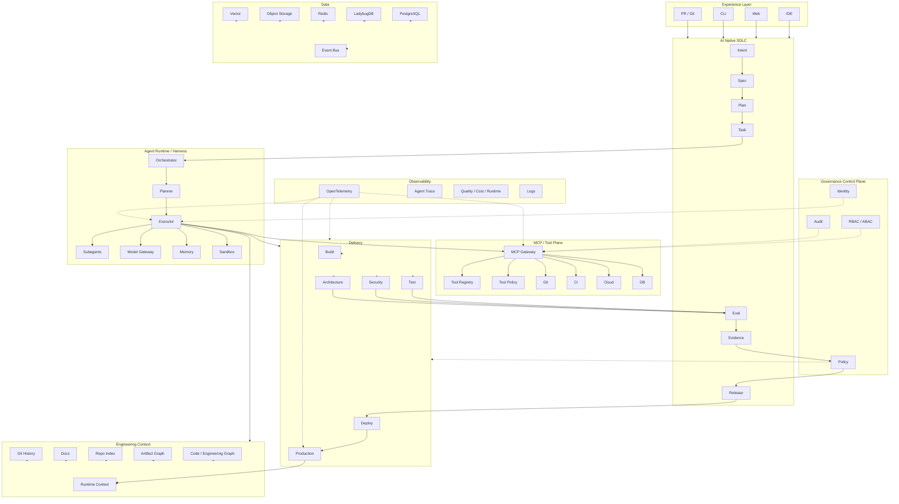

---

# 四十五、这个架构和 Anthropic / OpenAI / GitHub / Kiro 的关系

可以把它理解成把四家方案进行“架构合并”：

| 能力                | Anthropic  | OpenAI     | GitHub     | Kiro       | 本方案                  |
| ------------------- | ---------- | ---------- | ---------- | ---------- | ----------------------- |
| Intent              | ★★★★★ | ★★★★★ | ★★★★★ | ★★★     | **核心**          |
| Spec                | ★★★★★ | ★★★★   | ★★★★★ | ★★★★★ | **核心**          |
| Plan                | ★★★★★ | ★★★★★ | ★★★★★ | ★★★★★ | **核心**          |
| Task                | ★★★★   | ★★★★★ | ★★★★★ | ★★★★★ | **核心**          |
| Harness             | ★★★★   | ★★★★★ | ★★★★★ | ★★★★   | **核心**          |
| Code Graph          | ★★★     | ★★★★★ | ★★★★   | ★★★     | **核心**          |
| MCP                 | ★★★★   | ★★★★★ | ★★★★★ | ★★★★   | **核心**          |
| Eval                | ★★★★★ | ★★★★★ | ★★★★   | ★★★     | **核心**          |
| Evidence            | ★★★★★ | ★★★★   | ★★★★   | ★★★     | **核心**          |
| Governance          | ★★★★★ | ★★★★   | ★★★★★ | ★★★★   | **Control Plane** |
| Observability       | ★★★★★ | ★★★★★ | ★★★★   | ★★★     | **核心**          |
| Production Feedback | ★★★★★ | ★★★★★ | ★★★★   | ★★★     | **闭环**          |

GitHub 当前企业 Agent 管理已经包含 Agent availability、Agent sessions、MCP registry、managed settings、custom-agent governance 等能力；这验证了“Agent + Tool + Governance Control Plane”必须成为企业架构的一等公民。([GitHub Docs][2])

AWS 的企业 Agent 架构同样把 **security、observability、discoverability** 作为跨层能力，而不是单独的业务功能。([AWS文档][6])

---

# 四十六、我认为最关键的架构创新：从 AI Coding Platform 到 AI Engineering OS

传统研发平台：

```text
Requirement
    ↓
Jira
    ↓
Git
    ↓
CI
    ↓
Deploy
```

AI Coding Platform：

```text
Prompt
 ↓
Agent
 ↓
Code
```

AI Native R&D Platform：

```text
                    Intent
                       ↓
                     Spec
                       ↓
                     Plan
                       ↓
                     Task
                       ↓
              ┌────────────────┐
              │ Agent Harness  │
              └───────┬────────┘
                      ↓
           ┌─────────────────────┐
           │ Engineering Context │
           │ Code Graph          │
           │ Artifact Graph      │
           │ Git / Docs / API    │
           └──────────┬──────────┘
                      ↓
                   MCP
                      ↓
                  Tooling
                      ↓
                   Change
                      ↓
             ┌──────────────────┐
             │ Eval + Evidence  │
             └────────┬─────────┘
                      ↓
                  Governance
                      ↓
                    CI/CD
                      ↓
                 Production
                      ↓
                  Feedback
                      ↓
                    Intent
```

这才是完整的：

# **AI Engineering Operating System**

---

# 四十七、结合你之前的 10GB / 90 Workspace Monorepo，我会特别做 5 个定制化设计

这部分对你的实际场景最重要。

### ① Code Graph 成为 Agent Context Backbone

不是简单搜索代码。

```text
Agent
 ↓
Graph Query
 ↓
Impact Analysis
 ↓
Relevant Context
```

---

### ② Graph-Based CI

不是：

```text
90 workspace
全部测试
```

而：

```text
Diff
 ↓
Graph
 ↓
Affected Set
 ↓
Minimal CI
```

---

### ③ Artifact Graph + Code Graph 融合

例如：

```text
SPEC-001
 ↓
AuthService
 ↓
LoginController
 ↓
auth.e2e.ts
 ↓
EVAL-001
 ↓
EVIDENCE-001
```

这样才能回答：

> “这个需求到底有没有被代码真正实现和验证？”

---

### ④ Evidence 成为 CI 的最终输出

CI 不应该最终只返回：

```text
PASS
```

而是：

```json
{
  "decision": "PASS",
  "evidence": {
    "requirements": 12,
    "covered": 12,
    "tests": 128,
    "evals": 18,
    "security": "passed",
    "architecture": "passed"
  }
}
```

---

### ⑤ Agent 自修复闭环

最终：

```text
CI / Eval Failure
       ↓
Evidence
       ↓
Root Cause
       ↓
Agent
       ↓
Fix
       ↓
Re-Eval
```

这才是真正的：

> **Agentic CI/CD**

而不是：

> CI 给 Agent 发一条“失败了”的消息。

---

# 四十八、最终产品边界

如果让我帮你定义这个平台的产品边界，我会定成：

```text
                    AI Native R&D Platform

┌─────────────────────────────────────────────┐
│                                             │
│              R&D Experience                 │
│                                             │
├─────────────────────────────────────────────┤
│                                             │
│       Intent → Spec → Plan → Task           │
│                                             │
├─────────────────────────────────────────────┤
│                                             │
│             Agent Harness                   │
│                                             │
├─────────────────────────────────────────────┤
│                                             │
│        Engineering Context Graph            │
│                                             │
├─────────────────────────────────────────────┤
│                                             │
│              MCP / Tools                    │
│                                             │
├─────────────────────────────────────────────┤
│                                             │
│          Eval + Evidence                    │
│                                             │
├─────────────────────────────────────────────┤
│                                             │
│        Governance + Security                │
│                                             │
├─────────────────────────────────────────────┤
│                                             │
│          CI/CD + Production                 │
│                                             │
├─────────────────────────────────────────────┤
│                                             │
│      Observability + Feedback               │
│                                             │
└─────────────────────────────────────────────┘
```

---

# 四十九、最终 MVP 我反而建议砍掉一半

不要一开始做：

* 多 Agent Marketplace
* 全功能 RAG
* 自研 IDE
* 全自动 Production Deploy
* 复杂 Multi-Agent
* 全链路 AIOps
* 自研模型
* 复杂向量数据库体系

第一版只做：

```text
① Artifact Engine
   Intent / Spec / Plan / Task / Eval / Evidence

② Code Graph
   Repository → Symbol → Dependency → Impact

③ Agent Harness
   Planner / Executor / Tool / Sandbox

④ MCP Gateway
   Git / Code / CI / Graph

⑤ Eval Engine
   Test / Architecture / Security / Requirement

⑥ Evidence Engine
   Provenance / Lineage / Quality Gate

⑦ Governance
   Identity / RBAC / Policy / Audit

⑧ CI Integration
   PR → Impact → Eval → Evidence → Gate
```

这 8 个东西一旦跑通，**AI Native R&D Platform 的骨架就成立了。**

---

# 五十、我认为最终的核心数据流应该只有这一条

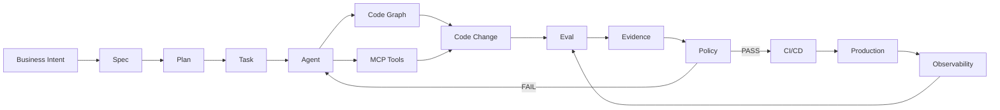

这条链实际上把我们前面几轮讨论的东西全部串起来了：

> **Spec 定义正确性 → Code Graph 提供上下文和影响分析 → Harness 驱动 Agent → MCP 提供能力 → Eval 判断行为 → Evidence 提供事实 → Governance 决定放行 → CI/CD 执行交付 → Observability 从生产反馈 → 再进入 Eval / Spec。**

---

## 最后一个架构判断

如果这是准备真正投入企业生产，我会把**架构优先级**定成：

```text
P0
Artifact + Lineage
        ↓
Code / Engineering Graph
        ↓
Agent Harness
        ↓
Eval + Evidence
        ↓
Governance

P1
MCP Gateway
        ↓
CI/CD Intelligence
        ↓
Observability

P2
Multi-Agent
        ↓
Autonomous Repair
        ↓
Production Feedback

P3
AI Engineering OS
```

其中最核心的不是 LLM，也不是 MCP。

**真正的护城河是：**

```text
                    ┌──────────────────────┐
                    │ Engineering Graph    │
                    └──────────┬───────────┘
                               │
        ┌──────────────────────┼──────────────────────┐
        ↓                      ↓                      ↓
   Artifact Lineage       Agent Context          Impact Analysis
        │                      │                      │
        └──────────────────────┼──────────────────────┘
                               ↓
                         Eval + Evidence
                               ↓
                           Governance
                               ↓
                         Continuous Loop
```

这会让你的平台和普通的 **“企业版 Cursor / Copilot / Claude Code”** 产生本质区别：**它不是帮程序员写代码，而是在建立一个能被 Agent 理解、执行、验证、审计和持续优化的企业软件工程系统。**

这也与当前业界趋势基本一致：GitHub 正把 Spec Kit 演进成可扩展的 SDLC/process harness，OpenAI 强调“Humans steer, Agents execute”以及为 Agent 建立可检查、可验证、可修改的工程环境，Anthropic 则把整个 SDLC 变成由 Artifact 和 Gate 驱动的闭环。([GitHub Docs][1])

另外，企业化一定不要把 **Governance / Observability / MCP 权限**当作后置能力。GitHub 已经把 Agent 管理、MCP 控制、企业规则和 Agent Session Monitoring 纳入企业 AI Controls；MCP 本身也已经开始标准化 OAuth 授权；OpenTelemetry 则正在形成 GenAI/MCP 的语义约定。([GitHub Docs][2])

**如果按你之前的技术背景和 10GB/90-workspace Monorepo 场景继续往下落，我下一步会直接把这套架构进一步拆成 `可开发的系统设计`：包括完整微服务边界、PostgreSQL Schema、LadybugDB Graph Schema、Artifact JSON Schema、Agent Runtime State Machine、MCP Tool Schema、Eval/Evidence Schema、RBAC/ABAC 权限模型，以及从一个真实 Feature 到 PR/CI/Release 的完整时序图。**

[1]: https://github.github.com/spec-kit/?utm_source=chatgpt.com
[2]: https://docs.github.com/en/copilot/concepts/agents/enterprise-management?utm_source=chatgpt.com
[3]: https://github.com/github/spec-kit/blob/main/spec-driven.md?utm_source=chatgpt.com
[4]: https://modelcontextprotocol.io/specification/2025-06-18/basic/authorization?utm_source=chatgpt.com
[5]: https://opentelemetry.io/docs/specs/semconv/?utm_source=chatgpt.com
[6]: https://docs.aws.amazon.com/prescriptive-guidance/latest/govern-architect-agentic-ai/enterprise-architecture.html?utm_source=chatgpt.com
