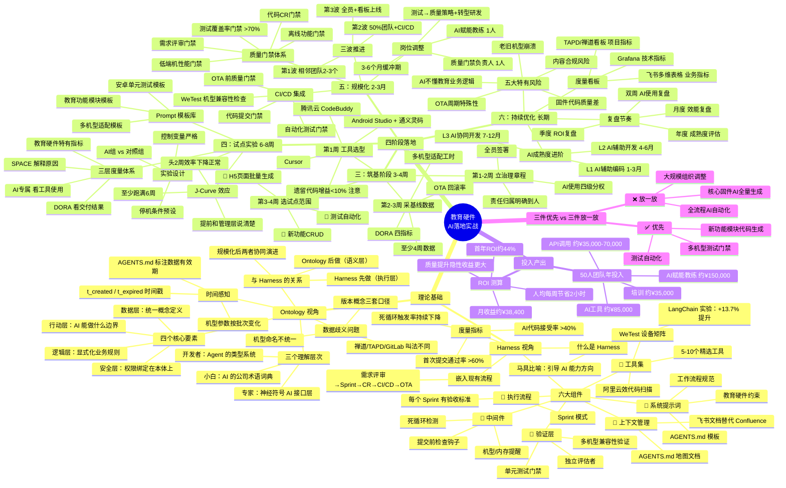

> 这张图是整个系列的全景索引。先看理论基础（Harness + Ontology），再按四个阶段落地执行。每个节点对应系列中的一篇文章。

<!-- more -->

---

---

## 系列文章导航

| 编号 | 文章 | 核心内容 |
|------|------|---------|
| 总览 | [全链路AI赋能产研提效](/2026/08/12/ailearn/business/0/) | 四阶段路线图、度量体系、ROI、避坑指南 |
| 一 | [Harness 视角](/2026/08/13/ailearn/business/1/) | 六大组件映射到教育硬件产研 |
| 二 | [Ontology 视角](/2026/08/13/ailearn/business/2/) | 语义统一、知识图谱、权限绑定 |
| 三 | [筑基阶段](/2026/08/13/ailearn/business/3/) | 工具选型、治理章程、基线采集 |
| 四 | [试点实验](/2026/08/13/ailearn/business/4/) | 对照实验、三层度量、Prompt模板库 |
| 五 | [规模化](/2026/08/13/ailearn/business/5/) | 三波推进、CI/CD集成、质量门禁 |
| 六 | [持续优化](/2026/08/13/ailearn/business/6/) | 复盘机制、成熟度进阶、避坑指南 |

> 💡 **阅读建议**：先看总览了解全局，再读一（Harness）和二（Ontology）理解理论基础，然后按三→四→五→六的顺序跟着落地执行。
