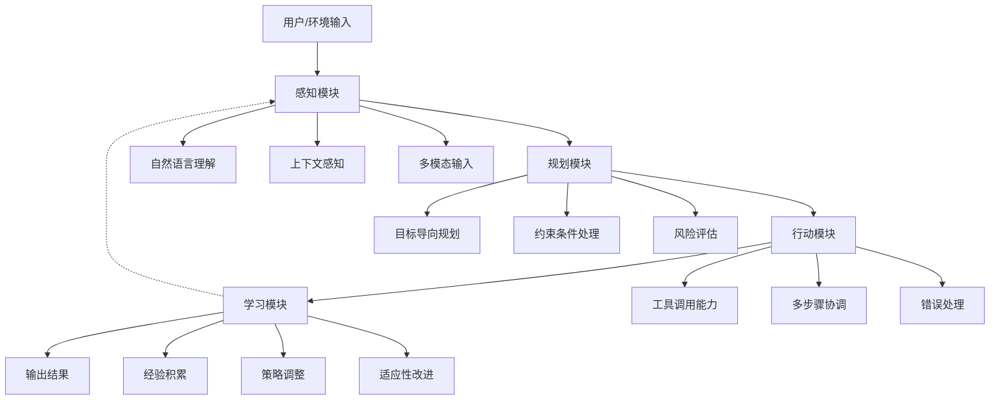
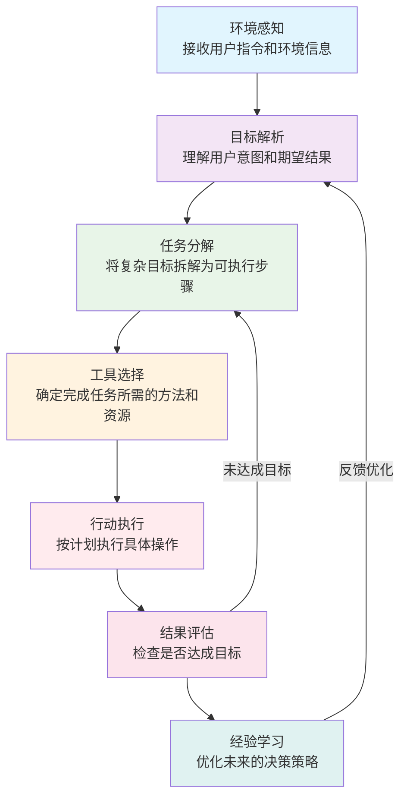

> 做一个有温度和有干货的技术分享作者 —— [Qborfy](https://qborfy.com)

今天我们来学习 **AI Agent**。

> **AI Agent**是能够**自主感知环境、制定目标、采取行动**的智能系统，它不仅仅是回答问题，而是能够**主动完成任务**的"数字助手"。

对比之前的AI模型，AI Agent就像从"答题机器"升级为"会思考的执行者"，能够理解复杂指令、分解任务、使用工具，最终达成目标。

<!-- more -->

# 是什么



## AI Agent的核心定义

**AI Agent**（人工智能代理）是指具备**自主性、反应性、目标导向性**的智能系统。与传统AI模型最大的区别在于：

- **传统AI**：被动响应，根据输入生成输出
- **AI Agent**：主动规划，为实现目标而行动

## 关键特征对比

| **能力** | 传统AI模型 | AI Agent |
|---------|-----------|----------|
| 任务理解 | 单一指令执行 | 复杂目标分解 |
| 行动方式 | 文本生成 | 多工具调用 |
| 学习能力 | 静态知识 | 动态经验积累 |
| 自主性 | 被动响应 | 主动规划 |

## AI Agent的架构组成

一个完整的AI Agent通常包含以下核心组件：

```
AI Agent = 感知模块 + 规划模块 + 行动模块 + 学习模块
```

- **感知模块**：理解环境和用户需求
- **规划模块**：制定行动计划和策略
- **行动模块**：执行具体操作和工具调用
- **学习模块**：从经验中优化行为策略

## 核心价值和应用场景

AI Agent的核心价值在于**自动化复杂工作流程**：

1. **效率提升**：自动完成重复性任务
2. **智能决策**：基于数据分析做出最优选择
3. **24/7服务**：不间断的智能助手服务
4. **错误减少**：标准化流程降低人为失误

**应用场景举例**：
- 智能客服：自动解决用户问题
- 数据分析：自动生成报告和洞察
- 代码开发：自动编写和调试代码
- 内容创作：自动生成和优化内容

# 怎么做



## AI Agent的工作原理

AI Agent的工作流程可以概括为**感知→规划→行动→学习**的循环：

1. **环境感知**：接收用户指令和环境信息
2. **目标解析**：理解用户意图和期望结果
3. **任务分解**：将复杂目标拆解为可执行步骤
4. **工具选择**：确定完成任务所需的方法和资源
5. **行动执行**：按计划执行具体操作
6. **结果评估**：检查是否达成目标
7. **经验学习**：优化未来的决策策略

## 关键组件深度解析

### 感知模块：理解世界
- **自然语言理解**：准确解析用户意图
- **上下文感知**：理解对话历史和背景
- **多模态输入**：处理文本、图像、语音等

### 规划模块：制定策略
- **目标导向规划**：以结果为导向的行动计划
- **约束条件处理**：考虑时间、资源等限制
- **风险评估**：预测行动的可能后果

### 行动模块：执行任务
- **工具调用能力**：使用API、软件、设备等
- **多步骤协调**：管理复杂的操作序列
- **错误处理**：应对执行过程中的意外情况

### 学习模块：持续优化
- **经验积累**：从成功和失败中学习
- **策略调整**：优化决策逻辑和行为模式
- **适应性改进**：适应环境变化和新需求

## AI Agent的分类

根据自主程度和能力范围，AI Agent可以分为：

### 按自主程度分类
- **反应型Agent**：简单响应环境刺激
- **目标导向型Agent**：为实现特定目标而行动
- **效用型Agent**：追求最大效用或收益
- **学习型Agent**：从经验中改进性能

### 按应用领域分类
- **对话Agent**：智能客服、虚拟助手
- **任务Agent**：自动化工作流程执行
- **创意Agent**：内容创作、设计辅助
- **分析Agent**：数据洞察、决策支持

## 技术实现栈

开发AI Agent通常涉及的技术：

```
基础层：大语言模型（GPT、Claude等）
框架层：LangChain、AutoGPT、BabyAGI等
工具层：API集成、软件调用、设备控制
平台层：部署环境、监控系统、用户界面
```

# 经典案例

## 实际应用场景

### 1. 智能代码助手
- **功能**：自动编写、调试、优化代码
- **代表产品**：GitHub Copilot、Cursor AI
- **价值**：提升开发效率，减少错误

### 2. 数据分析Agent
- **功能**：自动分析数据、生成报告、提供洞察
- **应用场景**：商业智能、市场分析、运营监控
- **优势**：快速处理大量数据，发现隐藏模式

### 3. 内容创作Agent
- **功能**：自动生成文章、设计图像、制作视频
- **工具**：ChatGPT、Midjourney、Runway ML
- **特点**：创意辅助，风格一致性保持

### 4. 客户服务Agent
- **功能**：24/7自动客服，问题解决，订单处理
- **优势**：降低成本，提高响应速度
- **发展**：从简单问答到复杂问题解决

## 知名AI Agent产品

### Claude Code
- **特点**：专业的代码理解和生成能力
- **优势**：支持多种编程语言，理解项目上下文
- **应用**：代码审查、调试、重构建议

### AutoGPT
- **特点**：高度自主的任务执行能力
- **创新**：能够自我设定目标和规划行动
- **局限**：需要明确的约束和监控

### LangChain Agents
- **特点**：灵活的Agent构建框架
- **优势**：丰富的工具集成和模块化设计
- **适用**：定制化Agent开发

# 动手试试！

## 体验AI Agent能力

### 1. 使用Claude Code
打开 [Claude Code](https://claude.ai/code) 或类似平台：

1. **简单任务**：让Agent帮你写一个Python函数
2. **复杂任务**：要求Agent分析代码问题并修复
3. **多步骤任务**：让Agent完成完整的小项目

### 2. 尝试AutoGPT概念
虽然完整的AutoGPT需要技术设置，但可以体验其理念：

1. **明确目标**："帮我研究某个主题并生成报告"
2. **分解步骤**：观察Agent如何规划研究、分析、写作
3. **工具使用**：看Agent如何调用搜索、文档处理等工具

### 3. 构建简单Agent
使用在线平台如 [LangChain Playground](https://python.langchain.com/)：

```python
# 简单Agent示例
from langchain.agents import initialize_agent, Tool
from langchain.llms import OpenAI

# 定义工具
tools = [
    Tool(
        name="Calculator",
        func=lambda x: str(eval(x)),
        description="用于数学计算"
    )
]

# 初始化Agent
agent = initialize_agent(tools, OpenAI(temperature=0), agent="zero-shot-react-description")

# 测试
result = agent.run("计算(25 * 4) + 18的结果")
print(result)  # 输出: 118
```

# 进阶知识

## AI Agent的发展趋势

### 1. 多模态能力增强
- **现状**：主要处理文本
- **趋势**：整合视觉、听觉、触觉等多模态感知
- **影响**：更全面的环境理解和交互能力

### 2. 长期记忆和上下文理解
- **挑战**：当前Agent记忆有限
- **发展**：长期记忆机制，持续学习能力
- **价值**：个性化服务，深度理解用户需求

### 3. 工具使用专业化
- **现状**：通用工具调用
- **趋势**：专业领域工具深度集成
- **示例**：医疗诊断工具、法律分析工具等

### 4. 协作和群体智能
- **单个Agent**：能力有限
- **多Agent协作**：分工合作，解决复杂问题
- **应用**：大型项目管理、复杂系统分析

## 技术挑战和未来展望

### 当前挑战
1. **安全性**：防止恶意使用和意外后果
2. **可靠性**：确保行动的可预测性和稳定性
3. **透明度**：理解Agent的决策逻辑
4. **伦理问题**：责任归属和道德考量

### 未来发展方向
- **通用人工智能**：向人类水平的智能迈进
- **人机协作**：Agent作为智能合作伙伴
- **社会集成**：Agent在社会各领域的深度应用
- **自我进化**：Agent能够自我改进和适应

# 总结

AI Agent代表了人工智能发展的新阶段，从被动的问答工具转变为主动的问题解决者。关键要点：

1. **核心转变**：从"回答问题"到"完成任务"
2. **架构关键**：感知、规划、行动、学习的完整循环
3. **价值所在**：自动化复杂工作流程，提升效率
4. **发展趋势**：多模态、长期记忆、专业化工具使用

掌握AI Agent的概念和应用，将帮助我们在AI时代更好地利用这一强大技术。

# 参考资料

- [AI Agent 概念解析 - Anthropic官方文档](https://www.anthropic.com/news)
- [LangChain Agents 教程](https://python.langchain.com/docs/modules/agents/)
- [AutoGPT 项目介绍](https://github.com/Significant-Gravitas/AutoGPT)
- [AI Agent 发展趋势分析 - MIT Technology Review](https://www.technologyreview.com/)
