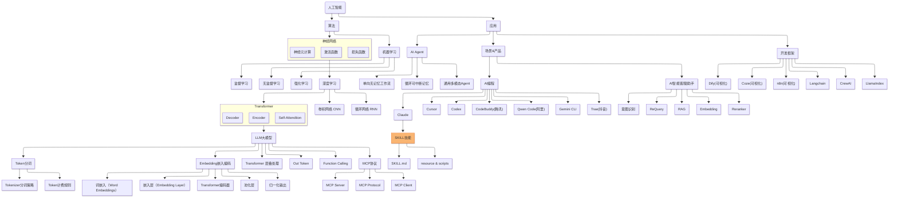
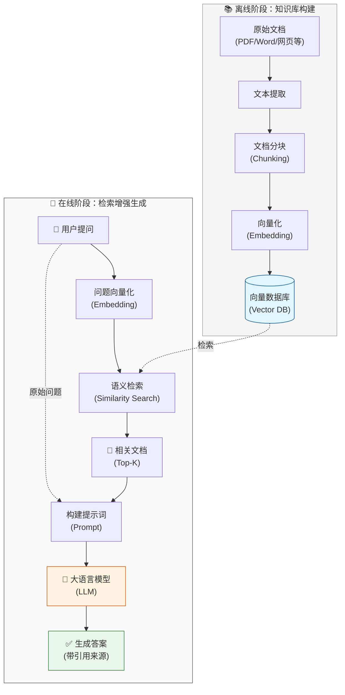

> 做一个有温度和有干货的技术分享作者 —— [Qborfy](https://qborfy.com)

今天我们来学习 **RAG（Retrieval-Augmented Generation）检索增强生成**

> 一句话核心: **RAG** 是一种让大模型能够"查资料再回答"的技术，通过检索外部知识库来增强生成内容的准确性和时效性。

通俗地讲，如果把大模型比作一个学生，传统模型就像"闭卷考试"——只能凭借训练时记住的知识回答问题。而 RAG 就像"开卷考试"——遇到问题时，可以先翻书查资料，然后基于查到的内容给出更准确的答案。

需要注意的是，RAG 并不是让模型"记住"新知识，而是在回答问题时动态地从外部知识库中检索相关信息，然后将这些信息作为上下文提供给模型。

它的核心价值在于**解决大模型的知识局限性**：包括知识过时、缺乏专业领域知识、容易产生幻觉（编造不存在的信息）等问题。通过 RAG，我们可以让模型访问最新的、专业的、私有的知识，而无需重新训练模型。

<!-- more -->

# 是什么



通过一张图来理解 RAG 的工作原理：



**RAG 工作流程说明**：

这个流程的核心在于，用户的问题会经过**两个关键阶段**：

1. **离线阶段（知识库构建）**：

   - 将原始文档进行文本提取和分块处理
   - 使用 Embedding 模型将文本块转换为向量
   - 存储到向量数据库中，这个过程只需要执行一次

2. **在线阶段（检索增强生成）**：
   - 用户提问后，先将问题向量化
   - 在向量数据库中进行语义检索，找到最相关的文档块
   - 将检索到的文档和原始问题一起构建提示词
   - 输入大模型生成最终答案，并附带引用来源

## RAG 的核心组成

一个完整的 RAG 系统通常包含以下几个关键部分：

### 1. 知识库构建

**文档处理流程**：

```
原始文档 → 文本提取 → 分块（Chunking） → 向量化（Embedding） → 存入向量数据库
```

- **文档加载**：支持 PDF、Word、网页、Markdown 等多种格式
- **文本分块**：将长文档切分成小块，便于检索和处理
- **向量化**：使用 Embedding 模型将文本转换为向量
- **向量存储**：将向量存入专门的向量数据库

### 2. 检索系统

- **语义检索**：基于问题的语义含义找到相关文档
- **混合检索**：结合关键词检索和语义检索
- **重排序（Reranking）**：对检索结果进行二次排序，提高相关性

### 3. 生成系统

- **提示词工程**：设计合适的 Prompt 模板
- **上下文管理**：控制输入大模型的文档长度
- **答案生成**：基于检索内容生成最终回答

## RAG vs 其他方法对比

| **维度** | 传统大模型   | Fine-tuning  | RAG                  |
| -------- | ------------ | ------------ | -------------------- |
| 知识更新 | 需要重新训练 | 需要重新微调 | 实时更新文档即可     |
| 成本     | 推理成本     | 训练成本高   | 中等（检索+推理）    |
| 准确性   | 可能产生幻觉 | 较准确但固化 | 基于真实文档，可追溯 |
| 专业知识 | 通用知识     | 可定制       | 灵活添加专业文档     |
| 可解释性 | 黑盒         | 黑盒         | 可追溯到源文档       |

# 怎么做

下面我们通过几个案例来理解 RAG 的使用场景和实现方式。

## 案例 1：企业知识库问答系统

这是 RAG 最经典的应用场景，帮助员工快速查询公司内部文档。

**场景描述**：

- 公司有大量内部文档：产品手册、技术文档、规章制度等
- 员工需要快速找到相关信息
- 传统搜索只能找到文档，还需要人工阅读

**RAG 解决方案**：

```python
from langchain.embeddings import OpenAIEmbeddings
from langchain.vectorstores import Chroma
from langchain.text_splitter import RecursiveCharacterTextSplitter

# 1. 文档准备阶段（离线处理）
documents = [
    "公司年假政策：员工入职满一年享有5天年假...",
    "报销流程：员工需在费用发生后30天内提交...",
    "技术栈规范：前端统一使用 React + TypeScript..."
]

# 2. 文本分块
text_splitter = RecursiveCharacterTextSplitter(
    chunk_size=500,
    chunk_overlap=50
)
chunks = text_splitter.create_documents(documents)

# 3. 文档向量化并存储
embeddings = OpenAIEmbeddings()
vectorstore = Chroma.from_documents(chunks, embeddings)

# 4. 用户提问
question = "我入职半年了，可以请年假吗？"

# 5. 检索相关文档
relevant_docs = vectorstore.similarity_search(question, k=3)

# 6. 构建提示词
prompt = f"""
基于以下文档内容回答问题：

文档内容：
{relevant_docs[0].page_content}

用户问题：{question}

请基于文档内容准确回答，如果文档中没有相关信息，请明确说明。
"""

# 7. 调用大模型生成答案
from openai import OpenAI
client = OpenAI()

response = client.chat.completions.create(
    model="gpt-4",
    messages=[{"role": "user", "content": prompt}]
)

print(response.choices[0].message.content)
# 输出：根据公司年假政策，员工需要入职满一年才能享有年假。
# 您目前入职半年，暂时还不符合年假申请条件。
```

## 案例 2：智能客服系统

**场景**：电商平台需要自动回答用户关于商品、物流、售后的问题。

**实现要点**：

- **知识库**：商品信息、常见问题、物流政策、售后流程
- **检索策略**：混合检索（关键词 + 语义）
- **答案生成**：友好的对话式回答

```python
from langchain.chains import RetrievalQA
from langchain.llms import OpenAI

# 创建 RAG 链
qa_chain = RetrievalQA.from_chain_type(
    llm=OpenAI(temperature=0),
    chain_type="stuff",  # 将所有检索文档一次性输入
    retriever=vectorstore.as_retriever(search_kwargs={"k": 3}),
    return_source_documents=True  # 返回源文档
)

# 用户提问
result = qa_chain({"query": "iPhone 15 Pro 支持哪些颜色？"})

print(f"答案：{result['result']}")
print(f"来源：{result['source_documents'][0].metadata['source']}")
```

## 案例 3：学术论文助手

**场景**：研究人员需要快速查询和理解大量学术论文。

**技术亮点**：

- **文档分块策略**：按段落或固定长度分块
- **元数据管理**：保存论文标题、作者、发表时间等
- **引用追踪**：显示答案来自哪篇论文的哪个部分

```python
from langchain.document_loaders import PyPDFLoader

# 1. 加载 PDF 论文
loader = PyPDFLoader("research_paper.pdf")
documents = loader.load()

# 2. 智能分块
text_splitter = RecursiveCharacterTextSplitter(
    chunk_size=1000,  # 每块最大字符数
    chunk_overlap=200,  # 块之间重叠字符数
    separators=["\n\n", "\n", "。", "！", "？", " ", ""]
)
chunks = text_splitter.split_documents(documents)

# 3. 添加元数据
for i, chunk in enumerate(chunks):
    chunk.metadata.update({
        "source": "research_paper.pdf",
        "page": chunk.metadata.get("page", 0),
        "chunk_id": i
    })

# 4. 存入向量数据库
vectorstore = Chroma.from_documents(chunks, embeddings)
```

## 实战案例：完整的 RAG 系统

下面我们用 LangChain 实现一个完整的 RAG 系统：

```python
from langchain.document_loaders import DirectoryLoader, TextLoader
from langchain.text_splitter import RecursiveCharacterTextSplitter
from langchain.embeddings import OpenAIEmbeddings
from langchain.vectorstores import Chroma
from langchain.chains import RetrievalQA
from langchain.llms import OpenAI

# ========== 第一步：文档加载 ==========
print("正在加载文档...")
loader = DirectoryLoader(
    './knowledge_base/',  # 知识库目录
    glob="**/*.txt",      # 加载所有 txt 文件
    loader_cls=TextLoader
)
documents = loader.load()
print(f"已加载 {len(documents)} 个文档")

# ========== 第二步：文档分块 ==========
print("正在分块处理...")
text_splitter = RecursiveCharacterTextSplitter(
    chunk_size=500,
    chunk_overlap=50
)
chunks = text_splitter.split_documents(documents)
print(f"已分割为 {len(chunks)} 个文本块")

# ========== 第三步：向量化并存储 ==========
print("正在向量化...")
embeddings = OpenAIEmbeddings()
vectorstore = Chroma.from_documents(
    documents=chunks,
    embedding=embeddings,
    persist_directory="./chroma_db"  # 持久化存储
)
print("向量数据库已创建")

# ========== 第四步：创建 RAG 链 ==========
qa_chain = RetrievalQA.from_chain_type(
    llm=OpenAI(temperature=0, model="gpt-4"),
    chain_type="stuff",
    retriever=vectorstore.as_retriever(
        search_type="similarity",
        search_kwargs={"k": 3}  # 检索最相关的 3 个文档块
    ),
    return_source_documents=True
)

# ========== 第五步：交互式问答 ==========
print("\n知识库问答系统已启动！输入 'quit' 退出\n")

while True:
    question = input("请输入问题：")
    if question.lower() == 'quit':
        break

    result = qa_chain({"query": question})

    print(f"\n答案：{result['result']}\n")
    print("参考来源：")
    for i, doc in enumerate(result['source_documents'], 1):
        print(f"{i}. {doc.metadata.get('source', '未知来源')}")
    print("-" * 50 + "\n")
```

## 进阶技巧

### 1. 混合检索（Hybrid Search）

结合关键词检索和语义检索，提高准确率：

```python
from langchain.retrievers import BM25Retriever, EnsembleRetriever

# 关键词检索器
bm25_retriever = BM25Retriever.from_documents(chunks)
bm25_retriever.k = 3

# 语义检索器
semantic_retriever = vectorstore.as_retriever(search_kwargs={"k": 3})

# 混合检索器
ensemble_retriever = EnsembleRetriever(
    retrievers=[bm25_retriever, semantic_retriever],
    weights=[0.5, 0.5]  # 各占 50% 权重
)
```

### 2. 重排序（Reranking）

对检索结果进行二次排序，提高相关性：

```python
from langchain.retrievers import ContextualCompressionRetriever
from langchain.retrievers.document_compressors import CohereRerank

# 使用 Cohere 的重排序模型
compressor = CohereRerank(model="rerank-english-v2.0")
compression_retriever = ContextualCompressionRetriever(
    base_compressor=compressor,
    base_retriever=vectorstore.as_retriever()
)
```

### 3. 多查询检索（Multi-Query Retrieval）

自动生成多个相关查询，扩大检索范围：

```python
from langchain.retrievers.multi_query import MultiQueryRetriever

multi_query_retriever = MultiQueryRetriever.from_llm(
    retriever=vectorstore.as_retriever(),
    llm=OpenAI(temperature=0)
)

# 会自动生成多个相关问题进行检索
results = multi_query_retriever.get_relevant_documents(
    "什么是 RAG？"
)
```

# ❄️ 冷知识

1. **分块大小很关键**：`chunk_size` 太小会丢失上下文，太大会引入噪音。一般建议 500-1000 字符，具体取决于文档类型。中文文档通常比英文需要更小的 `chunk_size`。

2. **Overlap 不是越大越好**：`chunk_overlap`（重叠部分）是为了避免重要信息被切断，但过大会导致重复内容过多，影响检索效率。一般设置为 `chunk_size` 的 10-20%。

3. **向量数据库的选择**：

   - **Chroma**：轻量级，适合原型开发
   - **Pinecone**：云服务，适合生产环境
   - **Milvus**：开源，适合大规模部署
   - **Weaviate**：支持混合检索，功能强大

4. **Embedding 模型的影响**：不同的 Embedding 模型会显著影响检索效果。OpenAI 的 `text-embedding-3-large` 效果好但成本高，国产模型如智谱的 `embedding-2` 性价比更高。

5. **RAG 的"幻觉"问题**：虽然 RAG 能减少幻觉，但如果检索到的文档不相关，模型仍可能基于错误信息生成答案。因此**检索质量是 RAG 系统的核心**。

6. **与 Function Calling 的关系**：RAG 可以看作是一种特殊的 Function Calling，其中"函数"就是"检索知识库"。实际应用中，两者常常结合使用：用 Function Calling 决定何时需要检索，用 RAG 执行检索和生成。

7. **GraphRAG 的兴起**：微软提出的 GraphRAG 将知识库构建为知识图谱，能够更好地理解实体关系和复杂查询，是 RAG 技术的重要发展方向。

# 参考资料

- [LangChain RAG 官方教程](https://python.langchain.com/docs/use_cases/question_answering/)
- [OpenAI Embeddings 文档](https://platform.openai.com/docs/guides/embeddings)
- [Pinecone RAG 最佳实践](https://www.pinecone.io/learn/retrieval-augmented-generation/)
- [微软 GraphRAG 论文](https://arxiv.org/abs/2404.16130)
- [LlamaIndex RAG 框架](https://docs.llamaindex.ai/en/stable/)
