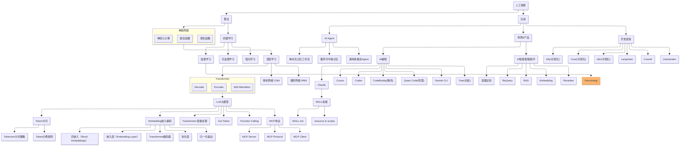
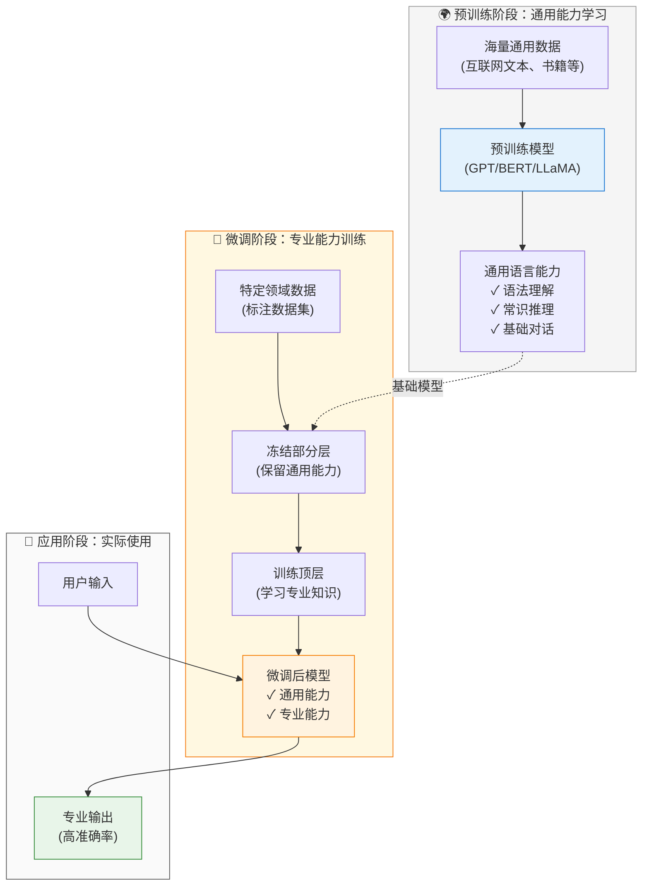

> 做一个有温度和有干货的技术分享作者 —— [Qborfy](https://qborfy.com)

今天我们来学习 **Fine-tuning（模型微调）**

> 一句话核心: **Fine-tuning** 是在预训练模型的基础上，使用特定领域的数据进行二次训练，让模型更好地适应特定任务的技术。

通俗地讲，如果把预训练模型比作一个"通才"大学生，那么 Fine-tuning 就像是让这个学生去某个公司实习，通过实际工作场景的训练，让他成为这个领域的"专才"。

需要注意的是，Fine-tuning 不是从零开始训练模型，而是在已有模型的基础上进行"微调"。就像你不需要重新学习语言，只需要学习某个行业的专业术语和工作方式。

它的核心价值在于**让通用模型适应特定场景**：包括提高特定任务的准确率、学习特定领域知识、适应特定的输出格式、降低推理成本等。通过 Fine-tuning，我们可以用较小的成本获得接近专用模型的效果。

<!-- more -->

# 是什么



通过一张图来理解 Fine-tuning 的工作原理：



**Fine-tuning 工作流程说明**：

这个流程的核心在于**三个关键阶段**：

1. **预训练阶段（Pre-training）**：

   - 使用海量通用数据训练基础模型
   - 学习语言的基本规律和常识
   - 这个阶段成本极高，通常由大公司完成

2. **微调阶段（Fine-tuning）**：

   - 使用特定领域的标注数据
   - 冻结模型的大部分参数（保留通用能力）
   - 只训练顶层参数（学习专业知识）
   - 成本相对较低，普通团队也能完成

3. **应用阶段（Inference）**：
   - 模型同时具备通用能力和专业能力
   - 在特定任务上表现更好
   - 可能比原始模型更快、更便宜

## Fine-tuning 的核心组成

一个完整的 Fine-tuning 流程通常包含以下几个关键部分：

### 1. 数据准备

**数据格式示例**（OpenAI 格式）：

```json
{
  "messages": [
    { "role": "system", "content": "你是一个专业的医疗助手" },
    { "role": "user", "content": "我头痛怎么办？" },
    { "role": "assistant", "content": "头痛的原因有很多...建议您..." }
  ]
}
```

- **数据收集**：收集特定领域的对话或文本数据
- **数据清洗**：去除噪音、统一格式
- **数据标注**：确保高质量的输入-输出对
- **数据分割**：训练集、验证集、测试集

### 2. 模型选择

- **基础模型**：选择合适的预训练模型（GPT-3.5、LLaMA、BERT 等）
- **模型大小**：根据任务复杂度和资源选择模型规模
- **开源 vs 闭源**：OpenAI API、Hugging Face 模型等

### 3. 训练策略

- **全量微调（Full Fine-tuning）**：更新所有参数，效果最好但成本最高
- **参数高效微调（PEFT）**：只更新部分参数，如 LoRA、Adapter
- **提示微调（Prompt Tuning）**：只训练提示词的嵌入向量

### 4. 评估与优化

- **性能评估**：准确率、F1 分数、困惑度等指标
- **过拟合检测**：监控训练集和验证集的性能差异
- **超参数调优**：学习率、批次大小、训练轮数等

## Fine-tuning vs 其他方法对比

| **维度**   | Prompt Engineering | RAG              | Fine-tuning       |
| ---------- | ------------------ | ---------------- | ----------------- |
| 成本       | 极低               | 低-中            | 中-高             |
| 技术门槛   | 低                 | 中               | 高                |
| 知识更新   | 实时               | 实时             | 需要重新训练      |
| 适用场景   | 简单任务           | 知识密集型任务   | 特定格式/风格任务 |
| 效果稳定性 | 不稳定             | 较稳定           | 非常稳定          |
| 推理速度   | 慢（长提示词）     | 慢（检索+生成）  | 快                |
| 数据需求   | 无                 | 文档库           | 标注数据集        |
| 可解释性   | 高                 | 高（可追溯来源） | 低（黑盒）        |

# 怎么做

下面我们通过几个案例来理解 Fine-tuning 的使用场景和实现方式。

## 案例 1：客服对话风格微调

这是 Fine-tuning 最常见的应用场景，让模型学习特定的对话风格和回答模式。

**场景描述**：

- 公司有特定的客服话术和回答风格
- 需要模型始终保持专业、友好的语气
- 对常见问题有标准化的回答模板

**数据准备**：

```python
# training_data.jsonl
{"messages": [
    {"role": "system", "content": "你是XX公司的客服助手，回答要专业、友好、简洁"},
    {"role": "user", "content": "如何退货？"},
    {"role": "assistant", "content": "您好！退货流程如下：\n1. 登录账户进入订单页面\n2. 选择需要退货的商品\n3. 填写退货原因\n4. 等待审核通过后寄回商品\n\n如有疑问，随时联系我们！"}
]}

{"messages": [
    {"role": "system", "content": "你是XX公司的客服助手，回答要专业、友好、简洁"},
    {"role": "user", "content": "发货要多久？"},
    {"role": "assistant", "content": "您好！我们的发货时效如下：\n- 现货商品：24小时内发货\n- 预售商品：按预售说明发货\n- 定制商品：7-15个工作日\n\n您可以在订单详情中查看具体发货时间哦！"}
]}
```

**使用 OpenAI API 进行微调**：

```python
from openai import OpenAI
client = OpenAI()

# 1. 上传训练数据
file = client.files.create(
    file=open("training_data.jsonl", "rb"),
    purpose="fine-tune"
)

# 2. 创建微调任务
fine_tune = client.fine_tuning.jobs.create(
    training_file=file.id,
    model="gpt-3.5-turbo",
    hyperparameters={
        "n_epochs": 3,  # 训练轮数
        "batch_size": 4,
        "learning_rate_multiplier": 0.1
    }
)

print(f"微调任务 ID: {fine_tune.id}")

# 3. 监控训练进度
import time
while True:
    status = client.fine_tuning.jobs.retrieve(fine_tune.id)
    print(f"状态: {status.status}")

    if status.status == "succeeded":
        print(f"微调完成！模型 ID: {status.fine_tuned_model}")
        break
    elif status.status == "failed":
        print(f"微调失败: {status.error}")
        break

    time.sleep(60)  # 每分钟检查一次

# 4. 使用微调后的模型
response = client.chat.completions.create(
    model=status.fine_tuned_model,
    messages=[
        {"role": "system", "content": "你是XX公司的客服助手"},
        {"role": "user", "content": "我想退货"}
    ]
)

print(response.choices[0].message.content)
```

## 案例 2：代码生成模型微调

**场景**：让模型学习公司的代码规范和常用模式。

**数据准备**：

````python
# code_training_data.jsonl
{"messages": [
    {"role": "system", "content": "你是一个 Python 代码助手，遵循 PEP 8 规范"},
    {"role": "user", "content": "写一个读取 JSON 文件的函数"},
    {"role": "assistant", "content": "```python\nimport json\nfrom typing import Dict, Any\nfrom pathlib import Path\n\ndef read_json_file(file_path: str) -> Dict[str, Any]:\n    \"\"\"读取 JSON 文件并返回字典\n    \n    Args:\n        file_path: JSON 文件路径\n        \n    Returns:\n        解析后的字典对象\n        \n    Raises:\n        FileNotFoundError: 文件不存在\n        json.JSONDecodeError: JSON 格式错误\n    \"\"\"\n    path = Path(file_path)\n    \n    if not path.exists():\n        raise FileNotFoundError(f\"文件不存在: {file_path}\")\n    \n    with path.open('r', encoding='utf-8') as f:\n        return json.load(f)\n```"}
]}
````

**使用 Hugging Face 进行微调**：

```python
from transformers import AutoModelForCausalLM, AutoTokenizer, TrainingArguments, Trainer
from datasets import load_dataset

# 1. 加载基础模型
model_name = "codellama/CodeLlama-7b-hf"
model = AutoModelForCausalLM.from_pretrained(model_name)
tokenizer = AutoTokenizer.from_pretrained(model_name)

# 2. 准备数据集
dataset = load_dataset("json", data_files="code_training_data.jsonl")

def tokenize_function(examples):
    return tokenizer(examples["text"], truncation=True, max_length=512)

tokenized_dataset = dataset.map(tokenize_function, batched=True)

# 3. 设置训练参数
training_args = TrainingArguments(
    output_dir="./code-model-finetuned",
    num_train_epochs=3,
    per_device_train_batch_size=4,
    save_steps=500,
    save_total_limit=2,
    learning_rate=2e-5,
    warmup_steps=100,
    logging_steps=10,
)

# 4. 创建训练器
trainer = Trainer(
    model=model,
    args=training_args,
    train_dataset=tokenized_dataset["train"],
)

# 5. 开始训练
trainer.train()

# 6. 保存模型
model.save_pretrained("./code-model-final")
tokenizer.save_pretrained("./code-model-final")
```

## 案例 3：使用 LoRA 进行参数高效微调

**LoRA（Low-Rank Adaptation）** 是一种参数高效的微调方法，只训练少量参数就能达到接近全量微调的效果。

**优势**：

- 训练速度快 10 倍以上
- 显存占用少 3 倍以上
- 可以同时维护多个微调版本

**实现代码**：

```python
from peft import LoraConfig, get_peft_model, TaskType
from transformers import AutoModelForCausalLM, AutoTokenizer

# 1. 加载基础模型
model = AutoModelForCausalLM.from_pretrained("meta-llama/Llama-2-7b-hf")
tokenizer = AutoTokenizer.from_pretrained("meta-llama/Llama-2-7b-hf")

# 2. 配置 LoRA
lora_config = LoraConfig(
    task_type=TaskType.CAUSAL_LM,
    r=8,  # LoRA 秩，越大效果越好但训练越慢
    lora_alpha=32,  # LoRA 缩放参数
    lora_dropout=0.1,
    target_modules=["q_proj", "v_proj"],  # 要应用 LoRA 的模块
)

# 3. 应用 LoRA
model = get_peft_model(model, lora_config)

# 4. 查看可训练参数
model.print_trainable_parameters()
# 输出：trainable params: 4,194,304 || all params: 6,742,609,920 || trainable%: 0.06%

# 5. 训练（使用标准 Trainer）
from transformers import Trainer, TrainingArguments

training_args = TrainingArguments(
    output_dir="./lora-model",
    num_train_epochs=3,
    per_device_train_batch_size=8,  # LoRA 可以用更大的 batch size
    learning_rate=3e-4,
)

trainer = Trainer(
    model=model,
    args=training_args,
    train_dataset=tokenized_dataset,
)

trainer.train()

# 6. 保存 LoRA 权重（只有几 MB）
model.save_pretrained("./lora-weights")
```

## 案例 4：医疗问答模型微调

**场景**：训练一个能够回答医疗健康问题的专业模型。

**数据准备要点**：

```python
# medical_qa_data.jsonl
{"messages": [
    {"role": "system", "content": "你是一个专业的医疗健康助手，提供准确、负责任的健康建议"},
    {"role": "user", "content": "高血压患者饮食要注意什么？"},
    {"role": "assistant", "content": "高血压患者的饮食建议：\n\n1. **限制钠盐摄入**：每天不超过6克\n2. **增加钾的摄入**：多吃香蕉、土豆、菠菜\n3. **控制总热量**：避免肥胖\n4. **减少饱和脂肪**：少吃动物内脏、肥肉\n5. **戒烟限酒**：吸烟饮酒会升高血压\n\n⚠️ 重要提示：以上建议仅供参考，具体饮食方案请咨询您的主治医生。"}
]}
```

**关键注意事项**：

- **数据质量**：医疗数据必须经过专业人士审核
- **免责声明**：模型回答要包含"请咨询医生"等提示
- **安全过滤**：避免模型给出危险建议
- **持续更新**：医疗知识更新快，需要定期重新微调

## 实战技巧

### 1. 数据质量比数量更重要

```python
# ❌ 错误：大量低质量数据
# 10000 条数据，但很多格式不统一、回答质量差

# ✅ 正确：少量高质量数据
# 500 条精心标注的数据，格式统一、回答准确
```

**建议**：

- 从 50-100 条高质量数据开始
- 逐步增加到 500-1000 条
- 定期审查和清洗数据

### 2. 合理设置训练参数

```python
# 推荐的训练参数
training_args = TrainingArguments(
    num_train_epochs=3,  # 一般 3-5 轮足够
    learning_rate=2e-5,  # 学习率不要太大
    per_device_train_batch_size=4,  # 根据显存调整
    warmup_steps=100,  # 预热步数
    weight_decay=0.01,  # 权重衰减防止过拟合
    logging_steps=10,  # 每 10 步记录一次
    eval_steps=100,  # 每 100 步评估一次
    save_steps=500,  # 每 500 步保存一次
)
```

### 3. 监控过拟合

```python
# 使用验证集监控
from sklearn.model_selection import train_test_split

train_data, val_data = train_test_split(dataset, test_size=0.1)

trainer = Trainer(
    model=model,
    args=training_args,
    train_dataset=train_data,
    eval_dataset=val_data,  # 添加验证集
)

# 训练时会自动评估验证集性能
trainer.train()
```

### 4. 使用早停（Early Stopping）

```python
from transformers import EarlyStoppingCallback

trainer = Trainer(
    model=model,
    args=training_args,
    train_dataset=train_data,
    eval_dataset=val_data,
    callbacks=[EarlyStoppingCallback(early_stopping_patience=3)]
)
```

# ❄️ 冷知识

1. **微调不是万能的**：如果任务与预训练数据差异太大（如医学影像分析），微调效果可能不如从头训练。一般来说，文本相关任务微调效果最好。

2. **灾难性遗忘（Catastrophic Forgetting）**：微调时，模型可能会"忘记"预训练时学到的通用知识。解决方法是使用较小的学习率，或者使用 LoRA 等方法。

3. **数据格式的重要性**：OpenAI 的研究表明，统一的数据格式比数据量更重要。100 条格式统一的数据可能比 1000 条格式混乱的数据效果更好。

4. **微调成本**：

   - OpenAI GPT-3.5 微调：训练 $0.008/1K tokens，使用 $0.012/1K tokens
   - 自己微调 LLaMA-7B：需要 1 张 A100（40GB）显卡，约 2-4 小时
   - 使用 LoRA：只需 1 张 RTX 3090（24GB），约 1-2 小时

5. **微调 vs Prompt Engineering 的选择**：

   - 如果任务可以通过 Prompt 解决，优先用 Prompt（成本低、迭代快）
   - 如果需要特定格式输出、特定风格、或 Prompt 太长，考虑微调
   - 如果需要降低推理成本（高频调用），微调更划算

6. **多任务微调**：可以用多个任务的数据一起微调，让模型同时学会多种能力。但要注意任务之间的平衡，避免某个任务主导训练。

7. **指令微调（Instruction Tuning）**：这是一种特殊的微调方式，使用大量"指令-回答"对训练，让模型更好地理解和执行指令。ChatGPT 就是通过指令微调 + RLHF 训练出来的。

8. **微调后的模型可以继续微调**：你可以先用通用数据微调，再用特定数据二次微调。这种"渐进式微调"有时效果更好。

# 参考资料

- [OpenAI Fine-tuning 官方文档](https://platform.openai.com/docs/guides/fine-tuning)
- [Hugging Face Fine-tuning 教程](https://huggingface.co/docs/transformers/training)
- [LoRA 论文](https://arxiv.org/abs/2106.09685)
- [PEFT 库文档](https://huggingface.co/docs/peft/index)
- [LLaMA 微调实战](https://github.com/tloen/alpaca-lora)
- [微调最佳实践](https://www.deeplearning.ai/short-courses/finetuning-large-language-models/)
