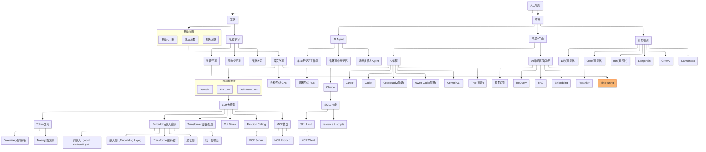
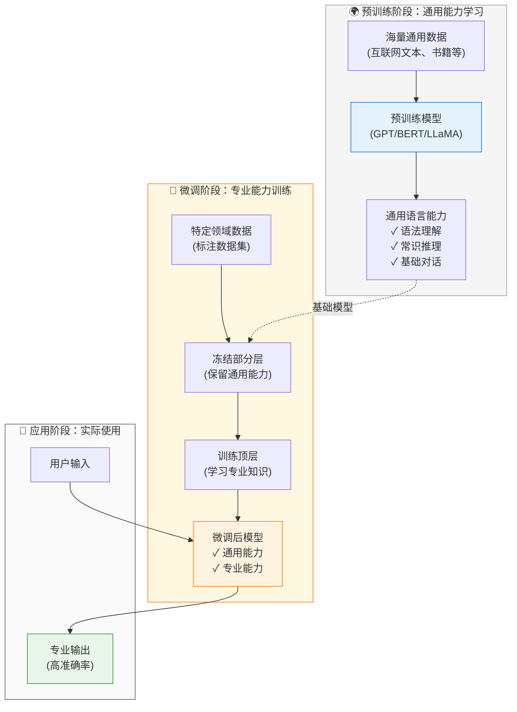

> 做一个有温度和有干货的技术分享作者 —— [Qborfy](https://qborfy.com)

今天我们来学习 **Fine-tuning（模型微调）**

> 一句话核心: **Fine-tuning** 是在预训练模型的基础上，使用特定领域的数据进行二次训练，让模型更好地适应特定任务的技术。

通俗地讲，如果把预训练模型比作一个"通才"大学生，那么 Fine-tuning 就像是让这个学生去某个公司实习，通过实际工作场景的训练，让他成为这个领域的"专才"。

需要注意的是，Fine-tuning 不是从零开始训练模型，而是在已有模型的基础上进行"微调"。就像你不需要重新学习语言，只需要学习某个行业的专业术语和工作方式。

它的核心价值在于**让通用模型适应特定场景**：包括提高特定任务的准确率、学习特定领域知识、适应特定的输出格式、降低推理成本等。通过 Fine-tuning，我们可以用较小的成本获得接近专用模型的效果。

<!-- more -->

# 是什么


```mermaid
---
config:
  layout: elk
  look: neo
---
flowchart TB
 subgraph a["神经网络"]
        a1["激活函数"]
        a2["损失函数"]
        a3["神经元计算"]
  end
 subgraph D["Transformer"]
        d1["Encoder"]
        d2["Self-Attendtion"]
        d3["Decoder"]
  end
    0["人工智能"] --> 1["算法"] & 2["应用"]
    1 --> a & b["机器学习"]
    b --> b1["监督学习"] & b2["无监督学习"] & b3["强化学习"]
    a --> A["深度学习"]
    A --> B["卷积网络 CNN"] & C["循环网络 RNN"] & D
    D --> E["LLM大模型"]
    E --> e1["Token分词"] & e2["Embedding嵌入编码"] & e3["Transformer 层叠处理"] & e4["Out Token"] & F["Function Calling"] & F1["MCP协议"]
    e1 --> e11["Tokenizer分词策略"] & e12["Token计费规则"]
    e2 --> e21["词嵌入（Word Embeddings）"] & e22["嵌入层（Embedding Layer）"] & e23["Transformer编码器"] & e24["池化层"] & e25["归一化输出"]
    F1 --> f11["MCP Server"] & f12["MCP Protocol"] & f13["MCP Client"]
    2 --> 20["AI Agent"] & 21["场景&产品"] & 22["开发框架"]
    20 --> 201["单向无记忆工作流"] & 202["循环可中断记忆"] & 203["通用多模态Agent"]
    21 --> 211["AI编程"] & 212["AI智能客服|助手"]
    211 --> 211a["Claude"] & 211b["Cursor"] & 211c["Codex"] & 211d["CodeBuddy(腾讯)"] & 211e["Qwen Code(阿里)"] & 221f["Gemini CLI"] & 221g["Trae(抖音)"]
    211a --> 211a1["SKILL技能"] --> 211a11["SKILL.md"] & 211a12["resource & scripts"]
    212 --> 212a["意图识别"] & 212b["ReQuery"] & 212c["RAG"] & 212d["Embedding"] & 212e["Reranker"]
    b1 --> b11["Fine-tuning"]
    22 --> 221["Dify(可视化)"] & 222["Coze(可视化)"] & 223["n8n(可视化)"] & 224["Langchain"] & 225["CrewAI"] & 226["LlamaIndex"]

    0@{ shape: rounded}
     b11:::orange
    classDef orange fill:#F9B572,stroke:#FF772E
```

通过一张图来理解 Fine-tuning 的工作原理：


*图：Fine-tuning 三阶段工作流程 —— 从预训练到微调再到应用*


```mermaid
graph TB
    subgraph 预训练阶段["🌍 预训练阶段：通用能力学习"]
        A1["海量通用数据<br/>(互联网文本、书籍等)"] --> A2["预训练模型<br/>(GPT/BERT/LLaMA)"]
        A2 --> A3["通用语言能力<br/>✓ 语法理解<br/>✓ 常识推理<br/>✓ 基础对话"]
    end

    subgraph 微调阶段["🎯 微调阶段：专业能力训练"]
        B1["特定领域数据<br/>(标注数据集)"] --> B2["冻结部分层<br/>(保留通用能力)"]
        B2 --> B3["训练顶层<br/>(学习专业知识)"]
        A3 -.基础模型.-> B2
        B3 --> B4["微调后模型<br/>✓ 通用能力<br/>✓ 专业能力"]
    end

    subgraph 应用阶段["🚀 应用阶段：实际使用"]
        C1["用户输入"] --> B4
        B4 --> C2["专业输出<br/>(高准确率)"]
    end

    style A2 fill:#e3f2fd,stroke:#1976d2
    style B4 fill:#fff3e0,stroke:#f57c00
    style C2 fill:#e8f5e9,stroke:#388e3c
    style 预训练阶段 fill:#f5f5f5,stroke:#9e9e9e
    style 微调阶段 fill:#fff8e1,stroke:#f57f17
    style 应用阶段 fill:#fafafa,stroke:#616161
```

**Fine-tuning 工作流程说明**：

这个流程的核心在于**三个关键阶段**：

1. **预训练阶段（Pre-training）**：

   - 使用海量通用数据训练基础模型
   - 学习语言的基本规律和常识
   - 这个阶段成本极高，通常由大公司完成

2. **微调阶段（Fine-tuning）**：

   - 使用特定领域的标注数据
   - 冻结模型的大部分参数（保留通用能力）
   - 只训练顶层参数（学习专业知识）
   - 成本相对较低，普通团队也能完成

3. **应用阶段（Inference）**：
   - 模型同时具备通用能力和专业能力
   - 在特定任务上表现更好
   - 可能比原始模型更快、更便宜

## Fine-tuning 的核心组成

一个完整的 Fine-tuning 流程通常包含以下几个关键部分：

### 1. 数据准备

**数据格式示例**（OpenAI 格式）：

```json
{
  "messages": [
    { "role": "system", "content": "你是一个专业的医疗助手" },
    { "role": "user", "content": "我头痛怎么办？" },
    { "role": "assistant", "content": "头痛的原因有很多...建议您..." }
  ]
}
```

- **数据收集**：收集特定领域的对话或文本数据
- **数据清洗**：去除噪音、统一格式
- **数据标注**：确保高质量的输入-输出对
- **数据分割**：训练集、验证集、测试集

### 2. 模型选择

- **基础模型**：选择合适的预训练模型（GPT-3.5、LLaMA、BERT 等）
- **模型大小**：根据任务复杂度和资源选择模型规模
- **开源 vs 闭源**：OpenAI API、Hugging Face 模型等

### 3. 训练策略

- **全量微调（Full Fine-tuning）**：更新所有参数，效果最好但成本最高
- **参数高效微调（PEFT）**：只更新部分参数，如 LoRA、Adapter
- **提示微调（Prompt Tuning）**：只训练提示词的嵌入向量


*图：全量微调需更新所有参数（红色），而 LoRA 仅需训练少量参数适配器（绿色）即可达到类似效果*

### 4. 评估与优化

- **性能评估**：准确率、F1 分数、困惑度等指标
- **过拟合检测**：监控训练集和验证集的性能差异
- **超参数调优**：学习率、批次大小、训练轮数等

## Fine-tuning vs 其他方法对比

| **维度**   | Prompt Engineering | RAG              | Fine-tuning       |
| ---------- | ------------------ | ---------------- | ----------------- |
| 成本       | 极低               | 低-中            | 中-高             |
| 技术门槛   | 低                 | 中               | 高                |
| 知识更新   | 实时               | 实时             | 需要重新训练      |
| 适用场景   | 简单任务           | 知识密集型任务   | 特定格式/风格任务 |
| 效果稳定性 | 不稳定             | 较稳定           | 非常稳定          |
| 推理速度   | 慢（长提示词）     | 慢（检索+生成）  | 快                |
| 数据需求   | 无                 | 文档库           | 标注数据集        |
| 可解释性   | 高                 | 高（可追溯来源） | 低（黑盒）        |

# 怎么做

下面我们通过几个案例来理解 Fine-tuning 的使用场景和实现方式。

## 案例 1：客服对话风格微调

这是 Fine-tuning 最常见的应用场景，让模型学习特定的对话风格和回答模式。

**场景描述**：

- 公司有特定的客服话术和回答风格
- 需要模型始终保持专业、友好的语气
- 对常见问题有标准化的回答模板

**数据准备**：

```python
# training_data.jsonl
{"messages": [
    {"role": "system", "content": "你是XX公司的客服助手，回答要专业、友好、简洁"},
    {"role": "user", "content": "如何退货？"},
    {"role": "assistant", "content": "您好！退货流程如下：\n1. 登录账户进入订单页面\n2. 选择需要退货的商品\n3. 填写退货原因\n4. 等待审核通过后寄回商品\n\n如有疑问，随时联系我们！"}
]}

{"messages": [
    {"role": "system", "content": "你是XX公司的客服助手，回答要专业、友好、简洁"},
    {"role": "user", "content": "发货要多久？"},
    {"role": "assistant", "content": "您好！我们的发货时效如下：\n- 现货商品：24小时内发货\n- 预售商品：按预售说明发货\n- 定制商品：7-15个工作日\n\n您可以在订单详情中查看具体发货时间哦！"}
]}
```

**使用 OpenAI API 进行微调**：

```python
from openai import OpenAI
client = OpenAI()

# 1. 上传训练数据
file = client.files.create(
    file=open("training_data.jsonl", "rb"),
    purpose="fine-tune"
)

# 2. 创建微调任务
fine_tune = client.fine_tuning.jobs.create(
    training_file=file.id,
    model="gpt-3.5-turbo",
    hyperparameters={
        "n_epochs": 3,  # 训练轮数
        "batch_size": 4,
        "learning_rate_multiplier": 0.1
    }
)

print(f"微调任务 ID: {fine_tune.id}")

# 3. 监控训练进度
import time
while True:
    status = client.fine_tuning.jobs.retrieve(fine_tune.id)
    print(f"状态: {status.status}")

    if status.status == "succeeded":
        print(f"微调完成！模型 ID: {status.fine_tuned_model}")
        break
    elif status.status == "failed":
        print(f"微调失败: {status.error}")
        break

    time.sleep(60)  # 每分钟检查一次

# 4. 使用微调后的模型
response = client.chat.completions.create(
    model=status.fine_tuned_model,
    messages=[
        {"role": "system", "content": "你是XX公司的客服助手"},
        {"role": "user", "content": "我想退货"}
    ]
)

print(response.choices[0].message.content)
```

## 案例 2：代码生成模型微调

**场景**：让模型学习公司的代码规范和常用模式。

**数据准备**：
