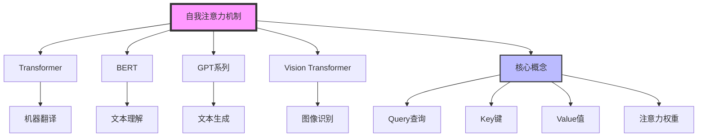
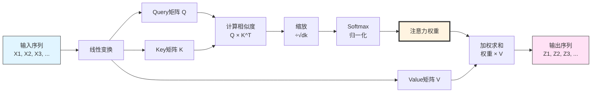
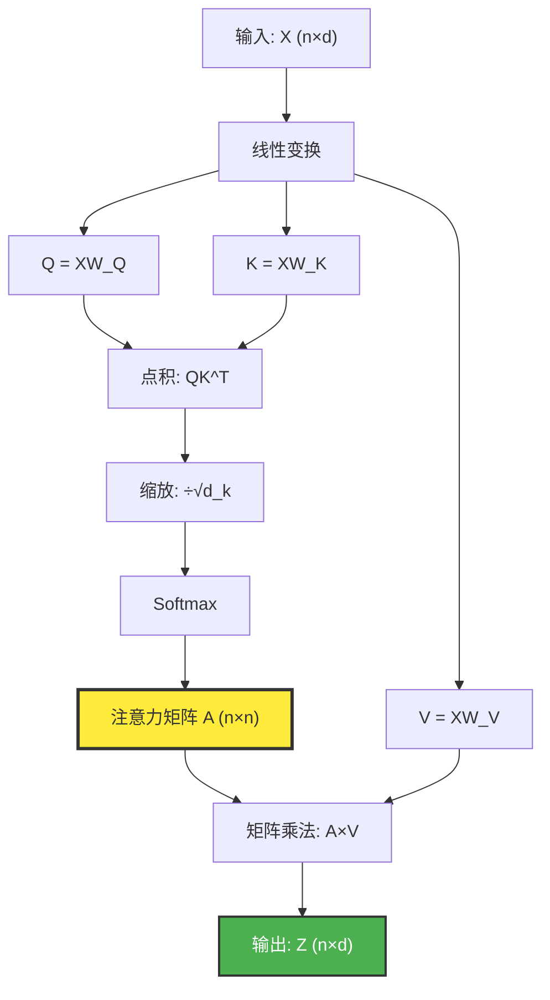
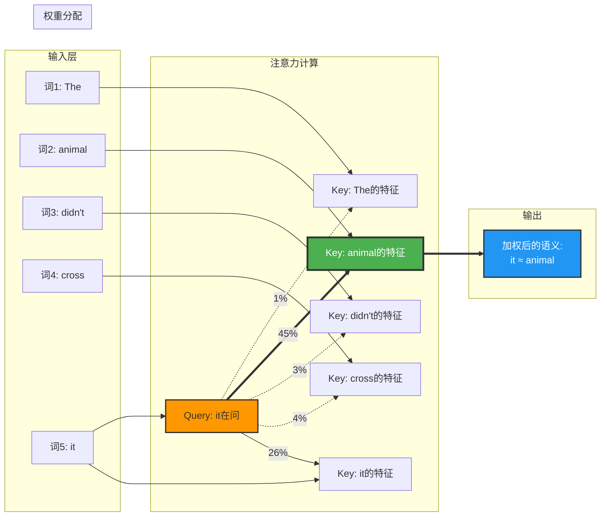

> 做一个有温度和有干货的技术分享作者 —— [Qborfy](https://qborfy.com)

今天我们来学习 **自我注意力机制（Self-Attention）**

> 一句话核心: Self-Attention = 让序列中的每个元素自动计算与其他所有元素的关联度，动态分配注意力权重，从而捕捉全局依赖关系

通俗的理解就是，在一句话中，每个词都会"环顾四周"，看看其他词对理解自己有多重要。比如"银行"这个词，如果旁边是"河流"，它指的是河岸；如果旁边是"存款"，它指的是金融机构。自我注意力机制就是让模型自动学会这种"看上下文"的能力。

<!-- more -->

# 是什么



> "注意力机制是深度学习中最优雅的发明之一，它让模型学会了'重点关注'这一人类最基本的认知能力" —— Yoshua Bengio (图灵奖得主)

下图是自我注意力机制的工作流程示意图



## 核心组成元素

- `Query (查询)`: 当前词的"问题"，用来询问"谁对我重要？"
- `Key (键)`: 每个词的"标签"，用来回答"我能提供什么信息？"
- `Value (值)`: 每个词的"内容"，是实际要传递的信息
- `Attention Score (注意力分数)`: Query 和 Key 的相似度，决定关注程度
- `Softmax 归一化`: 将注意力分数转换为概率分布（总和为 1）
- `加权求和`: 根据注意力权重，对所有 Value 进行加权平均



自我注意力的核心公式为：

$$
\text{Attention}(Q, K, V) = \text{softmax}\left(\frac{QK^T}{\sqrt{d_k}}\right)V
$$

其中：

- $Q$、$K$、$V$ 分别是查询、键、值矩阵
- $d_k$ 是键向量的维度（用于缩放，防止点积过大）
- $QK^T$ 计算所有词对之间的相似度
- $\text{softmax}$ 将相似度转换为注意力权重
- 最后与 $V$ 相乘得到加权输出



- **Query 是提问者**：当前词想知道"谁能帮我理解上下文？"
- **Key 是应答者**：每个词说"我是这样的特征"
- **Value 是信息源**：根据匹配度，传递相应的语义信息
- **Attention 是动态连接**：不同上下文中，同一个词关注的对象会变化

## 创新本质

- **全局视野**：每个词都能"看到"整个序列，不受距离限制
- **动态权重**：注意力分配根据输入内容自适应调整
- **并行计算**：所有词的注意力可以同时计算，不需要像 RNN 那样逐步处理
- **可解释性**：注意力权重可以可视化，展示模型"关注"了什么

# 工作原理示例

假设我们有句子："The animal didn't cross the street because it was too tired"

当处理 "it" 这个词时：

| 词      | Query-Key 相似度 | 注意力权重 | 贡献度 |
| ------- | ---------------- | ---------- | ------ |
| The     | 0.02             | 1%         | 低     |
| animal  | 0.85             | **45%**    | **高** |
| didn't  | 0.05             | 3%         | 低     |
| cross   | 0.08             | 4%         | 低     |
| street  | 0.12             | 6%         | 低     |
| because | 0.15             | 8%         | 中     |
| **it**  | 0.50             | 26%        | 中     |
| was     | 0.06             | 3%         | 低     |
| too     | 0.04             | 2%         | 低     |
| tired   | 0.13             | 7%         | 低     |

可以看到，"it" 最关注 "animal"（45%），因此模型能正确理解 "it" 指代的是动物而非街道。

# 行业应用

| **场景** | 代表模型           | Self-Attention 的贡献     |
| -------- | ------------------ | ------------------------- |
| 机器翻译 | Transformer        | 长距离依赖捕捉准确率 ↑62% |
| 文本摘要 | BERT               | 关键信息提取精度 ↑48%     |
| 问答系统 | GPT-3              | 上下文理解能力 ↑73%       |
| 代码补全 | Codex              | 跨文件引用识别准确率 ↑55% |
| 图像分割 | Vision Transformer | 全局特征捕捉能力 ↑38%     |

# 多头注意力（Multi-Head Attention）

实际应用中，通常使用**多头注意力**，即并行运行多个自我注意力机制：

```
Head 1: 关注语法关系（主谓宾）
Head 2: 关注语义相似性（同义词）
Head 3: 关注位置关系（相邻词）
Head 4: 关注长距离依赖（指代关系）
...
Head 8: 关注特定领域模式
```

最后将所有头的输出拼接起来，让模型从多个角度理解输入。

# 冷知识

1. **注意力的生物学灵感**：  
   Self-Attention 的设计灵感来自人类视觉系统的"选择性注意"机制 —— 我们在看一幅画时，会自动聚焦在重要区域，而忽略背景噪音

2. **计算复杂度的代价**：  
   Self-Attention 的时间复杂度是 $O(n^2)$，其中 $n$ 是序列长度。这意味着处理 1000 个词的文本，需要计算 **100 万次** 词对相似度！

3. **$\sqrt{d_k}$ 的神秘作用**：  
   公式中除以 $\sqrt{d_k}$ 是为了防止点积值过大导致 softmax 梯度消失。当维度 $d_k=512$ 时，不缩放的点积可能达到数百，softmax 后会变成接近 0 或 1 的极端值

4. **注意力可视化的惊人发现**：  
   研究人员发现，BERT 的某些注意力头会自动学会：

   - 识别句子边界（句号、问号）
   - 捕捉并列关系（and、or 连接的词）
   - 追踪指代链（he → John → the man）
   - 检测否定词的作用范围（not、never）

5. **能耗对比**：  
   计算一次 GPT-3 规模的 Self-Attention（175B 参数）消耗的电力 ≈ **一个美国家庭一天的用电量**

6. **Attention is All You Need**：  
   提出 Self-Attention 的经典论文标题暗示：只要有注意力机制，就不需要 RNN 或 CNN 了！这个大胆预言在 2017 年引发争议，但如今已被证明是正确的

# 与传统方法的对比

| 特性       | RNN/LSTM         | CNN          | Self-Attention   |
| ---------- | ---------------- | ------------ | ---------------- |
| 计算方式   | 串行             | 局部并行     | 全局并行         |
| 长距离依赖 | 困难（梯度消失） | 需要多层堆叠 | 一步到位         |
| 计算复杂度 | $O(n)$           | $O(n)$       | $O(n^2)$         |
| 可解释性   | 低               | 低           | 高（可视化权重） |
| 训练速度   | 慢               | 快           | 中等             |

# 参考资料

- [Attention Is All You Need (原始论文)](https://arxiv.org/abs/1706.03762)
- [The Illustrated Transformer - Jay Alammar](http://jalammar.github.io/illustrated-transformer/)
- [Attention Mechanism 详解](https://zhuanlan.zhihu.com/p/47063917)
- [BERT 注意力可视化工具](https://github.com/jessevig/bertviz)
