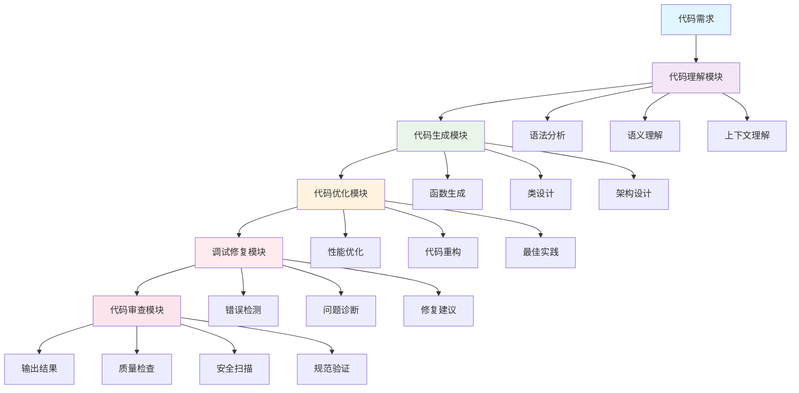
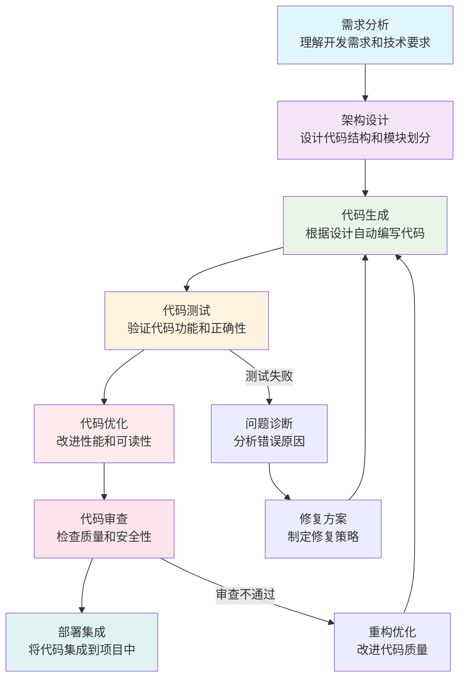

> 做一个有温度和有干货的技术分享作者 —— [Qborfy](https://qborfy.com)

今天我们来学习 **Code Agent**。

> **Code Agent**是专门用于**代码理解、生成、调试和优化**的智能代理系统，它能够**理解编程语言、分析代码结构、自动完成开发任务**的"AI 程序员助手"。

对比通用 AI Agent，Code Agent 就像从"全能助手"升级为"专业程序员"，专注于软件开发领域的复杂任务自动化。

<!-- more -->

# 是什么



## Code Agent 的核心定义

**Code Agent**（代码代理）是专门针对**软件开发领域**的 AI Agent，具备**代码理解、生成、调试、优化**等专业能力。与传统代码助手最大的区别在于：

- **传统代码助手**：提供代码补全、语法检查等基础功能
- **Code Agent**：能够理解项目上下文、制定开发计划、执行复杂编程任务

## 关键特征对比

| **能力**   | 传统代码工具 | Code Agent     |
| ---------- | ------------ | -------------- |
| 代码理解   | 语法层面     | 语义和逻辑层面 |
| 任务范围   | 单一功能     | 完整开发流程   |
| 上下文理解 | 局部代码     | 整个项目架构   |
| 自主性     | 被动响应     | 主动规划和执行 |

## Code Agent 的架构组成

一个专业的 Code Agent 通常包含以下核心组件：

```
Code Agent = 代码理解 + 代码生成 + 代码优化 + 调试修复 + 代码审查
```

- **代码理解模块**：分析代码结构、理解逻辑关系
- **代码生成模块**：根据需求自动编写代码
- **代码优化模块**：改进代码质量和性能
- **调试修复模块**：检测和修复代码问题
- **代码审查模块**：确保代码质量和安全

## 核心价值和应用场景

Code Agent 的核心价值在于**提升软件开发效率和质量**：

1. **开发效率**：自动化重复性编码任务
2. **代码质量**：遵循最佳实践和规范
3. **问题解决**：快速诊断和修复 bug
4. **知识传承**：保持代码风格一致性

**应用场景举例**：

- 代码自动生成：根据需求描述生成完整函数
- 代码重构：优化现有代码结构和性能
- 调试助手：自动诊断和修复问题
- 代码审查：检查代码质量和安全漏洞

# 怎么做



## Code Agent 的工作原理

Code Agent 的工作流程遵循**需求 → 设计 → 实现 → 测试 → 优化**的开发循环：

1. **需求理解**：分析用户需求和业务逻辑
2. **架构设计**：设计代码结构和模块关系
3. **代码实现**：根据设计自动生成代码
4. **功能测试**：验证代码的正确性和完整性
5. **性能优化**：改进代码效率和可维护性
6. **质量审查**：确保代码符合标准和规范

## 关键组件深度解析

### 代码理解模块：分析代码结构

- **语法解析**：理解编程语言的语法规则
- **语义分析**：理解代码的逻辑含义和功能
- **依赖关系**：分析模块间的调用关系
- **设计模式**：识别代码中的设计模式应用

### 代码生成模块：自动编写代码

- **函数生成**：根据需求描述生成具体函数
- **类设计**：设计面向对象的类和接口
- **API 集成**：自动调用外部 API 和服务
- **测试代码**：生成单元测试和集成测试

### 代码优化模块：提升代码质量

- **性能优化**：改进算法效率和资源使用
- **代码重构**：优化代码结构和可读性
- **最佳实践**：遵循行业标准和规范
- **安全加固**：消除安全漏洞和风险

### 调试修复模块：问题诊断和解决

- **错误检测**：自动发现代码中的 bug
- **问题诊断**：分析错误原因和影响范围
- **修复建议**：提供具体的修复方案
- **回归测试**：确保修复不会引入新问题

## Code Agent 的分类

根据功能范围和应用场景，Code Agent 可以分为：

### 按功能范围分类

- **代码生成 Agent**：专注于代码自动生成
- **代码审查 Agent**：专注于代码质量检查
- **调试修复 Agent**：专注于问题诊断和修复
- **全栈开发 Agent**：覆盖完整开发流程

### 按技术栈分类

- **前端开发 Agent**：HTML/CSS/JavaScript 相关
- **后端开发 Agent**：服务器端和 API 开发
- **移动开发 Agent**：iOS/Android 应用开发
- **数据科学 Agent**：数据分析和机器学习

## 技术实现栈

开发 Code Agent 通常涉及的技术：

```
基础层：代码理解模型（Codex、Claude Code等）
框架层：LangChain、OpenAI Codex API、GitHub Copilot API
工具层：编译器、调试器、代码分析工具
平台层：IDE集成、版本控制、持续集成
```

# 经典案例

## 实际应用场景

### 1. 智能代码生成

- **功能**：根据自然语言描述生成代码
- **代表产品**：GitHub Copilot、Claude Code
- **价值**：大幅提升编码效率，减少重复劳动

### 2. 自动化代码审查

- **功能**：自动检查代码质量和安全
- **应用场景**：CI/CD 流程中的自动化审查
- **优势**：标准化代码质量，早期发现问题

### 3. 智能调试助手

- **功能**：自动诊断和修复代码问题
- **工具**：Cursor AI、CodeWhisperer
- **特点**：快速定位问题，提供修复方案

### 4. 项目重构优化

- **功能**：自动优化代码结构和性能
- **优势**：保持代码可维护性，提升系统性能
- **发展**：从简单重构到架构优化

## 知名 Code Agent 产品

### Claude Code

- **特点**：深度代码理解和生成能力
- **优势**：支持多种编程语言，理解复杂逻辑
- **应用**：代码审查、重构建议、调试辅助

### GitHub Copilot

- **特点**：IDE 集成的智能代码补全
- **创新**：基于上下文预测代码意图
- **局限**：主要关注代码片段生成

### Cursor AI

- **特点**：AI 优先的代码编辑器
- **优势**：深度集成 AI 功能，支持复杂任务
- **适用**：全栈开发、项目重构

### Amazon CodeWhisperer

- **特点**：企业级代码生成工具
- **优势**：安全合规，支持多种框架
- **应用**：大规模项目开发

# 动手试试！

## 体验 Code Agent 能力

### 1. 使用 Claude Code

打开 [Claude Code](https://claude.ai/code) 或类似平台：

1. **简单任务**：让 Agent 帮你写一个排序算法
2. **复杂任务**：要求 Agent 设计一个完整的类结构
3. **调试任务**：提供有 bug 的代码让 Agent 修复

### 2. 尝试 GitHub Copilot

在支持的 IDE 中安装 GitHub Copilot：

1. **代码补全**：观察 AI 如何预测你的编码意图
2. **函数生成**：用注释描述功能，看 AI 生成代码
3. **代码解释**：让 AI 解释复杂代码的逻辑

### 3. 构建简单 Code Agent 概念

理解 Code Agent 的基本原理：

```python
# Code Agent概念示例
class SimpleCodeAgent:
    def __init__(self):
        self.code_understanding = CodeUnderstanding()
        self.code_generation = CodeGeneration()
        self.code_optimization = CodeOptimization()

    def process_requirement(self, requirement):
        # 1. 理解需求
        understood_req = self.code_understanding.analyze(requirement)

        # 2. 生成代码
        generated_code = self.code_generation.generate(understood_req)

        # 3. 优化代码
        optimized_code = self.code_optimization.optimize(generated_code)

        return optimized_code

# 使用示例
agent = SimpleCodeAgent()
result = agent.process_requirement("创建一个计算斐波那契数列的函数")
print(result)
```

# 进阶知识

## Code Agent 的发展趋势

### 1. 多语言支持增强

- **现状**：主要支持主流编程语言
- **趋势**：扩展到更多小众和领域特定语言
- **影响**：更广泛的应用场景覆盖

### 2. 项目级理解能力

- **挑战**：当前主要关注文件级代码
- **发展**：理解整个项目架构和依赖关系
- **价值**：更准确的代码生成和重构建议

### 3. 实时协作能力

- **现状**：单用户使用模式
- **趋势**：支持多用户实时协作开发
- **示例**：团队代码审查、结对编程辅助

### 4. 自定义和可扩展性

- **通用 Agent**：功能固定
- **定制化 Agent**：根据团队需求定制
- **应用**：特定业务逻辑、专有框架支持

## 技术挑战和未来展望

### 当前挑战

1. **代码质量**：生成代码的可读性和维护性
2. **安全性**：防止生成有安全漏洞的代码
3. **上下文理解**：准确理解复杂业务逻辑
4. **知识产权**：代码版权和合规性问题

### 未来发展方向

- **全栈开发**：覆盖前端、后端、数据库等全流程
- **智能运维**：代码部署、监控、维护自动化
- **架构设计**：参与系统架构设计和优化
- **自我演进**：Agent 能够自我改进编码能力

# 总结

Code Agent 代表了软件开发自动化的新阶段，从辅助工具转变为主动的开发伙伴。关键要点：

1. **核心价值**：提升开发效率，保证代码质量
2. **技术架构**：代码理解、生成、优化、调试的完整链条
3. **应用场景**：代码生成、审查、调试、重构等全流程
4. **发展趋势**：多语言支持、项目级理解、实时协作

掌握 Code Agent 的技术和应用，将帮助开发者在 AI 时代保持竞争优势。

# 参考资料

- [Claude Code 官方文档](https://docs.anthropic.com/en/docs/build-with-claude/code)
- [GitHub Copilot 技术解析](https://docs.github.com/en/copilot)
- [Cursor AI 使用指南](https://docs.cursor.com/)
- [Code Agent 研究论文 - arXiv](https://arxiv.org/search/?query=code+agent)
