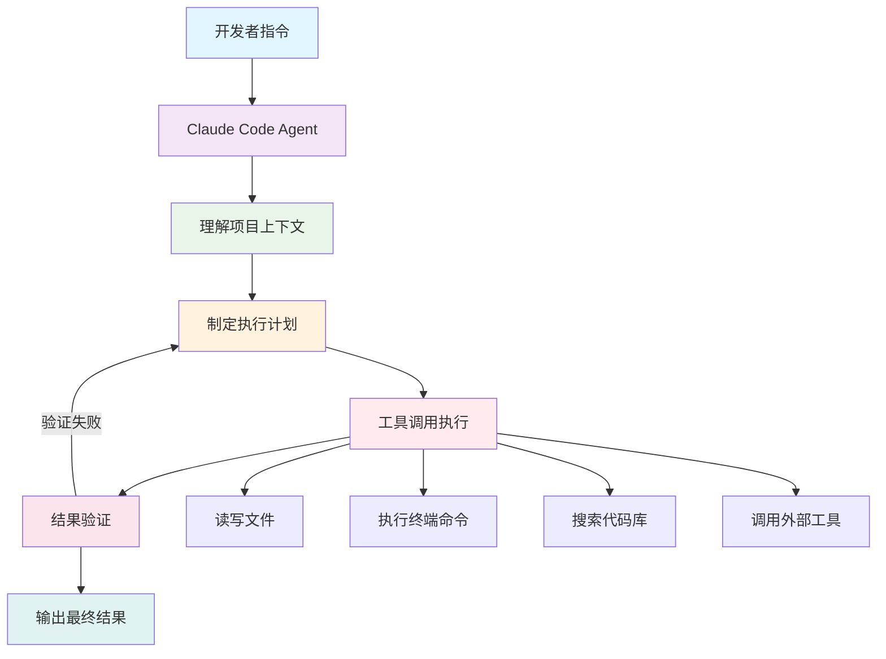
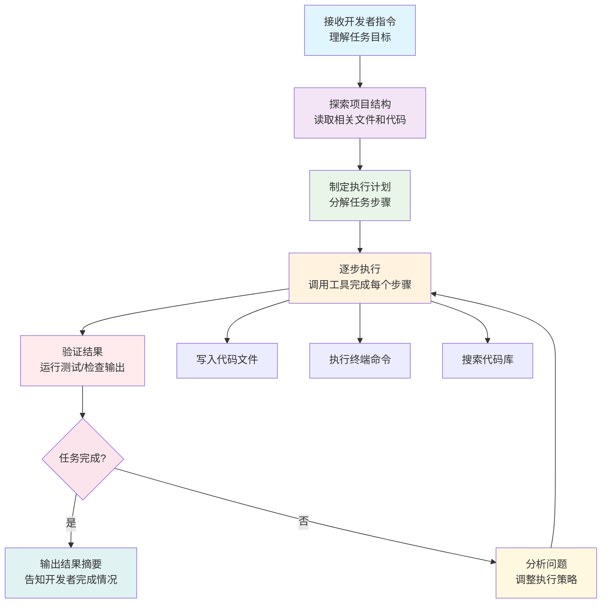
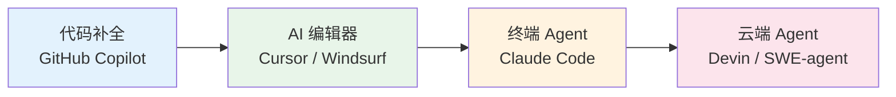

> 做一个有温度和有干货的技术分享作者 —— [Qborfy](https://qborfy.com)

今天我们来学习 **Claude Code**。

> **Claude Code** 是 Anthropic 推出的**面向开发者的 AI 编程 Agent**，它以**命令行工具**的形式运行在开发者的本地终端，能够**读写文件、执行命令、调用工具、自主完成复杂编程任务**，是真正意义上的"AI 程序员"。

对比普通的 AI 代码补全工具，Claude Code 就像从"代码建议者"升级为"自主执行者"——它不只是给你写几行代码，而是能够理解整个项目、制定计划、逐步执行，直到任务完成。

<!-- more -->

# 是什么



## Claude Code 的核心定义

**Claude Code** 是 Anthropic 于 2025 年推出的**终端原生 AI 编程 Agent**，其核心特点是：

- **本地运行**：直接在开发者的终端（Terminal）中运行，无需切换工具
- **自主执行**：能够自主读写文件、执行 Shell 命令、搜索代码库
- **上下文感知**：理解整个项目结构，而非仅仅是当前文件
- **工具调用**：通过调用各类工具完成复杂的多步骤任务

与传统 AI 编程助手最大的区别在于：

- **传统 AI 助手**：你问它，它给你代码，你自己去粘贴执行
- **Claude Code**：你告诉它目标，它自主规划并执行，直到完成

## 关键特征对比

| **能力**   | 传统 AI 编程助手 | Claude Code        |
| ---------- | ---------------- | ------------------ |
| 代码生成   | 片段级别         | 完整功能/模块级别  |
| 执行能力   | 无，需手动执行   | 自主执行命令和脚本 |
| 上下文范围 | 当前文件         | 整个代码仓库       |
| 任务复杂度 | 单步任务         | 多步骤复杂任务     |
| 错误处理   | 给出建议         | 自动检测并修复     |
| 工作方式   | 问答交互         | 自主 Agent 循环    |

## Claude Code 的架构组成

Claude Code 的核心架构可以概括为：

```
Claude Code = 大语言模型 + 工具集 + Agent 循环 + 安全机制
```

- **大语言模型（LLM）**：Claude 3.5/3.7 Sonnet，提供代码理解和推理能力
- **工具集（Tool Use）**：文件读写、命令执行、代码搜索、网络请求等
- **Agent 循环**：感知 → 规划 → 执行 → 观察 → 迭代的自主循环
- **安全机制**：权限控制、操作确认、沙箱隔离，防止误操作

## 核心工具能力

Claude Code 内置了一套完整的工具集，使其能够真正"动手"完成任务：

1. **文件操作**：读取、创建、修改、删除文件
2. **命令执行**：运行 Shell 命令、脚本、测试用例
3. **代码搜索**：在整个代码库中搜索符号、函数、类定义
4. **网络请求**：访问文档、API、外部资源
5. **版本控制**：执行 Git 操作，查看提交历史

# 怎么做



## Claude Code 的工作原理

Claude Code 的工作流程遵循经典的 **ReAct（Reasoning + Acting）** 模式：

1. **理解指令**：解析开发者的自然语言指令，明确任务目标
2. **探索上下文**：读取项目文件、了解代码结构和技术栈
3. **制定计划**：将复杂任务分解为可执行的步骤序列
4. **工具执行**：调用文件读写、命令执行等工具逐步完成任务
5. **结果验证**：运行测试、检查输出，确认任务完成质量
6. **迭代修复**：如果出现错误，自动分析原因并调整策略

## 关键组件深度解析

### Agent 循环：自主执行的核心

Claude Code 的 Agent 循环是其区别于普通 AI 助手的关键：

```
感知（Perceive）→ 思考（Think）→ 行动（Act）→ 观察（Observe）→ 循环
```

- **感知**：读取文件、获取命令输出、理解当前状态
- **思考**：基于 Claude 模型推理下一步最优行动
- **行动**：调用工具执行具体操作（写文件、运行命令等）
- **观察**：获取工具执行结果，更新对任务状态的理解

### 工具调用：连接 AI 与真实世界

Claude Code 通过 Anthropic 的 **Tool Use API** 实现工具调用：

```python
# Claude Code 工具调用示意（简化版）
tools = [
    {
        "name": "read_file",
        "description": "读取指定路径的文件内容",
        "input_schema": {"path": "string"}
    },
    {
        "name": "write_file",
        "description": "向指定路径写入文件内容",
        "input_schema": {"path": "string", "content": "string"}
    },
    {
        "name": "run_command",
        "description": "在终端执行 Shell 命令",
        "input_schema": {"command": "string"}
    }
]

# Agent 循环：持续调用工具直到任务完成
while not task_complete:
    response = claude.messages.create(
        model="claude-3-5-sonnet",
        tools=tools,
        messages=conversation_history
    )
    # 执行工具调用，将结果加入对话历史
    tool_result = execute_tool(response.tool_use)
    conversation_history.append(tool_result)
```

### 安全机制：可信赖的自主执行

Claude Code 内置了多层安全保障：

- **权限确认**：执行高风险操作（如删除文件）前主动询问用户
- **操作透明**：实时展示每一步操作，让开发者随时了解进展
- **范围限制**：默认只操作当前项目目录，防止越权访问
- **可中断性**：开发者可随时中断任务执行

## Claude Code 的使用方式

### 安装与启动

```bash
# 通过 npm 全局安装
npm install -g @anthropic-ai/claude-code

# 在项目目录中启动
cd your-project
claude
```

### 典型使用场景

```bash
# 场景1：实现新功能
> 帮我实现一个用户登录功能，使用 JWT 认证，包含注册、登录、登出接口

# 场景2：调试修复
> 运行测试，找出失败的原因并修复

# 场景3：代码重构
> 将 src/utils 目录下的所有工具函数重构为 TypeScript，并添加类型注解

# 场景4：代码审查
> 审查最近的 Git 提交，找出潜在的安全问题和性能瓶颈
```

# 经典案例

## 实际应用场景

### 1. 全栈功能开发

**场景**：开发者需要为电商项目添加"商品收藏"功能

**Claude Code 执行过程**：

1. 读取项目结构，了解技术栈（React + Node.js + MongoDB）
2. 创建后端 API 路由（`/api/favorites`）
3. 编写数据库 Schema 和 Model
4. 实现前端组件和状态管理
5. 运行测试，修复发现的问题
6. 输出完成摘要

**价值**：原本需要 2-3 小时的工作，缩短至 10-15 分钟

### 2. 自动化 Bug 修复

**场景**：CI/CD 流水线中测试失败，需要快速定位和修复

**Claude Code 执行过程**：

1. 读取测试失败日志
2. 定位到具体的失败代码
3. 分析根本原因（如边界条件未处理）
4. 修改代码并重新运行测试
5. 确认测试通过后提交修复

**价值**：将 Bug 修复时间从小时级压缩到分钟级

### 3. 大规模代码迁移

**场景**：将项目从 JavaScript 迁移到 TypeScript

**Claude Code 执行过程**：

1. 扫描所有 `.js` 文件
2. 逐文件添加类型注解
3. 修复类型错误
4. 更新构建配置
5. 运行完整测试套件验证

**价值**：数百个文件的迁移工作，从数周压缩到数小时

### 4. 智能代码审查

**场景**：PR 合并前的自动化代码审查

**Claude Code 执行过程**：

1. 读取 Git diff，了解变更内容
2. 分析代码质量、安全性、性能
3. 生成详细的审查报告
4. 提出具体的改进建议

**价值**：标准化代码审查流程，早期发现潜在问题

## Claude Code 与其他工具对比

| **工具**        | 类型       | 执行能力 | 上下文范围 | 自主程度 |
| --------------- | ---------- | -------- | ---------- | -------- |
| GitHub Copilot  | IDE 插件   | 无       | 当前文件   | 低       |
| Cursor AI       | AI 编辑器  | 有限     | 项目级     | 中       |
| **Claude Code** | 终端 Agent | 完整     | 项目级     | 高       |
| Devin           | 云端 Agent | 完整     | 项目级     | 极高     |

# 动手试试！

## 体验 Claude Code 能力

### 1. 安装 Claude Code

```bash
# 前提：需要有 Anthropic API Key
# 访问 https://console.anthropic.com 获取

# 安装
npm install -g @anthropic-ai/claude-code

# 配置 API Key
export ANTHROPIC_API_KEY="your-api-key-here"

# 在项目目录启动
cd your-project && claude
```

### 2. 尝试基础任务

启动 Claude Code 后，可以尝试以下任务：

```bash
# 任务1：了解项目
> 帮我分析这个项目的整体架构，用 Mermaid 图表展示模块关系

# 任务2：添加功能
> 为 User 模型添加一个 getFullName() 方法，并写单元测试

# 任务3：修复问题
> 运行所有测试，找出失败的测试并修复

# 任务4：代码优化
> 找出项目中所有的 console.log 调用，替换为统一的 logger 工具
```

### 3. 理解 Claude Code 的工作模式

```python
# 用 Python 模拟 Claude Code 的 Agent 循环概念
class ClaudeCodeAgent:
    def __init__(self, api_key):
        self.client = Anthropic(api_key=api_key)
        self.tools = self._init_tools()
        self.history = []

    def _init_tools(self):
        """初始化工具集"""
        return [
            {"name": "read_file", "description": "读取文件内容"},
            {"name": "write_file", "description": "写入文件内容"},
            {"name": "run_command", "description": "执行终端命令"},
            {"name": "search_code", "description": "搜索代码库"},
        ]

    def run(self, task: str):
        """执行任务的 Agent 循环"""
        self.history.append({"role": "user", "content": task})

        while True:
            # 调用 Claude 获取下一步行动
            response = self.client.messages.create(
                model="claude-3-5-sonnet-20241022",
                tools=self.tools,
                messages=self.history
            )

            # 如果没有工具调用，任务完成
            if response.stop_reason == "end_turn":
                return response.content[0].text

            # 执行工具调用
            for tool_use in response.content:
                if tool_use.type == "tool_use":
                    result = self._execute_tool(tool_use)
                    self.history.append({
                        "role": "tool",
                        "tool_use_id": tool_use.id,
                        "content": result
                    })

    def _execute_tool(self, tool_use):
        """执行具体工具"""
        if tool_use.name == "read_file":
            with open(tool_use.input["path"]) as f:
                return f.read()
        elif tool_use.name == "run_command":
            import subprocess
            result = subprocess.run(
                tool_use.input["command"],
                shell=True, capture_output=True, text=True
            )
            return result.stdout or result.stderr
        # ... 其他工具实现

# 使用示例
agent = ClaudeCodeAgent(api_key="your-key")
result = agent.run("分析 src/index.js 文件，找出所有未处理的异步错误")
print(result)
```

# 进阶知识

## Claude Code 的技术亮点

### 1. 扩展上下文窗口的高效利用

Claude Code 使用 Claude 3.5/3.7 Sonnet 模型，拥有 **200K Token** 的超大上下文窗口：

- **现状**：可以一次性读入整个中小型项目的代码
- **优势**：理解跨文件的依赖关系和业务逻辑
- **挑战**：大型项目仍需智能的上下文管理策略

### 2. 多轮工具调用链

Claude Code 支持复杂的**工具调用链**，实现多步骤任务自动化：

```
读取需求文档 → 搜索相关代码 → 生成实现方案 → 写入代码文件
→ 运行测试 → 分析失败原因 → 修复代码 → 再次运行测试 → 完成
```

每一步都是一次工具调用，Claude Code 自主决定调用顺序和参数。

### 3. 与 MCP（Model Context Protocol）集成

Claude Code 支持 **MCP（模型上下文协议）**，可以扩展工具集：

- **数据库工具**：直接查询和操作数据库
- **API 工具**：调用第三方服务 API
- **监控工具**：读取系统日志和性能指标
- **自定义工具**：开发者可以编写自己的 MCP 工具

### 4. 子 Agent 并行执行

Claude Code 支持**子 Agent 模式**，将复杂任务分解后并行执行：

- **主 Agent**：负责任务规划和协调
- **子 Agent**：并行处理独立的子任务
- **优势**：大幅提升复杂任务的执行效率

## 技术挑战和未来展望

### 当前挑战

1. **成本控制**：大量工具调用消耗较多 Token，成本较高
2. **执行风险**：自主执行可能产生不可预期的副作用
3. **上下文限制**：超大型项目仍面临上下文窗口不足的问题
4. **调试困难**：多步骤 Agent 执行过程难以追踪和调试

### 未来发展方向

- **更强的规划能力**：更准确地分解和执行复杂任务
- **多 Agent 协作**：多个专业 Agent 协同完成大型项目
- **持久化记忆**：跨会话记住项目知识和开发偏好
- **IDE 深度集成**：与 VS Code、JetBrains 等 IDE 无缝集成
- **企业级安全**：更完善的权限管理和审计日志

## Claude Code 在 AI 编程生态中的位置



Claude Code 处于"终端 Agent"这一层级，是目前**实用性与自主性的最佳平衡点**：

- 比代码补全工具更强大（能自主执行）
- 比云端 Agent 更可控（本地运行，开发者全程可见）

# 总结

Claude Code 代表了 AI 编程工具的新范式——从"建议者"到"执行者"的跨越。关键要点：

1. **核心定位**：终端原生的 AI 编程 Agent，能够自主完成复杂开发任务
2. **技术架构**：LLM + 工具集 + Agent 循环 + 安全机制的完整体系
3. **核心能力**：文件读写、命令执行、代码搜索、多步骤自主执行
4. **应用场景**：功能开发、Bug 修复、代码迁移、代码审查等全流程
5. **发展趋势**：多 Agent 协作、持久化记忆、IDE 深度集成

掌握 Claude Code 的使用方式和工作原理，将帮助开发者在 AI 时代大幅提升开发效率，专注于更有创造性的工作。

# 参考资料

- [Claude Code 官方文档](https://docs.anthropic.com/en/docs/claude-code)
- [Anthropic Tool Use 指南](https://docs.anthropic.com/en/docs/build-with-claude/tool-use)
- [Model Context Protocol（MCP）规范](https://modelcontextprotocol.io/)
- [ReAct: Synergizing Reasoning and Acting in Language Models](https://arxiv.org/abs/2210.03629)
- [SWE-bench: 代码 Agent 评测基准](https://www.swebench.com/)
