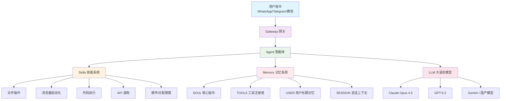
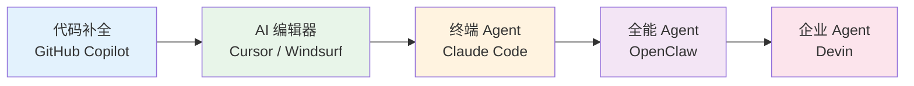

> 做一个有温度和有干货的技术分享作者 —— [Qborfy](https://qborfy.com)

今天我们来学习 **OpenClaw**。

> **OpenClaw**（曾用名 Clawdbot）是一款**开源的个人 AI 智能体（Agent）**，由奥地利开发者 Peter Steinberger 于 2025 年底创建，能够通过 WhatsApp、Telegram 等聊天工具**远程操控本地电脑**，自主完成邮件处理、代码开发、日程管理等复杂任务，是真正意义上的"**7×24 小时 AI 数字员工**"。

对比其他 AI 编程工具，OpenClaw 就像从"专业程序员助手"升级为"全能私人助理"——它不只会写代码，还能帮你处理邮件、管理日程、监控股票，甚至控制智能家居，而且全程运行在你自己的设备上，数据完全私有。

<!-- more -->

# 是什么



## OpenClaw 的核心定义

**OpenClaw** 是一款**本地优先、开源、多模型**的个人 AI 智能体，其核心特点是：

- **本地运行**：部署在用户自己的设备（笔记本、Mac Mini、VPS）上，数据不上传云端
- **多渠道交互**：通过 WhatsApp、Telegram、Slack、企业微信等聊天工具发送指令
- **自主执行**：能够操作文件系统、运行命令、控制浏览器、调用 API
- **可扩展技能**：通过 Skills 插件系统无限扩展能力，社区已有 5700+ 技能
- **主动行为**：支持定时任务、事件触发，无需用户主动发起即可自主执行

与其他 AI 工具最大的区别在于：

- **其他 AI 工具**：你问它，它回答你，你自己去执行
- **OpenClaw**：你告诉它目标，它自主规划并执行，结果直接推送给你

## 关键特征对比

| **能力** | 传统 AI 助手 | Claude Code | OpenClaw            |
| -------- | ------------ | ----------- | ------------------- |
| 交互方式 | 网页/IDE     | 终端命令行  | 聊天应用（手机/PC） |
| 执行范围 | 代码相关     | 代码相关    | 全系统（代码+生活） |
| 数据隐私 | 云端处理     | 云端处理    | 本地运行，数据私有  |
| 主动行为 | 无           | 无          | 支持定时/事件触发   |
| 模型支持 | 单一模型     | 仅 Claude   | 多模型（自由切换）  |
| 开源程度 | 闭源         | 闭源        | 完全开源            |

## OpenClaw 的四大核心架构

```
OpenClaw = Gateway（网关）+ Agent（智能体）+ Skills（技能）+ Memory（记忆）
```

### Gateway（网关）

负责连接各类聊天平台，处理用户指令的接收与结果推送：

- 支持 WhatsApp、Telegram、Discord、Slack、iMessage、Signal 等
- 支持语音输入（通过 Whisper 转录）
- 支持多模态输出（文本、语音、文件）

### Agent（智能体）

驱动推理和决策的核心引擎：

- 调用大语言模型（Claude、GPT、Gemini、国产模型等）
- 基于 **ReAct（推理 + 行动）** 模式进行任务规划
- 支持子智能体并行执行复杂任务

### Skills（技能）

模块化的功能扩展插件系统：

- 每个 Skill 是一个独立的功能模块（Python/Node.js/Shell 脚本）
- 社区驱动的 **ClawHub** 技能市场，提供 5700+ 预置技能
- 支持 AI 自主编写新技能（自我进化）

### Memory（记忆）

四层持久化记忆架构：

- **SOUL**：核心不可变指令（AI 的"人格"）
- **TOOLS**：动态工具注册表
- **USER**：用户长期偏好记忆（习惯、编码风格等）
- **SESSION**：实时会话上下文

# 怎么做

```mermaid
flowchart TD
    A[用户发送指令<br/>通过聊天应用] --> B[Gateway 接收<br/>解析指令类型]
    B --> C{任务类型判断}
    C -->|简单任务| D[直接调用 LLM<br/>生成回复]
    C -->|复杂任务| E[Agent 规划<br/>分解任务步骤]
    E --> F[调用 Skills<br/>执行具体操作]
    F --> G[观察执行结果<br/>更新任务状态]
    G --> H{任务完成?}
    H -->|否| E
    H -->|是| I[推送结果<br/>到聊天应用]
    D --> I

    F --> F1[文件读写]
    F --> F2[运行命令]
    F --> F3[浏览器操作]
    F --> F4[API 请求]

    style A fill:#e1f5fe
    style B fill:#f3e5f5
    style C fill:#e8f5e8
    style D fill:#fff3e0
    style E fill:#ffebee
    style F fill:#fce4ec
    style G fill:#e0f2f1
    style H fill:#fff8e1
    style I fill:#e8eaf6
```



## OpenClaw 的工作原理

OpenClaw 的工作流程遵循经典的 **ReAct（Reasoning + Acting）** 模式：

1. **接收指令**：通过聊天应用接收用户的自然语言指令
2. **任务规划**：调用 LLM 分析任务，制定执行计划
3. **技能调用**：选择合适的 Skills 执行具体操作
4. **结果观察**：获取执行结果，判断是否达成目标
5. **迭代执行**：如未完成，调整策略继续执行
6. **结果推送**：将最终结果推送回聊天应用

## 关键组件深度解析

### Skills 系统：OpenClaw 的超能力来源

Skills 是 OpenClaw 最核心的扩展机制，每个 Skill 本质上是一份"AI 操作手册"：

```
Skills 目录结构：
weather-query/
├── SKILL.md          # 核心文件：元数据 + 执行说明
├── scripts/          # 可执行脚本（Python/Shell/Node.js）
│   └── query.py
├── references/       # 参考文档
└── assets/           # 模板、图片等资源
```

**SKILL.md 示例**（天气查询技能）：

```markdown
---
name: weather-query
description: 实时天气查询，支持多城市和未来预报
metadata:
  openclaw:
    emoji: "🌤️"
    requires:
      env: ["WEATHER_API_KEY"]
---

## 使用说明

当用户询问天气时，调用此技能：

1. 解析用户提到的城市名称
2. 调用 scripts/query.py 获取天气数据
3. 以友好的格式返回结果

## 示例指令

- "北京今天天气怎么样？"
- "上海未来三天的天气预报"
```

### 记忆系统：让 AI 真正"认识"你

OpenClaw 的四层记忆架构让 AI 能够跨会话记住用户偏好：

```python
# 记忆系统示意（简化版）
memory_layers = {
    "SOUL": "你是一个专业的个人助理，风格简洁高效...",  # 不可变
    "TOOLS": {  # 动态更新
        "weather": "调用 OpenMeteo API",
        "email": "使用 Gmail API",
    },
    "USER": {  # 长期学习
        "coding_style": "偏好 TypeScript，使用 4 空格缩进",
        "wake_time": "每天 7:30 发送早报",
        "preferred_language": "中文回复",
    },
    "SESSION": [...]  # 当前会话历史
}
```

### 主动行为机制：从被动响应到主动执行

OpenClaw 支持三种主动触发方式：

- **心跳系统（Heartbeat）**：定期检查任务状态，如每小时检查邮件
- **定时任务（Cron）**：按计划执行，如每天 8:00 发送日程摘要
- **事件驱动（Webhooks）**：响应外部事件，如股票价格变动时发送提醒

## OpenClaw 的部署方式

### Docker 部署（推荐）

```bash
# 克隆项目
git clone https://github.com/openclaw/openclaw.git
cd openclaw

# 配置环境变量
cp .env.example .env
# 编辑 .env 文件，填入 API Key 和聊天平台配置

# 启动服务
docker-compose up -d

# 访问管理界面
open http://localhost:18789
```

### 环境变量配置

```bash
# .env 配置示例
ANTHROPIC_API_KEY=your-claude-api-key
TELEGRAM_BOT_TOKEN=your-telegram-bot-token
WHATSAPP_PHONE_NUMBER=your-phone-number

# 可选：其他模型
OPENAI_API_KEY=your-openai-key
GEMINI_API_KEY=your-gemini-key
```

# 经典案例

## 实际应用场景

### 1. 个人效率助理

**场景**：每天早上自动整理当日日程和重要邮件

**OpenClaw 执行过程**：

1. 定时任务在每天 7:30 触发
2. 读取 Google Calendar 获取当日日程
3. 扫描邮箱，筛选重要邮件（AI 判断优先级）
4. 生成简洁的早报摘要
5. 通过 WhatsApp 推送给用户

**价值**：每天节省 15-20 分钟的信息整理时间

### 2. 自动化代码开发

**场景**：开发者通过手机发送需求，AI 自动完成代码开发

**OpenClaw 执行过程**：

1. 用户在 Telegram 发送："帮我在 user-service 里加一个获取用户列表的接口，支持分页"
2. OpenClaw 读取项目代码，理解现有架构
3. 生成符合项目风格的代码
4. 运行测试，修复问题
5. 提交 Git，推送 PR
6. 通过 Telegram 回复完成情况

**价值**：开发者无需打开电脑，随时随地推进项目

### 3. 智能家居控制

**场景**：通过自然语言控制智能家居设备

**OpenClaw 执行过程**：

1. 用户发送："我要睡觉了，帮我关灯、调低空调温度到 26 度"
2. OpenClaw 调用 Home Assistant 集成技能
3. 执行关灯和调温操作
4. 确认执行结果并回复

**价值**：将智能家居控制融入日常聊天，无需专属 App

### 4. 商业自动化监控

**场景**：电商运营者监控竞品价格和库存

**OpenClaw 执行过程**：

1. 定时任务每小时触发浏览器自动化技能
2. 访问竞品页面，抓取价格和库存数据
3. 与历史数据对比，检测异常变化
4. 发现价格下降超过 10% 时，立即推送告警
5. 自动生成价格趋势报告

**价值**：7×24 小时自动监控，及时响应市场变化

## OpenClaw 与同类工具对比

| **工具**       | 定位          | 交互方式  | 数据隐私 | 开源 | 适用人群     |
| -------------- | ------------- | --------- | -------- | ---- | ------------ |
| **OpenClaw**   | 全能个人助理  | 聊天应用  | 本地私有 | ✅   | 所有人       |
| Claude Code    | 编程协作助手  | 终端 CLI  | 云端处理 | ❌   | 开发者       |
| Devin          | AI 全栈程序员 | Web/Slack | 云端处理 | ❌   | 企业开发团队 |
| GitHub Copilot | 代码补全      | IDE 插件  | 云端处理 | ❌   | 开发者       |
| Cursor AI      | AI 代码编辑器 | 桌面应用  | 云端处理 | ❌   | 开发者       |

# 动手试试！

## 体验 OpenClaw 能力

### 1. 快速部署 OpenClaw

```bash
# 前提：安装 Docker 和 Docker Compose
# 访问 https://github.com/openclaw/openclaw 获取最新版本

# 克隆项目
git clone https://github.com/openclaw/openclaw.git
cd openclaw

# 一键启动（使用默认配置）
docker-compose up -d

# 查看运行状态
docker-compose ps

# 访问 Web 管理界面
open http://localhost:18789
```

### 2. 配置 Telegram Bot（最简单的接入方式）

```bash
# 1. 在 Telegram 中找到 @BotFather，创建新 Bot
# 2. 获取 Bot Token
# 3. 在 .env 文件中配置
TELEGRAM_BOT_TOKEN=1234567890:ABCdefGHIjklMNOpqrsTUVwxyz

# 4. 重启服务
docker-compose restart

# 5. 在 Telegram 中找到你的 Bot，发送 /start
```

### 3. 安装你的第一个 Skill

```bash
# 方式一：通过 ClawHub 安装社区技能
# 在聊天中发送：
> 帮我安装天气查询技能

# 方式二：手动安装
mkdir -p ~/.openclaw/workspace/skills/my-skill
cd ~/.openclaw/workspace/skills/my-skill
touch SKILL.md
```

### 4. 编写一个极简 Skill

创建文件 `~/.openclaw/workspace/skills/hello-world/SKILL.md`：

```markdown
---
name: hello-world
description: 一个简单的问候技能，用于演示 Skill 开发
metadata:
  openclaw:
    emoji: "👋"
---

## 使用说明

当用户说"你好"或"Hello"时，用热情的方式回应，
并告诉用户当前时间和今天是星期几。

## 示例

用户：你好
助手：👋 你好！现在是 2026 年 3 月 9 日，星期一，下午 3 点。
今天有什么我可以帮你的吗？
```

### 5. 尝试常用指令

在聊天应用中发送以下指令体验 OpenClaw：

```
# 任务管理
> 帮我列出今天需要完成的任务

# 代码开发
> 帮我查看项目 ~/my-project 的目录结构，并分析主要模块

# 文件操作
> 把桌面上所有的截图文件整理到 ~/Pictures/Screenshots 文件夹

# 信息查询
> 搜索最近关于 AI Agent 的新闻，总结三条最重要的

# 定时任务
> 每天早上 8 点提醒我喝水，并发送今日天气
```

# 进阶知识

## OpenClaw 的技术亮点

### 1. 子智能体并行执行

OpenClaw 支持**子 Agent 模式**，将复杂任务分解后并行处理：

```
主 Agent 接收任务
    ├── 子 Agent 1：爬取竞品 A 的价格数据
    ├── 子 Agent 2：爬取竞品 B 的价格数据
    └── 子 Agent 3：爬取竞品 C 的价格数据
主 Agent 汇总结果，生成对比报告
```

每个子 Agent 在隔离环境中运行，互不干扰，大幅提升复杂任务的执行效率。

### 2. 浏览器自动化的创新实现

OpenClaw 采用 **Playwright 语义快照技术**，相比传统截图方式：

- **传统方式**：截图 → 发送给 LLM → 消耗大量 Token
- **语义快照**：提取页面语义结构 → 发送给 LLM → Token 消耗降低 80%

这使得浏览器自动化任务的成本大幅降低，可以持续运行而不担心 API 费用爆炸。

### 3. 自我进化的 Skills 系统

OpenClaw 最独特的能力之一是**自主编写新技能**：

```
用户：帮我创建一个自动整理每日邮件的技能

OpenClaw 执行过程：
1. 分析需求，设计技能架构
2. 编写 SKILL.md 和相关脚本
3. 测试技能是否正常工作
4. 保存为可复用的技能模块
5. 下次遇到类似需求时直接调用
```

这意味着 OpenClaw 会随着使用时间的增长变得越来越"聪明"，越来越了解用户的需求。

### 4. 多模型动态切换

OpenClaw 支持根据任务类型自动选择最优模型：

```yaml
# 模型路由配置示例
model_routing:
  code_tasks: "claude-opus-4-5" # 代码任务用 Claude
  quick_queries: "gpt-4o-mini" # 快速查询用轻量模型
  image_analysis: "gemini-pro-vision" # 图像分析用 Gemini
  local_tasks: "ollama/llama3" # 隐私任务用本地模型
```

## 技术挑战和未来展望

### 当前挑战

1. **安全风险**：OS 级权限可能导致误操作，需谨慎配置
2. **提示词注入**：恶意指令可能诱导 AI 执行未授权操作
3. **成本控制**：复杂任务的多轮 LLM 调用成本较高
4. **稳定性**：长时间运行的自动化任务可能因网络或 API 问题中断

### 未来发展方向

- **多 Agent 协作**：多个 OpenClaw 实例协同完成企业级任务
- **更强的规划能力**：更准确地分解和执行超长任务链
- **企业版功能**：权限管理、审计日志、团队协作
- **边缘计算**：在树莓派等低功耗设备上运行，实现真正的本地 AI
- **Skills 生态繁荣**：ClawHub 技能市场持续扩展，覆盖更多垂直场景

## OpenClaw 在 AI Agent 生态中的位置



OpenClaw 处于"全能 Agent"这一层级，是目前**覆盖范围最广、隐私保护最好**的开源 AI Agent：

- 比 Claude Code 更全面（不只是编程，还有生活自动化）
- 比 Devin 更开放（完全开源，支持本地部署）
- 比传统 AI 助手更自主（主动执行，而非被动响应）

# 总结

OpenClaw 代表了 AI Agent 从"专业工具"到"全能助理"的进化方向。关键要点：

1. **核心定位**：开源、本地优先的全能个人 AI 智能体，通过聊天应用远程操控
2. **技术架构**：Gateway + Agent + Skills + Memory 四层架构，模块化设计
3. **核心能力**：文件操作、代码开发、浏览器自动化、主动行为、自我进化
4. **应用场景**：个人效率、代码开发、智能家居、商业自动化等全场景覆盖
5. **独特优势**：完全开源、数据本地私有、多模型支持、Skills 生态丰富

掌握 OpenClaw 的使用方式和工作原理，将帮助你打造一个真正属于自己的 AI 数字员工，实现 7×24 小时的智能自动化。

# 参考资料

- [OpenClaw GitHub 仓库](https://github.com/openclaw/openclaw)
- [OpenClaw 官方文档](https://docs.openclaw.ai)
- [ClawHub 技能市场](https://hub.openclaw.ai)
- [OpenClaw 架构深度解析 - 腾讯云](https://www.cloud.tencent.com/developer/article/2627190)
- [OpenClaw Skills 开发指南 - CSDN](https://blog.csdn.net/suiyingy/article/details/158012338)
- [ReAct: Synergizing Reasoning and Acting in Language Models](https://arxiv.org/abs/2210.03629)
