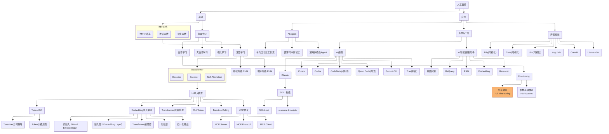
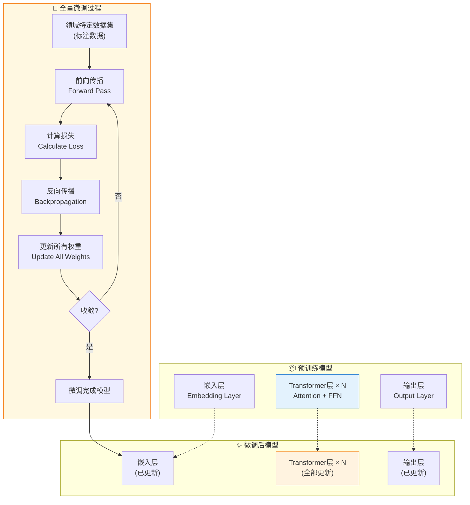

> 做一个有温度和有干货的技术分享作者 —— [Qborfy](https://qborfy.com)

今天我们来学习 **全量微调（Full Fine-tuning）**

> 一句话核心: **全量微调** 是指在微调过程中更新模型的所有参数，让模型在特定任务上达到最佳性能的技术。

通俗地讲，如果把预训练模型比作一位"全科医生"，那么全量微调就像是让他去专科医院"进修"——不仅学习专科知识，还要重新调整所有的诊疗思路和习惯，最终成为这个领域的"专家医生"。

与参数高效微调（如 LoRA）只更新部分参数不同，全量微调会改变模型的每一个"神经元连接"，因此能够获得最好的效果，但也需要更多的计算资源和时间。

它的核心价值在于**极致的性能优化**：当你追求特定任务的最高准确率、需要模型深度理解领域知识、或者有足够的计算资源时，全量微调是最佳选择。

<!-- more -->

# 是什么



通过一张图来理解全量微调的工作原理：


*图：全量微调工作流程 —— 更新所有参数以获得最佳性能*



**全量微调工作流程说明**：

这个流程的核心在于**更新所有参数**：

1. **加载预训练模型**：
   - 从预训练权重开始（如 GPT、LLaMA、BERT）
   - 保留模型架构不变
   - 所有参数初始化为预训练值

2. **全量微调训练**：
   - 使用特定领域的标注数据
   - 前向传播计算预测结果
   - 计算损失函数（如交叉熵）
   - 反向传播计算所有参数的梯度
   - 使用优化器（如 AdamW）更新**所有权重**
   - 重复直到模型收敛

3. **获得专用模型**：
   - 所有层都经过重新训练
   - 模型深度适应特定任务
   - 通常能达到最佳性能

## 全量微调的核心特征

### 1. 参数更新范围

**全量微调 vs 其他微调方式**：

| **维度** | 全量微调 | LoRA/Adapter | Prompt Tuning |
|---------|---------|-------------|---------------|
| 更新参数 | **所有参数** | 少量适配器参数 | 仅提示嵌入 |
| 训练成本 | 高 | 低 | 极低 |
| 显存需求 | 大（需完整模型） | 小 | 极小 |
| 最终效果 | **最佳** | 接近全量 | 一般 |
| 训练时间 | 长 | 短 | 极短 |
| 模型体积 | 与原始相同 | 增加少量 | 与原始相同 |
| 适用场景 | 追求极致性能 | 资源受限 | 快速实验 |

### 2. 全量微调的优势

- **最佳性能**：因为调整了所有参数，能达到该架构下的最优效果
- **深度适应**：模型可以完全适应特定领域的语言模式和知识结构
- **无需技巧**：不需要复杂的适配器设计或提示工程
- **简单直接**：训练流程标准，易于理解和实现

### 3. 全量微调的挑战

- **计算资源要求高**：需要大量 GPU 显存和算力
- **训练时间长**：更新数十亿参数需要更多迭代
- **过拟合风险**：参数过多容易在小型数据集上过拟合
- **灾难性遗忘**：可能丢失预训练学到的通用知识

## 全量微调的适用场景

| **场景** | **是否推荐** | **原因** |
|---------|------------|---------|
| 追求最高准确率 | ✅ 强烈推荐 | 全量微调能达到架构上限 |
| 大型数据集（10万+） | ✅ 推荐 | 数据充足，不易过拟合 |
| 领域差异大 | ✅ 推荐 | 需要深度调整模型内部表示 |
| 计算资源充足 | ✅ 推荐 | 有 A100/H100 等高端 GPU |
| 小型数据集（<1万） | ❌ 不推荐 | 容易过拟合 |
| 快速迭代实验 | ❌ 不推荐 | 训练时间长，成本高 |
| 边缘设备部署 | ❌ 不推荐 | 模型体积大，推理成本高 |
| 多任务场景 | ❌ 不推荐 | 每个任务需单独微调 |

# 怎么做

下面我们通过实际案例来学习如何进行全量微调。

## 案例 1：使用 Hugging Face Transformers 全量微调 GPT-2

这是一个完整的中文情感分析微调示例，展示如何使用 Transformers 库进行全量微调。

**场景描述**：

- 基于 GPT-2 模型微调一个中文情感分析器
- 训练集：电商评论数据（正面/负面）
- 目标：让模型学会判断评论情感倾向

**完整代码实现**：

```python
# full_finetuning_gpt2.py
"""
GPT-2 全量微调示例 - 中文情感分析
"""

import torch
from transformers import (
    AutoTokenizer, 
    AutoModelForSequenceClassification,
    TrainingArguments, 
    Trainer,
    DataCollatorWithPadding
)
from datasets import load_dataset
import numpy as np
from sklearn.metrics import accuracy_score, f1_score

# ========== 1. 配置参数 ==========
MODEL_NAME = "gpt2"  # 或者使用 "gpt2-medium", "gpt2-large"
OUTPUT_DIR = "./gpt2-sentiment-finetuned"
NUM_LABELS = 2  # 正面、负面

# 训练超参数
BATCH_SIZE = 8
LEARNING_RATE = 5e-5
NUM_EPOCHS = 3
MAX_LENGTH = 128

# ========== 2. 加载模型和分词器 ==========
print("🔄 正在加载模型和分词器...")

# 加载分词器
tokenizer = AutoTokenizer.from_pretrained(MODEL_NAME)
# GPT-2 没有 pad_token，需要手动设置
tokenizer.pad_token = tokenizer.eos_token

# 加载模型，指定分类任务
model = AutoModelForSequenceClassification.from_pretrained(
    MODEL_NAME,
    num_labels=NUM_LABELS,
    # 重要：全量微调不需要冻结任何参数
    # 所有参数默认都是可训练的
)

# 设置模型的 pad_token_id
model.config.pad_token_id = tokenizer.pad_token_id

print(f"✅ 模型加载完成")
print(f"📊 总参数量: {sum(p.numel() for p in model.parameters()) / 1e6:.2f}M")
print(f"🔧 可训练参数量: {sum(p.numel() for p in model.parameters() if p.requires_grad) / 1e6:.2f}M")

# ========== 3. 准备数据集 ==========
print("\n🔄 正在准备数据集...")

# 假设我们有一个CSV文件：text,label
# label: 0=负面, 1=正面
dataset = load_dataset("csv", data_files={
    "train": "train.csv",
    "validation": "val.csv"
})

def preprocess_function(examples):
    """数据预处理函数"""
    # 对文本进行分词
    tokenized = tokenizer(
        examples["text"],
        truncation=True,
        padding=False,  # 使用 DataCollator 动态填充
        max_length=MAX_LENGTH
    )
    tokenized["labels"] = examples["label"]
    return tokenized

# 应用预处理
tokenized_datasets = dataset.map(
    preprocess_function,
    batched=True,
    remove_columns=dataset["train"].column_names
)

print(f"✅ 数据集准备完成")
print(f"📈 训练集大小: {len(tokenized_datasets['train'])}")
print(f"📈 验证集大小: {len(tokenized_datasets['validation'])}")

# ========== 4. 定义评估指标 ==========
def compute_metrics(eval_pred):
    """计算评估指标"""
    predictions, labels = eval_pred
    predictions = np.argmax(predictions, axis=1)
    
    return {
        "accuracy": accuracy_score(labels, predictions),
        "f1": f1_score(labels, predictions, average="weighted")
    }

# ========== 5. 配置训练参数 ==========
print("\n🔄 配置训练参数...")

training_args = TrainingArguments(
    output_dir=OUTPUT_DIR,
    
    # 训练参数
    num_train_epochs=NUM_EPOCHS,
    per_device_train_batch_size=BATCH_SIZE,
    per_device_eval_batch_size=BATCH_SIZE * 2,
    
    # 优化参数
    learning_rate=LEARNING_RATE,
    weight_decay=0.01,  # L2正则化，防止过拟合
    warmup_ratio=0.1,   # 学习率预热
    
    # 评估和保存
    evaluation_strategy="epoch",
    save_strategy="epoch",
    load_best_model_at_end=True,
    metric_for_best_model="f1",
    
    # 日志
    logging_dir=f"{OUTPUT_DIR}/logs",
    logging_steps=100,
    
    # 混合精度训练（节省显存）
    fp16=torch.cuda.is_available(),
    
    # 其他
    seed=42,
    remove_unused_columns=False,
)

# 数据整理器（动态填充）
data_collator = DataCollatorWithPadding(tokenizer=tokenizer)

# ========== 6. 创建训练器 ==========
trainer = Trainer(
    model=model,
    args=training_args,
    train_dataset=tokenized_datasets["train"],
    eval_dataset=tokenized_datasets["validation"],
    tokenizer=tokenizer,
    data_collator=data_collator,
    compute_metrics=compute_metrics,
)

# ========== 7. 开始训练 ==========
print("\n🚀 开始全量微调训练...")
print("⚠️  这将更新模型的所有参数！")

trainer.train()

# ========== 8. 保存模型 ==========
print("\n💾 保存微调后的模型...")
trainer.save_model(OUTPUT_DIR)
tokenizer.save_pretrained(OUTPUT_DIR)

print(f"✅ 模型已保存到: {OUTPUT_DIR}")

# ========== 9. 测试模型 ==========
print("\n🧪 测试微调后的模型...")

# 加载微调后的模型
from transformers import pipeline

classifier = pipeline(
    "sentiment-analysis",
    model=OUTPUT_DIR,
    tokenizer=OUTPUT_DIR,
    device=0 if torch.cuda.is_available() else -1
)

# 测试样例
test_texts = [
    "这个产品质量非常好，强烈推荐！",
    "太失望了，完全不值这个价钱",
    "物流很快，包装也很精美",
    "客服态度太差了，再也不买了"
]

print("\n测试结果:")
for text in test_texts:
    result = classifier(text)[0]
    label = "正面" if result["label"] == "LABEL_1" else "负面"
    print(f"文本: {text}")
    print(f"预测: {label} (置信度: {result['score']:.4f})\n")

print("🎉 全量微调完成！")
```

**训练输出示例**：

```
🔄 正在加载模型和分词器...
✅ 模型加载完成
📊 总参数量: 124.44M
🔧 可训练参数量: 124.44M  ← 所有参数都参与训练

🚀 开始全量微调训练...
Epoch 1/3: 100%|████████| 1250/1250 [15:23<00:00, 1.35it/s]
{'loss': 0.3256, 'accuracy': 0.8754, 'f1': 0.8741}

Epoch 2/3: 100%|████████| 1250/1250 [15:18<00:00, 1.36it/s]
{'loss': 0.1423, 'accuracy': 0.9521, 'f1': 0.9518}

Epoch 3/3: 100%|████████| 1250/1250 [15:21<00:00, 1.36it/s]
{'loss': 0.0892, 'accuracy': 0.9712, 'f1': 0.9710}

🎉 全量微调完成！
```

## 案例 2：使用 PyTorch Lightning 进行 LLaMA 全量微调

这个案例展示如何使用 PyTorch Lightning 框架进行更专业的全量微调，包括分布式训练支持。

**场景描述**：

- 基于 LLaMA-2-7B 模型进行指令微调
- 使用 Alpaca 格式的指令数据集
- 支持多 GPU 分布式训练

```python
# llama_full_finetuning.py
"""
LLaMA-2 全量微调示例 - 使用 PyTorch Lightning
支持多 GPU 分布式训练
"""

import torch
import torch.nn as nn
from torch.utils.data import DataLoader, Dataset
import pytorch_lightning as pl
from pytorch_lightning.callbacks import ModelCheckpoint, EarlyStopping
from transformers import (
    LlamaForCausalLM, 
    LlamaTokenizer,
    get_linear_schedule_with_warmup
)
from peft import get_peft_model, LoraConfig, TaskType  # 用于对比
import json
from typing import Optional

# ========== 配置参数 ==========
class Config:
    """训练配置"""
    # 模型配置
    MODEL_NAME = "meta-llama/Llama-2-7b-hf"
    
    # 训练配置
    BATCH_SIZE = 4  # 根据显存调整
    GRADIENT_ACCUMULATION_STEPS = 4  # 梯度累积，等效 batch_size = 16
    MAX_LENGTH = 512
    LEARNING_RATE = 2e-5
    WEIGHT_DECAY = 0.01
    WARMUP_STEPS = 100
    MAX_EPOCHS = 3
    
    # 优化配置
    FP16 = True  # 混合精度训练
    GRADIENT_CLIP_VAL = 1.0  # 梯度裁剪
    
    # 路径配置
    OUTPUT_DIR = "./llama2-full-finetuned"
    TRAIN_FILE = "alpaca_train.json"
    VAL_FILE = "alpaca_val.json"


# ========== 数据集类 ==========
class AlpacaDataset(Dataset):
    """Alpaca 格式数据集"""
    
    def __init__(self, data_path: str, tokenizer: LlamaTokenizer, max_length: int = 512):
        self.tokenizer = tokenizer
        self.max_length = max_length
        
        # 加载数据
        with open(data_path, 'r', encoding='utf-8') as f:
            self.data = json.load(f)
    
    def __len__(self):
        return len(self.data)
    
    def __getitem__(self, idx):
        item = self.data[idx]
        
        # 构建提示词
        if item.get("input"):
            prompt = f"### Instruction:\n{item['instruction']}\n\n### Input:\n{item['input']}\n\n### Response:\n"
        else:
            prompt = f"### Instruction:\n{item['instruction']}\n\n### Response:\n"
        
        response = item['output']
        full_text = prompt + response
        
        # 分词
        prompt_tokens = self.tokenizer(prompt, truncation=True, max_length=self.max_length, add_special_tokens=False)
        full_tokens = self.tokenizer(full_text, truncation=True, max_length=self.max_length)
        
        input_ids = full_tokens['input_ids']
        attention_mask = full_tokens['attention_mask']
        
        # 构建标签：只计算 response 部分的损失
        labels = [-100] * len(prompt_tokens['input_ids']) + input_ids[len(prompt_tokens['input_ids']):]
        labels = labels[:self.max_length]  # 截断
        labels += [-100] * (len(input_ids) - len(labels))  # 填充
        
        return {
            'input_ids': torch.tensor(input_ids),
            'attention_mask': torch.tensor(attention_mask),
            'labels': torch.tensor(labels)
        }


# ========== Lightning 模块 ==========
class LLaMAFineTuner(pl.LightningModule):
    """
    LLaMA 全量微调 Lightning 模块
    """
    
    def __init__(self, config: Config):
        super().__init__()
        self.config = config
        self.save_hyperparameters()
        
        print("🔄 正在加载 LLaMA 模型...")
        
        # 加载模型和分词器
        self.tokenizer = LlamaTokenizer.from_pretrained(config.MODEL_NAME)
        self.tokenizer.pad_token = self.tokenizer.eos_token
        
        self.model = LlamaForCausalLM.from_pretrained(
            config.MODEL_NAME,
            torch_dtype=torch.float16 if config.FP16 else torch.float32,
            device_map=None,  # Lightning 会处理设备分配
        )
        
        # ⚠️ 重要：全量微调 - 确保所有参数都可训练
        for param in self.model.parameters():
            param.requires_grad = True
        
        # 打印训练信息
        total_params = sum(p.numel() for p in self.model.parameters())
        trainable_params = sum(p.numel() for p in self.model.parameters() if p.requires_grad)
        print(f"📊 总参数量: {total_params / 1e9:.2f}B")
        print(f"🔧 可训练参数量: {trainable_params / 1e9:.2f}B ({trainable_params/total_params*100:.2f}%)")
    
    def forward(self, input_ids, attention_mask, labels=None):
        """前向传播"""
        return self.model(
            input_ids=input_ids,
            attention_mask=attention_mask,
            labels=labels
        )
    
    def training_step(self, batch, batch_idx):
        """训练步骤"""
        outputs = self(**batch)
        loss = outputs.loss
        
        # 考虑梯度累积后的实际 loss
        self.log('train_loss', loss, prog_bar=True, on_step=True, on_epoch=True)
        
        return loss
    
    def validation_step(self, batch, batch_idx):
        """验证步骤"""
        outputs = self(**batch)
        loss = outputs.loss
        
        self.log('val_loss', loss, prog_bar=True, on_epoch=True)
        
        return loss
    
    def configure_optimizers(self):
        """配置优化器和学习率调度"""
        
        # 优化器
        optimizer = torch.optim.AdamW(
            self.parameters(),
            lr=self.config.LEARNING_RATE,
            weight_decay=self.config.WEIGHT_DECAY,
            betas=(0.9, 0.999)
        )
        
        # 学习率调度器
        total_steps = self.trainer.estimated_stepping_batches
        scheduler = get_linear_schedule_with_warmup(
            optimizer,
            num_warmup_steps=self.config.WARMUP_STEPS,
            num_training_steps=total_steps
        )
        
        return {
            'optimizer': optimizer,
            'lr_scheduler': {
                'scheduler': scheduler,
                'interval': 'step'
            }
        }
    
    def train_dataloader(self):
        """训练数据加载器"""
        dataset = AlpacaDataset(
            self.config.TRAIN_FILE,
            self.tokenizer,
            self.config.MAX_LENGTH
        )
        return DataLoader(
            dataset,
            batch_size=self.config.BATCH_SIZE,
            shuffle=True,
            num_workers=4,
            pin_memory=True
        )
    
    def val_dataloader(self):
        """验证数据加载器"""
        dataset = AlpacaDataset(
            self.config.VAL_FILE,
            self.tokenizer,
            self.config.MAX_LENGTH
        )
        return DataLoader(
            dataset,
            batch_size=self.config.BATCH_SIZE,
            shuffle=False,
            num_workers=4,
            pin_memory=True
        )


# ========== 主函数 ==========
def main():
    """主训练函数"""
    
    config = Config()
    
    # 设置随机种子
    pl.seed_everything(42)
    
    # 配置回调函数
    checkpoint_callback = ModelCheckpoint(
        dirpath=config.OUTPUT_DIR,
        filename='llama2-best-{epoch:02d}-{val_loss:.2f}',
        save_top_k=3,
        monitor='val_loss',
        mode='min',
        save_last=True
    )
    
    early_stop_callback = EarlyStopping(
        monitor='val_loss',
        patience=3,
        mode='min'
    )
    
    # 配置训练器
    trainer = pl.Trainer(
        max_epochs=config.MAX_EPOCHS,
        accelerator='gpu',
        devices=-1,  # 使用所有可用 GPU
        strategy='ddp',  # 分布式数据并行
        precision=16 if config.FP16 else 32,
        gradient_clip_val=config.GRADIENT_CLIP_VAL,
        accumulate_grad_batches=config.GRADIENT_ACCUMULATION_STEPS,
        callbacks=[checkpoint_callback, early_stop_callback],
        log_every_n_steps=10,
    )
    
    # 创建模型
    model = LLaMAFineTuner(config)
    
    # 开始训练
    print("\n🚀 开始全量微调训练...")
    print(f"⚠️  注意：这将更新模型的全部 {sum(p.numel() for p in model.model.parameters()) / 1e9:.2f}B 参数！")
    print(f"💡 使用梯度累积，等效 batch size: {config.BATCH_SIZE * config.GRADIENT_ACCUMULATION_STEPS}")
    
    trainer.fit(model)
    
    # 保存最终模型
    print("\n💾 保存最终模型...")
    model.model.save_pretrained(f"{config.OUTPUT_DIR}/final")
    model.tokenizer.save_pretrained(f"{config.OUTPUT_DIR}/final")
    
    print(f"✅ 训练完成！模型保存在: {config.OUTPUT_DIR}/final")


# ========== 推理测试 ==========
def test_model(model_path: str):
    """测试微调后的模型"""
    
    print("🧪 加载微调后的模型进行测试...")
    
    tokenizer = LlamaTokenizer.from_pretrained(model_path)
    model = LlamaForCausalLM.from_pretrained(
        model_path,
        torch_dtype=torch.float16,
        device_map="auto"
    )
    
    # 测试指令
    test_instructions = [
        "解释什么是机器学习",
        "写一首关于春天的短诗",
        "如何学习 Python 编程？",
    ]
    
    model.eval()
    with torch.no_grad():
        for instruction in test_instructions:
            prompt = f"### Instruction:\n{instruction}\n\n### Response:\n"
            
            inputs = tokenizer(prompt, return_tensors="pt").to(model.device)
            outputs = model.generate(
                **inputs,
                max_new_tokens=256,
                temperature=0.7,
                top_p=0.9,
                do_sample=True
            )
            
            response = tokenizer.decode(outputs[0], skip_special_tokens=True)
            response = response.split("### Response:\n")[-1].strip()
            
            print(f"\n📝 指令: {instruction}")
            print(f"🤖 回答: {response[:200]}...")


if __name__ == "__main__":
    # 训练
    main()
    
    # 测试
    # test_model("./llama2-full-finetuned/final")
```

**运行命令（多 GPU）**：

```bash
# 单 GPU 训练
python llama_full_finetuning.py

# 多 GPU 训练（4张卡）
torchrun --nproc_per_node=4 llama_full_finetuning.py

# 或使用 Lightning CLI
python llama_full_finetuning.py fit --trainer.devices=4
```

**显存优化技巧**：

```python
# 如果显存不足，可以使用以下技巧：

# 1. 梯度检查点（以时间换空间）
model.gradient_checkpointing_enable()

# 2. 使用 DeepSpeed ZeRO-3（极致显存优化）
from pytorch_lightning.strategies import DeepSpeedStrategy

trainer = pl.Trainer(
    strategy=DeepSpeedStrategy(
        stage=3,
        offload_optimizer=True,  # 将优化器状态卸载到 CPU
        offload_parameters=True,  # 将参数卸载到 CPU
    ),
    # ...
)

# 3. 使用 8-bit Adam 优化器
from bitsandbytes.optim import Adam8bit

optimizer = Adam8bit(
    model.parameters(),
    lr=config.LEARNING_RATE,
    weight_decay=config.WEIGHT_DECAY
)
```

# 最佳实践

## 1. 超参数调优建议

| **参数** | **推荐值** | **说明** |
|---------|-----------|---------|
| 学习率 | 1e-5 ~ 5e-5 | 全量微调使用较小学习率，防止破坏预训练知识 |
| Batch Size | 8-32 | 越大越好，使用梯度累积达到目标值 |
| 训练轮数 | 3-5 | 监控验证集损失，防止过拟合 |
| 权重衰减 | 0.01-0.1 | L2正则化，防止过拟合 |
| 学习率预热 | 10% | 前10%步数线性增加学习率 |
| 最大序列长度 | 512-2048 | 根据任务需求调整 |

## 2. 训练技巧

### 技巧 1：混合精度训练

```python
# 使用 FP16 或 BF16 节省显存
training_args = TrainingArguments(
    fp16=True,  # 或 bf16=True（A100/H100 推荐）
    # ...
)
```

### 技巧 2：梯度累积

```python
# 小 batch 累积达到大 batch 效果
training_args = TrainingArguments(
    per_device_train_batch_size=4,
    gradient_accumulation_steps=8,  # 等效 batch_size = 32
    # ...
)
```

### 技巧 3：梯度裁剪

```python
# 防止梯度爆炸
training_args = TrainingArguments(
    max_grad_norm=1.0,  # 梯度裁剪阈值
    # ...
)
```

### 技巧 4：早停机制

```python
from transformers import EarlyStoppingCallback

trainer = Trainer(
    # ...
    callbacks=[EarlyStoppingCallback(early_stopping_patience=3)]
)
```

## 3. 常见陷阱与解决方案

| **问题** | **症状** | **原因** | **解决方案** |
|---------|---------|---------|-------------|
| 灾难性遗忘 | 通用能力下降 | 过度拟合特定任务 | 混合通用数据、降低学习率、使用 LoRA |
| 过拟合 | 训练 loss ↓ 验证 loss ↑ | 数据太少、训练太久 | 增加数据、早停、正则化、dropout |
| 训练不稳定 | loss 波动大 | 学习率过高 | 降低学习率、增加 warmup、梯度裁剪 |
| 显存不足 | OOM 错误 | 模型太大 | 梯度检查点、减小 batch、使用 DeepSpeed |
| 收敛慢 | loss 下降慢 | 学习率过低 | 适当提高学习率、检查数据质量 |
| 模型退化 | 输出无意义 | 训练数据有问题 | 检查数据格式、清洗数据 |

## 4. 数据准备最佳实践

```python
# 高质量数据格式示例（对话式）
{
    "messages": [
        {"role": "system", "content": "你是一个专业的编程助手"},
        {"role": "user", "content": "如何用 Python 读取 CSV 文件？"},
        {"role": "assistant", "content": "可以使用 pandas 库..."}
    ]
}

# 数据检查清单：
# ✓ 输入-输出格式统一
# ✓ 去除重复样本
# ✓ 人工校验质量
# ✓ 覆盖各种场景
# ✓ 训练/验证集不重叠
```

# 总结

全量微调是追求极致性能的**终极武器**。

## 核心要点回顾

1. **是什么**：更新模型的所有参数，深度适配特定任务
2. **核心优势**：能达到架构下的最佳性能
3. **主要挑战**：计算资源要求高、容易过拟合
4. **适用场景**：追求最高准确率、大型数据集、充足计算资源
5. **关键技巧**：混合精度、梯度累积、学习率预热、早停

## 快速上手建议

| **需求** | **推荐方案** | **预计成本** |
|---------|-------------|-------------|
| 快速验证想法 | 先用 LoRA 测试 | 1 张 3090 |
| 中等规模项目 | 全量微调 GPT-2/7B | 1-4 张 A100 |
| 企业级应用 | 全量微调 13B+ | 8+ 张 A100/H100 |
| 极致性能 | 全量微调 + 数据增强 | 专业 GPU 集群 |

## 学习资源推荐

- [Hugging Face Fine-tuning Guide](https://huggingface.co/docs/transformers/training)
- [PyTorch Lightning Documentation](https://lightning.ai/docs/pytorch/stable/)
- [DeepSpeed Training Guide](https://www.deepspeed.ai/tutorials/)
- [LLaMA Fine-tuning Best Practices](https://huggingface.co/blog/llama2)

> 💡 **一句话总结**：全量微调就像是"让医生去专科医院进修"——虽然投入大、时间长，但能培养出真正的领域专家。

---

**感谢阅读！如果你觉得今天的内容对你有帮助，欢迎分享给你的朋友，一起学习成长！** 🚀