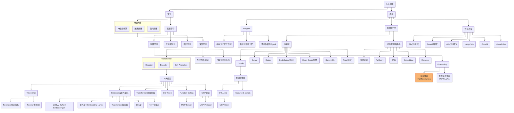
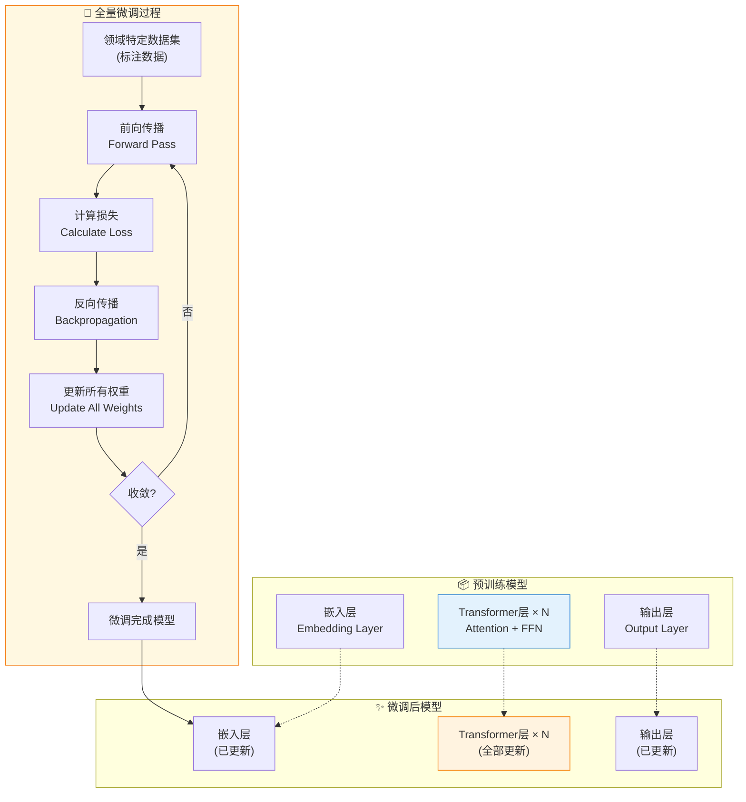

> 做一个有温度和有干货的技术分享作者 —— [Qborfy](https://qborfy.com)

今天聊聊 **全量微调（Full Fine-tuning）**。

说实话，我第一次听说这个词的时候，脑子里冒出的画面是——把整个模型丢进炼丹炉里重新炼一遍。后来发现，好像也差不多？全量微调就是**更新模型的所有参数**，让它在你想要的任务上发挥到极致。

打个比方，它像是让一位全科医生去三甲医院"进修"——不学个皮毛就完事，而是从内到外彻底改造，最后变成这个领域真正的专家。

代价嘛，你也猜到了：时间久、成本高、对设备要求苛刻。但好处也很直接：**效果最好，没有之一**。

整个流程大致是这样：加载预训练模型 → 全量微调训练（所有参数参与） → 收获专用模型。

<!-- more -->

# 它到底是什么




_图：全量微调工作流程 —— 更新所有参数以获得最佳性能_



## 微调方法对比

| **维度** | 全量微调         | LoRA/Adapter   | Prompt Tuning |
| -------- | ---------------- | -------------- | ------------- |
| 更新参数 | **所有参数**     | 少量适配器参数 | 仅提示嵌入    |
| 训练成本 | 高               | 低             | 极低          |
| 显存需求 | 大（需完整模型） | 小             | 极小          |
| 最终效果 | **最佳**         | 接近全量       | 一般          |
| 训练时间 | 长               | 短             | 极短          |
| 适用场景 | 追求极致性能     | 资源受限       | 快速实验      |

## 什么时候用？

| **场景**          | **建议**  | **原因**                       |
| ----------------- | --------- | ------------------------------ |
| 追求最高准确率    | ✅ 推荐   | 理论上的效果天花板             |
| 数据量 > 10 万条  | ✅ 推荐   | 数据管够，不怕过拟合           |
| 有 A100/H100 集群 | ✅ 推荐   | 算力管够，追求极致             |
| 数据量 < 1 万条   | ❌ 不推荐 | 99%会过拟合，不如用 LoRA       |
| 想快速验证想法    | ❌ 不推荐 | 训练太慢                       |
| 多任务场景        | ❌ 不推荐 | 每个任务需单独微调，维护成本高 |

# 动手试试

说了那么多，直接上代码吧。下面是用 Hugging Face Transformers 做全量微调的最简示例：

```python
from transformers import AutoTokenizer, AutoModelForSequenceClassification, Trainer, TrainingArguments

# 1. 加载模型（所有参数默认可训练）
model = AutoModelForSequenceClassification.from_pretrained("gpt2", num_labels=2)
tokenizer = AutoTokenizer.from_pretrained("gpt2")
tokenizer.pad_token = tokenizer.eos_token

# 2. 准备数据（假设已有 train_dataset 和 val_dataset）
# 数据格式: {"text": "评论内容", "label": 0/1}

# 3. 配置训练参数
training_args = TrainingArguments(
    output_dir="./gpt2-finetuned",
    num_train_epochs=3,
    per_device_train_batch_size=8,
    learning_rate=5e-5,
    fp16=True,  # 混合精度节省显存
    evaluation_strategy="epoch",
    save_strategy="epoch",
    load_best_model_at_end=True,
)

# 4. 创建 Trainer（全量微调的关键：不冻结任何参数）
trainer = Trainer(
    model=model,
    args=training_args,
    train_dataset=train_dataset,
    eval_dataset=val_dataset,
)

# 5. 开始训练（更新所有 124M 参数）
trainer.train()
```

**关键配置技巧**：

| **技巧**   | **代码**                                | **作用**           |
| ---------- | --------------------------------------- | ------------------ |
| 混合精度   | `fp16=True`                             | 节省 50% 显存      |
| 梯度累积   | `gradient_accumulation_steps=4`         | 小显存模拟大 batch |
| 梯度裁剪   | `max_grad_norm=1.0`                     | 防止 loss 爆炸     |
| 学习率预热 | `warmup_ratio=0.1`                      | 稳定训练初期       |
| 显存不够？ | `model.gradient_checkpointing_enable()` | 时间换空间         |

## 显存优化方案

如果显存不够，可以用 DeepSpeed ZeRO-3：

```python
from pytorch_lightning.strategies import DeepSpeedStrategy

trainer = Trainer(
    strategy=DeepSpeedStrategy(
        stage=3,
        offload_optimizer=True,   # 优化器状态放 CPU
        offload_parameters=True,  # 参数也放 CPU
    ),
)
```

这样 7B 模型的显存占用能从 40GB+ 打到 24GB 左右，实测有效。

# 踩过的坑

| **坑**     | **表现**                | **怎么解决**                          |
| ---------- | ----------------------- | ------------------------------------- |
| 灾难性遗忘 | 模型突然不会通用任务了  | 混合点通用数据、降低学习率、或用 LoRA |
| 过拟合     | 训练 loss ↓ 验证 loss ↑ | 早停、加正则化、数据增强              |
| 训练不稳定 | loss 上蹿下跳           | 降低学习率、加长 warmup、开梯度裁剪   |
| 显存爆了   | OOM 报错                | 梯度检查点、减小 batch、上 DeepSpeed  |

我自己踩过最狠的坑是**灾难性遗忘**。训完情感分析模型，让它写个代码，它完全不会了。当时整个人都懵了，后来才明白是怎么回事。

# ❄️ 冷知识

**1. 全量微调 vs LoRA，到底差多少？**

全量微调用"算力换精度"，LoRA 用"适配器参数换效率"。实测下来，LoRA 能达到全量 90-95% 的效果，但成本只有 1/10。如果你不是一定要那最后 5% 的精度，LoRA 其实更香。

**2. 数据准备占 70% 的时间**

这话是我血泪总结出来的。宁可多花时间清洗数据，也别急着开训。脏数据会让你的模型学坏，而且坏得很隐蔽——训练 loss 看着正常，实际效果一塌糊涂。

**3. 学习率是全量微调的灵魂**

全量微调学习率一般设为预训练的 1/10（如 1e-5 ~ 5e-5）。我第一次训的时候设太高了，结果模型彻底放飞自我，输出完全不能看。

**4. BF16 比 FP16 稳多了**

用 A100/H100 的话，强烈推荐 BF16。它比 FP16 更稳定，精度损失也更小。我试过几次，同样配置 BF16 很少出现 loss 爆炸的情况。

# 最后说几句

**核心要点再捋一遍：**

- **是什么**：更新模型的所有参数，让它彻底适应特定任务
- **适用场景**：数据充足（>10 万条）、算力管够、追求极致效果
- **关键配置**：小学习率、早停、混合精度、梯度裁剪
- **主要风险**：灾难性遗忘、过拟合、显存爆炸

> 💡 **一句话总结**：全量微调就像是让全科医生去顶尖专科医院进修 —— 投入巨大，但如果成功了，出来的就是真正的专家。

---

**参考资源：**

- [Hugging Face Fine-tuning Guide](https://huggingface.co/docs/transformers/training)
- [DeepSpeed 官方教程](https://www.deepspeed.ai/tutorials/)
- [LLaMA Fine-tuning](https://huggingface.co/blog/llama2)
