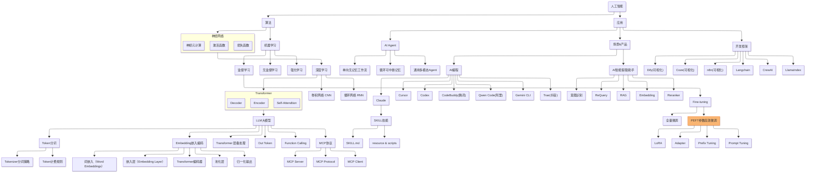
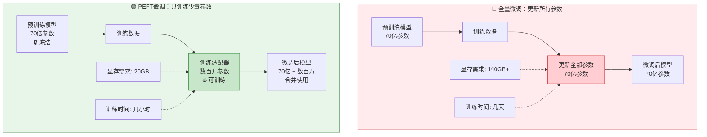
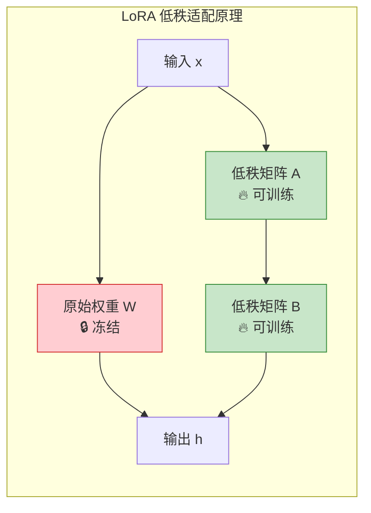
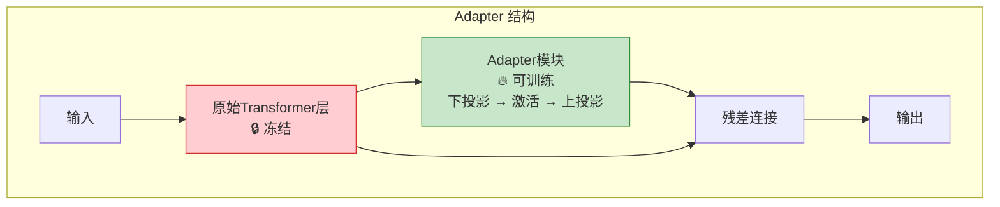
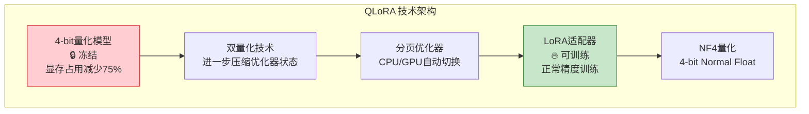

> 做一个有温度和有干货的技术分享作者 —— [Qborfy](https://qborfy.com)

今天我们来学习 **PEFT（Parameter-Efficient Fine-Tuning，参数高效微调）**

> 一句话核心: **PEFT** 是一类只训练模型少量参数就能达到全量微调效果的技术，大幅降低微调成本和资源需求。

通俗地讲，如果把全量微调比作"重新训练整个运动员的身体"，那么 PEFT 就像是"只训练运动员的手部肌肉"——不需要改变全身，只针对特定技能进行强化，就能在比赛中发挥出色。

它的核心价值在于**让微调变得经济可行**：包括降低显存需求（从几百GB降到几十GB）、减少训练时间（从几天缩短到几小时）、支持消费级显卡运行、保持模型通用能力不被遗忘等。通过 PEFT，个人开发者和小团队也能微调大模型。

<!-- more -->

# 是什么



通过一张图来理解 PEFT 的工作原理：


*图：全量微调 vs PEFT 参数对比 —— PEFT 只训练少量参数适配器，大幅降低资源消耗*



**PEFT 工作流程说明**：

这个流程的核心在于**参数冻结策略**：

1. **全量微调（Full Fine-tuning）**：
   - 更新模型的所有参数
   - 效果最好但成本极高
   - 需要专业 GPU 集群（如 A100 80GB x 8）
   - 容易忘记通用知识（灾难性遗忘）

2. **PEFT 微调**：
   - 冻结预训练模型的大部分参数
   - 只训练少量新增参数（适配器）
   - 显存需求降低 80% 以上
   - 保留原始模型的通用能力
   - 适配器可以单独保存和复用

## PEFT 的核心方法

### 1. LoRA（Low-Rank Adaptation）

**原理**：在原始权重矩阵旁边添加低秩矩阵，只训练这些低秩矩阵。



**公式**：`h = Wx + BAx`

- W：原始权重矩阵（冻结）
- A、B：低秩矩阵（可训练，r 通常设为 8-64）
- 参数量减少：从 `d×d` 降到 `2×d×r`

### 2. Adapter

**原理**：在 Transformer 层之间插入小型神经网络模块，只训练这些模块。



### 3. Prefix Tuning

**原理**：在输入前添加可训练的前缀向量，引导模型生成特定风格的输出。

### 4. Prompt Tuning

**原理**：只训练输入提示词的嵌入向量，不改变模型参数。

## PEFT vs 全量微调对比

| **维度** | 全量微调 | PEFT（LoRA） |
|----------|---------|-------------|
| 可训练参数 | 100%（70亿） | 0.1%-1%（数百万） |
| 显存需求 | 140GB+ | 16-24GB |
| 训练时间 | 几天 | 几小时 |
| 硬件要求 | A100/H100 集群 | 单张 RTX 4090 |
| 模型存储 | 完整模型（14GB） | 基础模型 + 适配器（几百MB） |
| 灾难性遗忘 | 严重 | 轻微 |
| 多任务支持 | 每个任务一个模型 | 共享基础模型+多个适配器 |
| 适用场景 | 追求极致效果 | 资源受限、快速迭代 |

# 怎么做

下面我们通过实际案例来理解 PEFT 的使用方式。

## 案例 1：使用 Hugging Face PEFT + LoRA 进行微调

**场景描述**：使用 LoRA 微调一个医疗问答模型。

**完整代码实现**：

```python
# 步骤1: 安装依赖
# pip install transformers datasets peft accelerate

import torch
from transformers import (
    AutoModelForCausalLM,
    AutoTokenizer,
    TrainingArguments,
    Trainer
)
from peft import LoraConfig, get_peft_model, TaskType
from datasets import Dataset

# 步骤2: 加载预训练模型和分词器
print("🔄 加载基础模型...")
model_name = "meta-llama/Llama-2-7b-hf"  # 或其他开源模型

# 使用4bit量化加载，进一步节省显存
model = AutoModelForCausalLM.from_pretrained(
    model_name,
    torch_dtype=torch.float16,
    device_map="auto",  # 自动分配层到GPU/CPU
)

tokenizer = AutoTokenizer.from_pretrained(model_name)
tokenizer.pad_token = tokenizer.eos_token  # 设置填充token

# 步骤3: 配置 LoRA
print("⚙️ 配置 LoRA...")
lora_config = LoraConfig(
    r=16,                    # LoRA秩，控制低秩矩阵大小（8-64常用）
    lora_alpha=32,          # 缩放系数，通常设为 2*r
    target_modules=[        # 应用LoRA的层
        "q_proj",           # Query投影层
        "v_proj",           # Value投影层
        # 可选: "k_proj", "o_proj", "gate_proj", "up_proj", "down_proj"
    ],
    lora_dropout=0.05,      # Dropout率，防止过拟合
    bias="none",            # 是否训练偏置项
    task_type=TaskType.CAUSAL_LM,  # 任务类型：因果语言模型
)

# 应用 LoRA 配置到模型
model = get_peft_model(model, lora_config)

# 查看可训练参数
model.print_trainable_parameters()
# 输出示例:
# trainable params: 8,388,608 || all params: 6,771,970,048 || trainable%: 0.1238

# 步骤4: 准备训练数据
print("📊 准备训练数据...")

# 医疗问答示例数据
train_data = [
    {
        "instruction": "请回答以下医疗问题",
        "input": "头痛伴随恶心是什么原因？",
        "output": "头痛伴随恶心可能由多种原因引起：\n1. 偏头痛：常见症状包括单侧头痛、恶心、畏光\n2. 紧张性头痛：压力或疲劳引起\n3. 颅内压增高：需要警惕，建议就医\n4. 感冒或流感：病毒感染\n\n建议：如果症状持续或加重，请及时就医检查。"
    },
    {
        "instruction": "请回答以下医疗问题",
        "input": "高血压患者饮食需要注意什么？",
        "output": "高血压患者饮食建议：\n1. 低盐饮食：每日盐摄入<6克\n2. 多吃蔬果：富含钾，有助于降压\n3. 限制饮酒：男性<25克/天，女性<15克/天\n4. 减少饱和脂肪：少吃肥肉、油炸食品\n5. 控制体重：BMI保持在18.5-24\n\n请咨询医生制定个性化方案。"
    },
    # 更多数据...
]

# 格式化数据
def format_prompt(example):
    """将数据格式化为对话形式"""
    prompt = f"""### 指令:
{example['instruction']}

### 输入:
{example['input']}

### 回答:
{example['output']}"""
    return {"text": prompt}

# 创建数据集
dataset = Dataset.from_list(train_data)
dataset = dataset.map(format_prompt)

# 步骤5: 配置训练参数
print("🎯 配置训练参数...")
training_args = TrainingArguments(
    output_dir="./medical_lora_model",  # 输出目录
    num_train_epochs=3,                 # 训练轮数
    per_device_train_batch_size=4,      # 每设备批次大小
    gradient_accumulation_steps=4,      # 梯度累积步数（有效批次=4×4=16）
    learning_rate=2e-4,                 # 学习率（LoRA通常用1e-4到2e-4）
    warmup_steps=100,                   # 预热步数
    logging_steps=10,                   # 日志记录频率
    save_steps=500,                     # 保存检查点频率
    fp16=True,                          # 使用混合精度训练
    optim="adamw_torch",                # 优化器
    report_to="none",                   # 不使用wandb等报告工具
)

# 步骤6: 创建训练器并训练
print("🚀 开始训练...")
trainer = Trainer(
    model=model,
    args=training_args,
    train_dataset=dataset,
    data_collator=lambda x: {  # 数据整理函数
        "input_ids": tokenizer(
            [item["text"] for item in x],
            padding=True,
            truncation=True,
            max_length=512,
            return_tensors="pt"
        )["input_ids"],
        "labels": tokenizer(
            [item["text"] for item in x],
            padding=True,
            truncation=True,
            max_length=512,
            return_tensors="pt"
        )["input_ids"],
    },
)

# 开始训练
trainer.train()

# 步骤7: 保存模型
print("💾 保存模型...")
model.save_pretrained("./medical_lora_adapter")  # 只保存LoRA适配器
tokenizer.save_pretrained("./medical_lora_adapter")

print("✅ 训练完成！")
```

**使用微调后的模型**：

```python
from peft import PeftModel

# 加载基础模型和 LoRA 适配器
base_model = AutoModelForCausalLM.from_pretrained(
    model_name,
    torch_dtype=torch.float16,
    device_map="auto"
)
model = PeftModel.from_pretrained(base_model, "./medical_lora_adapter")

# 合并权重（可选，合并后推理更快）
model = model.merge_and_unload()

# 推理测试
prompt = """### 指令:
请回答以下医疗问题

### 输入:
糖尿病患者可以吃水果吗？

### 回答:"""

inputs = tokenizer(prompt, return_tensors="pt").to("cuda")
outputs = model.generate(
    **inputs,
    max_new_tokens=200,
    temperature=0.7,
    do_sample=True
)
response = tokenizer.decode(outputs[0], skip_special_tokens=True)
print(response)
```

## 案例 2：使用 QLoRA（量化 + LoRA）进行高效微调

**场景描述**：在消费级显卡（如 RTX 4090 24GB）上微调 70 亿参数模型。

**QLoRA 原理**：



**完整代码实现**：

```python
# 步骤1: 安装依赖
# pip install transformers datasets peft accelerate bitsandbytes

import torch
from transformers import (
    AutoModelForCausalLM,
    AutoTokenizer,
    BitsAndBytesConfig,  # 量化配置
    TrainingArguments,
    Trainer
)
from peft import LoraConfig, get_peft_model, prepare_model_for_kbit_training
from datasets import Dataset

# 步骤2: 配置 4-bit 量化
print("⚙️ 配置 4-bit 量化...")
bnb_config = BitsAndBytesConfig(
    load_in_4bit=True,                          # 启用4-bit量化
    bnb_4bit_quant_type="nf4",                  # NF4量化类型（推荐）
    bnb_4bit_compute_dtype=torch.float16,       # 计算精度
    bnb_4bit_use_double_quant=True,             # 嵌套量化，进一步节省显存
)

# 步骤3: 加载量化模型
print("🔄 加载量化模型...")
model_name = "meta-llama/Llama-2-7b-hf"

model = AutoModelForCausalLM.from_pretrained(
    model_name,
    quantization_config=bnb_config,  # 使用量化配置
    device_map="auto",               # 自动分配层
    trust_remote_code=True,
)

# 准备模型用于训练（梯度检查点等）
model = prepare_model_for_kbit_training(model)

tokenizer = AutoTokenizer.from_pretrained(model_name)
tokenizer.pad_token = tokenizer.eos_token

# 步骤4: 配置 LoRA
print("⚙️ 配置 LoRA...")
lora_config = LoraConfig(
    r=64,               # 更大的秩，QLoRA可以承受
    lora_alpha=16,
    target_modules=[
        "q_proj",
        "k_proj",
        "v_proj",
        "o_proj",
        "gate_proj",
        "up_proj",
        "down_proj",
    ],
    lora_dropout=0.05,
    bias="none",
    task_type="CAUSAL_LM",
)

model = get_peft_model(model, lora_config)
model.print_trainable_parameters()

# 步骤5: 准备数据（与案例1类似）
print("📊 准备数据...")

# 代码生成示例数据
code_data = [
    {
        "instruction": "编写一个Python函数",
        "input": "计算斐波那契数列的第n项",
        "output": """def fibonacci(n):
    \"\"\"
    计算斐波那契数列的第n项
    
    Args:
        n: 第n项（从0开始）
    
    Returns:
        第n项的值
    \"\"\"
    if n <= 1:
        return n
    a, b = 0, 1
    for _ in range(2, n + 1):
        a, b = b, a + b
    return b"""
    },
    # 更多代码示例...
]

def format_code_prompt(example):
    prompt = f"""### 指令:
{example['instruction']}

### 输入:
{example['input']}

### 代码:
{example['output']}"""
    return {"text": prompt}

dataset = Dataset.from_list(code_data)
dataset = dataset.map(format_code_prompt)

# 步骤6: 配置训练（启用更多优化）
print("🎯 配置训练...")
training_args = TrainingArguments(
    output_dir="./code_qlora_model",
    num_train_epochs=3,
    per_device_train_batch_size=1,      # QLoRA可以用更大的有效批次
    gradient_accumulation_steps=8,      # 有效批次 = 1×8 = 8
    learning_rate=2e-4,
    warmup_ratio=0.03,                  # 按比例设置预热
    logging_steps=10,
    save_strategy="epoch",              # 每轮保存
    fp16=True,
    optim="paged_adamw_8bit",           # 分页优化器，节省显存
    group_by_length=True,               # 按长度分组，提高效率
)

# 步骤7: 训练
print("🚀 开始训练...")
trainer = Trainer(
    model=model,
    args=training_args,
    train_dataset=dataset,
    data_collator=lambda x: {
        "input_ids": tokenizer(
            [item["text"] for item in x],
            padding=True,
            truncation=True,
            max_length=1024,
            return_tensors="pt"
        )["input_ids"],
        "labels": tokenizer(
            [item["text"] for item in x],
            padding=True,
            truncation=True,
            max_length=1024,
            return_tensors="pt"
        )["input_ids"],
    },
)

trainer.train()

# 步骤8: 保存（只保存适配器，非常小）
print("💾 保存模型...")
model.save_pretrained("./code_qlora_adapter")

print("✅ QLoRA 训练完成！")
print(f"适配器大小: 约 {sum(p.numel() for p in model.parameters() if p.requires_grad) * 2 / 1024 / 1024:.2f} MB")
```

**显存对比**：

| 方法 | 模型大小 | 训练显存 | 可训练参数 |
|------|---------|---------|-----------|
| 全量微调 | FP16 (14GB) | 140GB+ | 70亿 |
| LoRA | FP16 (14GB) | 24GB | 800万 |
| QLoRA | NF4 (4GB) | 16GB | 800万 |

# 最佳实践

## 1. PEFT 方法选择指南

| 场景 | 推荐方法 | 原因 |
|------|---------|------|
| 快速验证想法 | Prompt Tuning | 最简单，几乎零成本 |
| 文本生成任务 | LoRA / QLoRA | 效果最好，社区支持完善 |
| 多任务场景 | Adapter | 容易切换不同任务适配器 |
| 消费级显卡 | QLoRA | 显存需求最低 |
| 追求极致效果 | LoRA (r=64+) | 可训练参数多，效果接近全量 |
| 序列到序列任务 | Prefix Tuning | 对生成任务效果好 |

## 2. LoRA 超参数配置建议

**秩（r）的选择**：

| 模型大小 | 任务复杂度 | 推荐 r | 推荐 alpha |
|---------|-----------|--------|-----------|
| 7B | 简单任务 | 8-16 | 16-32 |
| 7B | 复杂任务 | 32-64 | 64-128 |
| 13B+ | 简单任务 | 16-32 | 32-64 |
| 13B+ | 复杂任务 | 64-256 | 128-512 |

**学习率建议**：

```python
# LoRA 学习率通常比全量微调高10倍
lora_lr = 1e-4  # 到 2e-4
full_finetune_lr = 1e-5  # 到 2e-5
```

**目标模块选择**：

```python
# 最小配置（节省显存）
target_modules = ["q_proj", "v_proj"]

# 推荐配置（平衡效果和显存）
target_modules = ["q_proj", "k_proj", "v_proj", "o_proj"]

# 完整配置（追求效果）
target_modules = [
    "q_proj", "k_proj", "v_proj", "o_proj",
    "gate_proj", "up_proj", "down_proj"
]
```

## 3. 常见陷阱与解决方案

| 问题 | 原因 | 解决方案 |
|------|------|---------|
| 训练 loss 不下降 | 学习率太小或数据问题 | 增大学习率到 2e-4，检查数据格式 |
| 过拟合（验证 loss 上升） | 数据太少或训练太久 | 增加数据、减少 epoch、增大 dropout |
| 输出质量差 | LoRA 秩太小 | 增大 r 到 32 或 64 |
| 显存溢出 | 批次太大或序列太长 | 减小 batch_size、使用 gradient accumulation |
| 灾难性遗忘 | 训练数据与通用知识冲突 | 混合通用数据训练、减小学习率 |
| 训练速度慢 | 没有使用 fp16/bf16 | 开启混合精度训练 |
| 推理结果不一致 | 没有正确加载适配器 | 确保调用 merge_and_unload() 或正确加载 |

## 4. 数据准备最佳实践

**数据量建议**：

| 任务类型 | 最少样本 | 推荐样本 |
|---------|---------|---------|
| 风格调整 | 100 | 500-1000 |
| 领域知识 | 500 | 2000-5000 |
| 复杂推理 | 1000 | 5000+ |

**数据格式示例**（Alpaca 格式）：

```json
{
  "instruction": "指令描述",
  "input": "用户输入（可选）",
  "output": "期望输出"
}
```

# 总结

PEFT 是让大模型微调变得**经济可行**的**关键技术**。

## 核心要点回顾

1. **是什么**：只训练少量参数（<1%）就能达到接近全量微调的效果
2. **核心方法**：
   - LoRA：最常用，效果最好
   - QLoRA：显存需求最低，消费级显卡可用
   - Adapter：适合多任务场景
   - Prefix/Prompt Tuning：最简单，适合快速验证
3. **关键优势**：降低显存 80%+、减少训练时间、保留通用能力、适配器可复用
4. **适用场景**：资源受限、快速迭代、多任务部署

## 快速上手建议

| 需求 | 推荐方案 | 预计成本 |
|-----|---------|---------|
| 最快上手 | Hugging Face PEFT + LoRA | 免费（Colab） |
| 消费级显卡 | QLoRA (4-bit) | RTX 4090 即可 |
| 生产环境 | LoRA + 模型合并部署 | 标准 GPU 服务器 |
| 多任务部署 | Adapter + 基础模型共享 | 一套模型 + N个适配器 |
| 极致效果 | LoRA (r=256) + 大数据 | 专业 GPU 集群 |

## 学习资源推荐

- [Hugging Face PEFT 官方文档](https://huggingface.co/docs/peft)
- [LoRA 论文: Low-Rank Adaptation of Large Language Models](https://arxiv.org/abs/2106.09685)
- [QLoRA 论文: Efficient Finetuning of Quantized LLMs](https://arxiv.org/abs/2305.14314)
- [PEFT GitHub 仓库](https://github.com/huggingface/peft)
- [LLM-Adapters 论文综述](https://arxiv.org/abs/2304.01933)

> 💡 **一句话总结**：PEFT 就像是"给大模型戴隐形眼镜"——不需要改变眼睛本身，只需要添加一个小小的适配器，就能让视力（模型能力）精准对焦到特定任务上。

---

**感谢阅读！如果你觉得今天的内容对你有帮助，欢迎分享给你的朋友，一起学习成长！** 🚀
