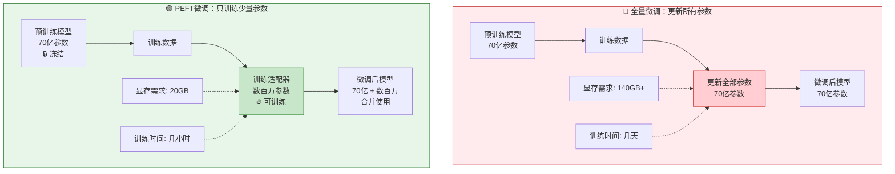
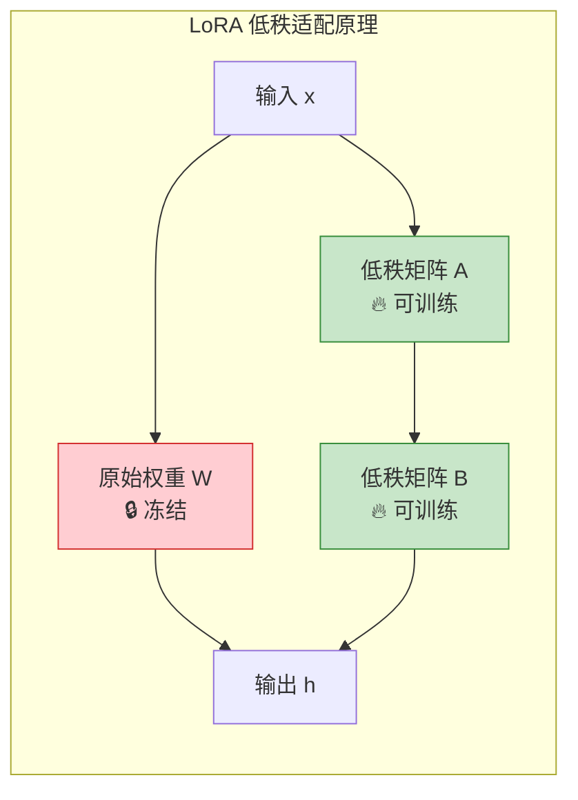

> 做一个有温度和有干货的技术分享作者 —— [Qborfy](https://qborfy.com)

今天聊一个在微调圈子里**救命级**的技术 —— **PEFT（Parameter-Efficient Fine-Tuning）**。

> 一句话核心：**PEFT** 就是那种"花小钱办大事"的技术 —— 只动一小部分参数（<1%），效果却能接近全量微调。


_图：PEFT 核心概念 —— 冻结大部分参数，只训练少量适配器参数（<1%）_

我刚开始接触大模型微调那会儿，看全量微调的显存需求直接傻了 —— 140GB+？我连 24GB 的 4090 都是咬牙买的。直到发现了 PEFT，就像是给自行车**装个辅助轮** —— 不用重新训练整个身体，成本低得多，但一样能骑得稳。

最实在的好处是啥？显存从几百 GB 降到二三十 GB，训练时间从几天变成几小时，你手里的 4090 都能跑 70 亿参数的模型。个人开发者终于不用看着大厂流眼泪了。

<!-- more -->

# 它到底是什么



说白了就一句话：**大部分参数锁死不动，只在里面插入一些小小的"适配器"参数来训练**。

- **全量微调**：把模型 70 亿参数全改了，需要 140GB+ 显存，动不动就训崩
- **PEFT**：只训几百万参数（<1%），显存降到 20GB，4090 都能跑

最关键的是，这些适配器可以单独保存、单独加载、多个任务换来换去用 —— 就像给自行车装可拆卸的辅助轮。

## 四种主流方法

目前主流的 PEFT 方法有好几种，用的最多的就是 LoRA。



**1. LoRA（最常用）**

在原始权重矩阵旁边加两个小的低秩矩阵 A 和 B（`h = Wx + BAx`）。假设原矩阵 1600 万参数，r=16 时 LoRA 只有 13 万参数 —— **少了 99%**！效果却能接近全量微调。

**2. Adapter（适合多任务）**

在 Transformer 每层中间加一个小型神经网络，像"插件"一样可插拔。一个基础模型 + 多个 Adapter，换着用就行。

**3. Prefix Tuning（适合生成）**

在输入前面加可训练的"前缀向量"，让模型学一个"好开头"，引导生成特定风格。

**4. Prompt Tuning（最简单）**

只训练输入提示词的嵌入向量，训练成本极低，但效果也最一般。

## PEFT vs 全量微调

| **维度**   | 全量微调         | PEFT（LoRA）                 |
| ---------- | ---------------- | ---------------------------- |
| 可训练参数 | 100%（70 亿）    | 0.1%-1%（数百万）            |
| 显存需求   | 140GB+           | 16-24GB                      |
| 训练时间   | 几天             | 几小时                       |
| 硬件要求   | A100/H100 集群   | 单张 RTX 4090                |
| 模型存储   | 完整模型（14GB） | 基础模型 + 适配器（几百 MB） |
| 灾难性遗忘 | 严重             | 轻微                         |
| 多任务支持 | 每个任务一个模型 | 共享基础模型+多个适配器      |
| 适用场景   | 追求极致效果     | 资源受限、快速迭代           |

说人话就是：全量微调就像重新装修房子，PEFT 就像是换家具刷墙漆 —— 成本低得多，但一样能让房子焕然一新。

像我这种个人开发者，PEFT 几乎是唯一的选择。哪有 8 张 A100 啊？但一张 4090 跑 LoRA，照样能把模型调得服服帖帖的。

# 动手试试

下面用 LoRA 微调一个医疗问答模型，单卡就能跑：

```python
from transformers import AutoModelForCausalLM, AutoTokenizer, TrainingArguments
from peft import LoraConfig, get_peft_model, TaskType

# 1. 加载预训练模型
model = AutoModelForCausalLM.from_pretrained(
    "meta-llama/Llama-2-7b-hf",
    torch_dtype=torch.float16,
    device_map="auto",
)

# 2. 配置 LoRA - 关键步骤！
lora_config = LoraConfig(
    r=16,                    # 秩，控制矩阵大小 (8-64)
    lora_alpha=32,          # 缩放系数 = 2*r
    target_modules=["q_proj", "v_proj"],  # 只对这两层加 LoRA
    lora_dropout=0.05,
    task_type=TaskType.CAUSAL_LM,
)

# 3. 应用 LoRA - 模型参数自动冻结，只有 LoRA 参数可训练
model = get_peft_model(model, lora_config)
model.print_trainable_parameters()
#输出: trainable params: 8M ||all params: 6.7B || trainable%: 0.12%

# 4. 训练（和正常训练一样）
trainer = Trainer(model=model, ...)
trainer.train()

# 5. 只保存适配器（几百MB）
model.save_pretrained("./lora_adapter")
```

## QLoRA：显存砍到 16GB

如果你只有 4090 24GB，用 QLoRA：

```python
from transformers import BitsAndBytesConfig

# 4-bit 量化配置
bnb_config = BitsAndBytesConfig(
    load_in_4bit=True,              # 启用4-bit量化
    bnb_4bit_quant_type="nf4",      # NF4量化类型
    bnb_4bit_use_double_quant=True, # 嵌套量化
)

# 加载量化后的模型
model = AutoModelForCausalLM.from_pretrained(
    "meta-llama/Llama-2-7b-hf",
    quantization_config=bnb_config,
    device_map="auto",
)

model = get_peft_model(model, lora_config)  # 再加 LoRA
```

| 方法     | 模型大小    | 训练显存 | 可训练参数 |
| -------- | ----------- | -------- | ---------- |
| 全量微调 | FP16 (14GB) | 140GB+   | 70 亿      |
| LoRA     | FP16 (14GB) | 24GB     | 800 万     |
| QLoRA    | NF4 (4GB)   | 16GB     | 800 万     |

# 踩坑经验

我踩过的那些坑，希望你别再踩：

| 坑             | 表现                   | 怎么填                        |
| -------------- | ---------------------- | ----------------------------- |
| 训练 loss 不降 | 训了很久 loss 还是很高 | 学习率调到 2e-4，检查数据格式 |
| 过拟合         | 训练降了验证升了       | 减少 epoch、增大 dropout      |
| 输出质量差     | 生成的内容很垃圾       | r 从 8 改成 32 或 64          |
| 显存爆了       | OOM 报错               | 减小 batch size、开梯度检查点 |
| 灾难性遗忘     | 模型忘了通用知识       | 混合点通用数据一起训          |
| 训练速度慢     | 跑得很慢               | 开 fp16/bf16 混合精度         |

**最容易被忽视的是灾难性遗忘**。模型在特定任务上表现很好，但你问它"你好"，它回得乱七八糟。这时候加点通用对话数据，或者降低学习率。

**LoRA 参数建议**：

| 模型大小 | 简单任务 | 复杂任务 |
| -------- | -------- | -------- |
| 7B       | r=8-16   | r=32-64  |
| 13B+     | r=16-32  | r=64-256 |

数据量参考：风格调整 500+，领域知识 2000+，复杂推理 5000+。

**一句话：宁可花时间清洗数据，也别急着开训。**

# 最后说几句

如果没有 PEFT，我可能到现在都没法自己微调大模型。一张 A100 80GB 好几千美金，对于我们个人开发者来说真的太贵了。

PEFT 某种程度上**打破了技术壁垒**，让每个人都有机会参与到 AI 的创造中来。

**核心内容快速回顾：**

1. **是什么**：只改一小部分参数（<1%），效果接近全量微调
2. **主流方法**：LoRA（首选）、QLoRA（显存最小）、Adapter（多任务）
3. **核心优势**：省显存 80%+、省时间、保留通用能力、适配器可复用

**不同场景的建议**：

| 你的情况         | 推荐方案     |
| ---------------- | ------------ |
| 想免费试试       | Colab + LoRA |
| 手里有 4090      | QLoRA        |
| 一个模型干多个活 | Adapter      |
| 不差钱追求极致   | LoRA (r=256) |

> 💡 **一句话总结**：PEFT 就像是给大模型戴了副隐形眼镜 —— 眼睛还是那双眼睛，但加了小小的适配器，看世界的方式就完全不一样了。

---

**参考资源**：

- [Hugging Face PEFT 官方文档](https://huggingface.co/docs/peft)
- [LoRA 原始论文](https://arxiv.org/abs/2106.09685)
- [QLoRA 论文](https://arxiv.org/abs/2305.14314)
