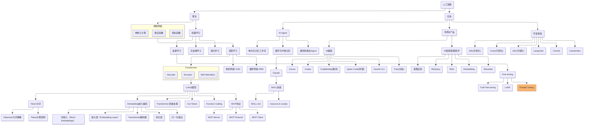
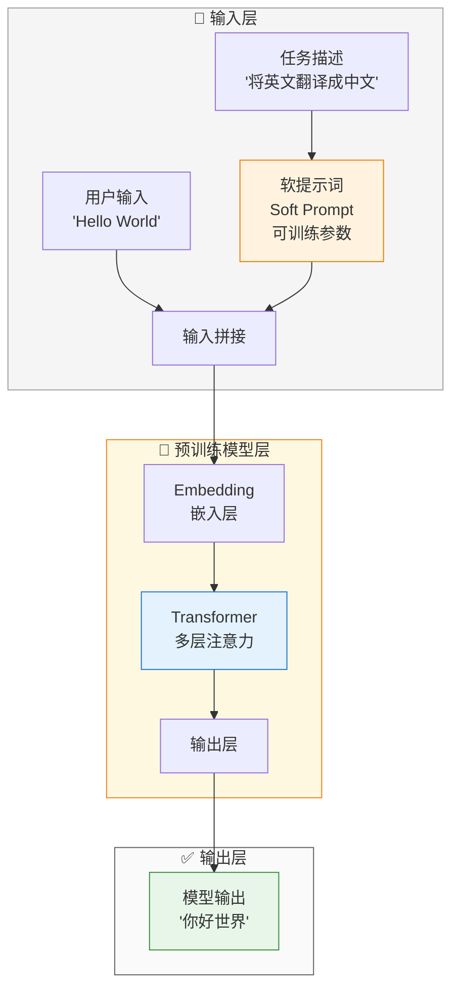

> 做一个有温度和有干货的技术分享作者 —— [Qborfy](https://qborfy.com)

今天我们来学习 **Prompt Tuning（提示微调）**

> 一句话核心: **Prompt Tuning** 是一种参数高效的微调方法，通过训练少量的"软提示词"（Soft Prompt）来引导预训练模型完成特定任务，而无需修改模型的原始参数。

通俗地讲，如果把预训练模型比作一位知识渊博的教授，那么 Prompt Tuning 就像是给这位教授戴上一副特殊的"眼镜"——这副眼镜不会改变教授自身的知识结构，但能让他以特定的视角来理解和回答问题。不同的任务只需要换不同的眼镜，而不需要重新培养一位新教授。

它的核心价值在于**极致的参数效率**：相比传统 Fine-tuning 需要更新数十亿参数，Prompt Tuning 只需训练几百到几千个参数，却能达到相近的效果。这就像是用极小的成本让通用模型获得专业能力，特别适合资源有限或需要同时服务多个任务的场景。

<!-- more -->

# 是什么



通过一张图来理解 Prompt Tuning 的工作原理：


*图：Prompt Tuning 工作流程 —— 通过训练软提示词向量来引导模型输出*



**Prompt Tuning 工作流程说明**：

这个流程的核心在于**软提示词（Soft Prompt）的训练**：

1. **输入层**：
   - **软提示词**：一组可训练的连续向量（不是离散的文本词），通常长度在 20-100 个 token 之间
   - **用户输入**：实际的查询内容
   - **拼接方式**：软提示词 + 用户输入一起送入模型

2. **模型层**：
   - **完全冻结**：预训练模型的所有参数都保持不变
   - **零修改**：不调整任何权重，仅通过软提示词引导模型行为
   - **知识保留**：完美保持模型的通用能力

3. **输出层**：
   - 模型根据软提示词的"引导"，以特定方式理解和回答
   - 同样的模型，不同的软提示词 = 不同的专业能力

## Prompt Tuning 的核心概念

### 1. Soft Prompt（软提示词）

**什么是软提示词**：
- 不是人类可读的文本，而是一组**连续的向量**（浮点数数组）
- 长度通常为 20-100 个虚拟 token
- 每个虚拟 token 的维度与模型的嵌入维度相同（如 768、1024、4096 等）

**类比理解**：
- 硬提示词（Hard Prompt）= 你给 AI 写的指令文字
- 软提示词（Soft Prompt）= AI "内心"的指令向量，人类看不懂，但 AI 能"感受"到

```
硬提示词: "请将以下内容翻译成中文："
软提示词: [0.23, -0.56, 0.89, ..., 0.12]  ← 向量形式
```

### 2. Prompt Encoder（提示编码器）

在一些高级变体中（如 Prefix Tuning），使用一个小型神经网络来生成软提示词：


**优势**：
- 可以用更少的参数表达更复杂的提示模式
- 支持多任务共享编码器

### 3. Prefix Tuning（前缀微调）

Prefix Tuning 是 Prompt Tuning 的一种变体：

| 特点 | Prompt Tuning | Prefix Tuning |
|------|--------------|---------------|
| 插入位置 | 只在输入层 | 每一层 Transformer |
| 参数量 | 更少 | 稍多 |
| 效果 | 好 | 通常更好 |
| 复杂度 | 简单 | 稍复杂 |

**类比**：
- Prompt Tuning = 给教授一副眼镜
- Prefix Tuning = 给教授一副眼镜 + 助听器 + 其他辅助设备

## Prompt Tuning vs 其他方法对比

| **维度** | Prompt Engineering | Prompt Tuning | Full Fine-tuning | LoRA |
|----------|-------------------|---------------|------------------|------|
| **参数更新** | 0 | 0.001%-0.01% | 100% | 0.1%-1% |
| **存储成本** | 极低 | 极低（KB级） | 极高（GB级） | 低（MB级） |
| **训练数据** | 不需要 | 少量即可 | 需要较多 | 中等 |
| **训练速度** | 无需训练 | 极快 | 很慢 | 快 |
| **推理速度** | 慢（长提示词） | 快 | 快 | 快 |
| **多任务切换** | 需重写提示词 | 换软提示词即可 | 需加载不同模型 | 换适配器即可 |
| **适用场景** | 简单任务 | 中等复杂度任务 | 复杂专业任务 | 大多数场景 |
| **可解释性** | 高 | 低 | 低 | 低 |

**一句话总结选择建议**：
- 快速验证想法 → **Prompt Engineering**
- 资源有限、多任务场景 → **Prompt Tuning**
- 追求极致效果、资源充足 → **Full Fine-tuning**
- 平衡效果与成本 → **LoRA**

# 怎么做

下面我们通过实际案例来理解 Prompt Tuning 的实现方式。

## 案例 1：使用 OpenPrompt 框架进行情感分析提示微调

**场景描述**：
- 任务：电影评论情感分析（正面/负面）
- 使用 Prompt Tuning 让模型学会识别评论情感
- 只训练软提示词，不修改模型参数

**完整代码实现**：

```python
# prompt_tuning_sentiment.py
# 使用 OpenPrompt 框架进行 Prompt Tuning

from openprompt.data_utils import InputExample
from openprompt.plms import load_plm
from openprompt.prompts import SoftTemplate, SoftVerbalizer
from openprompt import PromptForClassification, PromptDataLoader
from transformers import AdamW
import torch

# ========== 1. 准备数据 ==========
# 创建训练样本
dataset = {
    'train': [
        InputExample(guid=0, text_a="这部电影太精彩了！", label=1),  # 正面
        InputExample(guid=1, text_a="完全浪费时间，剧情很烂", label=0),  # 负面
        InputExample(guid=2, text_a="演员演技出色，推荐观看", label=1),
        InputExample(guid=3, text_a="特效很差，故事毫无逻辑", label=0),
        InputExample(guid=4, text_a="年度最佳电影之一", label=1),
        InputExample(guid=5, text_a="后悔买票，太失望了", label=0),
    ],
    'validation': [
        InputExample(guid=6, text_a="故事情节引人入胜", label=1),
        InputExample(guid=7, text_a="制作粗糙，不值得看", label=0),
    ]
}

# 标签映射
class_labels = [
    '负面',  # 0
    '正面',  # 1
]

# ========== 2. 加载预训练模型 ==========
# 使用中文 BERT 作为基础模型
plm, tokenizer, model_config, WrapperClass = load_plm(
    "bert", 
    "bert-base-chinese"
)

# ========== 3. 定义软提示词模板 ==========
# soft 标签表示这部分是可训练的软提示词
soft_template = SoftTemplate(
    model=plm,
    tokenizer=tokenizer,
    text='{"soft": "情感分析任务"} {"soft": "判断以下评论"} {"placeholder": "text_a"} 这条评论的情感是{"mask"}。'
)

# 打印模板信息
print(f"软提示词数量: {soft_template.num_soft_tokens}")
print(f"可训练参数: {sum(p.numel() for p in soft_template.soft_embeds.parameters())}")
# 输出示例: 可训练参数: 15360 (约 60KB)

# ========== 4. 定义 verbalizer（标签词映射） ==========
# 将模型输出映射到标签
soft_verbalizer = SoftVerbalizer(
    tokenizer=tokenizer,
    plm=plm,
    classes=class_labels,
)

# ========== 5. 创建 Prompt 模型 ==========
prompt_model = PromptForClassification(
    plm=plm,
    template=soft_template,
    verbalizer=soft_verbalizer,
    freeze_plm=True,  # 关键：冻结预训练模型参数！
)

# 移动到 GPU（如果有）
device = torch.device("cuda" if torch.cuda.is_available() else "cpu")
prompt_model = prompt_model.to(device)

# ========== 6. 创建数据加载器 ==========
train_dataloader = PromptDataLoader(
    dataset=dataset["train"],
    template=soft_template,
    tokenizer=tokenizer,
    tokenizer_wrapper_class=WrapperClass,
    max_seq_length=128,
    batch_size=2,
    shuffle=True,
)

validation_dataloader = PromptDataLoader(
    dataset=dataset["validation"],
    template=soft_template,
    tokenizer=tokenizer,
    tokenizer_wrapper_class=WrapperClass,
    max_seq_length=128,
    batch_size=2,
)

# ========== 7. 训练软提示词 ==========
# 只优化软提示词参数
optimizer = AdamW(prompt_model.template.soft_embeds.parameters(), lr=1e-3)

print("开始训练软提示词...")
for epoch in range(10):  # 训练 10 轮
    prompt_model.train()
    total_loss = 0

    for batch in train_dataloader:
        batch = {k: v.to(device) for k, v in batch.items()}

        # 前向传播
        logits = prompt_model(batch)
        labels = batch['label']

        # 计算损失
        loss = torch.nn.functional.cross_entropy(logits, labels)

        # 反向传播（只更新软提示词）
        loss.backward()
        optimizer.step()
        optimizer.zero_grad()

        total_loss += loss.item()

    avg_loss = total_loss / len(train_dataloader)
    print(f"Epoch {epoch + 1}/10, 平均损失: {avg_loss:.4f}")

print("训练完成！")

# ========== 8. 保存软提示词 ==========
torch.save(prompt_model.template.soft_embeds.state_dict(), "soft_prompt_sentiment.pt")
print("软提示词已保存到 soft_prompt_sentiment.pt")

# ========== 9. 测试模型 ==========
prompt_model.eval()
test_text = "这部电影的视觉效果令人惊叹"

# 创建测试样本
test_example = InputExample(guid=999, text_a=test_text)
test_dataloader = PromptDataLoader(
    dataset=[test_example],
    template=soft_template,
    tokenizer=tokenizer,
    tokenizer_wrapper_class=WrapperClass,
    max_seq_length=128,
    batch_size=1,
)

with torch.no_grad():
    for batch in test_dataloader:
        batch = {k: v.to(device) for k, v in batch.items()}
        logits = prompt_model(batch)
        pred = torch.argmax(logits, dim=-1)
        print(f"\n测试文本: {test_text}")
        print(f"预测结果: {class_labels[pred.item()]}")
```

**代码关键点解析**：

1. **`freeze_plm=True`**：这是 Prompt Tuning 的核心，冻结预训练模型所有参数
2. **`soft_embeds`**：只训练这部分软提示词嵌入，参数量极小
3. **`AdamW(...)`**：优化器只传入软提示词参数，确保不更新模型权重

## 案例 2：使用 Hugging Face PEFT 进行 Prompt Tuning

**场景描述**：
- 使用 Hugging Face 的 PEFT 库实现 Prompt Tuning
- 任务：文本分类（新闻主题分类）
- 展示更简洁的实现方式

**完整代码实现**：

```python
# peft_prompt_tuning.py
# 使用 Hugging Face PEFT 库进行 Prompt Tuning

from transformers import (
    AutoModelForCausalLM,
    AutoTokenizer,
    TrainingArguments,
    Trainer,
    DataCollatorForLanguageModeling
)
from peft import PromptTuningConfig, PromptTuningInit, get_peft_model, TaskType
from datasets import Dataset
import torch
import numpy as np

# ========== 1. 准备数据 ==========
# 新闻主题分类数据集（简化示例）
train_data = [
    {"text": "股市今日大涨，科技股领涨", "label": "财经"},
    {"text": "国家队在世界杯中取得胜利", "label": "体育"},
    {"text": "新款智能手机发布，配置强悍", "label": "科技"},
    {"text": "央行宣布降息政策", "label": "财经"},
    {"text": "篮球总决赛即将开打", "label": "体育"},
    {"text": "人工智能技术在医疗领域的新应用", "label": "科技"},
    {"text": "GDP增长数据公布", "label": "财经"},
    {"text": "足球转会市场动态", "label": "体育"},
    {"text": "量子计算取得重大突破", "label": "科技"},
]

# 将数据转换为适合 CausalLM 的格式
# 格式: "分类任务：{文本} -> 主题是：{标签}"
def format_example(example):
    return {
        "text": f"分类任务：{example['text']} -> 主题是：{example['label']}"
    }

formatted_data = [format_example(ex) for ex in train_data]
dataset = Dataset.from_list(formatted_data)

# ========== 2. 加载模型和分词器 ==========
model_name = "gpt2"  # 使用 GPT-2 作为示例
tokenizer = AutoTokenizer.from_pretrained(model_name)
tokenizer.pad_token = tokenizer.eos_token

model = AutoModelForCausalLM.from_pretrained(
    model_name,
    torch_dtype=torch.float32,
)

# ========== 3. 配置 Prompt Tuning ==========
# 定义软提示词配置
peft_config = PromptTuningConfig(
    task_type=TaskType.CAUSAL_LM,  # 因果语言模型任务
    prompt_tuning_init=PromptTuningInit.TEXT,  # 使用文本初始化
    prompt_tuning_init_text="新闻主题分类任务：",  # 初始化文本
    num_virtual_tokens=20,  # 软提示词长度（20个虚拟token）
    tokenizer_name_or_path=model_name,
)

# 应用 PEFT 配置
model = get_peft_model(model, peft_config)

# 查看可训练参数
model.print_trainable_parameters()
# 输出示例:
# trainable params: 15,360 || all params: 124,738,560 || trainable%: 0.0123

# ========== 4. 数据预处理 ==========
def tokenize_function(examples):
    return tokenizer(
        examples["text"],
        padding="max_length",
        truncation=True,
        max_length=128,
    )

tokenized_dataset = dataset.map(tokenize_function, batched=True)

# ========== 5. 配置训练参数 ==========
training_args = TrainingArguments(
    output_dir="./prompt_tuning_output",
    num_train_epochs=50,  # Prompt Tuning 通常需要更多轮数
    per_device_train_batch_size=4,
    learning_rate=1e-2,  # 学习率可以设置得稍高
    logging_steps=10,
    save_steps=100,
    warmup_steps=50,
    weight_decay=0.01,
    # 关键：只保存适配器参数，不保存完整模型
    save_total_limit=2,
)

# ========== 6. 创建 Trainer 并开始训练 ==========
data_collator = DataCollatorForLanguageModeling(
    tokenizer=tokenizer,
    mlm=False,  # 不是掩码语言模型
)

trainer = Trainer(
    model=model,
    args=training_args,
    train_dataset=tokenized_dataset,
    data_collator=data_collator,
)

print("开始训练软提示词...")
trainer.train()
print("训练完成！")

# ========== 7. 保存模型 ==========
model.save_pretrained("./prompt_tuning_news_classifier")
print("软提示词已保存到 ./prompt_tuning_news_classifier")

# ========== 8. 测试模型 ==========
print("\n===== 测试结果 =====")
model.eval()

test_inputs = [
    "分类任务：比特币价格创新高 -> 主题是：",
    "分类任务：NBA季后赛精彩回顾 -> 主题是：",
    "分类任务：5G网络技术解析 -> 主题是：",
]

for test_input in test_inputs:
    inputs = tokenizer(test_input, return_tensors="pt")

    with torch.no_grad():
        outputs = model.generate(
            **inputs,
            max_new_tokens=10,
            do_sample=False,
            pad_token_id=tokenizer.eos_token_id,
        )

    generated_text = tokenizer.decode(outputs[0], skip_special_tokens=True)
    # 提取生成的标签部分
    prediction = generated_text[len(test_input):].strip().split()[0]
    print(f"输入: {test_input}")
    print(f"预测: {prediction}\n")

# ========== 9. 加载已训练的软提示词进行推理 ==========
print("===== 加载保存的软提示词 =====")
from peft import PeftModel

# 加载基础模型
base_model = AutoModelForCausalLM.from_pretrained(model_name)

# 加载软提示词
inference_model = PeftModel.from_pretrained(
    base_model,
    "./prompt_tuning_news_classifier",
)
inference_model.eval()

print("软提示词加载完成，可以进行推理！")
```

**代码关键点解析**：

1. **`PromptTuningConfig`**：配置软提示词的各种参数
   - `num_virtual_tokens`：软提示词长度，影响表达能力和训练成本
   - `prompt_tuning_init`：初始化方式（TEXT/RANDOM）

2. **`get_peft_model`**：将普通模型转换为支持 PEFT 的模型

3. **训练特点**：
   - 学习率可以设置得比 Fine-tuning 更高（1e-2 vs 1e-5）
   - 训练轮数通常需要更多（50+ vs 3-5）

## 案例 3：多任务共享软提示词

**场景**：一个模型服务多个任务，每个任务有自己的软提示词

```python
# multi_task_prompt_tuning.py
# 多任务软提示词切换示例

import torch
from transformers import AutoModelForCausalLM, AutoTokenizer
from peft import PromptTuningConfig, get_peft_model

# 加载基础模型
model_name = "gpt2"
base_model = AutoModelForCausalLM.from_pretrained(model_name)
tokenizer = AutoTokenizer.from_pretrained(model_name)
tokenizer.pad_token = tokenizer.eos_token

# 定义多个任务的软提示词配置
tasks = {
    "translation": {
        "init_text": "将中文翻译成英文：",
        "num_tokens": 15,
    },
    "summarization": {
        "init_text": "总结以下文本的主要内容：",
        "num_tokens": 15,
    },
    "qa": {
        "init_text": "根据上下文回答问题：",
        "num_tokens": 15,
    },
}

# 为每个任务创建并训练软提示词（训练代码省略）
# ...

# 运行时切换不同任务的软提示词
def switch_task(model, task_name):
    """切换到指定任务的软提示词"""
    # 加载对应任务的软提示词权重
    adapter_path = f"./prompt_tuning_{task_name}"
    model.load_adapter(adapter_path, adapter_name=task_name)
    model.set_adapter(task_name)
    return model

# 使用示例
print("切换到翻译任务...")
model = switch_task(base_model, "translation")
# 执行翻译...

print("切换到摘要任务...")
model = switch_task(base_model, "summarization")
# 执行摘要...
```

**优势**：
- 一个基础模型 + N 个软提示词（每个仅几十KB）
- 存储成本极低，切换任务只需加载不同的软提示词
- 适合多租户、多任务的服务场景

# 最佳实践

## 1. 提示词长度选择建议

**软提示词长度（num_virtual_tokens）的选择**：

| 任务复杂度 | 建议长度 | 适用场景 |
|-----------|---------|---------|
| 简单任务 | 10-20 | 情感分析、主题分类 |
| 中等任务 | 20-50 | 文本摘要、简单翻译 |
| 复杂任务 | 50-100 | 多轮对话、复杂推理 |

**选择原则**：
- **从短开始**：先尝试 20 个 token，效果不佳再增加
- **边际效应**：超过 100 个 token 后，效果提升不明显
- **资源权衡**：更长的提示词 = 略高的训练成本

## 2. 初始化策略

**三种初始化方式对比**：

| 初始化方式 | 方法 | 优点 | 缺点 | 适用场景 |
|-----------|------|------|------|---------|
| **随机初始化** | 随机生成向量 | 简单、无偏 | 收敛慢 | 探索性实验 |
| **词汇表采样** | 从词表随机选词初始化 | 有一定语义基础 | 可能引入噪声 | 通用任务 |
| **任务描述初始化** | 用任务描述文本编码 | 收敛快、效果好 | 依赖文本质量 | 生产环境 |

**推荐配置**：
```python
# 生产环境推荐
peft_config = PromptTuningConfig(
    prompt_tuning_init=PromptTuningInit.TEXT,
    prompt_tuning_init_text="你的任务描述：",
    num_virtual_tokens=30,
)

# 快速实验推荐
peft_config = PromptTuningConfig(
    prompt_tuning_init=PromptTuningInit.RANDOM,
    num_virtual_tokens=20,
)
```

## 3. 训练技巧

### 学习率设置

```python
# Prompt Tuning 可以使用更高的学习率
learning_rate = 1e-2  # 比 Fine-tuning 的 1e-5 高 1000 倍

# 使用学习率预热
warmup_steps = 100
```

### 早停策略

```python
# 监控验证集损失，防止过拟合
from transformers import EarlyStoppingCallback

trainer = Trainer(
    # ... 其他参数
    callbacks=[EarlyStoppingCallback(early_stopping_patience=5)]
)
```

## 4. 常见陷阱与解决方案

| 问题 | 现象 | 原因 | 解决方案 |
|------|------|------|---------|
| **收敛慢** | 训练多轮损失仍高 | 学习率太低或初始化差 | 提高学习率到 1e-2，使用 TEXT 初始化 |
| **过拟合** | 训练集好，验证集差 | 软提示词太长或数据少 | 减少 num_virtual_tokens，增加数据 |
| **效果差** | 不如预期 | 任务太复杂 | 改用 LoRA 或 Full Fine-tuning |
| **灾难性遗忘** | 通用能力下降 | 软提示词干扰 | 混合通用数据一起训练 |
| **不稳定** | 每次训练结果差异大 | 随机初始化导致 | 固定随机种子，使用 TEXT 初始化 |

## 5. 与其他方法的组合使用

### Prompt Tuning + LoRA

```python
from peft import PromptTuningConfig, LoraConfig, get_peft_model

# 同时使用软提示词和 LoRA
prompt_config = PromptTuningConfig(
    num_virtual_tokens=20,
    # ...
)

lora_config = LoraConfig(
    r=8,
    lora_alpha=16,
    # ...
)

# 先应用 Prompt Tuning，再应用 LoRA
model = get_peft_model(model, prompt_config)
model = get_peft_model(model, lora_config)
```

**适用场景**：任务复杂，单独 Prompt Tuning 效果不够时

# 总结

Prompt Tuning 是让大模型适应特定任务的**参数高效方法**。

## 核心要点回顾

1. **是什么**：通过训练少量"软提示词"向量来引导模型，不修改模型参数
2. **核心优势**：
   - 参数效率：只训练 0.001%-0.01% 的参数
   - 存储极小：每个任务仅需几十KB
   - 切换灵活：一个模型 + 多个软提示词 = 多个专家
3. **关键概念**：
   - Soft Prompt：可训练的连续向量
   - Prefix Tuning：在每层 Transformer 添加软提示词
   - Prompt Encoder：用小型网络生成软提示词
4. **适用场景**：中等复杂度任务、多任务服务、资源受限环境

## 快速上手建议

| 需求 | 推荐方案 | 预计成本 |
|-----|---------|---------|
| 快速验证想法 | Prompt Engineering | 免费 |
| 资源受限、多任务 | **Prompt Tuning** | 1张显卡即可 |
| 追求效果、中等资源 | LoRA | 1-2张显卡 |
| 极致效果、充足资源 | Full Fine-tuning | GPU集群 |

**Prompt Tuning 最佳切入点**：
1. 已有预训练模型服务
2. 需要支持多个细分任务
3. 显存/存储资源有限
4. 任务复杂度中等（分类、简单生成）

## 学习资源推荐

- [OpenPrompt 官方文档](https://thunlp.github.io/OpenPrompt/) - 丰富的 Prompt Learning 实现
- [Hugging Face PEFT 库](https://huggingface.co/docs/peft) - 最便捷的 Prompt Tuning 工具
- [Prompt Tuning 原论文](https://arxiv.org/abs/2104.08691) - Google 提出的原始方法
- [Prefix Tuning 论文](https://arxiv.org/abs/2101.00190) - Stanford 的改进版本
- [The Power of Scale for Parameter-Efficient Prompt Tuning](https://arxiv.org/abs/2104.08691) - 规模效应分析

> 💡 **一句话总结**：Prompt Tuning 就像是"给 AI 戴上一副特殊眼镜"——不改变 AI 本身，只改变它看待任务的方式，用极小的成本获得专业能力的提升。

---

**感谢阅读！如果你觉得今天的内容对你有帮助，欢迎分享给你的朋友，一起学习成长！** 🚀
