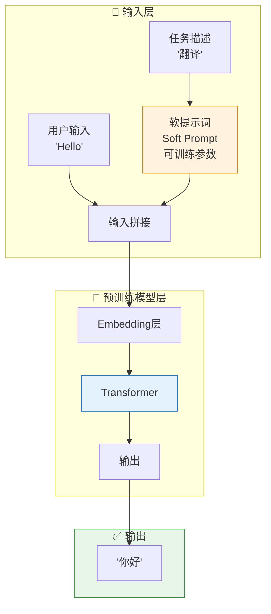

> 做一个有温度和有干货的技术分享作者 —— [Qborfy](https://qborfy.com)

今天聊一个**参数少到离谱**的微调方法 —— **Prompt Tuning（提示微调）**。

> 一句话核心：**Prompt Tuning** 就是给模型加几个"软提示词"，其他参数全不动，就能让模型学会新任务。




我整理了一张对比表，让你一眼看清楚：

| 维度       | Prompt Engineering | Prompt Tuning | Full Fine-tuning | LoRA        |
| ---------- | ------------------ | ------------- | ---------------- | ----------- |
| 参数更新   | 0                  | 0.001%-0.01%  | 100%             | 0.1%-1%     |
| 存储成本   | 极低               | 极低（KB 级） | 极高（GB 级）    | 低（MB 级） |
| 需要数据   | 不需要             | 少量就行      | 需要很多         | 中等        |
| 训练速度   | 不用训练           | 极快          | 很慢             | 快          |
| 推理速度   | 慢（提示词太长）   | 快            | 快               | 快          |
| 多任务切换 | 重写提示词         | 换软提示词    | 换模型           | 换适配器    |
| 适合什么   | 简单任务           | 中等任务      | 复杂任务         | 大部分场景  |
| 可解释性   | 高                 | 低            | 低               | 低          |

**我的选择建议**

- **想快速验证想法** → 直接写提示词（Prompt Engineering），不用训练
- **资源有限、要做多任务** → Prompt Tuning，一个模型干 N 个活
- **不差钱、追求极致效果** → Full Fine-tuning，效果最好但最贵
- **要平衡效果和成本** → LoRA（上一期讲的），目前最主流的方案

# 动手试试

用 OpenPrompt 训练一个情感分析模型：

```python
from openprompt.data_utils import InputExample
from openprompt.plms import load_plm
from openprompt.prompts import SoftTemplate, SoftVerbalizer
from openprompt import PromptForClassification, PromptDataLoader
from transformers import AdamW
import torch

# 1. 准备数据
dataset = {
    'train': [
        InputExample(guid=0, text_a="这部电影太精彩了！", label=1),
        InputExample(guid=1, text_a="完全浪费时间", label=0),
        # ...更多数据
    ]
}

# 2. 加载预训练模型
plm, tokenizer, model_config, WrapperClass = load_plm("bert", "bert-base-chinese")

# 3. 定义软提示词 (soft 标签 = 可训练)
soft_template = SoftTemplate(
    model=plm,
    tokenizer=tokenizer,
    text='{"soft": "情感分析任务"} {"placeholder": "text_a"} 这条评论的情感是{"mask"}。'
)

# 4. 只冻结模型，只训练软提示词
prompt_model = PromptForClassification(
    plm=plm,
    template=soft_template,
    verbalizer=SoftVerbalizer(tokenizer, plm, ['负面', '正面']),
    freeze_plm=True,  # 🔑 关键：冻结模型参数！
)

# 5. 只优化软提示词 (约 60KB 参数)
optimizer = AdamW(prompt_model.template.soft_embeds.parameters(), lr=1e-3)

# 6. 训练
for epoch in range(10):
    for batch in train_dataloader:
        logits = prompt_model(batch)
        loss = torch.nn.functional.cross_entropy(logits, batch['label'])
        loss.backward()  # 只更新软提示词
        optimizer.step()

# 7. 保存软提示词 (只有 60KB)
torch.save(prompt_model.template.soft_embeds.state_dict(), "soft_prompt.pt")
```

`freeze_plm=True` 这行代码是核心 —— 模型完全不动，只训那几千个参数的软提示词。

# ❄️ 冷知识

Prompt Tuning 效果不如 LoRA，方便程度又不如直接写提示词。但它的**多任务切换**确实很方便，一个模型 + N 个几十 KB 的软提示词，存储成本极低。

**核心要点快速回顾：**

1. **是什么**：只训练软提示词向量（几百个参数），冻结整个模型
2. **适用场景**：多任务、资源受限、快速验证
3. **核心优势**：参数极少（KB 级）、训练极快、多任务切换方便

> 💡 **一句话总结**：Prompt Tuning 就像是给模型戴副特殊眼镜 —— 不改模型本身，只换个眼镜，看世界的方式就完全不同了。

---

**参考资源**：

- [OpenPrompt 官方文档](https://thunlp.github.io/OpenPrompt/)
- [Hugging Face PEFT 库](https://huggingface.co/docs/peft)
- [Prompt Tuning 原论文](https://arxiv.org/abs/2104.08691)

```

```
