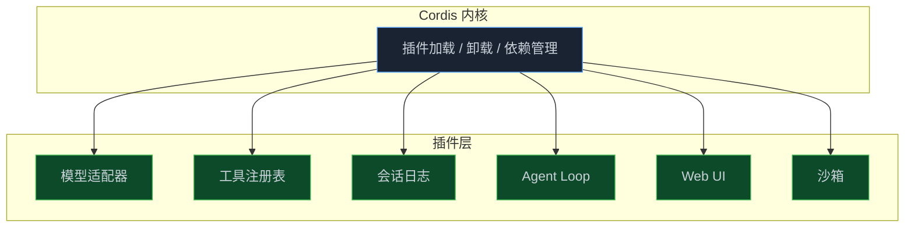

> **📖 系列说明**：本篇是系列开篇，不管你是刚接触 AI Agent 的新手，还是已经在用 LangChain、AutoGen 的开发者，还是想深入研究框架设计的架构师，都可以从这里开始读。内容会从浅到深自然展开，不会突然跳级。
> **🎁 读完你会得到**：搞清楚 dsh 是什么、它解决了什么问题、和其他框架的本质区别在哪，以及这个系列的完整路线图。

你让 AI 帮你重构一段代码，它改了第一处就停了。你再催，它从头分析。你又催，它又改了一处，又停了。

为什么有的 Agent 能一口气完成复杂任务，有的只能"一问一答"？

差别不在模型，在于模型背后那套"脚手架"。

<!-- more -->

---

## 模型只是大脑，Agent 还需要身体

先说个不太准确但很好理解的比喻。

模型就像一个极其聪明的人，但他被关在一个没有窗户的房间里。你从门缝塞进去一张纸，他看完给你写一张回复塞出来。他很聪明，但他什么也干不了——他看不到你的代码仓库，跑不了命令，也不知道上次对话说了什么。

Agent 要能真正干活，需要给这个聪明人配一套"身体"：能读文件的眼睛、能跑命令的手、能记住上下文的记忆、能持续工作不停下来的心跳。

这套"身体"，就是 **Harness**。

DeepSeek Harness（简称 `dsh`）是 DeepSeek AI 开源的这套脚手架。官网有句话说得很直接：

> **Agent = Model + Harness**

一行命令就能跑起来：

```bash
npx @deepseek-ai/dsh web
```

打开 `http://127.0.0.1:3080`，一个完整的 Agent Web UI 就在那了。

---

## 它和其他框架有什么不一样

市面上 Agent 框架不少，LangChain、AutoGen、CrewAI……为什么还要学 dsh？

我研究了一段时间，觉得 dsh 的核心差异在于一个设计哲学：**一切皆插件**。

这不是说说而已。在 dsh 里，模型适配器是插件，工具注册表是插件，会话日志是插件，Agent Loop 本身也是插件。整个系统没有"特权内核"——你不需要 fork 源码、不需要打补丁，想换掉任何一个能力，直接在配置层替换对应的插件就行。



对普通用户来说，这意味着：不用改代码，配置文件里换一行，就能把 DeepSeek 模型换成 OpenAI，或者把本地沙箱换成远程隔离环境。

对开发者来说，这意味着：扩展 dsh 的方式是"挂载插件"，而不是"继承类"或"打补丁"。你写的插件卸载时，它注册的所有东西——工具、事件监听、定时器——都会自动清理，不会留下垃圾。

对架构师来说，这背后是 Cordis 框架的依赖注入和副作用管理机制。每个插件通过 `ctx` 声明依赖、注册能力，框架保证依赖就绪后才加载插件，卸载时自动回滚所有副作用。这是 Cordis 论文里描述的"时空可组合性"编程范式的工程实现——不是约定，是框架级保证。

一张表对比一下：

| 维度 | 传统框架 | DeepSeek Harness |
|---|---|---|
| 扩展方式 | 继承类、打补丁、fork 源码 | 挂载插件，配置层替换 |
| 工具注册 | 硬编码或装饰器绑定 | `ctx.tools.register()`，作用域隔离 |
| 模型切换 | 改代码、改配置文件 | 换一个 LLM 适配器插件 |
| 调试追踪 | 靠日志，靠猜 | Trajectory 视图，模型所见即已记录 |
| 多 Agent | 自己实现编排逻辑 | 子代理、工作流、Teams 原生支持 |
| **安全控制** | 自己实现鉴权和沙箱 | 沙箱 + 审批策略 + 权限预设，开箱即用 |

---

## 调试：从"靠猜"到"有据可查"

用过其他 Agent 框架的人大概都踩过这个坑：Agent 跑了一半出了问题，你完全不知道它当时看到了什么、做了什么决定、哪一步出了岔子。只能翻日志，靠猜。

dsh 对这个问题的回答是：**模型可见即已记录**。

这是一条运行时不变量。抵达模型请求的一切——系统提示词、思维链、工具调用与结果、子 Agent 调度、每一次上下文注入——都会写入一个仅追加设计的会话日志。

打开 **Trajectory 视图**，你可以按来源逐条查看模型当时看到的内容。不只是"它做了什么"，而是"它为什么这么做"。

这个日志不只是用来调试的。恢复中断的会话、分叉出一个新的执行路径、回放历史运行、生成遥测数据——全都基于同一份事件流。对架构师来说，这意味着 `deriveMessages()` 可以从日志重建完整的模型历史，`assistant/chunk` 事件保证回放和 UI 保真，fork 和恢复共享同一套机制，没有额外的状态管理负担。

---

## Agent 能干活，但得管住它

这是很多人上手 Agent 框架时容易忽略的问题：Agent 能读文件、跑命令、访问网络——这些能力如果没有边界，在生产环境里是很危险的。

dsh 内置了三层安全机制，从外到内依次收紧。

**沙箱（Sandbox）** 是第一道门。所有进程启动都经过 `ctx.sandbox` 后端包装。你可以把沙箱指向一个远程隔离环境，这样 Bash、PTY、文件系统访问就全部在隔离容器里跑，不会碰到宿主机。而且因为文件系统和进程提供方共享同一个执行世界，换一个沙箱后端，所有工具会一并迁移过去，不需要逐个适配。

**审批策略（Approval Policy）** 是第二道门。某些操作执行前，Web UI 会弹出确认框，等你点了才继续。哪些操作需要审批、哪些可以直接放行，都可以在配置里定义。Agent 要删文件或者跑危险命令时，你有机会叫停。

**工具执行把关** 是第三道门，也是最细粒度的一层。工具调用走的是一条流水线：

```
tool/call → tools/pre-execute → tools/execute → tools/post-execute → tool/result
```

`pre-execute` 和 `post-execute` 是两个可拦截的扩展点。你可以在这里注入安全检查逻辑——过滤危险命令、记录审计日志、限制文件操作范围。不同的 Agent preset 还可以配置不同的权限集合，实现最小权限原则。

三层加在一起，基本覆盖了 Agent 乱来的主要风险。后面第 08 篇会专门讲怎么配置这套机制，这里先有个印象。

---

## 四种运行模式，对应四种场景

dsh 内置了四种运行模式，不是为了炫技，是真的对应了不同的使用场景：

**标准模式** 是日常编码 Agent 的主力。文件编辑、Shell 执行、网页检索、子代理调度，该有的都有。你让它"帮我重构这个模块"，它会自己读文件、改代码、跑测试、验证结果，一套流程跑下来。

**PTC 模式**（Program-Then-Call）有点意思。普通模式下模型是一步一步调工具，PTC 模式下模型会先写一段 TypeScript 程序，把多步操作组合进去，再一次性执行。对需要精确控制执行顺序的场景，这个模式更可靠，也更容易审计。

**极简模式** 只有两个工具：持久 bash 和文件编辑器。专门用来跑基准测试——排除所有干扰变量，看模型本身的能力上限。

**创造模式** 是最特别的一个。它让 Agent 检查自己的运行时、在内存里试验插件，然后帮你设计新的 Agent preset。相当于用 Agent 来创造 Agent。

---

## 这个系列会带你走到哪里

我规划了 12 篇，从入门到中小企业实际项目落地：


每篇解决一个核心问题：

| 篇号 | 核心问题 | 你能获得什么 |
|------|---------|------------|
| 01 | dsh 是什么，为什么值得学 | 框架全貌 + 系列路线图 |
| 02 | 怎么快速跑起来 | Web UI 配置 + 第一个任务 |
| 03 | 插件怎么写 | 函数/对象/类三种形态 + 依赖声明 |
| 04 | 怎么给 Agent 加自定义工具 | Tool DSL + 工具注册实战 |
| 05 | 系统内部怎么运转 | 轮次流程 + 事件系统 + 会话日志 |
| 06 | 一个 Agent 不够用怎么办 | 子代理 + 工作流 + Teams 协作 |
| 07 | 研发场景怎么落地 | 代码审查 / CI 集成 / 自动化测试 |
| 08 | Agent 怎么管住不乱来 | 沙箱配置 / 审批策略 / 权限预设 / 审计日志 |
| 09 | 业务流程怎么自动化 | 审批流 / 数据处理 / 报告生成 |
| **10** | **中小企业实战：智能客服系统** | **从需求到上线的完整项目，含完整代码** |
| **11** | **中小企业实战：内部知识库问答** | **文档接入 + 向量检索 + 多轮对话** |
| **12** | **中小企业实战：销售流程自动化** | **报价生成 + 跟进提醒 + 周报一键输出** |

不管你是刚接触 Agent 的新手，还是已经在用其他框架的开发者，还是想深入研究框架设计的架构师，都可以从第 01 篇顺序读下去——内容会随着篇章自然加深，不会突然跳级。如果你有特定目标，直接跳到对应篇也没问题。

---

## 一个小提醒

dsh 目前还是**开发者预览版**，官方明确说了：**THERE WILL BE COMPATIBILITY-BREAKING CHANGES**。

这不是劝退，而是提醒你：跟着这个系列学的时候，遇到 API 变化是正常的。我会尽量跟进最新版本，但如果你发现某个地方跑不通，先查一下 [GitHub Discussions](https://github.com/deepseek-ai/deepseek-harness/discussions)，大概率已经有人遇到并解决了。

---

## 📝 小结

- dsh 是 DeepSeek AI 开源的 Agent 框架，核心理念是"一切皆插件"——所有能力均由插件提供，可在配置层自由替换，不需要改源码
- 和其他框架的本质区别：没有特权内核，Cordis 框架级保证依赖注入和副作用管理
- "模型可见即已记录"是核心不变量，Trajectory 视图让调试从"靠猜"变成"有据可查"
- 四种运行模式（标准/PTC/极简/创造）对应不同场景，不是摆设
- 内置三层安全机制：沙箱隔离、审批策略、工具执行把关，覆盖 Agent 乱来的主要风险
- 这个系列共 12 篇，从入门到安全、研发、业务场景落地，最后 3 篇是中小企业完整项目实战，目标是让你真正用起来

---

## 🔮 下一篇预告

说了这么多，怎么跑起来？

下一篇，我们从零开始——配置 API Key、选工作区、发第一条指令，让 Agent 真正动起来。不会超过 10 分钟。

---

> 📚 **系列导航**
> - **第 01 篇：凭什么说它是下一代 Agent 框架？** ⬅️ 你在这里
> - 第 02 篇：10 分钟跑起来：Web UI 配置与第一个任务
> - 第 03 篇：插件开发入门：从 Hello World 到真正有用的插件
> - 第 04 篇：工具开发实战：给 Agent 装上你自己的工具
> - 第 05 篇：架构深度解析：轮次、事件、会话日志的运转机制
> - 第 06 篇：多 Agent 协作：子代理、工作流与 Teams
> - 第 07 篇：研发场景落地：代码审查、CI 集成与自动化测试
> - 第 08 篇：安全与权限：沙箱配置、审批策略与审计日志
> - 第 09 篇：业务流程自动化：审批流、数据处理与报告生成
> - 第 10 篇：中小企业实战（一）：从 0 搭一个能上线的智能客服系统
> - 第 11 篇：中小企业实战（二）：内部知识库问答 Agent，让文档真正被用起来
> - 第 12 篇：中小企业实战（三）：销售流程自动化，报价跟进周报一键搞定
