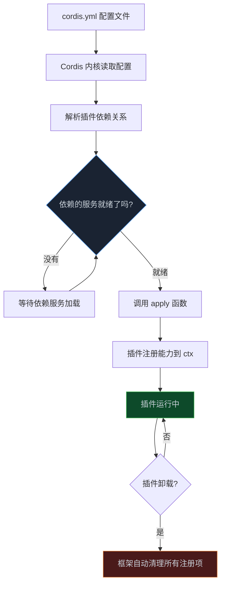

> **📖 系列说明**：本篇是插件开发的起点。需要你已经跑通了第 02 篇的环境，并且用源码方式安装了 dsh（npx 方式无法加载本地插件）。有 TypeScript 基础更好，但不是必须的。
> **🎁 读完你会得到**：能写出一个真正加载进 dsh 的插件，理解 ctx 是什么、插件的三种形态怎么选，以及为什么 dsh 的插件卸载不会留下垃圾。

上一篇跑起来了 dsh，用的是它的默认能力。

但 dsh 的设计哲学是"一切皆插件"——你现在用的那些能力，文件读写、Shell 执行、Web UI，全都是插件。这意味着你也可以写插件，给 Agent 加上你自己的能力。

这篇从最简单的开始，一步步搞清楚插件是怎么运转的。

<!-- more -->

---

## 插件到底是什么

在 dsh 里，插件的定义出奇地简单：**一个导出 `apply` 函数的 TypeScript 模块**。

```typescript
import type { Context } from '@deepseek-ai/cordis'

export const name = 'my-plugin'

export function apply(ctx: Context) {
  // 在这里注册能力
}
```

就这些。`name` 是插件的唯一标识，`apply` 是框架加载时调用的入口，`ctx` 是你和框架交互的唯一通道。

`ctx` 是什么？可以把它理解成一个"能力注册台"。你想给 Agent 加一个工具？通过 `ctx.tools.register()`。想监听某个事件？通过 `ctx.on()`。想打日志？通过 `ctx.logger`。所有和框架的交互，都走 `ctx`。

这个设计有个好处——框架知道你注册了什么，所以当插件卸载时，它能帮你把所有注册的东西都清理掉。不需要你手动 `removeListener`，不需要 `clearInterval`，框架全包了。

---

## 第一个插件：Hello World

先把环境准备好。你需要从源码安装 dsh（第 02 篇有步骤），然后在仓库根目录创建一个临时目录：

```bash
mkdir -p scratch-plugin/src
```

创建插件文件 `scratch-plugin/src/hello-plugin.ts`：

```typescript
import type { Context } from '@deepseek-ai/cordis'

export const name = 'hello-plugin'

export function apply(ctx: Context) {
  ctx.logger.info('[hello-plugin] 插件加载成功！')
}
```

然后创建 `scratch-plugin/cordis.yml`，告诉 dsh 加载这个插件：

```yaml
- insert:
  - id: hello
    name: '/你的仓库绝对路径/scratch-plugin/src/hello-plugin.ts'
```

注意路径必须是绝对路径。用 `pwd` 命令查一下当前目录，把输出粘贴进去。

用这个配置启动 dsh：

```bash
pnpm dsh web --patch ./scratch-plugin/cordis.yml
```

启动过程中，终端会打印：

```
[hello-plugin] 插件加载成功！
```

这就是你的第一个 dsh 插件。它什么也没做，但它证明了整个链路是通的。

---

## ctx 是怎么工作的

Hello World 跑通了，但你可能想知道：`ctx` 里到底有什么？

`ctx` 是 Cordis 框架的上下文对象，它的内容取决于当前已加载的插件。每个插件可以往 `ctx` 上挂服务，其他插件就能通过 `ctx` 使用这些服务。

dsh 的核心包挂了这些服务：

```
ctx.tools      → 工具注册表（注册 Agent 可以调用的工具）
ctx.llm        → LLM 适配器（发送请求给模型）
ctx.sessions   → 会话管理（读写会话日志）
ctx.systemPrompt → 系统提示词（注入提示词片段）
ctx.agents     → Agent 注册表（管理活跃的 Agent）
ctx.logger     → 日志（打印调试信息）
```

你的插件想用哪个服务，就在 `inject` 里声明：

```typescript
export const name = 'my-plugin'
export const inject = ['tools', 'systemPrompt']  // 声明依赖

export function apply(ctx: Context) {
  // 框架保证这两个服务就绪后才调用 apply
  ctx.tools.register(/* ... */)
  ctx.systemPrompt.register(/* ... */)
}
```

`inject` 不只是个注释，它是框架的加载顺序依据。如果你声明了 `inject: ['tools']`，框架会等 `tools` 服务就绪之后才加载你的插件。如果 `tools` 服务还没起来，你的插件就先等着。

这解决了一个经典问题：插件 A 依赖插件 B，但 B 还没加载完，A 就开始用 B 的服务，结果报错。有了 `inject`，这个问题不存在了。

---

## 自动清理：为什么插件卸载不会留垃圾

这是 dsh 插件系统里我觉得最优雅的设计之一。

通过 `ctx` 注册的所有东西，框架都记着。插件卸载时，框架会自动把这些东西全部撤销：

- `ctx.on('event', handler)` 注册的事件监听 → 自动 `off`
- `ctx.tools.register(tool)` 注册的工具 → 自动注销
- `ctx.systemPrompt.register(prompt)` 注册的提示词片段 → 自动移除

你不需要写任何清理代码。

但有时候你有框架不知道的资源——比如一个数据库连接、一个 WebSocket、一个定时器。这时候用 `ctx.effect()` 告诉框架怎么清理：

```typescript
export function apply(ctx: Context) {
  ctx.effect(() => {
    // 建立一个定时器
    const timer = setInterval(() => {
      ctx.logger.info('心跳检测...')
    }, 5000)

    // 返回清理函数，插件卸载时框架会调用它
    return () => {
      clearInterval(timer)
      ctx.logger.info('定时器已清理')
    }
  })
}
```

`ctx.effect()` 接受一个函数，这个函数返回另一个函数（清理函数）。插件卸载时，框架调用清理函数。

这个模式和 React 的 `useEffect` 很像——如果你用过 React，这个概念应该很熟悉。

---

## 插件的三种形态

到目前为止我们用的都是函数形式。但 dsh 插件还有两种写法，适合不同场景。

**函数形式**是最常用的，适合大多数情况：

```typescript
import type { Context } from '@deepseek-ai/cordis'

export const name = 'my-plugin'
export const inject = ['tools']

export function apply(ctx: Context) {
  ctx.tools.register({ name: 'my-tool', /* ... */ })
}
```

**对象形式**和函数形式功能一样，只是写法不同，适合喜欢把配置和逻辑放在一起的人：

```typescript
import type { Context } from '@deepseek-ai/cordis'

export default {
  name: 'my-plugin',
  inject: ['tools'],
  apply(ctx: Context) {
    ctx.tools.register({ name: 'my-tool', /* ... */ })
  },
}
```

**类形式**是最特殊的一个，适合插件本身需要向其他插件提供服务的场景：

```typescript
import { Service, type Context } from '@deepseek-ai/cordis'

export default class MyService extends Service {
  static inject = ['tools']

  constructor(ctx: Context) {
    super(ctx, 'myService')  // 'myService' 是这个服务在 ctx 上的键名
    // 同步初始化逻辑放这里
  }

  // 其他插件可以通过 ctx.myService.doSomething() 调用
  doSomething() {
    return '我是一个服务'
  }
}
```

用了类形式之后，其他插件可以在 `inject` 里声明 `'myService'`，然后通过 `ctx.myService.doSomething()` 调用你的服务。

怎么选？大多数情况下函数形式就够了。只有当你的插件需要"对外提供服务"——也就是让其他插件依赖你——才需要用类形式。

---

## 写一个真正有用的插件：会话日志记录器

Hello World 太简单了，来写个真正能用的。

这个插件会监听 Agent 的工具调用事件，把每次工具调用记录到本地文件，方便后续审计。

```typescript
// scratch-plugin/src/session-logger.ts
import type { Context } from '@deepseek-ai/cordis'
import { appendFileSync, mkdirSync } from 'fs'
import { join } from 'path'

export const name = 'session-logger'

export function apply(ctx: Context) {
  // 确保日志目录存在
  const logDir = join(process.cwd(), 'logs')
  mkdirSync(logDir, { recursive: true })

  // 监听工具调用事件
  ctx.on('tool/call', (event) => {
    const logEntry = {
      timestamp: new Date().toISOString(),
      toolName: event.name,
      args: event.arguments,
    }

    const logFile = join(logDir, `tool-calls-${getDateStr()}.jsonl`)
    appendFileSync(logFile, JSON.stringify(logEntry) + '\n')

    ctx.logger.info('[session-logger] 工具调用：%s', event.name)
  })

  // 监听工具执行结果
  ctx.on('tool/result', (event) => {
    const logEntry = {
      timestamp: new Date().toISOString(),
      toolName: event.name,
      success: !event.error,
      error: event.error?.message,
    }

    const logFile = join(logDir, `tool-calls-${getDateStr()}.jsonl`)
    appendFileSync(logFile, JSON.stringify(logEntry) + '\n')
  })

  ctx.logger.info('[session-logger] 日志记录器已启动，日志目录：%s', logDir)
}

function getDateStr() {
  return new Date().toISOString().split('T')[0]
}
```

更新 `cordis.yml` 加载这个插件：

```yaml
- insert:
  - id: session-logger
    name: '/你的仓库绝对路径/scratch-plugin/src/session-logger.ts'
```

重启 dsh，然后让 Agent 做点事情。你会在 `logs/` 目录下看到一个 `.jsonl` 文件，里面记录了每次工具调用的详情。

这个插件有几个值得注意的地方：

**事件监听通过 `ctx.on()` 注册**，插件卸载时自动清理，不需要手动 `off`。

**日志目录的创建用了 `ctx.effect()`** 的思路——虽然这里没有需要清理的资源，但如果你的插件创建了临时文件，可以在 `ctx.effect()` 的清理函数里删掉它们。

**`ctx.logger` 是框架提供的日志工具**，比 `console.log` 好用，因为它会自动加上插件名前缀，方便区分是哪个插件打的日志。

---

## 一个常见的坑：忘记声明 inject

写插件时最容易犯的错误是——用了某个服务，但忘了在 `inject` 里声明。

比如这样：

```typescript
// ❌ 错误：用了 tools 但没声明 inject
export function apply(ctx: Context) {
  ctx.tools.register({ name: 'my-tool', /* ... */ })
  // 可能报错：ctx.tools is undefined
}
```

正确的写法：

```typescript
// ✅ 正确：声明了依赖
export const inject = ['tools']

export function apply(ctx: Context) {
  ctx.tools.register({ name: 'my-tool', /* ... */ })
}
```

为什么会报错？因为 `ctx.tools` 是由另一个插件提供的服务。如果那个插件还没加载完，`ctx.tools` 就是 `undefined`。声明 `inject` 之后，框架会等 `tools` 服务就绪再调用你的 `apply`，就不会有这个问题了。

---

## 插件加载的完整流程

理解了上面这些，我们来看一下插件从配置文件到真正运行的完整流程：



这个流程有几个关键点：

**依赖等待是框架自动处理的**，你不需要写任何等待逻辑。声明 `inject`，框架帮你搞定顺序。

**`apply` 只调用一次**，在插件加载时。之后的逻辑都靠事件监听和服务调用驱动。

**卸载是可逆的**，所有通过 `ctx` 注册的东西都会被撤销。这意味着你可以在运行时动态加载和卸载插件，不会留下副作用。

对于架构师来说，这背后是 Cordis 论文里描述的"时空可组合性"——插件的注册和注销是严格可逆的副作用，框架保证这一点，不是靠约定，是靠机制。

---

## 📝 小结

- dsh 插件就是一个导出 `apply(ctx)` 函数的 TypeScript 模块，`ctx` 是和框架交互的唯一通道
- 通过 `ctx` 注册的所有东西（事件、工具、提示词）在插件卸载时自动清理
- 需要手动清理的资源（定时器、连接），用 `ctx.effect()` 注册清理函数
- 用 `inject` 声明依赖的服务，框架保证依赖就绪后才调用 `apply`
- 三种形态：函数形式（最常用）、对象形式（写法偏好）、类形式（需要对外提供服务时用）
- 最常见的坑：用了某个服务但忘了在 `inject` 里声明

---

## 🔮 下一篇预告

插件会写了，但现在的插件只是在"监听"——监听事件、打日志。

如果你想让 Agent 真正多一个能力——比如能查你们公司的内部数据库、能调用你的业务 API——需要注册**工具**。

工具是 Agent 和外部世界交互的接口。下一篇，我们专门讲工具开发：Tool DSL 怎么写、参数怎么定义、错误怎么处理，以及一个完整的"查数据库"工具实战。

---

> 📚 **系列导航**
> - 第 01 篇：凭什么说它是下一代 Agent 框架？
> - 第 02 篇：10 分钟跑起来：从安装到第一个任务
> - **第 03 篇：插件开发入门：从 Hello World 到真正有用的插件** ⬅️ 你在这里
> - 第 04 篇：工具开发实战：给 Agent 装上你自己的工具
> - 第 05 篇：架构深度解析：轮次、事件、会话日志的运转机制
> - 第 06 篇：多 Agent 协作：子代理、工作流与 Teams
> - 第 07 篇：研发场景落地：代码审查、CI 集成与自动化测试
> - 第 08 篇：安全与权限：沙箱配置、审批策略与审计日志
> - 第 09 篇：业务流程自动化：审批流、数据处理与报告生成
> - 第 10 篇：中小企业实战（一）：从 0 搭一个能上线的智能客服系统
> - 第 11 篇：中小企业实战（二）：内部知识库问答 Agent，让文档真正被用起来
> - 第 12 篇：中小企业实战（三）：销售流程自动化，报价跟进周报一键搞定
