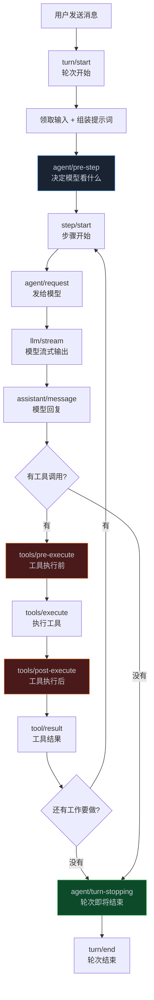
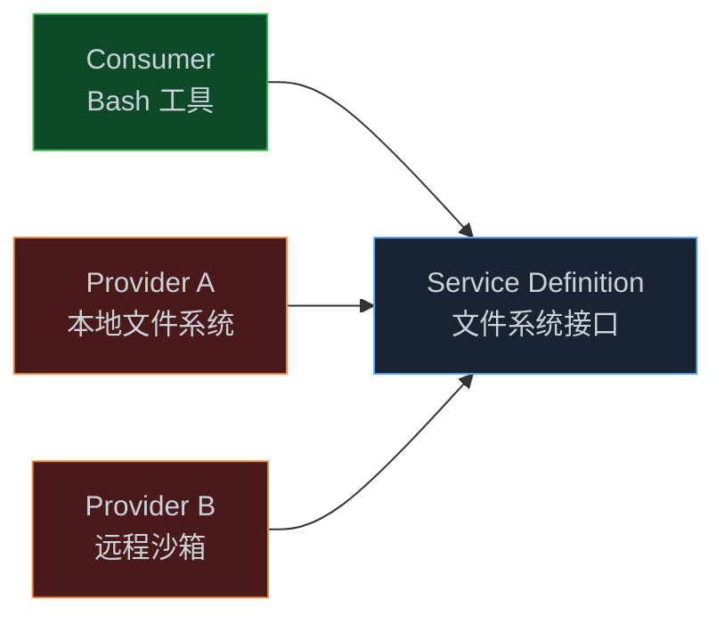

> **📖 系列说明**：本篇是架构深度篇，适合已经能写插件和工具、想搞清楚 dsh 内部运转逻辑的开发者。理解这些机制，能帮你更准确地选择扩展点、排查问题。
> **🎁 读完你会得到**：理解 dsh 的轮次流程、三类事件的区别和用法、会话日志的核心不变量，以及 Seam 机制为什么让 dsh 如此灵活。

你发出一条指令，Agent 开始工作——读文件、改代码、跑测试。

这中间 dsh 内部到底发生了什么？

前几篇我们学了怎么写插件、怎么注册工具。但如果你不清楚 dsh 内部的运转逻辑，遇到问题就只能靠猜。这篇把盖子掀开，从头到尾走一遍。

<!-- more -->

---

## 轮次和步骤：两个容易混淆的概念

先把两个基础概念说清楚，后面会一直用到。

**步骤（Step）**：一次模型请求加上它调用的所有工具。模型说"我要读这个文件"，dsh 去读，把结果塞回来，模型再说"我要改这里"，dsh 去改——这整个过程是一个步骤。

**轮次（Turn）**：包含零个或多个步骤。轮次在领取用户输入时打开，在 Agent 不再欠下任何工作时关闭。

用一个比喻来理解：轮次是一次"工作任务"，步骤是完成这个任务中的每一个"操作"。你让 Agent "帮我重构这个函数"，这是一个轮次。它读文件是第一个步骤，改代码是第二个步骤，跑测试验证是第三个步骤。

为什么要区分这两个概念？因为它们对应不同的事件，而事件是你扩展 dsh 行为的入口。

---

## 一条消息的完整旅程

来看一条用户消息从进入 dsh 到 Agent 完成工作的完整流程：



这张图里有几个关键节点值得单独说。

**`agent/pre-step`**：这是整个流程里最重要的扩展点之一。它决定了模型在这一步能看到什么。你可以在这里改写消息、注入额外上下文，甚至直接拒绝这一步（拒绝后轮次会关闭，但日志里会记录这次尝试）。

**`tools/pre-execute` 和 `tools/post-execute`**：工具执行的前后两个拦截点。上一篇讲过，这里是加安全检查、审计日志的正确位置。

**`agent/turn-stopping`**：轮次即将结束时触发。你可以在这里做最后的检查——比如验证 Agent 的输出是否符合预期，不符合就让它重来。

---

## 三类事件：选对了才能用对

dsh 的事件系统分三类，每类的行为完全不同。搞混了，代码能跑但效果不对。

### 会话事件（Session Events）

会话事件是**持久的**。它们会被追加到会话日志里，重启之后还在，可以回放。

`turn/*`、`step/*`、`user/message`、`assistant/*`、`tool/*` 这些都是会话事件。

什么时候用会话事件？**当某个事实必须在重新加载后仍然存在时**。比如你想记录"Agent 在这次会话里修改了哪些文件"，这个信息需要持久化，就应该用会话事件。

```typescript
// 监听会话事件：记录工具调用历史
ctx.on('tool/call', (event) => {
  // 这个事件是持久的，会写入会话日志
  // 重启后可以从日志里回放
  ctx.logger.info('工具调用：%s', event.name)
})
```

### Agent 事件（`agent/*`）

Agent 事件是**实时的**，携带活跃的 Agent 对象。它们不持久化，只在 Agent 运行时存在。

`agent/pre-step`、`agent/request`、`agent/turn-stopping` 这些都是 Agent 事件。

什么时候用 Agent 事件？**要观察或拦截进行中的工作时**。比如你想在每次模型请求前注入额外的上下文，就监听 `agent/pre-step`。

```typescript
// 监听 Agent 事件：在每次请求前注入上下文
ctx.on('agent/pre-step', async (event, next) => {
  // 获取当前 Agent
  const agent = event.agent

  // 注入额外上下文（比如当前时间、用户信息）
  await agent.inject({
    role: 'user',
    content: `当前时间：${new Date().toISOString()}`
  })

  await next()  // waterfall 事件必须调用 next()
})
```

### 能力事件（Capability Events）

能力事件是**扩展点**，用于向特定能力（`fs/*`、`tools/*`、`telemetry/*`）附加策略和适配器。

什么时候用能力事件？**扩展特定能力时**，而且不想把循环逻辑引入进来。比如你想给文件系统操作加一个访问策略，就监听 `fs/*` 事件。

三类事件的选择原则很简单：

| 你想做什么 | 用哪类事件 |
|---|---|
| 记录需要持久化的信息 | 会话事件 |
| 拦截或修改进行中的 Agent 行为 | Agent 事件 |
| 给某个能力加策略或适配器 | 能力事件 |

---

## Waterfall 事件：必须调用 `next()` 的那些

上面提到了 waterfall 事件，这是 dsh 事件系统里一个特殊的设计，值得单独说清楚。

普通事件监听器执行完就结束了，不需要做任何额外操作。但 waterfall 事件不一样——**监听器必须调用 `next()` 才能让执行继续往下走**。

dsh 里的 waterfall 事件有：`agent/pre-step`、`agent/request`、`llm/stream`、`tools/pre-execute`、`tools/execute`、`tools/post-execute`。

为什么要这样设计？因为这些事件是"拦截点"——你可以选择放行（调 `next()`），也可以选择拦截（不调 `next()`，直接返回）。

```typescript
// 正确：调用了 next()，执行继续
ctx.on('tools/pre-execute', async (event, next) => {
  ctx.logger.info('工具即将执行：%s', event.name)
  await next()  // ← 必须调用，否则工具不会执行
})

// 拦截：不调用 next()，工具不执行
ctx.on('tools/pre-execute', async (event, next) => {
  if (isDangerous(event)) {
    event.result = { error: '操作被拦截' }
    return  // ← 不调用 next()，工具不执行
  }
  await next()
})
```

忘记调 `next()` 是 waterfall 事件最常见的坑。如果你发现工具注册了但 Agent 调不到，或者 Agent 请求发不出去，先检查有没有 waterfall 监听器忘了调 `next()`。

---

## 会话日志：模型可见即已记录

这是 dsh 架构里我觉得最有价值的设计之一，也是很多人没注意到的地方。

dsh 有一条运行时不变量：**抵达模型请求的一切，都必须能从会话日志重建**。

这不是说说而已，是框架级别的保证。每次模型请求前，dsh 会从会话日志里重建完整的消息历史（通过 `deriveMessages()`），然后发给模型。如果某个信息没有写入会话日志，模型就看不到它。

这个设计的好处是：**调试变得可追溯**。

你不需要猜"模型当时看到了什么"——打开 Trajectory 视图，会话日志里有完整记录：系统提示词、每次工具调用和结果、每次上下文注入、模型的每一段输出。

对开发者来说，这意味着一件重要的事：**如果你想让模型看到某个信息，必须把它写入会话日志**。

```typescript
// 想让模型看到某个信息？扩展 SessionEventMap
// 不能只是在内存里存一下，模型看不到

// ❌ 错误：只存在内存里，模型看不到
let userPreference = 'dark mode'

// ✅ 正确：写入会话日志，模型能看到
// 通过 agent.inject() 注入，它会落到下一次请求中
await agent.inject({
  role: 'user',
  content: `用户偏好：${userPreference}`
})
```

还有一个推论：**会话日志是 fork、恢复、回放的唯一来源**。

你可以 fork 一个会话（`ctx.sessions.fork()`），从某个历史节点开始一个新的执行路径。你可以恢复中断的会话，从上次停下的地方继续。这些功能都依赖会话日志的完整性。

---

## `agent/pre-step`：控制模型视野的关键

前面提到 `agent/pre-step` 是最重要的扩展点之一，这里展开说说它能做什么。

每个步骤开始前，dsh 会触发 `agent/pre-step`。你的监听器可以：

**改写消息**：修改即将发给模型的消息内容。

**注入上下文**：在这一步给模型额外的信息。

**拒绝这一步**：让这一步不执行，轮次关闭（但日志里会记录这次尝试）。

来看一个实际用法——根据当前工作区动态注入项目信息：

```typescript
import type { Context } from '@deepseek-ai/cordis'
import { readFileSync, existsSync } from 'fs'
import { join } from 'path'

export const name = 'project-context'

export function apply(ctx: Context) {
  ctx.on('agent/pre-step', async (event, next) => {
    const agent = event.agent
    const workspacePath = agent.workspace?.path

    if (!workspacePath) {
      await next()
      return
    }

    // 读取项目的 CLAUDE.md（如果存在）
    const claudeMdPath = join(workspacePath, 'CLAUDE.md')
    if (existsSync(claudeMdPath)) {
      const content = readFileSync(claudeMdPath, 'utf-8')
      await agent.inject({
        role: 'user',
        content: `[项目规范]\n${content}`
      })
    }

    // 读取 package.json 获取项目信息
    const pkgPath = join(workspacePath, 'package.json')
    if (existsSync(pkgPath)) {
      const pkg = JSON.parse(readFileSync(pkgPath, 'utf-8'))
      await agent.inject({
        role: 'user',
        content: `[项目信息] 名称：${pkg.name}，版本：${pkg.version}`
      })
    }

    await next()
  })
}
```

这个插件在每次步骤开始前，自动把项目规范和基本信息注入给模型。不需要用户每次手动告诉 Agent "这个项目用什么技术栈"。

---

## Seam 机制：为什么换一个后端能改变整个产品

前几篇提到过，dsh 的沙箱换一个后端，Bash、PTY、文件系统访问就全部迁移到新环境，不需要逐个适配。这背后是 **Seam 机制**。

Seam（接缝）是一项可替换能力，由三个角色组成：

- **Service Definition**：声明接口——"文件系统应该支持哪些操作"
- **Service Provider**：实现接口——"本地文件系统怎么实现这些操作"
- **Consumer**：使用接口——"Bash 工具通过文件系统接口读写文件"

关键在于：Consumer 只依赖接口，不依赖具体实现。



所以当你把文件系统提供方从"本地"换成"远程沙箱"，所有依赖文件系统接口的工具（Bash、PTY、LSP）都自动切换到远程沙箱，不需要改任何工具代码。

对开发者来说，这意味着：**你可以替换任何一个能力提供方，而不影响其他部分**。

想换一个 LLM 提供方？在 `ctx.llm` 上注册新的适配器。想换一个文件系统后端？注册新的 `ctx.fs` 提供方。想换一个沙箱？注册新的 `ctx.sandbox` 后端。

这就是"一切皆插件"的真正含义——不只是说说，是架构上的保证。

---

## Profile 与组合包：dsh 怎么组装自己

最后说一个经常被忽视但很实用的机制——Profile 和组合包。

运行中的 dsh 是一棵插件树，由多层配置叠加而成：

```
空列表
  ↓ 应用 dsh-base（模型适配器、工具、沙箱、审批策略...）
  ↓ 应用 dsh-web-app（浏览器应用）
  ↓ 应用 profile 的 cordis.patch.yml（用户自定义）
  ↓ 应用 home 级配置
  ↓ 应用 --patch overlay（开发时的本地插件）
```

每一层都可以覆盖上一层的配置。这就是为什么你用 `--patch` 加载本地插件时，不需要修改 dsh 的源码——你只是在最顶层加了一个覆盖层。

想看 dsh 实际加载了什么？

```bash
pnpm dsh --profile web --dump-config
```

这会打印出完整的配置树，包括每个插件的 id、名称、配置参数。排查问题时非常有用——你能看到某个插件有没有被加载、加载的配置是什么。

对架构师来说，这个机制的价值在于：**你可以为不同的使用场景组装不同的 dsh 实例**。

比如：
- 开发环境：加载调试插件、详细日志、宽松的审批策略
- 生产环境：加载监控插件、严格的沙箱、严格的审批策略
- 测试环境：加载 mock 工具、禁用真实的文件系统操作

每个环境只需要一个不同的 `cordis.patch.yml`，不需要维护多份代码。

---

## 一个排查问题的实用技巧

理解了上面这些，来说一个实际排查问题的技巧。

当 Agent 行为不符合预期时，最常见的问题是"模型看到的不是你以为它看到的"。

排查步骤：

**第一步：打开 Trajectory 视图**，看模型每一步实际收到了什么消息。这能直接告诉你"模型当时看到了什么"。

**第二步：检查 `agent/pre-step` 监听器**，看有没有插件在改写或拒绝消息。

**第三步：检查 waterfall 事件**，看有没有监听器忘了调 `next()`，导致某个环节被意外拦截。

**第四步：用 `--dump-config` 确认插件加载顺序**，看有没有插件没有被加载，或者加载顺序不对。

大部分"Agent 行为奇怪"的问题，用这四步都能定位到原因。

---

## 📝 小结

- **轮次**是一次完整的工作任务，**步骤**是完成任务中的每一个操作；一个轮次包含零个或多个步骤
- 三类事件各有用途：会话事件（持久化）、Agent 事件（拦截进行中的工作）、能力事件（扩展特定能力）
- Waterfall 事件（`agent/pre-step`、`tools/pre-execute` 等）的监听器必须调用 `next()`，否则执行被拦截
- 会话日志的核心不变量：模型可见即已记录，`deriveMessages()` 从日志重建模型历史
- `agent/pre-step` 是控制模型视野的关键扩展点，可以改写消息、注入上下文、拒绝步骤
- Seam 机制让替换任意能力提供方成为可能，Consumer 只依赖接口，不依赖实现
- Profile 和组合包支持多层叠加配置，`--dump-config` 是排查插件加载问题的利器

---

## 🔮 下一篇预告

架构搞清楚了，下一个自然的问题是：一个 Agent 搞不定复杂任务怎么办？

dsh 原生支持子代理、工作流和 Teams 协作。下一篇，我们讲多 Agent 协作——怎么让多个 Agent 分工合作，以及 dsh 的子代理机制和工作流设计。

---

> 📚 **系列导航**
> - 第 01 篇：凭什么说它是下一代 Agent 框架？
> - 第 02 篇：10 分钟跑起来：从安装到第一个任务
> - 第 03 篇：插件开发入门：从 Hello World 到真正有用的插件
> - 第 04 篇：工具开发实战：给 Agent 装上你自己的工具
> - **第 05 篇：架构深度解析：一条消息进来，dsh 内部发生了什么** ⬅️ 你在这里
> - 第 06 篇：多 Agent 协作：子代理、工作流与 Teams
> - 第 07 篇：研发场景落地：代码审查、CI 集成与自动化测试
> - 第 08 篇：安全与权限：沙箱配置、审批策略与审计日志
> - 第 09 篇：业务流程自动化：审批流、数据处理与报告生成
> - 第 10 篇：中小企业实战（一）：从 0 搭一个能上线的智能客服系统
> - 第 11 篇：中小企业实战（二）：内部知识库问答 Agent，让文档真正被用起来
> - 第 12 篇：中小企业实战（三）：销售流程自动化，报价跟进周报一键搞定
