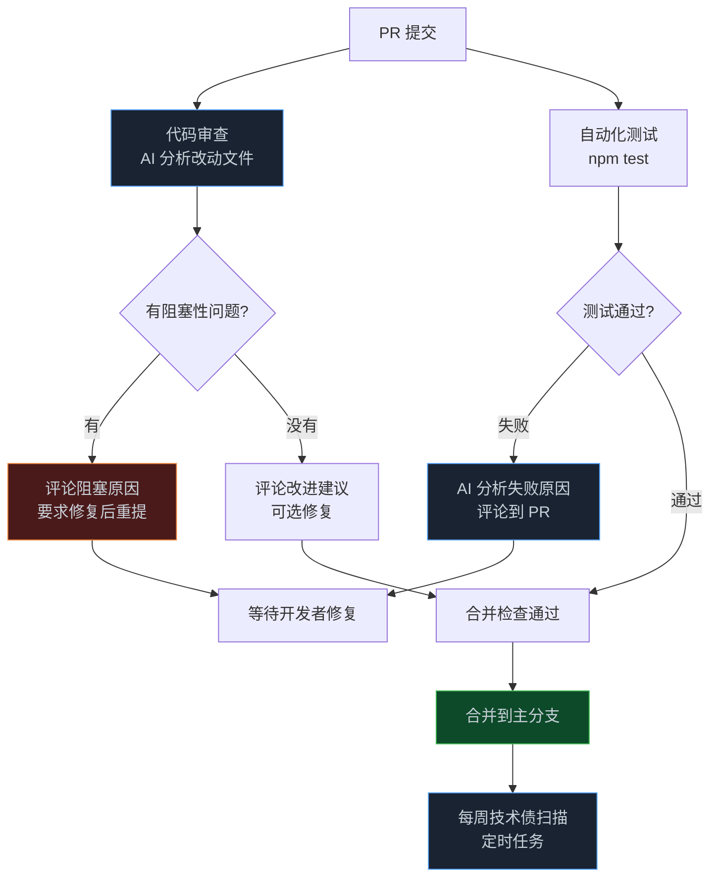

> **📖 系列说明**：本篇是系列的第一个"落地篇"，从框架学习转向实际应用。需要你已经理解 dsh 的基本用法（第 02-06 篇）。本篇的代码可以直接拿去改用。
> **🎁 读完你会得到**：三个可以直接落地的研发场景方案：CI/CD 集成、PR 代码审查机器人、测试失败智能分析。

前六篇讲了很多框架知识——插件、工具、架构、多 Agent。

但说实话，学框架不是目的，用起来才是。

这篇开始，我们进入落地阶段。研发团队最高频的三个痛点：代码审查靠人工效率低、CI 跑失败不知道哪里出了问题、技术债越堆越多没人管——这篇一个一个解决。

<!-- more -->

---

## 先说 headless 模式：CI 里跑 dsh 的正确姿势

前面几篇用的都是 Web UI 模式——启动一个服务，打开浏览器，手动发指令。

但 CI/CD 环境里没有浏览器，也没有人坐在那里点按钮。你需要的是**无头模式（headless）**——dsh 作为一个命令行工具跑，接收任务，完成，退出，把结果输出到标准输出或文件。

dsh 的 `dsh-headless` 组合包就是为这个场景设计的。

```bash
# headless 模式：一次性执行任务，完成后退出
npx @deepseek-ai/dsh headless --task "审查 src/auth/login.ts 的代码质量"

# 或者从文件读取任务
npx @deepseek-ai/dsh headless --task-file ./review-task.txt

# 指定工作区
npx @deepseek-ai/dsh headless \
  --workspace /path/to/project \
  --task "分析最近一次提交的改动，找出潜在问题"
```

headless 模式和 Web UI 模式的核心区别：

| 维度 | Web UI 模式 | headless 模式 |
|---|---|---|
| 启动方式 | `dsh web`，持续运行 | `dsh headless`，完成即退出 |
| 交互方式 | 浏览器界面，手动操作 | 命令行参数，无人值守 |
| 审批策略 | 弹出确认框 | 自动放行（或预设策略） |
| 输出方式 | Web UI 展示 | 标准输出 / 文件 |
| 适用场景 | 日常开发、交互式任务 | CI/CD、定时任务、自动化脚本 |

headless 模式下，审批策略默认是"自动放行"——因为没有人在旁边点按钮。如果你的任务涉及危险操作（比如修改文件），需要在配置里明确设置哪些操作允许自动执行。

---

## 场景一：把 dsh 接入 GitHub Actions

最直接的 CI 集成方式——在 PR 触发时，自动跑 dsh 做代码审查，把结果评论到 PR 上。

先看整体流程：


**GitHub Actions 配置：**

```yaml
# .github/workflows/ai-code-review.yml
name: AI Code Review

on:
  pull_request:
    types: [opened, synchronize]

jobs:
  ai-review:
    runs-on: ubuntu-latest
    permissions:
      pull-requests: write  # 需要写 PR 评论的权限

    steps:
      - name: Checkout code
        uses: actions/checkout@v4
        with:
          fetch-depth: 0  # 需要完整历史来获取 diff

      - name: Setup Node.js
        uses: actions/setup-node@v4
        with:
          node-version: '20'

      - name: Get changed files
        id: changed-files
        run: |
          # 获取这次 PR 改动的文件列表
          git diff --name-only origin/${{ github.base_ref }}...HEAD \
            | grep -E '\.(ts|tsx|js|jsx|py)$' \
            > changed_files.txt
          echo "files=$(cat changed_files.txt | tr '\n' ',')" >> $GITHUB_OUTPUT

      - name: Run AI Code Review
        env:
          DEEPSEEK_API_KEY: ${{ secrets.DEEPSEEK_API_KEY }}
        run: |
          # 生成审查任务描述
          cat > review_task.txt << 'EOF'
          请对以下改动的文件进行代码审查，重点关注：
          1. 潜在的 Bug 和逻辑错误
          2. 安全漏洞（SQL 注入、XSS、权限控制等）
          3. 性能问题
          4. 代码可读性和可维护性

          改动的文件：
          $(cat changed_files.txt)

          请对每个文件给出具体的改进建议，格式为 Markdown。
          EOF

          # 运行 dsh headless
          npx @deepseek-ai/dsh headless \
            --workspace . \
            --task-file review_task.txt \
            --output review_result.md \
            --profile headless

      - name: Post review comment
        uses: actions/github-script@v7
        with:
          script: |
            const fs = require('fs');
            const review = fs.readFileSync('review_result.md', 'utf8');

            await github.rest.issues.createComment({
              owner: context.repo.owner,
              repo: context.repo.repo,
              issue_number: context.issue.number,
              body: `## 🤖 AI 代码审查报告\n\n${review}\n\n---\n*由 DeepSeek Harness 自动生成*`
            });
```

这个配置做了几件事：

**获取改动文件**：只审查这次 PR 改动的文件，不是整个项目。这很重要——如果每次都审查整个项目，Token 消耗会爆炸，而且大部分内容和这次 PR 无关。

**生成任务描述**：把改动文件列表和审查要求组合成一个任务文件，传给 dsh。

**输出到文件**：headless 模式支持把结果输出到文件，然后再用 GitHub Actions 的 API 把文件内容评论到 PR 上。

---

## 让审查结果真正有用

很多 AI 代码审查工具的问题是——给出的建议太泛，"这里可以优化"、"这里有潜在问题"，但没有具体说怎么改。

要让审查结果真正有用，关键在于**任务描述的质量**。

来看一个更好的任务描述：

```
你是一个严格的代码审查员，正在审查一个 TypeScript Node.js 后端项目的 PR。

## 审查标准

**必须指出的问题（阻塞合并）：**
- 安全漏洞：SQL 注入、XSS、未验证的用户输入、硬编码的密钥
- 明显的 Bug：空指针、类型错误、边界条件未处理
- 破坏性改动：修改了公共 API 但没有更新文档或版本号

**建议改进的问题（不阻塞合并）：**
- 代码重复：相同逻辑出现超过 2 次
- 函数过长：超过 50 行的函数
- 缺少错误处理：async 函数没有 try/catch

**不需要指出的问题：**
- 代码风格（由 ESLint 处理）
- 注释缺失（除非是公共 API）

## 输出格式

对每个问题，按以下格式输出：

**[严重程度] 文件名:行号**
问题描述：...
建议修改：...
```typescript
// 修改前
...
// 修改后
...
```

## 改动文件

{改动文件列表}
```

这个任务描述的关键是：**明确说了什么要指出、什么不要指出**。

没有这个边界，Agent 会把所有它觉得"可以更好"的地方都列出来，结果一个 PR 给你输出几十条建议，开发者看都不想看。

---

## 场景二：测试失败智能分析

CI 跑测试失败了，开发者要花时间看日志、定位原因、找到对应代码。这个过程往往要 10-30 分钟。

用 dsh 可以把这个过程自动化——Agent 读取测试失败日志，定位到具体的代码，分析失败原因，给出修复建议。

**测试失败分析插件：**

```typescript
// src/test-analyzer.ts
import type { Context } from '@deepseek-ai/cordis'
import { readFileSync, existsSync } from 'fs'
import { execSync } from 'child_process'

export const name = 'test-analyzer'
export const inject = ['tools']

export function apply(ctx: Context) {
  ctx.tools.register({
    name: 'analyze_test_failure',
    description: '分析测试失败的原因。当 CI 测试失败时使用，' +
      '会读取测试日志、定位失败的测试用例、找到对应的源码，给出修复建议。',
    parameters: {
      type: 'object',
      properties: {
        logFile: {
          type: 'string',
          description: '测试失败日志文件路径，或直接传入日志内容'
        },
        testCommand: {
          type: 'string',
          description: '重新运行测试的命令，用于验证修复',
          default: 'npm test'
        }
      },
      required: ['logFile']
    },
    async execute({ logFile, testCommand = 'npm test' }) {
      // 读取测试日志
      let logContent: string
      if (existsSync(logFile)) {
        logContent = readFileSync(logFile, 'utf-8')
      } else {
        logContent = logFile  // 直接传入了日志内容
      }

      // 从日志里提取失败的测试用例
      const failedTests = extractFailedTests(logContent)

      if (failedTests.length === 0) {
        return {
          success: false,
          message: '未能从日志中识别出失败的测试用例，请检查日志格式'
        }
      }

      ctx.logger.info('[test-analyzer] 发现 %d 个失败的测试', failedTests.length)

      return {
        success: true,
        failedTests,
        logSummary: logContent.slice(0, 3000),  // 只返回前 3000 字符，避免撑爆上下文
        testCommand,
        hint: '请根据以上信息，定位失败原因并给出修复建议'
      }
    }
  })
}

function extractFailedTests(log: string): Array<{name: string, error: string, file?: string}> {
  const results: Array<{name: string, error: string, file?: string}> = []

  // Jest 格式
  const jestPattern = /✕ (.+)\n([\s\S]+?)(?=✕|\n\n)/g
  let match
  while ((match = jestPattern.exec(log)) !== null) {
    results.push({
      name: match[1].trim(),
      error: match[2].trim().slice(0, 500)
    })
  }

  // pytest 格式
  const pytestPattern = /FAILED (.+) - (.+)/g
  while ((match = pytestPattern.exec(log)) !== null) {
    results.push({
      name: match[1].trim(),
      error: match[2].trim()
    })
  }

  return results
}
```

**在 CI 里使用：**

```yaml
# .github/workflows/test-analysis.yml
- name: Run tests
  id: tests
  run: npm test 2>&1 | tee test_output.log
  continue-on-error: true  # 测试失败不要立即退出

- name: Analyze test failures
  if: steps.tests.outcome == 'failure'
  env:
    DEEPSEEK_API_KEY: ${{ secrets.DEEPSEEK_API_KEY }}
  run: |
    npx @deepseek-ai/dsh headless \
      --workspace . \
      --task "分析 test_output.log 中的测试失败原因，定位到具体的代码文件和行号，给出修复建议" \
      --output test_analysis.md \
      --profile headless

- name: Post analysis comment
  if: steps.tests.outcome == 'failure'
  uses: actions/github-script@v7
  with:
    script: |
      const analysis = require('fs').readFileSync('test_analysis.md', 'utf8');
      await github.rest.issues.createComment({
        owner: context.repo.owner,
        repo: context.repo.repo,
        issue_number: context.issue.number,
        body: `## 🔍 测试失败分析\n\n${analysis}`
      });
```

这个方案的价值在于：开发者不需要自己去看日志、找代码、分析原因。CI 失败后，PR 上直接有一条评论告诉你"第 42 行的 `getUserById` 函数在用户不存在时没有处理 null，导致测试 `should return 404 when user not found` 失败，建议加上 null 检查"。

---

## 场景三：技术债扫描与周报

技术债是个慢性病——每天都在积累，但没人专门去管它。等到某天系统出了大问题，才发现债已经还不起了。

用 dsh 可以做一个定时的技术债扫描，每周生成一份报告，让团队知道债在哪里、有多严重。

**技术债扫描任务：**

```bash
# 每周一早上 9 点运行
# crontab: 0 9 * * 1

npx @deepseek-ai/dsh headless \
  --workspace /path/to/project \
  --task-file /path/to/tech-debt-scan.txt \
  --output /path/to/reports/tech-debt-$(date +%Y%m%d).md \
  --profile headless
```

**任务描述文件 `tech-debt-scan.txt`：**

```
请对这个项目进行技术债扫描，重点关注以下几个维度：

## 1. 代码质量债
- 函数复杂度过高（圈复杂度 > 10）
- 重复代码（相同逻辑出现超过 3 次）
- 过长的文件（超过 500 行）
- 过长的函数（超过 100 行）

## 2. 依赖债
- 过时的依赖包（检查 package.json 中有没有明显过时的版本）
- 已知有安全漏洞的依赖（检查 npm audit 的输出）

## 3. 测试债
- 测试覆盖率低的模块（低于 60%）
- 没有测试的关键业务逻辑

## 4. 文档债
- 公共 API 缺少文档注释
- README 中描述的功能和实际代码不符

## 输出格式

按严重程度（高/中/低）分类，每条债务包含：
- 位置（文件名和行号）
- 问题描述
- 预估修复工时
- 建议优先级

最后给出一个总体评分（1-10分，10分最好）和本周重点建议。
```

这个扫描任务每周跑一次，结果发到团队的 Slack 或飞书频道。团队每周开会时，有一份客观的技术债报告作为参考，不再是"感觉代码越来越乱"，而是"这周新增了 3 个高优先级债务，上周修复了 2 个"。

---

## 一个完整的研发 CI 流水线

把上面三个场景串起来，看一个完整的 CI 流水线设计：



这个流水线的设计原则：

**AI 审查是辅助，不是门卫**。代码审查的结果分两类：阻塞性问题（安全漏洞、明显 Bug）和改进建议。只有阻塞性问题才会阻止合并，改进建议只是评论，不强制修复。这样不会因为 AI 的误判而卡住正常的开发流程。

**测试失败分析是加速器**。测试失败时，AI 分析不是替代开发者去修复，而是帮开发者快速定位问题，节省排查时间。

**技术债扫描是长期投资**。不是每次 PR 都扫，而是每周定时扫一次，给团队一个持续的技术健康度视图。

---

## 落地时的几个注意事项

**API 成本要算清楚**。每次 PR 触发代码审查，大概消耗多少 Token？一个中等规模的 PR（改动 5-10 个文件），大概 5000-15000 Token。按 DeepSeek 的价格，一次审查大概几分钱。但如果团队每天有 20 个 PR，一个月下来也是几百块。算清楚成本，决定哪些 PR 需要 AI 审查，哪些不需要。

**审查质量要持续优化**。第一版的任务描述不会完美。跑了一段时间之后，看看哪些建议是有用的、哪些是噪音，然后调整任务描述。这是一个持续迭代的过程。

**不要完全依赖 AI 审查**。AI 审查能发现很多问题，但它也会漏掉一些问题，也会给出错误的建议。人工审查不能完全被替代，AI 审查是补充，不是替代。

**headless 模式的超时设置**。CI 环境里，任务超时会导致流水线卡住。给 dsh headless 设置合理的超时时间：

```bash
npx @deepseek-ai/dsh headless \
  --workspace . \
  --task "..." \
  --timeout 300  # 5 分钟超时
```

---

## 📝 小结

- dsh 的 headless 模式（`dsh-headless` 组合包）是 CI/CD 集成的基础，无头运行、完成即退出
- PR 代码审查的关键是任务描述质量——明确说清楚"什么要指出、什么不要指出"，避免噪音
- 测试失败分析的价值在于节省排查时间，不是替代开发者修复，而是帮他快速定位
- 技术债扫描适合定时运行（每周一次），给团队持续的技术健康度视图
- 落地注意：算清楚 API 成本、持续优化任务描述、不要完全依赖 AI 审查、设置合理超时

---

## 🔮 下一篇预告

研发场景落地了，下一步是安全。

Agent 能读文件、跑命令、访问网络——在生产环境里，这些能力如果没有边界，是很危险的。

下一篇，我们专门讲安全与权限：沙箱怎么配置、审批策略怎么设计、审计日志怎么做，让 Agent 在可控的边界内工作。

---

> 📚 **系列导航**
> - 第 01 篇：凭什么说它是下一代 Agent 框架？
> - 第 02 篇：10 分钟跑起来：从安装到第一个任务
> - 第 03 篇：插件开发入门：从 Hello World 到真正有用的插件
> - 第 04 篇：工具开发实战：给 Agent 装上你自己的工具
> - 第 05 篇：架构深度解析：一条消息进来，dsh 内部发生了什么
> - 第 06 篇：多 Agent 协作：子代理、工作流与 Teams
> - **第 07 篇：研发场景落地：CI 集成、代码审查与测试分析** ⬅️ 你在这里
> - 第 08 篇：安全与权限：沙箱配置、审批策略与审计日志
> - 第 09 篇：业务流程自动化：审批流、数据处理与报告生成
> - 第 10 篇：中小企业实战（一）：从 0 搭一个能上线的智能客服系统
> - 第 11 篇：中小企业实战（二）：内部知识库问答 Agent，让文档真正被用起来
> - 第 12 篇：中小企业实战（三）：销售流程自动化，报价跟进周报一键搞定
