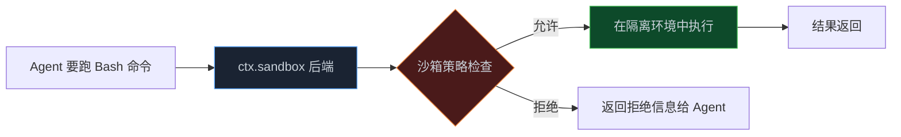

> **📖 系列说明**：本篇是安全专题篇，适合准备把 dsh 用到生产环境的开发者。安全不是可选项，是必选项。
> **🎁 读完你会得到**：理解 dsh 三层安全机制的工作原理，能配置沙箱和审批策略，能写审计日志插件，以及一份生产环境安全配置清单。

有个朋友跟我说，他们公司搭了一个内部 Agent，让它帮开发者做代码重构。

跑了两周，有一天 Agent 在重构过程中判断某个"废弃的测试文件"可以删掉，就删了。问题是那个文件不是废弃的，是一个关键的集成测试。删掉之后，CI 一直在跑，但实际上有一个核心功能的测试已经消失了。

这个问题发现的时候，已经过了三周。

Agent 能干活，但得管住它。

<!-- more -->

---

## 为什么安全问题比你想的更严重

很多人觉得 Agent 安全是"以后再说"的事——先把功能做出来，安全后面加。

这个想法有个问题：Agent 的危险操作往往不是恶意的，而是"好心办坏事"。

Agent 删文件，是因为它判断那个文件没用了。Agent 修改配置，是因为它觉得这样更合理。Agent 发邮件，是因为它认为这是任务的一部分。

这些操作在 Agent 的逻辑里都是"正确的"，但结果可能是灾难性的。

而且 Agent 不会告诉你它做了什么——除非你有完整的审计日志，否则你根本不知道它在你不注意的时候干了什么。

dsh 内置了三层安全机制，从外到内依次收紧。这三层不是摆设，是真正能拦住问题的。

---

## 第一层：沙箱——把 Agent 关在笼子里

沙箱是最外层的防线。它的核心思想很简单：**Agent 的所有进程操作，都经过一个"守门人"**。

在 dsh 里，这个守门人是 `ctx.sandbox` 后端。所有 Bash 命令、PTY 终端、文件系统访问，在真正执行之前都要经过沙箱的包装。



默认情况下，dsh 使用本地沙箱——Agent 在你的本机上跑，有完整的文件系统访问权限。这对开发环境够用，但生产环境不行。

生产环境的正确做法是把沙箱指向一个**远程隔离环境**：

```yaml
# cordis.yml：配置远程沙箱
- patch:
  - id: sandbox-backend
    config:
      type: 'remote'
      endpoint: 'https://your-sandbox-service.internal'
      # 沙箱服务的认证 token
      token: '${SANDBOX_TOKEN}'
      # 允许访问的文件系统路径（白名单）
      allowedPaths:
        - '/workspace'
        - '/tmp'
      # 禁止的命令模式
      blockedCommands:
        - 'rm -rf /'
        - 'curl * | bash'
        - 'wget * | sh'
      # 网络访问策略
      networkPolicy: 'restricted'  # 只允许访问白名单域名
```

远程沙箱的好处是：**文件系统和进程提供方共享同一个执行世界**。这意味着你把沙箱指向远程隔离环境之后，Bash、PTY、文件系统访问全部自动迁移到那个环境，不需要逐个适配每个工具。换一个沙箱后端，整个执行环境就换了。

如果你暂时没有远程沙箱服务，可以用 Docker 做一个简单的本地隔离：

```typescript
// src/plugins/docker-sandbox.ts
import type { Context } from '@deepseek-ai/cordis'
import { execSync } from 'child_process'

export const name = 'docker-sandbox'

export function apply(ctx: Context) {
  // 注册一个基于 Docker 的沙箱后端
  ctx.sandbox.register({
    id: 'docker',
    // 包装命令：在 Docker 容器里执行
    wrapCommand(cmd: string, args: string[]) {
      return [
        'docker', 'run', '--rm',
        '--network=none',           // 禁止网络访问
        '--memory=512m',            // 限制内存
        '--cpus=1',                 // 限制 CPU
        '-v', `${process.cwd()}:/workspace:ro`,  // 只读挂载工作区
        '-w', '/workspace',
        'node:20-alpine',
        cmd, ...args
      ]
    }
  })
}
```

---

## 第二层：审批策略——给危险操作加一道人工确认

沙箱是技术层面的隔离，审批策略是业务层面的控制。

有些操作即使在沙箱里跑也是危险的——比如删除文件、发送邮件、调用外部 API。这些操作需要人工确认，不能让 Agent 自己决定。

dsh 的审批策略在 `dsh-base` 组合包里配置：

```yaml
# cordis.yml：配置审批策略
- patch:
  - id: approval-policy
    config:
      # 默认策略：需要审批
      defaultPolicy: 'require-approval'

      # 按操作类型配置策略
      rules:
        # 文件读取：自动放行
        - pattern: 'fs/read'
          policy: 'auto-approve'

        # 文件写入：需要审批
        - pattern: 'fs/write'
          policy: 'require-approval'

        # 文件删除：强制审批，不可绕过
        - pattern: 'fs/delete'
          policy: 'require-approval'
          mandatory: true  # 即使在 headless 模式下也要审批

        # Bash 命令：根据命令内容决定
        - pattern: 'bash/execute'
          policy: 'conditional'
          condition:
            # 只读命令自动放行
            safePatterns: ['^ls ', '^cat ', '^grep ', '^find ']
            # 危险命令强制审批
            dangerousPatterns: ['rm ', 'mv ', 'chmod ', 'chown ']

        # 网络请求：需要审批
        - pattern: 'http/request'
          policy: 'require-approval'
          # 白名单域名自动放行
          whitelist: ['api.internal.company.com']
```

Web UI 模式下，需要审批的操作会弹出确认框：

```
Agent 想要执行以下操作：
删除文件：src/legacy/old-auth.ts

原因：该文件已被新的认证模块替代，不再被任何地方引用。

[允许] [拒绝] [查看详情]
```

headless 模式下（CI 环境），审批策略的处理方式不同。你需要提前决定哪些操作可以自动放行：

```yaml
# headless 模式的审批配置
- patch:
  - id: approval-policy
    config:
      # headless 模式下的策略
      headlessPolicy:
        # 只读操作自动放行
        readOperations: 'auto-approve'
        # 写操作：记录日志但自动放行（适合 CI 代码审查场景）
        writeOperations: 'auto-approve-with-log'
        # 删除操作：直接拒绝（CI 里不应该删文件）
        deleteOperations: 'auto-reject'
        # 网络请求：拒绝（CI 里不应该发外部请求）
        networkOperations: 'auto-reject'
```

---

## 第三层：工具执行把关——最细粒度的控制

前两层是"粗粒度"的控制——沙箱控制执行环境，审批策略控制操作类型。

第三层是"细粒度"的控制——在每个工具调用的前后，插入你自己的检查逻辑。

这就是 `tools/pre-execute` 和 `tools/post-execute` 事件的用武之地。

来看一个完整的安全检查插件：

```typescript
// src/plugins/security-guard.ts
import type { Context } from '@deepseek-ai/cordis'
import { appendFileSync, mkdirSync } from 'fs'
import { join } from 'path'

export const name = 'security-guard'

// 危险命令模式
const DANGEROUS_PATTERNS = [
  /rm\s+-rf\s+\//,           // rm -rf /
  /DROP\s+TABLE/i,            // SQL DROP TABLE
  /DELETE\s+FROM\s+\w+\s*;?\s*$/i,  // 无条件 DELETE
  /curl\s+.*\|\s*bash/,       // curl | bash
  /wget\s+.*\|\s*sh/,         // wget | sh
  />\s*\/etc\//,              // 写入 /etc/
  /chmod\s+777/,              // chmod 777
]

// 敏感文件路径
const SENSITIVE_PATHS = [
  '/etc/passwd', '/etc/shadow', '/etc/hosts',
  '.env', '.env.local', '.env.production',
  'id_rsa', 'id_ed25519',  // SSH 私钥
]

export function apply(ctx: Context) {
  // 确保审计日志目录存在
  const auditDir = join(process.cwd(), '.dsh-audit')
  mkdirSync(auditDir, { recursive: true })

  // 工具执行前：安全检查
  ctx.on('tools/pre-execute', async (event, next) => {
    const { name: toolName, arguments: args, callId } = event

    // 记录所有工具调用（审计日志）
    const auditEntry = {
      timestamp: new Date().toISOString(),
      callId,
      tool: toolName,
      args: JSON.stringify(args).slice(0, 500),  // 截断避免日志过大
      status: 'pending'
    }

    // 安全检查：Bash 命令
    if (toolName === 'bash' || toolName === 'shell') {
      const cmd = args?.command || args?.cmd || ''

      for (const pattern of DANGEROUS_PATTERNS) {
        if (pattern.test(cmd)) {
          auditEntry.status = 'blocked'
          writeAuditLog(auditDir, { ...auditEntry, reason: `危险命令模式：${pattern}` })

          ctx.logger.warn('[security-guard] 拦截危险命令：%s', cmd)

          // 不调用 next()，工具不执行
          event.result = {
            error: `命令被安全策略拦截`,
            reason: `检测到危险操作模式`,
            blocked: true
          }
          return
        }
      }
    }

    // 安全检查：文件操作
    if (toolName === 'read_file' || toolName === 'write_file') {
      const filePath = args?.path || args?.file || ''

      for (const sensitive of SENSITIVE_PATHS) {
        if (filePath.includes(sensitive)) {
          auditEntry.status = 'blocked'
          writeAuditLog(auditDir, { ...auditEntry, reason: `敏感文件路径：${sensitive}` })

          ctx.logger.warn('[security-guard] 拦截敏感文件访问：%s', filePath)

          event.result = {
            error: `文件访问被安全策略拦截`,
            reason: `该路径包含敏感信息`,
            blocked: true
          }
          return
        }
      }
    }

    // 通过检查，记录日志并放行
    auditEntry.status = 'allowed'
    writeAuditLog(auditDir, auditEntry)

    await next()
  })

  // 工具执行后：记录结果
  ctx.on('tools/post-execute', async (event, next) => {
    const { name: toolName, callId } = event

    // 记录执行结果（只记录是否成功，不记录完整结果，避免敏感信息泄露）
    writeAuditLog(auditDir, {
      timestamp: new Date().toISOString(),
      callId,
      tool: toolName,
      status: event.error ? 'error' : 'success',
      error: event.error?.message
    })

    await next()
  })

  ctx.logger.info('[security-guard] 安全守卫已启动，审计日志：%s', auditDir)
}

function writeAuditLog(dir: string, entry: object) {
  const logFile = join(dir, `audit-${new Date().toISOString().split('T')[0]}.jsonl`)
  appendFileSync(logFile, JSON.stringify(entry) + '\n')
}
```

这个插件做了三件事：

**拦截危险命令**：在 `pre-execute` 里检查 Bash 命令，匹配到危险模式就不调用 `next()`，工具不执行。

**拦截敏感文件访问**：检查文件路径，包含敏感路径就拦截。

**完整审计日志**：每次工具调用（无论是否被拦截）都写入 JSONL 格式的审计日志，方便后续查询。

---

## 最小权限原则：不同场景给不同权限

安全的另一个核心原则是**最小权限**——Agent 只应该有它完成任务所需的最小权限，不多给。

在 dsh 里，这通过 Agent preset 实现。不同的 preset 配置不同的工具集和权限：

```yaml
# cordis.yml：不同场景的 preset 配置

# 代码审查 preset：只读权限
- insert:
  - id: code-review-preset
    name: '@deepseek-ai/dsh-preset'
    config:
      presetId: code-review
      systemPrompt: '你是代码审查员，只能读取文件，不能修改任何内容。'
      # 只给只读工具
      allowedTools:
        - read_file
        - list_directory
        - search_code
        - grep_search
      # 明确禁止的工具
      blockedTools:
        - write_file
        - bash
        - shell
        - delete_file

# 代码修复 preset：有限写权限
- insert:
  - id: code-fix-preset
    name: '@deepseek-ai/dsh-preset'
    config:
      presetId: code-fix
      systemPrompt: '你是代码修复助手，可以读取和修改代码文件，但不能删除文件或执行系统命令。'
      allowedTools:
        - read_file
        - write_file
        - list_directory
        - search_code
      blockedTools:
        - bash
        - shell
        - delete_file
        - http_request

# 全功能 preset：完整权限（仅限受信任的开发环境）
- insert:
  - id: full-access-preset
    name: '@deepseek-ai/dsh-preset'
    config:
      presetId: full-access
      systemPrompt: '你是全功能开发助手。'
      # 不限制工具，但沙箱仍然生效
      allowedTools: '*'
```

这样，当你在 CI 里跑代码审查时，用 `code-review` preset——Agent 根本没有写文件的工具，想改也改不了。当你在开发环境里做代码修复时，用 `code-fix` preset——可以改文件，但不能跑系统命令。

---

## 审计日志：事后追溯的关键

安全不只是"防止坏事发生"，还包括"坏事发生后能查清楚"。

审计日志是事后追溯的关键。一个好的审计日志应该记录：

- **谁做了什么**：哪个 Agent、哪个会话、哪个工具
- **做了什么**：工具名称、参数（脱敏后）
- **结果如何**：成功/失败/被拦截
- **什么时候**：精确到毫秒的时间戳

上面的 `security-guard` 插件已经实现了基本的审计日志。来看一个更完整的版本，支持按会话查询：

```typescript
// src/plugins/audit-logger.ts
import type { Context } from '@deepseek-ai/cordis'
import { appendFileSync, mkdirSync, readFileSync, existsSync } from 'fs'
import { join } from 'path'

export const name = 'audit-logger'
export const inject = ['sessions']

interface AuditEntry {
  timestamp: string
  sessionId: string
  agentId?: string
  event: string
  tool?: string
  args?: string
  result?: string
  duration?: number
  blocked?: boolean
  reason?: string
}

export function apply(ctx: Context) {
  const auditDir = join(process.cwd(), '.dsh-audit')
  mkdirSync(auditDir, { recursive: true })

  const callStartTimes = new Map<string, number>()

  // 记录会话开始
  ctx.on('turn/start', (event) => {
    writeAudit(auditDir, {
      timestamp: new Date().toISOString(),
      sessionId: event.sessionId,
      event: 'turn/start'
    })
  })

  // 记录工具调用开始时间
  ctx.on('tool/call', (event) => {
    callStartTimes.set(event.callId, Date.now())

    writeAudit(auditDir, {
      timestamp: new Date().toISOString(),
      sessionId: event.sessionId,
      event: 'tool/call',
      tool: event.name,
      // 对参数进行脱敏处理
      args: sanitizeArgs(event.arguments)
    })
  })

  // 记录工具执行结果
  ctx.on('tool/result', (event) => {
    const startTime = callStartTimes.get(event.callId)
    const duration = startTime ? Date.now() - startTime : undefined
    callStartTimes.delete(event.callId)

    writeAudit(auditDir, {
      timestamp: new Date().toISOString(),
      sessionId: event.sessionId,
      event: 'tool/result',
      tool: event.name,
      result: event.error ? 'error' : 'success',
      duration
    })
  })

  // 提供审计日志查询工具（给管理员用）
  ctx.tools.register({
    name: 'query_audit_log',
    description: '查询审计日志。仅限管理员使用，用于追溯 Agent 的操作历史。',
    parameters: {
      type: 'object',
      properties: {
        sessionId: { type: 'string', description: '会话 ID' },
        date: { type: 'string', description: '日期，格式 YYYY-MM-DD' },
        tool: { type: 'string', description: '工具名称过滤' }
      }
    },
    async execute({ sessionId, date, tool }) {
      const logFile = join(auditDir, `audit-${date || new Date().toISOString().split('T')[0]}.jsonl`)

      if (!existsSync(logFile)) {
        return { entries: [], message: '该日期没有审计日志' }
      }

      const lines = readFileSync(logFile, 'utf-8').trim().split('\n')
      let entries: AuditEntry[] = lines
        .filter(l => l.trim())
        .map(l => JSON.parse(l))

      if (sessionId) {
        entries = entries.filter(e => e.sessionId === sessionId)
      }
      if (tool) {
        entries = entries.filter(e => e.tool === tool)
      }

      return {
        entries: entries.slice(-100),  // 最多返回最近 100 条
        total: entries.length
      }
    }
  })
}

function sanitizeArgs(args: any): string {
  if (!args) return ''
  const str = JSON.stringify(args)
  // 脱敏：替换可能的密钥、密码
  return str
    .replace(/"(password|token|secret|key|apiKey)"\s*:\s*"[^"]+"/gi, '"$1":"[REDACTED]"')
    .slice(0, 300)
}

function writeAudit(dir: string, entry: AuditEntry) {
  const logFile = join(dir, `audit-${new Date().toISOString().split('T')[0]}.jsonl`)
  appendFileSync(logFile, JSON.stringify(entry) + '\n')
}
```

---

## 生产环境安全配置清单

把上面这些整合成一份可以直接用的检查清单：

**沙箱配置**
- [ ] 生产环境使用远程沙箱，不在宿主机上直接执行
- [ ] 文件系统访问限制在白名单路径内
- [ ] 网络访问限制在白名单域名内
- [ ] 内存和 CPU 使用有上限

**审批策略**
- [ ] 文件删除操作强制审批，即使在 headless 模式下
- [ ] 外部网络请求需要审批或在白名单内
- [ ] headless 模式下明确配置哪些操作自动放行、哪些自动拒绝

**工具权限**
- [ ] 不同场景使用不同的 preset，遵循最小权限原则
- [ ] CI/CD 场景使用只读 preset，不给写权限
- [ ] 生产数据库连接工具只给查询权限，不给写权限

**审计日志**
- [ ] 所有工具调用都有审计日志
- [ ] 审计日志包含时间戳、会话 ID、工具名称、执行结果
- [ ] 日志中的敏感信息（密钥、密码）已脱敏
- [ ] 审计日志定期备份，保留至少 90 天
- [ ] 有机制能按会话 ID 查询完整的操作历史

**监控告警**
- [ ] 危险命令被拦截时有告警通知
- [ ] 单个会话工具调用次数超过阈值时有告警
- [ ] 审计日志写入失败时有告警（不能因为日志失败而影响正常运行）

---

## 一个真实的安全事故复盘

回到开头那个朋友的故事。

他们的 Agent 删掉了关键测试文件，根本原因是：

**没有审计日志**。Agent 删文件的时候，没有任何记录。等发现问题的时候，根本不知道是什么时候删的、为什么删的。

**没有最小权限**。Agent 用的是全功能 preset，有完整的文件系统写权限，包括删除。

**没有审批策略**。文件删除操作没有配置需要审批，Agent 自己就决定删了。

如果当时有这三层保护：审批策略会在删除前弹出确认，即使没人看到，审计日志也会记录这次操作，事后可以追溯。

安全不是"以后再说"的事。在 Agent 真正开始干活之前，这三层保护就应该到位。

---

## 📝 小结

- dsh 的三层安全机制：沙箱（隔离执行环境）→ 审批策略（控制操作类型）→ 工具执行把关（细粒度拦截）
- 生产环境必须使用远程沙箱，不在宿主机上直接执行 Agent 的命令
- 审批策略要区分 Web UI 模式（弹出确认框）和 headless 模式（预配置策略）
- 最小权限原则：不同场景用不同 preset，CI 场景只给只读权限
- 审计日志是事后追溯的关键，敏感信息要脱敏，至少保留 90 天
- 安全配置要在 Agent 开始干活之前就到位，不是"以后再说"

---

## 🔮 下一篇预告

安全配置好了，下一步是把 dsh 用到业务流程里。

审批流、数据处理、报告生成——这些是企业里最常见的业务场景，也是 AI Agent 能带来最大价值的地方。

下一篇，我们讲业务流程自动化：怎么用 dsh 搭一个审批流 Agent、怎么做数据处理管道、怎么自动生成各种报告。

---

> 📚 **系列导航**
> - 第 01 篇：凭什么说它是下一代 Agent 框架？
> - 第 02 篇：10 分钟跑起来：从安装到第一个任务
> - 第 03 篇：插件开发入门：从 Hello World 到真正有用的插件
> - 第 04 篇：工具开发实战：给 Agent 装上你自己的工具
> - 第 05 篇：架构深度解析：一条消息进来，dsh 内部发生了什么
> - 第 06 篇：多 Agent 协作：子代理、工作流与 Teams
> - 第 07 篇：研发场景落地：CI 集成、代码审查与测试分析
> - **第 08 篇：安全与权限：让 Agent 在可控边界内工作** ⬅️ 你在这里
> - 第 09 篇：业务流程自动化：审批流、数据处理与报告生成
> - 第 10 篇：中小企业实战（一）：从 0 搭一个能上线的智能客服系统
> - 第 11 篇：中小企业实战（二）：内部知识库问答 Agent，让文档真正被用起来
> - 第 12 篇：中小企业实战（三）：销售流程自动化，报价跟进周报一键搞定
