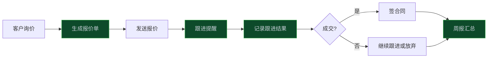

> **📖 系列说明**：本篇是中小企业实战系列第三篇，也是收官篇。解决销售团队最头疼的重复性事务：报价、跟进记录、周报。
> **🎁 读完你会得到**：报价单生成工具 + 跟进提醒插件 + 周报自动生成 + 一套可以直接用的销售 Agent 配置。

销售团队有个普遍的抱怨：每天真正用来"卖东西"的时间，可能只有 30%。剩下的时间在填报价单、写跟进记录、整理周报、回复重复问题。

这些事情不是不重要，但它们不需要人来做。

<!-- more -->

---

## 销售流程里哪些事可以自动化

先梳理一下销售的日常工作，找出可以自动化的部分：



绿色的四个环节——报价单生成、跟进提醒、跟进记录、周报汇总——都是重复性高、规则明确的工作，最适合自动化。

---

## 项目结构

```
sales-agent/
├── src/
│   ├── plugins/
│   │   ├── quote-generator.ts    # 报价单生成
│   │   ├── follow-up.ts          # 跟进管理
│   │   ├── weekly-report.ts      # 周报生成
│   │   └── sales-prompt.ts       # 销售 Agent 提示词
│   ├── data/
│   │   ├── products.json         # 产品价格表
│   │   └── customers.json        # 客户数据（简化版）
│   └── templates/
│       ├── quote.md              # 报价单模板
│       └── weekly-report.md      # 周报模板
├── cordis.yml
└── package.json
```

---

## 第一步：报价单生成工具

报价单是销售最高频的工作。手动做的话，要查产品价格、算折扣、填客户信息、排版——一张报价单少则 20 分钟。

```typescript
// src/plugins/quote-generator.ts
import type { Context } from '@deepseek-ai/cordis'
import { readFileSync, writeFileSync } from 'fs'
import { join } from 'path'

export const name = 'quote-generator'
export const inject = ['tools']

interface Product {
  id: string
  name: string
  unitPrice: number
  unit: string
  category: string
}

interface QuoteItem {
  productId: string
  quantity: number
  discount?: number  // 折扣，0-1 之间，1 表示不打折
}

export function apply(ctx: Context) {
  const products: Product[] = JSON.parse(
    readFileSync(join(__dirname, '../data/products.json'), 'utf-8')
  )

  ctx.tools.register({
    name: 'generate_quote',
    description: '根据客户需求生成报价单。需要提供客户名称、所需产品和数量。',
    parameters: {
      type: 'object',
      properties: {
        customerName: { type: 'string', description: '客户公司名称' },
        contactPerson: { type: 'string', description: '联系人姓名' },
        items: {
          type: 'array',
          description: '报价项目列表',
          items: {
            type: 'object',
            properties: {
              productId: { type: 'string', description: '产品ID' },
              quantity: { type: 'number', description: '数量' },
              discount: { type: 'number', description: '折扣（0.9表示九折），不填则按原价' }
            },
            required: ['productId', 'quantity']
          }
        },
        validDays: { type: 'number', description: '报价有效期（天），默认30天', default: 30 },
        notes: { type: 'string', description: '备注信息' }
      },
      required: ['customerName', 'items']
    },
    async execute({ customerName, contactPerson, items, validDays = 30, notes }) {
      const quoteItems = items.map((item: QuoteItem) => {
        const product = products.find(p => p.id === item.productId)
        if (!product) throw new Error(`产品 ${item.productId} 不存在`)

        const discount = item.discount ?? 1
        const unitPrice = product.unitPrice * discount
        const subtotal = unitPrice * item.quantity

        return {
          name: product.name,
          unit: product.unit,
          unitPrice: product.unitPrice,
          discount: discount < 1 ? `${(discount * 10).toFixed(1)}折` : '原价',
          discountedPrice: unitPrice,
          quantity: item.quantity,
          subtotal
        }
      })

      const total = quoteItems.reduce((sum, item) => sum + item.subtotal, 0)
      const quoteNo = `QT${Date.now().toString().slice(-8)}`
      const validUntil = new Date(Date.now() + validDays * 86400000)
        .toISOString().split('T')[0]

      // 生成报价单 Markdown
      const quoteContent = `# 报价单

**报价单号**：${quoteNo}
**客户名称**：${customerName}
**联系人**：${contactPerson || '—'}
**报价日期**：${new Date().toISOString().split('T')[0]}
**有效期至**：${validUntil}

---

## 报价明细

| 产品名称 | 单位 | 单价 | 折扣 | 折后单价 | 数量 | 小计 |
|---------|------|------|------|---------|------|------|
${quoteItems.map(item =>
  `| ${item.name} | ${item.unit} | ¥${item.unitPrice} | ${item.discount} | ¥${item.discountedPrice.toFixed(2)} | ${item.quantity} | ¥${item.subtotal.toFixed(2)} |`
).join('\n')}

**合计：¥${total.toFixed(2)}**

${notes ? `\n**备注**：${notes}` : ''}

---

*本报价单有效期至 ${validUntil}，如有疑问请联系销售顾问。*`

      // 保存报价单文件
      const fileName = `quote_${quoteNo}.md`
      writeFileSync(join(process.cwd(), 'quotes', fileName), quoteContent)

      return {
        success: true,
        quoteNo,
        total: total.toFixed(2),
        validUntil,
        fileName,
        preview: quoteContent
      }
    }
  })

  // 查询产品列表工具
  ctx.tools.register({
    name: 'list_products',
    description: '查询可报价的产品列表，包括产品ID、名称和价格。',
    parameters: {
      type: 'object',
      properties: {
        category: { type: 'string', description: '产品分类筛选，不填则返回全部' }
      }
    },
    async execute({ category }) {
      const filtered = category
        ? products.filter(p => p.category === category)
        : products
      return { products: filtered }
    }
  })
}
```

---

## 第二步：跟进管理插件

跟进是销售最容易忘的事。客户说"下周再联系"，结果两周后才想起来。

```typescript
// src/plugins/follow-up.ts
import type { Context } from '@deepseek-ai/cordis'
import { readFileSync, writeFileSync } from 'fs'
import { join } from 'path'

export const name = 'follow-up'
export const inject = ['tools']

interface FollowUpRecord {
  id: string
  customerName: string
  contactPerson: string
  lastContact: string
  nextFollowUp: string
  status: 'active' | 'won' | 'lost' | 'paused'
  notes: string[]
  quoteNo?: string
}

export function apply(ctx: Context) {
  const dbPath = join(process.cwd(), 'data', 'follow-ups.json')

  function loadRecords(): FollowUpRecord[] {
    try {
      return JSON.parse(readFileSync(dbPath, 'utf-8'))
    } catch {
      return []
    }
  }

  function saveRecords(records: FollowUpRecord[]) {
    writeFileSync(dbPath, JSON.stringify(records, null, 2))
  }

  // 记录跟进
  ctx.tools.register({
    name: 'log_follow_up',
    description: '记录一次客户跟进，包括跟进内容和下次跟进时间。',
    parameters: {
      type: 'object',
      properties: {
        customerName: { type: 'string' },
        contactPerson: { type: 'string' },
        note: { type: 'string', description: '本次跟进内容摘要' },
        nextFollowUpDate: { type: 'string', description: '下次跟进日期，格式 YYYY-MM-DD' },
        status: {
          type: 'string',
          enum: ['active', 'won', 'lost', 'paused'],
          description: 'active=跟进中 won=已成交 lost=已流失 paused=暂停跟进'
        },
        quoteNo: { type: 'string', description: '关联的报价单号（可选）' }
      },
      required: ['customerName', 'note', 'nextFollowUpDate', 'status']
    },
    async execute({ customerName, contactPerson, note, nextFollowUpDate, status, quoteNo }) {
      const records = loadRecords()
      const existing = records.find(r => r.customerName === customerName)
      const today = new Date().toISOString().split('T')[0]

      if (existing) {
        existing.lastContact = today
        existing.nextFollowUp = nextFollowUpDate
        existing.status = status
        existing.notes.push(`[${today}] ${note}`)
        if (quoteNo) existing.quoteNo = quoteNo
      } else {
        records.push({
          id: `FU${Date.now()}`,
          customerName,
          contactPerson: contactPerson || '',
          lastContact: today,
          nextFollowUp: nextFollowUpDate,
          status,
          notes: [`[${today}] ${note}`],
          quoteNo
        })
      }

      saveRecords(records)
      return { success: true, message: `跟进记录已保存，下次跟进：${nextFollowUpDate}` }
    }
  })

  // 查询今日需要跟进的客户
  ctx.tools.register({
    name: 'get_today_follow_ups',
    description: '获取今天需要跟进的客户列表。每天开始工作时调用，了解今日跟进任务。',
    parameters: { type: 'object', properties: {} },
    async execute() {
      const records = loadRecords()
      const today = new Date().toISOString().split('T')[0]

      const todayTasks = records.filter(r =>
        r.status === 'active' && r.nextFollowUp <= today
      )

      if (todayTasks.length === 0) {
        return { message: '今天没有待跟进的客户', tasks: [] }
      }

      return {
        message: `今天有 ${todayTasks.length} 个客户需要跟进`,
        tasks: todayTasks.map(r => ({
          customerName: r.customerName,
          contactPerson: r.contactPerson,
          lastContact: r.lastContact,
          scheduledDate: r.nextFollowUp,
          overdueDays: Math.max(0, Math.floor(
            (Date.now() - new Date(r.nextFollowUp).getTime()) / 86400000
          )),
          lastNote: r.notes[r.notes.length - 1] || '无记录',
          quoteNo: r.quoteNo
        }))
      }
    }
  })
}
```

---

## 第三步：周报自动生成

周报是销售最烦的事之一。每周五下午，要把这周的跟进情况整理成报告。

```typescript
// src/plugins/weekly-report.ts
import type { Context } from '@deepseek-ai/cordis'
import { readFileSync, writeFileSync } from 'fs'
import { join } from 'path'

export const name = 'weekly-report'
export const inject = ['tools']

export function apply(ctx: Context) {
  ctx.tools.register({
    name: 'generate_weekly_report',
    description: '生成本周销售工作周报，汇总跟进情况、成交数据和下周计划。',
    parameters: {
      type: 'object',
      properties: {
        salesPerson: { type: 'string', description: '销售人员姓名' },
        weekHighlights: { type: 'string', description: '本周重点工作亮点（可选，AI会自动从数据中提取）' },
        nextWeekPlan: { type: 'string', description: '下周重点计划' }
      },
      required: ['salesPerson', 'nextWeekPlan']
    },
    async execute({ salesPerson, weekHighlights, nextWeekPlan }) {
      const dbPath = join(process.cwd(), 'data', 'follow-ups.json')
      const records = JSON.parse(readFileSync(dbPath, 'utf-8') || '[]')

      // 统计本周数据
      const weekStart = new Date()
      weekStart.setDate(weekStart.getDate() - weekStart.getDay() + 1)
      const weekStartStr = weekStart.toISOString().split('T')[0]

      const thisWeekContacts = records.filter((r: any) =>
        r.lastContact >= weekStartStr
      )
      const wonThisWeek = records.filter((r: any) =>
        r.status === 'won' && r.lastContact >= weekStartStr
      )
      const activeLeads = records.filter((r: any) => r.status === 'active')

      const reportDate = new Date().toISOString().split('T')[0]
      const weekRange = `${weekStartStr} ~ ${reportDate}`

      const report = `# 销售周报

**销售人员**：${salesPerson}
**报告周期**：${weekRange}
**生成时间**：${reportDate}

---

## 本周工作概况

| 指标 | 数据 |
|------|------|
| 跟进客户数 | ${thisWeekContacts.length} 家 |
| 本周成交 | ${wonThisWeek.length} 单 |
| 在跟进线索 | ${activeLeads.length} 家 |

## 本周重点跟进

${thisWeekContacts.slice(0, 5).map((r: any) =>
  `- **${r.customerName}**（${r.contactPerson || '—'}）：${r.notes[r.notes.length - 1] || '无记录'}`
).join('\n') || '本周无跟进记录'}

${weekHighlights ? `\n## 本周亮点\n\n${weekHighlights}` : ''}

## 下周工作计划

${nextWeekPlan}

### 下周待跟进客户

${activeLeads
  .filter((r: any) => r.nextFollowUp >= reportDate)
  .slice(0, 5)
  .map((r: any) => `- ${r.customerName}（计划：${r.nextFollowUp}）`)
  .join('\n') || '暂无计划跟进'}

---

*本报告由销售 Agent 自动生成*`

      const fileName = `weekly_report_${reportDate}.md`
      writeFileSync(join(process.cwd(), 'reports', fileName), report)

      return { success: true, fileName, preview: report }
    }
  })
}
```

---

## 第四步：销售 Agent 提示词

```typescript
// src/plugins/sales-prompt.ts
import type { Context } from '@deepseek-ai/cordis'

export const name = 'sales-system-prompt'
export const inject = ['systemPrompt']

export function apply(ctx: Context) {
  ctx.systemPrompt.register({
    id: 'sales-persona',
    priority: 100,
    content: `你是销售团队的 AI 助手，帮助销售人员处理日常事务性工作。

## 你能做的事
- 根据客户需求生成报价单（先用 list_products 查产品，再用 generate_quote 生成）
- 记录客户跟进情况（log_follow_up）
- 查询今日待跟进客户（get_today_follow_ups）
- 生成周报（generate_weekly_report）

## 工作流程
1. 早上打招呼时，主动调用 get_today_follow_ups 告知今日跟进任务
2. 生成报价单前，先确认客户名称、产品需求和数量
3. 记录跟进时，提醒销售设置下次跟进时间
4. 周五下午，提醒生成周报

## 注意事项
- 报价单中的折扣需要销售确认，不要自行决定
- 客户状态变更（成交/流失）需要销售明确告知才能更新
- 所有数据操作前先确认，避免误操作`
  })
}
```

---

## 组装配置并启动

```yaml
# cordis.yml
- insert:
  - id: quote-generator
    name: './src/plugins/quote-generator.ts'
  - id: follow-up
    name: './src/plugins/follow-up.ts'
  - id: weekly-report
    name: './src/plugins/weekly-report.ts'
  - id: sales-system-prompt
    name: './src/plugins/sales-prompt.ts'
```

```bash
# 创建必要目录
mkdir -p quotes reports data

# 启动
pnpm dsh web --patch ./cordis.yml
```

---

## 实际使用场景演示

启动后，销售可以这样和 Agent 对话：

> **销售**：早上好，今天有哪些客户要跟进？
>
> **Agent**：早上好！今天有 3 个客户需要跟进：
> - **XX科技**（张总）：上周发了报价单 QT12345678，今天是约定的回复截止日
> - **YY贸易**（李经理）：已逾期 2 天，上次说要内部讨论
> - **ZZ集团**（王总）：新线索，首次跟进

> **销售**：帮我给XX科技出一份报价，他们要 A产品 10 台，B产品 5 套，给个九折
>
> **Agent**：好的，先查一下产品信息……（调用 list_products）
> 找到了，A产品单价 ¥2,800，B产品单价 ¥1,500。九折后：
> - A产品：¥2,520 × 10 = ¥25,200
> - B产品：¥1,350 × 5 = ¥6,750
> - **合计：¥31,950**
>
> 确认生成报价单吗？

---

## 这套方案的局限和扩展方向

**局限**：数据存在本地 JSON 文件，多人协作会有冲突问题。如果团队超过 3 人，建议换成数据库（SQLite 或 MySQL）。

**扩展方向**：
- 对接企业微信/钉钉，跟进提醒直接推送到手机
- 对接 CRM 系统（Salesforce、纷享销客），数据双向同步
- 加入邮件发送工具，报价单直接发给客户
- 用 dsh 的子代理功能，让一个 Agent 专门管报价，另一个专门管跟进

---

## 📝 小结

- 销售流程自动化的核心是把"规则明确的重复性工作"交给 Agent，让销售专注在真正需要人判断的环节
- 报价单生成、跟进记录、周报汇总是最容易落地的三个场景
- 数据存储从 JSON 文件起步，够用了，后面有需要再升级到数据库
- 系统提示词里明确"折扣需要销售确认"，避免 Agent 自作主张
- 多人协作场景需要换数据库，这是 JSON 文件方案的主要局限

---

## 系列收官

三篇中小企业实战到这里就结束了。

回顾一下这三个场景：**智能客服**解决了重复咨询的问题，**知识库问答**解决了文档找不到的问题，**销售自动化**解决了事务性工作占用时间的问题。

这三个场景有一个共同点：**ROI 明显，落地门槛低**。不需要大规模改造现有系统，一个插件一个插件地加，每加一个都能看到效果。

dsh 的"一切皆插件"设计，在这里体现得很清楚——你可以先只用报价单生成，跑一段时间觉得好用了，再加跟进管理，再加周报。每个功能独立，互不干扰，随时可以调整。

这才是中小企业落地 AI 的正确姿势：**小步快跑，快速验证，逐步扩展**。

---

> 📚 **系列导航**
> - 第 10 篇：中小企业实战（一）：从 0 搭一个能上线的智能客服
> - 第 11 篇：中小企业实战（二）：内部知识库问答 Agent，让文档真正被用起来
> - **第 12 篇：中小企业实战（三）：销售流程自动化，报价跟进周报一键搞定** ⬅️ 你在这里
