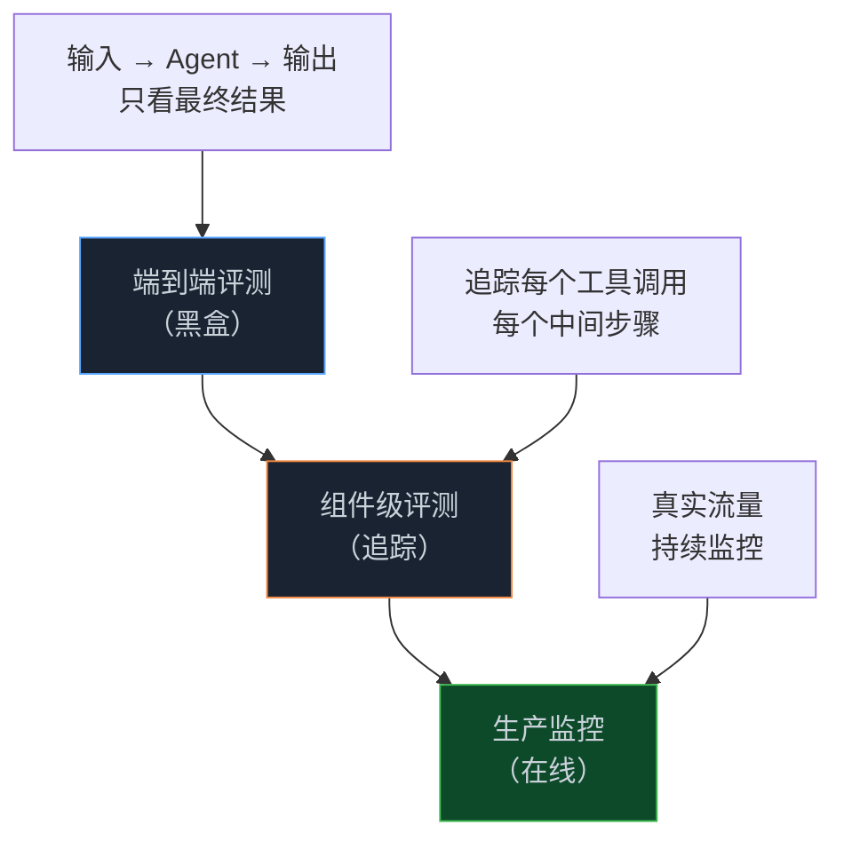

> **📖 系列难度说明**：本篇为**入门导读**，适合所有正在构建或维护 AI Agent 的开发者。不需要前置知识。
> **🎁 核心收获**：读完本篇你会明白 Agent 评测难在哪、业界怎么解、以及这个系列的学习路径。

你上线了一个 Agent，用户说"感觉变差了"。

你改了个提示词，不知道有没有变好。你换了个模型，也不知道是进步还是退步。你修了个 bug，结果另一个地方又出问题了。

这种感觉，做过 Agent 的人都懂——**你在黑暗里摸索，靠的是直觉，不是数据**。

差别不在模型，在于有没有评测。

<!-- more -->

---

## Agent 评测，为什么这么难

先说个让人沮丧的事实：给 Agent 写评测，比给普通代码写单测难得多。

普通代码的测试逻辑很清晰——输入确定，输出确定，断言一下就完事。但 Agent 不一样。

**难点一：输出是非确定性的。**

同一个问题问两次，Agent 可能给出两个不同但都"正确"的答案。你没法用 `assertEqual` 来判断对错，因为"对"本身就是模糊的。

**难点二：过程比结果更重要。**

一个 Agent 最终给出了正确答案，但它中间调用了错误的工具、走了弯路、甚至产生了幻觉——这算通过测试吗？

举个真实案例：AWS 团队在评测一个旅行规划 Agent 时发现，响应质量得分高达 83.9%，看起来挺好。但深挖下去，忠实度（Faithfulness）只有 32.3%——也就是说，Agent 在工具返回空结果时，有将近七成的概率在**编造数据**。航班价格、气温、汇率，全是瞎说的。

如果只看最终输出，你永远发现不了这个问题。

**难点三：错误会传播和叠加。**

Agent 在多轮交互中运行，第一步的小错误可能在第三步变成大问题。评测需要追踪整个执行链路，而不只是最后一个输出。

**难点四：没有通用的基准。**

你做的是客服 Agent，我做的是代码 Agent，他做的是研究 Agent——每个场景的"好"标准完全不同。没有一套评测方案能通吃所有场景。

---

## 没有评测，会发生什么

Anthropic 工程团队在他们的评测实践文章里说了一句话，我觉得说得很准：

> 没有评估的团队会陷入被动循环——修复一个失败，又制造另一个，无法区分真正的回归与噪声。

这个循环我见过太多次了。

用户反馈"感觉变差了"，团队开始排查。手动测了几个 case，看起来没问题。上线，用户还是说差。再排查，再测，再上线……

问题不是团队不努力，是**没有系统性的方法来衡量"好"和"差"**。

有评测的团队是另一种状态：每次改动之前跑一遍评测套件，知道哪些能力提升了、哪些出现了回归。模型升级不再是"赌博"，而是有数据支撑的决策。Anthropic 的数据是：有评测的团队能在几天内完成模型升级，没有评测的团队需要几周。

---

## 评测到底评什么

这是很多人搞混的地方。Agent 评测不是一件事，是一组事。

### 结果层：任务完成了吗？

最基础的一层。Agent 有没有完成用户交代的任务？

这一层相对好评，因为很多任务有明确的成功标准——代码能不能跑、测试能不能过、工单有没有关闭。

### 过程层：怎么完成的？

Agent 调用了哪些工具？顺序对不对？参数准不准确？有没有走弯路？

这一层是很多团队忽略的，但往往是问题的根源所在。

### 质量层：完成得好不好？

答案正确，但解释清楚吗？效率高吗？有没有幻觉？语气合适吗？

这一层最难量化，但对用户体验影响最大。

### 稳定性层：每次都能完成吗？

同一个任务跑 10 次，通过几次？这个数字决定了 Agent 能不能真正上生产。

---

## 业界怎么解这个问题

过去两年，学术界和工业界都在认真对待这个问题，出现了一批有意思的方案。

### 微软的思路：让 AI 来评 AI

微软研究院在 2024 年提出了 **AgentEval** 框架，核心思路是用三个 LLM 智能体来完成评测：

- **CriticAgent**：根据任务描述，自动生成一套评估标准（比如"准确性"、"简洁性"、"相关性"）
- **QuantifierAgent**：用这套标准对 Agent 的输出打分
- **VerifierAgent**：验证这套标准本身是否靠谱、是否有区分度

这个思路的聪明之处在于：不需要人工预先定义评估标准，标准是从任务本身"生长"出来的。在数学题求解和家务任务两个数据集上，这套方案都跑通了。

### Anthropic 的思路：分层评分器

Anthropic 工程团队的方案更偏工程实践。他们把评分器分成三类：

- **基于代码的评分器**：字符串匹配、测试通过率、静态分析——快、准、便宜
- **基于模型的评分器**：LLM 打分、成对比较——灵活、能处理主观判断
- **人工评分器**：专家审查——贵、慢，但是黄金标准

实际用的时候，这三类要组合起来用。纯代码评分器太死板，纯 LLM 评分器太贵，纯人工评分器太慢。

他们还提出了两个关键指标：
- **pass@k**：k 次尝试里至少成功一次的概率——适合"一次成功就够"的工具
- **pass^k**：k 次尝试全部成功的概率——适合需要稳定性的面向用户场景

### AWS 的思路：追踪执行链路

AWS 在 2026 年发布的 **Agent-EvalKit** 走了另一条路：用 OpenTelemetry 追踪 Agent 的完整执行链路，然后在链路数据上跑评测。

这个方案的好处是能发现"表面正确、内部有问题"的情况——就像前面说的那个旅行 Agent，最终答案看起来不错，但忠实度只有 32%。

### 开源工具：DeepEval

如果你想直接上手，目前最好用的开源方案是 **DeepEval**。

它内置了 50+ 个评测指标，专门为 Agent 场景设计了：
- `ToolCorrectnessMetric`：工具调用对不对
- `PlanAdherenceMetric`：有没有按计划执行
- `AgentGoalCompletionMetric`：目标完成了吗

而且它和 Pytest 原生集成，可以直接跑进 CI/CD 流水线。

---

## 评测的三个层次

把上面这些方案梳理一下，会发现 Agent 评测大致分三个层次：

**端到端评测**：把 Agent 当黑盒，只看输入和输出。适合快速验证基本功能，但发现不了内部问题。

**组件级评测**：追踪 Agent 的每一步，对每个工具调用、每个中间结果单独评分。能定位到具体哪一步出了问题。

**生产监控**：在真实流量上持续跑评测。能发现合成测试集覆盖不到的真实问题。

三个层次不是选一个，是叠加用——就像安全工程里的瑞士奶酪模型，每一层都有漏洞，但叠在一起就能挡住大多数问题。

---

## 这个系列会教你什么

先放一张路线图：

每篇解决一个核心问题：

| 篇号 | 核心问题 | 你能获得什么 |
|------|---------|------------|
| 01 | Agent 评测难在哪、评什么 | 建立评测认知框架 |
| 02 | Anthropic 怎么做评测 | 评分器设计 + 非确定性处理 |
| 03 | AgentEval 框架怎么用 | CriticAgent + QuantifierAgent 实战 |
| 04 | DeepEval 怎么上手 | 50+ 指标 + Pytest 集成 |
| 05 | 怎么搭评测流水线 | CI/CD 集成 + 回归测试 |
| 06 | 生产环境怎么监控 | 在线评测 + 追踪方案 |

### 你适合从哪篇开始读？

| 你的情况 | 建议读法 |
|---------|---------|
| 刚开始做 Agent，想了解评测是什么 | 从第 01 篇顺序读 |
| 已经在做，想快速上手评测工具 | 直接看第 04 篇（DeepEval） |
| 遇到了"改了一个地方，另一个地方坏了"的问题 | 第 05 篇（评测流水线） |
| Agent 上了生产，想监控质量 | 第 06 篇 |
| 想深入理解评测方法论 | 第 02、03 篇 |

---

## 📝 小结

- Agent 评测难，因为输出非确定、过程比结果重要、错误会传播、没有通用标准
- 没有评测的团队在黑暗里摸索，有评测的团队用数据做决策
- 评测要覆盖四个层次：结果、过程、质量、稳定性
- 业界主流方案：微软的三智能体框架、Anthropic 的分层评分器、AWS 的链路追踪、DeepEval 的开源工具
- 端到端评测、组件级评测、生产监控，三层叠加才完整

---

## 🔮 下一篇预告

Anthropic 工程团队在内部做了大量 Agent 评测实践，总结出了一套方法论——从评分器怎么设计，到非确定性怎么处理，到评测套件怎么维护。

下一篇，我们拆解 Anthropic 的评测方法论，看看顶级 AI 公司是怎么系统性地解这个问题的。

---

> 📚 **系列导航**
> - **第 01 篇：你的 Agent 到底好不好用，凭什么说？** ⬅️ 你在这里
> - 第 02 篇：Anthropic 怎么评测 AI 智能体？
> - 第 03 篇：AgentEval 框架：让 AI 来评 AI
> - 第 04 篇：DeepEval 实战：50+ 指标开箱即用
> - 第 05 篇：评测流水线：把评测塞进 CI/CD
> - 第 06 篇：生产监控：Agent 上线后怎么持续评测

---

> 📖 **参考资料**
> - [Demystifying evals for AI agents - Anthropic Engineering](https://www.anthropic.com/engineering/demystifying-evals-for-ai-agents)
> - [AgentEval: A Developer Tool to Assess Utility of LLM-powered Applications - Microsoft AutoGen](https://microsoft.github.io/autogen/0.2/blog/2024/06/21/AgentEval/)
> - [Assessing and Verifying Task Utility in LLM-Powered Applications - arXiv](https://arxiv.org/html/2405.02178v1)
> - [Evaluate AI agents systematically with Agent-EvalKit - AWS](https://aws.amazon.com/blogs/machine-learning/evaluate-ai-agents-systematically-with-agent-evalkit/)
> - [DeepEval Documentation](https://deepeval.com/docs/introduction)
