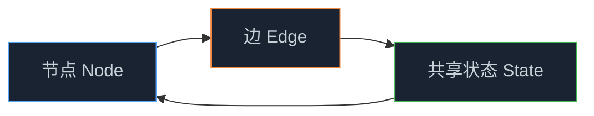
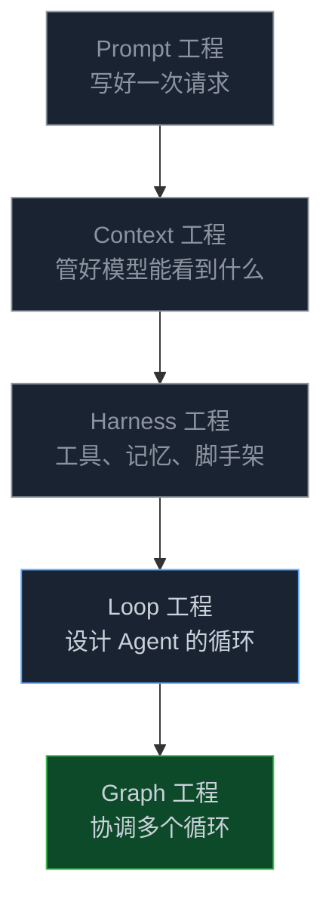
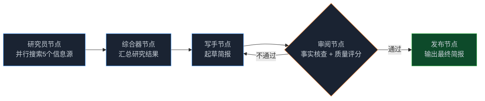

> **🎁 读完这篇你会得到什么**：Graph 工程的本质是什么、它和 Loop 工程的区别在哪、以及这个系列会带你走到哪里。不管你是刚接触 Agent 还是已经在生产环境跑过多 Agent 系统，这篇都值得花 10 分钟读完。

你搭了一个 Agent，能跑，能用，跑一个任务也挺顺。

然后有一天，你想让它做一件稍微复杂点的事——比如"先调研竞品，再写一份分析报告，再让另一个角色挑毛病，不通过就打回去重写"。

你把这些全塞进一个 Agent 的循环里，然后发现它开始乱了。它忘了自己在哪一步，它把调研和写作混在一起，它的"挑毛病"其实是在给自己的输出打分。

这不是模型的问题。是结构的问题。

<!-- more -->

---

## 一个循环撑不住的那一刻

我在研究 AI Agent 开发的时候，发现有一个很有意思的规律：大多数人第一次遇到"Agent 跑乱了"的问题，不是因为 Prompt 写得不好，也不是因为模型不够聪明——而是因为他们把一件本来应该由多个角色协作完成的事，硬塞进了一个角色的循环里。

类比一下。你不会让一个人同时担任项目经理、开发、测试和审查员，然后期望他在一个不间断的工作流里把所有事情都做好。你会把这些职责分开，让不同的人负责，在他们之间传递工作成果。

Agent 也是一样的道理。

当一个任务真的可以拆分成不同的专长、不同的工具集、不同的验证角色时，一个循环就不再是合适的形状了。这时候你需要的，是一张图。

---

## Graph 工程到底是什么

2026 年 7 月中旬，"Graph Engineering"（Graph 工程）这个词突然在开发者社区里火了起来。

起源很朴素——一个叫 Peter Steinberger 的开发者随口问了一句："我们现在还在谈循环，还是已经转向图了？"

然后时间线就炸了。

有人说"回路工程死了，Graph 工程万岁"，有人说"Agent 正在从 while 循环升级成组织架构图"，也有人说"这不就是 LangGraph 换了个名字吗"。

说实话，这些说法都有点道理，也都有点过了。

**Graph 工程的核心，其实就三样东西：**



- **节点（Node）**：干活的单元。可以是一个专门化的 Agent（研究员、写手、审阅者），也可以是一个确定性的步骤（调用 API、处理数据）。每个节点只干一件事。
- **边（Edge）**：节点之间的路由。决定"这个节点完成后，去哪个节点"。可以是顺序的、条件的、扇出的（一个节点同时触发多个）、扇入的（多个节点汇聚成一个）。
- **共享状态（State）**：沿着边流动的数据。是每个节点读取和写入的东西——任务本身、中间结果、笔记、结论。状态是把一堆 Agent 变成一个系统的关键。

一个单一的循环，就是最小的图——一个节点，带一条指回自身的边。所以Graph 工程不是取代循环，而是当你有好几个循环需要互相交接时，你自然会走到的那一层。

---

## 它和 Loop 工程的关系

如果你读过 Agent Loop 系列，这里有一张图能帮你快速定位：



AI 工程的五个层级是累加的，不是替代的。Graph 工程是最外层，也应该是你最后才伸手去拿的那一层。

每一层管的事情不一样，往外走一层，控制圈就扩大一圈：

| 层级 | 管的是什么 | 核心问题 |
|------|-----------|----------|
| Prompt 工程 | 单次对话怎么说 | 这句话够不够清楚？ |
| Context 工程 | 模型能看见什么 | 检索对了吗？记忆压缩合理吗？ |
| Harness 工程 | Agent 的工具和权限沙箱 | 它能用哪些工具？边界在哪里？ |
| Loop 工程 | 单个 Agent 如何自主循环推进 | 它什么时候停？怎么验证自己的输出？ |
| **Graph 工程** | **一群 Agent、工具和程序如何协同** | **谁负责什么？怎么互相监督？** |

注意最后一行的措辞——不只是“协同”，还有“互相监督”。Graph 工程的价值不只是把多个 Agent 接起来，而是让它们能够互相制衡、互相纠错。一个只会自我验证的 Agent 循环，和一个有独立审阅节点监督的图，输出质量差得很远。

**一个很重要的提醒**：图里的每一个节点，都必须是一个已经能独立、可靠交付成果的循环。一堆弱节点拼成的图，只是把注水的产出并行生产出来而已。先把循环做扎实，再谈图。

---

## 什么时候该用图，什么时候不该用

这是最容易被忽视的问题。很多人一听到"Graph 工程"就想把自己的 Agent 全部重构成图，然后发现复杂度翻了三倍，效果没变。

**一个诚实的判断标准**：

| 你的任务是这样的 | 一个循环就够了 | 该考虑用图了 |
|---|---|---|
| 任务形状 | 一件事，有清晰的完成标准 | 可以拆成不同专长的子任务 |
| 并行度 | 步骤是顺序的 | 需要同时做多件事再汇合 |
| 工具/模型 | 全程用同一套 | 每一步需要不同的工具集 |
| 验证方式 | Agent 自己检查自己 | 需要一个独立的审阅角色 |
| 故障处理 | 一个步骤失败重试就行 | 需要隔离故障，不影响其他节点 |

如果你的任务大多数信号都落在左边，先别碰图。一个范围清晰、有好验证者的单一循环，比一张设计过度的图好用得多。

不过有四种情况，是Graph 工程真正能解决、循环解决不了的——

**① 职责分化：单 Agent 容纳不下多角色**

一个 Agent 同时扮演搜集、撰稿、审稿三个角色，它的 Prompt 就会开始混淆——搜集时它在想怎么写，审稿时它在给自己的输出打分。把这三个角色拆成三个独立节点，每个节点只有自己的系统 Prompt 和工具权限，上下文就干净了。

**② 并行与依赖：需要同时处理大量独立任务**

比如批量抓取并分析 50 个竞品的产品页。一个循环只能一个一个跟，一张图可以同时扑出 50 个抓取节点，再由一个汇聚节点把结果并拢。这个“扇出→汇入”的拓扑结构，是循环天生做不到的。

**③ 权限与模型隔离：不同阶段需要不同的能力边界**

审阅节点不应该有写入权限，这是常识。但在一个循环里，你没法强制隔离——同一个 Agent 在不同轮次拥有全部工具。Graph 工程可以给每个节点配置独立的工具集和权限范围，甚至用不同强度的模型——贵的模型用在关键判断，便宜的模型用在批量处理。

**④ 高确定性与可审计：金融、合规、研发流程等高风险场景**

循环的路径是模型自己决定的，不好预测、不好审计。Graph 工程通过显式的节点流转，把每一步的输入输出都固定在可观测的状态里。任何一个节点失败，可以独立重试而不影响其他节点；整个流程可以从断点续跑，而不是从头开始。这对金融风控、合规审批、研发流水线这类对可审计性要求高的场景，是刻刻都需要的。

---

## Graph 工程 vs 多 Agent 流程：别再混着用了

这两个词经常被混用，但它们其实是**不同层次**的东西，搞混了会导致架构设计方向跑偏。

**一句话区别**：多 Agent 流程说的是"有哪些 Agent 在协作"，Graph 工程说的是"这些 Agent 按什么结构协作、状态怎么流转、谁来监督谁"。

用一个比喻说清楚：

- **多 Agent 流程**：像一个开放式的圆桌会议——你叫来了研究员、写手、审阅者，大家都在场，谁发言、发言几次、什么时候结束，由 LLM 自己判断。路径是涌现出来的，不可预测。
- **Graph 工程**：像一条流水线——研究员做完交给写手，写手做完交给审阅者，审阅者不通过打回写手，通过了才能发布。每一个交接点都是确定的，状态沿着边显式流动。

| 维度 | 多 Agent 流程 | Graph 工程 |
|------|-------------|-----------|
| 关注点 | 有多个 Agent 参与 | Agent 之间的拓扑结构和状态管理 |
| 控制流 | LLM 自己决定下一步 | 工程师显式定义（确定性路由 + 条件边） |
| 节点类型 | 只有 Agent | Agent + 确定性函数 + 人工审批 + API 调用 |
| 可审计性 | 弱，路径不固定 | 强，每一步输入输出都在可观测状态里 |
| 典型实现 | AutoGen 群聊模式、早期 CrewAI | LangGraph、Google ADK 图模式 |

**关键区别在于确定性**。多 Agent 流程适合探索性任务，但不可预测、不好调试。Graph 工程的核心价值恰恰是**用确定性的拓扑结构去框住不确定性的 LLM**——你知道流程会走哪条路，你能在任意节点插入审批、回滚、断点续跑。

所以两者的关系是：

```
多 Agent 流程  ⊂  Graph 工程
```

Graph 工程**包含**多 Agent 流程，但不止于此。多 Agent 流程只关心"Agent 之间怎么协作"，Graph 工程还额外管三件事：**显式的控制流、可管理的共享状态、工程级的可观测性**。

---

## 这个系列会带你走到哪里

先放一张路线图：


每篇解决一个核心问题：

| 篇号 | 文章主题 | 核心收获 |
|------|---------|----------|
| 00 | 系列导读：从 while 循环到组织架构图 | 全局视角 + 演进逻辑 + 系列路线图 |
| 01 | 从「单兵独斗」到「军团作战」：为什么要从 Prompt 走向 Graph 工程？ | 理解 Prompt 疲劳的本质 + 状态机思维 + 多 Agent 协同的触发条件 |
| 02 | 解剖 LangGraph 与 AutoGen：Graph 工程的核心解构与选型指南 | Node/Edge/State 设计哲学 + 基于图 vs 基于通信的选型决策 |
| 03 | Graph 工程的"心跳"机制：全局状态流转与高级记忆架构 | 状态不丢失不污染的设计方法 + Reducer 局部状态 + 线程级记忆 |
| 04 | 让可控性拉满：人机协同（HITL）与断点调试在Graph 工程中的落地 | 关键节点插入人工审核 + 动态修改状态 + Time Travel 回溯调试 |
| 05 | 实战演练：从零构建企业级"研报自动协作生成"复杂图 | 并行检索（Fan-out）→ 动态汇总（Fan-in）→ 自我反思循环完整闭环 |
| 06 | Graph 工程在研发流程中的应用：从需求到上线的全链路实战 | 需求分析/代码审查/测试/发布全链路Graph 工程落地 |
| 07 | Graph 工程在业务流程中的应用：客服、审批、内容生产场景实战 | 客服/审批/内容生产等高频业务场景的Graph 工程改造方案 |
| 08 | 中小企业落地 Graph 工程：从 0 到 1 的选型与成本控制 | MVG 原则 + 成本控制三板斧 + 三阶段推进路径 |
| 09 | 电商场景实战：用 Graph 工程搭客服+选品+营销协作系统 | 三张互联图 + 完整代码 + 月 API 成本 800 元的落地方案 |
| 10 | 内容团队实战：用 Graph 工程把内容生产效率提升 3 倍 | 四张图串联 + HITL 写作节点 + 周产量提升 3 倍的实战路径 |

顺序读是最稳的方式。不过如果你已经有 Agent 开发经验，第 00、01 篇可以快速过，从第 02 篇开始深读。如果你只是想解决某个具体问题——比如框架选型、状态管理、或者企业级落地——直接跳到对应篇章也没问题，每篇都能独立阅读。

---

## 一个真实的例子先感受一下

说了这么多概念，来一个具体的。

假设你要搭一个"每天自动产出一份技术简报"的 Agent 系统：

**用一个循环的做法**：一个 Agent，给它一堆工具，让它自己决定先搜什么、再写什么、再怎么检查。结果？它每次跑出来的东西质量参差不齐，有时候搜了一堆没用的，有时候写完了忘了检查事实。

**用图的做法**：



研究员节点同时扇出到五个信息源，综合器把结果汇合，写手起草，审阅节点（用不同的模型、只读权限）给出评分，不通过就打回循环。

每个节点做一件事，做好一件事。整个系统的质量，比一个大而全的 Agent 稳定得多。

这就是Graph 工程的价值所在。

---

## 📝 小结

- 当一个任务可以拆分成不同专长、不同工具集、需要独立验证的子任务时，一个循环就不够用了，这时候需要图
- Graph 工程的三个核心要素：节点（干活的单元）、边（路由）、共享状态（沿边流动的数据）
- AI 工程五层级（Prompt → Context → Harness → Loop → Graph）是累加关系，Graph 工程管的是“一群 Agent 如何协同且互相监督”，是控制圈的最外层
- Graph 工程真正能解决的四种场景：职责分化（多角色隔离）、并行与依赖（扇出/汇入）、权限与模型隔离、高确定性与可审计
- Graph 工程 ⊃ 多 Agent 流程：多 Agent 流程只关心"谁在协作"，Graph 工程还额外管控制流、共享状态和可观测性——核心价值是用确定性的拓扑结构框住不确定性的 LLM
- 大多数任务不需要图，别在不需要的时候硬套；当工作真的逼你出手的时候，再拆
- 这个系列从概念到落地，最终目标是让你能在真实的研发和业务场景中用起来

---

## 🔮 下一篇预告

说了这么多，为什么一个 Agent 跑着跑着就开始"失控"？Prompt 越写越长，效果越来越差，到底是哪里出了问题？

下一篇，我们从一个真实的崩溃案例出发，讲清楚"Prompt 疲劳"的本质，以及Graph 工程是怎么从结构上解决这个问题的。

---

> 📚 **系列导航**
> - **第 00 篇：从 while 循环到组织架构图，Agent 进化的下一步** ⬅️ 你在这里
> - 第 01 篇：从「单兵独斗」到「军团作战」：为什么要从 Prompt 走向 Graph 工程？
> - 第 02 篇：解剖 LangGraph 与 AutoGen：Graph 工程的核心解构与选型指南
> - 第 03 篇：Graph 工程的"心跳"机制：全局状态流转与高级记忆架构
> - 第 04 篇：让可控性拉满：人机协同（HITL）与断点调试在Graph 工程中的落地
> - 第 05 篇：实战演练：从零构建企业级"研报自动协作生成"复杂图
> - 第 06 篇：Graph 工程在研发流程中的应用：从需求到上线的全链路实战
> - 第 07 篇：Graph 工程在业务流程中的应用：客服、审批、内容生产场景实战
> - 第 08 篇：中小企业落地 Graph 工程：从 0 到 1 的选型与成本控制
> - 第 09 篇：电商场景实战：用 Graph 工程搭客服+选品+营销协作系统
> - 第 10 篇：内容团队实战：用 Graph 工程把内容生产效率提升 3 倍
