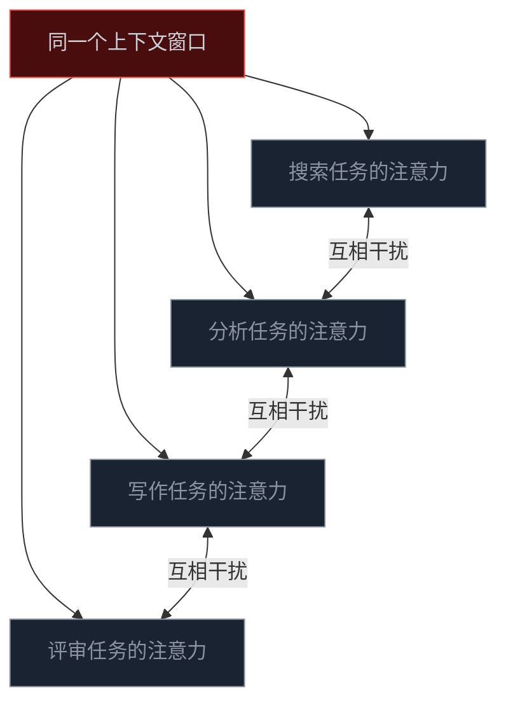
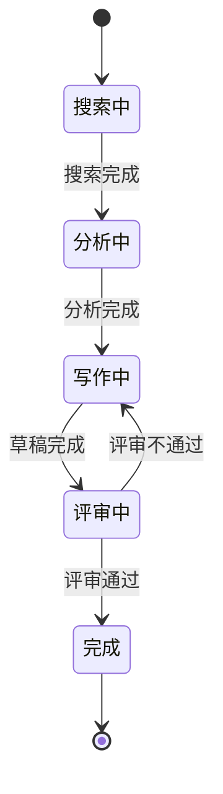
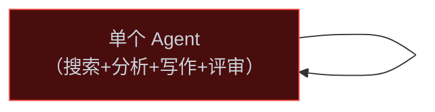
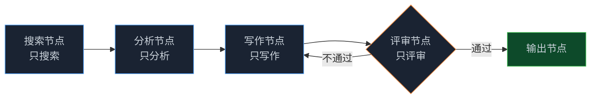
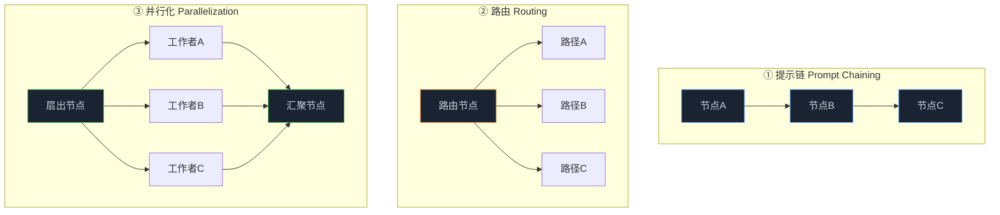

> **🎁 读完这篇你会得到什么**：理解“Prompt 疲劳”的本质，知道单 Agent 在什么情况下会结构性崩溃，以及 Graph 工程是怎么从根上解决这个问题的。
你有没有遇到过这种情况：

给 Agent 一个任务，它前几步跑得挺好，然后突然开始乱——它忘了之前做了什么，它把两件不相干的事混在一起，它给自己的输出打了个高分然后宣布任务完成，但你一看，根本没做完。

你加长 Prompt，它好一点。再加，又乱了。再加，彻底失控。

这不是模型变笨了。是你的架构出了问题。

<!-- more -->

---

## 一个真实的崩溃案例

先说一个我见过的典型场景。

有个团队想做一个"竞品分析 Agent"：给它一个产品名，它自动搜集竞品信息、分析各家的功能差异、写一份结构化报告、最后做一个评分排名。

听起来不复杂，对吧？他们把所有要求塞进一个 Prompt：

```
你是一个竞品分析专家。
任务：
1. 搜索竞品信息
2. 分析功能差异
3. 写结构化报告
4. 做评分排名

要求：
- 搜索要全面，至少覆盖5个竞品
- 分析要客观，不能有主观偏见
- 报告格式要规范，包含摘要、详细分析、结论
- 评分要有依据，不能随意打分
- 最终输出要专业，适合给管理层看
...（还有更多要求）
```

前几次跑，还行。但随着任务复杂度上升，问题开始出现：

- **搜索阶段**：Agent 一边搜索，一边已经在脑子里起草报告了，导致搜索不够深入
- **分析阶段**：它把"客观分析"和"写报告"混在一起，分析结论直接变成了报告段落
- **评分阶段**：它给自己刚写的报告打分，然后说"报告质量很高，任务完成"

最后输出的东西，格式像报告，内容像流水账，评分像自我表扬。

这就是 **Prompt 疲劳**的典型症状。

---

## Prompt 疲劳：不是你写得不好，是结构不对

"Prompt 疲劳"这个词，说的是一个现象：当你把越来越多的要求、角色、任务塞进同一个 Prompt 时，模型的注意力会开始涣散，不同任务之间会互相干扰，最终导致输出质量下降。

但这个词有点误导性——它让人觉得是 Prompt 写得不够好，再优化一下就行了。

实际上，这是一个**结构性问题**，不是措辞问题。

### 为什么会这样？

LLM 的工作方式，本质上是在一个上下文窗口里做预测。它看到所有的历史消息，然后预测下一个 token 应该是什么。

当你把"搜索专家 + 分析专家 + 写作专家 + 评审专家"全部塞进同一个上下文时，会发生什么？



这四种注意力在同一个上下文里互相竞争。搜索时，写作的"偏好"会影响搜索方向；评审时，写作的"自豪感"会影响评分标准。

这不是模型的 bug，这是 Transformer 架构的工作方式——**它没有办法在同一个上下文里完全隔离不同角色的注意力**。

### 上下文污染：更深层的问题

还有一个更隐蔽的问题：**上下文污染**。

随着对话轮次增加，早期的搜索结果、中间的分析草稿、各种工具调用的返回值……全部堆在同一个上下文里。到了评审阶段，模型看到的不是一份干净的报告，而是一锅夹杂着搜索噪音、分析碎片、格式调整记录的“上下文汤”。

它在这锅汤里做评审，能评出什么好结果？

如果你熟悉 attention 机制，这里还有一层更深的解释。研究表明，LLM 对上下文中间位置的信息关注度显著低于开头和结尾（“Lost in the Middle” 现象）。上下文越来越长，早期的关键约束（如“评分要有依据”）会被后来的大量内容稀释，导致模型在生成时实际上已经“忘记”了这些约束。这不是模型变笨了，是结构決定的。
---

## 状态机思维：换一种方式理解 Agent

理解了 Prompt 疲劳的本质，我们来换一种思维方式看 Agent。

大多数人把 Agent 想象成一个"超级助手"——你给它一个任务，它自己想办法完成。这个想象没错，但它遮住了一个更有用的视角：

**Agent 是一个状态机。**

什么是状态机？简单说，就是一个系统在任意时刻都处于某个明确的"状态"，当特定条件满足时，它从一个状态转移到另一个状态。



用状态机的眼光看竞品分析任务：

- **搜索状态**：只做搜索，不想写作的事
- **分析状态**：只做分析，不受搜索噪音干扰
- **写作状态**：只做写作，基于干净的分析结果
- **评审状态**：只做评审，用独立的标准，不受写作情绪影响

每个状态有自己的输入、自己的工具、自己的退出条件。状态之间的转移是明确的，不是模糊的。

这就是 Graph 工程的核心思想：**把一个大而全的 Agent 循环，拆成一张由明确状态和明确转移组成的图**。

---

## 从单兵到军团：Graph 工程解决了什么

现在我们可以说清楚了。

**单兵模式（单 Agent 循环）**：一个 Agent，一个上下文，所有角色、所有工具、所有任务全在里面。



**军团模式（Graph 工程）**：多个专门化的节点，每个节点只干一件事，状态沿着边显式流动。



Graph 工程解决了三个根本问题：

### 问题一：上下文隔离

每个节点有自己独立的上下文窗口。搜索节点看到的是搜索任务和搜索工具，不会被写作偏好污染。评审节点看到的是干净的草稿和评审标准，不会被写作过程中的"自豪感"影响。

节点之间传递的，是**精炼过的结果**，不是原始的上下文汤。

### 问题二：角色专业化

一个只负责搜索的节点，它的 system prompt 可以写得非常专注：

```
你是一个信息搜索专家。
你的唯一任务是：根据给定的关键词，搜索并整理相关信息。
你不需要分析，不需要写报告，不需要评分。
只需要搜索，整理，输出结构化的原始信息。
```

这个 Prompt 比"你是一个竞品分析专家，需要搜索+分析+写报告+评分"要清晰得多。模型在这个窄范围内，表现会更稳定、更专业。

### 问题三：可控的流程

在单 Agent 循环里，你不知道它下一步会干什么。它可能跳过分析直接写报告，可能评审完了又去搜索，可能在某个步骤卡死循环。

在 Graph 工程里，流程是你定义的。评审不通过，就走"打回写作"这条边；评审通过，就走"输出"这条边。每一个转移都是确定的，可以预测，可以调试，可以审计。

---

## 什么时候该从单兵升级到军团？

不是所有任务都需要 Graph 工程。这里有一个简单的判断方法：

**问自己三个问题：**

**① 这个任务，能不能用一句话说清楚它的"完成标准"？**

能 → 大概率一个循环就够了。"帮我总结这篇文章"，完成标准很清楚，一个 Agent 搞定。

不能 → 开始考虑拆分。"帮我做竞品分析"，完成标准模糊，里面藏着多个子任务。

**② 这个任务，有没有需要"独立验证"的步骤？**

有 → 需要独立的评审节点。让写报告的 Agent 自己评审自己的报告，等于让学生自己改自己的试卷。

没有 → 一个循环里自我检查就够了。

**③ 这个任务，有没有可以并行处理的部分？**

有 → 图的扇出/扇入结构能大幅提速。搜索 10 个竞品，串行要 10 倍时间，并行只要 1 倍。

没有 → 顺序执行就行，不需要图的并行能力。

三个问题都是"没有/不能"？先别碰 Graph 工程，一个好的 Agent 循环就够了。有一个以上是"有/不能"？开始考虑拆分。

---

## Anthropic 的数据：军团模式的代价与收益

说了这么多好处，必须说说代价。

Anthropic 在他们的多智能体研究系统里做过一个诚实的披露：

- **质量提升**：多 Agent 图比单一 Agent 基线提升了 **90.2%**（内部研究评测）
- **成本代价**：消耗的 token 大约是单次聊天的 **15 倍**

15 倍的成本，换来 90% 的质量提升——值不值？

这取决于你的场景：

| 场景 | 值不值 |
|------|--------|
| 一次性的简单问答 | 不值，杀鸡用牛刀 |
| 每天自动生成的研究报告 | 值，质量差异直接影响决策 |
| 客服机器人回答常见问题 | 不值，单 Agent 够用 |
| 金融合规审查流程 | 值，错误成本远高于 token 成本 |
| 批量处理低价值内容 | 不值，成本不划算 |
| 需要人工审批的关键决策 | 值，Graph 工程天然支持 HITL |

> 💡 **来源**：[How we built our multi-agent research system — Anthropic](https://www.anthropic.com/engineering/multi-agent-research-system) — 报告显示在内部研究评测中，多智能体方案比单一智能体的 Claude Opus 4 基线高出 90.2%，代价是约 15 倍于一次聊天轮次的 token 消耗

---

## 五种可组合模式：Graph 工程的基本词汇

在正式进入框架选型之前，有必要先认识 Graph 工程的“基本词汇”。

Anthropic 在《Building Effective Agents》里总结了五种可组合的 Agent 模式。把这五种模式当作图去读，你会发现它们其实就是图的五种基本拓扑：


| 模式 | 图的拓扑 | 适用场景 |
|------|---------|---------|
| 提示链（Prompt Chaining） | 线性节点链 | 步骤固定、顺序执行的任务 |
| 路由（Routing） | 条件边分叉 | 根据输入类型分发到不同处理路径 |
| 并行化（Parallelization） | 扇出 + 扇入 | 多个独立子任务可以同时处理 |
| 编排器-工作者（Orchestrator-Workers） | 中心节点 + 多工作者 | 复杂任务需要动态分配给专家 |
| 评估器-优化器（Evaluator-Optimizer） | 带反馈循环的图 | 需要迭代改进直到达到质量标准 |

这五种模式可以自由组合。竞品分析的例子，其实就是“提示链 + 评估器-优化器”的组合：搜索→分析→写作是一条链，写作→评审→打回是一个评估-优化循环。

认识这五种模式，你就有了 Graph 工程的基本词汇。后面遇到任何复杂的 Agent 系统，都可以把它拆解成这五种模式的组合。
---

## 📝 小结

- **Prompt 疲劳的本质**：不是 Prompt 写得不好，是把多个角色、多个任务塞进同一个上下文，导致注意力涣散和上下文污染
- **状态机思维**：把 Agent 看作状态机，每个状态只干一件事，状态之间的转移是明确的——这就是 Graph 工程的核心直觉
- **Graph 工程解决的三个根本问题**：上下文隔离（每个节点独立上下文）、角色专业化（窄范围 Prompt 更稳定）、可控的流程（确定性路由替代模型自由发挥）
- **升级时机的三个判断**：完成标准是否模糊、是否需要独立验证、是否有可并行部分
- **代价与收益要诚实**：Anthropic 的数据是 15 倍 token 换 90% 质量提升，不是所有场景都值这个价
- **五种基本模式**：提示链、路由、并行化、编排器-工作者、评估器-优化器——这是 Graph 工程的基本词汇，所有复杂系统都是它们的组合

---

## 🔮 下一篇预告

知道了为什么要用 Graph 工程，下一个问题是：用什么框架？

LangGraph 和 AutoGen 是目前最主流的两个选择，但它们的设计哲学完全不同——一个要求你显式声明状态和边，一个让 Agent 自己决定怎么协作。

下一篇，我们把这两个框架的底层设计拆开来看，帮你搞清楚什么场景该用哪个。

---

> 📚 **系列导航**
> - 第 00 篇：从 while 循环到组织架构图，Agent 进化的下一步
> - **第 01 篇：从「单兵独斗」到「军团作战」：为什么你的 Agent 越来越失控？** ⬅️ 你在这里
> - 第 02 篇：解剖 LangGraph 与 AutoGen：Graph 工程的核心解构与选型指南
> - 第 03 篇：Graph 工程的"心跳"机制：全局状态流转与高级记忆架构
> - 第 04 篇：让可控性拉满：人机协同（HITL）与断点调试在 Graph 工程中的落地
> - 第 05 篇：实战演练：从零构建企业级"研报自动协作生成"复杂图
> - 第 06 篇：Graph 工程在研发流程中的应用：从需求到上线的全链路实战
> - 第 07 篇：Graph 工程在业务流程中的应用：客服、审批、内容生产场景实战
