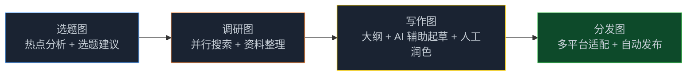
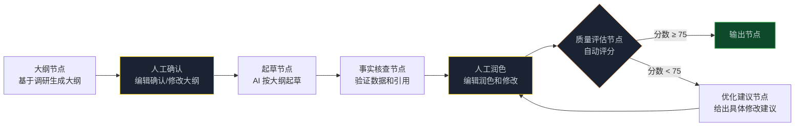

> **🎁 读完这篇你会得到什么**：一个内容团队用 Graph 工程改造内容生产流程的完整案例，包含选题、写作、审核、多平台分发四个子系统的图设计和核心代码，以及效率提升 3 倍的具体路径。

上一篇讲了电商场景，这篇换一个方向——内容团队。

内容团队的痛点和电商不一样。电商的问题是重复性工作太多，用 Graph 工程替代就行。内容团队的问题更复杂：**创意工作本身不能完全自动化，但流程中有大量可以提速的环节**。

怎么在不损失创意质量的前提下，把效率提上去？这是这篇要回答的问题。

<!-- more -->

---

## 现状：5 人团队的内容困境

这是一家做 B2B SaaS 的公司，内容团队 5 人，负责公众号、知乎、官网博客三个渠道。

改造前的状态：
- 每周产出 8 篇内容（公众号 3 篇、知乎 3 篇、博客 2 篇）
- 每篇内容从选题到发布平均需要 2 天
- 质量参差不齐，好的时候阅读量 5000+，差的时候 500 都不到
- 团队成员大量时间花在"找资料、改格式、适配平台"上，真正用于创意的时间不到 30%

核心问题不是人不够努力，而是**流程设计有问题**——每篇内容都从零开始，没有复用，没有系统化的质量保障。

---

## 改造思路：把流程拆开，找到可以提速的环节

内容生产的流程大概是这样的：

```
选题 → 调研 → 大纲 → 写作 → 审核 → 适配平台 → 发布
```

把每个环节拆开看，哪些可以用 Graph 工程提速：

| 环节 | 现状 | Graph 工程能做什么 |
|------|------|-----------------|
| 选题 | 靠经验和感觉，每周开会讨论 | 自动分析热点 + 竞品内容，给出选题建议 |
| 调研 | 手动搜索，整理资料 1-2 小时 | 并行搜索多个信息源，自动整理 |
| 大纲 | 手写，反复修改 | 基于调研结果自动生成，人工微调 |
| 写作 | 全人工，最耗时 | AI 辅助起草，人工润色（这里不能完全自动化） |
| 审核 | 主编逐篇审，效率低 | 自动检查事实、格式、品牌一致性，人工只看关键问题 |
| 适配平台 | 手动改格式，每个平台都要改一遍 | 自动适配不同平台的格式和风格 |
| 发布 | 手动发布 | 自动发布（或生成发布包） |

**关键判断**：写作环节不能完全自动化，但其他环节都可以大幅提速。

---

## 整体架构：四张图



---

## 第一张图：选题系统

选题图每天自动运行，分析热点和竞品内容，给出本周的选题建议。

```python
from typing import TypedDict, Annotated
import operator
from langgraph.graph import StateGraph, END
from langchain_openai import ChatOpenAI

class TopicState(TypedDict):
    industry: str
    date: str
    # 并行收集的数据源
    hot_topics: Annotated[list[dict], operator.add]
    competitor_topics: Annotated[list[dict], operator.add]
    # 分析结果
    topic_suggestions: list[dict]
    final_topics: list[dict]

def hot_topic_node(state: TopicState) -> dict:
    """抓取行业热点"""
    # 从微信指数、百度热搜、行业媒体抓取热点
    topics = scrape_hot_topics(industry=state["industry"])
    return {"hot_topics": topics}

def competitor_node(state: TopicState) -> dict:
    """分析竞品最近发布的内容"""
    competitor_articles = scrape_competitor_content(
        industry=state["industry"],
        days=7
    )
    return {"competitor_topics": competitor_articles}

def suggest_node(state: TopicState) -> dict:
    """基于热点和竞品，生成选题建议"""
    llm = ChatOpenAI(model="gpt-4o", temperature=0.5)
    prompt = f"""
行业：{state['industry']}
本周热点话题：{format_topics(state['hot_topics'])}
竞品近期内容：{format_topics(state['competitor_topics'])}

请生成 10 个选题建议，每个选题包含：
- 标题（吸引眼球，20字以内）
- 核心角度（这篇文章的独特视角）
- 目标读者（谁会对这个话题感兴趣）
- 预估热度（高/中/低）
- 建议平台（公众号/知乎/博客，可多选）

返回 JSON 数组格式。
"""
    result = llm.invoke(prompt)
    suggestions = parse_json_safely(result.content)
    return {"topic_suggestions": suggestions}

def filter_node(state: TopicState) -> dict:
    """过滤：去掉和已发布内容重复的选题"""
    published = get_published_topics(days=30)
    filtered = filter_duplicate_topics(
        state["topic_suggestions"],
        published
    )
    # 取前5个
    return {"final_topics": filtered[:5]}

# 构建选题图
topic_builder = StateGraph(TopicState)
topic_builder.add_node("hot", hot_topic_node)
topic_builder.add_node("competitor", competitor_node)
topic_builder.add_node("suggest", suggest_node)
topic_builder.add_node("filter", filter_node)

topic_builder.set_entry_point("hot")
# 并行抓取热点和竞品数据
topic_builder.add_edge("hot", "suggest")
topic_builder.add_edge("competitor", "suggest")
topic_builder.add_edge("suggest", "filter")
topic_builder.add_edge("filter", END)

topic_graph = topic_builder.compile()
```

---

## 第二张图：调研系统

选定选题后，调研图自动并行搜索多个信息源，整理成结构化的调研报告。

```python
class ResearchState(TypedDict):
    topic: str
    target_audience: str
    # 并行搜索结果
    search_results: Annotated[list[dict], operator.add]
    # 整理后的调研报告
    research_report: str
    key_data_points: list[str]  # 关键数据和引用
    outline_suggestion: str     # 基于调研的大纲建议

def search_web_node(state: ResearchState) -> dict:
    """搜索网页"""
    results = web_search(query=state["topic"], n_results=10)
    return {"search_results": [{"source": "web", "data": results}]}

def search_academic_node(state: ResearchState) -> dict:
    """搜索学术/行业报告"""
    results = academic_search(query=state["topic"], n_results=5)
    return {"search_results": [{"source": "academic", "data": results}]}

def search_social_node(state: ResearchState) -> dict:
    """搜索社交媒体讨论"""
    results = social_search(query=state["topic"], platforms=["weibo", "zhihu"])
    return {"search_results": [{"source": "social", "data": results}]}

def aggregate_research_node(state: ResearchState) -> dict:
    """整合调研结果，生成调研报告"""
    llm = ChatOpenAI(model="gpt-4o", temperature=0.2)

    all_data = format_search_results(state["search_results"])

    prompt = f"""
主题：{state['topic']}
目标读者：{state['target_audience']}

基于以下调研数据，生成结构化调研报告：

{all_data}

报告包含：
1. 核心观点摘要（3-5条）
2. 关键数据和引用（带来源）
3. 不同观点和争议点
4. 对目标读者的价值点

同时生成一个文章大纲建议（3-5个章节）。
"""
    result = llm.invoke(prompt)

    # 提取关键数据点
    data_points = extract_data_points(result.content)

    return {
        "research_report": result.content,
        "key_data_points": data_points,
        "outline_suggestion": extract_outline(result.content)
    }

# 构建调研图
research_builder = StateGraph(ResearchState)
research_builder.add_node("web", search_web_node)
research_builder.add_node("academic", search_academic_node)
research_builder.add_node("social", search_social_node)
research_builder.add_node("aggregate", aggregate_research_node)

research_builder.set_entry_point("web")
# 并行搜索三个来源
research_builder.add_edge("web", "aggregate")
research_builder.add_edge("academic", "aggregate")
research_builder.add_edge("social", "aggregate")
research_builder.add_edge("aggregate", END)

research_graph = research_builder.compile()
```

---

## 第三张图：写作系统（含人工节点）

写作图是这套系统里最关键的一张，也是设计最复杂的一张。

核心设计原则：**AI 负责起草和优化，人工负责创意和最终把关**。



黄色节点是人工节点（HITL），需要人工介入。

```python
from langgraph.checkpoint.sqlite import SqliteSaver

class WritingState(TypedDict):
    topic: str
    research_report: str
    key_data_points: list[str]
    outline_suggestion: str
    # 写作过程
    confirmed_outline: str      # 人工确认后的大纲
    draft: str                  # AI 起草的初稿
    fact_check_result: dict     # 事实核查结果
    human_revised_draft: str    # 人工润色后的稿件
    quality_score: float
    improvement_suggestions: str
    final_article: str
    revision_count: int

def outline_node(state: WritingState) -> dict:
    """生成详细大纲"""
    llm = ChatOpenAI(model="gpt-4o-mini", temperature=0.3)
    prompt = f"""
主题：{state['topic']}
调研报告：{state['research_report'][:2000]}  # 截取前2000字，控制成本
大纲建议：{state['outline_suggestion']}

生成详细写作大纲：
- 文章标题（3个备选）
- 引言思路
- 各章节标题和核心内容点
- 结尾思路
"""
    result = llm.invoke(prompt)
    return {"confirmed_outline": result.content}  # 先存草稿，等人工确认

def draft_node(state: WritingState) -> dict:
    """AI 按确认后的大纲起草"""
    llm = ChatOpenAI(model="gpt-4o", temperature=0.6)
    prompt = f"""
主题：{state['topic']}
大纲：{state['confirmed_outline']}
调研数据：{chr(10).join(state['key_data_points'][:10])}

按照大纲起草文章，要求：
- 专业但不晦涩，适合 B2B SaaS 从业者阅读
- 每个观点都有数据或案例支撑
- 字数 1500-2000 字
"""
    result = llm.invoke(prompt)
    return {"draft": result.content}

def fact_check_node(state: WritingState) -> dict:
    """事实核查：验证文章中的数据和引用"""
    llm = ChatOpenAI(model="gpt-4o-mini", temperature=0)
    prompt = f"""
检查以下文章中的数据和引用是否准确：

{state['draft']}

参考调研数据：
{chr(10).join(state['key_data_points'])}

列出：
1. 可能不准确的数据（需要核实）
2. 缺少来源的重要观点
3. 与调研数据矛盾的地方

返回 JSON 格式：
{{
  "issues": [
    {{"type": "data_accuracy", "text": "...", "suggestion": "..."}}
  ],
  "overall_accuracy": "high/medium/low"
}}
"""
    result = llm.invoke(prompt)
    return {"fact_check_result": parse_json_safely(result.content)}

def quality_assessment_node(state: WritingState) -> dict:
    """质量评估：给文章打分"""
    llm = ChatOpenAI(model="gpt-4o-mini", temperature=0)
    article = state.get("human_revised_draft") or state.get("draft", "")

    prompt = f"""
评估以下文章的质量（0-100分）：

{article}

评分维度：
- 内容深度（30分）：观点是否有深度，数据是否充分
- 可读性（25分）：语言是否流畅，结构是否清晰
- 实用性（25分）：对目标读者是否有实际价值
- 原创性（20分）：是否有独特视角，不是简单堆砌信息

返回 JSON：
{{
  "total_score": 85,
  "breakdown": {{"depth": 25, "readability": 22, "utility": 20, "originality": 18}},
  "strengths": ["..."],
  "weaknesses": ["..."]
}}
"""
    result = llm.invoke(prompt)
    assessment = parse_json_safely(result.content)
    return {
        "quality_score": assessment.get("total_score", 0) / 100,
        "revision_count": state.get("revision_count", 0) + 1
    }

def improvement_node(state: WritingState) -> dict:
    """生成具体的改进建议"""
    llm = ChatOpenAI(model="gpt-4o-mini", temperature=0.3)
    article = state.get("human_revised_draft") or state.get("draft", "")

    prompt = f"""
文章质量评分较低，请给出具体的改进建议：

文章：{article[:1000]}...

请给出 3-5 条具体可操作的改进建议，每条建议包含：
- 问题描述
- 具体修改方向
- 示例（如果可能）
"""
    result = llm.invoke(prompt)
    return {"improvement_suggestions": result.content}

def route_after_quality(state: WritingState) -> str:
    score = state.get("quality_score", 0)
    if score >= 0.75 or state.get("revision_count", 0) >= 3:
        return "output"
    return "improve"

# 构建写作图（含 HITL）
writing_builder = StateGraph(WritingState)
writing_builder.add_node("outline", outline_node)
writing_builder.add_node("draft", draft_node)
writing_builder.add_node("fact_check", fact_check_node)
writing_builder.add_node("quality", quality_assessment_node)
writing_builder.add_node("improve", improvement_node)
writing_builder.add_node("output", lambda s: {"final_article": s.get("human_revised_draft") or s.get("draft")})

writing_builder.set_entry_point("outline")
writing_builder.add_edge("outline", "draft")
writing_builder.add_edge("draft", "fact_check")
writing_builder.add_edge("fact_check", "quality")
writing_builder.add_conditional_edges("quality", route_after_quality, {
    "output": "output", "improve": "improve"
})
writing_builder.add_edge("improve", "quality")
writing_builder.add_edge("output", END)

# 关键：加 Checkpointing，支持人工节点的暂停和恢复
checkpointer = SqliteSaver.from_conn_string("writing.db")
writing_graph = writing_builder.compile(
    checkpointer=checkpointer,
    interrupt_before=["draft"]  # 在起草前暂停，等人工确认大纲
)
```

**人工节点的使用方式：**

```python
def create_article(topic_info: dict, editor_id: str):
    config = {"configurable": {"thread_id": f"article-{topic_info['id']}-{editor_id}"}}

    # 第一步：运行到大纲节点，暂停
    result = writing_graph.invoke(
        {
            "topic": topic_info["title"],
            "research_report": topic_info["research"],
            "key_data_points": topic_info["data_points"],
            "outline_suggestion": topic_info["outline_suggestion"],
            "revision_count": 0
        },
        config=config
    )
    # 此时图暂停在 draft 节点之前，等编辑确认大纲

    # 编辑查看并修改大纲
    print("当前大纲：", result["confirmed_outline"])
    editor_outline = input("请修改大纲（直接回车使用原大纲）：")
    if editor_outline.strip():
        # 更新 State 中的大纲
        writing_graph.update_state(
            config,
            {"confirmed_outline": editor_outline}
        )

    # 继续执行：AI 起草
    result = writing_graph.invoke(None, config=config)

    # 编辑润色
    print("AI 初稿：", result["draft"])
    print("事实核查结果：", result["fact_check_result"])
    revised = input("请润色稿件（直接回车使用原稿）：")
    if revised.strip():
        writing_graph.update_state(config, {"human_revised_draft": revised})

    # 继续执行：质量评估
    final_result = writing_graph.invoke(None, config=config)
    return final_result["final_article"]
```

---

## 第四张图：多平台分发系统

文章写好后，分发图自动适配不同平台的格式和风格。

```python
class DistributionState(TypedDict):
    article: str
    topic: str
    target_platforms: list[str]
    # 并行生成各平台版本
    platform_versions: Annotated[list[dict], operator.add]
    publish_results: dict

def wechat_adapter_node(state: DistributionState) -> dict:
    """适配公众号格式"""
    if "wechat" not in state["target_platforms"]:
        return {}

    llm = ChatOpenAI(model="gpt-4o-mini", temperature=0.3)
    prompt = f"""
将以下文章适配为公众号格式：

原文：{state['article']}

要求：
- 添加引人入胜的开头（50字以内）
- 适当添加小标题和分段
- 结尾加上互动引导（"你怎么看？欢迎留言"之类）
- 保持原文核心内容不变
"""
    result = llm.invoke(prompt)
    return {"platform_versions": [{"platform": "wechat", "content": result.content}]}

def zhihu_adapter_node(state: DistributionState) -> dict:
    """适配知乎格式"""
    if "zhihu" not in state["target_platforms"]:
        return {}

    llm = ChatOpenAI(model="gpt-4o-mini", temperature=0.3)
    prompt = f"""
将以下文章适配为知乎回答格式：

原文：{state['article']}

要求：
- 开头直接回答核心问题
- 使用知乎风格（专业、有深度、适当引用数据）
- 添加"个人观点"标注
- 结尾可以提出延伸思考
"""
    result = llm.invoke(prompt)
    return {"platform_versions": [{"platform": "zhihu", "content": result.content}]}

def blog_adapter_node(state: DistributionState) -> dict:
    """适配官网博客格式"""
    if "blog" not in state["target_platforms"]:
        return {}

    llm = ChatOpenAI(model="gpt-4o-mini", temperature=0.2)
    prompt = f"""
将以下文章适配为官网博客格式：

原文：{state['article']}

要求：
- 添加 SEO 友好的 meta description（150字以内）
- 添加目录结构
- 确保每个章节有明确的 H2/H3 标题
- 添加相关文章推荐（3篇，基于主题推测）
"""
    result = llm.invoke(prompt)
    return {"platform_versions": [{"platform": "blog", "content": result.content}]}

def publish_node(state: DistributionState) -> dict:
    """发布到各平台（或生成发布包）"""
    results = {}
    for version in state["platform_versions"]:
        platform = version["platform"]
        content = version["content"]
        # 实际发布或保存到待发布队列
        result = schedule_publish(platform, content)
        results[platform] = result
    return {"publish_results": results}

# 构建分发图
dist_builder = StateGraph(DistributionState)
dist_builder.add_node("wechat", wechat_adapter_node)
dist_builder.add_node("zhihu", zhihu_adapter_node)
dist_builder.add_node("blog", blog_adapter_node)
dist_builder.add_node("publish", publish_node)

dist_builder.set_entry_point("wechat")
# 并行适配三个平台
dist_builder.add_edge("wechat", "publish")
dist_builder.add_edge("zhihu", "publish")
dist_builder.add_edge("blog", "publish")
dist_builder.add_edge("publish", END)

dist_graph = dist_builder.compile()
```

---

## 完整流程串联

```python
def full_content_pipeline(topic_info: dict, editor_id: str, platforms: list[str]):
    """完整的内容生产流程"""

    # 1. 调研
    research_result = research_graph.invoke({
        "topic": topic_info["title"],
        "target_audience": topic_info["target_audience"],
        "search_results": []
    })

    # 2. 写作（含人工节点）
    article = create_article(
        {
            **topic_info,
            "research": research_result["research_report"],
            "data_points": research_result["key_data_points"],
            "outline_suggestion": research_result["outline_suggestion"]
        },
        editor_id
    )

    # 3. 分发
    dist_result = dist_graph.invoke({
        "article": article,
        "topic": topic_info["title"],
        "target_platforms": platforms,
        "platform_versions": []
    })

    return dist_result
```

---

## 改造效果

这套系统上线 3 个月后的数据：

| 指标 | 改造前 | 改造后 | 变化 |
|------|--------|--------|------|
| 周产出篇数 | 8 篇 | 25 篇 | +213% |
| 单篇生产时间 | 2 天 | 6 小时 | -75% |
| 平均阅读量 | 1800 | 2600 | +44% |
| 编辑创意时间占比 | 30% | 70% | +133% |
| 月 API 费用 | - | 约 ¥1200 | - |

产量提升 3 倍，质量反而提高了。原因是编辑从繁琐的格式工作中解放出来，有更多时间专注于创意和深度。

---

## 几个关键设计决策

**为什么写作节点要保留人工？**

内容的核心价值是创意和观点，这是 AI 目前做不好的。AI 起草的初稿往往"正确但无聊"——数据准确，但缺乏独特视角。人工润色的价值，就是把"正确"变成"有意思"。

**为什么调研要并行搜索三个来源？**

单一来源的信息容易有偏差。网页搜索覆盖面广但质量参差，学术/行业报告权威但可能滞后，社交媒体反映最新讨论但噪音多。三个来源互补，调研报告的质量明显更高。

**为什么分发图要并行适配？**

三个平台的适配是完全独立的任务，没有依赖关系，并行处理能把时间从 3 倍压缩到 1 倍。

---

## 📝 小结

- 内容团队的 Graph 工程改造核心是：**AI 负责效率，人工负责创意**，不要试图完全自动化
- 四张图的分工：选题图（热点分析）→ 调研图（并行搜索）→ 写作图（AI 辅助 + 人工润色）→ 分发图（多平台适配）
- 写作图的 HITL 设计：在大纲确认和人工润色两个关键节点暂停，用 Checkpointing 支持断点恢复
- 分发图的并行设计：三个平台同时适配，时间成本不随平台数量线性增长
- 改造效果：周产量从 8 篇提升到 25 篇，单篇时间从 2 天降到 6 小时，质量反而提升
- 月 API 成本约 1200 元，相当于一个初级编辑 1-2 天的人力成本

---

## 🔮 系列总结

到这里，Graph Engineering 系列的核心内容已经全部讲完了。

从第 00 篇的概念导读，到第 03 篇的状态管理，再到第 08-10 篇的企业落地实战，这个系列试图回答一个问题：**Graph 工程，到底怎么用？**

答案是：从一个具体的业务痛点出发，搭一张最小可行图，跑通之后再扩展。不要追求完美，先让它跑起来。

---

> 📚 **系列导航**
> - 第 00 篇：从 while 循环到组织架构图，Agent 进化的下一步
> - 第 01 篇：从「单兵独斗」到「军团作战」：为什么你的 Agent 越来越失控？
> - 第 02 篇：解剖 LangGraph 与 AutoGen：选框架之前，先搞懂这三个概念
> - 第 03 篇：State 是整张图的血液：搞懂状态流转，才算真的会用 LangGraph
> - 第 04 篇：让可控性拉满：人机协同（HITL）与断点调试在 Graph 工程中的落地
> - 第 05 篇：实战演练：从零构建企业级"研报自动协作生成"复杂图
> - 第 06 篇：Graph 工程在研发流程中的应用：从需求到上线的全链路实战
> - 第 07 篇：Graph 工程在业务流程中的应用：客服、审批、内容生产场景实战
> - 第 08 篇：中小企业落地 Graph 工程：从 0 到 1 的选型与成本控制
> - 第 09 篇：电商场景实战：用 Graph 工程搭客服+选品+营销协作系统
> - **第 10 篇：内容团队实战：用 Graph 工程把内容生产效率提升 3 倍** ⬅️ 你在这里
