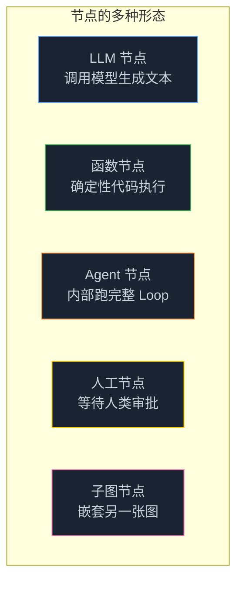
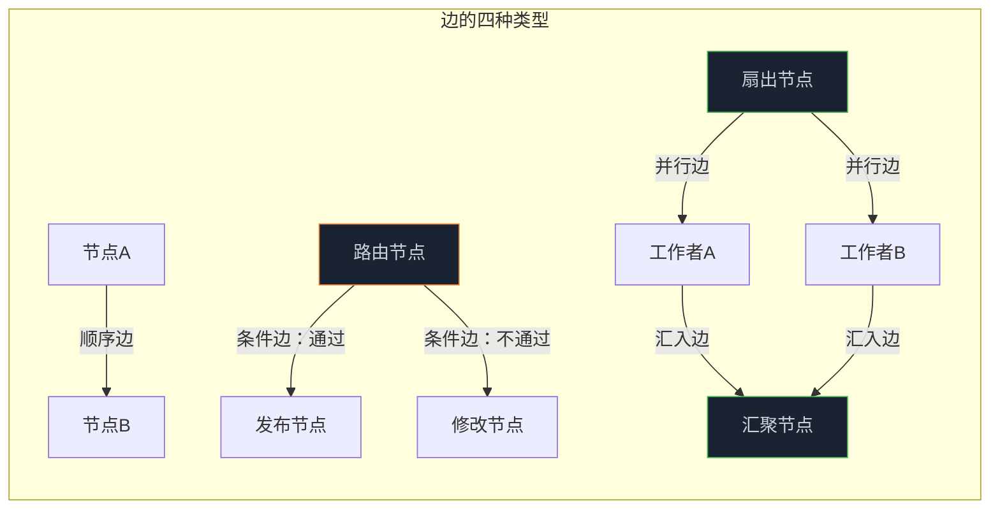
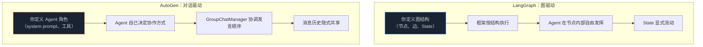

> **🎁 读完这篇你会得到什么**：彼彻搞清楚 Node/Edge/State 三个核心概念，理解 LangGraph 和 AutoGen 的设计哲学差异，并能根据自己的场景做出合理的框架选择。

上一篇讲了为什么要从单 Agent 升级到 Graph 工程。

这篇要回答下一个问题：**用什么框架？**

市面上的选择不少——LangGraph、AutoGen、Google ADK、CrewAI……但大多数人选框架的方式是"看哪个 Star 多"或者"看哪个教程多"。这两个标准都不靠谱。

选框架之前，你得先搞清楚这三个概念：**Node、Edge、State**。

这三个概念是 Graph 工程的基石。不同框架对它们的实现方式，决定了你用起来的感受——以及你踩的坑。

<!-- more -->

---

## 先把三个概念搞清楚

很多人上来就看框架文档，结果越看越懵。原因是框架文档假设你已经理解了底层概念，直接讲 API。

我们反过来——先把概念搞透，再看框架就顺了。

### Node：不只是"一个 Agent"

Node（节点）是图里干活的单元。

很多人一听到"节点"就想到"一个 Agent"，但这个理解太窄了。节点可以是：

- **一个 LLM 调用**：给模型发一个 Prompt，拿回一个响应
- **一个确定性函数**：格式化数据、调用 API、写文件——不涉及 LLM
- **一个完整的 Agent 循环**：一个节点内部可以跑一个完整的 Agent Loop
- **一个人工审批步骤**：暂停执行，等人类点确认
- **一个子图**：把另一张完整的图当作一个节点嵌进来



**好节点的三个特征**：

1. **职责单一**：只干一件事，Prompt 窄，工具集小
2. **输入输出清晰**：知道自己从 State 里读什么，往 State 里写什么
3. **可独立测试**：给它一个输入，能验证输出是否符合预期

这里有个实践中最难拿捉的分寸问题。粒度太粗，节点内部又变成了一个“大而全的 Agent”，Prompt 疲劳问题没解决；粒度太细，节点数量爆炸，状态传递开销变大，调试复杂度指数级上升。经验法则：一个节点的 system prompt 应该能用一句话说清楚它的职责。
### Edge：不只是"连线"

Edge（边）是节点之间的路由规则。

最简单的边是直线——A 完成后去 B。但 Graph 工程里的边远不止这些：



| 边的类型 | 触发条件 | 典型用途 |
|---------|---------|---------|
| 顺序边 | 上一个节点完成 | 固定流程的步骤衔接 |
| 条件边 | 根据 State 里的值判断 | 评审通过/不通过的分叉 |
| 并行边（扇出） | 同时触发多个节点 | 批量处理、并行搜索 |
| 汇入边（扇入） | 等待多个节点都完成 | 合并并行结果 |
| 循环边 | 条件不满足时回退 | 迭代优化、重试机制 |

**边的设计原则**：

- **能用确定性边就别用 LLM 决策**：如果路由逻辑可以用代码写清楚（`if score > 80: publish else: revise`），就不要让 LLM 来决定走哪条边——LLM 决策不稳定，代码决策可预测
- **循环边要有退出条件**：每条循环边都必须有一个明确的退出条件，否则图会死循环

### State：整张图的"血液"

State（共享状态）是沿着边在节点之间流动的数据对象。

这是三个概念里最容易被忽视、也最容易出问题的一个。

State 不是简单的"把上一个节点的输出传给下一个节点"。它是整张图的**全局记忆**——每个节点都可以读取它，也可以写入它。

```python
# LangGraph 里的 State 定义示例
from typing import TypedDict, Annotated
from langgraph.graph import add_messages

class ResearchState(TypedDict):
    # 任务输入
    topic: str
    # 搜索结果（列表，每个节点可以追加）
    search_results: Annotated[list, add_messages]
    # 分析结论
    analysis: str
    # 草稿
    draft: str
    # 评审分数
    review_score: int
    # 评审意见
    review_feedback: str
    # 最终输出
    final_output: str
```

**State 设计的三个关键问题**：

**① 谁能写入 State？**

不是所有节点都应该能写入所有字段。搜索节点只应该写 `search_results`，不应该碰 `draft`。评审节点只应该写 `review_score` 和 `review_feedback`，不应该改 `analysis`。

**② 写入方式是覆盖还是追加？**

上面代码里的 `Annotated[list, add_messages]` 是 LangGraph 的 Reducer 机制——它告诉框架，当多个节点都往 `search_results` 写入时，是追加（append）而不是覆盖（overwrite）。

这个细节很重要。如果三个并行的搜索节点都往同一个字段写，覆盖模式会导致只保留最后一个节点的结果；追加模式才能把三个结果都保留下来。

**③ State 的生命周期是什么？**

State 从图开始执行时创建，随着节点执行不断更新，在图执行完成时返回最终状态。如果图支持持久化（LangGraph 的 Checkpointing），State 还可以在图暂停后恢复。

这里顺带说一个分布式系统的典型问题。State 的设计本质上是共享内存的并发写入问题。LangGraph 用 Reducer 函数解决并发写入冲突，类似于 Redux 里的 reducer 概念。对于需要强一致性的场景（如金融流程），需要特别注意节点并发写入同一字段时的合并策略。

---

## LangGraph：把图的结构写进代码

理解了三个核心概念，现在来看 LangGraph 是怎么实现它们的。

LangGraph 的核心理念是：**把图的拓扑结构显式地写进代码**。你声明节点，你声明边，你声明 State 的结构——框架负责按照你声明的结构执行。

### 一个完整的 LangGraph 示例

用竞品分析的例子，看看 LangGraph 的代码长什么样：

```python
from langgraph.graph import StateGraph, END
from typing import TypedDict, Annotated
import operator

# 1. 定义 State
class AnalysisState(TypedDict):
    topic: str
    search_results: Annotated[list[str], operator.add]  # 追加模式
    analysis: str
    draft: str
    review_score: int
    review_feedback: str

# 2. 定义节点函数（每个函数接收 State，返回更新的字段）
def search_node(state: AnalysisState) -> dict:
    """搜索节点：只负责搜索"""
    topic = state["topic"]
    # 调用搜索工具...
    results = search_web(topic)
    return {"search_results": results}  # 只更新 search_results

def analysis_node(state: AnalysisState) -> dict:
    """分析节点：只负责分析"""
    results = state["search_results"]
    analysis = llm.invoke(f"分析以下搜索结果：{results}")
    return {"analysis": analysis.content}

def write_node(state: AnalysisState) -> dict:
    """写作节点：只负责起草"""
    analysis = state["analysis"]
    draft = llm.invoke(f"根据分析结果写报告：{analysis}")
    return {"draft": draft.content}

def review_node(state: AnalysisState) -> dict:
    """评审节点：只负责评审"""
    draft = state["draft"]
    result = llm.invoke(f"评审以下报告，给出0-100分和修改意见：{draft}")
    # 解析评分和意见...
    return {"review_score": score, "review_feedback": feedback}

# 3. 定义条件边的路由函数
def should_revise(state: AnalysisState) -> str:
    """根据评审分数决定走哪条边"""
    if state["review_score"] >= 80:
        return "publish"   # 分数够了，发布
    return "revise"        # 分数不够，打回修改

# 4. 构建图
graph = StateGraph(AnalysisState)

# 添加节点
graph.add_node("search", search_node)
graph.add_node("analysis", analysis_node)
graph.add_node("write", write_node)
graph.add_node("review", review_node)

# 添加边
graph.set_entry_point("search")           # 入口
graph.add_edge("search", "analysis")      # 顺序边
graph.add_edge("analysis", "write")       # 顺序边
graph.add_conditional_edges(              # 条件边
    "review",
    should_revise,
    {"publish": END, "revise": "write"}   # 路由映射
)
graph.add_edge("write", "review")         # 顺序边

# 5. 编译并运行
app = graph.compile()
result = app.invoke({"topic": "AI 代码助手市场分析"})
```

注意几个关键设计：

- **节点函数只返回它要更新的字段**，不需要返回完整的 State——LangGraph 会自动合并
- **条件边的路由函数返回字符串**，字符串映射到下一个节点名——这让路由逻辑和图结构分离
- **`operator.add` 是 Reducer**，告诉框架 `search_results` 字段用追加而不是覆盖

### LangGraph 的核心优势

**① 结构可视化**

因为图的结构是显式声明的，LangGraph 可以直接把它画出来：

```python
# 生成图的可视化
from IPython.display import Image
Image(app.get_graph().draw_mermaid_png())
```

你能看到整张图长什么样，哪些节点、哪些边、哪些条件分叉——这对调试和团队沟通非常有价值。

**② Checkpointing：断点续跑**

LangGraph 内置了持久化机制。图执行到任意节点时，都可以把当前 State 存到数据库，之后从这个断点恢复执行：

```python
from langgraph.checkpoint.sqlite import SqliteSaver

# 用 SQLite 存储检查点
checkpointer = SqliteSaver.from_conn_string(":memory:")
app = graph.compile(checkpointer=checkpointer)

# 执行时传入 thread_id，相同 thread_id 的执行会共享状态
config = {"configurable": {"thread_id": "analysis-001"}}
result = app.invoke({"topic": "..."}, config=config)

# 之后可以从断点恢复
result = app.invoke(None, config=config)  # 从上次停止的地方继续
```

这对长时间运行的任务非常重要——用户关了浏览器，任务不会丢失。

**③ Human-in-the-Loop（HITL）**

LangGraph 支持在任意节点暂停，等待人类输入后再继续：

```python
# 在 review 节点之后插入人工审批
app = graph.compile(
    checkpointer=checkpointer,
    interrupt_before=["publish"]  # 发布前暂停，等人类确认
)

# 执行到 publish 节点前会暂停
result = app.invoke({"topic": "..."}, config=config)
# result 此时是中间状态

# 人类审查后，继续执行
result = app.invoke(None, config=config)
```

这是 Graph 工程里"可控性"的核心体现——你能在任意关键节点插入人工判断，而不是让 Agent 一路跑到底。

### LangGraph 的局限

LangGraph 不是没有缺点：

- **学习曲线陡**：State 的 Reducer 机制、Checkpointing 配置、条件边的写法……概念多，上手需要时间
- **灵活性受限**：图的结构在编译时就确定了，运行时动态改变图结构比较麻烦
- **调试复杂**：多节点的状态流转，出了问题不好定位

---

## AutoGen：让 Agent 自己决定怎么协作

AutoGen 的设计哲学和 LangGraph 完全不同。

LangGraph 说：**你来定义图的结构，Agent 在节点内部自由发挥。**

AutoGen 说：**你来定义 Agent 的角色和能力，让它们自己决定怎么协作。**

### AutoGen 的群聊模式

AutoGen 最经典的模式是 GroupChat——你创建一群 Agent，给它们各自的角色，然后让它们"开会"：

```python
import autogen

# 定义 Agent
researcher = autogen.AssistantAgent(
    name="Researcher",
    system_message="你是一个信息搜索专家，负责搜集竞品信息。",
    llm_config={"model": "gpt-4o"}
)

analyst = autogen.AssistantAgent(
    name="Analyst",
    system_message="你是一个市场分析专家，负责分析竞品数据。",
    llm_config={"model": "gpt-4o"}
)

writer = autogen.AssistantAgent(
    name="Writer",
    system_message="你是一个报告写作专家，负责撰写分析报告。",
    llm_config={"model": "gpt-4o"}
)

reviewer = autogen.AssistantAgent(
    name="Reviewer",
    system_message="你是一个严格的审阅者，负责评审报告质量。",
    llm_config={"model": "gpt-4o"}
)

user_proxy = autogen.UserProxyAgent(
    name="User",
    human_input_mode="NEVER",  # 不需要人工输入
    code_execution_config={"work_dir": "workspace"}
)

# 创建群聊
groupchat = autogen.GroupChat(
    agents=[user_proxy, researcher, analyst, writer, reviewer],
    messages=[],
    max_round=20
)

manager = autogen.GroupChatManager(groupchat=groupchat)

# 启动对话
user_proxy.initiate_chat(
    manager,
    message="请对 AI 代码助手市场做一份竞品分析报告"
)
```

注意这里没有显式定义"先搜索，再分析，再写作，再评审"的顺序——AutoGen 的 GroupChatManager 会根据对话上下文，自动决定下一个发言的 Agent 是谁。

### AutoGen 的 GraphFlow：显式图结构

AutoGen 后来也加入了显式图结构的支持——GraphFlow。这是对 LangGraph 模式的借鉴：

```python
from autogen.agentchat.contrib.graph_group_chat import GraphGroupChat, GraphGroupChatManager

# 定义 Agent 之间的连接关系
allowed_transitions = {
    researcher: [analyst],      # 研究员完成后只能交给分析师
    analyst: [writer],          # 分析师完成后只能交给写手
    writer: [reviewer],         # 写手完成后只能交给审阅者
    reviewer: [writer, user_proxy],  # 审阅者可以打回写手或结束
}

graph_chat = GraphGroupChat(
    agents=[user_proxy, researcher, analyst, writer, reviewer],
    messages=[],
    max_round=20,
    allowed_or_disallowed_speaker_transitions=allowed_transitions,
    speaker_transitions_type="allowed"
)
```

GraphFlow 给了 AutoGen 更强的流程控制能力，但它的核心仍然是"Agent 之间的对话"，而不是 LangGraph 那种"State 在节点间流动"。

---

## 两种设计哲学的本质差异

现在我们可以把两者的差异说清楚了。



| 维度 | LangGraph | AutoGen（群聊模式） |
|------|-----------|-------------------|
| **控制流** | 工程师显式定义 | LLM 动态决定 |
| **状态管理** | 显式 State 对象，Reducer 合并 | 消息历史隐式共享 |
| **可预测性** | 高，流程固定 | 低，路径涌现 |
| **可调试性** | 高，每步状态可查 | 低，对话历史难追踪 |
| **灵活性** | 低，结构编译时确定 | 高，运行时动态调整 |
| **HITL 支持** | 原生支持，任意节点暂停 | 需要额外配置 |
| **断点续跑** | 原生支持（Checkpointing） | 需要额外实现 |
| **学习曲线** | 陡，概念多 | 平，上手快 |
| **适合场景** | 流程固定、需要审计的生产任务 | 探索性任务、原型验证 |

**一个关键的直觉**：

LangGraph 像是**写了一份详细的工作流程文档**，然后让 Agent 按文档执行。你知道每一步会发生什么，出了问题能定位到具体哪一步。

AutoGen 像是**开了一个项目启动会**，把相关人员叫来，说清楚目标，然后让大家自己协商怎么分工。结果可能很好，但过程不可预测。

---

## Google ADK：第三种选择

除了 LangGraph 和 AutoGen，Google ADK（Agent Development Kit）也值得了解。

ADK 的定位是"企业级 Agent 开发框架"，它把图模型做成了一等公民：

```python
from google.adk.agents import LlmAgent, SequentialAgent, ParallelAgent, LoopAgent

# 顺序执行
pipeline = SequentialAgent(
    name="analysis_pipeline",
    sub_agents=[
        LlmAgent(name="researcher", ...),
        LlmAgent(name="analyst", ...),
        LlmAgent(name="writer", ...),
    ]
)

# 并行执行
parallel_search = ParallelAgent(
    name="parallel_search",
    sub_agents=[
        LlmAgent(name="search_1", ...),
        LlmAgent(name="search_2", ...),
        LlmAgent(name="search_3", ...),
    ]
)

# 循环执行（带退出条件）
review_loop = LoopAgent(
    name="review_loop",
    sub_agents=[writer_agent, reviewer_agent],
    max_iterations=5
)
```

ADK 的特点是**把常见的图拓扑封装成了命名的 Agent 类型**——你不需要手动声明边，直接用 `SequentialAgent`、`ParallelAgent`、`LoopAgent` 就能表达大多数流程。

这让 ADK 的上手门槛比 LangGraph 低，但灵活性也相应降低——复杂的条件路由需要自定义实现。

---

## 选型决策：一张诚实的对照表

说了这么多，到底该选哪个？

先说结论：**大多数情况下，LangGraph 是更稳的选择**。原因是它的可预测性和可调试性，在生产环境里价值极高。

但"大多数情况"不是"所有情况"。这里有一张决策表：

| 你的场景 | 推荐框架 | 原因 |
|---------|---------|------|
| 流程固定，步骤明确 | LangGraph | 显式图结构，可预测，好调试 |
| 需要人工审批节点 | LangGraph | 原生 HITL 支持 |
| 需要断点续跑 | LangGraph | 原生 Checkpointing |
| 金融、合规等高审计要求 | LangGraph | 每步状态可查，可回溯 |
| 快速原型验证 | AutoGen | 上手快，不需要设计图结构 |
| 探索性任务，流程不确定 | AutoGen | 让 Agent 自己决定协作方式 |
| 已经在用 Google Cloud | Google ADK | 生态集成好，企业级支持 |
| 需要跨系统 Agent 协作 | AutoGen + A2A | A2A 协议支持跨系统委派 |

**一个实用的建议**：

如果你不确定选哪个，先用 AutoGen 做原型——它上手快，能帮你快速验证"这个任务适不适合用 Graph 工程"。

原型跑通了，流程稳定了，再用 LangGraph 重写生产版本——把 AutoGen 里涌现出来的协作模式，显式地写进 LangGraph 的图结构里。

这个"AutoGen 探索 → LangGraph 固化"的路径，在实际项目里很好用。

---

## 动手：用 LangGraph 搭一个最简的两节点图

光看概念不够，来一个能跑的例子。

这是一个最简单的两节点图：一个"生成"节点，一个"评审"节点，评审不通过就打回重新生成：

```python
from langgraph.graph import StateGraph, END
from typing import TypedDict
from langchain_openai import ChatOpenAI

llm = ChatOpenAI(model="gpt-4o-mini")

# State 定义
class SimpleState(TypedDict):
    task: str        # 任务描述
    content: str     # 生成的内容
    score: int       # 评审分数（0-100）
    iterations: int  # 迭代次数（防止死循环）

# 生成节点
def generate(state: SimpleState) -> dict:
    task = state["task"]
    response = llm.invoke(f"请完成以下任务：{task}")
    return {
        "content": response.content,
        "iterations": state.get("iterations", 0) + 1
    }

# 评审节点
def review(state: SimpleState) -> dict:
    content = state["content"]
    response = llm.invoke(
        f"请评审以下内容的质量，只返回0-100的整数分数：\n{content}"
    )
    try:
        score = int(response.content.strip())
    except:
        score = 50  # 解析失败给个中间分
    return {"score": score}

# 路由函数
def route_after_review(state: SimpleState) -> str:
    # 分数够了，或者迭代次数太多，就结束
    if state["score"] >= 80 or state.get("iterations", 0) >= 3:
        return "end"
    return "regenerate"

# 构建图
builder = StateGraph(SimpleState)
builder.add_node("generate", generate)
builder.add_node("review", review)

builder.set_entry_point("generate")
builder.add_edge("generate", "review")
builder.add_conditional_edges(
    "review",
    route_after_review,
    {"end": END, "regenerate": "generate"}
)

app = builder.compile()

# 运行
result = app.invoke({
    "task": "写一段关于 Graph 工程的简介，100字以内",
    "content": "",
    "score": 0,
    "iterations": 0
})

print(f"最终内容：{result['content']}")
print(f"最终分数：{result['score']}")
print(f"迭代次数：{result['iterations']}")
```

这个例子很小，但包含了 LangGraph 的所有核心要素：

- **State 定义**：`SimpleState` 包含任务、内容、分数、迭代次数
- **节点函数**：`generate` 和 `review`，各自只更新自己负责的字段
- **条件边**：`route_after_review` 根据分数和迭代次数决定走哪条路
- **防死循环**：`iterations >= 3` 强制退出，避免无限循环

在生产环境里，还应该加上 token 预算限制（`total_tokens > budget`）和时间限制（`elapsed_time > timeout`）。LangGraph 的 Checkpointing 配合这些限制，可以实现优雅的任务中断和恢复。

---

## 📝 小结
- **Node 不只是 Agent**：节点可以是 LLM 调用、确定性函数、完整 Agent 循环、人工审批步骤或子图——好节点的特征是职责单一、输入输出清晰、可独立测试
- **Edge 不只是连线**：边有顺序、条件、并行（扇出）、汇入、循环五种类型——能用代码写清楚的路由逻辑，就不要让 LLM 来决定
- **State 是整张图的血液**：State 的设计决定了节点间的耦合程度，Reducer 机制解决并发写入冲突，Checkpointing 让 State 可以持久化和恢复
- **LangGraph vs AutoGen 的本质差异**：LangGraph 是图驱动（你定义结构，Agent 执行），AutoGen 是对话驱动（你定义角色，Agent 自己协商）——前者可预测可审计，后者灵活但不可控
- **选型建议**：生产环境优先 LangGraph；快速原型用 AutoGen；已在 Google Cloud 生态用 ADK；"AutoGen 探索 → LangGraph 固化"是一个实用的迭代路径
- **一个直觉**：LangGraph 像是"写了一份工作流程文档让 Agent 照着执行"，AutoGen 像是"开了个会让 Agent 自己商量怎么做"——前者可预测，后者灵活；LangGraph 的 Checkpointing + HITL 组合，本质上是把 Agent 执行建模成可暂停、可恢复、可回溯的状态机，和 Temporal、Airflow 这类工作流引擎的设计思路一脉相承

---

## 🔮 下一篇预告

框架选好了，图也搭起来了。

但跑着跑着你会发现一个新问题：节点之间的状态传递，比你想象的要复杂得多。

一个节点写入了 State，另一个节点读到的是旧值？并行节点同时写同一个字段，结果只保留了一个？图跑了 20 轮，State 里堆了一堆没用的历史数据，内存开始吃紧？

下一篇，我们专门讲 Graph 工程的"心跳"机制——全局状态流转与高级记忆架构。

---

> 📚 **系列导航**
> - 第 00 篇：从 while 循环到组织架构图，Agent 进化的下一步
> - 第 01 篇：从「单兵独斗」到「军团作战」：为什么你的 Agent 越来越失控？
> - **第 02 篇：Graph三个概念** ⬅️ 你在这里
> - 第 03 篇：Graph 工程的"心跳"机制：全局状态流转与高级记忆架构
> - 第 04 篇：让可控性拉满：人机协同（HITL）与断点调试在 Graph 工程中的落地
> - 第 05 篇：实战演练：从零构建企业级"研报自动协作生成"复杂图
> - 第 06 篇：Graph 工程在研发流程中的应用：从需求到上线的全链路实战
> - 第 07 篇：Graph 工程在业务流程中的应用：客服、审批、内容生产场景实战
