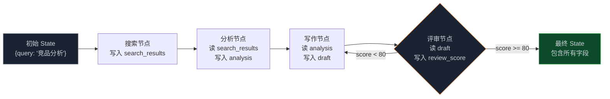
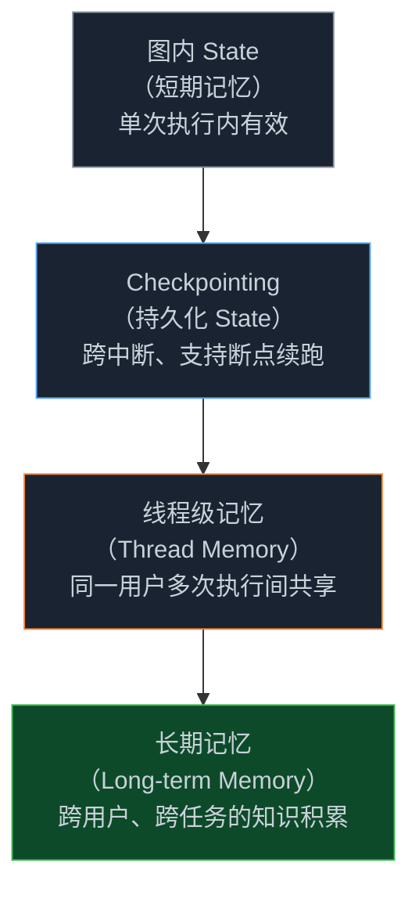

> **🎁 读完这篇你会得到什么**：彻底搞清楚 State 在图里是怎么流动的，Reducer 机制解决了什么问题，以及短期记忆、长期记忆、Checkpointing 三者各自在什么场景下用。

上一篇讲了 LangGraph 和 AutoGen 的选型。

很多人选完框架，开始搭图，跑起来之后发现一个奇怪的问题：并行的三个搜索节点，最后 State 里只剩一个节点的结果。或者图跑了 20 轮，State 里堆了一堆没用的历史数据，内存开始吃紧。再或者，用户关了浏览器回来，图从头开始跑，之前的进度全没了。

这些问题都指向同一个地方——**State 的设计**。

<!-- more -->

---

## 一个让人抓狂的 bug

先说一个真实遇到的情况。

搭了一张并行搜索图：一个扇出节点同时触发三个搜索节点，分别搜索不同的信息源，最后汇聚到一个综合节点。逻辑很清晰，代码也没报错，但跑出来的结果每次都只有一个搜索节点的内容。

排查了半天，最后发现问题出在 State 定义上：

```python
# 有问题的 State 定义
class SearchState(TypedDict):
    query: str
    search_results: list[str]  # ← 问题在这里
```

三个搜索节点都往 `search_results` 写，但默认行为是**覆盖**——后写的把前写的盖掉了。三个节点并行跑，谁最后写完，State 里就只剩谁的结果。

这就是 State 设计里最容易踩的坑：**没有想清楚"写入方式"**。

---

## State 不是简单的数据容器

很多人把 State 理解成"把上一个节点的输出传给下一个节点"，这个理解太浅了。

State 是整张图的**全局共享内存**。每个节点都从 State 里读数据，也往 State 里写数据。问题是，当多个节点同时往同一个字段写的时候，谁说了算？

这就是 LangGraph 的 **Reducer 机制**要解决的问题。

Reducer 是一个函数，它告诉框架：当多个节点都往同一个字段写入时，怎么合并这些写入。

```python
from typing import TypedDict, Annotated
import operator

class SearchState(TypedDict):
    query: str
    # 用 operator.add 作为 Reducer：追加而不是覆盖
    search_results: Annotated[list[str], operator.add]
```

加了 `Annotated[list[str], operator.add]` 之后，三个搜索节点的结果会被追加到同一个列表里，而不是互相覆盖。

这个改动只有一行，但解决了并行节点的数据丢失问题。

Reducer 不只有 `operator.add`，你可以自定义任何合并逻辑：

```python
def keep_latest(existing, new):
    """只保留最新的值"""
    return new

def merge_dicts(existing, new):
    """合并字典，新值覆盖旧值"""
    return {**existing, **new}

def deduplicate(existing, new):
    """追加并去重"""
    return list(set(existing + new))

class MyState(TypedDict):
    # 只保留最新
    status: Annotated[str, keep_latest]
    # 合并字典
    metadata: Annotated[dict, merge_dicts]
    # 追加去重
    visited_urls: Annotated[list[str], deduplicate]
```

理解了 Reducer，你就理解了 State 设计的核心问题：**每个字段，在多节点并发写入时，应该怎么合并？**

---

## State 的三个设计问题

搭一张图之前，State 的设计值得认真想清楚三件事。

**第一件：谁能写哪些字段？**

不是所有节点都应该能写所有字段。搜索节点只应该写 `search_results`，不应该碰 `draft`。评审节点只应该写 `review_score`，不应该改 `analysis`。

LangGraph 本身不强制这个约束，但你可以在节点函数里自己控制——节点函数只返回它负责的字段，其他字段不动：

```python
def search_node(state: SearchState) -> dict:
    # 只返回 search_results，不碰其他字段
    results = do_search(state["query"])
    return {"search_results": results}
```

这个习惯很重要。节点越专注，State 的流转越清晰，出了问题也更容易定位。

**第二件：写入是覆盖还是追加？**

上面已经讲了。顺序节点通常用覆盖（默认行为），并行节点通常需要追加（用 Reducer）。

有一个容易忽视的场景：**循环节点**。

如果一个写作节点会被多次执行（评审不通过就打回重写），`draft` 字段应该是覆盖还是追加？

大多数情况下是覆盖——你只需要最新的草稿，不需要保留历史版本。但如果你想追踪每次修改的历史，就需要追加。这取决于你的业务需求，没有标准答案，但必须想清楚。

**第三件：State 里放什么，不放什么？**

State 是全局共享的，每个节点都能看到。这意味着你不应该把敏感信息、临时变量、或者只有某个节点需要的数据放进 State。

一个实用的原则：**State 里只放"需要跨节点传递"的数据**。某个节点内部的临时计算结果，不需要放进 State，直接在节点函数里用局部变量就行。

State 越精简，图越清晰，调试越容易。

---

## 状态流转的完整生命周期

理解了 Reducer，再来看 State 在整张图里是怎么流动的。



State 从图开始执行时创建，每个节点执行完之后，把自己的返回值合并进 State（按照 Reducer 规则），然后传给下一个节点。图执行完成时，返回最终的 State。

有一个细节值得注意：**节点函数返回的是"增量更新"，不是完整的 State**。

```python
def analysis_node(state: AnalysisState) -> dict:
    # 只返回这个节点负责的字段
    # LangGraph 会自动把这个 dict 合并进完整的 State
    return {"analysis": "分析结果..."}
    # 不需要返回 {"query": ..., "search_results": ..., "analysis": ...}
```

这个设计很优雅——节点只关心自己的输出，框架负责合并。但也带来一个问题：如果你不小心在节点里返回了一个不存在于 State 定义里的字段，LangGraph 会静默忽略它，不会报错。这是一个容易踩的坑，建议在 State 定义里把所有字段都明确声明出来。

---

## 短期记忆：图执行期间的 State

到目前为止讲的都是"图执行期间"的 State——它随着节点执行不断更新，图执行完就消失了。这就是**短期记忆**。

短期记忆够用吗？对于大多数任务，够。

但有两种情况不够：

**情况一：图执行时间很长，中途可能中断。**

用户跑一个需要 30 分钟的分析任务，跑到一半网络断了，或者用户关了浏览器。下次回来，图从头开始，之前的进度全没了。

**情况二：需要跨多次执行记住信息。**

用户今天问了一个问题，明天再来，希望 Agent 还记得上次的对话内容。但每次执行都是一个新的 State，上次的内容不会自动带过来。

这两种情况，需要的是**持久化的 State**——也就是 LangGraph 的 Checkpointing 机制。

---

## Checkpointing：让 State 活过一次执行

Checkpointing 是 LangGraph 的持久化机制。简单说，就是在图执行的每个节点之后，把当前 State 存到数据库里。下次执行时，可以从任意一个检查点恢复。

```python
from langgraph.graph import StateGraph, END
from langgraph.checkpoint.sqlite import SqliteSaver
from typing import TypedDict

class AnalysisState(TypedDict):
    topic: str
    search_results: list[str]
    analysis: str
    draft: str
    review_score: int

# 创建图（省略节点定义）
graph = StateGraph(AnalysisState)
# ... 添加节点和边 ...

# 关键：编译时传入 checkpointer
checkpointer = SqliteSaver.from_conn_string("checkpoints.db")
app = graph.compile(checkpointer=checkpointer)

# 执行时传入 thread_id
# 相同的 thread_id 会共享同一个 State 历史
config = {"configurable": {"thread_id": "analysis-task-001"}}
result = app.invoke({"topic": "AI 代码助手市场"}, config=config)
```

`thread_id` 是关键。它相当于一个"会话 ID"——相同 `thread_id` 的所有执行，共享同一条 State 历史。

如果图执行到一半中断了，下次用同一个 `thread_id` 调用，LangGraph 会自动从上次中断的地方继续：

```python
# 第一次执行，跑到一半中断了
result = app.invoke({"topic": "..."}, config=config)

# 第二次执行，从断点继续
# 注意：input 传 None，表示"继续上次的执行"
result = app.invoke(None, config=config)
```

Checkpointing 还有一个很有用的功能：**Time Travel（时间旅行）**。

你可以查看图在任意历史节点的 State，甚至可以回滚到某个历史状态重新执行：

```python
# 查看所有历史检查点
history = list(app.get_state_history(config))
for checkpoint in history:
    print(f"节点: {checkpoint.metadata.get('source')}")
    print(f"State: {checkpoint.values}")
    print("---")

# 回滚到某个历史状态
target_checkpoint = history[3]  # 第4个检查点
app.update_state(config, target_checkpoint.values)

# 从这个状态重新执行
result = app.invoke(None, config=config)
```

Time Travel 在调试时特别有用——你不需要从头跑，可以直接跳到出问题的那个节点，修改 State 之后重新执行。

---

## 线程级记忆：多用户场景的隔离

Checkpointing 解决了"单个任务的持久化"问题。但在多用户场景里，还有另一个问题：**不同用户的 State 不能互相污染**。

LangGraph 用 `thread_id` 来隔离不同用户的 State。每个用户（或每个任务）用一个独立的 `thread_id`，它们的 State 完全隔离：

```python
# 用户 A 的任务
config_a = {"configurable": {"thread_id": "user-a-task-001"}}
result_a = app.invoke({"topic": "用户A的查询"}, config=config_a)

# 用户 B 的任务（完全独立的 State）
config_b = {"configurable": {"thread_id": "user-b-task-001"}}
result_b = app.invoke({"topic": "用户B的查询"}, config=config_b)
```

这是线程级记忆（Thread-level Memory）的基本用法。

不过有时候你想要的不只是隔离，而是**跨线程共享某些信息**。比如，同一个用户的多次对话，希望 Agent 能记住用户的偏好；或者多个任务共享同一份知识库。

这就需要在线程级记忆之上，再加一层**跨线程记忆**。

LangGraph 的做法是用 `namespace` 来区分不同层级的记忆：

```python
from langgraph.store.memory import InMemoryStore

# 创建一个跨线程的记忆存储
store = InMemoryStore()

# 存储用户偏好（跨线程共享）
store.put(
    namespace=("user_preferences", "user-a"),
    key="language_preference",
    value={"language": "Python", "style": "functional"}
)

# 在节点里读取跨线程记忆
def write_node(state, config, store):
    user_id = config["configurable"].get("user_id")
    # 读取用户偏好
    prefs = store.get(
        namespace=("user_preferences", user_id),
        key="language_preference"
    )
    # 根据偏好生成代码
    language = prefs.value.get("language", "Python") if prefs else "Python"
    # ...
```

这样，同一个用户的不同任务（不同 `thread_id`）可以共享用户偏好，但不同用户之间完全隔离。

---

## 长期记忆：跨会话的知识积累

线程级记忆解决了"同一次执行内"和"同一用户多次执行间"的记忆问题。但还有一种更长期的需求：**Agent 需要随着使用积累知识，越用越聪明**。

这就是长期记忆（Long-term Memory）。

长期记忆和短期记忆的核心区别不在于存储时间，而在于**检索方式**。

短期记忆（State）是全量的——每个节点都能看到完整的 State。这在 State 很小的时候没问题，但如果 Agent 积累了大量历史知识，把所有知识都塞进 State 会让上下文窗口爆掉。

长期记忆需要**按需检索**——Agent 在需要的时候，根据当前任务的相关性，从知识库里取出最相关的部分，而不是全量加载。

实现长期记忆，通常用向量数据库：

```python
import chromadb
from langchain_openai import OpenAIEmbeddings

# 初始化向量数据库
client = chromadb.Client()
collection = client.create_collection("agent_knowledge")
embeddings = OpenAIEmbeddings()

def store_knowledge(content: str, metadata: dict = None):
    """存储知识到长期记忆"""
    embedding = embeddings.embed_query(content)
    collection.add(
        documents=[content],
        embeddings=[embedding],
        metadatas=[metadata or {}],
        ids=[str(uuid.uuid4())]
    )

def retrieve_knowledge(query: str, n_results: int = 3) -> list[str]:
    """按语义相关性检索知识"""
    query_embedding = embeddings.embed_query(query)
    results = collection.query(
        query_embeddings=[query_embedding],
        n_results=n_results
    )
    return results["documents"][0]

# 在节点里使用长期记忆
def research_node(state: ResearchState) -> dict:
    query = state["topic"]
    # 先从长期记忆里检索相关知识
    past_knowledge = retrieve_knowledge(query)
    # 把历史知识和当前任务一起发给 LLM
    context = f"历史相关知识：\n{chr(10).join(past_knowledge)}\n\n当前任务：{query}"
    result = llm.invoke(context)
    # 把新的研究结果存入长期记忆
    store_knowledge(result.content, {"topic": query, "date": today()})
    return {"search_results": [result.content]}
```

这个模式在 Agent-Graph 这类项目里很常见——Agent 每次完成任务，都把结果存入长期记忆，下次遇到相似任务时，先检索历史经验，再做决策。

---

## 记忆的四个层级

把上面讲的整理一下，Graph 工程里的记忆其实有四个层级，各自解决不同的问题：



| 层级 | 生命周期 | 典型用途 | 实现方式 |
|------|---------|---------|---------|
| 图内 State | 单次执行 | 节点间传递数据 | TypedDict + Reducer |
| Checkpointing | 跨中断 | 断点续跑、Time Travel | SqliteSaver / PostgresSaver |
| 线程级记忆 | 同用户多次执行 | 用户偏好、对话历史 | InMemoryStore + namespace |
| 长期记忆 | 永久 | 知识积累、经验复用 | 向量数据库（Chroma/Pinecone） |

不是每个场景都需要四层全上。判断标准很简单：

- 任务轮次少、不需要持久化 → 只用图内 State
- 任务可能中断、需要断点续跑 → 加 Checkpointing
- 多次对话需要记住用户信息 → 加线程级记忆
- 需要积累知识、越用越聪明 → 加长期记忆

从简单开始，遇到问题再加，不要一上来就把四层全搭上。

---

## 一个完整的状态设计示例

说了这么多，来一个把上面内容串起来的完整例子。

场景：一个"每日市场简报"生成系统，需要：
- 并行搜索多个信息源（需要 Reducer）
- 支持断点续跑（需要 Checkpointing）
- 记住用户的阅读偏好（需要线程级记忆）
- 积累历史简报作为参考（需要长期记忆）

```python
from langgraph.graph import StateGraph, END
from langgraph.checkpoint.sqlite import SqliteSaver
from langgraph.store.memory import InMemoryStore
from typing import TypedDict, Annotated
import operator

# State 定义：每个字段都想清楚了 Reducer
class BriefingState(TypedDict):
    date: str
    topic: str
    # 并行搜索节点的结果，用追加 Reducer
    raw_sources: Annotated[list[str], operator.add]
    # 综合后的分析，覆盖模式（只需要最新版本）
    analysis: str
    # 草稿，覆盖模式（评审打回后重写）
    draft: str
    # 评审分数
    review_score: int
    # 最终输出
    final_briefing: str

# 节点函数（每个只更新自己负责的字段）
def search_source_1(state: BriefingState) -> dict:
    results = search_news_api(state["topic"])
    return {"raw_sources": [results]}  # 追加到列表

def search_source_2(state: BriefingState) -> dict:
    results = search_twitter(state["topic"])
    return {"raw_sources": [results]}  # 追加到列表

def analyze_node(state: BriefingState, config, store) -> dict:
    # 从线程级记忆读取用户偏好
    user_id = config["configurable"].get("user_id", "default")
    prefs = store.get(namespace=("prefs", user_id), key="reading_style")
    style = prefs.value.get("style", "简洁") if prefs else "简洁"

    # 从长期记忆检索历史简报
    past_briefings = retrieve_knowledge(state["topic"], n_results=2)

    context = f"""
用户偏好：{style}风格
历史参考：{chr(10).join(past_briefings)}
原始信息：{chr(10).join(state["raw_sources"])}
"""
    analysis = llm.invoke(f"分析以下信息：{context}")
    return {"analysis": analysis.content}

def write_node(state: BriefingState) -> dict:
    draft = llm.invoke(f"根据分析写简报：{state['analysis']}")
    return {"draft": draft.content}

def review_node(state: BriefingState) -> dict:
    response = llm.invoke(f"评审简报质量（0-100分）：{state['draft']}")
    score = parse_score(response.content)
    return {"review_score": score}

def publish_node(state: BriefingState) -> dict:
    # 把最终简报存入长期记忆
    store_knowledge(state["draft"], {"date": state["date"], "topic": state["topic"]})
    return {"final_briefing": state["draft"]}

def route_after_review(state: BriefingState) -> str:
    if state["review_score"] >= 80:
        return "publish"
    return "rewrite"

# 构建图
builder = StateGraph(BriefingState)
builder.add_node("search_1", search_source_1)
builder.add_node("search_2", search_source_2)
builder.add_node("analyze", analyze_node)
builder.add_node("write", write_node)
builder.add_node("review", review_node)
builder.add_node("publish", publish_node)

# 并行搜索
builder.set_entry_point("search_1")
builder.add_edge("search_1", "analyze")  # 扇入：等两个搜索都完成
builder.add_edge("search_2", "analyze")
builder.add_edge("analyze", "write")
builder.add_edge("write", "review")
builder.add_conditional_edges(
    "review",
    route_after_review,
    {"publish": "publish", "rewrite": "write"}
)
builder.add_edge("publish", END)

# 编译：加上 Checkpointing 和跨线程存储
checkpointer = SqliteSaver.from_conn_string("briefings.db")
store = InMemoryStore()
app = builder.compile(checkpointer=checkpointer, store=store)

# 执行
config = {
    "configurable": {
        "thread_id": "briefing-2026-08-21",
        "user_id": "user-001"
    }
}
result = app.invoke(
    {"date": "2026-08-21", "topic": "AI 行业动态", "raw_sources": []},
    config=config
)
```

这个例子把四个层级的记忆都用上了：
- `raw_sources` 用 Reducer 解决并行写入
- `SqliteSaver` 支持断点续跑
- `InMemoryStore` + `user_id` 存用户偏好
- `store_knowledge` / `retrieve_knowledge` 积累历史简报

实际项目里不一定需要这么完整，但这个结构可以作为参考，按需裁剪。

---

## 状态设计的几个实用原则

最后总结几个在实际项目里反复验证过的原则。

**State 要精简，不要贪多。** 每加一个字段，就多一个需要维护的地方。只放"需要跨节点传递"的数据，节点内部的临时变量用局部变量。

**并行节点一定要想清楚 Reducer。** 只要有扇出结构，就要问自己：这些并行节点往同一个字段写的时候，应该覆盖还是追加？没想清楚就会出现数据丢失的 bug，而且不报错，很难发现。

**Checkpointing 要早加，不要等出问题再加。** 加 Checkpointing 的成本很低，但不加的代价可能很高——任务跑了 20 分钟中断，从头再来。

**长期记忆要控制检索数量。** 从向量数据库检索的结果会占用上下文窗口，`n_results` 不要设太大。通常 3-5 条就够了，太多反而会稀释当前任务的注意力。

**Time Travel 是调试利器，要学会用。** 出了问题不需要从头跑，直接跳到出问题的节点，修改 State 之后重新执行。这个功能能节省大量调试时间。

---

## 📝 小结

- **State 是全局共享内存**，不是简单的"上一个节点的输出"——每个节点都能读写，Reducer 决定并发写入时怎么合并
- **Reducer 是并行节点的关键**：`operator.add` 追加，自定义函数处理复杂合并逻辑——没想清楚 Reducer 就会出现数据丢失的静默 bug
- **State 设计三问**：谁能写哪些字段？写入是覆盖还是追加？State 里放什么不放什么？
- **记忆有四个层级**：图内 State（单次执行）→ Checkpointing（跨中断）→ 线程级记忆（同用户多次执行）→ 长期记忆（跨任务知识积累）
- **Checkpointing 带来两个能力**：断点续跑（用 `thread_id` 恢复）和 Time Travel（回滚到任意历史状态调试）
- **从简单开始**：不是每个场景都需要四层全上，先用图内 State，遇到问题再加持久化和长期记忆

---

## 🔮 下一篇预告

State 搞清楚了，图能跑起来了。

但生产环境里还有一个绕不开的问题：**谁来监督 Agent？**

Agent 自己跑到底，没有人工干预，在很多场景里是不可接受的——金融操作、内容发布、代码部署，这些关键节点必须有人确认。

下一篇，我们讲 Human-in-the-Loop（HITL）和断点调试——怎么在图里插入人工审批节点，怎么动态修改 State，以及 Time Travel 在实际调试中怎么用。

---

> 📚 **系列导航**
> - 第 00 篇：从 while 循环到组织架构图，Agent 进化的下一步
> - 第 01 篇：从「单兵独斗」到「军团作战」：为什么你的 Agent 越来越失控？
> - 第 02 篇：解剖 LangGraph 与 AutoGen：选框架之前，先搞懂这三个概念
> - **第 03 篇：State状态管理方案** ⬅️ 你在这里
> - 第 04 篇：让可控性拉满：人机协同（HITL）与断点调试在 Graph 工程中的落地
> - 第 05 篇：实战演练：从零构建企业级"研报自动协作生成"复杂图
> - 第 06 篇：Graph 工程在研发流程中的应用：从需求到上线的全链路实战
> - 第 07 篇：Graph 工程在业务流程中的应用：客服、审批、内容生产场景实战
