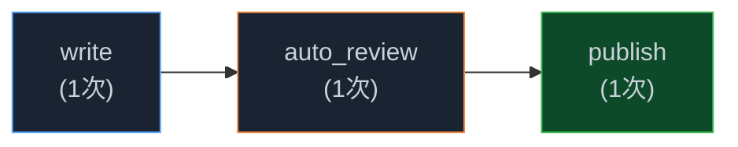
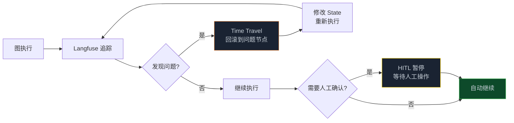

> **🎁 读完这篇你会得到什么**：彻底搞清楚怎么在图里插入人工审批节点，怎么用 `update_state` 动态修改 State，以及 Time Travel 和 Langfuse 在实际调试中怎么用。

上一篇讲了 State 的设计和记忆架构。

图能跑起来了，但生产环境里还有一个绕不开的问题：**谁来监督 Agent？**

Agent 自己跑到底，在很多场景里是不可接受的。金融操作、内容发布、代码部署——这些关键节点必须有人确认。不是不信任 Agent，而是这类决策的错误成本太高，一旦出错，代价远超"多等几秒让人看一眼"的成本。

这就是 Human-in-the-Loop（HITL）要解决的问题。

<!-- more -->

---

## 为什么 Agent 不能一路跑到底

先说一个真实的场景。

有个团队搭了一个"自动发布内容"的 Graph 工程系统：Agent 搜集信息、写文章、审核质量，最后自动发布到公众号。前几次跑得很好，大家都很兴奋，就把人工审核环节去掉了，让它全自动跑。

然后有一天，Agent 写了一篇措辞有问题的文章，自动发出去了。等运营发现的时候，已经有几百人看到了。

这不是 Agent 变坏了，是系统设计有问题——**没有在关键节点设置人工确认**。

Graph 工程的可控性，不只是"能不能跑"，更是"能不能在需要的时候停下来，让人看一眼"。

---

## HITL 的三种场景

在 Graph 工程里，人工干预大概有三种场景，需求不同，实现方式也不同。

**场景一：审批后继续**

最常见的场景。Agent 做完某个步骤，暂停，等人类确认，确认后继续。比如：
- 内容发布前，让编辑看一眼
- 代码部署前，让运维确认
- 财务操作前，让审批人签字

**场景二：审批并修改**

Agent 做完某个步骤，暂停，人类不只是"确认"，还要修改 Agent 的输出，然后继续。比如：
- AI 写了一篇文章，编辑改了几处措辞，然后发布
- AI 生成了一份合同草稿，律师修改了几个条款，然后发送

**场景三：拒绝并重来**

Agent 做完某个步骤，人类觉得不对，打回去重做。比如：
- AI 写的方案不符合要求，让它重新写
- AI 生成的代码有问题，让它重新实现

这三种场景，LangGraph 都支持，而且实现方式出奇地简单。

---

## LangGraph 的 HITL 机制

LangGraph 的 HITL 核心是两个东西：`interrupt_before`/`interrupt_after` 和 `update_state`。

### interrupt_before：在节点执行前暂停

```python
from langgraph.graph import StateGraph, END
from langgraph.checkpoint.sqlite import SqliteSaver
from typing import TypedDict

class ContentState(TypedDict):
    topic: str
    draft: str
    review_score: int
    final_content: str

# 构建图（省略节点定义）
builder = StateGraph(ContentState)
builder.add_node("write", write_node)
builder.add_node("review", review_node)
builder.add_node("publish", publish_node)
builder.set_entry_point("write")
builder.add_edge("write", "review")
builder.add_edge("review", "publish")
builder.add_edge("publish", END)

# 关键：编译时指定在哪些节点前暂停
checkpointer = SqliteSaver.from_conn_string("content.db")
app = builder.compile(
    checkpointer=checkpointer,
    interrupt_before=["publish"]  # 发布前暂停，等人工确认
)

config = {"configurable": {"thread_id": "content-001"}}

# 第一次执行：跑到 publish 节点前自动暂停
result = app.invoke({"topic": "AI 行业动态"}, config=config)
print("当前草稿：", result["draft"])
print("审核分数：", result["review_score"])
# 此时图已暂停，等待人工操作
```

执行到 `publish` 节点前，图会自动暂停。这时候你可以查看当前的 State，决定下一步怎么做。

**如果直接确认，继续执行：**

```python
# 人工确认，继续执行
result = app.invoke(None, config=config)
print("发布完成：", result["final_content"])
```

传 `None` 给 `invoke`，表示"从上次暂停的地方继续"。

### update_state：动态修改 State

如果人工不只是"确认"，还要修改内容，就用 `update_state`：

```python
# 人工修改草稿
human_revised_draft = "（编辑修改后的内容）"

# 更新 State 中的 draft 字段
app.update_state(
    config,
    {"draft": human_revised_draft}
)

# 继续执行（用修改后的 draft 发布）
result = app.invoke(None, config=config)
```

`update_state` 会把你指定的字段更新到当前 State 里，然后继续执行。这就是"审批并修改"场景的实现方式。

### interrupt_after：在节点执行后暂停

`interrupt_before` 是在节点执行前暂停，`interrupt_after` 是在节点执行后暂停。

两者的区别：
- `interrupt_before`：节点还没跑，你可以修改输入
- `interrupt_after`：节点已经跑完，你可以查看输出，决定是否接受

```python
app = builder.compile(
    checkpointer=checkpointer,
    interrupt_after=["review"]  # 审核完成后暂停，让人看审核结果
)

result = app.invoke({"topic": "..."}, config=config)
print("审核结果：", result["review_score"])
print("审核意见：", result.get("review_feedback", ""))

# 如果审核分数太低，人工打回重写
if result["review_score"] < 60:
    # 修改 State，让图从 write 节点重新开始
    app.update_state(
        config,
        {"draft": "", "review_score": 0},
        as_node="write"  # 指定从哪个节点继续
    )

# 继续执行
result = app.invoke(None, config=config)
```

注意 `update_state` 里的 `as_node` 参数——它告诉 LangGraph "把这次更新当作是从哪个节点发出的"，这会影响图接下来走哪条边。

---

## 一个完整的 HITL 工作流

把上面的内容串起来，看一个完整的例子：内容审核发布系统。

```python
from langgraph.graph import StateGraph, END
from langgraph.checkpoint.sqlite import SqliteSaver
from typing import TypedDict, Optional
from langchain_openai import ChatOpenAI

llm = ChatOpenAI(model="gpt-4o-mini")

class ContentState(TypedDict):
    topic: str
    draft: str
    review_score: int
    review_feedback: str
    human_decision: Optional[str]  # "approve" / "reject" / "modify"
    human_modified_draft: Optional[str]
    final_content: str

def write_node(state: ContentState) -> dict:
    response = llm.invoke(f"写一篇关于{state['topic']}的文章，500字左右")
    return {"draft": response.content}

def auto_review_node(state: ContentState) -> dict:
    """自动审核：检查基本质量"""
    response = llm.invoke(
        f"评审以下文章质量（0-100分），给出分数和简短意见：\n{state['draft']}"
    )
    score, feedback = parse_review(response.content)
    return {"review_score": score, "review_feedback": feedback}

def publish_node(state: ContentState) -> dict:
    """发布节点：使用人工修改后的版本（如果有）"""
    content = state.get("human_modified_draft") or state["draft"]
    # 实际发布逻辑...
    return {"final_content": content}

# 路由：根据自动审核分数决定是否需要人工介入
def route_after_review(state: ContentState) -> str:
    if state["review_score"] >= 80:
        return "auto_publish"  # 质量够好，直接发布
    return "human_review"      # 质量不够，需要人工看

builder = StateGraph(ContentState)
builder.add_node("write", write_node)
builder.add_node("auto_review", auto_review_node)
builder.add_node("publish", publish_node)

builder.set_entry_point("write")
builder.add_edge("write", "auto_review")
builder.add_conditional_edges(
    "auto_review",
    route_after_review,
    {"auto_publish": "publish", "human_review": "publish"}
    # 两条路都走向 publish，但 human_review 路径会被 interrupt 拦截
)
builder.add_edge("publish", END)

checkpointer = SqliteSaver.from_conn_string("content.db")
app = builder.compile(
    checkpointer=checkpointer,
    interrupt_before=["publish"]  # 无论哪条路，发布前都暂停
)
```

**使用方式：**

```python
config = {"configurable": {"thread_id": "article-2026-08-22"}}

# 第一步：跑到发布前暂停
state = app.invoke({"topic": "Graph 工程入门"}, config=config)

print(f"草稿：{state['draft'][:200]}...")
print(f"自动审核分数：{state['review_score']}")
print(f"审核意见：{state['review_feedback']}")

# 第二步：人工决策
decision = input("操作：[a]批准发布 / [m]修改后发布 / [r]打回重写 > ")

if decision == "a":
    # 直接发布
    app.invoke(None, config=config)

elif decision == "m":
    # 修改后发布
    new_draft = input("请输入修改后的内容：")
    app.update_state(config, {"human_modified_draft": new_draft})
    app.invoke(None, config=config)

elif decision == "r":
    # 打回重写：重置 draft，从 write 节点重新开始
    app.update_state(
        config,
        {"draft": "", "review_score": 0},
        as_node="write"
    )
    # 重新执行（会从 write 节点开始）
    state = app.invoke(None, config=config)
    # 再次等待人工确认...
```

这个流程的好处：
- 质量好的内容（分数 ≥ 80）自动发布，不打扰人工
- 质量差的内容暂停，等人工处理
- 人工可以选择批准、修改、或打回重写
- 所有操作都有 Checkpointing 记录，可以随时回溯

---

## Time Travel：调试的终极武器

HITL 解决了"生产环境的可控性"问题。Time Travel 解决的是另一个问题：**调试**。

Graph 工程的调试比单 Agent 难得多。一张图有 5 个节点，每个节点都可能出问题，而且节点之间有依赖关系——第 3 个节点出错，可能是因为第 1 个节点的输出有问题。

传统的调试方式是"从头跑"——改了第 1 个节点，重新跑整张图，等到第 3 个节点看结果。如果图跑一次要 5 分钟，调试一个 bug 可能要花半小时。

Time Travel 让你可以**直接跳到任意历史节点，修改 State，从那里重新执行**。

### 查看历史检查点

```python
# 查看这个 thread 的所有历史检查点
history = list(app.get_state_history(config))

for i, checkpoint in enumerate(history):
    print(f"[{i}] 节点: {checkpoint.metadata.get('source', 'unknown')}")
    print(f"    时间: {checkpoint.metadata.get('created_at', '')}")
    print(f"    State 摘要: draft={checkpoint.values.get('draft', '')[:50]}...")
    print()
```

输出大概是这样：

```
[0] 节点: publish
    时间: 2026-08-22 10:05:23
    State 摘要: draft=（最终版本）...

[1] 节点: auto_review
    时间: 2026-08-22 10:05:18
    State 摘要: draft=（审核前的草稿）...

[2] 节点: write
    时间: 2026-08-22 10:05:10
    State 摘要: draft=（初始草稿）...

[3] 节点: __start__
    时间: 2026-08-22 10:05:08
    State 摘要: draft=...
```

### 回滚到历史状态

发现第 2 个节点（`auto_review`）的输出有问题，想从那里重新调试：

```python
# 取出 auto_review 节点的历史状态
target = history[1]  # auto_review 节点的检查点

# 回滚到这个状态
app.update_state(config, target.values)

# 从这个状态重新执行
result = app.invoke(None, config=config)
```

这样就不需要从头跑了，直接从出问题的节点开始，节省大量时间。

### 修改历史 State 重新执行

更强大的用法：不只是回滚，还要修改历史 State，然后重新执行，看修改后的效果。

```python
# 回滚到 write 节点完成后的状态
write_checkpoint = history[2]

# 修改 draft，模拟"如果 write 节点输出了不同的内容会怎样"
modified_state = {**write_checkpoint.values}
modified_state["draft"] = "（修改后的草稿，用于测试）"

# 用修改后的 State 更新
app.update_state(config, modified_state, as_node="write")

# 从 write 节点之后重新执行（auto_review → publish）
result = app.invoke(None, config=config)
print("修改后的审核分数：", result["review_score"])
```

这个功能在调试"为什么审核分数这么低"的时候特别有用——你可以直接修改草稿，看不同的草稿会得到什么样的审核结果，而不需要重新跑整个写作流程。

---

## 可观测性：Langfuse 的 Agent Graphs

HITL 和 Time Travel 解决了"控制"的问题。但生产环境里还有另一个需求：**可观测性**——你需要知道图在跑的时候发生了什么，哪个节点慢，哪个节点出错，整体的执行路径是什么样的。

Langfuse 的 Agent Graphs 功能，专门为这个需求设计。

### 接入 Langfuse

```python
from langfuse.callback import CallbackHandler

# 创建 Langfuse 回调处理器
langfuse_handler = CallbackHandler(
    public_key="your-public-key",
    secret_key="your-secret-key",
    host="https://cloud.langfuse.com"
)

# 在执行时传入回调
config = {
    "configurable": {"thread_id": "content-001"},
    "callbacks": [langfuse_handler]  # 加这一行
}

result = app.invoke({"topic": "Graph 工程入门"}, config=config)
```

就这一行，Langfuse 会自动追踪整个图的执行过程，包括：
- 每个节点的输入和输出
- 每个节点的执行时间
- LLM 调用的 token 消耗和费用
- 整体的执行路径

### 两种视图：聚合 vs 展开

Langfuse 的 Agent Graphs 有两种视图，解决不同的问题。

**聚合视图（Aggregated）**：把相同名称的节点合并，显示整体结构。



适合回答"这张图的结构是什么"——一眼看出有哪些节点、它们怎么连接。

**展开视图（Expanded）**：每次调用都是独立节点，显示实际执行过程。

如果 `write` 节点被打回重写了 3 次，展开视图会显示 3 个独立的 `write` 节点，按时间顺序排列。适合回答"这次执行具体发生了什么"——逐步追踪每一次调用。

两种视图各有用途：
- 聚合视图：理解图的结构，发现设计问题
- 展开视图：调试某次具体执行，定位问题节点

### 从 Langfuse 发现问题

接入 Langfuse 之后，你能发现很多用日志发现不了的问题。

**问题一：某个节点耗时异常**

Langfuse 会显示每个节点的执行时间。如果 `auto_review` 节点平均耗时 30 秒，但偶尔会跑到 5 分钟，这个异常在日志里很难发现，但在 Langfuse 的时间线图里一眼就能看出来。

**问题二：token 消耗超预期**

Langfuse 会统计每个 LLM 调用的 token 消耗。如果某个节点的 Prompt 设计有问题，导致每次调用都消耗大量 token，Langfuse 会直接告诉你哪个节点最贵。

**问题三：执行路径不符合预期**

有时候图的执行路径和你预期的不一样——你以为它走了 A → B → C，实际上走了 A → B → A → B → C（循环了一次）。展开视图会把实际执行路径完整展示出来。

---

## 把 HITL 和可观测性结合起来

HITL 和可观测性是互补的：

- **HITL** 让你在关键节点介入，控制 Agent 的行为
- **可观测性** 让你看清楚 Agent 在做什么，发现问题

两者结合，才是生产级 Graph 工程的完整方案。

一个实用的工作流：



---

## 几个实用的设计原则

**原则一：不是所有节点都需要 HITL**

HITL 会打断自动化流程，增加人工成本。只在真正需要人工判断的节点加 HITL——通常是"输出会对外产生影响"的节点（发布、发送、执行）。

**原则二：给人工操作设置超时**

如果人工长时间不操作，图会一直暂停。生产环境里要设置超时机制：

```python
import time

def wait_for_human_decision(config, timeout_seconds=3600):
    """等待人工决策，超时后自动拒绝"""
    start_time = time.time()
    while time.time() - start_time < timeout_seconds:
        # 检查是否有人工操作
        current_state = app.get_state(config)
        if current_state.values.get("human_decision"):
            return current_state.values["human_decision"]
        time.sleep(10)  # 每10秒检查一次

    # 超时，自动拒绝
    app.update_state(config, {"human_decision": "reject"})
    return "reject"
```

**原则三：记录人工操作的原因**

人工修改了 State，要记录为什么修改。这对后续的审计和模型改进都很有价值：

```python
def human_approve_with_reason(config, reason: str, modified_draft: str = None):
    """人工审批，附带原因"""
    update = {
        "human_decision": "approve",
        "human_decision_reason": reason,
        "human_decision_time": datetime.now().isoformat()
    }
    if modified_draft:
        update["human_modified_draft"] = modified_draft

    app.update_state(config, update)
```

**原则四：Time Travel 不只用于调试**

Time Travel 还可以用于"假设分析"——"如果当时 Agent 做了不同的决策，结果会怎样？"

这对优化 Prompt 和节点设计很有价值：你可以用同一份历史数据，测试不同的节点实现，看哪个效果更好。

---

## 一个完整的生产级配置

把上面所有内容整合起来，一个生产级的 Graph 工程配置大概是这样的：

```python
from langgraph.graph import StateGraph, END
from langgraph.checkpoint.postgres import PostgresSaver  # 生产用 PostgreSQL
from langfuse.callback import CallbackHandler
from typing import TypedDict, Optional
import os

class ProductionState(TypedDict):
    # 业务数据
    topic: str
    draft: str
    review_score: int
    review_feedback: str
    # 人工操作记录
    human_decision: Optional[str]
    human_decision_reason: Optional[str]
    human_decision_time: Optional[str]
    human_modified_draft: Optional[str]
    # 最终输出
    final_content: str

# 生产环境用 PostgreSQL 存 Checkpoints
checkpointer = PostgresSaver.from_conn_string(
    os.environ["DATABASE_URL"]
)

# Langfuse 可观测性
langfuse_handler = CallbackHandler(
    public_key=os.environ["LANGFUSE_PUBLIC_KEY"],
    secret_key=os.environ["LANGFUSE_SECRET_KEY"]
)

# 构建图
builder = StateGraph(ProductionState)
# ... 添加节点和边 ...

# 编译：HITL + Checkpointing
app = builder.compile(
    checkpointer=checkpointer,
    interrupt_before=["publish"]  # 发布前必须人工确认
)

def run_with_observability(topic: str, thread_id: str):
    """带完整可观测性的执行"""
    config = {
        "configurable": {"thread_id": thread_id},
        "callbacks": [langfuse_handler]  # 接入 Langfuse
    }

    # 执行到暂停点
    state = app.invoke({"topic": topic}, config=config)

    # 返回当前状态，等待人工操作
    return state, config
```

---

## 📝 小结

- **HITL 的三种场景**：审批后继续、审批并修改、拒绝并重来——LangGraph 用 `interrupt_before`/`interrupt_after` + `update_state` 全部支持
- **`interrupt_before`**：在节点执行前暂停，适合"发布前确认"；**`interrupt_after`**：在节点执行后暂停，适合"查看结果后决策"
- **`update_state`**：动态修改 State，配合 `as_node` 参数可以指定从哪个节点继续执行
- **Time Travel 的两个用途**：调试（回滚到问题节点重新执行）和假设分析（测试不同决策的结果）
- **Langfuse Agent Graphs**：聚合视图看结构，展开视图看执行过程——接入只需一行代码，能发现日志发现不了的问题
- **生产级配置**：PostgreSQL 存 Checkpoints（替代 SQLite）+ Langfuse 可观测性 + HITL 超时机制 + 人工操作记录

---

## 🔮 下一篇预告

HITL 和调试都搞清楚了，是时候来一个完整的实战了。

下一篇，我们从零搭一个企业级的"研报自动协作生成"系统——并行检索多个信息源（Fan-out）、动态汇总（Fan-in）、自我反思循环，把前四篇讲的所有内容串起来，跑一个真实能用的系统。

---

> 📚 **系列导航**
> - 第 00 篇：从 while 循环到组织架构图，Agent 进化的下一步
> - 第 01 篇：从「单兵独斗」到「军团作战」：为什么你的 Agent 越来越失控？
> - 第 02 篇：解剖 LangGraph 与 AutoGen：选框架之前，先搞懂这三个概念
> - 第 03 篇：State 是整张图的血液：搞懂状态流转，才算真的会用 LangGraph
> - **第 04 篇：让可控性拉满：人机协同（HITL）与断点调试在 Graph 工程中的落地** ⬅️ 你在这里
> - 第 05 篇：实战演练：从零构建企业级"研报自动协作生成"复杂图
> - 第 06 篇：Graph 工程在研发流程中的应用：从需求到上线的全链路实战
> - 第 07 篇：Graph 工程在业务流程中的应用：客服、审批、内容生产场景实战
> - 第 08 篇：中小企业落地 Graph 工程：从 0 到 1 的选型与成本控制
> - 第 09 篇：电商场景实战：用 Graph 工程搭客服+选品+营销协作系统
> - 第 10 篇：内容团队实战：用 Graph 工程把内容生产效率提升 3 倍
