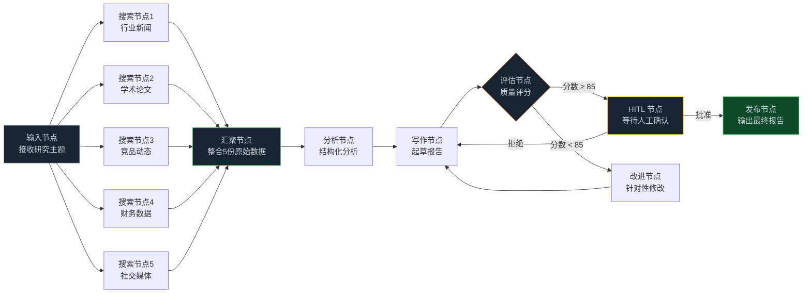

> **🎁 读完这篇你会得到什么**：一个完整的企业级研报生成系统，把前四篇讲的 Fan-out/Fan-in、自我反思循环、HITL、Checkpointing、Langfuse 全部串起来，代码可以直接跑。

前四篇讲了很多概念和机制。

这篇不讲概念了，直接上手。

场景是一个"每日行业研报自动生成系统"——给定一个研究主题，系统自动并行搜索多个信息源、汇总分析、起草报告、自我评估质量、不达标就循环改进，最后在发布前等人工确认。

这个场景把 Graph 工程的几个核心模式全部用上了：
- **Fan-out**：并行搜索 5 个信息源，时间压缩到 1/5
- **Fan-in**：把 5 份原始数据汇聚成一份结构化分析
- **Evaluator-Optimizer 循环**：自我评估质量，不达标自动重写
- **HITL**：发布前人工确认，防止出错
- **Checkpointing**：支持断点续跑，任务中断不丢失
- **Langfuse**：全程可观测，知道每个节点在干什么

<!-- more -->

---

## 先把整张图画出来

动手之前，先把图的结构想清楚。



这张图有几个值得注意的设计决策：

**为什么搜索节点要并行？** 5 个信息源串行搜索要 5 倍时间，并行只要 1 倍。而且 5 个来源互相独立，没有依赖关系，天然适合并行。

**为什么评估节点要用循环而不是一次性？** 研报质量很难一次就达标。自我反思循环让系统能迭代改进，而不是"写完就发"。但循环必须有退出条件——这里用分数阈值（85分）加最大迭代次数（3次）双重保险。

**为什么 HITL 节点放在评估通过之后？** 让 AI 先把质量提到一定水平，再交给人工确认。这样人工看到的是"基本合格的草稿"，而不是"需要大改的初稿"，审核效率更高。

---

## State 设计

State 是整张图的血液，先把它设计好。

```python
from typing import TypedDict, Annotated, Optional
import operator

class ResearchReportState(TypedDict):
    # ── 输入 ──────────────────────────────────────
    topic: str                    # 研究主题
    date: str                     # 报告日期
    target_audience: str          # 目标读者（影响写作风格）

    # ── 并行搜索结果（Reducer：追加） ──────────────
    raw_sources: Annotated[list[dict], operator.add]

    # ── 分析与写作（覆盖模式） ─────────────────────
    structured_analysis: str      # 结构化分析结论
    report_draft: str             # 报告草稿
    improvement_notes: str        # 改进意见（评估节点写入）

    # ── 质量控制 ──────────────────────────────────
    quality_score: float          # 0-1，质量评分
    quality_feedback: str         # 详细评审意见
    iteration_count: int          # 迭代次数（防死循环）

    # ── 人工操作记录 ──────────────────────────────
    human_decision: Optional[str]          # "approve" / "reject"
    human_feedback: Optional[str]          # 人工反馈意见
    human_decision_time: Optional[str]

    # ── 最终输出 ──────────────────────────────────
    final_report: str
    publish_url: Optional[str]
```

几个设计要点：

`raw_sources` 用 `operator.add` 作为 Reducer——5 个并行搜索节点都往这个字段写，追加而不是覆盖，保证 5 份数据都能保留下来。

`report_draft` 用默认的覆盖模式——每次重写都是全新的草稿，不需要保留历史版本。

`iteration_count` 是防死循环的关键——评估循环最多跑 3 次，超过就强制输出，不管分数够不够。

---

## 搭建图：从节点到完整系统

### 第一步：5 个并行搜索节点

```python
from langchain_openai import ChatOpenAI
from langgraph.graph import StateGraph, END

llm_fast = ChatOpenAI(model="gpt-4o-mini", temperature=0)    # 搜索用便宜的
llm_good = ChatOpenAI(model="gpt-4o", temperature=0.3)       # 写作用好一点的
llm_strict = ChatOpenAI(model="gpt-4o", temperature=0)       # 评估用严格的

def search_industry_news(state: ResearchReportState) -> dict:
    """搜索行业新闻"""
    results = web_search(
        query=f"{state['topic']} 行业新闻 最新动态",
        n_results=5
    )
    return {"raw_sources": [{"type": "industry_news", "data": results}]}

def search_academic(state: ResearchReportState) -> dict:
    """搜索学术论文和研究报告"""
    results = academic_search(
        query=state["topic"],
        n_results=3
    )
    return {"raw_sources": [{"type": "academic", "data": results}]}

def search_competitor(state: ResearchReportState) -> dict:
    """搜索竞品动态"""
    results = web_search(
        query=f"{state['topic']} 竞品 市场份额 产品动态",
        n_results=5
    )
    return {"raw_sources": [{"type": "competitor", "data": results}]}

def search_financial(state: ResearchReportState) -> dict:
    """搜索财务数据"""
    results = financial_data_api(
        topic=state["topic"],
        metrics=["revenue", "growth_rate", "market_cap"]
    )
    return {"raw_sources": [{"type": "financial", "data": results}]}

def search_social(state: ResearchReportState) -> dict:
    """搜索社交媒体讨论"""
    results = social_search(
        query=state["topic"],
        platforms=["twitter", "linkedin", "zhihu"],
        n_results=10
    )
    return {"raw_sources": [{"type": "social", "data": results}]}
```

5 个节点的结构几乎一样——搜索不同的来源，返回格式统一的数据。这是好节点的特征：职责单一，输入输出清晰。

### 第二步：汇聚节点（Fan-in）

```python
def aggregate_node(state: ResearchReportState) -> dict:
    """
    汇聚节点：把 5 份原始数据整合成结构化分析
    这是 Fan-in 的核心——等所有并行节点完成后，统一处理
    """
    # 按来源类型整理数据
    sources_by_type = {}
    for source in state["raw_sources"]:
        source_type = source["type"]
        if source_type not in sources_by_type:
            sources_by_type[source_type] = []
        sources_by_type[source_type].append(source["data"])

    # 格式化成分析友好的结构
    formatted = f"""
## 行业新闻
{format_sources(sources_by_type.get('industry_news', []))}

## 学术研究
{format_sources(sources_by_type.get('academic', []))}

## 竞品动态
{format_sources(sources_by_type.get('competitor', []))}

## 财务数据
{format_sources(sources_by_type.get('financial', []))}

## 市场讨论
{format_sources(sources_by_type.get('social', []))}
"""

    # 让 LLM 做结构化分析
    prompt = f"""
研究主题：{state['topic']}
目标读者：{state['target_audience']}

基于以下多源数据，生成结构化分析：

{formatted}

分析框架：
1. 核心趋势（3-5条，每条有数据支撑）
2. 主要机会（2-3个，有具体依据）
3. 潜在风险（2-3个，有量化评估）
4. 竞争格局（关键玩家和市场份额）
5. 数据亮点（最有价值的3个数据点）
"""
    result = llm_good.invoke(prompt)
    return {"structured_analysis": result.content}
```

汇聚节点做了两件事：先把 5 份数据按类型整理，再让 LLM 做结构化分析。这样写作节点拿到的是干净的分析结论，而不是原始的搜索噪音。

### 第三步：写作节点

```python
def write_node(state: ResearchReportState) -> dict:
    """写作节点：基于结构化分析起草报告"""
    # 如果有改进意见（来自评估循环），把它加进 Prompt
    improvement_context = ""
    if state.get("improvement_notes"):
        improvement_context = f"""
【上一版本的改进意见，请针对性修改】
{state['improvement_notes']}
"""

    prompt = f"""
研究主题：{state['topic']}
报告日期：{state['date']}
目标读者：{state['target_audience']}

结构化分析：
{state['structured_analysis']}

{improvement_context}

请起草一份专业研报，要求：
- 总字数 1500-2000 字
- 结构：执行摘要（200字）+ 市场概况 + 竞争分析 + 机会与风险 + 结论与建议
- 每个观点都有数据支撑
- 语言专业但不晦涩，适合 {state['target_audience']} 阅读
- 如果有改进意见，必须针对性修改
"""
    result = llm_good.invoke(prompt)
    return {
        "report_draft": result.content,
        "iteration_count": state.get("iteration_count", 0) + 1
    }
```

注意 `improvement_context` 的设计——如果这是第二次或第三次写作（评估不通过打回来的），会把上一轮的改进意见带进 Prompt。这是自我反思循环能真正改进的关键：不只是"重写"，而是"针对具体问题重写"。

### 第四步：评估节点（Evaluator-Optimizer 的核心）

```python
def evaluate_node(state: ResearchReportState) -> dict:
    """
    评估节点：对报告质量打分，给出改进意见
    这是 Evaluator-Optimizer 模式的评估端
    """
    prompt = f"""
你是一个严格的研报质量审核专家。

请评估以下研报的质量（0-100分）：

【研报内容】
{state['report_draft']}

【评估维度】
1. 数据支撑（30分）：每个核心观点是否有具体数据？数据是否可信？
2. 逻辑严密（25分）：分析是否有逻辑？结论是否从数据中自然推导？
3. 实用价值（25分）：对目标读者（{state['target_audience']}）是否有实际指导意义？
4. 写作质量（20分）：语言是否专业流畅？结构是否清晰？

【输出格式】
总分：XX分
各维度得分：数据支撑XX/30，逻辑严密XX/25，实用价值XX/25，写作质量XX/20
主要问题：
1. [具体问题1，指出在哪里、怎么改]
2. [具体问题2，指出在哪里、怎么改]
改进建议：[针对主要问题的具体修改方向]
"""
    result = llm_strict.invoke(prompt)

    # 解析分数
    score = parse_quality_score(result.content)  # 从输出中提取总分
    feedback = result.content

    # 提取改进意见（供下一轮写作使用）
    improvement_notes = extract_improvement_notes(result.content)

    return {
        "quality_score": score / 100,  # 归一化到 0-1
        "quality_feedback": feedback,
        "improvement_notes": improvement_notes
    }

def route_after_evaluation(state: ResearchReportState) -> str:
    """路由函数：决定是继续改进还是进入人工审核"""
    score = state.get("quality_score", 0)
    iterations = state.get("iteration_count", 0)

    # 分数够了，进入人工审核
    if score >= 0.85:
        return "human_review"

    # 迭代次数太多，强制进入人工审核（避免死循环）
    if iterations >= 3:
        return "human_review"

    # 分数不够，继续改进
    return "improve"
```

评估节点用了比写作节点更严格的模型（`temperature=0`），而且 Prompt 里明确要求"指出在哪里、怎么改"——这样改进意见才是可操作的，而不是泛泛的"需要改进"。

路由函数里的双重退出条件很重要：分数阈值（0.85）是正常退出，迭代次数上限（3次）是兜底退出。没有兜底，图可能会无限循环。

### 第五步：改进节点

```python
def improve_node(state: ResearchReportState) -> dict:
    """
    改进节点：根据评估意见，决定改进策略
    注意：这个节点不直接改报告，而是更新改进指令，然后回到写作节点
    """
    # 分析评估意见，生成更具体的改进指令
    prompt = f"""
当前报告质量评分：{state['quality_score'] * 100:.0f}分
评估意见：{state['quality_feedback']}

请生成一份简洁的改进指令（3-5条），每条指令要：
- 指出具体问题在哪里
- 说明如何修改
- 给出修改示例（如果可能）

格式：
1. [问题位置]：[具体修改方法]
"""
    result = llm_fast.invoke(prompt)

    # 更新改进意见，写作节点会读取这个字段
    return {"improvement_notes": result.content}
```

改进节点做的事很简单——把评估意见转化成更具体的改进指令，然后图会回到写作节点重新写。这个节点存在的意义是"翻译"：把评估节点的"问题描述"翻译成写作节点能直接执行的"改进指令"。

### 第六步：HITL 节点（人工确认）

```python
def hitl_node(state: ResearchReportState) -> dict:
    """
    HITL 节点：这个节点本身不做任何事
    它的存在是为了让 interrupt_before 在这里暂停
    人工操作通过 update_state 完成
    """
    # 如果人工批准了，直接透传
    if state.get("human_decision") == "approve":
        return {}

    # 如果人工拒绝了，清空 draft 让图重新写
    if state.get("human_decision") == "reject":
        return {
            "report_draft": "",
            "quality_score": 0,
            "iteration_count": 0,
            "improvement_notes": state.get("human_feedback", "")
        }

    return {}

def route_after_hitl(state: ResearchReportState) -> str:
    """HITL 后的路由"""
    decision = state.get("human_decision", "")
    if decision == "approve":
        return "publish"
    elif decision == "reject":
        return "rewrite"  # 打回重写
    return "publish"  # 默认发布（超时情况）
```

### 第七步：发布节点

```python
def publish_node(state: ResearchReportState) -> dict:
    """发布节点：输出最终报告"""
    # 使用人工修改后的版本（如果有），否则用 AI 生成的版本
    final_report = state.get("human_modified_draft") or state["report_draft"]

    # 实际发布逻辑（发邮件、存数据库、推送通知等）
    publish_url = publish_report(
        content=final_report,
        topic=state["topic"],
        date=state["date"]
    )

    return {
        "final_report": final_report,
        "publish_url": publish_url
    }
```

---

## 把图组装起来

```python
from langgraph.graph import StateGraph, END
from langgraph.checkpoint.sqlite import SqliteSaver
from langfuse.callback import CallbackHandler
import os

# 构建图
builder = StateGraph(ResearchReportState)

# 添加所有节点
builder.add_node("search_news", search_industry_news)
builder.add_node("search_academic", search_academic)
builder.add_node("search_competitor", search_competitor)
builder.add_node("search_financial", search_financial)
builder.add_node("search_social", search_social)
builder.add_node("aggregate", aggregate_node)
builder.add_node("write", write_node)
builder.add_node("evaluate", evaluate_node)
builder.add_node("improve", improve_node)
builder.add_node("hitl", hitl_node)
builder.add_node("publish", publish_node)

# ── 入口：并行触发 5 个搜索节点（Fan-out）──────────
builder.set_entry_point("search_news")
# 注意：LangGraph 的并行是通过多个节点指向同一个下游节点实现的
# 所有搜索节点都指向 aggregate，LangGraph 会等它们全部完成再执行 aggregate
builder.add_edge("search_news", "aggregate")
builder.add_edge("search_academic", "aggregate")
builder.add_edge("search_competitor", "aggregate")
builder.add_edge("search_financial", "aggregate")
builder.add_edge("search_social", "aggregate")

# ── 主流程 ──────────────────────────────────────
builder.add_edge("aggregate", "write")
builder.add_edge("write", "evaluate")

# ── 评估后的条件路由 ─────────────────────────────
builder.add_conditional_edges(
    "evaluate",
    route_after_evaluation,
    {
        "human_review": "hitl",
        "improve": "improve"
    }
)
builder.add_edge("improve", "write")  # 改进后回到写作节点

# ── HITL 后的条件路由 ────────────────────────────
builder.add_conditional_edges(
    "hitl",
    route_after_hitl,
    {
        "publish": "publish",
        "rewrite": "write"  # 人工拒绝，打回重写
    }
)
builder.add_edge("publish", END)

# ── 编译：加上 Checkpointing 和 HITL ─────────────
checkpointer = SqliteSaver.from_conn_string("research_reports.db")
app = builder.compile(
    checkpointer=checkpointer,
    interrupt_before=["hitl"]  # 在 HITL 节点前暂停，等人工操作
)
```

这里有一个 LangGraph 的并行实现细节值得说明：**LangGraph 的并行不是通过显式的"并行启动"指令实现的，而是通过图的拓扑结构自动推断的**。

当多个节点（`search_news`、`search_academic` 等）都指向同一个下游节点（`aggregate`）时，LangGraph 会自动并行执行这些节点，等所有节点都完成后再执行 `aggregate`。这就是 Fan-out/Fan-in 的实现方式。

但这里有个问题：`set_entry_point` 只能设置一个入口节点。要实现真正的并行启动，需要用一个"触发节点"来扇出：

```python
def trigger_node(state: ResearchReportState) -> dict:
    """触发节点：什么都不做，只是作为并行搜索的起点"""
    return {}

builder.add_node("trigger", trigger_node)
builder.set_entry_point("trigger")

# 从触发节点扇出到 5 个搜索节点
builder.add_edge("trigger", "search_news")
builder.add_edge("trigger", "search_academic")
builder.add_edge("trigger", "search_competitor")
builder.add_edge("trigger", "search_financial")
builder.add_edge("trigger", "search_social")
```

---

## 运行系统

```python
def run_research_report(
    topic: str,
    date: str,
    target_audience: str = "行业分析师和投资人",
    thread_id: str = None
):
    """运行研报生成系统"""
    if thread_id is None:
        thread_id = f"report-{topic[:10]}-{date}"

    # Langfuse 可观测性
    langfuse_handler = CallbackHandler(
        public_key=os.environ.get("LANGFUSE_PUBLIC_KEY", ""),
        secret_key=os.environ.get("LANGFUSE_SECRET_KEY", "")
    )

    config = {
        "configurable": {"thread_id": thread_id},
        "callbacks": [langfuse_handler]
    }

    print(f"🚀 开始生成研报：{topic}")
    print(f"📅 日期：{date}")
    print(f"👥 目标读者：{target_audience}")
    print("─" * 50)

    # 第一阶段：运行到 HITL 节点前暂停
    state = app.invoke(
        {
            "topic": topic,
            "date": date,
            "target_audience": target_audience,
            "raw_sources": [],
            "iteration_count": 0
        },
        config=config
    )

    print(f"\n✅ AI 生成完成")
    print(f"📊 质量评分：{state['quality_score'] * 100:.0f}分")
    print(f"🔄 迭代次数：{state['iteration_count']}次")
    print(f"\n📄 报告预览（前500字）：")
    print(state["report_draft"][:500] + "...")
    print("\n" + "─" * 50)
    print(f"📝 评审意见：\n{state['quality_feedback'][:300]}...")

    # 第二阶段：人工决策
    print("\n⏸️  等待人工确认...")
    decision = input("\n操作：[a]批准发布 / [r]拒绝重写 / [m]修改后发布 > ").strip()

    if decision == "a":
        # 批准
        app.update_state(config, {
            "human_decision": "approve",
            "human_decision_time": datetime.now().isoformat()
        })
        print("✅ 已批准，开始发布...")

    elif decision == "r":
        # 拒绝，让 AI 重写
        feedback = input("请输入拒绝原因（AI 会根据这个重写）：")
        app.update_state(config, {
            "human_decision": "reject",
            "human_feedback": feedback,
            "human_decision_time": datetime.now().isoformat()
        })
        print("🔄 已拒绝，AI 将重新生成...")

    elif decision == "m":
        # 修改后发布
        print("请输入修改后的报告内容（输入 END 结束）：")
        lines = []
        while True:
            line = input()
            if line == "END":
                break
            lines.append(line)
        modified_draft = "\n".join(lines)
        app.update_state(config, {
            "human_decision": "approve",
            "human_modified_draft": modified_draft,
            "human_decision_time": datetime.now().isoformat()
        })
        print("✅ 已修改，开始发布...")

    # 第三阶段：继续执行（发布或重写）
    final_state = app.invoke(None, config=config)

    if final_state.get("publish_url"):
        print(f"\n🎉 发布成功！")
        print(f"📎 报告链接：{final_state['publish_url']}")
    else:
        print(f"\n📄 报告已生成，等待下一轮确认...")

    return final_state
```

---

## 断点续跑：任务中断怎么办

有了 Checkpointing，任务中断不再是问题。

```python
def resume_report(thread_id: str):
    """恢复中断的报告生成任务"""
    config = {"configurable": {"thread_id": thread_id}}

    # 查看当前状态
    current_state = app.get_state(config)
    print(f"当前节点：{current_state.next}")
    print(f"报告主题：{current_state.values.get('topic', '未知')}")
    print(f"质量评分：{current_state.values.get('quality_score', 0) * 100:.0f}分")

    # 从断点继续
    final_state = app.invoke(None, config=config)
    return final_state

def list_pending_reports():
    """列出所有等待人工确认的报告"""
    # 查询数据库中所有暂停在 hitl 节点的任务
    # 实际实现依赖具体的 checkpointer 类型
    pass
```

---

## 用 Langfuse 看清楚系统在干什么

接入 Langfuse 之后，你能在 Dashboard 里看到这张图的完整执行过程。

几个特别有价值的观测点：

**并行搜索的耗时分布**

5 个搜索节点并行跑，但它们的耗时不一样——财务数据 API 可能很快，学术搜索可能很慢。Langfuse 的时间线图会直观地显示这个差异，帮你发现哪个搜索节点是瓶颈。

```python
# 在搜索节点里加上自定义追踪
from langfuse import Langfuse

langfuse = Langfuse()

def search_academic(state: ResearchReportState) -> dict:
    with langfuse.trace(name="search_academic") as trace:
        trace.update(metadata={"topic": state["topic"]})
        results = academic_search(query=state["topic"], n_results=3)
        trace.update(output={"result_count": len(results)})
    return {"raw_sources": [{"type": "academic", "data": results}]}
```

**评估循环的迭代次数分布**

如果大多数报告需要 3 次迭代才能达标，说明写作节点的初始质量太低，需要优化写作 Prompt。如果大多数报告 1 次就达标，说明评估标准可能太宽松。

**Token 消耗的节点分布**

哪个节点最贵？通常是写作节点（输出长）和评估节点（输入长）。Langfuse 会直接告诉你每个节点的 token 消耗，帮你做成本优化。

---

## 这张图用到了哪些 Graph 工程模式

把这个系统里用到的模式整理一下，对应前四篇的内容：

| 模式 | 在哪里用 | 解决什么问题 |
|------|---------|------------|
| **Fan-out（扇出）** | 触发节点 → 5个搜索节点 | 并行搜索，时间压缩到 1/5 |
| **Fan-in（扇入）** | 5个搜索节点 → 汇聚节点 | 等所有搜索完成，统一处理 |
| **Evaluator-Optimizer** | 写作 → 评估 → 改进 → 写作 | 自我反思，迭代提升质量 |
| **HITL** | 评估通过 → 人工确认 | 关键节点人工把关，防止出错 |
| **Checkpointing** | 全图 | 断点续跑，任务中断不丢失 |
| **Reducer（追加）** | `raw_sources` 字段 | 并行节点写入不互相覆盖 |
| **分级用模型** | 搜索用 mini，写作用 4o | 成本控制，贵的模型用在刀刃上 |
| **可观测性** | Langfuse 全程追踪 | 知道每个节点在干什么，发现问题 |

---

## 跑起来之前的检查清单

代码写完了，上线前过一遍这个清单：

**State 设计**
- [ ] 并行节点的字段都用了 Reducer（`operator.add`）
- [ ] 循环节点的字段用了覆盖模式（不需要历史版本）
- [ ] State 里没有放不必要的大字段（控制上下文长度）

**循环控制**
- [ ] 评估循环有分数阈值退出条件
- [ ] 评估循环有最大迭代次数兜底
- [ ] 路由函数里的所有分支都有对应的节点

**HITL**
- [ ] `interrupt_before` 设置在正确的节点
- [ ] 人工操作的所有分支（批准/拒绝/修改）都有对应的处理逻辑
- [ ] 有超时机制（人工长时间不操作的兜底）

**成本控制**
- [ ] 不同节点用了不同强度的模型
- [ ] 搜索结果有长度限制（防止塞爆上下文）
- [ ] 评估循环有最大次数限制（防止无限消耗 token）

**可观测性**
- [ ] Langfuse 已接入
- [ ] 关键节点有自定义追踪（方便后续分析）
- [ ] 有基本的错误日志

---

## 📝 小结

- **Fan-out/Fan-in** 是并行处理的核心模式：多个节点指向同一个下游节点，LangGraph 自动并行执行，等全部完成再汇聚
- **Evaluator-Optimizer 循环** 的关键是两个退出条件：质量阈值（正常退出）+ 最大迭代次数（兜底退出），缺一不可
- **HITL 节点** 本身不做任何事，它的存在是为了让 `interrupt_before` 在这里暂停；人工操作通过 `update_state` 完成
- **Reducer 设计** 是并行节点的必答题：并行节点写同一个字段，必须用 `operator.add` 追加，否则数据会互相覆盖
- **分级用模型** 是成本控制的核心：搜索用便宜的，写作用中等的，评估用严格的——不是每个节点都需要最贵的模型
- **Checkpointing + Langfuse** 是生产级系统的标配：前者保证任务不丢失，后者保证问题可发现

---

## 🔮 下一篇预告

实战系统搭完了，Graph 工程的核心技术也讲完了。

接下来的篇章，我们把视角从"怎么搭"转向"怎么用"——Graph 工程在真实的研发流程和业务流程里，到底能解决什么问题，怎么落地。

下一篇，我们看 Graph 工程在研发流程中的应用：从需求分析到代码审查到测试发布，一条全链路的 Graph 工程实践。

---

> 📚 **系列导航**
> - 第 00 篇：从 while 循环到组织架构图，Agent 进化的下一步
> - 第 01 篇：从「单兵独斗」到「军团作战」：为什么你的 Agent 越来越失控？
> - 第 02 篇：解剖 LangGraph 与 AutoGen：选框架之前，先搞懂这三个概念
> - 第 03 篇：State 是整张图的血液：搞懂状态流转，才算真的会用 LangGraph
> - 第 04 篇：让可控性拉满：人机协同（HITL）与断点调试在 Graph 工程中的落地
> - **第 05 篇：实战：从零搭一个企业级研报自动生成系统** ⬅️ 你在这里
> - 第 06 篇：Graph 工程在研发流程中的应用：从需求到上线的全链路实战
> - 第 07 篇：Graph 工程在业务流程中的应用：客服、审批、内容生产场景实战
> - 第 08 篇：中小企业落地 Graph 工程：从 0 到 1 的选型与成本控制
> - 第 09 篇：电商场景实战：用 Graph 工程搭客服+选品+营销协作系统
> - 第 10 篇：内容团队实战：用 Graph 工程把内容生产效率提升 3 倍
